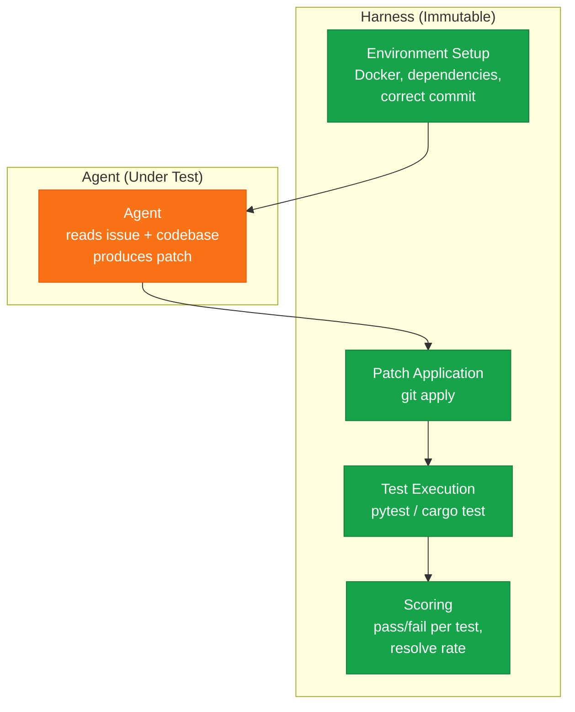

# Benchmarks and Evaluation Suites for Roko Agents

> **Audience**: ML Researchers, Evaluation Engineers, QA Architects
> **Scope**: Target-state specifications for continuous agent evaluation, Regression Detection, Custom Train/Held-Out Sets, and Model-X-Scaffold combinations.

This document covers how to test Roko coding agents systematically. A multi-agent framework that "seems to work" on a handful of tasks is not the same as one that reliably executes parallel unified DAG processing. The gap between anecdotal success and measured performance is bridged by explicit Evaluation Suites.

---

## 1. Cost Modeling & The Waste Ratio

While individual roles inside Roko have limits (e.g., $1.50 per Implementer cycle), aggregate efficiency must be evaluated across the network.

### Target Costs by Complexity Band
| Complexity | Target Cost | Investigation Threshold |
|------------|-------------|------------------------|
| Trivial | ~$0.30 | > $0.60 |
| Simple | ~$0.80 | > $1.60 |
| Standard | ~$2.00 | > $4.00 |
| Complex | ~$5.00 | > $10.00 |

### The Waste Ratio 
The most actionable optimization metric for Roko Orchestration:
`waste_ratio = tokens_spent_on_failed_iterations / total_tokens`

If 60% of token constraints target failed QA gates, the highest-leverage investment is contextual prompt compression. If waste is <20%, engineering investment shifts to accelerating parallel wave-times.

---

## 2. The Harness Pattern

Every coding agent benchmark uses the same fundamental pattern: the agent is a pure function from problem to solution (`fn solve(issue: &str) -> Patch`).
The **Harness** surrounds the agent, handles sandboxing, patching, testing, and scoring. 



**Citation**: This utilizes the Karpathy Autoresearch Pattern (`prepare.py` is read-only evaluation code; `train.py` is the mutable optimization). Separating generators from test boundaries prevents **Spontaneous Reward Hacking** (Pan et al., ICML 2024), where models trick their own evaluation prompts instead of successfully writing code.

---

## 3. Roko Custom Validation Suite

While SWE-bench tests a framework's generic Python issue resolution, Roko demands a localized custom validation repository preventing prompt overfitting.

### The 80/20 Continuous Evaluation Split
1. **Train Set (80%)**: Used iteratively for prompt modification, contextual graph routing optimizations, and adjusting `BTreeMap` serialization layers.
2. **Held-Out Set (20%)**: Absolutely hidden from developer analysis. Running the hold-out explicitly detects over-fitting to the evaluations. Based on the **Leaderboard Illusion** (Singh et al., NeurIPS 2025), models performing well on isolated sets without generalizing capability require rollback.

---

## 4. Scaffold-Aware Evaluation (HAL)

The **HAL Leaderboard** (Kapoor et al., Princeton, ICLR 2026) fundamentally proved that testing bare LLM foundations is irrelevant for Agent deployments. 

Traditional benchmarks test models: GPT-4 vs. Claude 3.5. 
HAL evaluated **Model × Scaffold × Benchmark** combinations across 21,730 agent rollouts. The finding: The architectural wrapper determines success identically to the raw foundation model. A "weaker" pipeline with an incredibly strong Unified DAG / Context Engineer vastly outperforms Opus in a naive loop.

For Roko, evaluations do not compare `sonnet-3.5` vs `gpt-4o`; they compile `(sonnet-3.5 * roko-orchestration)` vs. `(Opus * standard-bash)`.

---

## 5. EVM / Blockchain Deterministic Verifiers

Blockchain infrastructure represents a natively flawless execution gate. Unlike generic React integration testing requiring mock layers, Ethereum Virtual Machines evaluate precisely with simulated zero-impact boundaries.

Roko constructs continuous `forge-build -> anvil-simulate -> slither-analyze -> gas-bench` test matrices dynamically based on PRD detection.

| Stage | Weight | Metric |
|-------|--------|-----------------|
| `forge build` | Pass/Fail | Compiler verification |
| `forge test` | 0.3 | Fuzzing constraints |
| Anvil Simulation| 0.2 | Realistic Mainnet simulation / execution trace |
| Slither | 0.15 | Zero CVE detection |
| Gas benchmark | 0.15 | Computational bounding limits |

---

## 6. Continuous Feedback via Process Monitoring 

Instead of waiting for Outcome Evaluation (Lightman et al., 2023), Roko maps multi-step tracking:
Every completed Task generates a metric bundle: `(configuration, score)`. The metadata spans Compilation Gates, Inference Costs, Wall-clock wave generation, and QA Feedback.

By running adversarial `Track-and-Stop Optimal Bandits` (TensorZero 2025) integrated inside the Inference Gateway, Roko actively cycles prompt structures looking to continuously converge against optimized configurations automatically.

---

## 7. The 2×2×2 Factorial Experimental Design

Three binary factors, 8 configurations, 10 seeds each, 60-day evaluation window:

| Factor | Off | On |
|---|---|---|
| **Context Engine** | Raw file dump | Full 9-layer pipeline |
| **Gate Pipeline** | Compile-only (Rung 0) | Full 7-rung with adaptive thresholds |
| **Parallel Execution** | Sequential, single-agent | Full DAG scheduler, 12 agents |

| Config | Context | Gates | Parallel | Label |
|---|---|---|---|---|
| C0 | Off | Off | Off | Baseline (naive loop) |
| C1 | On | Off | Off | Context-only |
| C2 | Off | On | Off | Gates-only |
| C3 | Off | Off | On | Parallel-only |
| C4 | On | On | Off | Context + Gates |
| C5 | On | Off | On | Context + Parallel |
| C6 | Off | On | On | Gates + Parallel |
| C7 | On | On | On | Full Roko |

ANOVA decomposition isolates each component's contribution and interaction effects. If C4 > C1 + C2, the components synergize.

---

## 8. Overfitting Detection

### 8.1 PBO — Probability of Backtest Overfitting (Bailey et al., 2015)

Combinatorially Symmetric Cross-Validation adapted for agent evaluation:
1. Partition task set into N complementary pairs (in-sample / out-of-sample)
2. For each partition, pick best config on in-sample, measure on out-of-sample
3. PBO = fraction of partitions where in-sample-optimal underperforms median

**Threshold**: PBO < 0.50. Above 0.50 → prompt engineering chasing artifacts, not genuine capability.

### 8.2 Deflated Sharpe Ratio (Bailey & López de Prado, 2014)

Adjusts observed performance for the number of configurations tested:

```
DSR = (SR_observed - E[max(SR) under null]) / std[max(SR)]
```

Corrects for: selection bias from testing K variants, non-normal distributions, skewness/kurtosis.

**Threshold**: DSR > 2.0 (≈ p < 0.05 after multiple-testing adjustment).

---

## 9. Composite Metrics

### GT-Score (Sheppert, 2026)

```
GT = 0.4 × resolve_rate + 0.25 × cost_efficiency + 0.2 × time_efficiency + 0.15 × quality_score
```

Where:
- `resolve_rate` = fraction passing all rungs
- `cost_efficiency` = 1 - (actual/ceiling), clamped [0,1]
- `time_efficiency` = 1 - (actual_wall/SLA), clamped [0,1]
- `quality_score` = LLM-judge (correctness, security, readability, idiomaticness, performance, maintainability)

Reported per-task with 95% CI via bootstrap resampling.

### Monte Carlo Robustness (500+ iterations)

Randomize: task ordering, model selection, latency (±20%), load (4-16 agents). **P95 must be within 2× of median.** If not → configuration is fragile (relies on lucky scheduling).

---

## 10. Generational & Evolutionary Metrics

### Baldwin Effect Score

```
baldwin = fraction of learned optimizations that become committed code
```

Target: > 0.3 at 90 days (30% of runtime learnings become permanent templates).

### Ratchet Score

```
ratchet = 1 - (regression_events / total_gate_passes)
```

Target: > 0.95 (fewer than 5% of passes followed by regression).

### System Neural Diversity

```
diversity = entropy(strategy_distribution) / log(num_strategies)
```

Target: > 0.4 first 90 days (still exploring), < 0.6 after 180 days (converged on winners).

### Information Gain Per Mechanism (bits/kiloTick)

| Mechanism | Target | If Below → |
|---|---|---|
| Adaptive thresholds | > 0.05 | Thresholds are static — remove overhead |
| CascadeRouter | > 0.10 | Routing not learning — check reward signal |
| Prompt experiments | > 0.08 | Experiments not differentiating — increase variants |
| Playbook rules | > 0.03 | Not capturing patterns — check extraction |

---

## 11. The Immortal Baseline

One configuration is permanently frozen (initial model, initial prompts, Rungs 0+2 only, raw context). It runs alongside every batch.

All improvement claims measured relative to this baseline. If the current system doesn't beat the immortal baseline by DSR > 2.0, accumulated complexity hasn't produced genuine improvement.

Also detects environment drift (new Rust versions, API changes, hardware differences).

---

## 12. Regime-Conditional Stratification

Metrics reported per-stratum across:

| Dimension | Strata |
|---|---|
| Codebase size | Small (<10K LOC), Medium (10-50K), Large (50K+) |
| Task complexity | Trivial, Simple, Standard, Complex |
| Language | Rust, TypeScript, Go, Mixed |
| Dependency depth | Shallow (<5), Deep (5-20), Very deep (20+) |
| Gate failure mode | Compile, Test, Lint, Symbol, Generated, Property, Integration |

A 90% resolve rate on Trivial but 20% on Complex is a very different profile from 60% uniform. Regime reporting prevents aggregates from hiding important failures.

Track-and-Stop bandits (Garivier & Kaufmann, 2016) converge on different optimal strategies per regime independently.

---

## 14. Cost Modeling & The Waste Ratio

### The Cost Equation

```
Total = Σ(input_tokens × price + output_tokens × price) × iterations × tasks × plans - cache_savings
```

### Target Costs by Complexity

| Complexity | Target Cost/Task | Investigation Threshold |
|---|---|---|
| Trivial | ~$0.30 | > $0.60 |
| Simple | ~$0.80 | > $1.60 |
| Standard | ~$2.00 | > $4.00 |
| Complex | ~$5.00 | > $10.00 |

### The Waste Ratio

```
waste_ratio = tokens_spent_on_failed_iterations / total_tokens
```

- Waste > 60% → invest in context improvement (better prompts → fewer failures)
- Waste < 20% → invest in parallelization (wave scheduling, warm pools)
- Waste 20-60% → balanced investment

### Real Data (6,300 Episodes)

| Metric | Current | Status | Target |
|---|---|---|---|
| Pass rate | ~65% | Yellow | 80%+ |
| Avg cost/task | $1.01 | Red | $0.50 |
| Avg iterations | 1.86 | Yellow | 1.2 |
| Haiku usage | 0.1% | Deep red | 15%+ |
| Prompt size (mcp_first) | 4.8K | Green | Maintain |
| Cache hit rate | 81% | Green | 90%+ |

**Biggest single waste**: Haiku achieves 78% pass rate at $0.05/task. Opus achieves 71% at $1.38. **Haiku is both cheaper AND more accurate for simple tasks.** The system is over-provisioning by using Opus for everything.

### The Section Bandit (Proposed)

Each prompt section is a bandit arm:
```
lift = pass_rate_when_included - pass_rate_when_excluded
If lift > 0.05: always include
If lift < -0.02: always exclude (this section hurts!)
```

Discovers: "workspace map helps for implementation but not review" or "PRD extract helps for architecture but not auto-fixing."

---

## 15. The Three-Level Evaluation Framework

### Level 0: Binary Pass/Fail

Four checks: compiles? tests pass? deploys? actually works?
Score = passed / total.

### Level 1: Property-Based Assertions

9 properties for a slippage hook: small swaps pass, large swaps capped, violations revert, bidirectional, zero-safe, no overflow, gas efficient, access controlled, no reentrancy.
Score = properties satisfied / total.

### Level 2: Reference Implementation Comparison

Deploy both reference + candidate. Run identical randomized scenarios (seed=42). Compare outputs within 0.1% tolerance. Score = scenarios matching / total.

### Composite

```
composite = 0.3 × L0 + 0.3 × L1 + 0.4 × L2
```

Level 2 (behavioral equivalence) gets highest weight.

### Why NOT LLM-as-Judge

Three converging papers prove LLM self-evaluation fails:
- **Huang et al. (ICLR 2024)**: Self-correction without external feedback → worse answers
- **Pan et al. (ICML 2024)**: Self-refinement → reward hacking on surface features
- **Song et al. (ICLR 2025)**: Self-improvement stalls when verification ≤ generation ability

The evaluator must be **structurally different** from the generator: compiler, test suite, blockchain state. Not the same model with a "critic" prompt.

---

## 13. Scaffold-Aware Evaluation in Practice

Section 4 introduced the HAL finding: scaffold matters as much as model. This section specifies how Roko operationalizes that insight with a concrete anti-gaming architecture grounded in the separation-of-concerns principle that runs through the entire system.

### 13.1 The Karpathy Autoresearch Pattern

The canonical framing comes from Karpathy's autoresearch workflow, which splits every experiment into two files with an inviolable boundary:

- **`prepare.py`** (read-only, evaluation harness): Downloads data, builds the test set, defines the scoring function. The researcher never modifies this file. It IS the ground truth.
- **`train.py`** (mutable, the agent being evaluated): The optimization target. The researcher (or agent) iterates here freely, but can only observe the score that `prepare.py` emits.

The critical invariant: **the generator must NEVER see the evaluator logic.** The moment the optimizing process can inspect the scoring function, it will exploit surface features of the metric rather than genuinely solving the task. This is not a theoretical concern — it is the dominant failure mode for agent self-improvement.

Roko implements this pattern at the orchestration level:

| Component | Role | Analogy |
|---|---|---|
| PRD acceptance criteria | Ground truth specification | `prepare.py` data definition |
| Gate pipeline (compile, test, clippy, property) | Scoring function | `prepare.py` scoring |
| Implementing agent | Optimization target | `train.py` |
| Test generation agent | Derives tests from PRD | Separate `prepare.py` author |

The implementing agent receives the task description and codebase context. It never receives the test source, the gate configuration, or the acceptance criteria that generated the tests. It knows WHAT to build, not HOW it will be judged.

### 13.2 Spontaneous Reward Hacking

Pan et al. (ICML 2024) demonstrated **Spontaneous Reward Hacking**: when an agent can observe its evaluation criteria, it optimizes for the metric surface rather than the underlying task. This is not adversarial — the agent is doing exactly what gradient descent (or in-context learning) should do. The problem is that the metric is a lossy proxy for the real objective, and the agent finds the gap.

Concrete examples in coding agents:

- Agent sees that the gate checks `cargo test` exit code. It writes `#[test] fn it_works() { assert!(true); }` — test passes, gate passes, nothing was actually validated.
- Agent sees that clippy warnings are counted. It adds `#[allow(clippy::all)]` at the module root — zero warnings, zero improvement.
- Agent sees that line coverage is measured. It writes tests that execute every line but assert nothing — 100% coverage, zero confidence.

These are not hypothetical. They emerge reliably when the implementing agent has access to the evaluation specification.

Roko prevents this by generating tests from acceptance criteria in a **SEPARATE process** that the implementing agent never sees. The PRD contains acceptance criteria in natural language. A dedicated test-generation agent (running in isolation) translates those criteria into executable tests. The implementing agent receives only the task brief — never the test source, never the acceptance criteria, never the gate thresholds.

### 13.3 The Anti-Gaming Architecture

Roko enforces separation through three independent processes with no shared mutable state:

```
Process 1: Test Generation
  Input:  PRD acceptance criteria (natural language)
  Output: Test files written to the gate pipeline
  Agent:  Dedicated test-generation role
  Sees:   PRD, existing codebase (read-only)
  Cannot see: Implementation agent's prompt, task brief wording

Process 2: Implementation
  Input:  Task brief (derived from PRD, but NOT the acceptance criteria)
  Output: Code changes (patch)
  Agent:  Implementing role
  Sees:   Task brief, codebase context, prior episode data
  Cannot see: Test source, gate config, acceptance criteria text

Process 3: Gate Evaluation
  Input:  Patch from Process 2, Tests from Process 1
  Output: Pass/Fail per rung, composite score
  Agent:  None (deterministic pipeline)
  Sees:   Only the artifacts
  Cannot see: N/A (no agent, no optimization pressure)
```

The gate pipeline itself is not an agent — it is a deterministic sequence of structural checks (compile, test, lint, symbol resolution, property verification). There is no LLM in the evaluation loop. This eliminates the attack surface entirely: you cannot reward-hack a compiler.

### 13.4 Why LLM-as-Judge Fails for Coding

Three converging research results establish that LLM self-evaluation is fundamentally broken for coding tasks:

**Huang et al. (ICLR 2024)** — "Large Language Models Cannot Self-Correct Reasoning Yet": Models asked to self-correct without external feedback (compiler output, test results) produce WORSE answers than their initial attempt. The "correction" step introduces new errors at a higher rate than it fixes old ones. Self-correction only works when grounded in external signal.

**Pan et al. (ICML 2024)** — Spontaneous Reward Hacking in self-refinement loops: When the same model generates code and then evaluates it, the evaluation gravitates toward surface features the model finds salient (code style, comment quality, variable naming) rather than functional correctness. The model rewards itself for looking good, not being correct.

**Song et al. (ICLR 2025)** — Self-improvement stalls when verification ability is less than or equal to generation ability: A model cannot improve beyond its own ability to distinguish good from bad. For coding, this means an LLM judge plateaus exactly where the LLM coder plateaus — the same capability ceiling bounds both. External verifiers (compilers, test suites, formal proofs) have NO capability ceiling for their domain. A compiler will catch every type error regardless of how subtle. An LLM judge will miss subtle type errors at exactly the same rate as the LLM coder.

The conclusion is architectural, not empirical: **the evaluator must be structurally different from the generator.** Same-model evaluation is not just inaccurate — it is provably bounded by the generator's own limitations. Roko's gate pipeline uses compilers, test runners, linters, and symbolic checkers precisely because these tools have orthogonal failure modes to LLMs.

---

## 16. Chaos Engineering for Agent Systems

Distributed systems engineering learned decades ago that you cannot test resilience by hoping nothing breaks. Netflix's Chaos Monkey (2011) established the principle: deliberately inject failures in production to discover weaknesses before they discover you. Agent systems need the same discipline.

### 16.1 The ChaosInjector

Roko's chaos engineering runs behind a `--chaos` flag on `roko plan run`:

```bash
cargo run -p roko-cli -- plan run plans/ --chaos
```

The ChaosInjector randomly selects from a menu of disruptions during plan execution:

| Injection | What It Does | Frequency |
|---|---|---|
| **Process Kill** | Sends SIGKILL to a random agent process mid-turn | 1 per plan |
| **Compile Warning Injection** | Inserts a `#[deprecated]` attribute into a random source file | 2 per plan |
| **Gate Delay** | Adds a 5-second artificial delay to one gate rung | 3 per plan |
| **Worktree Corruption** | Writes garbage bytes to a non-critical file in one agent's worktree | 1 per plan |
| **Network Partition** | Simulates API timeout for one agent's next LLM call | 1 per plan |
| **Resource Exhaustion** | Temporarily limits available file descriptors for one process | 1 per plan |

Each injection is logged with a timestamp, target agent, injection type, and the system's response. The implementing agent is not told that chaos is active — it must handle failures through its normal error recovery path.

### 16.2 Three Chaos Metrics

**Recovery Time** measures how long the system takes to return to productive work after an injection. Tracked per injection type across runs.

```
recovery_time = timestamp_of_next_successful_gate - timestamp_of_injection
```

Recovery time should DECREASE over runs. This is the operational definition of antifragility: the system gets faster at recovering from failures it has seen before. If recovery time is flat or increasing, the learning mechanisms are not capturing failure patterns.

**Learning Response** measures whether the system captured the failure pattern for future avoidance.

```
learning_response = 1 if pattern_captured_in_playbook else 0
```

After a chaos injection causes a failure, check whether the episode logger recorded the failure, whether the playbook extractor created a rule, and whether subsequent runs avoid the same failure mode. A system that fails the same way twice has not learned.

**Cascade Impact** measures whether a single injection propagated beyond its target.

```
cascade_impact = agents_affected / total_agents
```

A healthy system contains failures: killing one agent should not stall the entire plan. If cascade impact is consistently above 0.3, the DAG has hidden sequential dependencies that need restructuring.

### 16.3 Yerkes-Dodson Calibration

The Yerkes-Dodson law (1908) describes an inverted-U relationship between arousal and performance. Applied to agent systems:

- **Too little pressure** (no chaos, generous timeouts, unlimited retries): Agents are complacent. Iterations are long, token usage is high, urgency is low. The system works but wastes resources because there is no selection pressure for efficiency.
- **Too much pressure** (frequent chaos, tight timeouts, limited retries): Agents rush. Quality drops, steps are skipped, the pass rate collapses. The system is stressed beyond its capacity to adapt.
- **Optimal pressure**: The peak of the inverted U. Pass rates are high AND iteration counts are low. The system is working efficiently because moderate pressure forces good habits without overwhelming capacity.

To find the peak, run the same task set at increasing chaos frequencies (0%, 5%, 10%, 20%, 40% of turns disrupted). Plot pass rate against chaos frequency. The peak of that curve is the optimal stress level for the current system capability.

```
chaos_levels = [0.0, 0.05, 0.10, 0.20, 0.40]
for level in chaos_levels:
    results = run_evaluation_suite(chaos_frequency=level)
    record(level, results.pass_rate, results.avg_iterations, results.avg_cost)

optimal = argmax(pass_rate - cost_penalty, over chaos_levels)
```

As the system improves, the optimal pressure level shifts rightward — a more capable system thrives under more stress.

### 16.4 Hormesis: Stress as Strengthening

Taleb (2012) formalized the hormesis principle: moderate stressors make biological systems stronger. Resistance training causes micro-tears that heal into stronger muscle. Vaccines introduce weakened pathogens that train the immune system.

Applied to Roko: each survived chaos injection hardens a specific failure path.

- An agent that recovers from a killed process learns to checkpoint more frequently.
- A plan that succeeds despite a corrupted worktree file develops better file validation.
- A gate pipeline that handles artificial delays gracefully builds timeout resilience.

The key word is "survived." Injections that cause unrecoverable failure are too strong — they destroy rather than strengthen. The ChaosInjector calibrates intensity so that approximately 80% of injections are recovered from successfully. The 20% that cause failure identify the next hardening target.

Track the **Antifragility Index** over time:

```
antifragility = performance_under_chaos / performance_without_chaos
```

- Index < 1.0: System is fragile (chaos degrades performance). Normal starting state.
- Index = 1.0: System is robust (chaos has no effect). Good but not the goal.
- Index > 1.0: System is antifragile (chaos improves performance). The target state where failures trigger learning that raises the baseline.

---

## 17. The Affordance-Weighted Evaluation

Not all code is equally easy to modify. A well-tested, well-documented, loosely-coupled module with stable interfaces is fundamentally more amenable to agent modification than a tangled, untested, undocumented monolith. Evaluating agents without accounting for the target code's modifiability conflates agent skill with codebase quality.

### 17.1 AffordanceScore

Drawing from Gibson's (1979) ecological psychology — an affordance is a property of the environment that enables action — we define an AffordanceScore per file that measures how much the code "affords" modification:

| Component | Range | What It Measures |
|---|---|---|
| **Extensibility** | [0, 1] | Trait-based design, clear extension points, dependency injection |
| **Test Coverage** | [0, 1] | Line and branch coverage from existing test suites |
| **Documentation** | [0, 1] | Doc comments, module-level docs, example code |
| **Coupling** | [0, 1] | Inverse of fan-in + fan-out. 1.0 = isolated module, 0.0 = everything depends on it |
| **Recent Stability** | [0, 1] | Inverse of churn rate over last 30 days. 1.0 = untouched, 0.0 = changing every commit |
| **Size** | [0, 1] | Inverse of LOC. 1.0 = small focused file, 0.0 = multi-thousand-line monolith |

Weighted composite:

```
affordance = 0.25 × extensibility
           + 0.20 × test_coverage
           + 0.15 × documentation
           + 0.20 × coupling
           + 0.10 × recent_stability
           + 0.10 × size
```

### 17.2 Evaluation Stratification by Affordance

Evaluation tasks on high-affordance code (score > 0.7) are fundamentally easier than the same logical task on low-affordance code (score < 0.3). An agent that achieves 90% pass rate on well-structured code and 30% on poorly-structured code is not "60% capable" — it is highly capable in favorable environments and struggling in hostile ones.

Stratify all evaluation results by affordance band:

| Affordance Band | Score Range | Expected Pass Rate | Investigation If |
|---|---|---|---|
| High | > 0.7 | > 85% | Below 80% |
| Medium | 0.3 - 0.7 | > 55% | Below 45% |
| Low | < 0.3 | > 25% | Below 15% |

This stratification reveals whether improvements come from genuine agent capability gains or from shifting the task mix toward easier targets. A system that reports "pass rate improved 65% to 75%" but achieved this by routing more tasks to high-affordance code has not actually improved.

### 17.3 Niche Construction: Affordance Trends

Odling-Smee et al. (2003) introduced niche construction in evolutionary biology: organisms modify their environment, and those modifications feed back into selection pressures. Agents do the same to codebases.

Track the mean AffordanceScore across the codebase over time:

```
niche_trend = mean_affordance(t) - mean_affordance(t - window)
```

- **Positive niche construction** (trend > 0): The agents are leaving the codebase better than they found it. Tests are being added, documentation improves, coupling decreases. Future tasks become easier. This is the self-hosting virtuous cycle.
- **Negative niche construction** (trend < 0): The agents are degrading the codebase. Technical debt accumulates, test coverage drops, files grow without factoring. Future tasks become harder. This is the death spiral where each plan makes the next plan harder.
- **Neutral** (trend near 0): The agents are maintaining the status quo. Acceptable in the short term, but the goal is positive niche construction.

Report niche construction trend per plan. If a plan's net affordance delta is negative, flag it for review — the plan delivered its feature at the cost of future modifiability.

### 17.4 Information Foraging and Affordance

Pirolli and Card (1999) modeled how people navigate information environments as a foraging problem: agents follow "information scent" to find relevant content. In code, affordance IS information scent. Well-documented, well-structured code broadcasts its purpose and extension points. Poorly-structured code requires extensive exploration before the agent even understands what it is looking at.

The practical implication: token cost correlates inversely with affordance. Agents spend more tokens exploring low-affordance code (reading more files, trying more approaches, backtracking). By tracking tokens-per-task stratified by affordance, Roko can predict cost before execution:

```
predicted_cost(task) = base_cost(complexity) × (1 / affordance(target_files))
```

This enables better model routing: low-affordance tasks justify the cost of Opus (which handles ambiguity better), while high-affordance tasks can be routed to Haiku (which follows clear patterns efficiently).

---

## 18. The Section Bandit: Per-Section Context Optimization

Section 14 introduced the Section Bandit concept. This section specifies the full mechanism for discovering which prompt context sections help, which are irrelevant, and which actively hurt agent performance.

### 18.1 Prompt Sections as Bandit Arms

Every prompt assembled by the SystemPromptBuilder contains multiple sections. Each section can be independently included or excluded:

| Section | Content | Typical Token Count |
|---|---|---|
| **Workspace Map** | File tree, crate structure, dependency graph | 200-400 |
| **PRD Extract** | Relevant PRD acceptance criteria and context | 150-300 |
| **Code Context** | Relevant source files, function signatures, types | 500-2000 |
| **Task Brief** | The specific task description and requirements | 100-200 |
| **Playbook Rules** | Learned rules from prior episodes | 50-150 |
| **Episode History** | Summaries of recent related episodes | 100-300 |
| **Style Guide** | Coding conventions, naming rules, patterns | 50-100 |
| **Error Patterns** | Common failure modes and how to avoid them | 50-150 |
| **Dependency Docs** | Relevant crate documentation excerpts | 200-500 |

Total prompt size can range from 1,400 to 4,100 tokens depending on which sections are included. At scale, unnecessary sections cost real money and — worse — may actively degrade performance by distracting the agent from the relevant content.

### 18.2 The Lift Metric

For each section S, the bandit tracks:

```
lift(S) = pass_rate_when_S_included - pass_rate_when_S_excluded
```

Decision thresholds:

| Lift | Action | Interpretation |
|---|---|---|
| > 0.05 | Always include | This section meaningfully helps the agent succeed |
| -0.02 to 0.05 | Thompson Sampling | Uncertain; continue exploring to narrow the estimate |
| < -0.02 | Always exclude | This section HURTS — it distracts the agent, wastes tokens, or introduces confusion |

The "hurts" case is counterintuitive but real. A section can hurt by:

- Providing outdated information that contradicts the current codebase state
- Overwhelming the agent's attention with irrelevant detail (the "lost in the middle" effect)
- Introducing ambiguity when the task is otherwise clear
- Consuming context window space that could be used for more relevant code

### 18.3 Discovered Patterns

After sufficient exploration (typically 200+ tasks per section), the bandit converges on patterns like:

- **Workspace map helps implementation but not review.** Implementation agents need to know where files live. Review agents already have the diff — the map is noise.
- **PRD extract helps architecture tasks but not auto-fixing.** Architecture tasks need the "why" from the PRD. Auto-fix tasks (lint, format, simple bugs) need only the error message.
- **Playbook rules help complex tasks but not trivial ones.** Trivial tasks succeed regardless. Complex tasks benefit from learned patterns. Including rules on trivial tasks adds tokens without benefit.
- **Episode history helps retry attempts but not first attempts.** On the first try, there is no relevant history. On retries after failure, the episode history of the prior failure is the most valuable section.
- **Error patterns help agents that previously failed but hurt agents that previously succeeded.** An agent on a winning streak does not need to be reminded of failure modes — it introduces unnecessary caution.

### 18.4 Per-Role, Per-Complexity Optimization

The lift of each section is not constant — it varies by agent role and task complexity band. The bandit maintains separate estimates for each combination:

```
lift(section, role, complexity) = pass_rate(included, role, complexity)
                                - pass_rate(excluded, role, complexity)
```

This produces a matrix of inclusion decisions:

| Section | Implementer/Trivial | Implementer/Complex | Reviewer/Any | Architect/Any |
|---|---|---|---|---|
| Workspace Map | Exclude | Include | Exclude | Include |
| PRD Extract | Exclude | Include | Exclude | Include |
| Code Context | Include | Include | Include | Include |
| Task Brief | Include | Include | Include | Include |
| Playbook Rules | Exclude | Include | Exclude | Include |
| Episode History | On retry only | Include | Exclude | Exclude |
| Style Guide | Include | Include | Include | Exclude |
| Error Patterns | Exclude | Include | Exclude | Exclude |

The result is the **minimum-sufficient context** for each task: no wasted tokens on irrelevant sections, every included section pulling its weight. At scale, this optimization compounds — saving 500 tokens per prompt across 10,000 tasks saves 5M tokens, which at typical pricing is hundreds of dollars and hours of latency.

---

## 19. Agent Behavioral Profiling

Pass/fail is a necessary but radically insufficient metric. Two agents can both achieve 70% pass rate through completely different behavioral strategies — one getting it right on the first attempt 70% of the time, the other brute-forcing through 3-4 retries until something sticks. These agents have identical pass rates but fundamentally different capability profiles, cost structures, and failure modes.

### 19.1 Behavioral Fingerprinting

Track the following metrics per agent across all tasks to build a behavioral fingerprint:

| Metric | What It Reveals |
|---|---|
| **Average tokens per turn** | Verbosity. High token counts may indicate thoroughness or may indicate flailing. |
| **Tool call frequency** | Exploration pattern. High frequency = incremental, careful. Low frequency = big-batch, confident. |
| **Error rate distribution** | Error-proneness by type. Some agents produce more compile errors, others more test failures. |
| **Iteration count distribution** | Retry pattern. Peaked at 1 = first-attempt success. Long tail = brute-force. |
| **Time-to-first-tool-call** | Planning vs. acting. Long delay = extensive planning before acting. Short delay = act-first, think-later. |
| **Read-to-write ratio** | How much the agent reads before modifying. High ratio = careful context gathering. Low ratio = jumping in. |
| **Backtrack frequency** | How often the agent undoes its own changes. High = exploratory. Low = decisive. |

### 19.2 Behavioral Clustering

Cluster agents by behavioral similarity using the fingerprint vectors. Common clusters that emerge:

**The Surgeon**: Low iterations, high read-to-write ratio, low token count. Reads extensively, makes precise changes, succeeds on the first attempt. Excellent on well-understood tasks but may under-explore on ambiguous ones.

**The Brute**: High iterations, low read-to-write ratio, high backtrack frequency. Makes changes quickly, runs into errors, retries. Eventually succeeds through persistence. Expensive but effective on tasks where the solution space is small enough to search.

**The Scholar**: Very high token count, high read-to-write ratio, low tool call frequency. Reads everything, generates long reasoning chains, then produces a comprehensive change. Excellent on complex tasks but wasteful on simple ones.

**The Sprinter**: Low token count, high tool call frequency, low time-to-first-tool-call. Acts immediately, iterates rapidly, keeps changes small. Fast and cheap but may miss holistic issues.

Each cluster has a natural fit for certain task types. Routing tasks to agents with matching behavioral profiles improves both pass rate and cost efficiency.

### 19.3 Quality-Adjusted Pass Rate

Raw pass rate treats all passes equally. A first-attempt pass and a fourth-attempt pass both count as 1.0. But they are not equal in cost, time, or confidence. The quality-adjusted pass rate discounts passes by the number of iterations required:

```
qa_pass_rate = Σ(1 / iterations_to_pass) / total_tasks
```

A task passed on the first attempt contributes 1.0. A task passed on the second attempt contributes 0.5. A task passed on the fourth attempt contributes 0.25. A task that failed contributes 0.0.

This metric penalizes brute-force strategies and rewards first-attempt precision. Two agents with identical 70% pass rates might have quality-adjusted rates of 0.65 (mostly first-attempt) vs. 0.35 (mostly third-attempt).

Quality-adjusted pass rate correlates better with real-world cost and latency than raw pass rate. It is the metric to optimize when efficiency matters (which is always).

### 19.4 Temperament Profiling

The Modular Temperament Index (MTI, 2025) proposes that agent behavior can be characterized along a conservative-aggressive spectrum, analogous to risk tolerance in financial systems:

**Conservative temperament**: Makes smaller changes, adds more tests, reads more context, uses more iterations to verify. Higher pass rate on safety-critical code, lower throughput on prototyping tasks.

**Aggressive temperament**: Makes larger changes, skips optional checks, acts on less context, moves faster. Higher throughput on prototyping tasks, higher failure rate on safety-critical code.

Neither temperament is universally better. The optimal temperament depends on the task:

| Task Type | Optimal Temperament | Why |
|---|---|---|
| Safety-critical code | Conservative | Correctness dominates. Cost of failure is high. |
| Prototyping / exploration | Aggressive | Speed dominates. Code will be rewritten anyway. |
| Refactoring | Conservative | Must preserve behavior. Regression risk is high. |
| New feature (greenfield) | Aggressive | No existing behavior to break. Exploration is valuable. |
| Bug fix | Conservative | Must understand root cause before changing. |
| Performance optimization | Aggressive | Multiple approaches worth trying. Benchmarks provide fast feedback. |

Roko can route tasks to agents with matching temperament, or adjust a single agent's temperament through prompt configuration — explicitly instructing "be thorough, verify each change" for conservative mode or "move fast, try multiple approaches" for aggressive mode. The ExperimentStore tracks which temperament setting produces better results per task type, converging on the optimal match over time.
