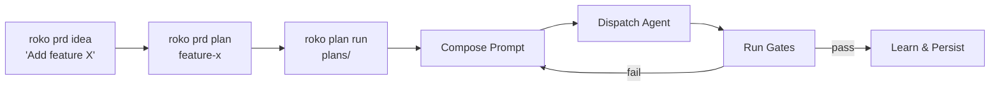
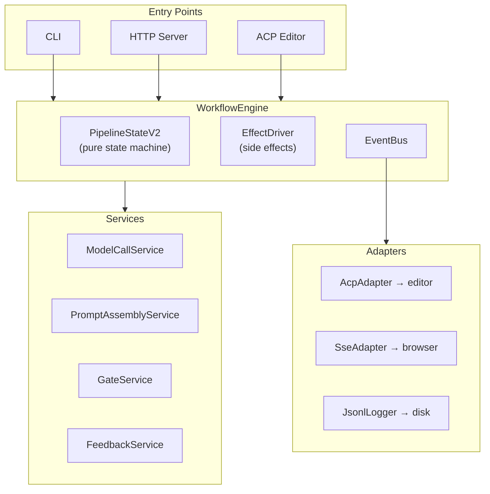

## What is Roko?

Roko is a Rust toolkit for building **agents that build themselves**. It reads PRDs (product requirement documents), generates implementation plans, dispatches AI agents to execute tasks, validates results through a verification pipeline, persists learnings, and iterates. The entire system is designed to self-host — Roko develops Roko.

This PR replaces the previous monolithic execution path with a composable, testable runtime architecture, adds editor integration via the ACP protocol, ships a React demo dashboard, restructures all documentation, and brings the system to full self-hosting readiness.

**492+ commits | 815+ files changed | 180K+ insertions | 44K deletions | 18 crates touched**

---

## How Roko works (the 30-second version)



For each task, Roko builds a 9-layer system prompt (with knowledge + playbooks), dispatches it to an AI model (Claude, GPT, Gemini, Ollama, etc.), validates the output through a 7-rung gate pipeline (compile → lint → test → ... → integration), and persists learnings (episodes, playbooks, knowledge store). If gates fail, it replans and retries.

---

## What this PR changes

This is a large PR that touches every layer of the system. Here's a map of the major change areas:

| Area | What changed | Why it matters |
|---|---|---|
| [Runtime Architecture](#runtime-architecture) | New WorkflowEngine replaces monolithic orchestrate.rs | Testable, composable, observable execution |
| [ACP Protocol Server](#acp-protocol-server) | New crate for editor integration | VS Code, Zed, Neovim can drive Roko |
| [Agent Subsystem](#agent-subsystem) | New provider, safety hardening, session reuse | More models, safer execution, faster dispatch |
| [Verification Pipeline](#verification-pipeline) | Gate improvements, error memory, forensics | More reliable self-validation |
| [Learning System](#learning-system) | Contextual bandits, knowledge admission, feedback loops | System improves with use |
| [Demo Dashboard](#demo-dashboard) | 15-page React app with real-time visualization | See what Roko is doing, live |
| [Documentation](#documentation-restructuring) | 3-layer docs architecture, 5 integration guides | Actually understandable now |
| [Codebase Refactoring](#codebase-refactoring) | Decomposed mega-files, modularized config | Maintainable, navigable code |

---

## Runtime Architecture

### The problem

Previously, all execution logic lived in a single 12,000+ line file (`orchestrate.rs`). Agent dispatch, gate running, prompt assembly, feedback recording, and state management were all interleaved. This made it nearly impossible to test individual pieces, add new execution modes, or reason about state transitions.

### The solution: WorkflowEngine

The new architecture separates concerns into four layers:



**Why this design?** The key insight is separating `PipelineStateV2` (a pure state machine that takes events and returns actions) from `EffectDriver` (which actually spawns agents, runs gates, etc.). This means you can test the entire state machine by feeding it synthetic events — no real agents, no real LLM calls. The same engine powers CLI, HTTP server, and editor integrations with zero code duplication.

<details>
<summary><strong>Foundation Layer details (P0A–P0C)</strong></summary>

The contract system that all subsystems implement against:

- **RuntimeEvent** — 14-variant enum covering lifecycle, agent, gate, feedback, and persistence events. Each event is wrapped in a `RuntimeEventEnvelope` carrying `run_id`, sequence number, timestamp, and schema version for forward compatibility.
- **6 foundation traits** — `ModelCaller` (call an AI model), `PromptAssembler` (build a system prompt), `FeedbackSink` (record outcomes), `GateRunner` (run verification), `EventConsumer` (react to events), `EffectExecutor` (perform side effects) — plus `AffectPolicy` for behavioral modulation.
- **EventBus** — Generic typed event bus via `OnceLock<Mutex<HashMap<TypeId, ...>>>` supporting multiple event types through single infrastructure.

</details>

<details>
<summary><strong>Service Layer details (P1A–P1D, S01–S13)</strong></summary>

Concrete implementations of foundation traits, wiring existing subsystem code into the new contract system.

**ModelCallService (~2.1K LOC)** wraps provider dispatch with a 9-cell pipeline:
1. Cache (L1 exact-match, 128 entries)
2. Budget (per-service token tracking)
3. Thinking cap (reasoning token limits)
4. Convergence detection (5-window, 0.85 similarity — stops when agent is repeating itself)
5. Provider call (actual LLM invocation)
6. Gateway event writer (durable JSONL log)
7. Knowledge query (inject relevant knowledge into context)
8. Force-backend override learning for cascade router
9. Knowledge-informed routing via trait-erased adapter

**PromptAssemblyService (~1.4K LOC)** wraps the 9-layer `SystemPromptBuilder`:
- Composable `ContextSource` trait for neuro/knowledge, episodes, and playbooks
- Section effectiveness scoring for future A/B tuning
- Tracks which prompt sections and knowledge IDs contributed to each dispatch

**FeedbackService (~1.2K LOC)** records ModelCall, GateResult, and WorkflowComplete events to JSONL, feeds the cascade router's bandit observations, and tracks provider/model pass rates.

**GateService (~1.1K LOC)** runs the 7-rung verification pipeline with adaptive thresholds (EMA-smoothed per-rung from `.roko/learn/gate-thresholds.json`).

</details>

<details>
<summary><strong>Engine Layer details (E01–E08, P2A–P2D)</strong></summary>

**PipelineStateV2 (~1.1K LOC)** — Pure state machine:
- 3 workflow templates: **Express** (implement→gate→commit), **Standard** (+review), **Full** (+strategy planning)
- 10 phases: Pending → Strategizing → Implementing → Gating → AutoFixing → Reviewing → Committing → Complete/Halted/Cancelled
- Config-driven iteration limits and autofix attempts
- Checkpoint serialization + resume from JSON (survive crashes)

**TaskScheduler (378 LOC)** — Pure DAG resolver with file-based conflict detection. Prevents two agents from modifying the same files concurrently.

**EffectDriver (~860 LOC)** — Executes the actions that `PipelineStateV2` requests: SpawnAgent, RunGates, Commit, Checkpoint. Integrates with `AffectPolicy` to modulate agent behavior (temperature, turn limits, exploration rate). Emits RuntimeEvents so observers can track progress.

**WorkflowEngine (~1.7K LOC)** — The facade that ties it all together. Its `run()` method is the single entry point used by CLI, server, and ACP. Returns a `WorkflowRunReport` with outcomes, gate results, token counts, and cost.

</details>

<details>
<summary><strong>Adapter Layer details (P3A–P3C)</strong></summary>

- **AcpAdapter** (196 LOC) — Translates RuntimeEvents into CognitiveEvents for the ACP editor protocol. Filters by run_id.
- **SseAdapter** (198 LOC) — Streams RuntimeEvents to connected browser clients via Server-Sent Events.
- **JsonlLogger** (139 LOC) + **RuntimeProjection** (179 LOC) — Durable event persistence to `.roko/events.jsonl` + state reconstruction from the event log.

</details>

<details>
<summary><strong>Wiring Layer details (P4A–P4B, W01–W08)</strong></summary>

- CLI: `--engine v2/legacy` flag, WorkflowEngine as default for `roko run` and `plan run`
- Server: SSE + StateHub integration, background task event consumers
- ACP: `run_with_workflow_engine()` uses the same ServiceFactory as CLI/server — zero duplication

</details>

---

## ACP Protocol Server

### What is ACP?

ACP (Agent Client Protocol) is how editors talk to Roko. Think of it like LSP (Language Server Protocol), but for AI agents instead of language analysis. When you run `roko acp`, it starts a JSON-RPC 2.0 server on stdin/stdout. Your editor sends prompts and receives streaming cognitive events — token chunks, tool calls, gate results, plan updates, and cost tracking.

### Why does this matter?

Without ACP, Roko only runs from the command line. With ACP, any editor (VS Code, Zed, Neovim, JetBrains) can drive the full Roko pipeline — same WorkflowEngine, same gates, same learning, same knowledge store. The editor becomes a thin UI over Roko's capabilities.

<details>
<summary><strong>ACP implementation details (~9.7K LOC, new crate)</strong></summary>

- **Transport**: Newline-delimited JSON over stdin/stdout (async tokio)
- **Sessions**: Multi-session support with conversation history (40 turns, 64KB limit), mode switching (code/plan/research), per-session config (model, workflow, routing, gates)
- **Dispatch**: Pipeline path (Express/Standard/Full templates) and single-agent path
- **Events**: `CognitiveEvent` stream — TokenChunk, ThinkingChunk, ToolCallStart/Complete, PlanUpdate, CostUpdate, Complete
- **Knowledge**: Dual async queries (neuro store + playbook store) with visible knowledge cards
- **Convergence**: Same WorkflowEngine, ServiceFactory, and FeedbackService as CLI/server
- **Persistence**: Session snapshots in `.roko/acp/sessions/{session_id}/`

**Methods:**

| Method | Description |
|---|---|
| `initialize` | Handshake with capability exchange, protocol version negotiation |
| `session/new` | Create session with mode (code/plan/research) + model config |
| `session/message` | Send prompt, receive streaming CognitiveEvent notifications |
| `session/configure` | Update session settings (model, gates, workflow template) |
| `session/close` | End session, flush episodes, persist state |
| `session/set_config_option` | Per-option update (9 option IDs with type-safe values) |
| `$/cancelRequest` | Cancel in-flight operation via CancellationToken |

**CognitiveEvent variants:**

| Variant | When it fires |
|---|---|
| `TokenChunk` | Each streaming token from the agent |
| `ThinkingChunk` | Extended thinking / reasoning content |
| `ToolCallStart` | Agent begins a tool invocation |
| `ToolCallComplete` | Tool finishes, includes file changes |
| `PlanUpdate` | Phase transitions or strategy changes |
| `CostUpdate` | Per-turn usage delta (tokens + cost) |
| `Complete` | Session message fully processed |

```bash
# Start ACP server (editor integration)
roko acp

# With explicit model
roko acp --model claude-sonnet-4-20250514
```

Full protocol reference: [`docs/v2/ACP-INTEGRATION-GUIDE.md`](https://github.com/Nunchi-trade/roko/blob/wp-arch2/docs/v2/ACP-INTEGRATION-GUIDE.md) (2,177 lines)

</details>

---

## Agent Subsystem

### What agents do

Agents are the workers that execute tasks. When Roko needs to implement a feature, fix a bug, or write a test, it dispatches an agent — an LLM session with tools, a system prompt, safety constraints, and a verification pipeline. This PR adds new providers, hardens safety, and makes agent dispatch smarter.

<details>
<summary><strong>Agent changes in detail</strong></summary>

- **Cerebras adapter** (194 LOC): OpenAI-compatible with strict tool schemas for constrained decoding
- **ModelCallService** (2.1K LOC): Central orchestration with 9 cells (cache, budget, thinking cap, convergence, provider, gateway, knowledge)
- **Safety hardening**: `ContractLoadMode` (Strict/RestrictedFallback), capability intersection enforcement, 4 new role contracts (architect, auditor, auto-fixer, scribe)
- **Gateway events** (368 LOC): Durable JSONL log with projection queries — every model call is recorded with latency, tokens, cost, and outcome
- **Session reuse** (343 LOC): `WarmReusePolicy` with scope binding, fingerprinting, context carryover control — avoid cold-starting agents for related tasks
- **Runtime events** (219 LOC): Provider-neutral `AgentRuntimeEvent` enum decouples agent lifecycle from specific LLM providers
- **Claude CLI streaming**: Usage extraction from stream-json output, model tagging on failures for better diagnostics

</details>

---

## Verification Pipeline

### What gates do

Gates are Roko's quality assurance system — think of them as **CI/CD for AI output**. After an agent produces code changes, the gate pipeline checks them: Does it compile? Does it pass clippy? Do the tests pass? Does the diff look reasonable? Is there a security issue? If any gate fails, Roko can automatically retry with the failure context, replan the task, or halt and ask for human review.

<details>
<summary><strong>Gate pipeline details</strong></summary>

**7-rung pipeline** (increasing cost and complexity):

| Rung | What it checks | Gates |
|---|---|---|
| 0: Compile | Does the code build? | `CompileGate` |
| 1: Lint | Any clippy warnings? | `ClippyGate` |
| 2: Test | Do tests pass? | `TestGate` |
| 3: Symbol | Are symbols correctly defined? | `SymbolGate` |
| 4: Generated Test | Do generated tests pass? | `GeneratedTestGate` + `VerifyChainGate` |
| 5: Property | Do property tests hold? | `PropertyTestGate` + `FactCheckGate` |
| 6: Integration | Does it work end-to-end? | `LlmJudgeGate` + `IntegrationGate` |

**Standalone gates**: DiffGate, CodeExecutionGate, ShellGate, BenchmarkRegressionGate, FormatCheckGate, SecurityScanGate

**Composition wrappers**: ParallelGate (run multiple gates concurrently), VotingGate (majority vote), FallbackGate (try in order)

**Adaptive thresholds**: Each rung's pass/fail threshold adjusts over time using exponential moving averages, so the system learns what "normal" looks like for your codebase.

</details>

---

## Learning System

### How Roko gets smarter over time

Every task execution generates data: which model was used, how many tokens it took, whether gates passed, what errors occurred, and what the final outcome was. Roko's learning system uses this data to make better decisions on future tasks.

<details>
<summary><strong>Learning subsystem details</strong></summary>

**Trustworthy Series (RT00–RT23, 24 commits)** — Hardened self-hosting contracts and learnable decision infrastructure:

- **AcceptanceContract** — typed contract with fail-closed semantics. Every task must pass an explicit acceptance check before being marked complete.
- **Error memory** — compile error classification + pre-agent `cargo fix`. Gate failures are shared across agents via `ErrorPatternStore` so the same mistake isn't repeated.
- **Post-gate reflection** — after gates run, `PostGateReflectionRecord` captures lessons and queues them for the learning layer.
- **A-MAC knowledge admission** — new knowledge must pass Accuracy, Model, Audit, and Confidence heuristics before entering the durable store.
- **Manifest-backed roles** — TOML-driven `RolePolicyManifest` with 6 built-in roles (strategist, implementer, architect, auditor, quick-reviewer, scribe), each with tool permissions and context policies.
- **Contextual bandits** — epsilon-greedy bandit for provider/model/context/reviewer selection. The system learns which model works best for which task type.
- **Complete self-hosting loop**: plan → dispatch → gate → reflection → admission → bandit update → replan

</details>

<details>
<summary><strong>Converge Series (83 commits) — unifying 12 subsystems</strong></summary>

This series brought all existing subsystems into the v2 pipeline:

- **Foundation (F01–F06)**: Inverted crate dependency (roko-core no longer depends on roko-runtime). All subsystems now use shared trait definitions.
- **Gateway (G01–G09)**: All model calls route through ModelCallService with caching, budgeting, convergence detection, and durable logging.
- **Knowledge (K01–K05)**: Knowledge-aware routing in CascadeRouter. Knowledge injection into prompt assembly. Confidence updates after task completion.
- **Daimon (D01–D04)**: AffectPolicy trait for behavioral modulation — the system adjusts agent parameters (temperature, turn limits, exploration rate) based on recent success/failure patterns.
- **Output/CLI (O01–O06, C01–C12)**: Clack-style progress printer, `--share` flag for shareable transcripts, dashboard SPA pages.
- **Layer Enforcement (L01–L04)**: Layer metadata in all 30 Cargo.toml files, `layer-check` binary validates dependency graph, CI enforcement.

</details>

<details>
<summary><strong>Converge-Followup Series (32 commits) — production hardening</strong></summary>

Six tracks of hardening:

- **A-track**: Typed RuntimeEvent envelopes with schema versioning, contract guard tests
- **B-track**: Real agent lifecycle events, affect modulation on model requests, typed gate config, checkpoint/resume correctness, workflow completion feedback
- **C-track**: Shared ServiceFactory for CLI/server/ACP, complete ModelCallService pipeline, gateway durability, prompt assembly live context, feedback/knowledge provenance
- **D-track**: WorkflowRunReport as first-class report type, `--share` parity on v2, plan execution on v2, server workflow execution, ACP session convergence
- **E-track**: Legacy feature boundary, feature-gated direct dispatch, deleted old prompt builders and duplicate parsers
- **F-track**: 6 integration tests (default run, share, resume, gateway, knowledge loop) + architecture negative CI checks

</details>

<details>
<summary><strong>Mega-Parity Series (98 commits across 7 rounds + D8)</strong></summary>

**R2: Config, Gates, Learning (25 commits)**
- `EffectiveModelSelection` module wiring model selection across all CLI paths
- Shell gate wiring, gate config program/args passthrough, skipped/not_wired verdicts
- `plan run --fresh` for state reset, `plan validate` mandatory before `plan run`

**R3: Chat Agent Sessions (9 commits)**
- `ChatAgentSession` with system prompt, tool policy, and MCP config resolution
- `send_turn` via ClaudeCliAgent with session_id capture and tool output display

**R4: Repository Context (9 commits)**
- `RepoContextPack`: workspace members, project kind, key files, symbol matches, related PRDs/plans
- Context pack injection into `prd draft new` — PRDs are now grounded in actual codebase structure

**R5: ACP Episodes & Usage (7 commits)**
- Claude CLI stream-json usage extraction (input_tokens, output_tokens, cost)
- ACP episode logging with begin_turn/end_turn/close hooks
- Knowledge store query + knowledge card emission at dispatch time

**R6: Security (3 commits)**
- Terminal routes gated behind auth/flag
- Share output scrubbing + share expiration

**R7: Dashboard & UX (9 commits)**
- `roko init --demo` seeds realistic data
- Phase badge emission, narrative text between phases
- Forensic gate failure analysis with causal chain + episode cross-reference

**D8: Demo & Benchmarking (36 commits)**
- 7 dashboard visualization components
- 5 demo scenarios (multi-provider race, knowledge accumulation, dream consolidation, gate failure retry, enhanced PRD pipeline)
- Real bench execution end-to-end with model comparison matrix
- Playbook extraction from successful episodes, anti-pattern extraction from gate failures

</details>

---

## Runtime, Conductor, Knowledge, Dreams, Affect

These are the subsystems that give Roko its "intelligence" — they're what make it more than a simple script runner.

<details>
<summary><strong>roko-runtime (+5.5K LOC) — execution engine</strong></summary>

WorkflowEngine + PipelineStateV2 + EffectDriver + TaskScheduler. Enhanced EventBus for cross-subsystem communication, ProcessSupervisor for agent lifecycle management, JsonlLogger for durable event streams, RuntimeProjection for state reconstruction.

</details>

<details>
<summary><strong>roko-conductor (+986 LOC) — reactive intelligence</strong></summary>

The conductor watches agent execution and intervenes when things go wrong. It uses 12 stuck detection heuristics: OutputLoop (agent repeating itself), NoProgress (no meaningful changes), GateLoop (same gate failing repeatedly), CompileLoop (compile→fix→compile cycle), EmptyOutput, ExcessiveRetries, ReviewLoop, IterationLoop, SilenceTimeout, CompileFailThreshold, TaskStall, ContextPressure. Plus provider health tracking, threshold learning, and compound pattern detection.

</details>

<details>
<summary><strong>roko-neuro (+3.9K LOC) — durable knowledge store</strong></summary>

Think of this as Roko's long-term memory. It stores insights, patterns, and lessons learned from past executions:
- Append-only knowledge store with confirmation/conflict tracking
- Two-stage admission: light gate (fast path) + evidence-based pipeline (A-MAC — Accuracy, Model, Audit, Confidence)
- Three-stage distillation: raw episodes → insights (D1) → heuristics (D2) → playbook patterns (D3)
- Knowledge decays over time (like human memory) — entries that aren't reinforced eventually expire

</details>

<details>
<summary><strong>roko-dreams (+743 LOC) — offline consolidation</strong></summary>

Like sleeping on a problem — offline processing that compresses and connects knowledge. Dream cycles run when the system is idle, consolidating recent episodes into durable insights and identifying patterns across tasks.

</details>

<details>
<summary><strong>roko-daimon (+116 LOC) — affect engine</strong></summary>

An emotional thermostat for agent behavior. The DaimonPolicy tracks recent success/failure patterns and adjusts dispatch parameters: after repeated failures, it increases exploration (try different models), reduces temperature (be more conservative), and shortens turn limits (fail fast). After successes, it does the opposite.

</details>

---

## Demo Dashboard

### What it is

A 15-page React application that visualizes everything Roko is doing in real-time. It connects to the HTTP control plane via SSE/WebSocket and renders live dashboards for costs, agent activity, gate results, knowledge graphs, dream cycles, and model routing.

<details>
<summary><strong>Dashboard details (React 19 + TypeScript)</strong></summary>

**Pages (15):**
Landing, Demo, Terminal, Builder, Explorer, Bench (+ RunDetail, Compare, Showroom), Share, Dashboard (Cost, AgentFleet, KnowledgeGraph, KnowledgeEntries, ChainView, DreamsView, CascadeRouter)

**Components (60+):**
GateBar, GateWaterfall (canvas), CFactorSparkline, CostChart, ParetoChart, CostRace, HeroScene (WebGL particles), WorkflowConstellation, DreamPhaseViz, TerminalPane/Grid, and many more

**Hooks (13):**
useApiWithFallback, useSSE, useServerHealth, useBench, useTerminal, useChain, useKnowledge, useDashboard, useDemoMode, useAgents

**Design System: Rosedust**
- Color palette: void backgrounds, rose spectrum (7 tones), bone spectrum (4 tones), dream/warning/success accents
- Typography: General Sans (primary), Instrument Serif (prose), JetBrains Mono (code), Fraunces (display)
- Glass morphism borders, ambient gradient animation

</details>

---

## Documentation Restructuring

### The problem

Documentation was scattered across 417 files in `docs/` with no clear hierarchy, plus temporary files in `tmp/unified/` and `tmp/unified-depth/`. Source code referenced paths that no longer existed.

### The solution: three layers

| Layer | Path | Files | Who it's for |
|---|---|---|---|
| **v1 (Legacy)** | `docs/v1/` | 417 | Historical reference — original per-system deep specs |
| **v2 (Spec)** | `docs/v2/` | 33 | Developers learning the system — vocabulary, protocols, contracts |
| **v2-depth** | `docs/v2-depth/` | 180 | Developers implementing a subsystem — algorithms, research, domain patterns |

**v2 Spec Layer** defines the entire system through 3 universal primitives (Signal, Cell, Graph) + 9 protocols (Store, Score, Verify, Route, Compose, React, Observe, Connect, Trigger) + 10 specializations.

<details>
<summary><strong>v2 Spec files (28 documents)</strong></summary>

| File | Covers |
|---|---|
| `00-INDEX.md` | Vocabulary, principles, concept migration table |
| `01-SIGNAL.md` | Signal as universal datum |
| `02-CELL.md` | Cell + 9 protocols |
| `03-GRAPH.md` | Graph as universal composition |
| `04-EXECUTION.md` | Execution model (Flow, Rack, Loop) |
| `05-AGENT.md` | Agent as Cell specialization |
| `06-MEMORY.md` | Memory as Store-protocol Cell + decay |
| `07-VERIFY.md` | Verification pipeline (7 rungs) |
| `08-OBSERVE.md` | Observability (Lens, telemetry) |
| `09-LEARN.md` | Learning loops (L1–L4) |
| `10-ORCHESTRATE.md` | Orchestration and scheduling |
| `11-CONNECTIVITY.md` | External I/O (Connect protocol) |
| `12-AFFECT.md` | Behavioral modulation |
| `13-SAFETY.md` | Safety contracts and policies |
| ... | Plus config, deployment, chain, economy, roadmap |

</details>

<details>
<summary><strong>v2-depth layer structure</strong></summary>

Each numbered directory corresponds 1:1 to its spec file:

```
docs/v2-depth/
  GUIDE.md                 → How to use and extend depth docs
  INDEX.md                 → Master index with v1 mapping table
  INGEST-PROMPT.md         → Prompt for ingesting new depth content
  00-index/                → Vision, principles, naming
  01-signal/               → Engram internals, decay math, HDC vectors
  02-block/                → Composition, tools, verification
  03-graph/                → DAG execution, scheduling algorithms
  ...
  21-roadmap/              → Implementation timeline and priorities
```

</details>

<details>
<summary><strong>Vocabulary migration table</strong></summary>

| New (v2) | Old (v1) | What it is |
|---|---|---|
| Signal | Engram, Artifact, Knowledge Entry, Pheromone | The universal data unit — content-addressed, decaying, scored |
| Block/Cell | Module, Recipe stage | The universal computation unit |
| Graph | Workflow, StateGraph, Recipe pipeline | The universal composition |
| Flow | Workflow execution, Run | A Graph executing at runtime |
| Rack | Parameterized Workflow | Graph + Macros + Slots |
| Lens | Monitor, Watcher, Probe | An observation-only Block |
| Loop | Feedback cycle, DreamCycle | A Graph with a feedback edge |
| Memory | Knowledge store, Grimoire | A Store-protocol Block + decay |
| Space | Workspace, Environment | An isolation boundary |

</details>

### Integration Guides (5 comprehensive references, ~12,500 lines total)

These are standalone documents written for first-time readers, with progressive disclosure (quick start → concepts → reference → advanced), collapsible sections, ASCII diagrams, and analogies for complex concepts:

| Guide | Lines | Collapsible sections | What it covers |
|---|---|---|---|
| [`ARCHITECTURE-GUIDE.md`](https://github.com/Nunchi-trade/roko/blob/wp-arch2/docs/v2/ARCHITECTURE-GUIDE.md) | 2,766 | 63 | The mental model (1 noun + 9 verbs), every protocol trait with Rust signatures, WorkflowEngine state machine, CascadeRouter model selection, DaimonPolicy affect engine, knowledge store, dream cycles, 4 data flow diagrams |
| [`INTEGRATION-GUIDE.md`](https://github.com/Nunchi-trade/roko/blob/wp-arch2/docs/v2/INTEGRATION-GUIDE.md) | 2,683 | 45 | Complete roko.toml schema (~30 sections), .roko/ directory layout, provider recipes for 7 backends, gate/learning/routing config, event subscriptions, deployment (Railway/Fly/Docker) |
| [`API-REFERENCE.md`](https://github.com/Nunchi-trade/roko/blob/wp-arch2/docs/v2/API-REFERENCE.md) | 2,514 | 56 | Every HTTP route with path/method/handler, SSE/WebSocket endpoints, auth chain, StateHub push pattern, per-agent sidecar API, curl examples |
| [`CLI-REFERENCE.md`](https://github.com/Nunchi-trade/roko/blob/wp-arch2/docs/v2/CLI-REFERENCE.md) | 2,326 | 28 | Every subcommand from clap structs, env vars, exit codes, TUI tabs + keybindings, self-hosting workflow, research provider cascade |
| [`ACP-INTEGRATION-GUIDE.md`](https://github.com/Nunchi-trade/roko/blob/wp-arch2/docs/v2/ACP-INTEGRATION-GUIDE.md) | 2,177 | 35 | JSON-RPC methods, CognitiveEvent variants, PipelinePhase state machine, session lifecycle, knowledge integration, episode logging |

<details>
<summary><strong>Source code reference fixes</strong></summary>

All source code references updated to new paths:
- `crates/roko-core/src/feed.rs`: `tmp/unified/12-CONNECTIVITY.md` → `docs/v2/11-CONNECTIVITY.md`
- `crates/roko-core/src/connector.rs`: `tmp/unified/12-CONNECTIVITY.md` → `docs/v2/11-CONNECTIVITY.md`
- `crates/roko-chain/src/tools.rs`: `docs/18-tools/` → `docs/v1/18-tools/`
- `crates/roko-gate/src/lib.rs`: `docs/04-verification` → `docs/v1/04-verification`
- `docs/v2-depth/GUIDE.md`: All `tmp/unified/` → `docs/v2/`, `tmp/unified-depth/` → `docs/v2-depth/`
- `docs/v2-depth/INGEST-PROMPT.md`: All path references updated

</details>

---

## Codebase Refactoring

### What changed and why

Several mega-files had grown to the point where they were hard to navigate and impossible to review. This PR breaks them into focused modules.

<details>
<summary><strong>Decomposition details</strong></summary>

**CLI Decomposition**
- `main.rs` reduced from 12,814 → ~2,000 lines
- 16 focused command modules: plan, prd, agent, research, config, knowledge, learn, job, server, dashboard, bench, auth, init, status, util

**Core Config Modularization**
- `schema.rs` reduced from 6,061 → 929 lines
- 12 focused config modules: agent, provider, gates, learning, routing, serve, budget, subscriptions, tools, chain, project, tui

**Orchestrate.rs Helpers**
- Extracted dispatch_helpers (773 LOC), knowledge_helpers (606 LOC), learning_helpers (549 LOC), gate_runner (249 LOC), task_helpers (737 LOC), model_selection (553 LOC), prompt_helpers (593 LOC)

**Cascade Router Modularization**
- Reduced from 5,197 → 2,034 lines with types, helpers, persistence, tests submodules

**Route Splitting**
- status.rs (2,490 → 620 lines) split into health, metrics, episodes, gates, dashboard, helpers
- learning.rs (1,885 → 805 lines) split into router_state, experiments, helpers

**Protocol Trait Renaming**
- Substrate→Store, Scorer→Score, Gate→Verify, Router→Route, Composer→Compose, Policy→React
- New Cell supertrait for universal computation unit identity

</details>

---

## Standalone Features

<details>
<summary><strong>Chat REPL, Vision Loop, Sharing, and more</strong></summary>

- **Chat REPL** (`chat_inline.rs`, 4.5K LOC): Claude Code-like inline ratatui UI with 20+ slash commands, streaming display, cost tracking
- **Vision loop** (`vision_loop/`, 1.3K LOC): Screenshot → vision model → code gen → HMR iteration loop
- **Shareable transcripts**: `--share` flag generates GitHub Gist or local file with scrubbed output
- **Repository context packs**: Workspace structure, symbols, related PRDs injected into PRD generation
- **Demo seeding**: `roko init --demo` creates realistic data (episodes, playbooks, efficiency events, knowledge) for exploring the dashboard
- **Runner v2** (`runner/`, 8K LOC): Event-driven streaming executor with per-task state persistence and TUI bridge

</details>

---

## Infrastructure & Deployment

<details>
<summary><strong>Deployment, Auth, and CI details</strong></summary>

**Mirage-rs**
- Relay probe with anti-flap (3 consecutive failures before unhealthy)
- ISFR local fallback with synthetic data
- WebSocket close-reason logging
- Snapshot size guard (256MB max), persistence diagnostics
- Contract registry persistence + runtime discovery API

**Authentication**
- 4-source auth chain: API key → Agent token → Privy JWT → unauthenticated
- Privy JWKS JWT verification with 1-hour TTL cache
- Agent token auth (SHA-256 hash, expiry validation, `agent:write` scope)

**CI**
- `layer-check` job validates architectural integrity (no cross-layer dependency cycles)

</details>

---

## Quick Reference

<details>
<summary><strong>HTTP API route groups</strong></summary>

Full reference: [`docs/v2/API-REFERENCE.md`](https://github.com/Nunchi-trade/roko/blob/wp-arch2/docs/v2/API-REFERENCE.md) (2,514 lines)

| Group | Routes | Base Path |
|---|---|---|
| Status & Health | 12 | `/api/status/*`, `/api/health` |
| Agents | 9 | `/api/agents/*` |
| Knowledge | 11 | `/api/knowledge/*` |
| Learning | 8 | `/api/learning/*` |
| Gates | 7 | `/api/gates/*` |
| Plans & PRDs | 14 | `/api/plans/*`, `/api/prd/*` |
| Bench | 6 | `/api/bench/*` |
| Config & Events | 10 | `/api/config/*`, `/api/events/*` |
| Dream | 5 | `/api/dream/*` |
| Connectors | 5 | `/api/connectors/*` |
| Dashboard | 4 | `/api/dashboard/*` |
| Shared Runs | 3 | `/api/shared/*` |
| SSE/WS | 4 | `/api/events`, `/api/ws` |

```bash
# Start with defaults (port 6677)
roko serve

# With demo data seeded
roko init --demo && roko serve
```

</details>

<details>
<summary><strong>CLI commands</strong></summary>

Full reference: [`docs/v2/CLI-REFERENCE.md`](https://github.com/Nunchi-trade/roko/blob/wp-arch2/docs/v2/CLI-REFERENCE.md) (2,326 lines)

```bash
# Self-hosting workflow
roko prd idea "Add feature X"           # Capture idea
roko prd draft new "feature-x"          # Draft PRD (agent-driven)
roko prd plan feature-x                 # Generate plan from PRD
roko plan run plans/                    # Execute plan
roko plan run plans/ --resume           # Resume if interrupted

# Direct execution
roko run "implement feature X"          # Single prompt → full pipeline
roko run "fix bug" --engine v2          # Use WorkflowEngine
roko run "optimize" --model opus        # Specific model

# Monitoring
roko status                             # System health
roko dashboard                          # Interactive TUI (F1-F7)
roko serve                              # HTTP dashboard on :6677

# Knowledge
roko knowledge query "topic"            # Search durable store
roko knowledge dream run                # Consolidation cycle
roko learn all                          # Inspect learning state
```

</details>

---

## Test plan

- [ ] `cargo build --workspace` compiles clean
- [ ] `cargo clippy --workspace --no-deps -- -D warnings` passes
- [ ] `cargo test --workspace` passes
- [ ] `roko run "hello world" --engine v2` executes through WorkflowEngine
- [ ] `roko init --demo && roko serve` starts with seeded data
- [ ] Demo dashboard loads at :6677 with all pages rendering
- [ ] ACP protocol responds to initialize + session/new over stdio
- [ ] Docs structure: `docs/v1/` (417 files), `docs/v2/` (33 files), `docs/v2-depth/` (180 files) all present
- [ ] Source code references point to correct doc paths (no stale `tmp/unified` or bare `docs/0X-*`)


---

## Recent Fixes & Improvements (since initial PR)

**729 commits | 1944 files changed | 392K+ insertions | 50K deletions**

### Permissive Agent Contracts (GLM Tool Calling Fix)

The safety layer's `AgentContract` system defaulted to `restricted` when no YAML contract existed for a role. A restricted contract sets `allowed_tools: Some(vec![])` — an empty allowlist that silently blocks **every** tool call. This meant GLM (Zhipu) models, which rely on tool calling for structured output, would dispatch tools but have them silently denied.

**Fix:** Changed all fallback paths in `contract_for_role()` to use `AgentContract::permissive()`. Roles that explicitly define contracts in YAML still get their restrictions; roles without contracts now default to open.

Files: `crates/roko-agent/src/safety/mod.rs`

### Provider Resolution Fixes

1. **Claude CLI command field**: `ClaudeCliAdapter::create_agent` requires `provider.command` but `[providers.claude_cli]` in roko.toml was missing it. Added `command = "claude"` to config and auto-fill logic in `effective_providers()` as a safety net.

2. **`skip_session_fields` for OpenAI-compat providers**: GLM/Zhipu rejects unknown fields like `session_id`, `thread_id`, `conversation_id`. Added `.with_skip_session_fields(true)` to OpenAiCompat and PerplexityApi backend construction.

3. **Anthropic in Docker**: Documented that Claude Code OAuth tokens (`~/.claude/`) don't cross the Docker boundary. For Docker deployments, use `ANTHROPIC_API_KEY` env var.

Files: `crates/roko-core/src/config/schema.rs`, `crates/roko-agent/src/tool_loop/backends/mod.rs`, `roko.toml`

### GLM Pricing

Added cost data for all GLM model profiles so the bench dashboard and cost tracking show real values instead of `$0.00`:

| Model | Input $/M | Output $/M |
|---|---|---|
| glm-5.1 | $1.40 | $4.40 |
| glm-5-turbo | $1.20 | $4.00 |
| glm-5v-turbo | $1.20 | $4.00 |
| glm-4-plus | $0.60 | $2.20 |
| glm-4.5-flash | $0.00 | $0.00 |

### Episode Distiller: Config-Driven Model

Removed the hardcoded `claude-haiku-4-5` distillation model. The distiller now uses the workspace's configured `default_model`, so it works in GLM-only environments.

Files: `crates/roko-cli/src/learning_helpers.rs`, `crates/roko-neuro/src/episode_completion.rs`

### Bench Dashboard Route Fixes

The React frontend called `/api/bench/runs/:id` (plural) but the backend only had `/api/bench/run/:id` (singular). Added:
- `/bench/runs/{id}` GET alias
- `/bench/runs/{id}` DELETE alias
- New `/bench/cost-summary` endpoint (aggregates cost/tokens/tasks per model)

File: `crates/roko-serve/src/routes/bench.rs`

### Streaming Agents & Shared Factory (cherry-picked from wp-arch3)

Performance commit bringing:
- **Streaming agent dispatch** — token-by-token output for real-time TUI/dashboard updates
- **Shared HTTP client factory** — connection pooling across providers
- **Prompt cache integration** — reuse of computed system prompts across similar dispatches
- **Async state snapshots** — non-blocking persistence of executor state

### Docker & Railway Deployment

- Fixed `Dockerfile` for multi-stage build with runtime deps
- Updated `railway.toml` with correct build/start commands
- Added `docker/railway.roko.toml` for Railway-specific config (GLM provider, auto-plan disabled)
- Updated `docker/start-railway.sh` startup script

### Demo Scenario Runners

Added 15 scenario runners for the demo dashboard:
- `providers` — 4 providers simultaneously (Zhipu, OpenAI, Anthropic, Moonshot)
- `provider-race` — model speed comparison
- `prd-pipeline` — full PRD lifecycle demo
- `isfr-agents` — multi-agent ISFR workflow
- `knowledge-transfer` — knowledge distillation
- `mirage` — bridge protocol demo
- `chain-intelligence` — on-chain analysis
- `dream-consolidation` — offline knowledge consolidation
- `gate-retry` — gate failure + replan
- `explore` — codebase exploration
- `chat` — interactive agent chat
- And more...

---

## Running the Demo App

The demo app is a React + Vite dashboard that visualizes Roko's capabilities through interactive scenario runners. It connects to the Roko HTTP control plane via WebSocket and REST.

### Prerequisites

1. **Roko server running** on `:6677`
2. **Node.js 20+** and npm
3. At least one configured provider in `roko.toml` (GLM works out of the box)

### Quick Start

```bash
# 1. Start the Roko server (from workspace root)
cargo run -p roko-cli -- serve

# 2. In a separate terminal, start the demo app
cd demo/demo-app
npm install
npm run dev
# → Opens at http://localhost:5173
```

The Vite dev server proxies `/api/*` and `/ws/*` to `localhost:6677` automatically.

### What you'll see

The demo app has a scenario picker with 15+ interactive demos:

| Scenario | What it shows |
|---|---|
| **Providers** | Sends the same prompt to 4 providers simultaneously |
| **PRD Pipeline** | Full idea → draft → plan → execute lifecycle |
| **ISFR Agents** | Multi-agent workflow with role specialization |
| **Provider Race** | Latency + quality comparison across models |
| **Knowledge Transfer** | Episode distillation → knowledge store |
| **Gate Retry** | Gate failure triggers automatic replan |
| **Explore** | Code intelligence + codebase navigation |

Each scenario runs in split terminal panes showing real CLI output from Roko commands.

### Building for Production

```bash
cd demo/demo-app
npm run build
# Output in dist/ — serve statically or embed in roko-serve
```

### E2E Tests (Playwright)

```bash
cd demo/demo-app
npx playwright install
npm run e2e
# or headed mode:
npm run e2e:headed
```

---

## Updated Statistics

| Metric | Value |
|---|---|
| Commits (since main) | 729 |
| Files changed | 1,944 |
| Insertions | 392,954+ |
| Deletions | 50,671 |
| Crates touched | 18 |
| HTTP routes | ~85 |
| CLI subcommands | 60+ |
| LLM providers | 8 (Claude CLI, Claude API, OpenAI, Gemini, Ollama, Zhipu/GLM, Perplexity, Moonshot) |
| Gate rungs | 7 |
| System prompt layers | 9 |
| Demo scenarios | 15+ |

---

## Test Checklist (updated)

- [ ] `cargo build --workspace` compiles cleanly
- [ ] `cargo clippy --workspace --no-deps -- -D warnings` passes
- [ ] `cargo test --workspace` passes
- [ ] `roko serve` starts on :6677 with all routes responding
- [ ] `cd demo/demo-app && npm run dev` loads dashboard at :5173
- [ ] Bench dashboard shows cost data for GLM runs
- [ ] GLM tool calling works (ISFR agents scenario completes)
- [ ] Episode distillation runs with configured default model
- [ ] Docker build succeeds and container starts with GLM provider

---

### Unified Config Loader, Central Defaults, and Diagnostics

**74 files changed | +2,222 / -845 | 3 new modules, 1 new test suite**

#### Problem: Config loading was duplicated across 5 call sites

The `roko.toml` configuration file was loaded by 5 different code paths — CLI (`main.rs`), `run.rs` (3 separate functions), ACP editor protocol, and the HTTP server. Each implemented its own variation of: read the file, parse TOML, merge global providers, apply env overrides, resolve secrets. When one path got a fix (e.g., env var interpolation), the others didn't. The ACP path alone had a 78-line method that duplicated what `load_config` already did.

#### Solution: `roko_core::config::loader::load_config_unified()`

A single function (514 LOC with tests) that every entry point now calls. It handles the full resolution chain:

1. Read `roko.toml` from the given workdir (or `ROKO_CONFIG` env var, or ancestor walk)
2. Parse with schema validation
3. Merge global provider configs from `~/.config/roko/providers.toml`
4. Apply `ROKO__*` process environment overrides
5. Resolve `file://` secret references
6. Return a fully-resolved `RokoConfig`

**Before (5 call sites, each slightly different):**
```rust
// main.rs
let text = std::fs::read_to_string(&path)?;
let mut config = RokoConfig::from_toml(&text)?;
merge_global_providers(&mut config);

// run.rs (3 variations)
let mut config = load_config(workdir)?.into_config();
config.apply_process_env();
merge_global_providers(&mut config);

// ACP (78 lines of search logic)
// ... ancestor walk, ROKO_CONFIG, ROKO_WORKDIR, fallback ...
```

**After (all call sites):**
```rust
let config = roko_core::config::loader::load_config_unified(workdir)?;
```

Includes a 439-line integration test suite covering: missing files, TOML parse errors, env override merging, global provider merge, and round-trip correctness.

#### Problem: ~60 magic numbers duplicated across crates

Timeouts, token budgets, retry counts, cache TTLs, and resource limits were hardcoded as local constants in whichever file needed them. The same value (e.g., `15_000` for TTFT timeout) appeared in `provider.rs`, `heartbeat.rs`, `deep_research.rs`, `compaction.rs`, and others. Changing a default meant grep-and-pray.

#### Solution: `roko_core::defaults` module (254 LOC)

All numeric defaults now live in one file, organized by category:

| Category | Constants | Examples |
|---|---|---|
| Timeouts | 7 | `DEFAULT_TTFT_TIMEOUT_MS` (15s), `DEFAULT_REQUEST_TIMEOUT_MS` (120s), `DEFAULT_CONNECT_TIMEOUT_MS` (5s) |
| Token budgets | 5 | `DEFAULT_MAX_OUTPUT_TOKENS` (16K), `DEFAULT_CONTEXT_TOKEN_LIMIT` (102K) |
| Retry | 5 | `DEFAULT_RETRY_ATTEMPTS` (3), `DEFAULT_RETRY_INITIAL_BACKOFF_MS` (500ms) |
| Resource limits | 8 | `DEFAULT_MAX_RESULT_BYTES` (64KB), `DEFAULT_MAX_GLOB_RESULTS` (1000) |
| Cache & GC | 7 | `DEFAULT_RESPONSE_CACHE_TTL_MS` (30s), `DEFAULT_DEDUP_CACHE_TTL_SECS` (600s) |
| Message pruning | 5 | `DEFAULT_HEAD_KEEP` (2), `DEFAULT_TOOL_RESULT_COMPACTION_THRESHOLD_CHARS` (500) |
| Server | 3 | `DEFAULT_SERVE_PORT` (6677), `DEFAULT_HEARTBEAT_INTERVAL_SECS` (30) |
| Gate & verification | 4 | `DEFAULT_PROPTEST_CASES` (256), `DEFAULT_MIN_CONFIDENCE` (0.7) |
| Other | 10+ | Deep research polling, alerting thresholds, event bus capacity |

Invariant tests ensure relationships hold (e.g., TTFT timeout < request timeout, initial backoff < max backoff).

#### Problem: Empty agent output was silently swallowed

When a model hit its output token limit (`finish_reason: "length"`), the tool loop returned an empty string with `StopReason::Stop` — the same result as a successful completion with no output. Callers couldn't tell the difference. PRD plan generation would silently produce no plan files.

#### Solution: Tool loop diagnostics + PRD plan robustness

**Tool loop (`tool_loop/mod.rs`):**
- New `BackendResponse::extract_finish_reason_raw()` extracts the finish reason from JSON responses
- When `finish_reason == "length"` and output is empty, returns `StopReason::BackendError` with an actionable message about increasing `max_output`
- Structured tracing at dispatch and stop points: iteration count, tool names, output length, finish reason, token usage

**Agent exec (`agent_exec.rs`):**
- Logs dispatch parameters (model, role, provider, prompt length) before calling the agent
- Logs result stats (success, output length, elapsed time) after
- Warns on empty output text

**PRD plan generation (`prd.rs`):**
- Inlines PRD content directly in the prompt instead of telling the agent to read it from disk (prevents wasted tool calls)
- Detects and reports empty agent output with actionable error messages
- Shows a 500-char preview of agent output when fenced block extraction fails (so you can diagnose formatting issues)
- Old-format plan regeneration failures are now non-fatal warnings instead of hard errors
- Structured logging at each extraction step

#### Atomic I/O utilities (`roko_core::io`, 191 LOC)

Crash-safe file persistence using write-to-temp-then-rename. Used by the config loader and state snapshot paths to prevent partial writes from corrupting files if the process is killed mid-write.

#### Other changes

- **Demo app terminal sessions**: Binary path resolution now emits absolute paths so commands work correctly after `cd` into a workspace directory
- **Terminal session manager**: Uses `workdir` instead of `layout_root` as the shell working directory, fixing terminal pane context
- **Default backend**: Switched from `zhipu` to `cerebras` in `roko.toml` (faster iteration during development)
- **Dry-run plan**: Regenerated `plans/dry-run-flag/` with expanded scope (10 tasks, up from 6)


---

## Update 2026-05-04: explicit provider config, runtime hardening, and centralized defaults

Pushed range: `2f5b4d05e..c048ff4a8` on `wp-arch2` (55 commits).

### Highlights

- Reworked config and provider behavior toward fail-closed explicitness: unified config loading, config-authoritative provider resolution, no synthesized default providers or profiles, explicit CLI/ACP/provider protocol configs, unavailable provider surfacing, and resumed ACP session revalidation.
- Hardened model execution and feedback paths: proper tool schemas, LLM-supplied argument bypass fixes, shared HTTP client, iteration-limit errors, safe SIGTERM, centralized model slugs, bounded concurrency/scans/channels/writes, stable episode ids, and shared request-timeout defaults across agent/CLI/serve/ACP.
- Expanded learning and feedback persistence across direct model calls, chat, vision evaluation, dispatch v2 bridge, serve template dispatch, and gateway health keyed by provider id.
- Improved PRD/plan and demo execution: frontmatter-scoped status replacement, overwrite guard, actionable plan-generation errors, workspace-explicit demo commands, PRD pipeline cwd guard, dry-run draft success handling, and PRD pipeline workspace e2e coverage.
- Added active runtime infrastructure cleanup: serve readiness/shutdown path, embedded safety contracts, core retry defaults, relay circuit breaker defaults, runner DAG defaults, provider tool-loop defaults, and CLI/serve vision-loop defaults.
- Updated `tmp/model-provider-audit.md`, `tmp/infrastructure-audit.md`, and `tmp/redesign-plan.md` with the current batch state and clarified that legacy `orchestrate.rs` is feature-gated behind `legacy-orchestrate`; active work is runner/provider/serve/defaults paths.

### Verification added or rerun in this push

- `cargo check -p roko-agent --jobs 1`
- `cargo check -p roko-serve --jobs 1`
- `cargo test -p roko-core retry_policy --jobs 1 -- --nocapture`
- `cargo test -p roko-core retry_backoff_ordering --jobs 1 -- --nocapture`
- `cargo test -p roko-core relay_backoff_defaults_are_ordered --jobs 1 -- --nocapture`
- `cargo test -p roko-serve circuit_breaker --jobs 1 -- --nocapture`
- `cargo test -p roko-serve relay_health --jobs 1 -- --nocapture`
- `cargo test -p roko-cli runner::task_dag::tests --jobs 1 -- --nocapture`
- `cargo test -p roko-cli parses_minimal_config --jobs 1 -- --nocapture`
- `cargo test -p roko-cli default_config_has_sensible_values --jobs 1 -- --nocapture`
- `cargo test -p roko-agent tool_loop_iterations_derive_from_workspace_default --jobs 1 -- --nocapture`
- `rg` audits for remaining inline provider tool-loop and vision-loop defaults
- `git diff --check`

<details>
<summary>Commit list pushed in this update</summary>

```text
d80faa929 refactor: unified config loader, config-driven tier routing, central defaults
e403e635b refactor: config-authoritative provider resolution, fail-closed contracts
5c456636d feat: proper tool schemas, test fixes, provider routing, learning subsystem hardening
9f5c8e41c fix(safety): close LLM-supplied argument bypasses, remove contract double-check
6ed42a308 fix: shared HTTP client, iteration-limit error, safe SIGTERM, centralized model slugs
afc9c94d1 fix(prd): frontmatter-scoped status replace, overwrite guard, actionable plan-gen errors
09116143e fix(compose): conservative token estimation, cache normalization in budget path
9e49a5f0c fix: concurrency safety, bounded scans, stable episode IDs
5d29a2541 fix: tool dispatch concurrency cap, file size limits, atomic writes
33ca50383 fix: config caching in hot loop, lossy episode parsing
0fa4e0ee6 fix: handle memory leak via periodic GC in roko-serve
043abf706 fix: multi-format test parser, bounded channels, experiment fairness
567e9fd7a fix cascade model candidate initialization
fc7b0539c remove model call runtime config synthesis
b8eb2583f record gateway health by provider id
c0887a3d5 persist direct agent learning feedback
968bbd8a2 share direct learning persistence helpers
5e26bb81c require explicit anthropic provider in acp
360cca52a stop synthesizing anthropic providers
a1f6b3ddb persist chat model call feedback
a808c0e91 require explicit protocol provider config
3b0adc6e6 make command-backed configs explicit
efe3042e7 record direct provider chat feedback
d0daa3a70 record vision evaluator feedback
4f1d2a355 record dispatch v2 bridge feedback
60d332612 record serve template dispatch feedback
03589bef7 stop synthesizing effective model profiles
bea56ddd6 stop synthesizing default providers
64793456a share direct model call feedback recorder
e8ef1fade require explicit cli model profiles
bdd2edbac stop serve provider inference for unknown models
8ee4f719d reject models with missing providers
29a85d13c honor explicit acp config paths
840abdf93 remove acp static provider fallback
255a19f18 revalidate resumed acp sessions
e8f34ce86 show unavailable acp providers
46997e3aa delegate cli config helpers to core
bd35a9099 validate acp config updates
0bc12eb09 make demo roko commands workspace explicit
b9c8caa43 guard demo prd pipeline cwd
389b2c786 add prd pipeline workspace e2e
26daeee2c treat written prd drafts as success
fa78eb826 fix safety contract trust boundaries
479f22440 add model max output ceilings
a0b8dd0a5 add serve readiness shutdown path
0461c961c embed safety contract assets
6a7922a98 centralize agent request timeouts
cd4a1a6f2 centralize cli request timeouts
f23290864 centralize serve request timeouts
e6a9cb24a centralize acp request timeout fixture
ebfc38393 centralize core retry policy defaults
0b3fed187 centralize relay circuit breaker defaults
0414f1fd8 centralize runner dag defaults
32ebc707d centralize provider tool loop defaults
c048ff4a8 centralize vision loop defaults
```

</details>


---

## Update 2026-05-04: provider tokens, ACP session tools, and agent config

Implemented in this branch:

- Added model-level `use_max_completion_tokens` support so configured OpenAI-compatible models can send `max_completion_tokens` instead of `max_tokens`. This is wired through the Codex agent path and the shared OpenAI-compatible tool-loop backend, with request-body tests covering both paths.
- Wired ACP `session/new` MCP server definitions into OpenAI-compatible cognitive dispatch through the shared `ToolLoop`. Session stdio MCP servers are initialized and discovered per session, exposed with provider-safe tool names, dispatched through MCP `tools/call`, and surfaced back to ACP clients with `ToolCallStart` / `ToolCallComplete` events.
- Added `ToolLoop::run_messages_streaming` so ACP can keep its already-normalized system/history/user message arrays instead of collapsing history into a single prompt before tool-loop execution.
- Added `GET /api/agents/{id}/config`, returning the agent manifest TOML, parsed manifest JSON, runtime status, PID/uptime when available, deleted marker state, and discovered registration metadata. The route uses the existing safe agent-dir resolver and rejects path traversal IDs.

Verification run:

- `cargo check -p roko-acp -p roko-serve -p roko-agent --jobs 1`
- `cargo test -p roko-agent --lib max_completion_tokens --jobs 1 -- --nocapture`
- `cargo test -p roko-agent --lib run_messages_streaming_preserves_prebuilt_history --jobs 1 -- --nocapture`
- `cargo test -p roko-acp session_mcp_tool_names_are_provider_safe_and_unique --jobs 1 -- --nocapture`
- `cargo test -p roko-serve agent_config --jobs 1 -- --nocapture`
- `git diff --check`

