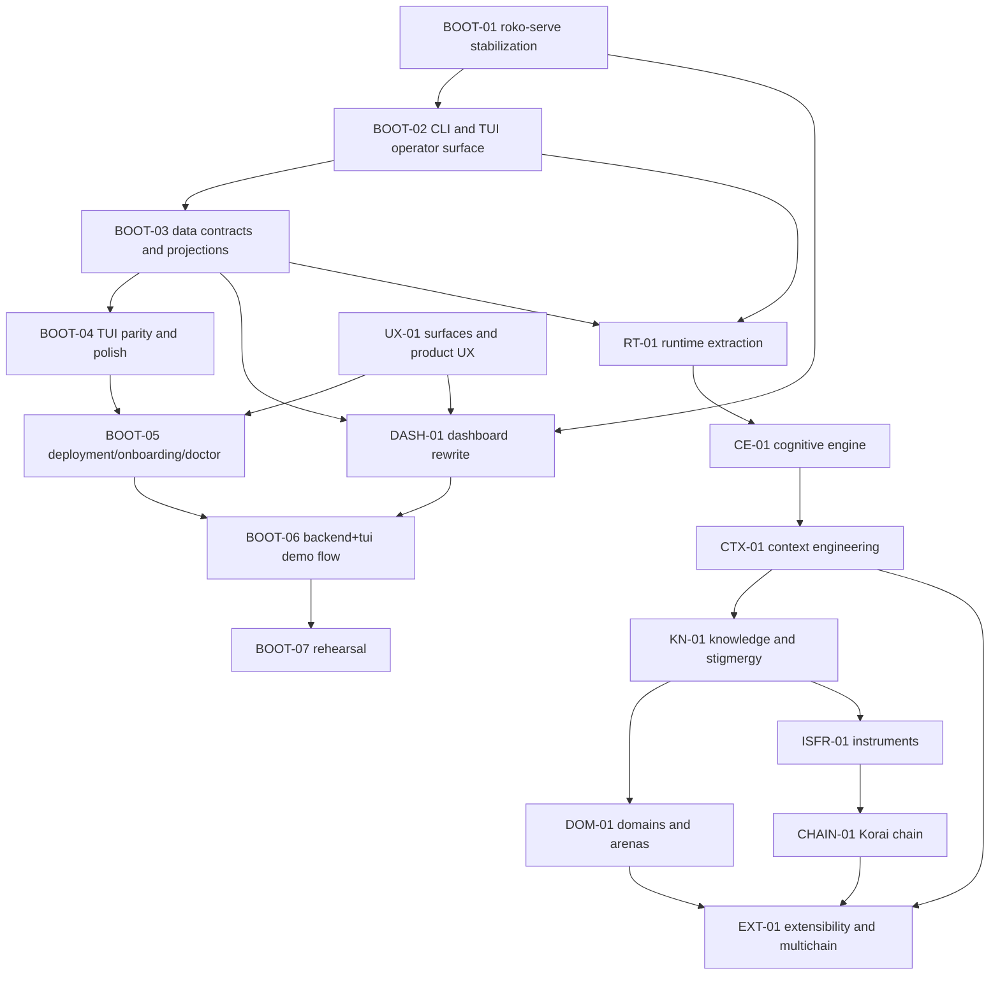
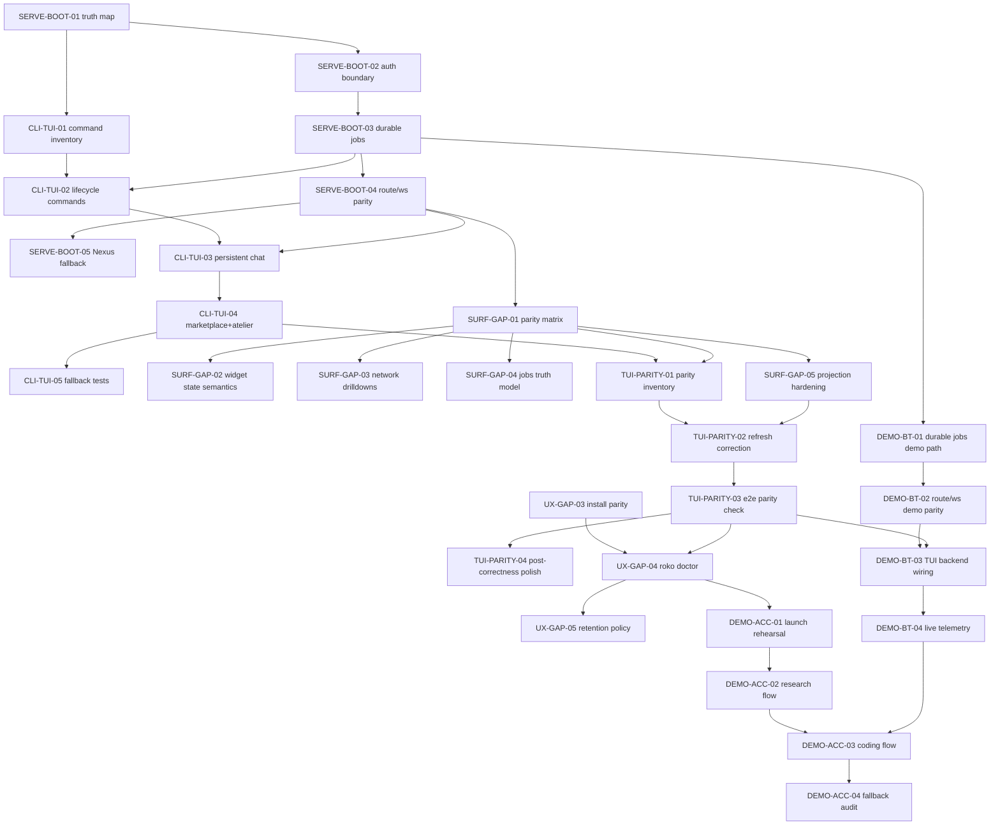

# Implementation Plan Rewrite Index

This directory is the execution-oriented rewrite of the large `IMPL-*.md` files in the parent folder.

The goal of this rewrite is:

- break each large plan into smaller files that can be assigned independently;
- make each file runnable by a fresh agent with no hidden context;
- anchor every checklist in the current repo state, not only the target architecture;
- separate current code from target crates and future-facing design;
- end every plan with verification and acceptance criteria.

## How to use this directory

1. Start with the folder that matches the original `IMPL-*` document.
2. Read `00-overview.md` first.
3. Execute the checklist files in order unless a file explicitly says it can run in parallel.
4. Treat all file paths as relative to one of these workspace roots:
   - Roko repo: `/Users/will/dev/nunchi/roko/roko`
   - Dashboard repo: `/Users/will/dev/nunchi/nunchi-dashboard`

## Repo reality captured in these rewrites

- The shipping self-hosting path today is centered on `crates/roko-cli/src/orchestrate.rs`, `roko-orchestrator`, `roko-agent`, `roko-compose`, `roko-gate`, `roko-fs`, `roko-learn`, and `roko-serve`.
- `roko-neuro`, `roko-daimon`, `roko-chain`, `roko-index`, and `roko-conductor` exist and are at least partially built.
- `roko-dreams` exists but is still scaffold-heavy.
- Several target crates named in the original plans do not exist yet. These rewrites call that out explicitly before asking an agent to create them.
- The dashboard work spans two repos. Any web-surface or demo item that mentions `nunchi-dashboard` requires edits outside the Roko repo.

## File map

- `01-runtime/` — rewrite of `IMPL-01-RUNTIME.md`
- `02-cognitive-engine/` — rewrite of `IMPL-02-COGNITIVE-ENGINE.md`
- `03-context-engineering/` — rewrite of `IMPL-03-CONTEXT.md`
- `04-knowledge-and-stigmergy/` — rewrite of `IMPL-04-KNOWLEDGE.md`
- `05-domains-and-arenas/` — rewrite of `IMPL-05-DOMAINS.md`
- `06-isfr-and-instruments/` — rewrite of `IMPL-06-ISFR.md`
- `07-korai-chain/` — rewrite of `IMPL-07-CHAIN.md`
- `08-surfaces-and-ux/` — rewrite of `IMPL-08-SURFACES.md`
- `09-extensibility-and-multichain/` — rewrite of `IMPL-09-EXTENSIBILITY-AND-MULTICHAIN.md`
- `10-dashboard-and-tui/` — rewrite of `IMPL-10-DASHBOARD-AND-TUI.md`
- `11-demo-sprint/` — rewrite of `IMPL-10-DEMO.md`

## Recommended execution strategy

If the goal is to get Roko itself, the CLI, the TUI, and the operator UX to a point where they can run the rest of the implementation work from inside Roko, do not start with deep chain or knowledge work.

Start with the self-hosting bootstrap path:

1. stabilize `roko-serve`, projections, jobs, and streaming;
2. make the CLI and TUI reliable operator surfaces;
3. harden the dashboard/TUI data contracts;
4. improve onboarding, `roko doctor`, deployment parity, and observability;
5. rehearse one real end-to-end coding workflow in Roko itself;
6. only then push deeper into runtime extraction, cognitive routing, context, knowledge, and chain work.

That path is encoded below as the `BOOT-*` critical path.

## DAG summary

Use this DAG at the file-task-pack level. Each node is a file that contains one or more concrete tasks.

## File-node registry

This is the authoritative file-linked DAG registry. Read the linked file to run that node.

| Node | Purpose | File | Depends on | Unlocks |
|---|---|---|---|---|
| `BOOT-01` | Stabilize `roko-serve`, jobs, auth, websocket/event truth, Nexus boundary | [10-dashboard-and-tui/01-stabilization-and-nexus-checklist.md](10-dashboard-and-tui/01-stabilization-and-nexus-checklist.md) | None | `BOOT-02`, `BOOT-03`, dashboard work |
| `BOOT-02` | Make CLI/chat/TUI a dependable operator surface | [08-surfaces-and-ux/01-cli-chat-and-tui-checklist.md](08-surfaces-and-ux/01-cli-chat-and-tui-checklist.md) | `BOOT-01` | `BOOT-04`, runtime migration work |
| `BOOT-03` | Define shared page/data contracts, projection rules, and backend truth for surfaces | [10-dashboard-and-tui/04-page-catalog-widgets-data-contracts-and-network-intelligence.md](10-dashboard-and-tui/04-page-catalog-widgets-data-contracts-and-network-intelligence.md) | `BOOT-01` | `BOOT-04`, dashboard rewrite, runtime migration |
| `BOOT-04` | Finish TUI parity, refresh behavior, and cross-surface correctness | [10-dashboard-and-tui/03-tui-polish-and-cross-surface-verification.md](10-dashboard-and-tui/03-tui-polish-and-cross-surface-verification.md) | `BOOT-02`, `BOOT-03` | `BOOT-06` |
| `BOOT-05` | Harden deployment, onboarding, `roko doctor`, and observability | [08-surfaces-and-ux/03-product-surfaces-deployment-onboarding-security-and-observability.md](08-surfaces-and-ux/03-product-surfaces-deployment-onboarding-security-and-observability.md) | `BOOT-04` | `BOOT-06`, broader product rollout |
| `BOOT-06` | Prove a real backend + TUI coding workflow in Roko | [11-demo-sprint/02-backend-and-tui-stream-checklist.md](11-demo-sprint/02-backend-and-tui-stream-checklist.md) | `BOOT-04`, `BOOT-05` | `BOOT-07`, self-hosting confidence |
| `BOOT-07` | Rehearse and verify the end-to-end operator flow | [11-demo-sprint/03-rehearsal-and-demo-acceptance.md](11-demo-sprint/03-rehearsal-and-demo-acceptance.md) | `BOOT-06` | Safe transition to deeper implementation work |
| `DASH-01` | Dashboard rewrite and backend-aligned page work in `nunchi-dashboard` | [10-dashboard-and-tui/02-dashboard-rewrite-checklist.md](10-dashboard-and-tui/02-dashboard-rewrite-checklist.md) | `BOOT-01`, `BOOT-03` | better operator UX, demo flows |
| `UX-01` | Product-surface backlog for AI Studio / Agent Studio / OpenClaw / deployment | [08-surfaces-and-ux/03-product-surfaces-deployment-onboarding-security-and-observability.md](08-surfaces-and-ux/03-product-surfaces-deployment-onboarding-security-and-observability.md) | None | `BOOT-05`, `DASH-01` |
| `RT-01` | Extract runtime, lifecycle, extension chain, and migration path | [01-runtime/01-foundation-and-extraction-checklist.md](01-runtime/01-foundation-and-extraction-checklist.md) | `BOOT-02`, `BOOT-03` | `CE-01`, runtime CLI commands |
| `RT-02` | Runtime migration and cutover path | [01-runtime/02-migration-verification-and-cutover.md](01-runtime/02-migration-verification-and-cutover.md) | `RT-01` | stable runtime-backed CLI |
| `RT-03` | Heartbeat timescales, gateway, ops, and supervision hardening | [01-runtime/03-heartbeat-timescales-inference-gateway-and-ops.md](01-runtime/03-heartbeat-timescales-inference-gateway-and-ops.md) | `RT-01` | `CE-01`, runtime operations |
| `CE-01` | Prediction error, gating, habituation, somatic routing, triage | [02-cognitive-engine/01-prediction-gating-and-triage-checklist.md](02-cognitive-engine/01-prediction-gating-and-triage-checklist.md) | `RT-01` | `CTX-01`, `RT-03` consumers |
| `CE-02` | Native harness, per-tick cost tracking, verification | [02-cognitive-engine/02-native-harness-costs-and-verification.md](02-cognitive-engine/02-native-harness-costs-and-verification.md) | `CE-01` | runtime self-hosting quality |
| `CE-03` | Threshold/routing/measurement hardening | [02-cognitive-engine/03-thresholds-cascade-router-and-measurement.md](02-cognitive-engine/03-thresholds-cascade-router-and-measurement.md) | `CE-01` | stable tiering and router policy |
| `CTX-01` | CognitiveWorkspace, bidders, policy | [03-context-engineering/01-workspace-bidders-and-policy-checklist.md](03-context-engineering/01-workspace-bidders-and-policy-checklist.md) | `CE-01` | `KN-01`, `EXT-01` |
| `CTX-02` | Caching, chain context, WorldGraph boundary | [03-context-engineering/02-caching-chain-and-worldgraph-checklist.md](03-context-engineering/02-caching-chain-and-worldgraph-checklist.md) | `CTX-01` | `EXT-01`, network context features |
| `CTX-03` | Mesh, measurement, persistence, explainability | [03-context-engineering/03-context-mesh-measurement-and-persistence.md](03-context-engineering/03-context-mesh-measurement-and-persistence.md) | `CTX-01` | cross-agent context learning |
| `KN-01` | Local knowledge pipeline, HDC, fingerprints | [04-knowledge-and-stigmergy/01-knowledge-pipeline-and-hdc-checklist.md](04-knowledge-and-stigmergy/01-knowledge-pipeline-and-hdc-checklist.md) | `CTX-01` | `DOM-01`, `ISFR-01` |
| `KN-02` | Publishing, dreams, chain query/publish path | [04-knowledge-and-stigmergy/02-publishing-dreams-and-chain-checklist.md](04-knowledge-and-stigmergy/02-publishing-dreams-and-chain-checklist.md) | `KN-01` | shared knowledge path |
| `KN-03` | InsightStore, resonance, lifecycle, C-factor measurement | [04-knowledge-and-stigmergy/03-insightstore-resonance-lifecycle-and-measurement.md](04-knowledge-and-stigmergy/03-insightstore-resonance-lifecycle-and-measurement.md) | `KN-01` | shared knowledge scaling |
| `DOM-01` | Domain profiles and arena framework | [05-domains-and-arenas/01-domain-runtime-and-arenas-checklist.md](05-domains-and-arenas/01-domain-runtime-and-arenas-checklist.md) | `KN-01` | custom domains, work markets |
| `DOM-02` | Domain-specific extensions, HF, market hooks | [05-domains-and-arenas/02-domain-extensions-hf-and-market-checklist.md](05-domains-and-arenas/02-domain-extensions-hf-and-market-checklist.md) | `DOM-01` | domain specialization |
| `DOM-03` | Profile catalog, custom domains, scaling | [05-domains-and-arenas/03-profile-catalog-custom-domains-and-scaling.md](05-domains-and-arenas/03-profile-catalog-custom-domains-and-scaling.md) | `DOM-01` | broader ecosystem |
| `ISFR-01` | Sources, aggregation, scoring, perps | [06-isfr-and-instruments/01-oracle-prediction-and-perps-checklist.md](06-isfr-and-instruments/01-oracle-prediction-and-perps-checklist.md) | `KN-01` | `CHAIN-01` |
| `ISFR-02` | Clearing and runtime integration | [06-isfr-and-instruments/02-clearing-runtime-and-verification-checklist.md](06-isfr-and-instruments/02-clearing-runtime-and-verification-checklist.md) | `ISFR-01` | market runtime hooks |
| `ISFR-03` | Publication states, solver economics, credibility path | [06-isfr-and-instruments/03-publication-states-economics-and-credibility.md](06-isfr-and-instruments/03-publication-states-economics-and-credibility.md) | `ISFR-01` | production benchmark rollout |
| `CHAIN-01` | Consensus/execution/precompile surfaces | [07-korai-chain/01-consensus-execution-and-precompiles-checklist.md](07-korai-chain/01-consensus-execution-and-precompiles-checklist.md) | `ISFR-01` | `EXT-01` |
| `CHAIN-02` | InsightStore/tokenomics/HDC chain semantics | [07-korai-chain/02-insightstore-tokenomics-and-hdc-checklist.md](07-korai-chain/02-insightstore-tokenomics-and-hdc-checklist.md) | `CHAIN-01` | chain-backed knowledge/economy |
| `CHAIN-03` | Identity/reputation/validation/proof-log registries | [07-korai-chain/03-identity-registries-proof-log-and-rollout.md](07-korai-chain/03-identity-registries-proof-log-and-rollout.md) | `CHAIN-01` | operator-facing network identity surfaces |
| `EXT-01` | Package system and runtime loading | [09-extensibility-and-multichain/01-package-and-runtime-loading-checklist.md](09-extensibility-and-multichain/01-package-and-runtime-loading-checklist.md) | `DOM-01` | multichain/plugin ecosystem |
| `EXT-02` | Multi-chain ingestion, discovery, WorldGraph | [09-extensibility-and-multichain/02-ingestion-discovery-and-worldgraph-checklist.md](09-extensibility-and-multichain/02-ingestion-discovery-and-worldgraph-checklist.md) | `EXT-01`, `CHAIN-01`, `CTX-02` | dynamic worldview |
| `EXT-03` | Fine-tuning export/integration | [09-extensibility-and-multichain/03-finetuning-integration-and-acceptance.md](09-extensibility-and-multichain/03-finetuning-integration-and-acceptance.md) | `EXT-01`, `DOM-01` | model-evolution loop |
| `EXT-04` | Attention allocation, publishing UX, ecosystem completion | [09-extensibility-and-multichain/04-attention-allocation-publishing-and-ecosystem-completion.md](09-extensibility-and-multichain/04-attention-allocation-publishing-and-ecosystem-completion.md) | `EXT-01`, `EXT-02` | mature package ecosystem |
| `DEMO-01` | Dashboard stream demo work | [11-demo-sprint/01-dashboard-stream-checklist.md](11-demo-sprint/01-dashboard-stream-checklist.md) | `DASH-01`, `BOOT-03` | demo-ready web surface |

## Bootstrap path for self-hosting

This is the recommended order if the goal is: “make Roko usable enough that I can run the rest of the implementation program from inside Roko itself.”

1. [10-dashboard-and-tui/01-stabilization-and-nexus-checklist.md](10-dashboard-and-tui/01-stabilization-and-nexus-checklist.md)
2. [08-surfaces-and-ux/01-cli-chat-and-tui-checklist.md](08-surfaces-and-ux/01-cli-chat-and-tui-checklist.md)
3. [10-dashboard-and-tui/04-page-catalog-widgets-data-contracts-and-network-intelligence.md](10-dashboard-and-tui/04-page-catalog-widgets-data-contracts-and-network-intelligence.md)
4. [10-dashboard-and-tui/03-tui-polish-and-cross-surface-verification.md](10-dashboard-and-tui/03-tui-polish-and-cross-surface-verification.md)
5. [08-surfaces-and-ux/03-product-surfaces-deployment-onboarding-security-and-observability.md](08-surfaces-and-ux/03-product-surfaces-deployment-onboarding-security-and-observability.md)
6. [11-demo-sprint/02-backend-and-tui-stream-checklist.md](11-demo-sprint/02-backend-and-tui-stream-checklist.md)
7. [11-demo-sprint/03-rehearsal-and-demo-acceptance.md](11-demo-sprint/03-rehearsal-and-demo-acceptance.md)

After those seven nodes, the recommended next wave is:

8. [01-runtime/01-foundation-and-extraction-checklist.md](01-runtime/01-foundation-and-extraction-checklist.md)
9. [01-runtime/02-migration-verification-and-cutover.md](01-runtime/02-migration-verification-and-cutover.md)
10. [02-cognitive-engine/01-prediction-gating-and-triage-checklist.md](02-cognitive-engine/01-prediction-gating-and-triage-checklist.md)
11. [03-context-engineering/01-workspace-bidders-and-policy-checklist.md](03-context-engineering/01-workspace-bidders-and-policy-checklist.md)
12. [04-knowledge-and-stigmergy/01-knowledge-pipeline-and-hdc-checklist.md](04-knowledge-and-stigmergy/01-knowledge-pipeline-and-hdc-checklist.md)

## Surface-first task DAG for self-hosting

Use this DAG when the immediate goal is not “finish the entire architecture,” but “make Roko operational enough that it can drive the next implementation wave from inside its own CLI/TUI/operator surfaces.”

## Surface-first task registry

These are the concrete task IDs to assign if the objective is: get Roko, the CLI, the TUI, and operator UX into a coding-ready self-hosting state.

| Task ID | Purpose | File | Depends on |
|---|---|---|---|
| `SERVE-BOOT-01` | Audit backend truth sources and assign projection ownership | [10-dashboard-and-tui/01-stabilization-and-nexus-checklist.md](10-dashboard-and-tui/01-stabilization-and-nexus-checklist.md) | None |
| `SERVE-BOOT-02` | Consolidate auth across serve, CLI, and dashboard expectations | [10-dashboard-and-tui/01-stabilization-and-nexus-checklist.md](10-dashboard-and-tui/01-stabilization-and-nexus-checklist.md) | `SERVE-BOOT-01` |
| `SERVE-BOOT-03` | Build durable jobs backend and lifecycle states | [10-dashboard-and-tui/01-stabilization-and-nexus-checklist.md](10-dashboard-and-tui/01-stabilization-and-nexus-checklist.md) | `SERVE-BOOT-01`, `SERVE-BOOT-02` |
| `SERVE-BOOT-04` | Align route and websocket event contracts | [10-dashboard-and-tui/01-stabilization-and-nexus-checklist.md](10-dashboard-and-tui/01-stabilization-and-nexus-checklist.md) | `SERVE-BOOT-03` |
| `SERVE-BOOT-05` | Define Nexus relay boundary and degraded-mode fallback | [10-dashboard-and-tui/01-stabilization-and-nexus-checklist.md](10-dashboard-and-tui/01-stabilization-and-nexus-checklist.md) | `SERVE-BOOT-04` |
| `CLI-TUI-01` | Inventory operator commands, tabs, and gaps | [08-surfaces-and-ux/01-cli-chat-and-tui-checklist.md](08-surfaces-and-ux/01-cli-chat-and-tui-checklist.md) | `SERVE-BOOT-01` |
| `CLI-TUI-02` | Add runtime-backed agent lifecycle commands | [08-surfaces-and-ux/01-cli-chat-and-tui-checklist.md](08-surfaces-and-ux/01-cli-chat-and-tui-checklist.md) | `CLI-TUI-01`, `SERVE-BOOT-03` |
| `CLI-TUI-03` | Converge persistent chat on shared transport/truth | [08-surfaces-and-ux/01-cli-chat-and-tui-checklist.md](08-surfaces-and-ux/01-cli-chat-and-tui-checklist.md) | `CLI-TUI-02`, `SERVE-BOOT-04` |
| `CLI-TUI-04` | Complete Marketplace and Atelier TUI workflows | [08-surfaces-and-ux/01-cli-chat-and-tui-checklist.md](08-surfaces-and-ux/01-cli-chat-and-tui-checklist.md) | `CLI-TUI-03` |
| `CLI-TUI-05` | Add CLI fallback and regression coverage | [08-surfaces-and-ux/01-cli-chat-and-tui-checklist.md](08-surfaces-and-ux/01-cli-chat-and-tui-checklist.md) | `CLI-TUI-04` |
| `SURF-GAP-01` | Produce cross-surface parity matrix | [10-dashboard-and-tui/04-page-catalog-widgets-data-contracts-and-network-intelligence.md](10-dashboard-and-tui/04-page-catalog-widgets-data-contracts-and-network-intelligence.md) | `SERVE-BOOT-04` |
| `SURF-GAP-02` | Define shared widget state semantics | [10-dashboard-and-tui/04-page-catalog-widgets-data-contracts-and-network-intelligence.md](10-dashboard-and-tui/04-page-catalog-widgets-data-contracts-and-network-intelligence.md) | `SURF-GAP-01` |
| `SURF-GAP-03` | Specify network-intelligence drilldowns | [10-dashboard-and-tui/04-page-catalog-widgets-data-contracts-and-network-intelligence.md](10-dashboard-and-tui/04-page-catalog-widgets-data-contracts-and-network-intelligence.md) | `SURF-GAP-01` |
| `SURF-GAP-04` | Define jobs multi-source truth model | [10-dashboard-and-tui/04-page-catalog-widgets-data-contracts-and-network-intelligence.md](10-dashboard-and-tui/04-page-catalog-widgets-data-contracts-and-network-intelligence.md) | `SURF-GAP-01`, `SERVE-BOOT-03` |
| `SURF-GAP-05` | Harden projection and StateHub contracts | [10-dashboard-and-tui/04-page-catalog-widgets-data-contracts-and-network-intelligence.md](10-dashboard-and-tui/04-page-catalog-widgets-data-contracts-and-network-intelligence.md) | `SURF-GAP-01`, `SERVE-BOOT-04` |
| `TUI-PARITY-01` | Map tabs and subviews to dashboard/CLI equivalents | [10-dashboard-and-tui/03-tui-polish-and-cross-surface-verification.md](10-dashboard-and-tui/03-tui-polish-and-cross-surface-verification.md) | `CLI-TUI-04`, `SURF-GAP-01` |
| `TUI-PARITY-02` | Correct refresh behavior and source-of-truth usage | [10-dashboard-and-tui/03-tui-polish-and-cross-surface-verification.md](10-dashboard-and-tui/03-tui-polish-and-cross-surface-verification.md) | `TUI-PARITY-01`, `SURF-GAP-05` |
| `TUI-PARITY-03` | Verify one real end-to-end parity flow | [10-dashboard-and-tui/03-tui-polish-and-cross-surface-verification.md](10-dashboard-and-tui/03-tui-polish-and-cross-surface-verification.md) | `TUI-PARITY-02` |
| `TUI-PARITY-04` | Add polish after correctness is proven | [10-dashboard-and-tui/03-tui-polish-and-cross-surface-verification.md](10-dashboard-and-tui/03-tui-polish-and-cross-surface-verification.md) | `TUI-PARITY-03` |
| `UX-GAP-03` | Verify install parity across source, binary, and container | [08-surfaces-and-ux/03-product-surfaces-deployment-onboarding-security-and-observability.md](08-surfaces-and-ux/03-product-surfaces-deployment-onboarding-security-and-observability.md) | None |
| `UX-GAP-04` | Expand `roko doctor` across env, providers, chain, dashboard, and Nexus reachability | [08-surfaces-and-ux/03-product-surfaces-deployment-onboarding-security-and-observability.md](08-surfaces-and-ux/03-product-surfaces-deployment-onboarding-security-and-observability.md) | `UX-GAP-03`, `TUI-PARITY-03` |
| `UX-GAP-05` | Bound observability retention and postmortem export | [08-surfaces-and-ux/03-product-surfaces-deployment-onboarding-security-and-observability.md](08-surfaces-and-ux/03-product-surfaces-deployment-onboarding-security-and-observability.md) | `UX-GAP-04` |
| `DEMO-BT-01` | Introduce typed jobs model with durable state | [11-demo-sprint/02-backend-and-tui-stream-checklist.md](11-demo-sprint/02-backend-and-tui-stream-checklist.md) | `SERVE-BOOT-03` |
| `DEMO-BT-02` | Expose route and websocket lifecycle parity for jobs | [11-demo-sprint/02-backend-and-tui-stream-checklist.md](11-demo-sprint/02-backend-and-tui-stream-checklist.md) | `DEMO-BT-01` |
| `DEMO-BT-03` | Wire Marketplace and Atelier to backend truth | [11-demo-sprint/02-backend-and-tui-stream-checklist.md](11-demo-sprint/02-backend-and-tui-stream-checklist.md) | `DEMO-BT-02`, `TUI-PARITY-03` |
| `DEMO-BT-04` | Surface live telemetry and progress signals | [11-demo-sprint/02-backend-and-tui-stream-checklist.md](11-demo-sprint/02-backend-and-tui-stream-checklist.md) | `DEMO-BT-03` |
| `DEMO-ACC-01` | Rehearse launch from a clean local environment | [11-demo-sprint/03-rehearsal-and-demo-acceptance.md](11-demo-sprint/03-rehearsal-and-demo-acceptance.md) | `UX-GAP-04` |
| `DEMO-ACC-02` | Accept a full research-style flow | [11-demo-sprint/03-rehearsal-and-demo-acceptance.md](11-demo-sprint/03-rehearsal-and-demo-acceptance.md) | `DEMO-ACC-01` |
| `DEMO-ACC-03` | Accept a full coding-style self-hosting flow | [11-demo-sprint/03-rehearsal-and-demo-acceptance.md](11-demo-sprint/03-rehearsal-and-demo-acceptance.md) | `DEMO-ACC-02`, `DEMO-BT-04` |
| `DEMO-ACC-04` | Audit remaining fallbacks, mocks, and hidden errors | [11-demo-sprint/03-rehearsal-and-demo-acceptance.md](11-demo-sprint/03-rehearsal-and-demo-acceptance.md) | `DEMO-ACC-03` |

## Recommended coding frontier

If the goal is to start writing production code in Roko itself as soon as possible, assign work in this order:

1. `SERVE-BOOT-01` through `SERVE-BOOT-04`
2. `CLI-TUI-01` through `CLI-TUI-04`
3. `SURF-GAP-01`, `SURF-GAP-04`, and `SURF-GAP-05`
4. `TUI-PARITY-01` through `TUI-PARITY-03`
5. `UX-GAP-03` and `UX-GAP-04`
6. `DEMO-BT-01` through `DEMO-BT-04`
7. `DEMO-ACC-01` through `DEMO-ACC-03`

That is the shortest path to: durable backend truth, reliable operator commands, TUI workflows that do not drift from backend state, and one proven coding loop inside Roko.

## Agent-ready task registry

The files below contain explicit sequential task IDs meant for one-agent-at-a-time execution. The task IDs are globally unique enough for assignment and progress tracking.

### Runtime

| Task ID | File | Depends on |
|---|---|---|
| `RT-GAP-01` | [01-runtime/03-heartbeat-timescales-inference-gateway-and-ops.md](01-runtime/03-heartbeat-timescales-inference-gateway-and-ops.md) | None |
| `RT-GAP-02` | [01-runtime/03-heartbeat-timescales-inference-gateway-and-ops.md](01-runtime/03-heartbeat-timescales-inference-gateway-and-ops.md) | `RT-GAP-01` |
| `RT-GAP-03` | [01-runtime/03-heartbeat-timescales-inference-gateway-and-ops.md](01-runtime/03-heartbeat-timescales-inference-gateway-and-ops.md) | `RT-GAP-01` |
| `RT-GAP-04` | [01-runtime/03-heartbeat-timescales-inference-gateway-and-ops.md](01-runtime/03-heartbeat-timescales-inference-gateway-and-ops.md) | `RT-GAP-03` |
| `RT-GAP-05` | [01-runtime/03-heartbeat-timescales-inference-gateway-and-ops.md](01-runtime/03-heartbeat-timescales-inference-gateway-and-ops.md) | `RT-GAP-01` |

### Cognitive engine

| Task ID | File | Depends on |
|---|---|---|
| `CE-GAP-01` | [02-cognitive-engine/03-thresholds-cascade-router-and-measurement.md](02-cognitive-engine/03-thresholds-cascade-router-and-measurement.md) | None |
| `CE-GAP-02` | [02-cognitive-engine/03-thresholds-cascade-router-and-measurement.md](02-cognitive-engine/03-thresholds-cascade-router-and-measurement.md) | `CE-GAP-01` |
| `CE-GAP-03` | [02-cognitive-engine/03-thresholds-cascade-router-and-measurement.md](02-cognitive-engine/03-thresholds-cascade-router-and-measurement.md) | `CE-GAP-01` |
| `CE-GAP-04` | [02-cognitive-engine/03-thresholds-cascade-router-and-measurement.md](02-cognitive-engine/03-thresholds-cascade-router-and-measurement.md) | `CE-GAP-03` |
| `CE-GAP-05` | [02-cognitive-engine/03-thresholds-cascade-router-and-measurement.md](02-cognitive-engine/03-thresholds-cascade-router-and-measurement.md) | `CE-GAP-01` |

### Context engineering

| Task ID | File | Depends on |
|---|---|---|
| `CTX-GAP-01` | [03-context-engineering/03-context-mesh-measurement-and-persistence.md](03-context-engineering/03-context-mesh-measurement-and-persistence.md) | None |
| `CTX-GAP-02` | [03-context-engineering/03-context-mesh-measurement-and-persistence.md](03-context-engineering/03-context-mesh-measurement-and-persistence.md) | `CTX-GAP-01` |
| `CTX-GAP-03` | [03-context-engineering/03-context-mesh-measurement-and-persistence.md](03-context-engineering/03-context-mesh-measurement-and-persistence.md) | `CTX-GAP-02` |
| `CTX-GAP-04` | [03-context-engineering/03-context-mesh-measurement-and-persistence.md](03-context-engineering/03-context-mesh-measurement-and-persistence.md) | `CTX-GAP-01` |
| `CTX-GAP-05` | [03-context-engineering/03-context-mesh-measurement-and-persistence.md](03-context-engineering/03-context-mesh-measurement-and-persistence.md) | `CTX-GAP-02` |

### Knowledge and stigmergy

| Task ID | File | Depends on |
|---|---|---|
| `KN-GAP-01` | [04-knowledge-and-stigmergy/03-insightstore-resonance-lifecycle-and-measurement.md](04-knowledge-and-stigmergy/03-insightstore-resonance-lifecycle-and-measurement.md) | None |
| `KN-GAP-02` | [04-knowledge-and-stigmergy/03-insightstore-resonance-lifecycle-and-measurement.md](04-knowledge-and-stigmergy/03-insightstore-resonance-lifecycle-and-measurement.md) | `KN-GAP-01` |
| `KN-GAP-03` | [04-knowledge-and-stigmergy/03-insightstore-resonance-lifecycle-and-measurement.md](04-knowledge-and-stigmergy/03-insightstore-resonance-lifecycle-and-measurement.md) | `KN-GAP-01` |
| `KN-GAP-04` | [04-knowledge-and-stigmergy/03-insightstore-resonance-lifecycle-and-measurement.md](04-knowledge-and-stigmergy/03-insightstore-resonance-lifecycle-and-measurement.md) | `KN-GAP-01` |
| `KN-GAP-05` | [04-knowledge-and-stigmergy/03-insightstore-resonance-lifecycle-and-measurement.md](04-knowledge-and-stigmergy/03-insightstore-resonance-lifecycle-and-measurement.md) | `KN-GAP-02` |

### Domains and arenas

| Task ID | File | Depends on |
|---|---|---|
| `DA-GAP-01` | [05-domains-and-arenas/03-profile-catalog-custom-domains-and-scaling.md](05-domains-and-arenas/03-profile-catalog-custom-domains-and-scaling.md) | None |
| `DA-GAP-02` | [05-domains-and-arenas/03-profile-catalog-custom-domains-and-scaling.md](05-domains-and-arenas/03-profile-catalog-custom-domains-and-scaling.md) | `DA-GAP-01` |
| `DA-GAP-03` | [05-domains-and-arenas/03-profile-catalog-custom-domains-and-scaling.md](05-domains-and-arenas/03-profile-catalog-custom-domains-and-scaling.md) | `DA-GAP-01` |
| `DA-GAP-04` | [05-domains-and-arenas/03-profile-catalog-custom-domains-and-scaling.md](05-domains-and-arenas/03-profile-catalog-custom-domains-and-scaling.md) | `DA-GAP-03` |
| `DA-GAP-05` | [05-domains-and-arenas/03-profile-catalog-custom-domains-and-scaling.md](05-domains-and-arenas/03-profile-catalog-custom-domains-and-scaling.md) | `DA-GAP-02` |

### ISFR and instruments

| Task ID | File | Depends on |
|---|---|---|
| `ISFR-GAP-01` | [06-isfr-and-instruments/03-publication-states-economics-and-credibility.md](06-isfr-and-instruments/03-publication-states-economics-and-credibility.md) | None |
| `ISFR-GAP-02` | [06-isfr-and-instruments/03-publication-states-economics-and-credibility.md](06-isfr-and-instruments/03-publication-states-economics-and-credibility.md) | `ISFR-GAP-01` |
| `ISFR-GAP-03` | [06-isfr-and-instruments/03-publication-states-economics-and-credibility.md](06-isfr-and-instruments/03-publication-states-economics-and-credibility.md) | `ISFR-GAP-01` |
| `ISFR-GAP-04` | [06-isfr-and-instruments/03-publication-states-economics-and-credibility.md](06-isfr-and-instruments/03-publication-states-economics-and-credibility.md) | `ISFR-GAP-02` |
| `ISFR-GAP-05` | [06-isfr-and-instruments/03-publication-states-economics-and-credibility.md](06-isfr-and-instruments/03-publication-states-economics-and-credibility.md) | `ISFR-GAP-04` |

### Chain identity and registries

| Task ID | File | Depends on |
|---|---|---|
| `CHAIN-ID-01` | [07-korai-chain/03-identity-registries-proof-log-and-rollout.md](07-korai-chain/03-identity-registries-proof-log-and-rollout.md) | None |
| `CHAIN-ID-02` | [07-korai-chain/03-identity-registries-proof-log-and-rollout.md](07-korai-chain/03-identity-registries-proof-log-and-rollout.md) | `CHAIN-ID-01` |
| `CHAIN-ID-03` | [07-korai-chain/03-identity-registries-proof-log-and-rollout.md](07-korai-chain/03-identity-registries-proof-log-and-rollout.md) | `CHAIN-ID-02` |
| `CHAIN-ID-04` | [07-korai-chain/03-identity-registries-proof-log-and-rollout.md](07-korai-chain/03-identity-registries-proof-log-and-rollout.md) | `CHAIN-ID-03` |
| `CHAIN-ID-05` | [07-korai-chain/03-identity-registries-proof-log-and-rollout.md](07-korai-chain/03-identity-registries-proof-log-and-rollout.md) | `CHAIN-ID-03` |

### Product surfaces and UX

| Task ID | File | Depends on |
|---|---|---|
| `UX-GAP-01` | [08-surfaces-and-ux/03-product-surfaces-deployment-onboarding-security-and-observability.md](08-surfaces-and-ux/03-product-surfaces-deployment-onboarding-security-and-observability.md) | None |
| `UX-GAP-02` | [08-surfaces-and-ux/03-product-surfaces-deployment-onboarding-security-and-observability.md](08-surfaces-and-ux/03-product-surfaces-deployment-onboarding-security-and-observability.md) | `UX-GAP-01` |
| `UX-GAP-03` | [08-surfaces-and-ux/03-product-surfaces-deployment-onboarding-security-and-observability.md](08-surfaces-and-ux/03-product-surfaces-deployment-onboarding-security-and-observability.md) | None |
| `UX-GAP-04` | [08-surfaces-and-ux/03-product-surfaces-deployment-onboarding-security-and-observability.md](08-surfaces-and-ux/03-product-surfaces-deployment-onboarding-security-and-observability.md) | `UX-GAP-03` |
| `UX-GAP-05` | [08-surfaces-and-ux/03-product-surfaces-deployment-onboarding-security-and-observability.md](08-surfaces-and-ux/03-product-surfaces-deployment-onboarding-security-and-observability.md) | `UX-GAP-04` |

### Extensibility and multichain

| Task ID | File | Depends on |
|---|---|---|
| `EXT-GAP-01` | [09-extensibility-and-multichain/04-attention-allocation-publishing-and-ecosystem-completion.md](09-extensibility-and-multichain/04-attention-allocation-publishing-and-ecosystem-completion.md) | None |
| `EXT-GAP-02` | [09-extensibility-and-multichain/04-attention-allocation-publishing-and-ecosystem-completion.md](09-extensibility-and-multichain/04-attention-allocation-publishing-and-ecosystem-completion.md) | `EXT-GAP-01` |
| `EXT-GAP-03` | [09-extensibility-and-multichain/04-attention-allocation-publishing-and-ecosystem-completion.md](09-extensibility-and-multichain/04-attention-allocation-publishing-and-ecosystem-completion.md) | None |
| `EXT-GAP-04` | [09-extensibility-and-multichain/04-attention-allocation-publishing-and-ecosystem-completion.md](09-extensibility-and-multichain/04-attention-allocation-publishing-and-ecosystem-completion.md) | `EXT-GAP-01` |
| `EXT-GAP-05` | [09-extensibility-and-multichain/04-attention-allocation-publishing-and-ecosystem-completion.md](09-extensibility-and-multichain/04-attention-allocation-publishing-and-ecosystem-completion.md) | `EXT-GAP-02` |

### Dashboard and TUI data contracts

| Task ID | File | Depends on |
|---|---|---|
| `SURF-GAP-01` | [10-dashboard-and-tui/04-page-catalog-widgets-data-contracts-and-network-intelligence.md](10-dashboard-and-tui/04-page-catalog-widgets-data-contracts-and-network-intelligence.md) | None |
| `SURF-GAP-02` | [10-dashboard-and-tui/04-page-catalog-widgets-data-contracts-and-network-intelligence.md](10-dashboard-and-tui/04-page-catalog-widgets-data-contracts-and-network-intelligence.md) | `SURF-GAP-01` |
| `SURF-GAP-03` | [10-dashboard-and-tui/04-page-catalog-widgets-data-contracts-and-network-intelligence.md](10-dashboard-and-tui/04-page-catalog-widgets-data-contracts-and-network-intelligence.md) | `SURF-GAP-01` |
| `SURF-GAP-04` | [10-dashboard-and-tui/04-page-catalog-widgets-data-contracts-and-network-intelligence.md](10-dashboard-and-tui/04-page-catalog-widgets-data-contracts-and-network-intelligence.md) | `SURF-GAP-01` |
| `SURF-GAP-05` | [10-dashboard-and-tui/04-page-catalog-widgets-data-contracts-and-network-intelligence.md](10-dashboard-and-tui/04-page-catalog-widgets-data-contracts-and-network-intelligence.md) | `SURF-GAP-01` |

## Source material used

- Parent PRDs: `PRD-01` through `PRD-10`
- Parent implementation plans: `IMPL-01` through `IMPL-10` and `IMPL-10-DEMO`
- Workspace manifest: `Cargo.toml`
- Status and gap docs under `docs/`
- Current crate trees under `crates/`
- Dashboard code and docs under `/Users/will/dev/nunchi/nunchi-dashboard`

## Second-pass coverage note

This tree was revised a second time against the PRDs themselves, not only the original `IMPL-*` plans.

That second pass added explicit task coverage for PRD material that was previously only implied, including:

- heartbeat timescales, homeostasis, rollback, and supervision details;
- inference gateway caches, routing, and translator work;
- adaptive threshold families, temperament adjustments, and measurement;
- context mesh, persistence layout, and section-effect measurement;
- InsightStore query/publish paths, resonance, and C-factor measurement;
- AI Studio, Agent Studio, OpenClaw, deployment, onboarding, security, and observability;
- dashboard page catalog, widget catalog, data contracts, and stabilization requirements;
- package publishing, predictive foraging, WorldGraph, and contract discovery.

## Standard checklist contract

Unless a checklist says otherwise, a task is not done until all of the following are true:

- code builds for the touched crate(s);
- tests covering the changed behavior exist or are updated;
- docs/config/example changes needed to exercise the feature are included;
- failure paths are handled, not only happy paths;
- the acceptance criteria at the bottom of the file are met.
