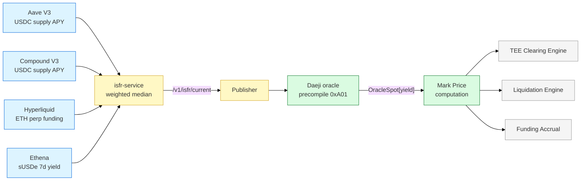

# Yield Perpetual Instrument Spec

## Summary

A **yield perpetual** is a continuous-funding perpetual futures contract whose underlying is a DeFi yield reference rate — not an asset price. Users take long or short positions on the rate, pay or receive funding each interval to track the market rate, and hold indefinitely without expiration. This document specifies the instrument: reference rate, mark price formula, funding rate formula, position semantics, and the canonical AAVE liquidation backstop use case.

## Background

Traditional DeFi yield trading uses **expiring futures** (Pendle) which forces maturity-based liquidity fragmentation and manual rollover. Perpetuals already solved this for spot crypto assets (Binance, Bybit, Hyperliquid); applying the same mechanism to yield rates produces a continuous hedge that composes cleanly with agent-based execution. Prior art: Hyperliquid's perps use `F_premium = (Mark − OracleSpot) / OracleSpot` clamped to `±0.05%` per funding interval; Nunchi extends this to rate instruments [firm].

## Instrument Definition

| Field | Value | Notes |
|-------|-------|-------|
| Type | Perpetual futures (no expiry) | [firm] |
| Underlying | DeFi yield reference rate, e.g. `aave_usdc_supply_apy` | [firm] |
| Quote unit | Basis points on the rate (1 bp = 0.01%) | [probable] |
| Contract multiplier | $1 notional per 1 bp of rate movement × position size | [probable] |
| Settlement venue | Hyperliquid HIP-3 (builder-operated perp market) | [firm] |
| Reference index | **ISFR** — Implied Secured Funding Rate. See [02-isfr-index.md](02-isfr-index.md). | [firm] |
| Clearing | TEE cooperative batch cycles (~10s). See [03-tee-clearing.md](03-tee-clearing.md). | [firm] |
| Funding interval | Every 8 hours (matches HL default) — configurable per instrument | [probable] |
| Tick size | 0.1 bp | [exploratory] |

## Position Semantics

| Position | Economic meaning | Who uses it |
|----------|------------------|-------------|
| **Long** | Bet that the reference rate will rise. Receives funding when market rate > locked rate. | Users who want to earn the rate; speculators who think rates recover |
| **Short** | Bet that the reference rate will fall. Pays funding when market rate > locked rate. | Users hedging a floating-rate exposure (e.g. AAVE supplier worried about rate drop) |

The short side is the hedging use case: an AAVE supplier shorts `aave_usdc_supply_apy`, locking in today's rate. If the rate drops, the short position PnL compensates for the lower on-chain yield.

## Mark Price Formula

Mark price governs margining, liquidation, TP/SL, and unrealized PnL calculations. The formula is inherited from Hyperliquid with an EMA dampener and mirrors the Daeji oracle design [firm]:

```
Mark[i] = OracleSpot[i] + EMA_150s(DaejiMid[i] − OracleSpot[i])
```

Where:
- `OracleSpot[i]` = stake-weighted median reference rate for instrument `i` (the ISFR value for yield instruments)
- `DaejiMid[i]` = mid-price from the on-chain order book for the yield perp
- `EMA_150s` = exponential moving average with 150-second time constant, `α = 1 − exp(−Δt / 150)`

**Microstructure fallback** (when on-chain liquidity is thin):

```
If DaejiSpread[i] > SPREAD_THRESHOLD:
  Mark[i] = OracleSpot[i] + EMA_30s(DaejiMid[i] − Mark[i])
```

The 30s EMA converges faster toward the oracle price when the book is unreliable.

## Funding Rate Formula

Funding payments pull the mark price toward the reference rate. The base formula from Daeji oracle design [firm]:

```
F_premium[i] = (Mark[i] − OracleSpot[i]) / OracleSpot[i]
```

Then for **crypto perps** (BTC, ETH, etc.), the standard clamp applies:

```
F[i] = clamp(F_premium[i], −0.05%, +0.05%)    // per funding interval
```

For **yield perps**, the Daeji oracle design adds a dual-rate term to account for carry between a base and quote rate:

```
F[i] = F_premium[i] + (r_base − r_quote) × Δt
```

Where `r_base` is the reference rate the instrument tracks (e.g. `aave_usdc_supply_apy`) and `r_quote` is the cost of the hedging capital (e.g. USDC borrow rate on the same venue). `Δt` is the fraction of a year elapsed in the funding interval.

This dual-rate term ensures that in steady state, a short position on a yield perp costs exactly the hedging cost — no free carry for either side [probable].

## Reference Rate Flow



## Canonical Use Case: AAVE Liquidation Backstop

This is the demo scenario the a16z pitch uses and the simplest framing of why yield perps plus agents matter.

**Setup:**
- User has 10 ETH deposited on AAVE at an 8% USDC supply rate
- User has borrowed against the position, giving them a health factor of 1.4
- If the supply rate drops significantly, cascading liquidations can push the health factor below 1.0

**Without yield perps + agents:**
- User has two options: actively monitor the rate, or get liquidated
- 99% of DeFi users do neither — they fly blind

**With yield perps + agents:**

1. User sets a **clearing profile** — one signature: *"hedge me if the rate drops below 6%"*. See [04-end-to-end.md](04-end-to-end.md) for the full flow.
2. A **reactive agent** subscribes to the ISFR feed and the yield perp order book.
3. The agent's predictive model flags an elevated probability of the rate crossing 6% — not after the crash, but as it begins forming.
4. The agent submits an intent to the TEE clearing engine to open a short yield perp position.
5. The clearing engine matches the intent with counterparties long the rate (speculators or natural longs with floating-rate liabilities) in a cooperative batch.
6. The hedge executes at **6.15%**.
7. The rate eventually drops to 5.2%.
8. Without the hedge, the user faced a $2,340 loss or liquidation. With it, the loss is the hedging cost — a fraction of the alternative.

**User action count: 1** (set the profile once).

## Liquidation & Margining

The instrument uses standard perpetual margining off the mark price:

| Parameter | Value | Notes |
|-----------|-------|-------|
| Initial margin | 10% (10× max leverage) | [probable] — subject to HIP-3 market config |
| Maintenance margin | 5% | [probable] |
| Liquidation trigger | `equity / notional < maintenance_margin` | [firm] |
| Liquidation engine | Reads `getMark(instrumentIndex)` via Daeji precompile (<31ns) | [firm] |
| Stale-price guard | Liquidations paused if oracle liveness = `Stale` or `Halted` | [firm] — see `docs/chain/daeji/` oracle section 8 |

The phase ordering inside each Daeji block guarantees liquidations always use the freshest mark prices:

```
Phase 1: ORACLE       → apply_oracle_tick()
Phase 2: ACCRUAL      → compute funding using fresh oracle prices
Phase 3: LIQUIDATION  → check margins using fresh mark prices
Phase 4: PERPS        → match orders
```

## Tradeoffs

| Decision | Chosen | Rejected | Rationale |
|----------|--------|----------|-----------|
| Expiration model | Perpetual, continuous funding | Expiring futures (Pendle) | No rollover cliffs, single liquidity pool per rate, composable with intent-based agents |
| Reference rate source | Multi-source weighted median (ISFR) | Single venue (just Aave) | Resistant to single-venue shocks; weighted median tolerates outliers by construction |
| Mark price formula | HL-matching: OracleSpot + EMA_150s(DaejiMid − OracleSpot) | Pure oracle (no book term) | Book term prevents oracle lag from dominating when on-chain price discovery is active |
| Funding clamp | `±0.05%` per interval for crypto perps; dual-rate term for yield perps | Unclamped funding | Unclamped funding creates unbounded liquidation risk during fast moves |
| Initial margin | 10% (10× max) | Higher leverage (50×+) | Yield rates are less volatile than spot prices — lower leverage is inappropriate framing; 10× keeps liquidation risk manageable while still allowing meaningful hedging |

## Open Questions

- [ ] @jl — Should `tick size` be 0.1 bp or 0.01 bp? 0.01 bp gives finer price discovery but may fragment liquidity — due 2026-04-20
- [ ] @wp — Does the dual-rate term `(r_base − r_quote) × Δt` need to be validator-computed or can it be off-chain with on-chain proof? — due 2026-04-18
- [ ] @jl — Which yield reference rates get instruments in v1? Starting list: `aave_usdc_supply`, `aave_eth_supply`, `compound_usdc_supply`, `ethena_susde_yield` — due 2026-04-15
- [ ] @jacob — Is 8h funding interval right for yield perps, or should it match the ISFR update cadence (1h)? — due 2026-04-22

## Action Items

- [ ] @wp — Implement the dual-rate funding term in the Daeji funding accrual module — due 2026-05-01
- [ ] @jl — Draft HIP-3 market params for the first yield perp instrument (`aave_usdc_supply_apy`) — due 2026-04-18
- [ ] @jl — Record a demo video of the AAVE backstop flow for the a16z meeting — due 2026-04-25

## See Also

- [00-overview.md](00-overview.md) — package overview
- [02-isfr-index.md](02-isfr-index.md) — the reference rate this instrument settles against
- [03-tee-clearing.md](03-tee-clearing.md) — how orders on this instrument are matched
- [04-end-to-end.md](04-end-to-end.md) — worked example with a full trade flow
- [docs/chain/daeji/](../../../docs/chain/daeji/) — Daeji oracle and precompile specs
