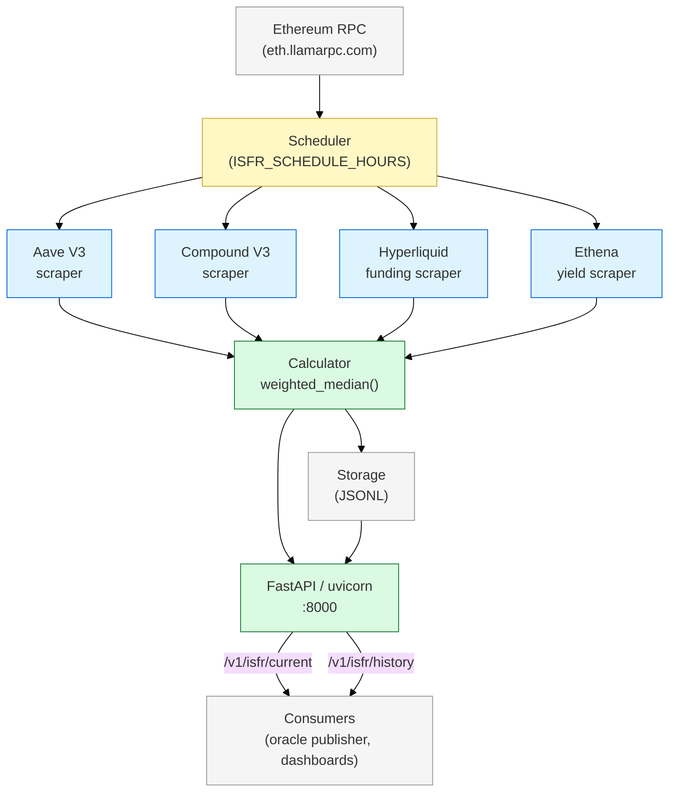

# ISFR — Implied Secured Funding Rate Index

## Summary

**ISFR (Implied Secured Funding Rate)** is a weighted-median index across four DeFi yield sources — Aave V3, Compound V3, Hyperliquid ETH perp funding, and Ethena sUSDe — intended to serve as the "Risk-Free Rate of DeFi" and the reference rate for Nunchi's yield perpetual contracts. This document specifies the V1 methodology, the service implementation, the API, and the path to V2 (volatility premium, expanded sources, governance). It also resolves an acronym collision with a separate `ISFR` metric inside the TEE clearing scoreboard.

## Critical Terminology: ISFR is overloaded

Two different things share the acronym `ISFR` across Nunchi source code and docs. This package disambiguates them rigorously [firm]:

| Term | Full name | Scope | Owner | Source |
|------|-----------|-------|-------|--------|
| **ISFR** (the index) | **Implied Secured Funding Rate** | External DeFi reference rate, product-facing. What yield perps settle against. | `isfr-service` repo, this doc | `~/isfr-service/README.md` |
| **ISFR_score** (the metric) | **Internal Solvency & Funding Ratio** | Internal per-agent risk/health metric computed by the clearing engine's scoreboard. | `Tee-work-/parent/scoreboard.py` | `TEE_ARCHITECTURE_V1.md` §11.4 |

**This document is about the index only.** The internal scoreboard metric is documented in [03-tee-clearing.md §Scoring Metrics](03-tee-clearing.md#scoring-metrics). When reading code or old docs, always check context — if it's in the scoreboard or risk manager, it's the ratio; if it's in the oracle or yield perp spec, it's the index.

## V1 Methodology

### Sources and Weights

V1 aggregates four DeFi yield sources, each weighted equally at 0.25 [firm]. Source: `~/isfr-service/README.md`.

| Source | What it measures | Weight | Update cadence |
|--------|-----------------|--------|----------------|
| **Aave V3** | USDC supply APY (Ethereum mainnet) | 0.25 | Per block |
| **Compound V3** | USDC supply APY (Ethereum mainnet) | 0.25 | Per block |
| **Hyperliquid** | ETH perp funding rate (annualized) | 0.25 | Per funding interval (~8h) |
| **Ethena** | sUSDe 7-day rolling yield | 0.25 | Daily rolling window |

### Formula

```
ISFR = Weighted_Median(Sources) + Volatility_Premium
```

Where:
- `Weighted_Median` sorts source values, accumulates weights, and returns the value at cumulative weight ≥ 0.5 (ties broken deterministically by source index)
- `Volatility_Premium` is a risk adjustment reserved for V2

**V1**: `Volatility_Premium = 0` [firm] — the index is the raw weighted median with no premium.

### Why weighted median (not mean)

- **Outlier resistance**: A single source going to zero or spiking (e.g. an exploit drains Aave liquidity, APY prints 1000% for 10 blocks) cannot move the median
- **Byzantine tolerance**: Up to 49% of total weight can be corrupted without affecting the result
- **Matches oracle convention**: The Daeji validator oracle uses weighted median at both layers; consistency reduces surprises across the system [firm]

## Service Architecture



### Service location

| Field | Value |
|-------|-------|
| Repo | `~/isfr-service/` |
| Remote | `https://github.com/Nunchi-trade/isfr.git` |
| Language | Python |
| Entry point | `python -m isfr.main` (scheduler + API) or `uvicorn isfr.api:app --host 0.0.0.0 --port 8000` (API only) |
| Packaging | `pip install -e ".[dev]"` |

## API

Source: `~/isfr-service/README.md` [firm].

| Endpoint | Method | Returns | Notes |
|----------|--------|---------|-------|
| `/v1/isfr/current` | GET | Latest ISFR rate | The value yield perps reference for mark price |
| `/v1/isfr/history` | GET | Historical rates, query `?days=30` | For backtesting, charting, audit |
| `/health` | GET | Service health | Liveness probe |

## Configuration

Environment variables (source: `~/isfr-service/README.md`):

| Variable | Default | Description |
|----------|---------|-------------|
| `ETH_RPC_URL` | `https://eth.llamarpc.com` | Ethereum RPC endpoint for on-chain scraping |
| `ISFR_DATA_DIR` | `data` | Directory for JSONL storage of historical rates |
| `ISFR_SCHEDULE_HOURS` | `1` | Calculation interval in hours |
| `ISFR_PORT` | `8000` | API server port |

## Publisher Path to the Oracle

The `isfr-service` is the off-chain producer. The on-chain consumer is the Daeji oracle precompile at `0xA01` which exposes `getOracleSpot(uint32 instrumentIndex)`. The publisher that bridges them is a planned component [exploratory] — options:

| Option | How it works | Pros | Cons |
|--------|-------------|------|------|
| Validator sidecar integration | Each Daeji validator's `oracle-sidecar` polls `/v1/isfr/current` and includes the value in its per-validator `OracleVote` | Matches existing Daeji oracle architecture; stake-weighted median across validators | Requires every validator to run the ISFR service or trust one endpoint |
| Dedicated `DeskFeed` connector | Implement a `FeedSource` trait specifically for ISFR; use authenticated HTTPS to a Nunchi-operated endpoint | Clean separation, matches SOFR/UST-3M tier-2 pattern | Single point of trust until multiple endpoints are supported |
| On-chain publisher contract | Single signer posts ISFR values to a contract; oracle reads from there | Simplest | Single-signer risk; defeats the purpose of the multi-source median |

**Recommendation**: DeskFeed connector with multiple endpoints after V2 [probable]. V1 can start with a single trusted endpoint during the testnet phase.

## Relationship to NRIS

The **NRIS (Nunchi Reference Index Suite)** is a separate, already-live index suite covering equities, FX, and fixed income for Hyperliquid perpetuals [firm]. Source: `~/obsidian-vault/projects/nris-oracle.md`.

| Property | ISFR | NRIS |
|----------|------|------|
| What it measures | DeFi yield rates | Equity prices, FX baskets, bond yields |
| Sources | 4 DeFi venues (Aave, Compound, HL, Ethena) | Pyth, Stork, carry-forward fallback |
| Architecture | Python service (`isfr-service`) | Rust workspace with `nris-core`; 7 SEDA oracle programs |
| Outputs | 1 index (the rate) | 12 index outputs across 4 asset classes |
| Status | V1 in development | Live on testnet, 12 indices running [firm] |
| Venue | Will feed Daeji oracle precompile for yield perps | Feeds Hyperliquid HIP-3 markets |

They are complementary, not alternatives. NRIS covers traditional asset classes; ISFR covers DeFi yield. Both feed their respective perp market suites.

## V2 Roadmap

| Item | Status | Notes |
|------|--------|-------|
| Volatility premium formula | Not specified | [exploratory] — needs design; candidate: stdev of source disagreement over rolling 24h |
| Expand source set | Not started | [probable] — candidates: Morpho, Spark, Maker DSR, Pendle PT yields |
| On-chain weight governance | Not started | [exploratory] — governance-controlled per-source weights via Daeji governance phase |
| Tier-2 rate coverage | Planned | Integrate SOFR, UST-3M, ETH staking rate as separate index tiers |
| Publisher redundancy | Planned | Multiple validator endpoints for cross-check before on-chain publication |

## Tradeoffs

| Decision | Chosen | Rejected | Rationale |
|----------|--------|----------|-----------|
| Aggregation function | Weighted median | Weighted mean | Median is robust to outliers; mean is not. DeFi yields spike frequently during incidents. |
| V1 weights | Equal (0.25 each) | Proportional to source TVL | TVL-weighted gives Aave dominant influence, re-introduces single-source risk. Equal weights maximize diversification. |
| Source set size | 4 | Single source (just Aave) | Single source defeats the purpose; 4 gives Byzantine tolerance with manageable scraping complexity. |
| Volatility premium | 0 in V1 | Compute from rolling stdev immediately | Premium methodology needs empirical calibration first. Starting at 0 keeps V1 auditable. |
| Service language | Python | Rust (matches NRIS) | Python's web3 and RPC libraries are more mature for this prototype scope. Rewrite in Rust if performance becomes an issue. |

## Open Questions

- [ ] @jl — Should Hyperliquid's ETH perp funding rate be included at all? It measures speculative pressure, not lending yield — potentially a confounding signal — due 2026-04-18
- [ ] @jl — What is the right update cadence? Service defaults to 1h (`ISFR_SCHEDULE_HOURS=1`) but yield perps clear every 10s. Is a stale-but-smooth rate OK, or do we need sub-minute updates? — due 2026-04-22
- [ ] @wp — How does the ISFR value reach the Daeji oracle precompile? Validator sidecar integration vs DeskFeed connector — design decision needed before Phase B oracle tick — due 2026-04-25
- [ ] @jl — V2 volatility premium methodology — rolling stdev, GARCH, realized vol from the perp itself? — due 2026-05-10

## Action Items

- [ ] @jl — Write a `v2-design.md` exploring the volatility premium methodology — due 2026-05-01
- [ ] @wp — Spike a `DeskFeed` connector in `oracle-sidecar` that pulls from `/v1/isfr/current` — due 2026-04-20
- [ ] @jl — Add Morpho and Spark as candidate sources for V2; draft weight proposals — due 2026-04-30
- [ ] @jl — Document the `isfr-service` deployment target (where it runs in prod) — due 2026-04-15

## See Also

- [00-overview.md](00-overview.md) — package overview
- [01-yield-perps.md](01-yield-perps.md) — the instrument that references this index
- [03-tee-clearing.md](03-tee-clearing.md) — includes the scoreboard `ISFR_score` metric (different thing)
- [04-end-to-end.md](04-end-to-end.md) — worked example showing the index in action
- [docs/chain/daeji/](../../../docs/chain/daeji/) — Daeji oracle integration target
