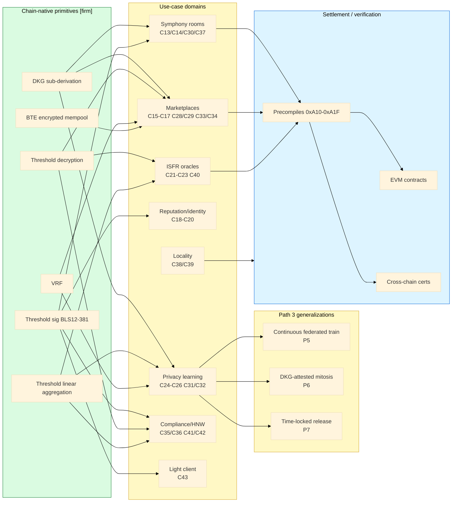
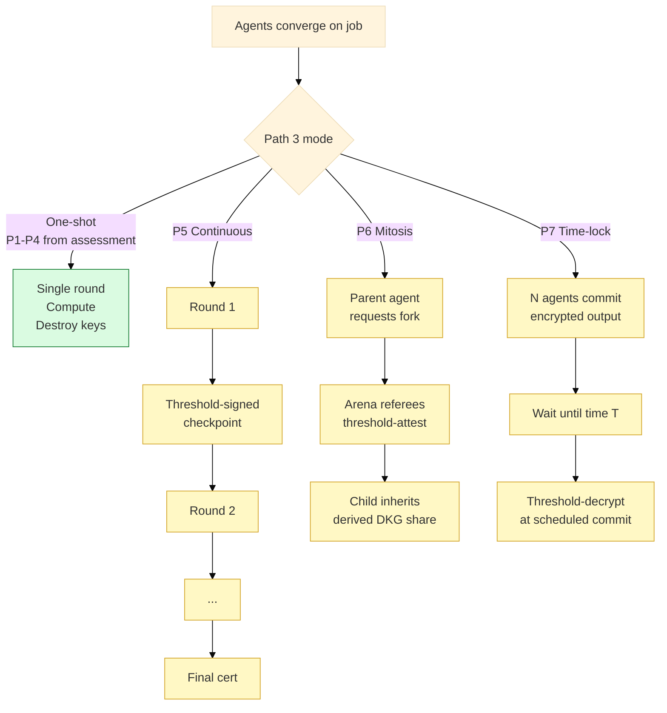

## Summary

Daeji ships with Commonware DKG wired into consensus — distributed key generation, threshold signatures (BLS12-381), and threshold decryption are chain-native primitives, not application-layer add-ons. The 2026-04-30 USC confidential-compute assessment mapped the first 12 capabilities (C1–C12) and 4 Path 3 patterns (P1–P4). This PRD extends that catalog with **29 net-new capabilities (C13–C43)** and **3 Path 3 generalizations (P5–P7)**, drawn from sweeping all 38 open PRs in this repo plus the canonical chat spec, PRD-11 agent-to-agent learning, the privacy-robotics spec, the hybrid perp PRD, and the Nunchi HOUSE PRD. Output: a priority-tiered catalog plus a concrete proposal for 7 precompile slots in the open `0xA10–0xA1F` agent-comm namespace.

## Background — primitives this catalog composes from

Zero-context primer for readers outside the chain team:

- **DKG (distributed key generation)** [firm]. Each validator holds a share of a chain pubkey. Nothing decrypts without ≥ *t* of *n* validators cooperating. No trusted dealer.
- **Threshold signatures (BLS12-381)** [firm]. Any *t* validators can produce a single ~96-byte signature verifiable against one ~48-byte chain pubkey. Threshold-Simplex packages this into ~240-byte certificates as a consensus-internal primitive (Commonware Jan 2025 paper).
- **Threshold decryption** [firm]. Ciphertext encrypted to the chain pubkey is readable only when *t* shares cooperate to decrypt. The basis for Shutter-style fair ordering.
- **Threshold linear aggregation** [firm]. Sums and weighted means over encrypted contributions reduce to BLS-friendly operations. Non-linear aggregations require Path 3 or further protocol design.
- **DKG sub-derivation** [probable]. Per-room / per-arena / per-round group keys derived from the chain DKG without re-running the protocol.
- **Path 3** [firm, defined]. Chain-controlled ephemeral plaintext compute: agents converge on a job, chain mints a group key, a shared compute server runs the workload, server is wiped on completion. Not "compute over encrypted data" — chain controls *who* and *when*, not *how* the compute runs.
- **VRF** [firm]. Threshold-signature output used as bias-resistant randomness (Commonware crate `commonware-vrf`).
- **BTE (Batched Threshold Encryption)** [exploratory]. Commonware April 2026 paper; O(n) overhead independent of batch size. Implementation timeline TBD — paper → code is in flight (track Guru Vamsi Policharla).

See `docs/chain/architecture/commonware-capabilities-not-yet-built.md` for the full inventory of crates and their stability tiers.

## Problem Statement

Three problems converge:

1. **The TEE narrative collapsed but the catalog hasn't expanded.** The 2026-04-30 assessment showed ~90% of TEE-scoped work folds into chain-native threshold primitives. We catalogued 16 capabilities (C1–C12 + P1–P4). That's the first cut, not the ceiling — many open PRs imply DKG-shaped use cases that haven't been listed.
2. **Open PRs reinvent threshold patterns.** PR #104 specifies MPC `(t+1)/N=9, t=2` for federated training; PR #107 specifies "stigmergic" InsightStore writes for A2A learning; PR #130 references encrypted-mempool primitives for V2 CLOB. All three reduce to chain-native threshold operations we already have. Without an explicit catalog, each PRD reinvents its own crypto framing.
3. **The agent-comm precompile namespace is empty.** The financial precompile range is `0xA01–0xA0C`. The agent-comm namespace `0xA10–0xA1F` is open and unallocated (per PR #132's open-decisions table). EVM-side helpers for BLS pairing, threshold-decrypt verification, and DKG sub-derivation would let V1 Solidity contracts verify V2-emitted threshold certs cheaply — bridging the hybrid perp stack (PR #130).

## Audience

- **@wp / @jacob** — chain-team owners deciding precompile namespace allocation and consensus-path tradeoffs.
- **@sdb** — BD/GTM + product owner for arena framing (PR #114), the live ISFR demo, and the upcoming HOUSE platform (PR #135).

## Architecture map — primitives → use-case domains → settlement

## TL;DR — the seven candidates to build first

| # | Capability | Why | Effort | Demo / market value |
|---|---|---|---|---|
| **C13** | Threshold-signed symphony deliverables (per-room DKG sub-key) | Already implied by the chat spec but not formalized — converts every multi-agent room into a chain-recognizable signing entity | S | High (Devnet-2 demo) |
| **C15** | Sealed-quote MM RFQ with VRF executor selection | Eliminates last-look + priority-gas auction in one mechanism | M | High (HFT MM, Tether GTM) |
| **C21** | Outlier-robust threshold aggregation for ISFR (trimmed mean / median via masked sum) | Closes the USC §9-Q3 federated-poisoning question without leaving the linear envelope | M | High (USC sign-off, ISFR-on-mainnet gate) |
| **C24** | Threshold-aggregated LoRA-delta sharing (PRD-11 M4 carrier privacy) | Makes A2A learning private at the carrier layer without TEE | M | High (privacy-without-TEE story) |
| **C27** | BTE-backed encrypted mempool for V2 native CLOB (PR #130 hybrid stack) | O(n) batch overhead, Commonware April 2026 paper purpose-built for this | L | Very high (V2 differentiator) |
| **C38** | Regional DKG sub-quorums (Minimmit 50ms regional path) | Sub-100ms confidential ops in-region, then upgrade to global quorum for settlement | M | High (locality moat) |
| **C42** | Private portfolio aggregation across HNW custodians (Nunchi HOUSE PRD #135) | Solves HNW privacy at the data layer instead of via segregated accounts | M | Very high (HOUSE differentiator) |

`S` = ≤1 week. `M` = 2–4 weeks. `L` = ≥1 month.

## Capability catalog — 29 net-new + 3 Path 3 generalizations

Numbering continues from the assessment doc (which ended at C12 / P4).

### Symphony / multi-agent rooms — chat spec, PR #132, PR #136

| # | Capability | Mechanism | Primitives |
|---|---|---|---|
| C13 | Threshold-signed symphony deliverables — per-room DKG sub-key, signs final result hash with one BLS cert. Coalition becomes a durable on-chain identity that can re-bid future jobs as a unit. | Per-room DKG sub-derivation; threshold-Simplex–style cert at submit | DKG sub-derivation, BLS threshold sig, BatchVerifier |
| C14 | Stigmergic on-chain pheromones — symphony rooms publish encrypted intermediate findings; threshold-decrypt unlocks them for downstream agents that the room's policy admits. | Encrypt-to-room-key; decrypt-on-policy-match (e.g., reputation tier ≥ K) | Threshold decryption, DKG sub-key, ERC-8004 reputation gate |
| C30 | Verifiable agent-spawned panels with threshold lineage — generative dashboards (PR #126) show a 240-byte cert proving "these N agents contributed, weighted by W." | Each contributing agent signs partial; aggregated to threshold cert at panel-render time | BatchVerifier, threshold-Simplex cert, BLS aggregation |
| C37 | Threshold-attested code reviews / dev artifacts — when an agent suggests a build / dep / patch, K reviewer agents co-sign. The PR carries a single 240-byte proof of "K-of-N reviewers approved." | Reviewer-agent DKG sub-key per repo; aggregate sigs at PR submit | BLS DKG, threshold sig, conformance gate in CI |

### Marketplace / auctions / clearing — PR #114, PR #130, PR #136

| # | Capability | Mechanism | Primitives |
|---|---|---|---|
| C15 | Sealed-quote MM RFQ with VRF executor selection — quotes encrypted to chain pubkey; close window; threshold-decrypt to reveal; VRF picks the winner uniformly when ties exist or above-threshold tier. | Encrypt-then-decrypt + VRF for tiebreak / fair pick | Threshold encryption, VRF |
| C16 | Threshold-decrypted bounty escrow — bounty unlocks only when *t-of-n* judges co-decrypt the result. No single arbiter releases funds unilaterally. | BountyMarket extension; release gated on threshold-decrypt event | Threshold decryption, bond-staked judges |
| C17 | Bond-staked oracle dispute via threshold counter-proof — challenger posts sealed dispute; oracle's threshold-signed counter-proof proves correctness; chain slashes the loser. | Sealed challenge + threshold-signed reply + chain settlement | Threshold sig, sealed-bid, slashing |
| C28 | Sealed-bid liquidation auctions with VRF tiebreak — liquidation candidates encrypt bids; chain decrypts at finalization; VRF picks among ties. Removes priority-gas exploit class. | BTE-style mempool for liquidations specifically | BTE / threshold encryption, VRF |
| C29 | Cross-chain settlement with succinct certs — bridges accept "this was the canonical view at height H" via 240-byte threshold-Simplex cert. No single sequencer trust. | Threshold-Simplex cert at finalization → bridge contract | Threshold-Simplex, BatchVerifier |
| C33 | Arena-scoped DKG group keys — each arena (a16z DD, peaq, JPM custody, Tether GTM, Ethereal) has a sub-derived DKG. Arena outputs carry "arena-attested" certs. | DKG sub-derivation per arena; resharing on arena rotation | DKG sub-derivation, resharing |
| C34 | Cross-arena learning bridges with threshold attestation — when arena A exports a learning to arena B, A's threshold sig attests "passed our gates." | Per-arena DKG + cross-arena policy registry | Threshold sig, policy registry |

### ISFR / oracle — live testnet, PR #110, PR #111

| # | Capability | Mechanism | Primitives |
|---|---|---|---|
| C21 | Outlier-robust threshold aggregation — median via weighted bisection (BLS-friendly), trimmed mean via masked sum, Krum approximation. Closes USC §9-Q3 federated-poisoning question. | Linear primitives composed to approximate non-linear robust estimators | Threshold linear aggregation, masked-sum tricks |
| C22 | Threshold-issued oracle certs with epoch resharing — index publishers' DKG resharing each epoch; validator set rotates without breaking historical signatures. Critical for long-lived index series (year-on-year ISFR backtests). | BLS resharing across validator-set epochs | DKG resharing, conformance gate |
| C23 | Conditional-reveal prediction markets — resolutions threshold-decrypt only when truth-conditions are met (e.g., "reveal Saturday's CPI estimate at Saturday + 1h"). Shutter for long-form. | Time-locked threshold decryption | Threshold encryption, scheduled commit |
| C40 | Paywalled threshold-decrypted ISFR streams — premium signals encrypted to chain pubkey; only paid subscribers' agents hold valid threshold shares. Native cryptographic paywall. | Subscription-tier-gated threshold share issuance | Threshold encryption, entitlement registry |

### Reputation / identity — PR #107, PR #113, ERC-8004

| # | Capability | Mechanism | Primitives |
|---|---|---|---|
| C18 | Anonymous tier credentials — agent proves "tier ≥ X" via threshold-issued credential without revealing identity. Lets reputation-gated rooms admit pseudonyms. | Threshold-issued BLS credentials with tier-encoded scope | Threshold sig, blind-signature pattern |
| C19 | Reputation-weighted threshold voting — votes encrypted, weighted by on-chain reputation, threshold-aggregated. Output is a public weighted total without revealing per-voter votes/weights. | Encrypted weighted sum via DKG | Threshold linear aggregation, encrypted weights |
| C20 | Pseudonymous slashing appeals — slashed agents file encrypted appeals; threshold-decryption unlocks identity to a smaller jury under scope. | Two-tier threshold (small jury < whole validator set) | Threshold decryption, jury-key derivation |

### Privacy-preserving learning — PR #104, PR #107

| # | Capability | Mechanism | Primitives |
|---|---|---|---|
| C24 | Threshold-aggregated LoRA-delta sharing (PRD-11 M4) — student LoRAs upload encrypted deltas; only the *aggregate* across N students decrypts. Individual training data stays private at the carrier-aggregation layer. | DKG-keyed federated round; per-round threshold decrypt of sum only | Threshold linear aggregation, DKG sub-key per round |
| C25 | Sealed teacher-selection RFQ (PRD-11 M2) — student emits encrypted "want a teacher for capability X"; teachers bid sealed availability; threshold-decrypt picks best match. | Encrypted RFQ + sealed bid + threshold decrypt + VRF tiebreak | Threshold encryption, VRF |
| C26 | Cross-domain co-dreaming with threshold linking (PRD-11 M5) — REM accumulators encrypted per agent; threshold-decrypt only when N agents from different domains contributed (the M5 cross-domain gate becomes cryptographic, not advisory). | Domain-tagged shares; decrypt requires diverse domain set | Threshold decryption, domain-tagged DKG |
| C31 | DKG-keyed federated training rounds — replaces the "MPC `(t+1)/N=9, t=2`" framing in PR #104 with chain-native threshold. Per-round ephemeral DKG key; rotation + revocation are cryptographic. | Per-round DKG; key destruction at round-end | DKG sub-derivation, ephemeral keys (C11 specialized) |
| C32 | Threshold-decrypted DPIA disclosure (GDPR Art. 35) — regulator requests training-run metadata; threshold of {compliance officer, protocol, auditor} co-decrypts. No single party reads alone. | Three-party threshold (cross-organization quorum) | Threshold decryption, multi-org DKG |
| P5 | Continuous federated fine-tuning with milestone certs — long-running training across N data holders; each round commits a threshold-signed checkpoint; pause/resume without losing key custody. | Path 3 + scheduled checkpoint sigs | DKG resharing, Path 3 ephemeral compute |
| P6 | DKG-attested genome mitosis (PRD-11 M3) — agent forks (genome split) require threshold attestation from arena referees; new agent inherits a derived DKG share, providing cryptographic lineage. | Sub-derive child key from parent DKG + arena threshold sign | DKG sub-derivation, threshold attestation |
| P7 | Time-locked release of joint research outputs — N research agents agree to publish at time T; encrypted deliverable on-chain; threshold-decrypt at T (Shutter for long-form). | Time-locked threshold decryption | Threshold encryption, scheduled-commit pattern |

### Locality / regional — PR #111, PR #117 (Minimmit path)

| # | Capability | Mechanism | Primitives |
|---|---|---|---|
| C38 | Regional DKG sub-quorums — Minimmit's 50ms-regional path lets a regional sub-quorum threshold-sign locally (sub-100ms confidential ops); upgrade to global quorum only for settlement. | Two-tier threshold: regional fast lane + global settlement | Minimmit consensus, DKG sub-derivation, regional epoch |
| C39 | Geo-fenced threshold decryption — regulatory data restricted to a regional sub-quorum (EU validators only see EU-tagged ciphertexts); cross-region access requires bigger quorum. Hardware-free regulatory geofencing. | Per-region DKG; cross-region access via combined-region threshold | DKG resharing across region tags |

### Compliance / audit / HNW — PR #133, PR #135, PR #117

| # | Capability | Mechanism | Primitives |
|---|---|---|---|
| C35 | Audit-trail threshold decryption — confidential operations (HNW txs, robotics training runs) encrypted at write time; threshold of {auditor, protocol, regulator} can decrypt for audit. | Multi-org DKG + audit-event-triggered decrypt | Threshold decryption, multi-org DKG |
| C36 | Sanction-screen threshold-signed allowlists — compliance providers issue threshold-signed allowlists; agents prove "I'm allowed" with a 240-byte BLS proof rather than an opaque KYC token. | Threshold-issued credential + revocation registry | Threshold sig, credential issuance |
| C41 | Subscription-tier-derived agent capabilities — premium model access, larger context windows gated by threshold-decrypted entitlement tokens. Cancellation = key revocation, not API key rotation. | Per-tier threshold key issuance + scheduled rotation | Threshold encryption, resharing on tier change |
| C42 | Private portfolio aggregation across HNW custodians (PR #135 Nunchi HOUSE) — positions encrypted per-custodian; threshold-aggregate computes unified PnL/exposure without any custodian seeing another's holdings. | Per-custodian encrypted submission → threshold-aggregate sum | Threshold linear aggregation, per-tenant DKG |

### Light-client / follower — Roko Phase B gap

| # | Capability | Mechanism | Primitives |
|---|---|---|---|
| C43 | Threshold-signed `kora_nodeStatus` — chain liveness/health endpoint signed via threshold so light agents trust no individual node. Closes the explicit "trusted RPC" gap in the Roko follower Phase B pivot. | Add threshold-cert wrapper on `kora_nodeStatus` response | Threshold sig, BLS pubkey publication |

## Net-new chain features — proposed agent-comm precompile slots

Most capabilities above compose from primitives already in the consensus layer. Seven would benefit from EVM-side helpers in the agent-comm namespace `0xA10–0xA1F`, currently open per PR #132's decision table. All [exploratory] until @wp / @jacob ratify the namespace split.

| Slot | Purpose | Used by | Confidence |
|---|---|---|---|
| 0xA10 | BLS pairing check (hash-to-curve + pairing) — verify threshold certs in EVM | C30, C37, C18 | [exploratory] |
| 0xA11 | Threshold-decrypt verification (single share validate) — escrow / time-lock contracts | C16, C23, C32, C40 | [exploratory] |
| 0xA12 | DKG sub-derivation (room/arena/round → sub-key) — stable identifier derivation | C13, C14, C25, C31, C33 | [exploratory] |
| 0xA13 | VRF threshold-sig output verification — fair-pick mechanisms | C15, C25, C28 | [exploratory] |
| 0xA14 | ed25519 ↔ X25519 birational map (room-key handshake) — shared with chat-spec D2 step 2 | C13, C24 | [probable] |
| 0xA15 | Resharing-event verification (epoch transition) — long-lived index / tiered subscriptions | C22, C39, C41 | [exploratory] |
| 0xA16 | Domain-tagged threshold decryption (multi-tag combine) — multi-domain / multi-region / multi-org access | C26, C35, C39 | [exploratory] |

None of these need TEEs. They are EVM-side helpers that make threshold primitives cheap to call from contracts. Bonus: V1 Solidity contracts (PR #130) can verify V2-emitted threshold certs through the same precompile surface.

## Path 3 — what changes vs the assessment

The assessment framed Path 3 as **one-shot** ephemeral compute. Three useful generalizations land in this PRD:

The §6 threat model in the assessment is unchanged for all three — the "curious infra provider during compute" gap is identical. P5–P7 give a stronger audit story because each round / fork / scheduled-decrypt carries an on-chain event. **Open question for USC: does scheduled key rotation between P5 rounds preserve the threat model, or does it leak more than one-shot?**

## Priority / effort matrix

| Capability | Effort | Demo / market value | When to ship |
|---|---|---|---|
| C13 Threshold-signed symphony deliverables | S | High | Phase 3 of chat-spec rollout |
| C15 Sealed RFQ + VRF executor | M | High | Devnet-2 |
| C21 Outlier-robust ISFR threshold aggregation | M | High | Pre-mainnet |
| C24 Threshold-aggregated LoRA deltas | M | High | Roko Phase D / IMPL-11 |
| C27 BTE encrypted mempool (V2 CLOB) | L | Very high | V2 native rollout, post-Devnet 2 |
| C30 Threshold-signed agent panels | S | Medium | Concurrent w/ generative dashboard |
| C33 Arena-scoped DKG keys | S | Medium | Concurrent w/ arena rollout |
| C38 Regional DKG sub-quorums | M | High | Post-locality positioning land |
| C42 Private HNW portfolio aggregation | M | Very high | HNW pilot |
| Precompiles 0xA10–0xA16 (each) | M | Foundational | Pre-Devnet 2 namespace lock |
| C18 Anonymous tier credentials | M | Medium | After Devnet-2 |
| C22 ISFR resharing | S | Medium | When first index hits 12-month series |
| C32 DPIA threshold decrypt | M | High for regulated sales | Post-PR #104 promotion |
| C40 Paywalled streams | M | Medium | When subscription product lands |
| P5 Continuous federated fine-tune | L | High | Post-Roko demo May 7 |
| P6 DKG-attested genome mitosis | L | Medium | Post-PRD-11 §12 close |
| P7 Time-locked joint research output | S | Low-medium | Opportunistic |

## Tradeoffs

| Decision | Chosen | Rejected | Rationale |
|---|---|---|---|
| Catalog scope | Net-new only (C13–C43, P5–P7) | Repeat C1–C12 / P1–P4 | The assessment is canonical for those 16; this PRD extends, doesn't supersede |
| Doc placement | `docs/chain/` (status: draft) | `proposed/chain/` immediately | New work starts as draft per repo convention; promote via `./collab promote` after reviewer signoff |
| Precompile namespace | Propose 7 concrete `0xA10–0xA16` slots | Defer entirely to chain team | Concrete proposal accelerates the PR #132 open-decision cycle; @wp / @jacob still own ratification |
| Path 3 generalizations | Add P5/P6/P7 | Keep Path 3 one-shot only | Continuous training (Roko enterprise), genome mitosis (PRD-11 M3), and time-locked joint research are real workflows that need explicit framing |
| Confidence framing | Catalog at [exploratory] / [probable], TL;DR seven at [probable], primitives at [firm] | Mark whole catalog [firm] | Most C13–C43 entries are proposals; only the underlying primitives are firm |
| Mirror-fish / MEV / self-learning | Out of scope (libp2p path, per chat spec §0 matrix) | Re-route those onto chat | The chat-spec pivot memo is load-bearing — adversarial / competitive traffic stays on libp2p; this PRD only addresses cooperative threshold-shape work |

## Open Questions

- [ ] @wp + @jacob — Ratify the agent-comm precompile namespace `0xA10–0xA1F` with the 7-slot proposal in this PRD — due 2026-05-15
- [ ] @jacob — Confirm BTE adoption timeline with Guru Vamsi Policharla (paper → code progression for C27) — due 2026-05-15
- [ ] @wp — How far does masked-sum / weighted-bisection take us on robust ISFR estimators (C21) before non-linearity forces Path 3? Owner with USC §9-Q3 input — due 2026-05-10
- [ ] @jl — Multi-org DKG operational design (C32 / C35) — separate doc covering validators across compliance + protocol + regulator trust boundaries — due 2026-05-12
- [ ] @jl — Tier-credential registry design (C18 / C40 / C41 share the primitive "threshold-issued credential with scoped reveal") — converge or fork? — due 2026-05-10
- [ ] @sdb — Map the 10 arena partner cases (PR #114) onto C33 / C34 with concrete DKG sub-key naming convention — due 2026-05-10
- [ ] @wp — V2 CLOB BTE mempool integration sequence; gate V2 perp work on BTE BETA promotion or proceed in parallel? — due post-V2 cost workshop (2026-05-15)

## Action Items

- [ ] @jl — Circulate this PRD to @wp / @jacob / @sdb for redline of TL;DR seven — due 2026-05-02
- [ ] @jl — Update PR #132's open-decisions table with the 7-slot namespace proposal as input — due 2026-05-03
- [ ] @jl — Add C21 sketch (masked-sum + weighted-bisection + Krum approximation) to the USC §9-Q3 question doc — due 2026-05-03
- [ ] @jl — File companion PRD for tier-credential registry (C18/C40/C41 unification) — due 2026-05-10
- [ ] @wp — Tag PRD-11 modality table sections (M2/M4/M5) with C-numbers from this catalog — due 2026-05-07
- [ ] @sdb — Add arena-DKG-key naming column to the arena BD doc (PR #114) — due 2026-05-08
- [ ] @wp — Verify V2 CLOB design surface accepts the BTE mempool plug-point cleanly — due 2026-05-15

## See Also

- [2026-04-30 USC confidential-compute assessment (vault)](../../call-notes/) — canonical map of C1–C12 and P1–P4 (this PRD extends)
- [Daeji × commonware-chat agent-coordination spec (proposed)](../../proposed/chain/) — symphony / ISFR / reputation-gated split, §0 matrix, D1–D5 decisions
- [Agent stack ↔ Commonware integration v4 (PR #132)](../../proposed/chain/) — the precompile namespace open decision lives here
- [Agent-coordination UI surfaces (PR #136)](../../proposed/dashboard/) — frontend implications of C13/C14/C30
- [Commonware capabilities not yet built](architecture/commonware-capabilities-not-yet-built.md) — primitive inventory + adoption tier
- [Follower nodes × agents](architecture/follower-nodes-x-agents.md) — light-client gap for C43

PR #104 (privacy-preserving robotics training), PR #107 (PRD-11 A2A learning), PR #110 (oracle deploy plan), PR #111 (localized chains), PR #113 (DAEJI tokenomics), PR #114 (arenas as BD hook), PR #117 (Control Tower), PR #126 (generative dashboard), PR #130 (hybrid perp stack), PR #135 (Nunchi HOUSE) — all referenced in §3.

## Out of scope

- Re-pitching TEE for the broad surface — the assessment §7 narrow remaining cases stay narrow
- Deleting the libp2p mesh — every capability above runs on the chat (cooperative) transport or is settlement-only; the §0 matrix in the chat spec stays load-bearing
- Unifying Daeji `0xA09 PASSPORT` and Roko `IdentityRegistry` (R4 in the chat spec) — all capabilities here honor the two-registry / shared-schema split
- ERC-8004 conformance work for Roko's intentionally-minimal `AgentRegistry` — Roko stays minimal
