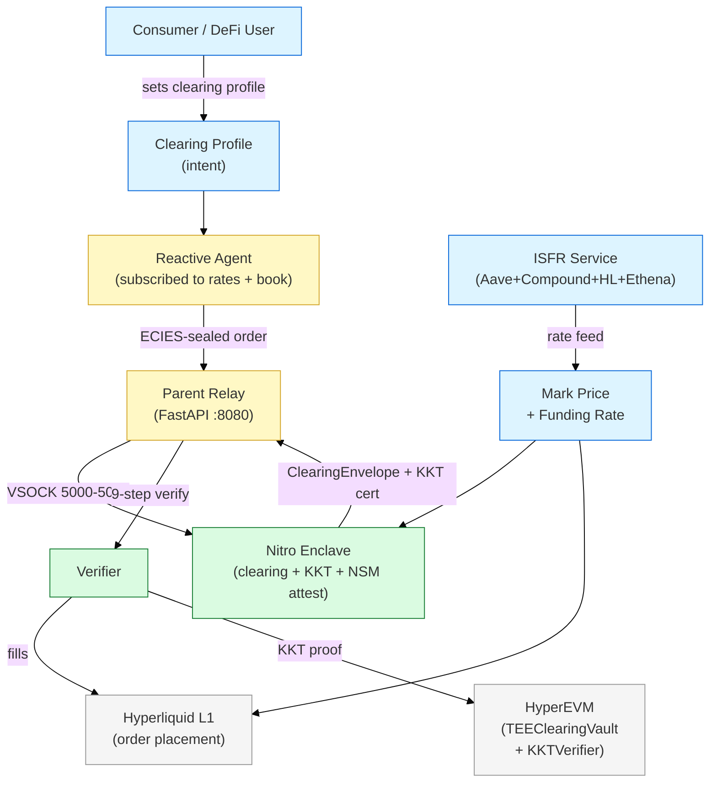
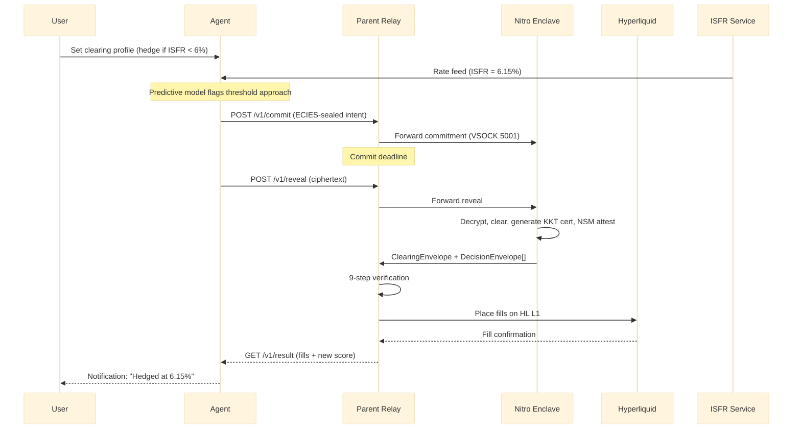

# Yield Perps Stack — Overview

## Summary

Nunchi's yield-perp product is a three-layer stack: a **perpetual contract** whose reference rate is the **Implied Secured Funding Rate (ISFR)**, matched in **cooperative batch cycles inside a TEE enclave**, and settled on Hyperliquid via HyperEVM contracts. This document is the map. It explains what each layer does, where the boundaries are, and why the stack looks the way it does.

## Background

DeFi users holding floating-rate positions (AAVE supply, Morpho vaults, LP positions) have no continuous hedge for yield risk [firm]. Pendle's expiring yield futures fragment liquidity across maturities and force manual rollovers. The Nunchi stack fixes this by offering a perpetual instrument (no expiration) settled against a standardized index (ISFR), matched by agents through a collusion-proof clearing engine, with a consumer-facing "clearing profile" intent layer on top.

## The Three Layers

| Layer | Name | What it is | Reference |
|-------|------|-----------|-----------|
| **L1 — Product** | Yield Perpetual Contract | A continuous-funding perp whose underlying is a DeFi yield reference rate (e.g. Aave USDC supply APY). No expiration. Funding rate settles the difference between locked and market rate every interval. | [01-yield-perps.md](01-yield-perps.md) |
| **L2 — Reference Rate** | ISFR — Implied Secured Funding Rate | Weighted-median index across Aave V3, Compound V3, Hyperliquid ETH perp funding, and Ethena sUSDe yield. Computed off-chain by the `isfr-service`, published on-chain via the Daeji oracle precompile. | [02-isfr-index.md](02-isfr-index.md) |
| **L3 — Clearing** | TEE Cooperative Batch Clearing | Agents submit ECIES-sealed orders to a Nitro Enclave. Enclave runs a price-time priority double auction, emits a KKT optimality certificate, and the parent relay verifies + executes on Hyperliquid. 37 rounds verified on testnet, 333/333 checks passed, 100% success rate [firm]. | [03-tee-clearing.md](03-tee-clearing.md) |

## Architecture at a Glance

## What problem each layer solves

| Layer | Problem it solves | Why a thinner solution fails |
|-------|-------------------|------------------------------|
| Yield perp instrument | DeFi users have no continuous hedge for yield risk | Expiring futures (Pendle) fragment liquidity per maturity and require manual rollover |
| ISFR index | Yield perps need a single agreed-upon reference rate that can't be gamed by one lending venue | Pulling from one source (e.g. just Aave) lets one protocol's rate spike move the entire market |
| TEE clearing | Agents need to submit orders without revealing strategies, and batch clearing needs to be collusion-proof | A plain CLOB leaks intent before the fill; a pure on-chain match has gas + latency that kills the 10s cycle |

## Scope

**In scope for this package:**
- Yield perp instrument definition (mark price, funding rate, position semantics) [firm]
- ISFR index methodology, sources, formula, and service API [firm]
- TEE clearing architecture, round lifecycle, contracts, verification protocol [firm]
- End-to-end worked example (AAVE liquidation backstop) [firm]
- Clearing profile UX layer [probable]

**Out of scope:**
- Daeji chain consensus, SpecPool parallelization, Kauri BFT — see `docs/chain/daeji/`
- Korai marketplace mechanism design (reputation, slashing, bounties) — see `docs/marketplace/specs/architecture-spec.md`
- Nunchi LLM / TinyLoRA training pipelines — see `docs/llm/`
- Valhalla data vault / privacy subsystem — see `docs/privacy/valhalla/`
- Agent marketplace hiring models — see `docs/marketplace/specs/mechanism-design.md`

## Tradeoffs

| Decision | Chosen | Rejected | Rationale |
|----------|--------|----------|-----------|
| Instrument type | Perpetual (continuous funding) | Expiring yield futures (Pendle model) | No rollover cliffs, no maturity fragmentation, single liquidity pool per reference rate |
| Reference rate | Weighted median of 4 diverse sources | Single-source rate (just Aave) | Resistant to single-venue manipulation; median tolerates ≤49% corrupted weight |
| Clearing engine | TEE cooperative batch inside Nitro Enclave | Pure on-chain CLOB | Gas + latency unacceptable for 10s batch cycles; TEE preserves strategy privacy during cross |
| Trust root | AWS Nitro NSM attestation (PCR0/1/2) | ZK proof of clearing correctness | ZK proving is not yet practical for O(N log N) matching at 10s cycles; NSM is live today |
| Verification | KKT certificate verified by on-chain `KKTVerifier` (O(N)) | Re-running clearing on-chain | O(N) verification is ~100× cheaper than re-clearing; KKT proofs are mathematically complete |
| UX abstraction | Clearing profiles (one-signature intents) | Per-trade user action | Consumer users cannot monitor rates continuously; intent-based flow is the only scalable UX |

## How the layers compose

## Open Questions

- [ ] @jl — Should the ISFR weight for each source be governed on-chain or remain hardcoded in the service until V2? — due 2026-04-20
- [ ] @wp — Does the clearing engine need to support multi-token baskets for the Phase-1 yield perp launch, or is single-asset V2 RAU sufficient? — due 2026-04-18
- [ ] @jacob — Oracle cadence: is 500ms (Phase B) feasible for yield perps given ISFR only updates hourly, or should yield instruments use a separate slower cadence? — due 2026-04-25
- [ ] @jl — Clearing profile fee structure — flat per-hedge, percentage of notional, or success-contingent? — due 2026-04-30

## Action Items

- [ ] @jl — Promote this package to `docs/marketplace/specs/` after Will reviews — due 2026-04-15
- [ ] @wp — Read package end-to-end and flag gaps before implementation planning — due 2026-04-12
- [ ] @jl — Update this overview if any layer's canonical source doc changes — due ongoing

## See Also

- [01-yield-perps.md](01-yield-perps.md) — instrument spec
- [02-isfr-index.md](02-isfr-index.md) — reference rate spec
- [03-tee-clearing.md](03-tee-clearing.md) — clearing architecture
- [04-end-to-end.md](04-end-to-end.md) — worked example
- [README.md](README.md) — package index and source citations
