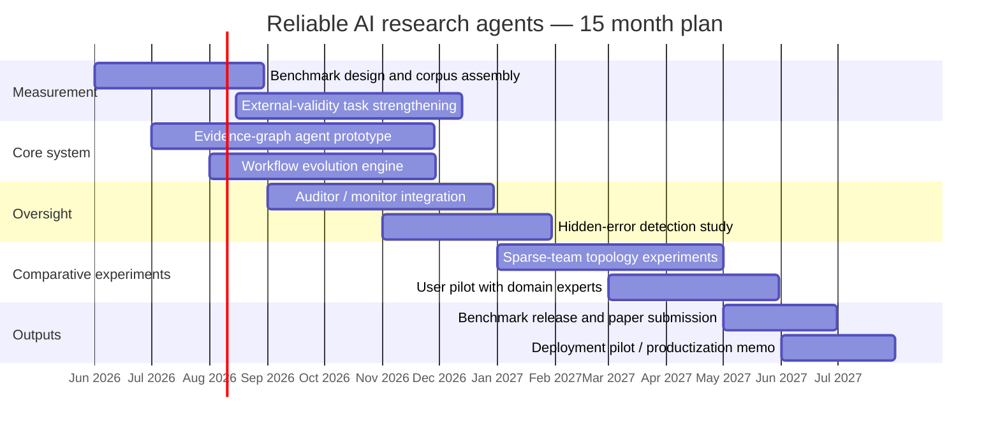
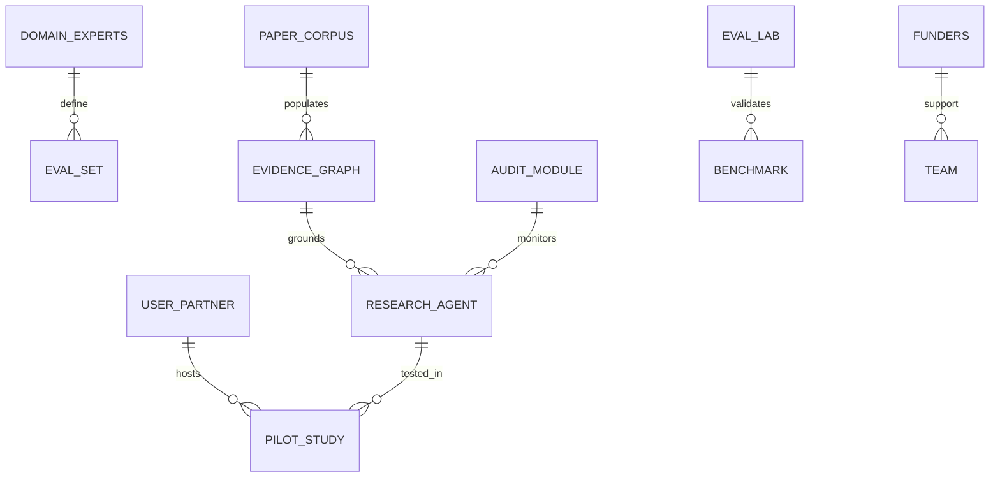
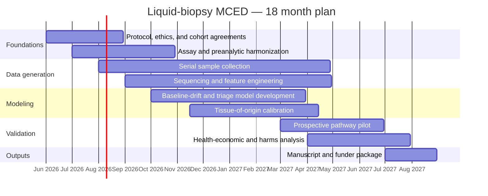
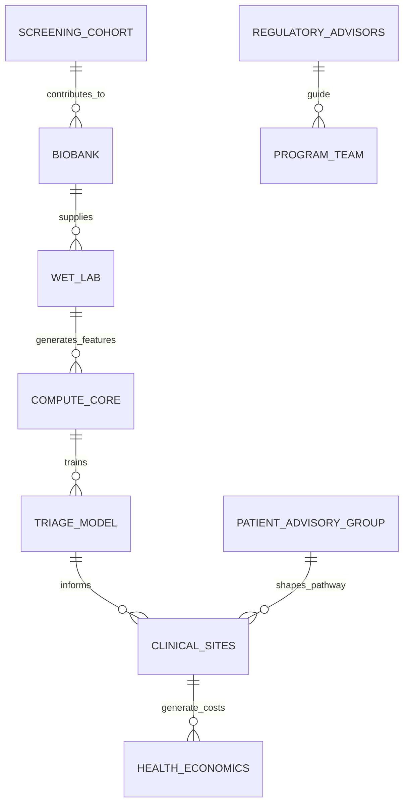
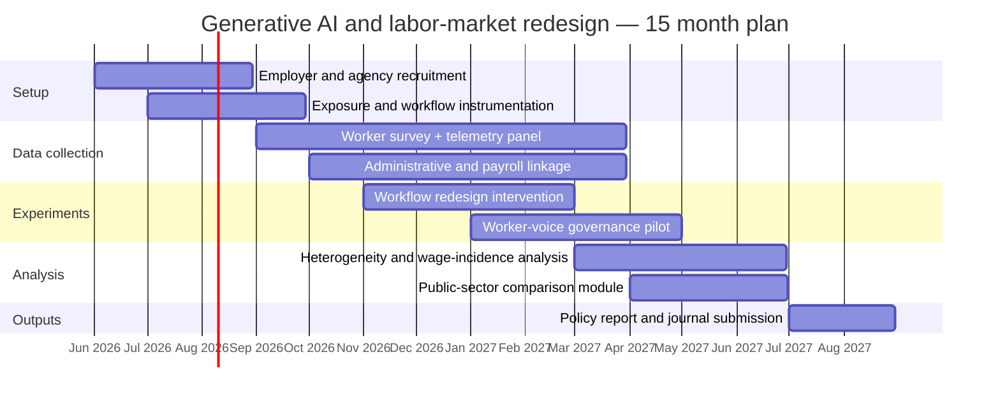
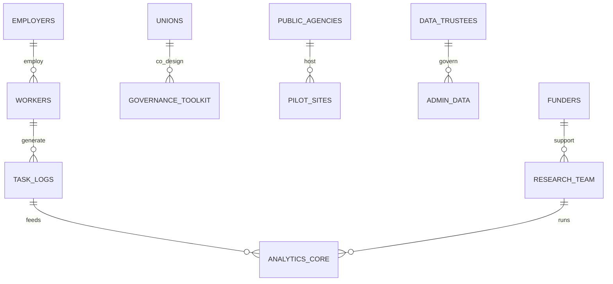

# A Cross-Domain Blueprint for Synthesizing an Unspecified Research Topic

When the topic is still undefined, the most rigorous way to do “deep research” is to separate the job into four linked layers: a **systematic map** of the field, a **judgment layer** that distinguishes consensus from controversy, a **translation layer** that asks what can be built or tested in 12–18 months, and a **portfolio layer** that chooses collaborators, funders, and publication or deployment paths. That structure aligns well with reporting guidance such as PRISMA 2020, with systematic mapping methods for structuring a field, and with rapid-review guidance for keeping fast-moving areas current. citeturn11search0turn11search5turn11search11turn11search3

The practical consequence is that an unspecified-topic synthesis should not begin by trying to “find the answer.” It should begin by forcing every candidate topic through the same evidence architecture: **What is the field? What has genuinely replicated? What is still only promising? What would constitute a decisive test? What is buildable with realistic data, people, and budget?** That template is portable across engineering, biomedicine, and policy, but the balance changes by domain: AI is benchmark-rich but externally validity-poor, biomedicine is assay-rich but clinical-utility-constrained, and labor-policy work is experiment-rich at the task level but still thin on long-run causal outcomes. citeturn17view0turn17view1turn17view8turn6search23turn17view14turn17view17

| Layer | Core question | Minimum source mix | Decision artifact |
|---|---|---|---|
| Field map | What subfields, methods, and benchmarks exist? | Reviews, benchmark papers, major industry reports | Theme map |
| Reliability check | What claims have replicated or generalized? | Primary empirical studies, benchmark audits, systematic reviews | Consensus/contradiction ledger |
| Translation | What could be tested in 12–18 months? | Methods papers, deployment studies, official guidance | Prioritized project slate |
| Ecosystem | Who could help fund, validate, or deploy it? | Official funder pages, consortia pages, evaluation infrastructure | Collaborator/funder/venue matrix |
| Portfolio | What should be done first? | Cross-layer comparison | Sequenced roadmap |

This report uses that template and instantiates it in three candidate domains: **reliable AI research agents**, **liquid-biopsy multi-cancer early detection**, and **generative AI and labor-market redesign**.

## Technology and AI example

**Executive summary.** A strong candidate technology domain for an unspecified-topic synthesis is **reliable AI research agents for knowledge-intensive work**. This area is mature enough to support a serious literature review, but still open enough that a 12–18 month project can generate publishable and deployable results. The central consensus is that agent capabilities are improving quickly and that workflow design matters: entity["organization","METR","ai eval nonprofit"] reports a post-2023 task-horizon doubling time of 131 days, and papers such as AFlow and GEPA show that automated workflow search and reflective prompt/program evolution can materially improve task performance and reduce human hand-tuning. citeturn17view0turn1search3turn2search0

The main contradiction is that **benchmark progress and real-world reliability are diverging**. On the one hand, agentic systems are becoming more capable over longer horizons, and evaluation infrastructure such as Inspect AI now ships with more than 200 pre-built evaluations. On the other hand, METR’s randomized trial found experienced open-source developers were **19% slower** when allowed to use early-2025 AI tools on their own repositories, and SWE-ABS found that roughly **one in five** “solved” patches on SWE-bench-style leaderboards were semantically wrong because weak tests failed to catch the error. citeturn17view3turn17view1turn17view7

A second contradiction concerns oversight. Work from entity["company","Anthropic","ai company"] suggests chain-of-thought monitoring is useful but not trustworthy enough to carry safety on its own: reasoning models often do not faithfully reveal the factors driving their outputs, while the newer “introspection adapters” line of work shows that separate audit modules can recover learned behaviors more reliably than naive self-reporting. The implication is that future research agents should be built around **externalized evidence, audit modules, and adversarial benchmark strengthening**, not around self-explanation alone. citeturn10search0turn17view5turn17view4

A third unresolved question is topology. MAST shows that multi-agent systems fail for structural reasons at least as often as for raw-model reasons, and prompt-infection work shows multi-agent communication can propagate attacks like a virus. Yet large self-organizing experiments also suggest that scaling agent counts does not always degrade quality. That means the central scientific question is no longer “single agent or multi-agent?” but rather **which sparse coordination topology is best for which task regime**. citeturn17view6turn10search3turn3search5

| Cluster | What the recent literature is doing | What looks robust | What remains unresolved |
|---|---|---|---|
| Capability measurement | Long-horizon autonomy benchmarks, coding benchmarks, agentic eval suites | Capability is rising; task horizon matters more than static QA | Transfer from benchmark to deployment |
| Workflow optimization | Prompt evolution, execution-based search, automated workflow design | Search over prompts/workflows can outperform manual design | Which gains survive outside curated tasks |
| Reliability auditing | Benchmark strengthening, adversarial tests, semantic correctness checks | Test-suite inflation is real; stronger evaluation changes rankings | How to measure external validity cheaply |
| Oversight and interpretability | CoT monitoring, introspection adapters, monitorability evaluations | Self-report is useful but insufficient; separate audit channels help | How to operationalize trustworthy monitors |
| Coordination and safety | Multi-agent taxonomies, prompt-infection attacks, sparse vs dense teams | Coordination failure is a first-order systems problem | Optimal team size and communication structure |

This literature map is grounded in current work from METR, AFlow, GEPA, Inspect AI, Anthropic’s faithfulness and introspection research, MAST, SWE-ABS, and prompt-infection studies. citeturn17view0turn1search3turn2search0turn17view3turn10search0turn17view5turn17view6turn17view7turn10search3

**Five prioritized research directions.**

| Priority | Direction | Hypothesis | Core methods | Required resources | Timeline | Success metrics |
|---|---|---|---|---|---|---|
| P1 | Evidence-graph research agent | A provenance-first agent will reduce citation and claim hallucination without sharply hurting productivity | Retrieval over paper graphs, claim-evidence linking, abstention calibration, human red-team review | 2 ML engineers, 1 infra engineer, 1 domain librarian/researcher, paper corpus, eval set | 3–12 months | ≥40% reduction in unsupported claims; maintained answer usefulness |
| P2 | Auditor-augmented agent | Separate audit modules outperform chain-of-thought monitoring alone on hidden-error detection | Introspection-adapter-style auditing, execution traces, blind evaluator studies | Model access, safety researcher, annotation budget, secure logging | 4–12 months | Higher hidden-error recall at fixed false-positive rate |
| P3 | Workflow-evolution engine for literature synthesis | Reflective prompt/program evolution improves review quality faster than RL-heavy tuning | GEPA- and AFlow-style search over review workflows; execution-based scoring | Modular agent framework, benchmark set, compute budget | 2–9 months | Better evidence coverage and factual precision per dollar |
| P4 | Sparse-team topology benchmark | For literature and technical analysis tasks, 1–4 agents will dominate dense multi-agent teams on cost-adjusted quality | Controlled comparison of solo, reviewer-writer, planner-executor, and dense teams | Benchmark authoring, human judges, telemetry instrumentation | 4–10 months | Pareto frontier on quality/cost/latency |
| P5 | External-validity benchmark strengthening | Harder, adversarially strengthened tasks produce rankings that better match real user outcomes | Expert-authored perturbations, semantic patch checks, hidden-ground-truth tasks | Domain experts, benchmark maintainers, evaluator tooling | 6–15 months | Improved correlation between benchmark rank and user success |

The rationale for this portfolio is straightforward: P1 and P5 create the measurement substrate, P2 addresses trust, P3 addresses performance, and P4 tests the design variable that the field is still arguing about. Together, they turn a vague “research agent” problem into a reproducible systems agenda grounded in today’s known failure modes. citeturn17view1turn17view7turn10search0turn17view6

Best-fit collaborators in this domain are METR for horizon-style evaluation, the plain-language and adversarial-eval ecosystem around Inspect AI maintained by the entity["organization","UK AI Security Institute","uk government institute"], and frontier model providers or interpretability groups such as Anthropic for monitorability and audit experiments. The most natural funders are the entity["organization","National Science Foundation","us research agency"] AI research ecosystem, entity["organization","ARIA","uk research agency"]’s safeguarded-AI work, entity["organization","Schmidt Sciences","philanthropic funder"]’ science of trustworthy AI program, and AISI grant programs. Likely publication venues are NeurIPS, ICLR, ICML, ACL, TMLR, and FAccT; the most credible near-term deployment venue is a high-stakes internal research workflow rather than fully autonomous public release. citeturn0search0turn16search13turn17view3turn16search1turn13search4turn16search0turn16search3

## Health and biomedicine example

**Executive summary.** A strong health/biomedicine exemplar is **liquid-biopsy multi-cancer early detection**. It is scientifically rich, highly interdisciplinary, and unusually good for demonstrating how a synthesis should separate **assay performance**, **clinical utility**, and **implementation reality**. The first consensus point is definitional: the entity["organization","National Cancer Institute","us cancer institute"] treats “multi-cancer detection” and “multi-cancer early detection” as the same class of tests for asymptomatic people. The second is cautionary: NCI’s public guidance says that no MCD tests have yet been authorized by the FDA and that whether they improve outcomes in people without symptoms still needs randomized clinical trials. citeturn17view8turn6search7turn5search12

The scientific center of gravity has shifted from single-signal assays toward **multimodal cfDNA approaches** that combine methylation, fragmentation, copy-number, and increasingly AI-based tissue-of-origin inference. Earlier validation work showed high specificity and good cancer-signal-origin prediction for targeted methylation assays, while newer fragmentomics-based work reports encouraging accuracy in large prospective validation cohorts and asymptomatic screening settings. That is real progress, and it changes what is technically plausible. citeturn6search1turn6search5turn17view9turn6search22

But the major contradiction remains unresolved: **technical validity is running ahead of demonstrated clinical benefit**. The 2025 systematic review in Annals of Internal Medicine found insufficient evidence on the accuracy and harms of MCD tests because studies were limited and findings inconsistent, while NCI’s Vanguard program exists precisely because the field still needs prospective evidence on how these tests perform in realistic screening pathways. In other words, the frontier is no longer “can a signal be detected?” but “does the signal improve outcomes net of follow-up burden, inequity, and overdiagnosis?” citeturn6search23turn5search12turn5search10

That tension makes the area ideal for a rigorous synthesis. It forces a researcher to integrate cancer biology, sequencing and assay engineering, machine learning, trial design, implementation science, regulatory strategy, and health economics. It also means the best near-term projects are not simply “build a better classifier.” They are **longitudinal, pathway-aware, and utility-aware studies** designed to answer the next bottleneck, not the last one. citeturn5search7turn17view11turn17view12turn17view13

| Cluster | What the recent literature is doing | What looks robust | What remains unresolved |
|---|---|---|---|
| Assay modality development | Targeted methylation, whole-genome fragmentomics, multimodal cfDNA feature integration | Multi-signal assays outperform simple single-feature approaches | Optimal analyte mix and preprocessing standards |
| Clinical validation | Case-control validation and prospective observational cohorts | Specificity and tissue-of-origin performance can be high | Stage I/II sensitivity varies substantially by cancer type |
| Screening pathway studies | Intended-use cohorts and planning studies for randomized trials | Prospective screening is feasible at scale | Net clinical utility and downstream harms |
| Biomarker infrastructure | Shared biobanks, biomarker networks, preanalytic standardization | Infrastructure for validation is growing | Harmonization across sites and populations |
| Implementation and equity | Roadmaps, patient pathway design, funding for early detection | The field now explicitly recognizes equity and pathway design as core issues | Cost-effectiveness, access, diagnostic burden, population acceptance |

This map is anchored in NCI’s MCD guidance and Vanguard planning, the 2021 methylation-validation study, the 2025 fragmentomics work in Nature Medicine, the ACP systematic review, the NCI entity["organization","Early Detection Research Network","nci biomarker network"], and the strategic roadmap work supported by entity["organization","Cancer Research UK","uk cancer charity"]. citeturn6search3turn5search12turn6search1turn17view9turn6search23turn17view12turn17view13

**Five prioritized research directions.**

| Priority | Direction | Hypothesis | Core methods | Required resources | Timeline | Success metrics |
|---|---|---|---|---|---|---|
| P1 | Personalized longitudinal baseline MCED | Within-person drift signals will improve early-stage detection at fixed specificity relative to one-shot population models | Serial blood draws, Bayesian change detection, multimodal cfDNA modeling | Prospective cohort, sequencing core, biostatistician, clinical sites | 6–18 months | Higher Stage I/II sensitivity at same false-positive rate |
| P2 | Liquid + risk-model triage pathway | Combining MCED output with inherited risk, age, smoking history, and existing screening status will improve positive predictive value and workup efficiency | Risk modeling, decision analysis, prospective pathway simulation | Clinical informatics, epidemiologist, health-system partner | 4–15 months | Improved PPV; reduced unnecessary diagnostic workups |
| P3 | Equity-first preanalytic harmonization | Preanalytic variation explains a meaningful share of cross-site performance drift and can be reduced through standardized protocols | Multisite ring trial, batch-effect analysis, SOP optimization | Biobank network, assay QC team, statisticians | 3–12 months | Lower site-to-site variance; improved calibration across subgroups |
| P4 | Tissue-of-origin calibration and uncertainty reporting | Explicit uncertainty on tissue-of-origin will improve downstream diagnostic routing and reduce wasted scans | Multi-class calibration, selective prediction, clinician workflow testing | ML team, radiology + oncology collaborators | 5–14 months | Better top-k tissue localization and lower diagnostic dead-ends |
| P5 | Utility-by-design pragmatic pilot | Building patient-reported harms, diagnostic burden, and health economics into the protocol from day one will shorten the path to adoption-quality evidence | Pragmatic trial design, patient-reported outcomes, cost-effectiveness modeling | Trialist, health economist, patient advisory group | 6–18 months | Net-benefit estimate credible enough for funders/guideline interest |

The science supports prioritizing P1 and P5 together. P1 addresses the current assay frontier; P5 addresses the translational bottleneck that the field’s official bodies and systematic reviews now treat as decisive. P2–P4 then make the project clinically realistic rather than analytically elegant but operationally unusable. citeturn6search23turn5search12turn17view11turn17view12

The most natural collaborators here are NCI’s biomarker and screening infrastructure, EDRN for biomarker validation, Cancer Research UK’s early-detection ecosystem, and Europe’s mission-oriented funding around cancer. Strong funding fits include the NCI/Cancer Moonshot early-detection agenda, CRUK early-detection awards, and the entity["organization","European Research Council","eu research funder"] or EU Mission Cancer ecosystem for multi-center translational work. The strongest publication venues range from assay-heavy journals through translational oncology outlets to very high-impact clinical journals if the work includes prospective outcome data rather than retrospective classifier gains alone. citeturn17view11turn17view12turn17view13turn13search2turn13search10

## Social sciences and policy example

**Executive summary.** A strong social-science and policy exemplar is **generative AI and labor-market redesign**. It is especially useful as a template because it forces a synthesis to reconcile three different evidence types: exposure measurement, short-run productivity experiments, and slower-moving wage and employment outcomes. The current consensus is that the most credible exposure work no longer treats AI as a simple “jobs at risk” story. The entity["organization","International Labour Organization","un agency"] has refined occupational-exposure measurement by combining task data, expert input, and AI model predictions, while the entity["organization","OECD","intergovernmental organization"] shows that exposure is distributed unevenly across occupations and countries. citeturn17view19turn17view18

The task-level experimental literature is genuinely strong. Customer-support evidence shows productivity gains of roughly 15% on average, concentrated among less-experienced and lower-skilled workers. A preregistered field experiment in product innovation found that generative AI changes collaboration, expertise sharing, and social engagement, and software-development field experiments report positive effects in several enterprise settings. The common pattern is not simple substitution but **capability redistribution**: AI often raises the floor faster than it raises the ceiling. citeturn17view14turn17view16turn9search2turn9search8

The contradiction is that these task-level gains have not yet translated cleanly into aggregate labor-market changes. Humlum and Vestergaard’s Denmark study links adoption surveys to administrative records and finds near-null effects on earnings and recorded hours in the early period, even with widespread chatbot use. OECD work likewise finds that AI’s relationship to wage inequality is theoretically and empirically ambiguous: there are signs of reduced inequality within some exposed occupations, but not yet a clear economy-wide compression of wage gaps. citeturn17view17turn8search6turn17view18turn7search5

That makes the field unusually open to high-value research. The key unanswered questions are not “will AI matter?” but **where it changes bargaining power**, **which workflows capture gains instead of leaking them**, **how exposure differs from adoption**, and **who governs the transition**. For a 12–18 month project, the best opportunities sit at the interface of employer telemetry, worker experience, wage-setting institutions, and public-sector experimentation. citeturn8search3turn9search1turn17view20turn17view21turn17view22

| Cluster | What the recent literature is doing | What looks robust | What remains unresolved |
|---|---|---|---|
| Exposure measurement | Occupational and task-level exposure indexes | Exposure can be measured more precisely than “jobs lost” narratives suggest | Exposure-to-adoption translation |
| Task-level productivity | Customer support, writing, coding, legal and innovation tasks | Gains are often real and heterogeneous | Which gains persist after workflow adjustment |
| High-skilled work | Software development and professional work field experiments | AI can improve output in some enterprise settings | Generalization across firms and codebases |
| Teamwork and organization | AI as collaborator, workflow redesign, expertise sharing | Team structure shapes whether AI helps | Long-run organizational complements |
| Labor-market outcomes | Administrative-data and wage-inequality studies | Early aggregate effects are smaller than hype predicted | Long-run wages, entry-level jobs, worker power |

This map is grounded in the ILO global exposure index, OECD wage-inequality work, the Brynjolfsson-Li-Raymond customer-support study, enterprise software-development field experiments, the P&G teamwork experiment, and Denmark’s administrative-data evidence. citeturn17view19turn17view18turn17view14turn9search2turn17view16turn17view17

**Five prioritized research directions.**

| Priority | Direction | Hypothesis | Core methods | Required resources | Timeline | Success metrics |
|---|---|---|---|---|---|---|
| P1 | Task-redesign longitudinal panel | The main effect of AI comes from workflow redesign, not raw tool access | Worker diaries, platform telemetry, before/after workflow mapping | Employer partner, survey team, secure analytics | 3–12 months | Productivity and quality explained by redesign variables, not just AI access |
| P2 | Wage-setting and bargaining study | AI adoption changes who captures productivity gains more than it changes gross output | Matched employer-worker data, difference-in-differences, union/nonunion comparison | Labor economist, legal scholar, payroll data access | 6–15 months | Wage share, promotion, and bonus effects by bargaining regime |
| P3 | Public-sector AI deployment lab | Public-sector benefits depend more on governance and training than on model quality alone | Pilot studies in benefits administration, casework, or procurement | Public agency, ethics board, implementation partner | 4–15 months | Error rates, processing time, worker satisfaction, citizen outcomes |
| P4 | Distributional heterogeneity study | Early-career workers, women in clerical/cognitive roles, and frontline coordinators experience the biggest workflow changes | Stratified exposure + adoption analysis, mixed methods | Administrative data, interviews, statistical support | 5–14 months | Subgroup-specific productivity, wages, burnout, attrition |
| P5 | Worker-voice governance toolkit | Co-designed governance increases adoption quality and reduces backlash | Participatory design, algorithmic impact assessment, policy prototyping | Employer, worker reps, policy lab | 4–12 months | Higher adoption quality, fewer reported harms, stronger legitimacy |

The logic of this portfolio is to move from the current literature’s weak point. The field already has many “AI helps on task X” papers. What it still lacks are **institution-sensitive causal designs** showing how gains are distributed, governed, and sustained. That is where the next durable contribution is most likely to come from. citeturn17view17turn17view18turn9search1

The strongest practical collaborators here are policy and measurement institutions already active on AI-and-work questions, including the OECD and ILO, together with academic labor economists and implementation partners in firms or public agencies. The most natural funders are the entity["organization","Economic and Social Research Council","uk research council"], the entity["organization","Russell Sage Foundation","us social science funder"], and the entity["organization","National Science Foundation","us research agency"] future-of-work ecosystem; each is well aligned with mixed-methods work on technology, workers, and institutions. Likely publication venues include labor-economics, management, and policy journals, while the most credible deployment outlets are labor ministries, workforce boards, collective-bargaining pilots, and large employers willing to run quasi-experimental redesigns. citeturn17view20turn17view21turn17view22turn8search3

## Cross-domain portfolio design

A useful way to choose among the three domains is to ask where each sits on **data access, causal leverage, and translational distance**.

| Domain | Best first question | Data access | Causal leverage in 12–18 months | Translational upside | Main risk |
|---|---|---|---|---|---|
| Reliable AI research agents | How do we measure trustworthy output under real task pressure? | High | High | High for research/product workflows | Benchmark overfitting |
| Liquid-biopsy MCED | Which multimodal pathway improves net clinical utility, not just AUC? | Medium to low | Medium | Very high | Clinical and regulatory delay |
| GenAI and labor-market redesign | Who captures gains, and under what governance? | Medium | High | High for policy and enterprise deployment | Slow aggregate outcomes |

The fastest publishable path is usually the AI domain: data are cheaper, iteration cycles are quicker, and evaluation infrastructure already exists. The highest upside but hardest path is biomedicine: if a project reaches a convincing utility result, it matters enormously, but assay, cohort, and ethics constraints are real. The best “balanced” option for an unspecified topic is often the social-policy domain, because it supports credible causal designs, strong external relevance, and practical deployment without the regulatory burden of clinical translation. citeturn17view3turn17view11turn17view12turn17view17turn17view21

A strong umbrella strategy is therefore a **three-paper portfolio**. First, publish a **measurement paper** in AI that creates a reusable benchmark or audit protocol. Second, run a **translational methods study** in biomedicine or another data-rich science area, focused on the next bottleneck rather than raw prediction. Third, run a **deployment or policy study** that measures organizational or societal uptake, not merely model capability. That structure compounds: the benchmark paper creates credibility, the translational study shows domain seriousness, and the deployment paper demonstrates real-world traction.

For an actually unspecified topic, the decision rule I would use is simple. Choose the domain where you can secure, within the next month, **one validating collaborator, one proprietary or hard-to-recreate dataset, and one evaluation outcome that an outsider would recognize as decisive**. If all three are available, the topic is probably ripe. If only the idea is available, it is still too early.

Open questions remain. In AI, external validity of benchmarks is still weak and monitorability science is early. In liquid biopsy MCED, assay science is moving faster than utility evidence, and real screening benefit remains unsettled. In labor policy, short-run productivity evidence is stronger than long-run wage or employment evidence. Those are not reasons to avoid the topics; they are precisely why they are still scientifically valuable. citeturn17view1turn17view7turn10search0turn6search23turn5search12turn17view17turn17view18