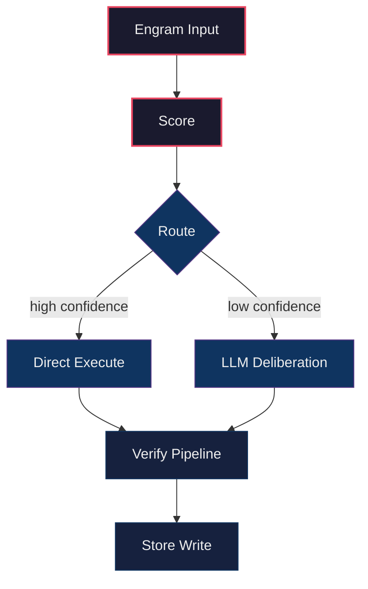
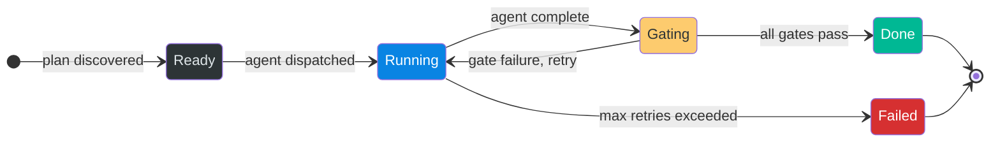
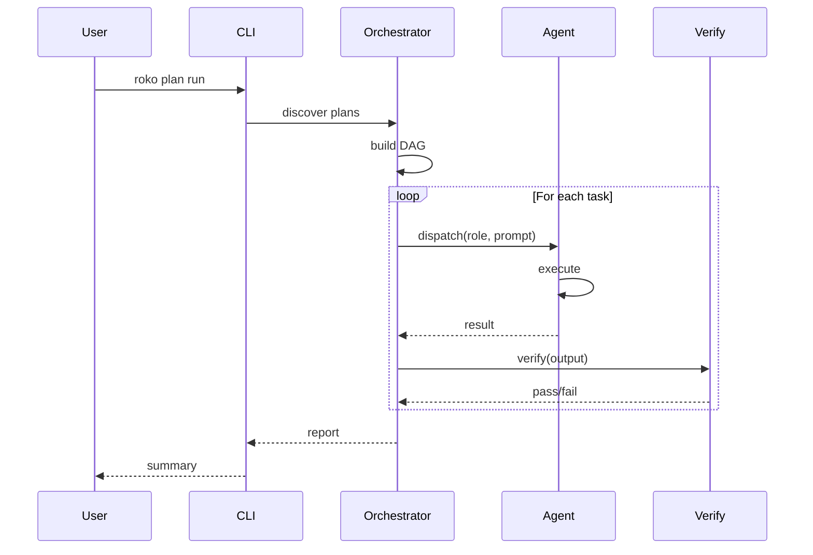

# Batch R4_Z01 — Audit PRD generation data flow

Run: run-20260429-030528 | Attempt: 2 | Model: gpt-5.4-mini

---

# Mega-Parity Rules

## Universal Anti-Patterns

(From FULL-WORK-PLAN.md Anti-Pattern Checklist:)
- A second provider resolution chain.
- A second prompt assembly path for the same mode.
- A second chat/session state owner.
- Raw provider HTTP in CLI code when an adapter exists.
- Terminal transcript scraping as final workflow state.
- Demo data shown as live data.
- Mutation fallback.
- Unknown usage recorded as zero.
- Stub gate counted as pass.
- Process success treated as artifact success.
- A new top-level crate for behavior that already exists in a current crate.
- A broad `orchestrate.rs` refactor mixed with behavior changes.

## Execution-Contract Anti-Patterns (Runner 2)

EC-1. **One model selection path.** There is exactly ONE function that resolves effective model+provider. Every command calls it. If you are tempted to resolve model/provider locally in a command handler, STOP. Call the shared resolver instead.

EXISTING ANTI-PATTERN (do not repeat):
- `crates/roko-cli/src/commands/prd.rs` reads `cli.model` but `PrdCmd::Plan` calls `generate_plan_from_prd()` which ignores it and reads `resolved.config.agent.model`.
- `crates/roko-cli/src/commands/plan.rs` `PlanCmd::Regenerate` reads `model_from_config()` instead of `cli.model`.
- `crates/roko-cli/src/commands/config_cmd.rs` `cmd_provider_test` calls `select_provider_test_model()` and ignores `--model`.

EC-2. **CLI --model is a hard override.** If user passes --model X and provider for X is unavailable, the command FAILS with a clear error naming the missing provider/key. It does NOT silently fall back to another model.

EXISTING ANTI-PATTERN (do not repeat):
- `roko --model gpt-4o "say ok"` silently uses glm-5.1 instead.
- `roko run --model claude-haiku-4-5 "prompt"` uses anthropic_api sonnet instead.

EC-3. **Gate verdicts are typed.** Pass means the gate ran and succeeded. Fail means it ran and failed. Skipped/NotWired means it did not run. These are distinct in the type system.

EXISTING ANTI-PATTERN (do not repeat):
- Stub gates return `GateVerdict { passed: true }` with a string saying "stub gate; not wired."
- Shell gate falls through to `_ => None` in `gate_for_name()` which creates a fail verdict even though it's a config/wiring issue, not a code issue.

EC-4. **Workflow halt = nonzero exit.** If `roko run` prints "workflow halted", the process MUST exit nonzero. Scripts and CI depend on exit codes.

EXISTING ANTI-PATTERN (do not repeat):
- `roko run` halted on missing ANTHROPIC_API_KEY but exited 0.
- `roko explain "cascade routing"` printed "unknown topic" and exited 0.

EC-5. **Config schema v2 is the only output for new workspaces.** `roko init` writes v2. There is no "upgrade later" path for new workspaces. Only existing workspaces need migrate.

EC-6. **State views agree.** There is ONE canonical state source. `status`, `plan list`, `resume`, and `plan run` all read the same file or projection.

EXISTING ANTI-PATTERN (do not repeat):
- `status` reads executor.json, `plan list` reads plan directories, `run-state.json` has different counts. Three views disagree.

EC-7. **Learn paths match write paths.** `learn all` reads from the exact paths that execution writes to. If you change where events are written, update readers.

EXISTING ANTI-PATTERN (do not repeat):
- `.roko/learn/efficiency.jsonl` has 22 entries, `roko learn all` says "empty."

## Agent-Session Anti-Patterns (Runner 3)

CP-1. **One session struct.** `ChatAgentSession` is the sole owner of chat/one-shot session state. No other struct should hold model, effort, system prompt, tools, MCP config, or session_id for the interactive path.

EXISTING ANTI-PATTERN (do not repeat):
- `crates/roko-cli/src/chat_inline.rs:740-764` keeps `conversation`, `system_message`, and model/provider fields. None are sent through dispatch.
- `crates/roko-cli/src/dispatch_direct.rs:140-143` builds a bare `claude` command with only `--print --output-format stream-json`. No model, effort, system prompt, tools, MCP, or resume.

CP-2. **Delegate to existing adapters.** Claude CLI turns delegate to `ClaudeCliAgent` (or its command builder). API turns delegate to existing provider adapters or `ModelCallService`. Do NOT hand-roll provider HTTP loops in the CLI layer.

EXISTING ANTI-PATTERN (do not repeat):
- `crates/roko-cli/src/dispatch_direct.rs:34-90` builds raw Anthropic API requests with hand-rolled JSON, system prompt is not included.
- `crates/roko-cli/src/dispatch_direct.rs:93-137` builds raw OpenAI-compat requests with hand-rolled JSON.

CP-3. **One-shot uses the same session path.** `roko "prompt"` must go through `ChatAgentSession` in single-turn mode.

EXISTING ANTI-PATTERN (do not repeat):
- The positional prompt path in `unified.rs` / `dispatch_direct.rs` has completely separate provider resolution, no tools, no MCP, and no workspace context.

CP-4. **Session id is captured and reused.** After a Claude CLI turn, extract `session_id` from the result. Pass it as `--resume` on the next turn.

EXISTING ANTI-PATTERN (do not repeat):
- `dispatch_direct.rs:205-207` extracts `session_id` from the stream. `chat_inline.rs` never stores or reuses it on subsequent turns.

## Plan-Grounding Anti-Patterns (Runner 4)

PG-1. **Prompt-only grounding is not grounding.** Telling the model "search the codebase" is NOT a grounding mechanism. The grounding mechanism is VALIDATED OUTPUT.

EXISTING ANTI-PATTERN (do not repeat):
- `crates/roko-cli/src/plan_generate.rs` says the plan generator must "search and read files." But no gate checks whether the output cites real files.
- Three consecutive demo runs generated `roko-prompt` and `roko-orchestrate` crates that already exist under different names.

PG-2. **Process success != artifact success.** A subprocess exiting 0 and writing a file does NOT mean the artifact is valid.

EXISTING ANTI-PATTERN (do not repeat):
- `crates/roko-cli/src/prd.rs` emits `prd:plan:generated` signal because tasks.toml parsed. It does not check whether the plan is grounded.
- Episodes are marked successful when the agent process exits cleanly, even if the plan proposes greenfield crates in an existing workspace.

PG-3. **No positive learning from failed artifacts.**

EXISTING ANTI-PATTERN (do not repeat):
- `knowledge-seeds.jsonl` records "successful strategy" insights from demo runs that produced invalid plans.
- The cascade router gets positive observations from runs where the artifact was wrong.

PG-4. **Context pack is bounded.** Max ~8000 tokens.

PG-5. **Context-root mismatch is an error.**

EXISTING ANTI-PATTERN (do not repeat):
- Demo ran `prd plan system-prompt-wiring` in `/tmp/roko-demo-*` which had no Rust source tree. The plan confidently described "no Rust crates or source files exist yet" and proceeded.

## Telemetry-Learning Anti-Patterns (Runner 5)

TL-1. **Unknown != zero.** If token count or cost is unavailable, store `None`/`null`. NEVER store `0` for unknown usage.

EXISTING ANTI-PATTERN (do not repeat):
- `crates/roko-agent/src/claude_cli_agent.rs` returns `AgentResult` with usage containing only `wall_ms`. Token/cost fields default to 0.
- `.roko/learn/efficiency.jsonl` has 22 entries all showing `total_prompt_tokens: 0, total_completion_tokens: 0, cost_usd: 0.0` despite real Claude usage.
- Dashboards show `$0.00` for runs that cost real money.

TL-2. **One cost event per attempt.** An agent attempt produces exactly ONE cost/usage observation.

EXISTING ANTI-PATTERN (do not repeat):
- `costs.jsonl` logs the same attempt cost once as "success" and again as "gate_failure" when the gate fails afterward.

TL-3. **Model is known before logging.** Never log `model: "unknown-model"` as a string.

TL-4. **Skipped gates are not passes.**

TL-5. **Learning reads what execution writes.**

EXISTING ANTI-PATTERN (do not repeat):
- Execution writes to `.roko/learn/efficiency.jsonl`. `roko learn all` reads from a different expected path and says "empty."

## Security-Posture Anti-Patterns (Runner 6)

SP-1. **Default is safe.**

EXISTING ANTI-PATTERN (do not repeat):
- `crates/roko-core/src/config/serve.rs:54-57` sets `auth_enabled: false` by default.
- `crates/roko-serve/src/routes/mod.rs:140` merges terminal routes outside any auth path.
- `crates/roko-cli/src/unified.rs:45-64` starts background serve by default for no-args `roko`.

SP-2. **Terminal = shell access = auth required.**

SP-3. **Wildcards are forbidden for public bind.**

SP-4. **Explicit over implicit.**

## Mori-Polish Anti-Patterns (Runner 7)

MP-1. **Polish does not bypass contracts.**

MP-2. **Demo data is labeled demo data.**

MP-3. **API provider chat is not rushed.**

MP-4. **Do not improve appearance without improving truth.**

## ACP Integration Anti-Patterns (Groups 3F, 5F, 7F)

ACP-1. **One dispatch path.** Pipeline phases go through roko-agent Dispatcher, never raw `Command::new("claude")`. Remove the subprocess calls in runner.rs.

EXISTING ANTI-PATTERN (do not repeat):
- `crates/roko-acp/src/runner.rs` spawns `Command::new("claude")` directly with hand-built args, bypassing all model routing, safety, and logging.

ACP-2. **One prompt assembly.** Use SystemPromptBuilder from roko-compose. Remove static `CODE_MODE_SYSTEM_PROMPT` / `PLAN_MODE_SYSTEM_PROMPT` / `RESEARCH_MODE_SYSTEM_PROMPT` strings.

EXISTING ANTI-PATTERN (do not repeat):
- `crates/roko-acp/src/session.rs:107-135` defines three static system prompt strings instead of using the 9-layer builder.

ACP-3. **No silent learning gaps.** Every ACP dispatch MUST emit an episode turn and a cascade router observation. If a dispatch completes without logging, it's a bug.

EXISTING ANTI-PATTERN (do not repeat):
- ACP sessions run entire workflows without writing to `.roko/episodes.jsonl` or updating cascade router state.

ACP-4. **No dead metrics.** `WorkflowRun.total_cost_usd` and `total_tokens` must reflect actual provider usage. Zero is not valid after a successful dispatch.

EXISTING ANTI-PATTERN (do not repeat):
- ACP `UsageUpdate` is defined in types.rs but never emitted. Cost fields always read 0.

ACP-5. **Session state is shared-nothing.** AcpSession owns its own history and config, does not read global state except via the shared services (FeedbackService, PromptAssemblyService, SafetyLayer).

## Performance Contracts

See `04-PERF-CONTRACTS.md` for 7 performance rules all batches must respect.
Key rules: no HTTP client per request (P-1), no redundant config reads (P-2),
model must flow to EffectDriver (P-5).

---

# Architecture Target

## Core Architecture Owner Table

| Concern | Owner | Forbidden duplicate |
|---|---|---|
| Effective model/provider selection | one `EffectiveModelSelection` module | path-specific fallback chains |
| Claude CLI execution | `ClaudeCliAgent` or shared command builder | raw `claude` subprocess code in chat/one-shot |
| API provider tool loops | existing provider adapters / ModelCallService | handwritten JSON loops in CLI dispatch |
| Interactive session state | `ChatAgentSession` | scattered fields in `chat_inline.rs` plus `dispatch_direct.rs` |
| Prompt assembly | existing compose/prompt services | new prompt builder for chat only |
| Tool policy | existing safety/tool contracts | per-command hardcoded tool strings |
| Gate execution | gate service plus typed gate config | string-only gates losing program/args |
| PRD/plan grounding | repo context pack and artifact validators | prompt-only "please inspect repo" instructions |
| Telemetry truth | normalized usage/attempt events | zero as "unknown" |
| Demo workflow truth | typed workflow/API events | terminal regex scraping as product state |

## Key Struct Definitions

### EffectiveModelSelection (Runner 2)

```rust
pub struct EffectiveModelSelection {
    pub requested_model: Option<String>,
    pub effective_model_key: String,
    pub provider_key: String,
    pub provider_kind: String,     // "claude_cli", "anthropic_api", "openai_compat", "ollama"
    pub backend_slug: String,      // actual slug sent to provider
    pub source: SelectionSource,
    pub reason: String,
}

pub enum SelectionSource {
    CliOverride,
    TaskModel,
    RoleConfig,
    CascadeRouter,
    ProjectDefault,
    BuiltInDefault,
}
```

### ChatAgentSession (Runner 3)

```rust
pub struct ChatAgentSession {
    pub workdir: PathBuf,
    pub model_selection: EffectiveModelSelection,
    pub effort: String,
    pub system_prompt: String,
    pub allowed_tools_csv: String,
    pub mcp_config: Option<PathBuf>,
    pub session_id: Option<String>,
    pub api_history: Vec<ChatMessage>,
    pub http_client: reqwest::Client,
    pub settings_json: Option<PathBuf>,
    pub timeout: Option<Duration>,
}
```

### RepoContextPack + ArtifactValidationReport (Runner 4)

```rust
pub struct RepoContextPack {
    pub root: PathBuf,
    pub project_kind: ProjectKind,
    pub workspace_members: Vec<String>,
    pub key_files: Vec<PathBuf>,
    pub matching_symbols: Vec<SymbolHit>,
    pub related_prds: Vec<PathBuf>,
    pub related_plans: Vec<PathBuf>,
    pub do_not_create: Vec<String>,
    pub context_root_verified: bool,
}

pub struct ArtifactValidationReport {
    pub process_success: bool,
    pub schema_valid: bool,
    pub grounded: bool,
    pub executable: bool,
    pub errors: Vec<String>,
    pub warnings: Vec<String>,
}
```

### UsageObservation (Runner 5)

```rust
pub struct UsageObservation {
    pub input_tokens: Option<u64>,
    pub output_tokens: Option<u64>,
    pub cache_creation_tokens: Option<u64>,
    pub cache_read_tokens: Option<u64>,
    pub cost_usd: Option<f64>,
    pub source: UsageSource,
    pub model: Option<String>,
    pub wall_ms: u64,
}

pub enum UsageSource {
    ProviderReported,
    Estimated,
    Unknown,
}
```

---

# Crate Map

## Key Crates

| Crate | Path | What | Status |
|---|---|---|---|
| roko-core | `crates/roko-core/` | Signal + 6 traits, types, config, tools, errors | Kernel, stable |
| roko-agent | `crates/roko-agent/` | LLM backends, pools, MCP, tool loop, safety | Dispatch wired |
| roko-agent-server | `crates/roko-agent-server/` | Per-agent HTTP sidecar | Wired |
| roko-serve | `crates/roko-serve/` | HTTP control plane: ~85 REST routes + SSE + WS on :6677 | Wired |
| roko-orchestrator | `crates/roko-orchestrator/` | Plan DAG, parallel executor, merge queue, safety | Wired |
| roko-gate | `crates/roko-gate/` | 11 gates, 7-rung pipeline, adaptive thresholds | Wired |
| roko-compose | `crates/roko-compose/` | Prompt assembly, 9 templates, enrichment | Wired |
| roko-conductor | `crates/roko-conductor/` | 10 watchers, circuit breaker, diagnosis | Used by executor |
| roko-learn | `crates/roko-learn/` | Episodes, playbooks, bandits, model routing, experiments | Fully wired |
| roko-cli | `crates/roko-cli/` | CLI binary: all subcommands, ratatui TUI | Main entry point |
| roko-fs | `crates/roko-fs/` | FileSubstrate (JSONL), GC, layout | Stable |
| roko-runtime | `crates/roko-runtime/` | ProcessSupervisor, event bus, cancellation | Wired |
| roko-primitives | `crates/roko-primitives/` | HDC vectors, tier routing | Fully wired |
| roko-neuro | `crates/roko-neuro/` | Durable knowledge store, distillation | Wired |

## Key File Paths

| File | Owner | Role |
|---|---|---|
| `crates/roko-cli/src/orchestrate.rs` | Plan runner | Main orchestration loop |
| `crates/roko-cli/src/run.rs` | Workflow run | `roko run` entry |
| `crates/roko-cli/src/unified.rs` | Entry routing | Routes no-args, positional, serve |
| `crates/roko-cli/src/main.rs` | CLI entry | Arg parsing, command dispatch |
| `crates/roko-cli/src/chat_inline.rs` | Chat REPL | Current interactive chat |
| `crates/roko-cli/src/dispatch_direct.rs` | Direct dispatch | Legacy provider dispatch |
| `crates/roko-cli/src/prd.rs` | PRD logic | Draft, plan generation |
| `crates/roko-cli/src/plan_generate.rs` | Plan gen | Plan generation prompts |
| `crates/roko-cli/src/explain.rs` | Explain | Topic explanations |
| `crates/roko-cli/src/share.rs` | Share | Share URL generation |
| `crates/roko-cli/src/commands/util.rs` | Init / Status / Misc | Workspace initialization, status reporting, utilities |
| `crates/roko-cli/src/commands/config_cmd.rs` | Config | Config management |
| `crates/roko-cli/src/commands/prd.rs` | PRD cmds | PRD subcommands |
| `crates/roko-cli/src/commands/plan.rs` | Plan cmds | Plan subcommands |
| `crates/roko-cli/src/commands/learn.rs` | Learn | Learning inspection |
| `crates/roko-core/src/foundation.rs` | Core types | GateConfig, GateVerdict |
| `crates/roko-core/src/config/mod.rs` | Config | Config struct (directory module: `config/` contains `mod.rs`, `schema.rs`, `serve.rs`, etc.) |
| `crates/roko-gate/src/gate_service.rs` | Gate exec | Gate dispatch |
| `crates/roko-learn/src/cascade_router.rs` | Router | Model routing |
| `crates/roko-learn/src/runtime_feedback.rs` | Feedback | Learning updates |
| `crates/roko-agent/src/claude_cli_agent.rs` | CLI agent | Claude CLI integration |
| `crates/roko-agent/src/provider/anthropic_api.rs` | API adapter | Anthropic adapter |
| `crates/roko-agent/src/provider/openai_compat.rs` | API adapter | OpenAI-compat adapter |
| `crates/roko-serve/src/lib.rs` | Server | Server startup |
| `crates/roko-serve/src/routes/mod.rs` | Routes | Route registration |
| `crates/roko-serve/src/routes/middleware.rs` | Middleware | CORS config |
| `crates/roko-serve/src/terminal.rs` | Terminal | PTY sessions |
| `crates/roko-serve/src/routes/shared_runs.rs` | Shared runs | Share access |
| `crates/roko-core/src/config/serve.rs` | Serve config | Server config |
| `crates/roko-compose/src/system_prompt_builder.rs` | Prompt | System prompt assembly |
| `crates/roko-agent/src/safety/` | Safety | Tool policy, contracts |

## Shared File Hotspots

These files are fracture hotspots. Only one batch at a time may edit them:

| Hotspot | Allowed reason to edit | Forbidden reason to edit |
|---|---|---|
| `roko-cli/src/orchestrate.rs` | route to a new contract, fix one status semantic, add proof hook | broad cleanup, opportunistic refactor |
| `roko-cli/src/dispatch_direct.rs` | deprecate or route away from it | adding system prompt, MCP, tools, provider loops |
| chat inline/TUI files | render session state, pass user commands | own model/provider/session state directly |
| provider config/model routing | central selector and tests | per-command fallback patches |
| gate service/config files | typed gate contract and verdicts | string-only "shell" special case |
| demo hooks/pages | truthful state rendering | inline hardcoded live-looking fallback values |
| server route modules | explicit /api/* JSON contracts | relying on SPA catch-all for API paths |
| telemetry/learning files | normalized observations and outcome linkage | storing unknowns as zero |

---

# Review Vetoes

A batch should be rejected if any of these are true:

- It says "fallback" but does not distinguish fallback-to-demo from fallback-to-error.
- It marks a workflow successful because a child process exited zero while the artifact is invalid.
- It adds a model alias mapping locally instead of using the central selection contract.
- It adds a prompt string outside the prompt assembly owner.
- It adds another session/history struct.
- It treats missing usage as `$0.00`.
- It makes a UI page prettier without fixing truthfulness.
- It adds a broad abstraction whose first use is only the batch's own code.
- It changes generated sample/demo data to hide a live failure.
- It claims parity without an end-to-end proof command.

## Batch Size Rules

A batch is too broad if it does any of these:

- touches more than one architectural concern;
- changes a public contract and a UI consumer in the same patch;
- introduces a new type and wires every caller in the same patch without tests;
- changes provider/model selection in more than one command before the selector has unit tests;
- changes telemetry schema and dashboard rendering in the same patch;
- changes `orchestrate.rs` broadly while also changing behavior;
- fixes a demo symptom without proving the API or CLI state underneath.

When a batch is too broad, split it into:

1. contract or type definition;
2. one caller or producer;
3. one consumer;
4. regression test or proof.

## Required Proof Shape

Every runner proof should include at least one negative proof. Examples:

- invalid config fails with a specific message;
- unknown model fails or normalizes with a specific source;
- shell gate `false` fails;
- stub/not-wired gate is not counted as pass;
- missing API route returns typed JSON error, not SPA HTML;
- failed bench start does not create a fake run;
- invalid PRD/plan artifact is rejected despite process success;
- missing usage displays as unknown, not zero.

---

# Performance Contracts

All batches in the mega-parity runner must respect these performance constraints.
Target: <2s wall-clock for `roko run` with fast API models (GPT-4.1-nano, Kimi K2.6, Gemini Flash).

---

## P-1: No HTTP client per request

`reqwest::Client::new()` MUST NOT be called per agent or per request. Use the shared
client from `roko_agent::provider::shared_http_client()` (established by R3_G01).

**Why:** Each new client pays full TLS handshake + TCP connect (200-800ms for non-US endpoints).

**Existing anti-pattern:**
- `crates/roko-agent/src/http.rs:124` — `ReqwestPoster::new()` creates `Client::new()`
- Called by every `create_agent_for_model()` invocation

---

## P-2: No redundant config reads

Config files (`roko.toml`, global config) MUST NOT be re-read from disk when already
available in memory. Pass `&Config` or `Arc<Config>` through function parameters.

**Why:** Each TOML parse adds 5-15ms. The V2 engine was reading config 4+ times per run.

**Existing anti-pattern:**
- `crates/roko-cli/src/run.rs:487` — `load_layered(workdir)` inside `build_workflow_effect_services`
- `crates/roko-cli/src/run.rs:1908` — `load_config()` again in `append_episode_log`

---

## P-3: No redundant state file opens

`LearningRuntime`, `CascadeRouter`, `ExperimentStore`, and `GateThresholds` MUST NOT
be opened more than once per process run. Pass the opened instance through.

**Why:** Each open reads 3+ JSON files from `.roko/learn/`. Double-open wastes 100-200ms.

**Existing anti-pattern:**
- `crates/roko-cli/src/run.rs:1839` — opens LearningRuntime
- `crates/roko-cli/src/run.rs:1052` — `append_episode_log()` opens it again

---

## P-4: Pipeline template from config

`WorkflowConfig` MUST respect the `[pipeline.*]` section in `roko.toml`. Do NOT hardcode
template selection. The config fields `strategist`, `reviewers`, `max_iterations` map
directly to `WorkflowConfig` fields.

**Why:** `[pipeline.mechanical]` sets `reviewers = false`, but the V2 engine always ran
a reviewer, doubling model calls for simple tasks.

---

## P-5: Model must flow to EffectDriver

The resolved model key MUST be passed to `EffectDriver` and included in every
`ModelCallRequest`. An empty `model: String::new()` is forbidden.

**Why:** OpenAI-compatible APIs require the `model` field in the request body. An empty
string causes 400 errors ("you must provide a model parameter").

**Existing anti-pattern:**
- `crates/roko-runtime/src/effect_driver.rs:177` — `model: String::new()`

---

## P-6: Prefer batched I/O

When writing multiple signals, events, or log entries in sequence, prefer a single
batched write over individual `put()` calls. Collect first, flush once.

**Why:** 10+ sequential `substrate.put()` calls add 50-100ms of I/O overhead.

---

## P-7: Cache expensive lookups with TTL

File-backed data that doesn't change within a run (efficiency signals, contracts, router
state) SHOULD be cached in memory with a short TTL (10-30 seconds).

**Why:** `efficiency.jsonl` was re-read on every dispatch (~100ms per read, 10x per plan).

---

## Benchmark Reference

With all contracts respected (fast US endpoint, express pipeline, shared client):

| Phase | Target |
|-------|--------|
| Config load | <10ms |
| Model resolution | <5ms |
| Agent construction | <30ms |
| HTTP request (TTFT) | 100-500ms (network-bound) |
| Gate (express) | <200ms (cargo check, cached) |
| Persistence | <20ms (batched) |
| **Total** | **<800ms** (excluding LLM generation) |

---

## Files modified by prior batches in this run

These are the ACTUAL current contents after previous batches ran.
Your changes must be compatible with this code.

### `crates/roko-cli/src/config_cmd.rs` (modified by R2_A06 — omitted, budget exceeded)

### `crates/roko-cli/src/commands/init.rs` (last modified by R2_A05)

```rust
//! `roko init` template rendering.

use anyhow::{Context, Result};
use std::ffi::OsStr;

use roko_cli::config::command_on_path;
use roko_core::config::schema::RokoConfig;

/// Render the default `roko.toml` template used by `roko init`.
///
/// The base document comes from the v2 schema serializer so the generated
/// workspace starts in the provider/model world rather than the legacy
/// v1 `[agent]` command world.
pub(crate) fn render_init_template(cloud: bool) -> Result<String> {
    let profile = detect_init_profile().map(|profile| profile.trim().to_ascii_lowercase());

    let mut config = RokoConfig::default();
    config.agent.default_backend = "claude".to_string();
    config.agent.default_model = "claude-sonnet-4-6".to_string();
    if cloud {
        config.server.bind = "0.0.0.0".to_string();
    }

    let mut rendered = config
        .to_toml_pretty()
        .context("serialize default v2 roko.toml")?;
    if !rendered.ends_with('\n') {
        rendered.push('\n');
    }

    let mut out = String::with_capacity(rendered.len() + 512);
    out.push_str("# REQUIRED_ENV\n");
    out.push_str("# Required environment variables (set in .env or shell):\n");
    out.push_str("# GITHUB_TOKEN       - GitHub personal access token (for MCP GitHub server)\n");
    out.push_str("# GITHUB_WEBHOOK_SECRET - GitHub webhook secret for deploy registration\n");
    out.push_str("# SLACK_BOT_TOKEN    - Slack bot token (for MCP Slack server)\n");
    out.push_str("# SLACK_SIGNING_SECRET - Slack webhook signing secret\n");
    out.push_str("# ANTHROPIC_API_KEY  - Claude API key (for direct API agents, not needed for CLI agents)\n\n");
    out.push_str(&rendered);

    if command_on_path("claude") {
        out.push_str("\n[providers.claude_cli]\n");
        out.push_str("kind = \"claude_cli\"\n");
        out.push_str("command = \"claude\"\n");
    } else {
        out.push_str("\n# Claude CLI was not found on PATH when this workspace was initialized.\n");
        out.push_str("# Install Claude CLI and uncomment the provider block below to use the default setup.\n");
        out.push_str("# [providers.claude_cli]\n");
        out.push_str("# kind = \"claude_cli\"\n");
        out.push_str("# command = \"claude\"\n");
    }

    out.push_str("\n[models.claude-sonnet-4-6]\n");
    out.push_str("provider = \"claude_cli\"\n");
    out.push_str("slug = \"claude-sonnet-4-6\"\n");
    out.push_str("context_window = 200000\n");
    out.push_str("tool_format = \"anthropic_blocks\"\n");
    out.push_str("max_tools = 32\n");

    append_verification_gates(&mut out, profile.as_deref());

    if cloud {
        out.push_str("\n# Auto-register webhooks after deploy\n");
        out.push_str("[[serve.deploy.webhooks]]\n");
        out.push_str("provider = \"github\"\n");
        out.push_str("owner = \"nunchi\"\n");
        out.push_str("repo = \"roko\"\n\n");
        out.push_str("[[serve.deploy.webhooks]]\n");
        out.push_str("provider = \"github\"\n");
        out.push_str("owner = \"nunchi\"\n");
        out.push_str("repo = \"collaboration\"\n");
    }

    Ok(out)
}

fn detect_init_profile() -> Option<String> {
    // `cmd_init` does not currently thread the parsed profile through this helper.
    let mut args = std::env::args_os();
    let _ = args.next();

    while let Some(arg) = args.next() {
        if arg.as_os_str() == OsStr::new("--profile") {
            return args.next().map(|value| value.to_string_lossy().into_owned());
        }

        let arg = arg.to_string_lossy();
        if let Some(profile) = arg.strip_prefix("--profile=") {
            if profile.is_empty() {
                return None;
            }
            return Some(profile.to_owned());
        }
    }

    None
}

fn append_verification_gates(out: &mut String, profile: Option<&str>) {
    out.push_str("\n# -- Verification gates --\n");
    match profile {
        Some("rust") => {
            out.push_str("# Rust projects use cargo for compile, test, and lint checks.\n");
            append_shell_gate(out, "cargo", &["check"], 600_000);
            append_shell_gate(out, "cargo", &["test"], 600_000);
            append_shell_gate(out, "cargo", &["clippy"], 600_000);
        }
        Some("typescript") => {
            out.push_str("# TypeScript projects use npx tsc and npm test.\n");
            append_shell_gate(out, "npx", &["tsc", "--noEmit"], 600_000);
            append_shell_gate(out, "npm", &["test"], 600_000);
        }
        _ => {
            out.push_str(
                "# No default gates were written because no supported project profile was supplied.\n",
            );
            out.push_str("# Supported profiles: rust, typescript.\n");
            out.push_str("# Add [[gate]] entries manually to run your own validation commands.\n");
            out.push_str("# Or rerun `roko init --profile rust` / `roko init --profile typescript`.\n");
        }
    }
}

fn append_shell_gate(out: &mut String, program: &str, args: &[&str], timeout_ms: u64) {
    out.push_str("\n[[gate]]\n");
    out.push_str("kind = \"shell\"\n");
    out.push_str("program = \"");
    out.push_str(program);
    out.push_str("\"\n");
    out.push_str("args = [");
    for (index, arg) in args.iter().enumerate() {
        if index > 0 {
            out.push_str(", ");
        }
        out.push('"');
        out.push_str(arg);
        out.push('"');
    }
    out.push_str("]\n");
    out.push_str("timeout_ms = ");
    out.push_str(&timeout_ms.to_string());
    out.push('\n');
}
```

### `crates/roko-cli/src/config.rs` (modified by R2_A02 — omitted, budget exceeded)

### `crates/roko-cli/src/orchestrate.rs` (modified by R2_C05 — omitted, budget exceeded)

### `crates/roko-cli/src/commands/learn.rs` (modified by R2_E02, 431 lines — signatures only)

```rust
353:fn learn_root(workdir: &std::path::Path) -> std::path::PathBuf {
357:fn learn_gate_thresholds_path(workdir: &std::path::Path) -> std::path::PathBuf {
361:fn learn_router_path(workdir: &std::path::Path) -> std::path::PathBuf {
365:fn learn_efficiency_path(workdir: &std::path::Path) -> std::path::PathBuf {
369:fn learn_episodes_path(workdir: &std::path::Path) -> std::path::PathBuf {
373:fn learn_knowledge_path(workdir: &std::path::Path) -> std::path::PathBuf {
377:fn print_no_data(path: &std::path::Path) {
381:fn parse_rfc3339_utc(timestamp: &str) -> Option<chrono::DateTime<chrono::Utc>> {
387:fn format_range(
399:fn non_empty_or_unknown(value: &str) -> &str {
404:fn efficiency_model_label(event: &roko_learn::efficiency::AgentEfficiencyEvent) -> &str {
413:fn cascade_stage_for_observations(observations: u64) -> &'static str {
424:struct LearnCascadeRouterSnapshot {
```

### `crates/roko-cli/src/run.rs` (modified by R2_B03 — omitted, budget exceeded)

### `crates/roko-cli/src/lib.rs` (last modified by R3_A01)

```rust
//! The `roko` binary's library surface.
//!
//! This crate wires Roko's primitives (Store, Compose, Agent, Verify,
//! React) into a one-shot CLI loop. It does **not** implement a plan runner
//! or DAG executor — it drives a single prompt through the universal loop
#![allow(dead_code, unused_imports, unused_variables)]
//! and writes the resulting signals to disk.
//!
//! See [`run_once`] for the core loop and [`Config`] for the `roko.toml`
//! schema.

#![allow(clippy::module_name_repetitions)]
#![allow(missing_docs)]
#![cfg_attr(
    clippy,
    allow(
        clippy::all,
        clippy::pedantic,
        clippy::nursery,
        clippy::restriction,
        missing_docs
    )
)]

extern crate self as roko_cli;

/// Canonical default port for the shipping `roko-serve` control plane.
pub const DEFAULT_SERVE_PORT: u16 = 6677;
/// Canonical default base URL for CLI and TUI calls into `roko-serve`.
pub const DEFAULT_SERVE_URL: &str = "http://localhost:6677";

// TODO(converge): remove once roko-core re-exports state_hub from its crate root.
// state_hub.rs lives in roko-core but depends on roko_runtime (which depends on roko-core),
// so roko-core can't declare `pub mod state_hub`. We include it here via #[path] since
// roko-cli depends on both crates.
#[path = "../../roko-core/src/state_hub.rs"]
pub mod state_hub;

pub mod agent_config;
pub mod agent_episode;
pub mod agent_exec;
pub mod agent_spawn;
pub mod auth;
pub mod auth_detect;
pub mod bench;
pub mod bench_demo;
pub mod chain_handler;
pub mod chain_registry;
pub mod chat;
pub mod chat_session;
pub mod chat_inline;
pub mod clean;
pub mod config;
pub mod config_cmd;
pub mod config_helpers;
pub mod credentials;
pub mod custody;
pub mod daemon;
pub mod demo_cmd;
pub mod demo_seed;
pub mod deployment;
pub mod dispatch;
#[cfg(feature = "legacy-orchestrate")]
pub mod dispatch_direct;
pub(crate) mod dispatch_helpers;
pub mod dispatch_v2;
pub mod doctor;
pub mod episode;
pub mod event_sources;
pub mod explain;
pub mod model_selection;
pub(crate) mod gate_runner;
mod heartbeat;
pub mod index;
pub mod inject;
#[path = "commands/init.rs"]
pub mod init;
pub mod inline;
pub(crate) mod knowledge_helpers;
#[path = "../../../scripts/layer_check.rs"]
pub mod layer_check;
pub(crate) mod learning_helpers;
pub mod oneshot;
#[cfg(feature = "legacy-orchestrate")]
pub mod orchestrate;
pub mod output_format;
pub mod pipe;
pub mod plan;
pub mod plan_generate;
pub mod prd;
pub mod prd_prompt;
pub mod projection;
pub mod prompt_helpers;
pub mod prompting;
pub mod repl;
pub mod research;
pub mod repo_context;
pub mod run;
pub mod run_inline;
pub mod runner;
pub mod runtime_feedback;
pub mod scaffold;
pub mod secrets;
pub mod share;
pub mod snapshot_migrate;
pub mod snapshot_reconcile;
pub mod status;
pub mod subscriptions;
pub mod surface_inventory;
pub mod task_helpers;
pub mod task_parser;
pub mod tui;
pub mod unified;
pub mod vision_loop;
pub mod worker;
pub mod workspace_paths;

pub mod serve_runtime;

/// Server modules re-exported from the `roko-serve` crate.
pub use roko_serve as serve;

pub use config::{
    AgentConfig, Config, ConfigLayer, ConfigPaths, ConfigSources, DreamsConfig, GateConfig,
    PromptConfig, PromptFile, RepoEntry, RepoRegistry, ResolvedConfig, ServeAuthLayer, ServeLayer,
    Source, ToolsConfig, load_layered,
};
pub use config_cmd::{EditTarget, WizardInputs, run_init_wizard};
pub use daemon::{DaemonConfig, DaemonMode, DaemonState, DaemonStatus};
pub use deployment::SigstoreVerifier;
pub use episode::EpisodePolicy;
pub use inject::{InjectKind, InjectRequest};
pub use layer_check::LayerViolation;
pub use oneshot::{OneshotMode, OneshotResult};
#[cfg(feature = "legacy-orchestrate")]
pub use orchestrate::{OrchestrationReport, PlanRunReport, PlanRunner};
pub use pipe::{PipeInput, PipeMode, stdin_is_tty};
pub use plan::{Plan, PlanSummary, PlanTask};
pub use repl::{ReplCommand, ReplMode, WorkspaceContext};
pub use run::{RunReport, RunUsage, run_once};
pub use secrets::SecretsCmd;
pub use status::SessionStatus;
pub use tui::{
    DashboardData, DashboardScaffold, DashboardSummary, PageId, PageScaffold, Theme, WidgetScaffold,
};
```

### `crates/roko-cli/src/model_selection.rs` (modified by R2_B02, 472 lines — signatures only)

```rust
13:pub enum SelectionSource {
28:impl SelectionSource {
31:    pub const fn label(self) -> &'static str {
43:impl fmt::Display for SelectionSource {
51:pub struct EffectiveModelSelection {
53:    pub requested_model: Option<String>,
55:    pub effective_model_key: String,
57:    pub provider_key: String,
59:    pub provider_kind: String,
61:    pub backend_slug: String,
63:    pub source: SelectionSource,
65:    pub reason: String,
70:pub enum Error {
97:struct ModelCandidate {
103:pub fn resolve_effective_model(
140:fn select_candidate(
208:fn required_model(
225:fn normalized_label(input: Option<String>) -> Option<String> {
233:fn builtin_default_model() -> String {
237:fn select_provider<'a>(
274:fn provider_for_kind<'a>(
293:fn build_reason(
307:mod tests {
```

### `crates/roko-cli/src/chat_session.rs` (modified by R3_A02, 364 lines — signatures only)

```rust
44:pub struct ChatAgentSession {
46:    pub workdir: PathBuf,
48:    pub model_selection: EffectiveModelSelection,
50:    pub effort: String,
52:    pub system_prompt: String,
54:    pub allowed_tools_csv: String,
56:    pub mcp_config: Option<PathBuf>,
58:    pub session_id: Option<String>,
60:    pub api_history: Vec<ChatMessage>,
62:    pub http_client: reqwest::Client,
64:    pub settings_json: Option<PathBuf>,
66:    pub timeout: Option<Duration>,
69:impl ChatAgentSession {
76:    pub fn new(
109:fn build_chat_system_prompt(workdir: &Path, config: &Config) -> String {
149:fn gather_workspace_context(workdir: &Path) -> Result<String> {
166:fn gather_workspace_conventions(workdir: &Path) -> Option<String> {
193:fn collect_workspace_samples(workdir: &Path) -> (Vec<String>, Vec<String>) {
206:fn collect_workspace_samples_from_dir(
264:fn read_text_snippet(path: &Path) -> Option<String> {
272:fn capture_git_branch(workdir: &Path) -> Option<String> {
290:fn language_hints_for(workdir: &Path) -> Vec<String> {
322:fn push_unique_hint(hints: &mut Vec<String>, hint: &str) {
328:fn project_name_for(workdir: &Path) -> String {
337:fn is_workspace_source_file(path: &Path) -> bool {
347:fn is_skipped_dir_name(name: &str) -> bool {
351:fn resolve_allowed_tools_csv_stub(_config: &Config, _workdir: &Path) -> String {
356:fn discover_mcp_config_stub(_config: &Config, _workdir: &Path) -> Option<PathBuf> {
361:fn shared_http_client() -> reqwest::Client {
```

### `crates/roko-gate/tests/gate_truth.rs` (modified by R2_C06 — omitted, budget exceeded)

### `crates/roko-cli/src/explain.rs` (modified by R2_D02 — omitted, budget exceeded)

### `crates/roko-cli/src/commands/util.rs` (modified by R2_A02 — omitted, budget exceeded)

### `crates/roko-gate/src/gate_service.rs` (modified by R2_C04 — omitted, budget exceeded)

### `crates/roko-cli/src/commands/plan.rs` (modified by R2_B04 — omitted, budget exceeded)

### `crates/roko-agent/src/claude_cli_agent.rs` (modified by R2_F01 — omitted, budget exceeded)

### `crates/roko-cli/src/commands/prd.rs` (modified by R2_B04 — omitted, budget exceeded)

### `crates/roko-serve/src/lib.rs` (modified by R2_F02 — omitted, budget exceeded)

### `crates/roko-cli/src/main.rs` (modified by R2_A03 — omitted, budget exceeded)

### `crates/roko-cli/src/commands/mod.rs` (modified by R2_A02 — omitted, budget exceeded)

### `crates/roko-cli/tests/learn_paths_fixture.rs` (modified by R2_E03 — omitted, budget exceeded)

### `crates/roko-core/src/foundation.rs` (modified by R2_C04 — omitted, budget exceeded)

### `crates/roko-learn/src/runtime_feedback.rs` (modified by R2_C05 — omitted, budget exceeded)

### `crates/roko-cli/src/prd.rs` (modified by R2_B04 — omitted, budget exceeded)

### `crates/roko-cli/src/commands/config_cmd.rs` (modified by R2_B06 — omitted, budget exceeded)

---

## Current file contents (live from worktree)

### `crates/roko-cli/src/commands/prd.rs`

```rust
//! prd command handlers.
#![allow(unused_imports)]

use crate::*;

pub(crate) async fn cmd_prd(cli: &Cli, cmd: PrdCmd) -> Result<i32> {
    use roko_cli::agent_config::{command_from_config, load_gateway_env, model_from_config};
    use roko_cli::agent_exec::{AgentExecOpts, run_agent_capture_silent};

    let workdir = resolve_workdir(cli);
    let gw = load_gateway_env(&workdir);
    let model = cli.model.clone().or_else(|| model_from_config(&workdir));
    let model_ref = model.as_deref();
    let effort = cli.effort.map(|effort| effort.to_string());
    let effort_ref = effort.as_deref();
    let resume_session = cli.resume.as_deref();
    let agent_command = command_from_config(&workdir).unwrap_or_else(|| "claude".to_string());

    match cmd {
        PrdCmd::Idea { text } => {
            let joined = text.join(" ");
            roko_cli::prd::cmd_idea(&workdir, &joined)?;
            Ok(0)
        }
        PrdCmd::List => {
            roko_cli::prd::cmd_list(&workdir)?;
            Ok(0)
        }
        PrdCmd::Status => {
            roko_cli::prd::cmd_status(&workdir, None)?;
            Ok(0)
        }
        PrdCmd::Draft { cmd: draft_cmd } => match draft_cmd {
            PrdDraftCmd::New { title } => {
                let title = title.join(" ");
                let slug = roko_cli::prd::slugify(&title);
                let drafts = roko_cli::workspace_paths::drafts_dir(&workdir);
                roko_cli::prd::ensure_dirs(&workdir)?;
                let target = drafts.join(format!("{slug}.md"));
                // If the draft exists and has real content (not just scaffold),
                // point the user to `edit` instead. But if it's only the
                // skeleton left by a failed `new` run, overwrite it.
                if target.exists() {
                    let existing = std::fs::read_to_string(&target).unwrap_or_default();
                    let is_skeleton = existing
                        .lines()
                        .filter(|l| {
                            !l.starts_with("---")
                                && !l.starts_with('#')
                                && !l.starts_with("##")
                                && !l.trim().is_empty()
                        })
                        .count()
                        == 0;
                    if !is_skeleton {
                        eprintln!("Draft already exists with content: {}", target.display());
                        eprintln!("Use: roko prd draft edit {slug}");
                        return Ok(1);
                    }
                    eprintln!("Found empty scaffold from previous run — regenerating.");
                }
                let model_key =
                    resolve_effective_model_key(&workdir, cli.model.clone(), Some("scribe"), "prd draft new")?;
                // Write scaffold first so agent can read and fill it
                let frontmatter = roko_cli::prd::new_draft_frontmatter(&slug, &title);
                let scaffold = format!(
                    "{frontmatter}# {title}\n\n\
                     ## Overview\n\n## Requirements\n\n## Acceptance criteria\n\n\
                     ## Design\n\n## References\n"
                );
                std::fs::write(&target, &scaffold)?;
                println!("📄 Creating PRD: {title}");

                let system = roko_cli::prd::prd_agent_prompt(
                    &workdir,
                    &format!(
                        "Fill in the draft PRD at {path}. \
                         If you have file tools, read the codebase to understand what exists \
                         and write the PRD directly to {path}. \
                         If you do NOT have file tools, output the complete PRD markdown \
                         (with YAML frontmatter) as your response — do not wrap in code fences. \
                         Follow the PRD quality standards in your system prompt exactly.",
                        path = target.display()
                    ),
                );
                let task_prompt = format!(
                    "Generate a complete PRD for: {title}. \
                     If you have file tools available, search the codebase to understand \
                     what exists and write the completed PRD to {path}. \
                     Otherwise, output the complete PRD markdown with YAML frontmatter. \
                     Include specific requirements, machine-verifiable acceptance criteria, \
                     and a design section.",
                    path = target.display()
                );
                // Snapshot file mtime before agent runs so we can detect
                // whether a CLI agent wrote the file directly.
                let mtime_before = std::fs::metadata(&target).and_then(|m| m.modified()).ok();

                let started = Instant::now();
                let (exit_code, output) = run_agent_capture_silent(AgentExecOpts {
                    prompt: &task_prompt,
                    workdir: &workdir,
                    model: Some(model_key.as_str()),
                    effort: effort_ref,
                    system_prompt: Some(&system),
                    resume_session,
                    env_vars: &gw.vars,
                    role: Some("scribe"),
                })
                .await?;

                // Check if the agent already wrote the file (CLI agents with tools).
                let mtime_after = std::fs::metadata(&target).and_then(|m| m.modified()).ok();
                let file_was_modified = match (mtime_before, mtime_after) {
                    (Some(before), Some(after)) => after > before,
                    _ => false,
                };

                if file_was_modified {
                    // Agent wrote the file directly — verify it has content.
                    let content = std::fs::read_to_string(&target).unwrap_or_default();
                    let has_content = roko_cli::prd::has_substantive_markdown_content(&content);
                    if has_content {
                        println!("📄 Draft written to {}", target.display());
                    } else {
                        eprintln!(
                            "Agent modified file but left it empty at {}",
                            target.display()
                        );
                    }
                } else if exit_code == 0 && !output.trim().is_empty() {
                    // Agent returned content as text — write it to the file.
                    let content =
                        roko_cli::prd::materialize_agent_markdown_output(&output, Some(&scaffold))
                            .unwrap_or_else(|| scaffold.clone());
                    std::fs::write(&target, content)?;
                    println!("📄 Draft written to {}", target.display());
                } else if exit_code != 0 {
                    eprintln!(
                        "Agent failed (exit {exit_code}). Scaffold preserved at {}",
                        target.display()
                    );
                } else {
                    eprintln!(
                        "Agent returned empty output. Scaffold preserved at {}",
                        target.display()
                    );
                }
                let _ = crate::commands::util::persist_capture_episode(
                    &workdir,
                    &agent_command,
                    Some(model_key.as_str()),
                    "prd-draft-new",
                    &format!("prd:draft:new:{slug}"),
                    &task_prompt,
                    &output,
                    exit_code == 0,
                    started.elapsed().as_millis() as u64,
                    resume_session,
                )
                .await;
                Ok(exit_code)
            }
            PrdDraftCmd::Edit { slug } => {
                let draft = roko_cli::workspace_paths::draft_prd_path(&workdir, &slug);
                if !draft.exists() {
                    eprintln!("Draft not found: {}", draft.display());
                    return Ok(1);
                }
                println!("📝 Refining draft: {slug}");
                let system = roko_cli::prd::prd_agent_prompt(
                    &workdir,
                    &format!(
                        "Read and improve the draft PRD at {path}. \
                         If you have file tools, update that file directly. \
                         If you do NOT have file tools, output the complete improved PRD markdown \
                         with YAML frontmatter and no code fences. \
                         Follow the PRD quality standards in your system prompt.",
                        path = draft.display()
                    ),
                );
                let task_prompt = format!(
                    "Read {path} and improve it: \
                     (1) Are requirements specific and testable? \
                     (2) Are acceptance criteria machine-verifiable shell commands? \
                     (3) Are there 10+ citations with [AUTHOR-YEAR] format? \
                     (4) Are there 2+ mermaid diagrams with color styling? \
                     Search the codebase to verify claims. \
                     If you have file tools, update the file in place. \
                     Otherwise, output the complete improved PRD markdown with YAML frontmatter.",
                    path = draft.display()
                );
                let mtime_before = std::fs::metadata(&draft).and_then(|m| m.modified()).ok();
                let started = Instant::now();
                let (exit_code, output) = run_agent_capture_silent(AgentExecOpts {
                    prompt: &task_prompt,
                    workdir: &workdir,
                    model: model_ref,
                    effort: effort_ref,
                    system_prompt: Some(&system),
                    resume_session,
                    env_vars: &gw.vars,
                    role: Some("scribe"),
                })
                .await?;
                let mtime_after = std::fs::metadata(&draft).and_then(|m| m.modified()).ok();
                let file_was_modified = match (mtime_before, mtime_after) {
                    (Some(before), Some(after)) => after > before,
                    _ => false,
                };
                if file_was_modified {
                    let content = std::fs::read_to_string(&draft).unwrap_or_default();
                    if roko_cli::prd::has_substantive_markdown_content(&content) {
                        println!("📄 Draft updated at {}", draft.display());
                    } else {
                        eprintln!(
                            "Agent modified file but left it empty at {}",
                            draft.display()
                        );
                    }
                } else if exit_code == 0 {
                    if let Some(content) =
                        roko_cli::prd::materialize_agent_markdown_output(&output, None)
                    {
                        std::fs::write(&draft, content)?;
                        println!("📄 Draft updated at {}", draft.display());
                    } else {
                        eprintln!(
                            "Agent returned empty output. Existing draft preserved at {}",
                            draft.display()
                        );
                    }
                } else if !output.is_empty() {
                    print!("{output}");
                }
                let _ = crate::commands::util::persist_capture_episode(
                    &workdir,
                    &agent_command,
                    model_ref,
                    "prd-draft-edit",
                    &format!("prd:draft:edit:{slug}"),
                    &task_prompt,
                    &output,
                    exit_code == 0,
                    started.elapsed().as_millis() as u64,
                    resume_session,
                )
                .await;
                Ok(exit_code)
            }
            PrdDraftCmd::Promote { slug, auto_execute } => {
                roko_cli::prd::cmd_promote(&workdir, &slug, auto_execute).await?;
                Ok(0)
            }
            PrdDraftCmd::List => {
                let drafts = roko_cli::workspace_paths::drafts_dir(&workdir);
                roko_cli::prd::ensure_dirs(&workdir)?;
                let files = roko_cli::prd::list_md_files(&drafts);
                if files.is_empty() {
                    println!("No drafts. Create one: roko prd draft new \"title\"");
                } else {
                    for f in &files {
                        println!("  {}", f.file_stem().unwrap_or_default().to_string_lossy());
                    }
                }
                Ok(0)
            }
        },
        PrdCmd::Plan { slug, dry_run } => {
            let prd_path = find_prd(&workdir, &slug)?;
            let model_key =
                resolve_effective_model_key(&workdir, cli.model.clone(), Some("strategist"), "prd plan")?;
            let _generated_plans_root =
                roko_cli::prd::generate_plan_from_prd_with_model(
                    &slug,
                    &prd_path,
                    dry_run,
                    Some(model_key.as_str()),
                )
                .await?;
            Ok(0)
        }
        PrdCmd::Consolidate => {
            println!("🔄 Scanning all PRDs for duplicates, gaps, and inconsistencies...");
            let mut all_context = String::new();
            for dir_name in ["published", "drafts"] {
                let dir = roko_cli::workspace_paths::prd_dir(&workdir).join(dir_name);
                for path in roko_cli::prd::list_md_files(&dir) {
                    if let Ok(c) = std::fs::read_to_string(&path) {
                        let truncated: String = c.lines().take(50).collect::<Vec<_>>().join("\n");
                        let _ = write!(all_context, "### {}\n{truncated}\n---\n\n", path.display());
                    }
                }
            }
            let ideas = std::fs::read_to_string(roko_cli::workspace_paths::ideas_path(&workdir))
                .unwrap_or_default();
            let task_prompt = format!(
                "Review ALL existing PRDs and ideas. Report: \
                 (1) DUPLICATES: PRDs covering the same thing (propose merge). \
                 (2) GAPS: Areas with no PRD coverage. \
                 (3) INCONSISTENCIES: Conflicting requirements. \
                 (4) STALE: Requirements already implemented (check the code). \
                 (5) IDEAS TO PROMOTE: Ideas that should become draft PRDs. \
                 After analysis, create new drafts for gaps and update existing PRDs.\n\n\
                 PRDs:\n{all_context}\n\nIdeas:\n{ideas}"
            );
            let system = roko_cli::prd::prd_agent_prompt(&workdir, "Consolidate all PRDs");
            let started = Instant::now();
            let (exit_code, output) = run_agent_capture_silent(AgentExecOpts {
                prompt: &task_prompt,
                workdir: &workdir,
                model: model_ref,
                effort: effort_ref,
                system_prompt: Some(&system),
                resume_session,
                env_vars: &gw.vars,
                role: Some("strategist"),
            })
            .await?;
            if !output.is_empty() {
                print!("{output}");
            }
            let _ = crate::commands::util::persist_capture_episode(
                &workdir,
                &agent_command,
                model_ref,
                "prd-consolidate",
                "prd:draft:consolidate",
                &task_prompt,
                &output,
                exit_code == 0,
                started.elapsed().as_millis() as u64,
                resume_session,
            )
            .await;
            Ok(exit_code)
        }
    }
}

fn resolve_effective_model_key(
    workdir: &Path,
    cli_model: Option<String>,
    role: Option<&str>,
    context: &str,
) -> Result<String> {
    let config = crate::load_roko_config(workdir)?;
    let selection = roko_cli::model_selection::resolve_effective_model(
        cli_model,
        None,
        role,
        None,
        &config,
    )
    .map_err(|err| anyhow::anyhow!("resolve model selection for {context}: {err}"))?;
    eprintln!("[{context}] effective selection: {}", selection.reason);
    Ok(selection.effective_model_key)
}

/// Find a PRD by slug in either published or drafts.
pub(crate) fn find_prd(workdir: &Path, slug: &str) -> Result<PathBuf> {
    if let Some(path) = roko_cli::workspace_paths::find_prd_path(workdir, slug) {
        return Ok(path);
    }
    anyhow::bail!("PRD not found: {slug} (checked published/ and drafts/)");
}

/// Auto-detect the project domain from file patterns in the target directory.
pub(crate) fn detect_project_domain(target: &Path) -> &'static str {
    if target.join("Cargo.toml").exists() {
        "rust"
    } else if target.join("package.json").exists() {
        "typescript"
    } else if target.join("go.mod").exists() {
        "go"
    } else if target.join("requirements.txt").exists()
        || target.join("pyproject.toml").exists()
        || target.join("setup.py").exists()
    {
        "python"
    } else if target.join("Gemfile").exists() {
        "ruby"
    } else if target.join("pom.xml").exists() || target.join("build.gradle").exists() {
        "java"
    } else {
        "general"
    }
}

/// Verify configuration hint based on domain profile.
pub(crate) fn domain_gate_hint(domain: &str) -> &'static str {
    match domain {
        "rust" => "compile (cargo check), test (cargo test), clippy (cargo clippy)",
        "typescript" => "compile (tsc --noEmit), test (npm test), lint (eslint)",
        "go" => "compile (go build), test (go test), lint (golangci-lint)",
        "python" => "test (pytest), lint (ruff), typecheck (mypy)",
        "ruby" => "test (rspec), lint (rubocop)",
        "java" => "compile (mvn compile), test (mvn test)",
        _ => "compile, test, lint (configure in roko.toml)",
    }
}
```

### `crates/roko-cli/src/prd.rs` (1273 lines — truncated)

```rust
//! `roko prd` subcommand — PRD lifecycle management.
//!
//! Manages product requirements documents through their lifecycle:
//! idea → draft → published → plans → implemented.
//!
//! PRDs live in `.roko/prd/` with this layout:
//! ```text
//! .roko/prd/
//! ├── ideas.md              # quick captures
//! ├── drafts/               # work-in-progress PRDs
//! │   └── <slug>.md
//! └── published/            # finalized PRDs
//!     └── <slug>.md
//! ```

mod dry_run_fs;

use std::fmt::Write as _;
use std::future::Future;
use std::path::{Path, PathBuf};

use crate::agent_exec::{AgentExecEpisode, AgentExecOpts, run_agent_logged};
use crate::task_parser::TasksFile;
use crate::workspace_paths::{
    drafts_dir, ideas_path, plans_dir as workspace_plans_dir, prd_dir, published_dir,
};
use anyhow::{Context as _, Result, anyhow};
use roko_core::config::schema::RokoConfig;
use roko_core::{Body, Engram, Kind, Provenance, Store};
use roko_fs::FileSubstrate;
use roko_learn::episode_logger::{Episode, EpisodeLogger};
use roko_runtime::event_bus::{PublishOrigin, RokoEvent, global_event_bus};

fn tier_rank(tier: &str) -> u8 {
    match tier {
        "mechanical" => 0,
        "focused" => 1,
        "integrative" => 2,
        "architectural" => 3,
        _ => 1,
    }
}

fn rank_to_complexity(rank: u8) -> &'static str {
    match rank {
        0 => "mechanical",
        1 => "focused",
        2 => "integrative",
        3 => "architectural",
        _ => "focused",
    }
}

fn generated_plan_stats(paths: &[PathBuf]) -> Result<(usize, String)> {
    if paths.is_empty() {
        return Ok((0, "unknown".to_string()));
    }

    let mut task_count = 0usize;
    let mut max_rank = 0u8;

    for path in paths {
        let tasks_file =
            TasksFile::parse(path).with_context(|| format!("parse {}", path.display()))?;
        task_count = task_count.saturating_add(tasks_file.tasks.len());
        for task in &tasks_file.tasks {
            max_rank = max_rank.max(tier_rank(task.tier.as_str()));
        }
    }

    let estimated_complexity = if task_count == 0 {
        "unknown".to_string()
    } else {
        rank_to_complexity(max_rank).to_string()
    };

    Ok((task_count, estimated_complexity))
}

fn normalize_task_title(title: &str) -> String {
    title
        .chars()
        .map(|ch| if ch.is_ascii_alphanumeric() { ch } else { ' ' })
        .collect::<String>()
        .split_whitespace()
        .collect::<Vec<_>>()
        .join(" ")
        .to_lowercase()
}

fn preserve_completed_task_status(
    old_tasks: Option<&TasksFile>,
    mut regenerated: TasksFile,
    plan_dir: &Path,
) -> TasksFile {
    if let Some(old_tasks) = old_tasks {
        let completed: Vec<&crate::task_parser::TaskDef> = old_tasks
            .tasks
            .iter()
            .filter(|task| task.status.eq_ignore_ascii_case("done"))
            .collect();

        for task in &mut regenerated.tasks {
            let normalized = normalize_task_title(&task.title);
            if completed.iter().any(|old| {
                let old_title = normalize_task_title(&old.title);
                old.id == task.id
                    || old_title == normalized
                    || old_title.contains(&normalized)
                    || normalized.contains(&old_title)
            }) {
                task.status = "done".to_string();
            }
        }

        regenerated.meta.iteration = old_tasks.meta.iteration.saturating_add(1);
        if regenerated.meta.plan.trim().is_empty() {
            regenerated.meta.plan = old_tasks.meta.plan.clone();
        }
    }

    if regenerated.meta.plan.trim().is_empty() {
        regenerated.meta.plan = plan_dir
            .file_name()
            .map(|name| name.to_string_lossy().to_string())
            .unwrap_or_else(|| "unknown-plan".to_string());
    }

    regenerated.meta.total = regenerated.tasks.len() as u32;
    regenerated.meta.done = regenerated
        .tasks
        .iter()
        .filter(|task| task.status.eq_ignore_ascii_case("done"))
        .count() as u32;
    regenerated.meta.status =
        if regenerated.meta.total > 0 && regenerated.meta.done == regenerated.meta.total {
            "complete".to_string()
        } else {
            "ready".to_string()
        };

    regenerated
}

fn find_plan_source_document(plan_dir: &Path) -> Result<PathBuf> {
    for candidate in ["source-prd.md", "prd-extract.md", "plan.md"] {
        let path = plan_dir.join(candidate);
        if path.exists() {
            return Ok(path);
        }
    }

    Err(anyhow!(
        "no source PRD found in {} (looked for source-prd.md, prd-extract.md, and plan.md)",
        plan_dir.display()
    ))
}

fn old_format_plan_dirs(root: &Path) -> Vec<PathBuf> {
    let mut dirs = Vec::new();
    if let Ok(entries) = std::fs::read_dir(root) {
        for entry in entries.flatten() {
            let path = entry.path();
            if !path.is_dir() {
                continue;
            }
            let tasks_path = path.join("tasks.toml");
            if !tasks_path.is_file() {
                continue;
            }
            if matches!(
                TasksFile::validate_modern_fields(&tasks_path),
                Ok(issues) if !issues.is_empty()
            ) {
                dirs.push(path);
            }
        }
    }
    dirs.sort();
    dirs
}

async fn regenerate_old_format_plan(
    workdir: &Path,
    model: Option<&str>,
    effort: Option<&str>,
    env_vars: &[(String, String)],
    plan_dir: &Path,
) -> Result<bool> {
    let tasks_path = plan_dir.join("tasks.toml");
    if !tasks_path.is_file() {
        return Ok(false);
    }

    let modern_issues = TasksFile::validate_modern_fields(&tasks_path)
        .with_context(|| format!("validate modern fields at {}", tasks_path.display()))?;
    if modern_issues.is_empty() {
        return Ok(false);
    }

// ... (873 lines omitted) ...
    if let Some(scaffold) = scaffold
        && !normalized.starts_with("---")
    {
        return Some(format!("{scaffold}\n{normalized}"));
    }

    Some(normalized.to_string())
}

fn strip_markdown_code_fence(output: &str) -> &str {
    let trimmed = output.trim();
    if !trimmed.starts_with("```") {
        return trimmed;
    }

    let Some(first_newline) = trimmed.find('\n') else {
        return trimmed;
    };
    let inner = &trimmed[first_newline + 1..];
    let Some(closing) = inner.rfind("\n```") else {
        return trimmed;
    };
    &inner[..closing]
}

/// Slugify a title.
pub fn slugify(title: &str) -> String {
    title
        .to_lowercase()
        .chars()
        .map(|c| if c.is_alphanumeric() { c } else { '-' })
        .collect::<String>()
        .split('-')
        .filter(|s| !s.is_empty())
        .collect::<Vec<_>>()
        .join("-")
}

#[must_use]
fn usize_to_u32_saturating(value: usize) -> u32 {
    u32::try_from(value).unwrap_or(u32::MAX)
}

fn prd_workdir(prd_path: &Path) -> Result<PathBuf> {
    prd_path
        .ancestors()
        .nth(4)
        .map(Path::to_path_buf)
        .ok_or_else(|| {
            anyhow!(
                "could not derive workdir from PRD path: {}",
                prd_path.display()
            )
        })
}

// ─── Tests ─────────────────────────────────────────────────────────

#[cfg(test)]
mod tests {
    use super::*;

    #[test]
    fn slugify_basic() {
        assert_eq!(slugify("Agent Self-Improvement"), "agent-self-improvement");
        assert_eq!(slugify("  foo  BAR  "), "foo-bar");
        assert_eq!(slugify("hello"), "hello");
    }

    #[test]
    fn parse_frontmatter() {
        let content = "---\nid: prd-test\ntitle: Test PRD\nstatus: draft\nversion: 2\ncoverage: 0.5\nplan_template = \"strict\"\n---\n\n# Test\n";
        let meta = PrdMeta::parse(content).unwrap();
        assert_eq!(meta.id, "prd-test");
        assert_eq!(meta.title, "Test PRD");
        assert_eq!(meta.status, "draft");
        assert_eq!(meta.version, 2);
        assert!((meta.coverage - 0.5).abs() < f64::EPSILON);
        assert_eq!(meta.plan_template.as_deref(), Some("strict"));
    }

    #[test]
    fn parse_no_frontmatter() {
        assert!(PrdMeta::parse("# Just a heading").is_none());
    }

    #[test]
    fn idea_appends() {
        let tmp = tempfile::tempdir().unwrap();
        ensure_dirs(tmp.path()).unwrap();
        cmd_idea(tmp.path(), "test idea 1").unwrap();
        cmd_idea(tmp.path(), "test idea 2").unwrap();
        let content = std::fs::read_to_string(ideas_path(tmp.path())).unwrap();
        assert!(content.contains("test idea 1"));
        assert!(content.contains("test idea 2"));
    }

    #[test]
    fn list_empty() {
        let tmp = tempfile::tempdir().unwrap();
        ensure_dirs(tmp.path()).unwrap();
        // Should not panic
        cmd_list(tmp.path()).unwrap();
    }

    #[tokio::test]
    async fn promote_moves_file() {
        let tmp = tempfile::tempdir().unwrap();
        ensure_dirs(tmp.path()).unwrap();
        let draft = drafts_dir(tmp.path()).join("test.md");
        std::fs::write(
            &draft,
            "---\nstatus: draft\nupdated: 2020-01-01\n---\n# Test\n",
        )
        .unwrap();
        cmd_promote(tmp.path(), "test", false).await.unwrap();
        assert!(!draft.exists());
        let published = published_dir(tmp.path()).join("test.md");
        assert!(published.exists());
        let content = std::fs::read_to_string(&published).unwrap();
        assert!(content.contains("status: published"));
    }

    #[tokio::test]
    async fn promote_follow_on_generation_failure_is_non_fatal() {
        let tmp = tempfile::tempdir().unwrap();
        ensure_dirs(tmp.path()).unwrap();
        std::fs::write(tmp.path().join("roko.toml"), "[prd]\nauto_plan = true\n").unwrap();
        let prd_path = published_dir(tmp.path()).join("test.md");

        let outcome = maybe_generate_plan_after_promote_with(
            tmp.path(),
            "test".to_string(),
            prd_path.clone(),
            false,
            |_slug, _path, _dry_run| async move { Err(anyhow!("synthetic generation failure")) },
        )
        .await
        .unwrap();

        assert!(outcome.is_none());
    }

    #[test]
    fn augment_generator_system_prompt_skips_empty_context() {
        let prompt = augment_generator_system_prompt("base prompt".to_string(), Some("   "));
        assert_eq!(prompt, "base prompt");
    }

    #[test]
    fn augment_generator_system_prompt_includes_failure_context() {
        let prompt = augment_generator_system_prompt(
            "base prompt".to_string(),
            Some("task_id = \"demo\"\nreason = \"gate failure\""),
        );
        assert!(prompt.starts_with("base prompt"));
        assert!(prompt.contains("## Failure context for replanning"));
        assert!(prompt.contains("task_id = \"demo\""));
        assert!(prompt.contains("gate failure"));
        assert!(prompt.contains("Do not reproduce the same task shape."));
    }

    #[test]
    fn new_draft_frontmatter_valid() {
        let fm = new_draft_frontmatter("test-prd", "Test PRD");
        assert!(fm.starts_with("---\n"));
        assert!(fm.contains("id: prd-test-prd"));
        assert!(fm.contains("title: Test PRD"));
        assert!(fm.contains("status: draft"));
    }

    #[test]
    fn has_substantive_markdown_content_ignores_headers_only() {
        let content = "---\nid: demo\n---\n# Title\n\n## Overview\n";
        assert!(!has_substantive_markdown_content(content));
    }

    #[test]
    fn has_substantive_markdown_content_detects_body_text() {
        let content = "---\nid: demo\n---\n# Title\n\nActual requirement text.\n";
        assert!(has_substantive_markdown_content(content));
    }

    #[test]
    fn materialize_agent_markdown_output_strips_fences() {
        let output = "```markdown\n---\nid: demo\n---\n# Demo\n\nBody\n```";
        let rendered = materialize_agent_markdown_output(output, None).expect("rendered");
        assert!(rendered.starts_with("---"));
        assert!(rendered.contains("Body"));
        assert!(!rendered.contains("```"));
    }

    #[test]
    fn materialize_agent_markdown_output_prepends_scaffold_when_frontmatter_missing() {
        let rendered = materialize_agent_markdown_output("Body only", Some("---\nid: demo\n---"))
            .expect("rendered");
        assert!(rendered.starts_with("---\nid: demo\n---"));
        assert!(rendered.contains("Body only"));
    }
}
```

### `crates/roko-cli/src/prd_prompt.rs`

```rust
//! System prompt and quality standards for PRD generation.
//!
//! This module defines the prompt template that produces PRD documents
//! matching the quality bar of the project's `.roko/prd/` directory.

/// The system prompt for PRD generation. Injected via `--append-system-prompt`
/// or as the `system` field in API calls.
pub const PRD_SYSTEM_PROMPT: &str = r#"You are a senior technical writer and product architect producing a Product Requirements Document (PRD) for an open-source Rust project.

## Quality standards

Every PRD you write MUST meet these standards:

### 1. Self-contained for a first-time reader
Write as if the reader has ZERO context about this project. On first mention of every domain-specific term, provide a parenthetical definition. Example:
- "the Grimoire (the agent's persistent knowledge base of episodes, insights, heuristics, and causal links)"
- "the Heartbeat (the 9-step decision cycle that drives every Golem tick)"

Include a "Reader orientation" callout at the top:
> **Reader orientation:** This document specifies [what]. It belongs to the [which layer] of the system. The key concept before diving in: [one-sentence thesis].

### 2. Academic and research citations
Every significant design decision MUST cite at least one academic paper or established reference. Use the format:
- Inline: `[AUTHOR-YEAR]` e.g. `[DAMASIO-1994]`
- Each citation gets a full entry in the References section with:
  - Author(s), title, venue/publisher, year
  - One sentence explaining WHY this citation matters for this document

Aim for 10-30 citations per document. Draw from:
- Computer science (distributed systems, PL theory, formal methods)
- AI/ML research (agent architectures, RLHF, tool use, context engineering)
- Software engineering (architecture patterns, testing strategies)
- Relevant domain research (DeFi, economics, cognitive science)
- Recent arXiv papers (2023-2026) for cutting-edge techniques

### 3. Mermaid diagrams with aesthetic styling
Include 2-5 mermaid diagrams per document. EVERY diagram must:
- Use color theming via `style` or `classDef`
- Have clear, readable labels
- Show data flow, state transitions, or architecture

Example patterns:







### 4. Document structure

Every PRD MUST have these sections:

1. **Title** — `# Feature Name: Subtitle [SPEC]`
2. **Header block** — Version, status, crate, depends-on, prerequisites
3. **Reader orientation** — For someone seeing this for the first time
4. **Document map** — Table of contents with section descriptions
5. **The Argument** — WHY this feature exists (cite research)
6. **Design Principles** — Numbered constraints that govern the design
7. **Architecture** — How it works, with mermaid diagrams
8. **Requirements** — Numbered REQ-XXX items, each testable
9. **Configuration** — Rust structs with doc comments
10. **Acceptance criteria** — Machine-verifiable checkboxes
11. **Cross-references** — Links to related documents
12. **References** — Full academic citations, 10-30 per document

### 5. Writing style

- Dense, precise, technical prose. No filler words.
- Every paragraph has a purpose. Delete "In order to", "It should be noted that", "It is worth mentioning".
- Prefer concrete examples over abstract descriptions.
- Include Rust code blocks for key types and interfaces.
- Tables for comparisons, configurations, and matrices.
- Bold key terms on first use with inline definition.

### 6. Frontmatter

```yaml
---
id: prd-<slug>
title: <Title>
status: draft | published
version: <N>
created: <YYYY-MM-DD>
updated: <YYYY-MM-DD>
depends_on: [<other-prd-ids>]
crates: [<crate-names>]
plans_generated: []
coverage: 0
tags: [<keywords>]
plan_template: <optional-template-name>
---
```

## Reference examples

For the quality bar, study existing PRD documents under the project's `.roko/prd/` directory.
Each PRD should demonstrate:
- 30+ academic citations with PAD vectors and somatic markers
- Defense-in-depth architecture descriptions with capability tokens
- Cognitive architecture details and heartbeat cycle specifications
"#;

/// Short quality checklist that can be appended to any PRD generation prompt.
pub const PRD_QUALITY_CHECKLIST: &str = r"
Before finalizing, verify:
- [ ] Reader orientation callout present at top
- [ ] Document map / table of contents with section descriptions
- [ ] Every domain term defined on first use (parenthetical)
- [ ] 10+ academic citations with [AUTHOR-YEAR] format
- [ ] References section with full bibliographic entries + relevance explanation
- [ ] 2+ mermaid diagrams with color styling (classDef or style)
- [ ] Rust code blocks for key types/interfaces
- [ ] Requirements numbered REQ-XXX and testable
- [ ] Acceptance criteria are machine-verifiable (grep, cargo test)
- [ ] No filler prose — every paragraph has purpose
";
```

### `crates/roko-cli/src/agent_exec.rs`

```rust
//! Agent execution helper for direct CLI flows such as PRD/research/plan generation.
//!
//! Used by `roko prd`, `roko research`, and `roko plan generate` to invoke
//! an agent that can read/write files while preserving provider-aware routing,
//! safety scoping, resume threading, and learning-episode persistence.

use std::path::Path;
use std::time::Instant;

use crate::agent_config::{command_from_config, model_from_config};
use crate::agent_episode::build_capture_episode;
use crate::agent_spawn::{SpawnAgentSpec, spawn_agent_scoped};
use anyhow::{Context as _, Result};
use roko_core::agent::ProviderKind;
use roko_core::agent::resolve_model;
use roko_core::{Body, Context, Engram, Kind};
use roko_learn::runtime_feedback::{CompletedRunInput, LearningRuntime};

/// Options for agent execution.
pub struct AgentExecOpts<'a> {
    /// The prompt to send to the agent.
    pub prompt: &'a str,
    /// Working directory for the agent.
    pub workdir: &'a Path,
    /// Model to use (e.g. "claude-sonnet-4-6"). If None, uses CLI default.
    pub model: Option<&'a str>,
    /// Reasoning effort label to pass to Claude.
    pub effort: Option<&'a str>,
    /// Additional system prompt to append.
    pub system_prompt: Option<&'a str>,
    /// Claude session id to resume, if any.
    pub resume_session: Option<&'a str>,
    /// Extra env vars for the child process (gateway config, etc).
    pub env_vars: &'a [(String, String)],
    /// Logical role used to scope safety policies and model routing.
    ///
    /// When set, the safety layer applies role-specific policies and the
    /// CascadeRouter can make role-aware model selection decisions.
    pub role: Option<&'a str>,
}

/// Episode metadata for agent execution paths that should persist learning data.
pub struct AgentExecEpisode<'a> {
    /// Logical task kind used for episode routing and summaries.
    pub task_kind: &'a str,
    /// Stable task identifier for the episode record.
    pub task_id: &'a str,
}

/// Run the configured direct agent path and return just the exit code.
///
/// Convenience wrapper around [`run_agent_capture`] for callers that
/// don't need the agent's text output.
pub async fn run_agent(opts: AgentExecOpts<'_>) -> Result<i32> {
    run_agent_capture(opts).await.map(|(code, _)| code)
}

/// Run the configured direct agent path, echo the output, and persist an episode.
pub async fn run_agent_logged(
    opts: AgentExecOpts<'_>,
    episode: AgentExecEpisode<'_>,
) -> Result<i32> {
    run_agent_capture_logged(opts, episode)
        .await
        .map(|(code, _)| code)
}

/// Run the configured direct agent path and return `(exit_code, output_text)`.
pub async fn run_agent_capture(opts: AgentExecOpts<'_>) -> Result<(i32, String)> {
    run_agent_capture_impl(opts, true, None).await
}

/// Run the configured direct agent path, echo the output, and persist an episode.
pub async fn run_agent_capture_logged(
    opts: AgentExecOpts<'_>,
    episode: AgentExecEpisode<'_>,
) -> Result<(i32, String)> {
    run_agent_capture_impl(opts, true, Some(episode)).await
}

/// Run the configured direct agent path and return `(exit_code, output_text)`
/// without echoing the agent's rendered output to stdout.
pub async fn run_agent_capture_silent(opts: AgentExecOpts<'_>) -> Result<(i32, String)> {
    run_agent_capture_impl(opts, false, None).await
}

async fn run_agent_capture_impl(
    opts: AgentExecOpts<'_>,
    echo_output: bool,
    episode: Option<AgentExecEpisode<'_>>,
) -> Result<(i32, String)> {
    let started = Instant::now();
    let mut routing_config = roko_core::config::load_config(opts.workdir)
        .with_context(|| format!("load routing config from {}", opts.workdir.display()))?;
    routing_config.apply_process_env();
    let routing_enabled = !routing_config.providers.is_empty() || !routing_config.models.is_empty();

    // Fail fast if the agent command is still the test-only default.
    // `"cat"` just echoes the prompt back, producing garbage output.
    if !routing_enabled {
        let cmd = command_from_config(opts.workdir).unwrap_or_default();
        if cmd == "cat" || cmd.is_empty() {
            anyhow::bail!(
                "agent command is {:?} (the test-only default). \
                 Set `command = \"claude\"` (or another agent CLI) in roko.toml under [agent], \
                 or re-run `roko init` to generate a working config.",
                if cmd.is_empty() { "cat" } else { &cmd }
            );
        }
    }
    let model = opts
        .model
        .map(str::to_string)
        .or_else(|| model_from_config(opts.workdir))
        .unwrap_or_else(|| {
            if routing_enabled {
                routing_config.agent.default_model.clone()
            } else {
                "claude-opus-4-6".to_string()
            }
        });
    let resolved = resolve_model(&routing_config, &model);
    let mut extra_args = Vec::new();
    if resolved.provider_kind == ProviderKind::ClaudeCli
        && let Some(session_id) = opts.resume_session
    {
        extra_args.push("--resume".to_string());
        extra_args.push(session_id.to_string());
    }
    let agent = spawn_agent_scoped(
        &routing_config,
        SpawnAgentSpec {
            model: model.clone(),
            command: routing_config.agent.command.clone(),
            timeout_ms: Some(600_000), // 10 min for plan generation / research tasks
            system_prompt: opts.system_prompt.map(str::to_string),
            cached_content: None,
            tools: None,
            mcp_config: None,
            working_dir: Some(opts.workdir.to_path_buf()),
            env: opts.env_vars.to_vec(),
            extra_args,
            effort: Some(opts.effort.unwrap_or("medium").to_string()),
            bare_mode: true,
            dangerously_skip_permissions: true,
            name: format!("{}:{model}", resolved.provider_kind.label()),
            role: opts.role.map(str::to_string),
        },
        format!("create agent for model {model}"),
    )?;

    let prompt = Engram::builder(Kind::Prompt)
        .body(Body::text(opts.prompt))
        .build();
    let result = agent.run(&prompt, &Context::now()).await;

    let rendered = result.output.body.as_text().unwrap_or("").to_string();
    if echo_output && !rendered.is_empty() {
        print!("{rendered}");
    }

    let exit_code = i32::from(!result.success);
    if let Some(episode) = episode {
        persist_capture_episode(
            opts.workdir,
            resolved.provider_kind.label(),
            Some(&model),
            episode.task_kind,
            episode.task_id,
            opts.prompt,
            &rendered,
            exit_code == 0,
            u64::try_from(started.elapsed().as_millis()).unwrap_or(u64::MAX),
            opts.resume_session,
        )
        .await?;
    }

    Ok((exit_code, rendered))
}

/// Persist a lightweight learning episode for a direct agent-exec CLI path.
pub async fn persist_capture_episode(
    workdir: &Path,
    agent_command: &str,
    model: Option<&str>,
    task_kind: &str,
    task_id: &str,
    prompt: &str,
    output: &str,
    success: bool,
    wall_time_ms: u64,
    resume_session: Option<&str>,
) -> Result<()> {
    let (episode, provider) = build_capture_episode(
        agent_command,
        model,
        task_kind,
        task_id,
        prompt,
        output,
        success,
        wall_time_ms,
        resume_session,
    );

    let mut runtime = LearningRuntime::open_under(workdir.join(".roko").join("memory"))
        .await
        .map_err(|e| anyhow::anyhow!("open learning runtime: {e}"))?;
    let distillation_workdir = workdir.to_path_buf();
    runtime.set_episode_completion_hook(move |episode| {
        roko_neuro::spawn_episode_distillation(distillation_workdir.clone(), episode, None);
    });

    let mut completed = CompletedRunInput::from_episode(episode);
    completed.provider = Some(provider);
    runtime
        .record_completed_run(completed)
        .await
        .map_err(|e| anyhow::anyhow!("record learning feedback: {e}"))?;
    Ok(())
}

#[cfg(test)]
mod tests {
    use super::*;
    use roko_learn::episode_logger::EpisodeLogger;
    use tempfile::TempDir;

    #[tokio::test]
    async fn persist_capture_episode_records_memory_episode() {
        let tmp = TempDir::new().expect("tempdir");

        persist_capture_episode(
            tmp.path(),
            "claude",
            Some("claude-sonnet-4-6"),
            "prd-plan-generate",
            "prd:plan:demo",
            "prompt body",
            "output body",
            true,
            42,
            Some("sess-1"),
        )
        .await
        .expect("persist capture episode");

        let episodes_path = tmp
            .path()
            .join(".roko")
            .join("memory")
            .join("episodes.jsonl");
        let episodes = EpisodeLogger::read_all_lossy(&episodes_path).await.unwrap();
        assert_eq!(episodes.len(), 1);
        let episode = &episodes[0];
        assert_eq!(episode.agent_id, "claude");
        assert_eq!(episode.task_id, "prd:plan:demo");
        assert_eq!(episode.kind, "agent_turn");
        assert_eq!(episode.model, "claude-sonnet-4-6");
        assert!(episode.success);
        assert_eq!(
            episode.extra.get("task_kind"),
            Some(&serde_json::json!("prd-plan-generate"))
        );
        assert_eq!(
            episode.extra.get("task_category"),
            Some(&serde_json::json!("scaffolding"))
        );
        assert_eq!(
            episode.extra.get("plan_id"),
            Some(&serde_json::json!("demo"))
        );
    }
}
```

### `crates/roko-agent/src/claude_cli_agent.rs` (1232 lines — truncated)

```rust
//! `ClaudeCliAgent` — choose this for the Claude CLI path with Roko's system
//! prompt, tool allowlist, safety settings, and session-aware behavior.
//!
//! This is the runtime-facing adapter for the `claude` executable. It keeps
//! the wire-specific flag construction in one place instead of scattering
//! command-building logic across the CLI entrypoints. Prefer
//! [`ExecAgent`](crate::ExecAgent) only for generic stdin/stdout CLIs where
//! Claude-specific resume and tool-loop wiring are not needed.

use crate::agent::{Agent, AgentResult};
use crate::mcp::find_mcp_config;
use crate::process::{
    GRACE_STDIN_CLOSE_MS, benign_stderr_warn_once, classify_benign_stderr, kill_tree,
    register_spawned_pid, set_process_group, unregister_pid,
};
use crate::usage::Usage;
use async_trait::async_trait;
use roko_core::{Body, Context, Engram, Kind, OperatingFrequency, Provenance};
use serde_json::Value;
use std::path::PathBuf;
use std::process::Stdio;
use std::sync::Arc;
use std::time::Instant;
use tokio::io::{AsyncBufReadExt, AsyncRead, AsyncReadExt, AsyncWriteExt, BufReader};
use tokio::process::Command;
use tokio::time::{Duration, timeout};

/// Build the Claude CLI `--settings` JSON payload with safety hooks.
///
/// The hooks block the destructive commands that should never be launched by
/// a model in this workspace: branch checkout/switch/rename, branch pushes,
/// and common filesystem-destruction shells.
#[must_use]
pub fn build_settings_json() -> String {
    serde_json::json!({
        "hooks": {
            "PreToolUse": [{
                "matcher": "Bash",
                "hooks": [
                    {
                        "type": "command",
                        "if": "Bash(git checkout *)",
                        "command": "echo 'BLOCKED: git checkout forbidden in plan worktrees' >&2 && exit 2"
                    },
                    {
                        "type": "command",
                        "if": "Bash(git switch *)",
                        "command": "echo 'BLOCKED: git switch forbidden in plan worktrees' >&2 && exit 2"
                    },
                    {
                        "type": "command",
                        "if": "Bash(git branch -m *)",
                        "command": "echo 'BLOCKED: branch rename forbidden in plan worktrees' >&2 && exit 2"
                    },
                    {
                        "type": "command",
                        "if": "Bash(git push *)",
                        "command": "echo 'BLOCKED: agents must not push — roko handles merges' >&2 && exit 2"
                    },
                    {
                        "type": "command",
                        "if": "Bash(rm -rf *)",
                        "command": "echo 'BLOCKED: destructive file deletion forbidden' >&2 && exit 2"
                    },
                    {
                        "type": "command",
                        "if": "Bash(rm -fr *)",
                        "command": "echo 'BLOCKED: destructive file deletion forbidden' >&2 && exit 2"
                    },
                    {
                        "type": "command",
                        "if": "Bash(rm -r *)",
                        "command": "echo 'BLOCKED: destructive file deletion forbidden' >&2 && exit 2"
                    }
                ]
            }]
        }
    })
    .to_string()
}

/// Agent wrapper around the `claude` CLI.
#[derive(Debug, Clone)]
pub struct ClaudeCliAgent {
    program: PathBuf,
    current_dir: PathBuf,
    model: String,
    effort: String,
    fallback_model: Option<String>,
    bare_mode: bool,
    system_prompt: Option<String>,
    allowed_tools: Option<String>,
    max_turns: Option<u32>,
    settings_json: String,
    extra_args: Vec<String>,
    env: Vec<(String, String)>,
    mcp_config: Option<PathBuf>,
    resume: Option<String>,
    dangerously_skip_permissions: bool,
    timeout_ms: u64,
    name: String,
}

impl ClaudeCliAgent {
    /// Construct a new Claude CLI agent rooted at `current_dir`.
    #[must_use]
    pub fn new(
        program: impl Into<PathBuf>,
        current_dir: impl Into<PathBuf>,
        model: impl Into<String>,
    ) -> Self {
        let model = model.into();
        Self {
            program: program.into(),
            current_dir: current_dir.into(),
            model: model.clone(),
            effort: "medium".to_string(),
            fallback_model: Some("claude-haiku-4-5".to_string()),
            bare_mode: true,
            system_prompt: None,
            allowed_tools: None,
            max_turns: Some(OperatingFrequency::Theta.turn_limit()),
            settings_json: build_settings_json(),
            extra_args: Vec::new(),
            env: Vec::new(),
            mcp_config: None,
            resume: None,
            dangerously_skip_permissions: true,
            timeout_ms: 120_000,
            name: format!("claude-cli:{model}"),
        }
    }

    /// Override the display name used in traces.
    #[must_use]
    pub fn with_name(mut self, name: impl Into<String>) -> Self {
        self.name = name.into();
        self
    }

    /// Override the per-request timeout in milliseconds.
    #[must_use]
    pub const fn with_timeout_ms(mut self, timeout_ms: u64) -> Self {
        self.timeout_ms = timeout_ms;
        self
    }

    /// Override the reasoning-effort label passed to Claude.
    #[must_use]
    pub fn with_effort(mut self, effort: impl Into<String>) -> Self {
        self.effort = effort.into();
        self
    }

    /// Override the fallback model passed to Claude.
    #[must_use]
    pub fn with_fallback_model(mut self, fallback_model: impl Into<String>) -> Self {
        self.fallback_model = Some(fallback_model.into());
        self
    }

    /// Disable `--bare` if the caller wants the full Claude Code shell.
    #[must_use]
    pub const fn with_bare_mode(mut self, bare_mode: bool) -> Self {
        self.bare_mode = bare_mode;
        self
    }

    /// Attach a system prompt generated by `SystemPromptBuilder`.
    #[must_use]
    pub fn with_system_prompt(mut self, prompt: impl Into<String>) -> Self {
        self.system_prompt = Some(prompt.into());
        self
    }

    /// Attach a Claude tool allowlist, formatted as `Read,Edit,Bash`.
    #[must_use]
    pub fn with_tools(mut self, tools: impl Into<String>) -> Self {
        self.allowed_tools = Some(tools.into());
        self
    }

    /// Attach a Claude `--allowedTools` allowlist.
    #[must_use]
    pub fn with_allowed_tools(mut self, tools: impl Into<String>) -> Self {
        self.allowed_tools = Some(tools.into());
        self
    }

    /// Set the maximum number of turns Claude may take.
    #[must_use]
    pub const fn with_max_turns(mut self, max_turns: u32) -> Self {
        self.max_turns = Some(max_turns);
        self
    }

    /// Override the settings JSON passed via `--settings`.
    #[must_use]
    pub fn with_settings_json(mut self, json: impl Into<String>) -> Self {
        self.settings_json = json.into();
// ... (832 lines omitted) ...
            .with_resume("session-123")
            .with_bare_mode(true);

        let result = agent.run(&prompt("hi there"), &Context::now()).await;
        assert!(result.success);
        assert_eq!(result.output.body.as_text().unwrap().trim(), "hello");

        let args_text = fs::read_to_string(&capture_args).unwrap();
        assert!(args_text.contains("--print"));
        assert!(args_text.contains("--verbose"));
        assert!(args_text.contains("--output-format"));
        assert!(args_text.contains("stream-json"));
        assert!(args_text.contains("--model"));
        assert!(args_text.contains("claude-test-model"));
        assert!(args_text.contains("--effort"));
        assert!(args_text.contains("medium"));
        assert!(args_text.contains("--max-turns"));
        assert!(args_text.contains("20"));
        assert!(args_text.contains("--append-system-prompt"));
        assert!(args_text.contains("system guidance"));
        assert!(args_text.contains("--settings"));
        assert!(args_text.contains("--dangerously-skip-permissions"));
        assert!(args_text.contains("--tools"));
        assert!(args_text.contains("Read,Edit"));
        assert!(args_text.contains("--resume"));
        assert!(args_text.contains("session-123"));

        let prompt_text = fs::read_to_string(&capture_prompt).unwrap();
        assert_eq!(prompt_text, "hi there");
    }

    #[tokio::test]
    async fn can_disable_dangerous_skip_permissions_flag() {
        let tmp = tempdir().unwrap();
        let capture_args = tmp.path().join("args.txt");
        let script = tmp.path().join("claude-fake.sh");
        let script_body = format!(
            r#"#!/bin/sh
set -eu
args_file="{args_file}"
printf '%s\n' "$@" > "$args_file"
cat >/dev/null
printf '%s\n' '{{"type":"content_block_delta","delta":{{"text":"ok"}}}}'
"#,
            args_file = capture_args.display(),
        );
        fs::write(&script, script_body).unwrap();
        #[cfg(unix)]
        {
            let mut perms = fs::metadata(&script).unwrap().permissions();
            perms.set_mode(0o755);
            fs::set_permissions(&script, perms).unwrap();
        }

        let agent = ClaudeCliAgent::new(&script, tmp.path(), "claude-test-model")
            .with_dangerously_skip_permissions(false);
        let result = agent.run(&prompt("x"), &Context::now()).await;
        assert!(
            result.success,
            "{}",
            result.output.body.as_text().unwrap_or("unknown")
        );

        let args_text = fs::read_to_string(&capture_args).unwrap();
        assert!(!args_text.contains("--dangerously-skip-permissions"));
    }

    #[tokio::test]
    async fn optional_resume_none_omits_resume_flag() {
        let tmp = tempdir().unwrap();
        let capture_args = tmp.path().join("args.txt");
        let script = tmp.path().join("claude-fake.sh");
        let script_body = format!(
            r#"#!/bin/sh
set -eu
args_file="{args_file}"
printf '%s\n' "$@" > "$args_file"
cat >/dev/null
printf '%s\n' '{{"type":"content_block_delta","delta":{{"text":"ok"}}}}'
"#,
            args_file = capture_args.display(),
        );
        fs::write(&script, script_body).unwrap();
        #[cfg(unix)]
        {
            let mut perms = fs::metadata(&script).unwrap().permissions();
            perms.set_mode(0o755);
            fs::set_permissions(&script, perms).unwrap();
        }

        let agent = ClaudeCliAgent::new(&script, tmp.path(), "claude-test-model")
            .with_optional_resume(None);
        let result = agent.run(&prompt("x"), &Context::now()).await;
        assert!(
            result.success,
            "{}",
            result.output.body.as_text().unwrap_or("unknown")
        );

        let args_text = fs::read_to_string(&capture_args).unwrap();
        assert!(!args_text.contains("--resume"));
    }

    #[tokio::test]
    async fn result_event_usage_is_threaded_into_agent_result() {
        let tmp = tempdir().unwrap();
        let script = tmp.path().join("claude-fake.sh");
        let script_body = r#"#!/bin/sh
set -eu
cat >/dev/null
printf '%s\n' '{"type":"content_block_delta","delta":{"text":"hello"}}'
printf '%s\n' '{"type":"result","session_id":"sess-1","model":"claude-sonnet-4-6","total_cost_usd":0.25,"usage":{"input_tokens":11,"output_tokens":22,"cache_creation_input_tokens":33,"cache_read_input_tokens":44}}'
"#;
        fs::write(&script, script_body).unwrap();
        #[cfg(unix)]
        {
            let mut perms = fs::metadata(&script).unwrap().permissions();
            perms.set_mode(0o755);
            fs::set_permissions(&script, perms).unwrap();
        }

        let agent = ClaudeCliAgent::new(&script, tmp.path(), "claude-test-model");
        let result = agent.run(&prompt("x"), &Context::now()).await;
        assert!(result.success);
        assert_eq!(result.output.body.as_text().unwrap().trim(), "hello");
        assert_eq!(result.output.tag("model"), Some("claude-sonnet-4-6"));
        assert_eq!(result.usage.input_tokens, 11);
        assert_eq!(result.usage.output_tokens, 22);
        assert_eq!(result.usage.cache_read_tokens, 44);
        assert_eq!(result.usage.cache_create_tokens, 33);
        assert!((result.usage.cost_usd - 0.25).abs() < 0.0001);
    }

    #[tokio::test]
    async fn nonzero_exit_still_carries_result_event_usage() {
        let tmp = tempdir().unwrap();
        let script = tmp.path().join("claude-fake.sh");
        let script_body = r#"#!/bin/sh
set -eu
cat >/dev/null
printf '%s\n' '{"type":"result","session_id":"sess-2","model":"claude-sonnet-4-6","total_cost_usd":0.5,"usage":{"input_tokens":9,"output_tokens":8,"cache_creation_input_tokens":7,"cache_read_input_tokens":6}}'
exit 1
"#;
        fs::write(&script, script_body).unwrap();
        #[cfg(unix)]
        {
            let mut perms = fs::metadata(&script).unwrap().permissions();
            perms.set_mode(0o755);
            fs::set_permissions(&script, perms).unwrap();
        }

        let agent = ClaudeCliAgent::new(&script, tmp.path(), "claude-test-model");
        let result = agent.run(&prompt("x"), &Context::now()).await;
        assert!(!result.success);
        assert_eq!(result.output.tag("model"), Some("claude-sonnet-4-6"));
        assert_eq!(result.usage.input_tokens, 9);
        assert_eq!(result.usage.output_tokens, 8);
        assert_eq!(result.usage.cache_read_tokens, 6);
        assert_eq!(result.usage.cache_create_tokens, 7);
        assert!((result.usage.cost_usd - 0.5).abs() < 0.0001);
    }

    #[tokio::test]
    async fn benign_stderr_is_filtered_from_trace() {
        let tmp = tempdir().unwrap();
        let script = tmp.path().join("claude-fake.sh");
        let script_body = r#"#!/bin/sh
set -eu
cat >/dev/null
echo 'Claude CLI is starting up...' 1>&2
printf '%s\n' '{"type":"content_block_delta","delta":{"text":"ok"}}'
"#;
        fs::write(&script, script_body).unwrap();
        #[cfg(unix)]
        {
            let mut perms = fs::metadata(&script).unwrap().permissions();
            perms.set_mode(0o755);
            fs::set_permissions(&script, perms).unwrap();
        }

        let agent = ClaudeCliAgent::new(&script, tmp.path(), "claude-test-model");
        let result = agent.run(&prompt("x"), &Context::now()).await;
        assert!(
            result.success,
            "{}",
            result.output.body.as_text().unwrap_or("unknown")
        );
        assert!(result.trace.is_empty());
    }

    #[test]
    fn stderr_trace_skips_stream_json_lines() {
        let agent = ClaudeCliAgent::new("claude", ".", "claude-test-model");
        let trace = agent.stderr_trace(
            "unexpected stderr line\n{\"type\":\"content_block_delta\",\"delta\":{\"text\":\"ok\"}}\n",
        );
        assert_eq!(trace.len(), 1);
        assert_eq!(trace[0].body.as_text().unwrap(), "unexpected stderr line");
    }
}
```

---

## Previous attempt failed

## Audit failed (attempt 1)
The codex-5.5 auditor could not verify this batch (exit 1).

### Last 30 lines of audit log:
```
868:enum UsageSource {
873:impl Default for UsageSource {
881:struct StreamUsage {
891:impl StreamUsage {
```

---

## Verification Commands

Run these and fix any failures:
```bash
cargo check --workspace
cargo clippy --workspace --no-deps -- -D warnings
```

## Do NOT

- Rewrite the entire implementation from scratch
- Add features not in the original prompt
- Modify files outside the write scope
- Skip running verification commands

ERROR: {"type":"error","status":400,"error":{"type":"invalid_request_error","message":"The 'codex-5.5' model is not supported when using Codex with a ChatGPT account."}}
ERROR: {"type":"error","status":400,"error":{"type":"invalid_request_error","message":"The 'codex-5.5' model is not supported when using Codex with a ChatGPT account."}}
2026-04-29T04:25:00.317357Z ERROR codex_core::session: failed to record rollout items: thread 019dd77b-a596-7331-9566-a3bda7ba0d7b not found

=== Audit Finished: 2026-04-29T06:25:00+02:00 ===
=== Duration: 3s ===
=== Exit: 1 ===
```

Fix the issues above. Do not repeat the same mistakes.

---

## Task
Audit PRD generation data flow

## Runner Context
You are working in runner `mega-parity`, batch R4_Z01.
This batch is part of Runner 4: plan-grounding — Ground PRD/plan generation in the real repository and reject invalid artifacts.

## Problem
PRD generation currently operates without awareness of the repository it targets. The prompt chain from `prd draft new` through agent execution to signal emission has no injection point for repo context, no validation of generated references, and no separation between "the agent ran successfully" and "the PRD it produced is accurate." Before adding grounding, we need a complete map of the existing data flow.

## Architecture Contract
This is a read-only audit batch. No code changes. The output is a written analysis document that identifies:
1. The complete prompt chain from CLI command to agent output
2. How much (if any) repository context currently reaches the generation prompt
3. Where generated PRDs are accepted or rejected (acceptance gate)
4. What signals are emitted on PRD creation
5. What learning records (episodes, efficiency, cascade router) are written
6. Exact insertion points for `RepoContextPack` injection and `ArtifactValidationReport` checks

## Changes Required
None. This is a context-gathering audit.

Write your findings as a structured analysis to stdout. Focus on each of the six analysis points listed above.

---

## Actual Code Paths (verified from source)

### Entry point: `roko prd draft new <title>`

File: `/Users/will/dev/nunchi/roko/roko/crates/roko-cli/src/commands/prd.rs`

Match arm at line 34:
```rust
PrdCmd::Draft { cmd: draft_cmd } => match draft_cmd {
    PrdDraftCmd::New { title } => {
        let title = title.join(" ");
        let slug = roko_cli::prd::slugify(&title);
        let drafts = roko_cli::workspace_paths::drafts_dir(&workdir);
        roko_cli::prd::ensure_dirs(&workdir)?;
        let target = drafts.join(format!("{slug}.md"));
        // ... scaffold write ...
        let system = roko_cli::prd::prd_agent_prompt(
            &workdir,
            &format!("Fill in the draft PRD at {path}. ..."),
        );
        let task_prompt = format!(
            "Generate a complete PRD for: {title}. ...",
        );
        let (exit_code, output) = run_agent_capture_silent(AgentExecOpts {
            prompt: &task_prompt,
            workdir: &workdir,
            model: model_ref,
            effort: effort_ref,
            system_prompt: Some(&system),
            resume_session,
            env_vars: &gw.vars,
            role: Some("scribe"),
        })
        .await?;
```

(lines 34–160 of `crates/roko-cli/src/commands/prd.rs`)

### Prompt assembly: `prd_agent_prompt()`

File: `/Users/will/dev/nunchi/roko/roko/crates/roko-cli/src/prd.rs`, lines 948–993

```rust
pub fn prd_agent_prompt(workdir: &Path, task: &str) -> String {
    let mut prompt = String::new();
    let _ = writeln!(prompt, "{}", crate::prd_prompt::PRD_SYSTEM_PROMPT);
    let _ = writeln!(prompt, "\n---\n");
    let _ = writeln!(prompt, "## Project workspace: {}\n", workdir.display());
    // Appends master index
    crate::index::append_master_index_prompt(
        &mut prompt,
        workdir,
        "## Master Index (what already exists — do NOT duplicate)",
    );
    // Appends PRD INDEX.md if it exists
    let prd_index = std::fs::read_to_string(prd_dir(workdir).join("INDEX.md")).unwrap_or_default();
    if !prd_index.is_empty() {
        let _ = writeln!(prompt, "## PRD Index\n{prd_index}\n---\n");
    }
    // Appends first 30 lines of each existing PRD
    for dir in [&published_dir(workdir), &drafts_dir(workdir)] {
        for path in list_md_files(dir) {
            if let Ok(content) = std::fs::read_to_string(&path) {
                let truncated: String = content.lines().take(30).collect::<Vec<_>>().join("\n");
                let _ = writeln!(prompt, "### {}\n{truncated}\n---\n", path.display());
            }
        }
    }
    // Appends ideas.md
    let ideas = std::fs::read_to_string(ideas_path(workdir)).unwrap_or_default();
    if !ideas.is_empty() {
        let _ = writeln!(prompt, "## Recent ideas\n{ideas}\n");
    }
    let _ = writeln!(prompt, "## Your task\n{task}");
    let _ = writeln!(prompt, "\n{}", crate::prd_prompt::PRD_QUALITY_CHECKLIST);
    prompt
}
```

**Key finding**: `prd_agent_prompt()` includes:
- PRD quality standards (from `prd_prompt::PRD_SYSTEM_PROMPT`)
- Workspace path (just the path string, no content)
- Master index (if exists at `docs/00-architecture/INDEX.md` or similar)
- PRD INDEX.md (if exists at `.roko/prd/INDEX.md`)
- First 30 lines of each existing PRD
- ideas.md content

**What is NOT included** in the prompt:
- Workspace member names (no crate inventory)
- Key source files related to the feature
- Symbol/function names that already exist
- Related plan directories
- Whether the target crate/feature already exists

### Agent execution: `run_agent_capture_silent()`

File: `/Users/will/dev/nunchi/roko/roko/crates/roko-cli/src/agent_exec.rs`, lines 83–85 and 87–179

```rust
pub async fn run_agent_capture_silent(opts: AgentExecOpts<'_>) -> Result<(i32, String)> {
    run_agent_capture_impl(opts, false, None).await
}
```

The implementation (`run_agent_capture_impl`, lines 87–179):
1. Loads routing config from `opts.workdir`
2. Resolves model from config or default (`claude-opus-4-6`)
3. Calls `spawn_agent_scoped()` with `bare_mode: true, dangerously_skip_permissions: true`
4. Sends prompt via `agent.run(&prompt, &Context::now()).await`
5. Returns `(exit_code, rendered_text)`
6. **No episode is persisted** (episode=None in `run_agent_capture_silent`)

### Learning episode persistence

After `run_agent_capture_silent` returns, the caller (`commands/prd.rs`, line 147) persists an episode:

```rust
let _ = crate::commands::util::persist_capture_episode(
    &workdir,
    &agent_command,
    model_ref,
    "prd-draft-new",
    &format!("prd:draft:new:{slug}"),
    &task_prompt,
    &output,
    exit_code == 0,
    started.elapsed().as_millis() as u64,
    resume_session,
)
.await;
```

Episode is written to: `{workdir}/.roko/memory/episodes.jsonl`

Via: `LearningRuntime::open_under(workdir.join(".roko").join("memory"))` → `record_completed_run()`

### Post-generation acceptance gate

File: `/Users/will/dev/nunchi/roko/roko/crates/roko-cli/src/commands/prd.rs`, lines 117–146

The acceptance gate is:
1. **File modification check**: Did agent modify the file? (`mtime_after > mtime_before`)
2. **Content check**: `has_substantive_markdown_content()` — checks that body has non-heading, non-empty lines after frontmatter
3. **Exit code check**: `exit_code == 0`

**What is NOT checked**:
- Whether crate names referenced in `crates:` frontmatter field actually exist
- Whether dependencies in `depends_on:` frontmatter field refer to real PRDs
- Whether design sections reference real files or functions
- Whether acceptance criteria use valid cargo commands

### Signals emitted

For `prd draft new`: **No signals emitted**. The `emit_prd_plan_signal()` function is only called in `generate_plan_from_prd_with_failure_context()` (lines 894–924):
- `Kind::Custom("prd:plan:generated".into())` — only on plan generation success
- `Kind::Custom("prd:plan:failed".into())` — only on plan generation failure

For `prd draft promote`: The `global_event_bus().emit(RokoEvent::PrdPublished {...})` is called at line 670.

### Entry point: `roko prd plan <slug>`

File: `/Users/will/dev/nunchi/roko/roko/crates/roko-cli/src/commands/prd.rs`, lines 267–271

```rust
PrdCmd::Plan { slug, dry_run } => {
    let prd_path = find_prd(&workdir, &slug)?;
    let _generated_plans_root =
        roko_cli::prd::generate_plan_from_prd(&slug, &prd_path, dry_run).await?;
    Ok(0)
}
```

### Plan generation prompt assembly

File: `/Users/will/dev/nunchi/roko/roko/crates/roko-cli/src/prd.rs`, lines 802–821

```rust
let system = augment_generator_system_prompt(
    crate::plan_generate::build_generator_system_prompt(workdir_ref),
    failure_context,
);
let task_prompt = format!(
    "Read the PRD at {path} and generate implementation plan directories \
     under .roko/plans/. Each REQ-XXX requirement becomes one or more tasks. \
     Each acceptance criterion becomes a task verification command. \
     Search the codebase first to understand what already exists. \
     Create plan.md and tasks.toml files directly, including per-task mcp_servers \
     when a task needs a specific MCP server.\n\n\
     {template_guidance}\n\
     PRD content:\n{content}",
    path = prd_path.display(),
    ...
);
```

`build_generator_system_prompt()` (in `plan_generate.rs`, lines 271–277) adds:
- `PLAN_GENERATOR_SYSTEM_PROMPT` (the task decomposition instructions)
- First 160 lines of `docs/00-architecture/01-naming-and-glossary.md` if it exists
- First 120 lines of `CLAUDE.md` if it exists

**What is NOT included in plan generation**:
- Workspace member names (no crate inventory)
- Whether crates referenced in tasks exist
- Whether file paths in `context.read_files` are real

---

## Insertion Points for Grounding

1. **`prd_agent_prompt()` in `prd.rs` line ~991** — insert `RepoContextPack::to_prompt_section()` here, after the workspace line and before existing PRDs

2. **`PrdDraftCmd::New` in `commands/prd.rs` line ~117** — insert `ArtifactValidationReport` check after `has_substantive_markdown_content()` check

3. **`generate_plan_from_prd_with_failure_context()` in `prd.rs` line ~803** — insert `RepoContextPack::to_prompt_section()` into the system prompt

4. **`generate_plan_from_prd_with_failure_context()` in `prd.rs` line ~847** — after `exit_code != 0` check, run `ArtifactValidationReport` validation on generated `tasks.toml` files

5. **Learning gate in `commands/prd.rs` line ~147** — pass `artifact_valid` flag to `persist_capture_episode()` to suppress positive learning signals for invalid artifacts

---

## Write Scope (files you may modify)
- None (read-only audit)

## Read-Only Context (do not modify these)
- `crates/roko-cli/src/prd.rs`
- `crates/roko-cli/src/prd_prompt.rs`
- `crates/roko-cli/src/agent_exec.rs`
- `crates/roko-cli/src/commands/prd.rs`
- `crates/roko-cli/src/orchestrate.rs`
- `crates/roko-learn/src/runtime_feedback.rs`

## Acceptance Criteria
- [ ] Complete prompt chain mapped from `prd draft new <slug>` to file write
- [ ] Identified exactly what repo context (if any) reaches the generation prompt
- [ ] Identified post-generation acceptance gate (or confirmed none exists)
- [ ] Listed all signals emitted during PRD creation
- [ ] Listed all learning records written during PRD creation
- [ ] Identified 3+ insertion points for context pack and validation

## Verification
```bash
# Verify the files exist and are readable
for f in crates/roko-cli/src/prd.rs crates/roko-cli/src/prd_prompt.rs crates/roko-cli/src/commands/prd.rs crates/roko-cli/src/agent_exec.rs; do
  test -f "$f" && echo "OK: $f" || echo "MISSING: $f"
done
```

## Do NOT
- Modify any source files
- Run the PRD generation command
- Make assumptions about code you haven't read
- Skip any of the six analysis points listed above
