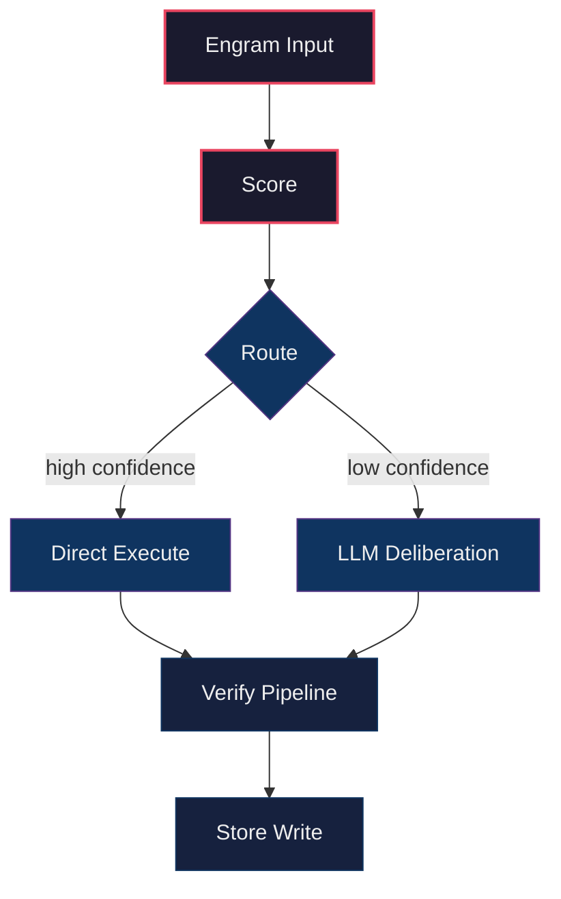
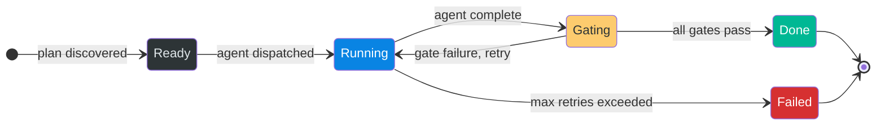
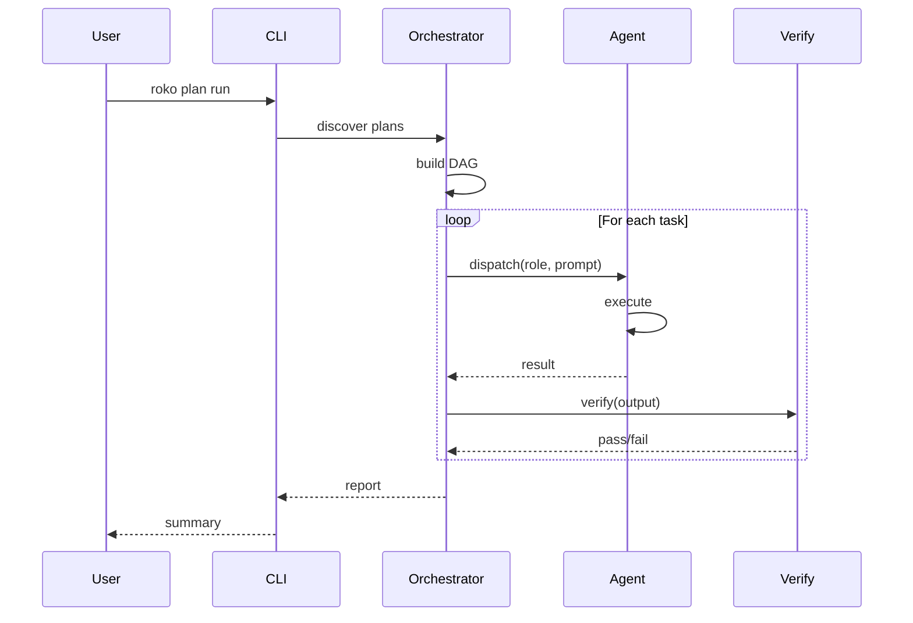

# Batch R5_A04 — Thread usage through episode logger

Run: run-20260429-030528 | Attempt: 1 | Model: gpt-5.4-mini

---

# Mega-Parity Rules

## Universal Anti-Patterns

(From FULL-WORK-PLAN.md Anti-Pattern Checklist:)
- A second provider resolution chain.
- A second prompt assembly path for the same mode.
- A second chat/session state owner.
- Raw provider HTTP in CLI code when an adapter exists.
- Terminal transcript scraping as final workflow state.
- Demo data shown as live data.
- Mutation fallback.
- Unknown usage recorded as zero.
- Stub gate counted as pass.
- Process success treated as artifact success.
- A new top-level crate for behavior that already exists in a current crate.
- A broad `orchestrate.rs` refactor mixed with behavior changes.

## Execution-Contract Anti-Patterns (Runner 2)

EC-1. **One model selection path.** There is exactly ONE function that resolves effective model+provider. Every command calls it. If you are tempted to resolve model/provider locally in a command handler, STOP. Call the shared resolver instead.

EXISTING ANTI-PATTERN (do not repeat):
- `crates/roko-cli/src/commands/prd.rs` reads `cli.model` but `PrdCmd::Plan` calls `generate_plan_from_prd()` which ignores it and reads `resolved.config.agent.model`.
- `crates/roko-cli/src/commands/plan.rs` `PlanCmd::Regenerate` reads `model_from_config()` instead of `cli.model`.
- `crates/roko-cli/src/commands/config_cmd.rs` `cmd_provider_test` calls `select_provider_test_model()` and ignores `--model`.

EC-2. **CLI --model is a hard override.** If user passes --model X and provider for X is unavailable, the command FAILS with a clear error naming the missing provider/key. It does NOT silently fall back to another model.

EXISTING ANTI-PATTERN (do not repeat):
- `roko --model gpt-4o "say ok"` silently uses glm-5.1 instead.
- `roko run --model claude-haiku-4-5 "prompt"` uses anthropic_api sonnet instead.

EC-3. **Gate verdicts are typed.** Pass means the gate ran and succeeded. Fail means it ran and failed. Skipped/NotWired means it did not run. These are distinct in the type system.

EXISTING ANTI-PATTERN (do not repeat):
- Stub gates return `GateVerdict { passed: true }` with a string saying "stub gate; not wired."
- Shell gate falls through to `_ => None` in `gate_for_name()` which creates a fail verdict even though it's a config/wiring issue, not a code issue.

EC-4. **Workflow halt = nonzero exit.** If `roko run` prints "workflow halted", the process MUST exit nonzero. Scripts and CI depend on exit codes.

EXISTING ANTI-PATTERN (do not repeat):
- `roko run` halted on missing ANTHROPIC_API_KEY but exited 0.
- `roko explain "cascade routing"` printed "unknown topic" and exited 0.

EC-5. **Config schema v2 is the only output for new workspaces.** `roko init` writes v2. There is no "upgrade later" path for new workspaces. Only existing workspaces need migrate.

EC-6. **State views agree.** There is ONE canonical state source. `status`, `plan list`, `resume`, and `plan run` all read the same file or projection.

EXISTING ANTI-PATTERN (do not repeat):
- `status` reads executor.json, `plan list` reads plan directories, `run-state.json` has different counts. Three views disagree.

EC-7. **Learn paths match write paths.** `learn all` reads from the exact paths that execution writes to. If you change where events are written, update readers.

EXISTING ANTI-PATTERN (do not repeat):
- `.roko/learn/efficiency.jsonl` has 22 entries, `roko learn all` says "empty."

## Agent-Session Anti-Patterns (Runner 3)

CP-1. **One session struct.** `ChatAgentSession` is the sole owner of chat/one-shot session state. No other struct should hold model, effort, system prompt, tools, MCP config, or session_id for the interactive path.

EXISTING ANTI-PATTERN (do not repeat):
- `crates/roko-cli/src/chat_inline.rs:740-764` keeps `conversation`, `system_message`, and model/provider fields. None are sent through dispatch.
- `crates/roko-cli/src/dispatch_direct.rs:140-143` builds a bare `claude` command with only `--print --output-format stream-json`. No model, effort, system prompt, tools, MCP, or resume.

CP-2. **Delegate to existing adapters.** Claude CLI turns delegate to `ClaudeCliAgent` (or its command builder). API turns delegate to existing provider adapters or `ModelCallService`. Do NOT hand-roll provider HTTP loops in the CLI layer.

EXISTING ANTI-PATTERN (do not repeat):
- `crates/roko-cli/src/dispatch_direct.rs:34-90` builds raw Anthropic API requests with hand-rolled JSON, system prompt is not included.
- `crates/roko-cli/src/dispatch_direct.rs:93-137` builds raw OpenAI-compat requests with hand-rolled JSON.

CP-3. **One-shot uses the same session path.** `roko "prompt"` must go through `ChatAgentSession` in single-turn mode.

EXISTING ANTI-PATTERN (do not repeat):
- The positional prompt path in `unified.rs` / `dispatch_direct.rs` has completely separate provider resolution, no tools, no MCP, and no workspace context.

CP-4. **Session id is captured and reused.** After a Claude CLI turn, extract `session_id` from the result. Pass it as `--resume` on the next turn.

EXISTING ANTI-PATTERN (do not repeat):
- `dispatch_direct.rs:205-207` extracts `session_id` from the stream. `chat_inline.rs` never stores or reuses it on subsequent turns.

## Plan-Grounding Anti-Patterns (Runner 4)

PG-1. **Prompt-only grounding is not grounding.** Telling the model "search the codebase" is NOT a grounding mechanism. The grounding mechanism is VALIDATED OUTPUT.

EXISTING ANTI-PATTERN (do not repeat):
- `crates/roko-cli/src/plan_generate.rs` says the plan generator must "search and read files." But no gate checks whether the output cites real files.
- Three consecutive demo runs generated `roko-prompt` and `roko-orchestrate` crates that already exist under different names.

PG-2. **Process success != artifact success.** A subprocess exiting 0 and writing a file does NOT mean the artifact is valid.

EXISTING ANTI-PATTERN (do not repeat):
- `crates/roko-cli/src/prd.rs` emits `prd:plan:generated` signal because tasks.toml parsed. It does not check whether the plan is grounded.
- Episodes are marked successful when the agent process exits cleanly, even if the plan proposes greenfield crates in an existing workspace.

PG-3. **No positive learning from failed artifacts.**

EXISTING ANTI-PATTERN (do not repeat):
- `knowledge-seeds.jsonl` records "successful strategy" insights from demo runs that produced invalid plans.
- The cascade router gets positive observations from runs where the artifact was wrong.

PG-4. **Context pack is bounded.** Max ~8000 tokens.

PG-5. **Context-root mismatch is an error.**

EXISTING ANTI-PATTERN (do not repeat):
- Demo ran `prd plan system-prompt-wiring` in `/tmp/roko-demo-*` which had no Rust source tree. The plan confidently described "no Rust crates or source files exist yet" and proceeded.

## Telemetry-Learning Anti-Patterns (Runner 5)

TL-1. **Unknown != zero.** If token count or cost is unavailable, store `None`/`null`. NEVER store `0` for unknown usage.

EXISTING ANTI-PATTERN (do not repeat):
- `crates/roko-agent/src/claude_cli_agent.rs` returns `AgentResult` with usage containing only `wall_ms`. Token/cost fields default to 0.
- `.roko/learn/efficiency.jsonl` has 22 entries all showing `total_prompt_tokens: 0, total_completion_tokens: 0, cost_usd: 0.0` despite real Claude usage.
- Dashboards show `$0.00` for runs that cost real money.

TL-2. **One cost event per attempt.** An agent attempt produces exactly ONE cost/usage observation.

EXISTING ANTI-PATTERN (do not repeat):
- `costs.jsonl` logs the same attempt cost once as "success" and again as "gate_failure" when the gate fails afterward.

TL-3. **Model is known before logging.** Never log `model: "unknown-model"` as a string.

TL-4. **Skipped gates are not passes.**

TL-5. **Learning reads what execution writes.**

EXISTING ANTI-PATTERN (do not repeat):
- Execution writes to `.roko/learn/efficiency.jsonl`. `roko learn all` reads from a different expected path and says "empty."

## Security-Posture Anti-Patterns (Runner 6)

SP-1. **Default is safe.**

EXISTING ANTI-PATTERN (do not repeat):
- `crates/roko-core/src/config/serve.rs:54-57` sets `auth_enabled: false` by default.
- `crates/roko-serve/src/routes/mod.rs:140` merges terminal routes outside any auth path.
- `crates/roko-cli/src/unified.rs:45-64` starts background serve by default for no-args `roko`.

SP-2. **Terminal = shell access = auth required.**

SP-3. **Wildcards are forbidden for public bind.**

SP-4. **Explicit over implicit.**

## Mori-Polish Anti-Patterns (Runner 7)

MP-1. **Polish does not bypass contracts.**

MP-2. **Demo data is labeled demo data.**

MP-3. **API provider chat is not rushed.**

MP-4. **Do not improve appearance without improving truth.**

## ACP Integration Anti-Patterns (Groups 3F, 5F, 7F)

ACP-1. **One dispatch path.** Pipeline phases go through roko-agent Dispatcher, never raw `Command::new("claude")`. Remove the subprocess calls in runner.rs.

EXISTING ANTI-PATTERN (do not repeat):
- `crates/roko-acp/src/runner.rs` spawns `Command::new("claude")` directly with hand-built args, bypassing all model routing, safety, and logging.

ACP-2. **One prompt assembly.** Use SystemPromptBuilder from roko-compose. Remove static `CODE_MODE_SYSTEM_PROMPT` / `PLAN_MODE_SYSTEM_PROMPT` / `RESEARCH_MODE_SYSTEM_PROMPT` strings.

EXISTING ANTI-PATTERN (do not repeat):
- `crates/roko-acp/src/session.rs:107-135` defines three static system prompt strings instead of using the 9-layer builder.

ACP-3. **No silent learning gaps.** Every ACP dispatch MUST emit an episode turn and a cascade router observation. If a dispatch completes without logging, it's a bug.

EXISTING ANTI-PATTERN (do not repeat):
- ACP sessions run entire workflows without writing to `.roko/episodes.jsonl` or updating cascade router state.

ACP-4. **No dead metrics.** `WorkflowRun.total_cost_usd` and `total_tokens` must reflect actual provider usage. Zero is not valid after a successful dispatch.

EXISTING ANTI-PATTERN (do not repeat):
- ACP `UsageUpdate` is defined in types.rs but never emitted. Cost fields always read 0.

ACP-5. **Session state is shared-nothing.** AcpSession owns its own history and config, does not read global state except via the shared services (FeedbackService, PromptAssemblyService, SafetyLayer).

## Performance Contracts

See `04-PERF-CONTRACTS.md` for 7 performance rules all batches must respect.
Key rules: no HTTP client per request (P-1), no redundant config reads (P-2),
model must flow to EffectDriver (P-5).

---

# Architecture Target

## Core Architecture Owner Table

| Concern | Owner | Forbidden duplicate |
|---|---|---|
| Effective model/provider selection | one `EffectiveModelSelection` module | path-specific fallback chains |
| Claude CLI execution | `ClaudeCliAgent` or shared command builder | raw `claude` subprocess code in chat/one-shot |
| API provider tool loops | existing provider adapters / ModelCallService | handwritten JSON loops in CLI dispatch |
| Interactive session state | `ChatAgentSession` | scattered fields in `chat_inline.rs` plus `dispatch_direct.rs` |
| Prompt assembly | existing compose/prompt services | new prompt builder for chat only |
| Tool policy | existing safety/tool contracts | per-command hardcoded tool strings |
| Gate execution | gate service plus typed gate config | string-only gates losing program/args |
| PRD/plan grounding | repo context pack and artifact validators | prompt-only "please inspect repo" instructions |
| Telemetry truth | normalized usage/attempt events | zero as "unknown" |
| Demo workflow truth | typed workflow/API events | terminal regex scraping as product state |

## Key Struct Definitions

### EffectiveModelSelection (Runner 2)

```rust
pub struct EffectiveModelSelection {
    pub requested_model: Option<String>,
    pub effective_model_key: String,
    pub provider_key: String,
    pub provider_kind: String,     // "claude_cli", "anthropic_api", "openai_compat", "ollama"
    pub backend_slug: String,      // actual slug sent to provider
    pub source: SelectionSource,
    pub reason: String,
}

pub enum SelectionSource {
    CliOverride,
    TaskModel,
    RoleConfig,
    CascadeRouter,
    ProjectDefault,
    BuiltInDefault,
}
```

### ChatAgentSession (Runner 3)

```rust
pub struct ChatAgentSession {
    pub workdir: PathBuf,
    pub model_selection: EffectiveModelSelection,
    pub effort: String,
    pub system_prompt: String,
    pub allowed_tools_csv: String,
    pub mcp_config: Option<PathBuf>,
    pub session_id: Option<String>,
    pub api_history: Vec<ChatMessage>,
    pub http_client: reqwest::Client,
    pub settings_json: Option<PathBuf>,
    pub timeout: Option<Duration>,
}
```

### RepoContextPack + ArtifactValidationReport (Runner 4)

```rust
pub struct RepoContextPack {
    pub root: PathBuf,
    pub project_kind: ProjectKind,
    pub workspace_members: Vec<String>,
    pub key_files: Vec<PathBuf>,
    pub matching_symbols: Vec<SymbolHit>,
    pub related_prds: Vec<PathBuf>,
    pub related_plans: Vec<PathBuf>,
    pub do_not_create: Vec<String>,
    pub context_root_verified: bool,
}

pub struct ArtifactValidationReport {
    pub process_success: bool,
    pub schema_valid: bool,
    pub grounded: bool,
    pub executable: bool,
    pub errors: Vec<String>,
    pub warnings: Vec<String>,
}
```

### UsageObservation (Runner 5)

```rust
pub struct UsageObservation {
    pub input_tokens: Option<u64>,
    pub output_tokens: Option<u64>,
    pub cache_creation_tokens: Option<u64>,
    pub cache_read_tokens: Option<u64>,
    pub cost_usd: Option<f64>,
    pub source: UsageSource,
    pub model: Option<String>,
    pub wall_ms: u64,
}

pub enum UsageSource {
    ProviderReported,
    Estimated,
    Unknown,
}
```

---

# Crate Map

## Key Crates

| Crate | Path | What | Status |
|---|---|---|---|
| roko-core | `crates/roko-core/` | Signal + 6 traits, types, config, tools, errors | Kernel, stable |
| roko-agent | `crates/roko-agent/` | LLM backends, pools, MCP, tool loop, safety | Dispatch wired |
| roko-agent-server | `crates/roko-agent-server/` | Per-agent HTTP sidecar | Wired |
| roko-serve | `crates/roko-serve/` | HTTP control plane: ~85 REST routes + SSE + WS on :6677 | Wired |
| roko-orchestrator | `crates/roko-orchestrator/` | Plan DAG, parallel executor, merge queue, safety | Wired |
| roko-gate | `crates/roko-gate/` | 11 gates, 7-rung pipeline, adaptive thresholds | Wired |
| roko-compose | `crates/roko-compose/` | Prompt assembly, 9 templates, enrichment | Wired |
| roko-conductor | `crates/roko-conductor/` | 10 watchers, circuit breaker, diagnosis | Used by executor |
| roko-learn | `crates/roko-learn/` | Episodes, playbooks, bandits, model routing, experiments | Fully wired |
| roko-cli | `crates/roko-cli/` | CLI binary: all subcommands, ratatui TUI | Main entry point |
| roko-fs | `crates/roko-fs/` | FileSubstrate (JSONL), GC, layout | Stable |
| roko-runtime | `crates/roko-runtime/` | ProcessSupervisor, event bus, cancellation | Wired |
| roko-primitives | `crates/roko-primitives/` | HDC vectors, tier routing | Fully wired |
| roko-neuro | `crates/roko-neuro/` | Durable knowledge store, distillation | Wired |

## Key File Paths

| File | Owner | Role |
|---|---|---|
| `crates/roko-cli/src/orchestrate.rs` | Plan runner | Main orchestration loop |
| `crates/roko-cli/src/run.rs` | Workflow run | `roko run` entry |
| `crates/roko-cli/src/unified.rs` | Entry routing | Routes no-args, positional, serve |
| `crates/roko-cli/src/main.rs` | CLI entry | Arg parsing, command dispatch |
| `crates/roko-cli/src/chat_inline.rs` | Chat REPL | Current interactive chat |
| `crates/roko-cli/src/dispatch_direct.rs` | Direct dispatch | Legacy provider dispatch |
| `crates/roko-cli/src/prd.rs` | PRD logic | Draft, plan generation |
| `crates/roko-cli/src/plan_generate.rs` | Plan gen | Plan generation prompts |
| `crates/roko-cli/src/explain.rs` | Explain | Topic explanations |
| `crates/roko-cli/src/share.rs` | Share | Share URL generation |
| `crates/roko-cli/src/commands/util.rs` | Init / Status / Misc | Workspace initialization, status reporting, utilities |
| `crates/roko-cli/src/commands/config_cmd.rs` | Config | Config management |
| `crates/roko-cli/src/commands/prd.rs` | PRD cmds | PRD subcommands |
| `crates/roko-cli/src/commands/plan.rs` | Plan cmds | Plan subcommands |
| `crates/roko-cli/src/commands/learn.rs` | Learn | Learning inspection |
| `crates/roko-core/src/foundation.rs` | Core types | GateConfig, GateVerdict |
| `crates/roko-core/src/config/mod.rs` | Config | Config struct (directory module: `config/` contains `mod.rs`, `schema.rs`, `serve.rs`, etc.) |
| `crates/roko-gate/src/gate_service.rs` | Gate exec | Gate dispatch |
| `crates/roko-learn/src/cascade_router.rs` | Router | Model routing |
| `crates/roko-learn/src/runtime_feedback.rs` | Feedback | Learning updates |
| `crates/roko-agent/src/claude_cli_agent.rs` | CLI agent | Claude CLI integration |
| `crates/roko-agent/src/provider/anthropic_api.rs` | API adapter | Anthropic adapter |
| `crates/roko-agent/src/provider/openai_compat.rs` | API adapter | OpenAI-compat adapter |
| `crates/roko-serve/src/lib.rs` | Server | Server startup |
| `crates/roko-serve/src/routes/mod.rs` | Routes | Route registration |
| `crates/roko-serve/src/routes/middleware.rs` | Middleware | CORS config |
| `crates/roko-serve/src/terminal.rs` | Terminal | PTY sessions |
| `crates/roko-serve/src/routes/shared_runs.rs` | Shared runs | Share access |
| `crates/roko-core/src/config/serve.rs` | Serve config | Server config |
| `crates/roko-compose/src/system_prompt_builder.rs` | Prompt | System prompt assembly |
| `crates/roko-agent/src/safety/` | Safety | Tool policy, contracts |

## Shared File Hotspots

These files are fracture hotspots. Only one batch at a time may edit them:

| Hotspot | Allowed reason to edit | Forbidden reason to edit |
|---|---|---|
| `roko-cli/src/orchestrate.rs` | route to a new contract, fix one status semantic, add proof hook | broad cleanup, opportunistic refactor |
| `roko-cli/src/dispatch_direct.rs` | deprecate or route away from it | adding system prompt, MCP, tools, provider loops |
| chat inline/TUI files | render session state, pass user commands | own model/provider/session state directly |
| provider config/model routing | central selector and tests | per-command fallback patches |
| gate service/config files | typed gate contract and verdicts | string-only "shell" special case |
| demo hooks/pages | truthful state rendering | inline hardcoded live-looking fallback values |
| server route modules | explicit /api/* JSON contracts | relying on SPA catch-all for API paths |
| telemetry/learning files | normalized observations and outcome linkage | storing unknowns as zero |

---

# Review Vetoes

A batch should be rejected if any of these are true:

- It says "fallback" but does not distinguish fallback-to-demo from fallback-to-error.
- It marks a workflow successful because a child process exited zero while the artifact is invalid.
- It adds a model alias mapping locally instead of using the central selection contract.
- It adds a prompt string outside the prompt assembly owner.
- It adds another session/history struct.
- It treats missing usage as `$0.00`.
- It makes a UI page prettier without fixing truthfulness.
- It adds a broad abstraction whose first use is only the batch's own code.
- It changes generated sample/demo data to hide a live failure.
- It claims parity without an end-to-end proof command.

## Batch Size Rules

A batch is too broad if it does any of these:

- touches more than one architectural concern;
- changes a public contract and a UI consumer in the same patch;
- introduces a new type and wires every caller in the same patch without tests;
- changes provider/model selection in more than one command before the selector has unit tests;
- changes telemetry schema and dashboard rendering in the same patch;
- changes `orchestrate.rs` broadly while also changing behavior;
- fixes a demo symptom without proving the API or CLI state underneath.

When a batch is too broad, split it into:

1. contract or type definition;
2. one caller or producer;
3. one consumer;
4. regression test or proof.

## Required Proof Shape

Every runner proof should include at least one negative proof. Examples:

- invalid config fails with a specific message;
- unknown model fails or normalizes with a specific source;
- shell gate `false` fails;
- stub/not-wired gate is not counted as pass;
- missing API route returns typed JSON error, not SPA HTML;
- failed bench start does not create a fake run;
- invalid PRD/plan artifact is rejected despite process success;
- missing usage displays as unknown, not zero.

---

# Performance Contracts

All batches in the mega-parity runner must respect these performance constraints.
Target: <2s wall-clock for `roko run` with fast API models (GPT-4.1-nano, Kimi K2.6, Gemini Flash).

---

## P-1: No HTTP client per request

`reqwest::Client::new()` MUST NOT be called per agent or per request. Use the shared
client from `roko_agent::provider::shared_http_client()` (established by R3_G01).

**Why:** Each new client pays full TLS handshake + TCP connect (200-800ms for non-US endpoints).

**Existing anti-pattern:**
- `crates/roko-agent/src/http.rs:124` — `ReqwestPoster::new()` creates `Client::new()`
- Called by every `create_agent_for_model()` invocation

---

## P-2: No redundant config reads

Config files (`roko.toml`, global config) MUST NOT be re-read from disk when already
available in memory. Pass `&Config` or `Arc<Config>` through function parameters.

**Why:** Each TOML parse adds 5-15ms. The V2 engine was reading config 4+ times per run.

**Existing anti-pattern:**
- `crates/roko-cli/src/run.rs:487` — `load_layered(workdir)` inside `build_workflow_effect_services`
- `crates/roko-cli/src/run.rs:1908` — `load_config()` again in `append_episode_log`

---

## P-3: No redundant state file opens

`LearningRuntime`, `CascadeRouter`, `ExperimentStore`, and `GateThresholds` MUST NOT
be opened more than once per process run. Pass the opened instance through.

**Why:** Each open reads 3+ JSON files from `.roko/learn/`. Double-open wastes 100-200ms.

**Existing anti-pattern:**
- `crates/roko-cli/src/run.rs:1839` — opens LearningRuntime
- `crates/roko-cli/src/run.rs:1052` — `append_episode_log()` opens it again

---

## P-4: Pipeline template from config

`WorkflowConfig` MUST respect the `[pipeline.*]` section in `roko.toml`. Do NOT hardcode
template selection. The config fields `strategist`, `reviewers`, `max_iterations` map
directly to `WorkflowConfig` fields.

**Why:** `[pipeline.mechanical]` sets `reviewers = false`, but the V2 engine always ran
a reviewer, doubling model calls for simple tasks.

---

## P-5: Model must flow to EffectDriver

The resolved model key MUST be passed to `EffectDriver` and included in every
`ModelCallRequest`. An empty `model: String::new()` is forbidden.

**Why:** OpenAI-compatible APIs require the `model` field in the request body. An empty
string causes 400 errors ("you must provide a model parameter").

**Existing anti-pattern:**
- `crates/roko-runtime/src/effect_driver.rs:177` — `model: String::new()`

---

## P-6: Prefer batched I/O

When writing multiple signals, events, or log entries in sequence, prefer a single
batched write over individual `put()` calls. Collect first, flush once.

**Why:** 10+ sequential `substrate.put()` calls add 50-100ms of I/O overhead.

---

## P-7: Cache expensive lookups with TTL

File-backed data that doesn't change within a run (efficiency signals, contracts, router
state) SHOULD be cached in memory with a short TTL (10-30 seconds).

**Why:** `efficiency.jsonl` was re-read on every dispatch (~100ms per read, 10x per plan).

---

## Benchmark Reference

With all contracts respected (fast US endpoint, express pipeline, shared client):

| Phase | Target |
|-------|--------|
| Config load | <10ms |
| Model resolution | <5ms |
| Agent construction | <30ms |
| HTTP request (TTFT) | 100-500ms (network-bound) |
| Gate (express) | <200ms (cargo check, cached) |
| Persistence | <20ms (batched) |
| **Total** | **<800ms** (excluding LLM generation) |

---

## Files modified by prior batches in this run

These are the ACTUAL current contents after previous batches ran.
Your changes must be compatible with this code.

### `crates/roko-cli/src/orchestrate.rs` (modified by R5_A03 — omitted, budget exceeded)

### `crates/roko-cli/src/config_cmd.rs` (modified by R2_A06 — omitted, budget exceeded)

### `crates/roko-cli/src/chat_inline.rs` (modified by R3_D01 — omitted, budget exceeded)

### `crates/roko-cli/src/commands/init.rs` (last modified by R2_D06)

```rust
//! `roko init` template rendering.

use anyhow::{Context, Result};
use std::ffi::OsStr;

use roko_cli::config::command_on_path;
use roko_core::config::schema::RokoConfig;

/// Render the default `roko.toml` template used by `roko init`.
///
/// The base document comes from the v2 schema serializer so the generated
/// workspace starts in the provider/model world rather than the legacy
/// v1 `[agent]` command world.
pub(crate) fn render_init_template(cloud: bool) -> Result<String> {
    let profile = detect_init_profile().map(|profile| profile.trim().to_ascii_lowercase());

    let mut config = RokoConfig::default();
    config.agent.default_backend = "claude".to_string();
    config.agent.default_model = "claude-sonnet-4-6".to_string();
    if cloud {
        config.server.bind = "0.0.0.0".to_string();
    }

    let mut rendered = config
        .to_toml_pretty()
        .context("serialize default v2 roko.toml")?;
    if !rendered.ends_with('\n') {
        rendered.push('\n');
    }

    let mut out = String::with_capacity(rendered.len() + 512);
    out.push_str("# REQUIRED_ENV\n");
    out.push_str("# Required environment variables (set in .env or shell):\n");
    out.push_str("# GITHUB_TOKEN       - GitHub personal access token (for MCP GitHub server)\n");
    out.push_str("# GITHUB_WEBHOOK_SECRET - GitHub webhook secret for deploy registration\n");
    out.push_str("# SLACK_BOT_TOKEN    - Slack bot token (for MCP Slack server)\n");
    out.push_str("# SLACK_SIGNING_SECRET - Slack webhook signing secret\n");
    out.push_str("# ANTHROPIC_API_KEY  - Claude API key (for direct API agents, not needed for CLI agents)\n\n");
    out.push_str(&rendered);

    if command_on_path("claude") {
        out.push_str("\n[providers.claude_cli]\n");
        out.push_str("kind = \"claude_cli\"\n");
        out.push_str("command = \"claude\"\n");
    } else {
        out.push_str("\n# Claude CLI was not found on PATH when this workspace was initialized.\n");
        out.push_str("# Install Claude CLI and uncomment the provider block below to use the default setup.\n");
        out.push_str("# [providers.claude_cli]\n");
        out.push_str("# kind = \"claude_cli\"\n");
        out.push_str("# command = \"claude\"\n");
    }

    out.push_str("\n[models.claude-sonnet-4-6]\n");
    out.push_str("provider = \"claude_cli\"\n");
    out.push_str("slug = \"claude-sonnet-4-6\"\n");
    out.push_str("context_window = 200000\n");
    out.push_str("tool_format = \"anthropic_blocks\"\n");
    out.push_str("max_tools = 32\n");

    append_verification_gates(&mut out, profile.as_deref());

    if cloud {
        out.push_str("\n# Auto-register webhooks after deploy\n");
        out.push_str("[[serve.deploy.webhooks]]\n");
        out.push_str("provider = \"github\"\n");
        out.push_str("owner = \"nunchi\"\n");
        out.push_str("repo = \"roko\"\n\n");
        out.push_str("[[serve.deploy.webhooks]]\n");
        out.push_str("provider = \"github\"\n");
        out.push_str("owner = \"nunchi\"\n");
        out.push_str("repo = \"collaboration\"\n");
    }

    Ok(out)
}

fn detect_init_profile() -> Option<String> {
    // `cmd_init` does not currently thread the parsed profile through this helper.
    let mut args = std::env::args_os();
    let _ = args.next();

    while let Some(arg) = args.next() {
        if arg.as_os_str() == OsStr::new("--profile") {
            return args
                .next()
                .map(|value| value.to_string_lossy().into_owned());
        }

        let arg = arg.to_string_lossy();
        if let Some(profile) = arg.strip_prefix("--profile=") {
            if profile.is_empty() {
                return None;
            }
            return Some(profile.to_owned());
        }
    }

    None
}

fn append_verification_gates(out: &mut String, profile: Option<&str>) {
    out.push_str("\n# -- Verification gates --\n");
    match profile {
        Some("rust") => {
            out.push_str("# Rust projects use cargo for compile, test, and lint checks.\n");
            append_shell_gate(out, "cargo", &["check"], 600_000);
            append_shell_gate(out, "cargo", &["test"], 600_000);
            append_shell_gate(out, "cargo", &["clippy"], 600_000);
        }
        Some("typescript") => {
            out.push_str("# TypeScript projects use npx tsc and npm test.\n");
            append_shell_gate(out, "npx", &["tsc", "--noEmit"], 600_000);
            append_shell_gate(out, "npm", &["test"], 600_000);
        }
        _ => {
            out.push_str(
                "# No default gates were written because no supported project profile was supplied.\n",
            );
            out.push_str("# Supported profiles: rust, typescript.\n");
            out.push_str("# Add [[gate]] entries manually to run your own validation commands.\n");
            out.push_str(
                "# Or rerun `roko init --profile rust` / `roko init --profile typescript`.\n",
            );
        }
    }
}

fn append_shell_gate(out: &mut String, program: &str, args: &[&str], timeout_ms: u64) {
    out.push_str("\n[[gate]]\n");
    out.push_str("kind = \"shell\"\n");
    out.push_str("program = \"");
    out.push_str(program);
    out.push_str("\"\n");
    out.push_str("args = [");
    for (index, arg) in args.iter().enumerate() {
        if index > 0 {
            out.push_str(", ");
        }
        out.push('"');
        out.push_str(arg);
        out.push('"');
    }
    out.push_str("]\n");
    out.push_str("timeout_ms = ");
    out.push_str(&timeout_ms.to_string());
    out.push('\n');
}
```

### `crates/roko-cli/src/config.rs` (modified by R2_A02 — omitted, budget exceeded)

### `crates/roko-cli/src/prd_prompt.rs` (last modified by R4_B02)

```rust
//! System prompt and quality standards for PRD generation.
//!
//! This module defines the prompt template that produces PRD documents
//! matching the quality bar of the project's `.roko/prd/` directory.

/// The system prompt for PRD generation. Injected via `--append-system-prompt`
/// or as the `system` field in API calls.
pub const PRD_SYSTEM_PROMPT: &str = r#"You are a senior technical writer and product architect producing a Product Requirements Document (PRD) for an open-source Rust project.

## Quality standards

Every PRD you write MUST meet these standards:

### 1. Self-contained for a first-time reader
Write as if the reader has ZERO context about this project. On first mention of every domain-specific term, provide a parenthetical definition. Example:
- "the Grimoire (the agent's persistent knowledge base of episodes, insights, heuristics, and causal links)"
- "the Heartbeat (the 9-step decision cycle that drives every Golem tick)"

Include a "Reader orientation" callout at the top:
> **Reader orientation:** This document specifies [what]. It belongs to the [which layer] of the system. The key concept before diving in: [one-sentence thesis].

### 2. Academic and research citations
Every significant design decision MUST cite at least one academic paper or established reference. Use the format:
- Inline: `[AUTHOR-YEAR]` e.g. `[DAMASIO-1994]`
- Each citation gets a full entry in the References section with:
  - Author(s), title, venue/publisher, year
  - One sentence explaining WHY this citation matters for this document

Aim for 10-30 citations per document. Draw from:
- Computer science (distributed systems, PL theory, formal methods)
- AI/ML research (agent architectures, RLHF, tool use, context engineering)
- Software engineering (architecture patterns, testing strategies)
- Relevant domain research (DeFi, economics, cognitive science)
- Recent arXiv papers (2023-2026) for cutting-edge techniques

### 3. Mermaid diagrams with aesthetic styling
Include 2-5 mermaid diagrams per document. EVERY diagram must:
- Use color theming via `style` or `classDef`
- Have clear, readable labels
- Show data flow, state transitions, or architecture

Example patterns:







### 4. Document structure

Every PRD MUST have these sections:

1. **Title** — `# Feature Name: Subtitle [SPEC]`
2. **Header block** — Version, status, crate, depends-on, prerequisites
3. **Reader orientation** — For someone seeing this for the first time
4. **Document map** — Table of contents with section descriptions
5. **The Argument** — WHY this feature exists (cite research)
6. **Design Principles** — Numbered constraints that govern the design
7. **Architecture** — How it works, with mermaid diagrams
8. **Requirements** — Numbered REQ-XXX items, each testable
9. **Configuration** — Rust structs with doc comments
10. **Acceptance criteria** — Machine-verifiable checkboxes
11. **Cross-references** — Links to related documents
12. **References** — Full academic citations, 10-30 per document
13. **Repository Grounding** — Required section (see §7 below)

### 7. Repository Grounding (REQUIRED)

Every PRD MUST include a `## Repository Grounding` section with these four subsections:

- **Existing crates**: Which workspace crates this feature touches. Use exact crate names from the repository, such as `roko-core`, `roko-agent`, or `roko-compose`. If no existing crates are relevant, state "None — this is a new subsystem."
- **Source files**: Key source files that will be modified or read. Use relative paths, such as `crates/roko-cli/src/prd.rs`. If no existing files are modified, state "None — all files are new."
- **New crates**: Any new crates to create. For each, justify why existing crates are insufficient. If no new crates are needed, state "None."
- **Non-goals**: What this PRD explicitly does NOT change. Be specific, such as "Does not modify the gate pipeline" or "Does not change the TOML schema."

If Repository Context is provided in the prompt below, use it. If not available, state "No repository context available." and use your knowledge of the workspace.

### 5. Writing style

- Dense, precise, technical prose. No filler words.
- Every paragraph has a purpose. Delete "In order to", "It should be noted that", "It is worth mentioning".
- Prefer concrete examples over abstract descriptions.
- Include Rust code blocks for key types and interfaces.
- Tables for comparisons, configurations, and matrices.
- Bold key terms on first use with inline definition.

### 6. Frontmatter

```yaml
---
id: prd-<slug>
title: <Title>
status: draft | published
version: <N>
created: <YYYY-MM-DD>
updated: <YYYY-MM-DD>
depends_on: [<other-prd-ids>]
crates: [<crate-names>]
plans_generated: []
coverage: 0
tags: [<keywords>]
plan_template: <optional-template-name>
---
```

## Reference examples

For the quality bar, study existing PRD documents under the project's `.roko/prd/` directory.
Each PRD should demonstrate:
- 30+ academic citations with PAD vectors and somatic markers
- Defense-in-depth architecture descriptions with capability tokens
- Cognitive architecture details and heartbeat cycle specifications
"#;

/// Short quality checklist that can be appended to any PRD generation prompt.
pub const PRD_QUALITY_CHECKLIST: &str = r"
Before finalizing, verify:
- [ ] Reader orientation callout present at top
- [ ] Document map / table of contents with section descriptions
- [ ] Every domain term defined on first use (parenthetical)
- [ ] 10+ academic citations with [AUTHOR-YEAR] format
- [ ] References section with full bibliographic entries + relevance explanation
- [ ] 2+ mermaid diagrams with color styling (classDef or style)
- [ ] Rust code blocks for key types/interfaces
- [ ] Requirements numbered REQ-XXX and testable
- [ ] Acceptance criteria are machine-verifiable (grep, cargo test)
- [ ] No filler prose — every paragraph has purpose
";
```

### `crates/roko-cli/tests/plan_validation.rs` (modified by R4_E02, 468 lines — signatures only)

```rust
2:mod plan_validation {
```

### `crates/roko-cli/src/commands/learn.rs` (modified by R2_E02, 491 lines — signatures only)

```rust
9:fn display_cost(cost_usd: f64, input_tokens: u64, output_tokens: u64) -> String {
18:fn display_cost_precise(cost_usd: f64, input_tokens: u64, output_tokens: u64) -> String {
373:fn learn_root(workdir: &std::path::Path) -> std::path::PathBuf {
377:fn learn_gate_thresholds_path(workdir: &std::path::Path) -> std::path::PathBuf {
381:fn learn_router_path(workdir: &std::path::Path) -> std::path::PathBuf {
385:fn learn_efficiency_path(workdir: &std::path::Path) -> std::path::PathBuf {
389:fn learn_episodes_path(workdir: &std::path::Path) -> std::path::PathBuf {
393:fn learn_knowledge_path(workdir: &std::path::Path) -> std::path::PathBuf {
397:fn print_no_data(path: &std::path::Path) {
401:fn parse_rfc3339_utc(timestamp: &str) -> Option<chrono::DateTime<chrono::Utc>> {
407:fn format_range(
419:fn non_empty_or_unknown(value: &str) -> &str {
428:fn efficiency_model_label(event: &roko_learn::efficiency::AgentEfficiencyEvent) -> &str {
437:fn cascade_stage_for_observations(observations: u64) -> &'static str {
448:struct LearnCascadeRouterSnapshot {
458:mod tests {
```

### `crates/roko-cli/src/plan_generate.rs` (modified by R4_C02 — omitted, budget exceeded)

### `crates/roko-cli/src/run.rs` (modified by R2_B07 — omitted, budget exceeded)

### `crates/roko-cli/src/lib.rs` (last modified by R4_A01)

```rust
//! The `roko` binary's library surface.
//!
//! This crate wires Roko's primitives (Store, Compose, Agent, Verify,
//! React) into a one-shot CLI loop. It does **not** implement a plan runner
//! or DAG executor — it drives a single prompt through the universal loop
#![allow(dead_code, unused_imports, unused_variables)]
//! and writes the resulting signals to disk.
//!
//! See [`run_once`] for the core loop and [`Config`] for the `roko.toml`
//! schema.

#![allow(clippy::module_name_repetitions)]
#![allow(missing_docs)]
#![cfg_attr(
    clippy,
    allow(
        clippy::all,
        clippy::pedantic,
        clippy::nursery,
        clippy::restriction,
        missing_docs
    )
)]

extern crate self as roko_cli;

/// Canonical default port for the shipping `roko-serve` control plane.
pub const DEFAULT_SERVE_PORT: u16 = 6677;
/// Canonical default base URL for CLI and TUI calls into `roko-serve`.
pub const DEFAULT_SERVE_URL: &str = "http://localhost:6677";

// TODO(converge): remove once roko-core re-exports state_hub from its crate root.
// state_hub.rs lives in roko-core but depends on roko_runtime (which depends on roko-core),
// so roko-core can't declare `pub mod state_hub`. We include it here via #[path] since
// roko-cli depends on both crates.
#[path = "../../roko-core/src/state_hub.rs"]
pub mod state_hub;

pub mod agent_config;
pub mod agent_episode;
pub mod agent_exec;
pub mod agent_spawn;
pub mod auth;
pub mod auth_detect;
pub mod bench;
pub mod bench_demo;
pub mod chain_handler;
pub mod chain_registry;
pub mod chat;
pub mod chat_session;
pub mod chat_inline;
pub mod clean;
pub mod config;
pub mod config_cmd;
pub mod config_helpers;
pub mod credentials;
pub mod custody;
pub mod daemon;
pub mod demo_cmd;
pub mod demo_seed;
pub mod deployment;
pub mod dispatch;
#[cfg(feature = "legacy-orchestrate")]
pub mod dispatch_direct;
pub(crate) mod dispatch_helpers;
pub mod dispatch_v2;
pub mod doctor;
pub mod episode;
pub mod event_sources;
pub mod explain;
pub mod model_selection;
pub(crate) mod gate_runner;
mod heartbeat;
pub mod index;
pub mod inject;
#[path = "commands/init.rs"]
pub mod init;
pub mod inline;
pub(crate) mod knowledge_helpers;
#[path = "../../../scripts/layer_check.rs"]
pub mod layer_check;
pub(crate) mod learning_helpers;
pub mod oneshot;
#[cfg(feature = "legacy-orchestrate")]
pub mod orchestrate;
pub mod output_format;
pub mod pipe;
pub mod plan;
pub mod plan_generate;
pub mod prd;
pub mod prd_prompt;
pub mod projection;
pub mod prompt_helpers;
pub mod prompting;
pub mod repl;
pub mod research;
pub mod repo_context;
pub mod run;
pub mod run_inline;
pub mod runner;
pub mod runtime_feedback;
pub mod scaffold;
pub mod secrets;
pub mod share;
pub mod snapshot_migrate;
pub mod snapshot_reconcile;
pub mod status;
pub mod subscriptions;
pub mod surface_inventory;
pub mod task_helpers;
pub mod task_parser;
pub mod tui;
pub mod unified;
pub mod vision_loop;
pub mod worker;
pub mod workspace_paths;

pub mod serve_runtime;

/// Server modules re-exported from the `roko-serve` crate.
pub use roko_serve as serve;

pub use config::{
    AgentConfig, Config, ConfigLayer, ConfigPaths, ConfigSources, DreamsConfig, GateConfig,
    PromptConfig, PromptFile, RepoEntry, RepoRegistry, ResolvedConfig, ServeAuthLayer, ServeLayer,
    Source, ToolsConfig, load_layered,
};
pub use config_cmd::{EditTarget, WizardInputs, run_init_wizard};
pub use daemon::{DaemonConfig, DaemonMode, DaemonState, DaemonStatus};
pub use deployment::SigstoreVerifier;
pub use episode::EpisodePolicy;
pub use inject::{InjectKind, InjectRequest};
pub use layer_check::LayerViolation;
pub use oneshot::{OneshotMode, OneshotResult};
#[cfg(feature = "legacy-orchestrate")]
pub use orchestrate::{OrchestrationReport, PlanRunReport, PlanRunner};
pub use pipe::{PipeInput, PipeMode, stdin_is_tty};
pub use plan::{Plan, PlanSummary, PlanTask};
pub use repl::{ReplCommand, ReplMode, WorkspaceContext};
pub use run::{RunReport, RunUsage, run_once};
pub use secrets::SecretsCmd;
pub use status::SessionStatus;
pub use tui::{
    DashboardData, DashboardScaffold, DashboardSummary, PageId, PageScaffold, Theme, WidgetScaffold,
};
```

### `crates/roko-cli/src/model_selection.rs` (modified by R2_B07 — omitted, budget exceeded)

### `crates/roko-cli/src/chat_session.rs` (modified by R3_E01 — omitted, budget exceeded)

### `crates/roko-cli/src/runner/types.rs` (modified by R2_B05 — omitted, budget exceeded)

### `crates/roko-gate/tests/gate_truth.rs` (modified by R2_C06 — omitted, budget exceeded)

### `crates/roko-cli/src/runner/event_loop.rs` (modified by R2_B05 — omitted, budget exceeded)

### `crates/roko-agent/src/agent.rs` (modified by R5_A02 — omitted, budget exceeded)

### `crates/roko-cli/src/explain.rs` (modified by R2_D02 — omitted, budget exceeded)

### `crates/roko-cli/src/commands/util.rs` (modified by R2_D06 — omitted, budget exceeded)

### `crates/roko-gate/src/gate_service.rs` (modified by R2_C04 — omitted, budget exceeded)

### `crates/roko-agent/src/usage.rs` (modified by R5_A02 — omitted, budget exceeded)

### `crates/roko-cli/src/commands/plan.rs` (modified by R4_C03 — omitted, budget exceeded)

### `crates/roko-cli/tests/plan_validate.rs` (modified by R4_C02 — omitted, budget exceeded)

### `crates/roko-learn/src/efficiency.rs` (modified by R2_B07 — omitted, budget exceeded)

### `crates/roko-agent/src/claude_cli_agent.rs` (modified by R5_A01 — omitted, budget exceeded)

### `crates/roko-cli/src/commands/prd.rs` (modified by R4_B04 — omitted, budget exceeded)

### `crates/roko-cli/src/commands/status.rs` (last modified by R2_D06)

```rust
//! status command handlers.

pub(crate) use super::util::cmd_status;
```

### `crates/roko-serve/src/lib.rs` (modified by R2_F02 — omitted, budget exceeded)

### `crates/roko-cli/src/main.rs` (modified by R2_D06 — omitted, budget exceeded)

### `crates/roko-cli/src/commands/mod.rs` (last modified by R2_D06)

```rust
//! Command group helpers for `roko`.

pub mod agent;
pub mod auth;
pub mod bench;
pub mod config_cmd;
pub mod dashboard;
pub mod experiment;
pub mod init;
pub mod job;
pub mod knowledge;
pub mod learn;
pub mod plan;
pub mod prd;
pub mod research;
pub mod server;
pub mod status;
pub mod util;
```

### `crates/roko-cli/src/plan_validate.rs` (modified by R4_C04 — omitted, budget exceeded)

### `crates/roko-cli/tests/learn_paths_fixture.rs` (modified by R2_E03 — omitted, budget exceeded)

### `crates/roko-core/src/foundation.rs` (modified by R2_C04 — omitted, budget exceeded)

### `crates/roko-learn/src/runtime_feedback.rs` (modified by R4_D01 — omitted, budget exceeded)

### `crates/roko-cli/src/serve_runtime.rs` (modified by R2_B05 — omitted, budget exceeded)

### `crates/roko-agent/src/composition.rs` (modified by R5_A02 — omitted, budget exceeded)

### `crates/roko-cli/src/prd.rs` (modified by R4_C06 — omitted, budget exceeded)

### `crates/roko-cli/src/repo_context.rs` (modified by R4_E01 — omitted, budget exceeded)

### `crates/roko-cli/src/commands/config_cmd.rs` (modified by R2_B07 — omitted, budget exceeded)

### `crates/roko-agent/src/lib.rs` (modified by R5_A02 — omitted, budget exceeded)

---

## Current file contents (live from worktree)

### `crates/roko-cli/src/orchestrate.rs` (22288 lines — truncated)

```rust
//! Plan-driven orchestration loop: reads plans → builds executor → dispatches
//! agents → runs gates → persists results → advances phases.
//!
//! This is the runtime harness that connects the CLI to the orchestrator's
//! pure state machine. The orchestrator's [`ParallelExecutor`] never does I/O
//! — it returns [`ExecutorAction`]s. This module dispatches those actions to
//! real agents, gates, and git, then feeds results back as events.

use std::cmp::Ordering;
use std::collections::hash_map::DefaultHasher;
use std::collections::{BTreeMap, HashMap, HashSet};
use std::hash::{Hash, Hasher};
use std::io::Write;
use std::path::{Path, PathBuf};
use std::sync::{Arc, Mutex};
use std::time::{Duration, SystemTime, UNIX_EPOCH};

use anyhow::{Context as _, Result, anyhow};
use roko_agent::gemini::{Content, GeminiCacheClient, Part};
use roko_agent::mcp::{McpConfig, McpServerConfig};
use roko_agent::perplexity::PerplexitySearchClient;
use roko_agent::provider::is_known_protocol_command;
use roko_agent::safety::provenance::{Custody, CustodyLogger};
use roko_agent::safety::scrub::{ScrubPolicy, scrub_secrets};
use roko_agent::task_runner::{
    AnomalyDetector as RunnerAnomalyDetector, BudgetGuardrail as RunnerBudgetGuardrail,
    ConductorBandit as RunnerConductorBandit, CostTable as RunnerCostTable,
    EventBus as RunnerEventBus, ModelPricing as RunnerModelPricing, TaskRunner, TaskRunnerError,
};
use roko_agent::{
    Agent, AgentInvocationSession, AgentResult, InvocationState, MultiAgentPool, ReuseScope,
    SafetyLayer, WarmReusePolicy, fingerprint_text,
};
use roko_chain::alloy_impl::{AlloyChainClient, AlloyChainWallet};
use roko_chain::{ChainClient, ChainWallet};
use roko_compose::enrichment::{
    ALL_ORDERED, EnrichStep, EnrichmentConfig, EnrichmentPipeline,
    LlmBackend as EnrichmentLlmBackend, LlmClient as EnrichmentLlmClient, PlanInfo, SkipReason,
    StepOutcome, StepSelector, estimate_enrichment,
};
use roko_compose::{
    AttentionBidder, ContextProvider, PadState, Placement, PlanArtifacts, PromptComposer,
    PromptSection, SectionPriority, SectionScorer, TaskContext,
};
use roko_conductor::diagnosis::{
    DiagnosisEngine, DiagnosisResult, ErrorCategory, SuggestedIntervention,
};
use roko_conductor::health::{HealthMonitor, HealthStatus, SystemSnapshot};
use roko_conductor::stuck_detection::{ActivityEntry, MetaCognitionHook, StuckDetector, StuckKind};
use roko_conductor::{CircuitBreakerState, Conductor, ConductorDecision, FailureRecord};
use roko_core::DaimonPolicy;
use roko_core::React;
use roko_core::agent::{ProviderKind, resolve_model};
use roko_core::attestation::{self, SigningKey};
use roko_core::config::schema::{
    GatesConfig, LearningConfig as RuntimeLearningConfig, RokoConfig, RoleOverride,
};
use roko_core::extension::ExtensionChain;
use roko_core::foundation::ShellGateCommand as CoreShellGateCommand;
use roko_core::metric::{ConfigHash, TaskMetric};
use roko_core::obs::health::{AlwaysUpProbe, ProbeRegistry};
use roko_core::obs::{LabelSet, MetricRegistry};
use roko_core::tool::TraceId;
use roko_core::tool::trace::{FailureKind, FailureTrace, TraceStep};
use roko_core::tool::{FormatBandit, ProfileBandit, ToolTraceEvent, TraceSink};
use roko_core::{
    AgentRole, Body, Budget, Compose, ContentHash, Context, Decay, Engram, Kind,
    OperatingFrequency, OperatingFrequencyScheduleContext, PhaseKind, Provenance, Store,
    TaskCategory, TaskComplexityBand, TaskDomain, TaskRequirements, ToolRegistry, Verdict, Verify,
    score_model_for_task,
};
use roko_core::{
    CFactorPolicy, CFactorSource, CFactorSummary, CatalystImpactSummary, CatalystScorer,
    CatalystSignalSource, DiagnosisSeverity, DiagnosisSummary, PredictionPolicy, PredictiveScorer,
};
use roko_daimon::{
    AffectEngine as _, AffectEvent, DaimonState, DispatchParams, SomaticSignal,
    StrategyCoordinates, TaskStrategyObservation,
};
use roko_dreams::{DreamAgentConfig, DreamLoopConfig, DreamRunner};
use roko_fs::FileSubstrate;
use roko_fs::RokoLayout;
use roko_fs::observability::FsObservabilitySinks;
use roko_gate::{
    AcceptanceDecision, AcceptanceEvidence, AcceptanceOutcome, ArtifactStore as GateArtifactStore,
    ClippyGate, CompileGate, FailureClass, GateEvidence, GateFailureAction, GateRatchet,
    ParityLedgerEvidenceRow, ParityLedgerStatus, ParsedReviewVerdict, RecoveryEvidence,
    ReviewVerdictContext, ReviewVerdictEvidence, SearchHit, SearchOracle, ShellGate,
    StructuredOutputEvidence, TestGate, VerdictPublisher,
    adaptive_threshold::AdaptiveThresholds,
    classify_gate_failure, feedback_for_agent,
    gate_pipeline::GatePipeline,
    generated_test_gate::{ArtifactStore as GeneratedArtifactStore, GeneratedTestGate},
    llm_judge_gate::{JudgeOracle, JudgePayload},
    parse_structured_review_verdict,
    payload::{BuildSystem, GatePayload},
    records_from_classification,
    rung_dispatch::{RungExecutionConfig, RungExecutionInputs, run_rung},
    rung_selector::{PlanComplexity, Rung, RungCaps, select_rungs},
    symbol_gate::{SymbolExpectation, SymbolKind, SymbolManifest, Visibility},
};
use roko_learn::anomaly::{Anomaly, AnomalyDetector};
use roko_learn::budget::{BudgetAction, BudgetGuardrail};
use roko_learn::cfactor::{CFactor, detect_cfactor_regression};
use roko_learn::conductor::{
    ConductorAction as RetryConductorAction, ConductorBandit,
    ConductorState as RetryConductorState, ErrorPattern as RetryErrorPattern, HintType,
};
use roko_learn::costs_db::CostRecord;
use roko_learn::costs_log::CostsLog;
use roko_learn::curriculum::{CurriculumMode, CurriculumScheduler};
use roko_learn::efficiency::{
    AgentEfficiencyEvent, FleetCFactor, PromptSectionMeta, compute_fleet_cfactor,
};
use roko_learn::episode_logger::{Episode, EpisodeLogger, GateVerdict, Usage};
use roko_learn::error_pattern_store::{
    ErrorPatternStore, FailurePatternQuery, GateFailureObservation, GateFailureSource,
};
use roko_learn::events::{AgentEvent, EventBus as LearningEventBus};
use roko_learn::hdc_fingerprint::{encode as encode_hdc_fingerprint, fingerprint_episode};
use roko_learn::latency::LatencyRegistry;
use roko_learn::model_experiment::ModelExperimentStore;
use roko_learn::playbook::PlaybookStore;
use roko_learn::prediction::CalibrationTracker;
use roko_learn::prompt_experiment::DEFAULT_STATIC_OVERRIDES_PATH;
use roko_learn::routing_log::{
    RoutingDecisionLog, RoutingDecisionLogStore, RoutingDecisionMeta, RoutingLogger,
};
use roko_learn::runtime_feedback::{
    CompletedRunInput, LearningRuntime, LearningUpdate, read_efficiency_events,
    refresh_cfactor_snapshot,
};
use roko_learn::section_effect::SectionEffectivenessRegistry;
use roko_learn::skill_library::Skill;
use roko_learn::skill_library::{
    SkillExtractionRequest, SkillGateResult, SkillLibrary, SkillQuery,
};
use roko_neuro::tier_progression::{TierProgression, TierProgressionDecision};
use roko_neuro::{
    ContextAssembler, EmotionalProvenance, KnowledgeAdmissionOutcome, KnowledgeAdmissionStore,
    KnowledgeCandidateRecord, KnowledgeEntry, KnowledgeKind, KnowledgeScope, KnowledgeStore,
    KnowledgeTier, NeuroStore,
};
use roko_orchestrator::coordination::{Pheromone, PheromoneKind, PheromoneScope};
use roko_orchestrator::executor::recovery::{RecoveryEngine, WarningSeverity};
use roko_orchestrator::worktree::{
    WorktreeConfig, WorktreeHealth, WorktreeManager, format_branch_name,
};
use roko_orchestrator::{
    CURRENT_SCHEMA_VERSION, DagConfig, EventKind, EventLog, EventLogSnapshot, ExecutorAction,
    ExecutorEvent, ExecutorSnapshot, GateResult, ParallelExecutor,
    PersistedCircuitBreakerFailureRecord, PersistedCircuitBreakerState, PlanRevisionEvidence,
    PlanRevisionRequest, PlanState, PostMergeRunner, ReplanResult, ReplanStrategy, UnifiedTaskDag,
    discover_plans,
};
use roko_runtime::cancel::CancelToken;
use roko_runtime::event_bus::{
    Envelope as RuntimeEventEnvelope, EventBus as RuntimeEventBus, GateVerdictSummary,
    PlanRevisionReason, RokoEvent,
};
use roko_runtime::process::ProcessSupervisor;
use roko_std::StaticToolRegistry;
use roko_std::SumScorer;
use serde::{Deserialize, Serialize};
use tokio::signal;
use tokio::sync::{broadcast, mpsc, oneshot};
use tokio::task::JoinSet;
use tokio_util::sync::CancellationToken as TokioCancellationToken;
use tracing::{Instrument, info_span, instrument};

use crate::agent_config::{
    synthesize_claude_cli_config, synthesize_known_protocol_config, synthesize_subprocess_config,
};
use crate::agent_spawn::{SpawnAgentSpec, spawn_agent_with_layer};
use crate::chain_registry::{chain_aware_resolver, chain_handler_map};
use crate::config::Config;
use crate::dispatch_helpers::{
    TASK_FAILURE_OUTPUT_TAIL_LINES, apply_section_effectiveness_to_prompt_section,
    build_daimon_context_section, build_relevant_context_layer, build_system_prompt,
    build_system_prompt_with_context_validated, claude_task_tool_allowlist_with,
    claude_tool_allowlist, claude_tool_allowlist_with, code_context_for_task,
    default_task_category, effective_context_window_tokens, extract_task_symbols,
    file_contains_public_api, load_prior_task_outputs, save_task_output, tail_output_lines,
    task_def_to_dag_task, task_def_to_input, task_read_cli_args, truncate_doc_snippet,
    truncate_output, with_task_failure_context,
};
use crate::heartbeat::{
    HeartbeatClock, HeartbeatProbeKind, HeartbeatProbeResult, HeartbeatSnapshot,
    persist_heartbeat_snapshot,
};
use crate::knowledge_helpers::{
    apply_neuro_gate_hints, build_knowledge_routing_advice, build_strategy_fragment_context,
    build_success_knowledge_entry, knowledge_routing_boost, query_anti_knowledge_patterns,
    record_lifecycle_knowledge, render_neuro_chunk,
};
use crate::learning_helpers::{
    TurnLearningFeedback, apply_concluded_experiment_overrides, build_task_playbook,
    install_episode_distillation_hook, learned_error_signature, load_efficiency_cost_signals,
    load_efficiency_signals_sync, load_or_create_playbook_store, load_or_create_skill_library,
    load_recent_signals, playbook_query_context, publish_turn_learning_feedback,
// ... (21888 lines omitted) ...
                distinct_contexts: Vec::new(),

                deprecated: false,
                balance: 1.0,
                frozen: false,
                catalytic_score: 0,
            })
            .unwrap();

        let task: crate::task_parser::TaskDef = toml::from_str(
            r#"
id = "T1"
title = "Inject only matching model-specific strategy fragments"
files = ["crates/roko-cli/src/orchestrate.rs"]
"#,
        )
        .unwrap();

        let mismatch = build_strategy_fragment_context(
            &store,
            AgentRole::Implementer,
            Some(&task),
            "Inject only matching model-specific strategy fragments",
            "gpt-5.4",
        );
        assert!(mismatch.is_none());

        let matched = build_strategy_fragment_context(
            &store,
            AgentRole::Implementer,
            Some(&task),
            "Inject only matching model-specific strategy fragments",
            "claude-sonnet-4-5",
        )
        .expect("matched strategy fragment context");
        assert!(matched.contains("XML tool-call tags"));
    }

    #[test]
    fn cost_anomaly_downgrade() {
        let mut config = Config::default();
        config
            .agent
            .tier_models
            .insert("mechanical".to_string(), "claude-haiku-4-5".to_string());

        let mut detector = AnomalyDetector::new(1_700_000_000_000);
        for cost in [1.0, 1.2, 0.9, 1.1, 1.05, 0.95, 1.15, 1.0] {
            assert!(detect_cost_anomaly_override(&mut detector, cost, &config).is_none());
        }

        assert_eq!(
            detect_cost_anomaly_override(&mut detector, 10.0, &config),
            Some("claude-haiku-4-5".to_string())
        );
    }

    #[test]
    fn atomic_checkpoint_preserves_existing_snapshot_on_tmp_write_failure() {
        let tmp = TempDir::new().unwrap();
        let path = tmp.path().join("executor.json");

        let original = ExecutorSnapshot::new(1);
        save_snapshot_atomic(&original, &path).unwrap();
        let original_json = std::fs::read_to_string(&path).unwrap();

        let tmp_path = path.with_extension("json.tmp");
        std::fs::create_dir(&tmp_path).unwrap();

        let replacement = ExecutorSnapshot::new(2);
        let err = save_snapshot_atomic(&replacement, &path).unwrap_err();
        assert!(err.to_string().contains("write snapshot tmp"));
        assert_eq!(std::fs::read_to_string(&path).unwrap(), original_json);
    }

    #[test]
    fn prioritize_ready_tasks_prefers_high_arousal() {
        let ready = vec!["calm".to_string(), "urgent".to_string()];
        let result = prioritize_ready_tasks(ready, |task_id| match task_id {
            "calm" => -1.0,
            "urgent" => 1.0,
            _ => 0.0,
        });

        assert_eq!(result, vec!["urgent", "calm"]);
    }

    #[test]
    fn prioritize_ready_tasks_keeps_original_order_for_ties() {
        let ready = vec!["a".to_string(), "b".to_string(), "c".to_string()];
        let result = prioritize_ready_tasks(ready, |_| 0.0);

        assert_eq!(result, vec!["a", "b", "c"]);
    }

    #[test]
    fn regenerate_plan_preserves_completed_tasks_and_rewrites_dependencies() {
        let old_tasks: TasksFile = toml::from_str(
            r#"
[meta]
plan = "demo"
iteration = 2
total = 2
done = 1
status = "ready"
max_parallel = 2

[[task]]
id = "T1"
title = "Implement plan regeneration"
status = "done"
tier = "focused"
depends_on = []
files = ["src/a.rs"]

[[task.verify]]
phase = "compile"
command = "cargo check -p roko-cli"

[[task]]
id = "T2"
title = "Wire dashboard"
status = "ready"
tier = "focused"
depends_on = ["T1"]
files = ["src/b.rs"]

[[task.verify]]
phase = "compile"
command = "cargo check -p roko-cli"
"#,
        )
        .unwrap();
        let regenerated_tasks: TasksFile = toml::from_str(
            r#"
[meta]
plan = "demo"
iteration = 1
total = 3
done = 0
status = "ready"
max_parallel = 2

[[task]]
id = "N1"
title = "Implement plan regen"
status = "ready"
tier = "focused"
depends_on = []
files = ["src/a.rs"]

[[task.verify]]
phase = "compile"
command = "cargo check -p roko-cli"

[[task]]
id = "N2"
title = "Wire dashboard"
status = "ready"
tier = "focused"
depends_on = ["N1"]
files = ["src/b.rs"]

[[task.verify]]
phase = "compile"
command = "cargo check -p roko-cli"

[[task]]
id = "N3"
title = "Add metrics"
status = "ready"
tier = "focused"
depends_on = ["N2"]
files = ["src/c.rs"]

[[task.verify]]
phase = "compile"
command = "cargo check -p roko-cli"
"#,
        )
        .unwrap();
        let completed = vec![old_tasks.tasks[0].clone()];

        let merged = merge_regenerated_plan("demo", &old_tasks, regenerated_tasks, &completed);

        assert_eq!(merged.meta.plan, "demo");
        assert_eq!(merged.meta.iteration, 3);
        assert_eq!(merged.meta.total, 3);
        assert_eq!(merged.meta.done, 1);
        assert_eq!(merged.meta.status, "ready");
        assert_eq!(merged.tasks.len(), 3);
        assert_eq!(merged.tasks[0].id, "T1");
        assert_eq!(merged.tasks[0].status, "done");
        assert_eq!(merged.tasks[1].id, "N2");
        assert_eq!(merged.tasks[1].depends_on, vec!["T1"]);
        assert_eq!(merged.tasks[2].id, "N3");
        assert_eq!(merged.tasks[2].depends_on, vec!["N2"]);
        assert!(merged.tasks.iter().all(|task| task.id != "N1"));
    }
}
```

### `crates/roko-agent/src/usage.rs`

```rust
//! Compatibility re-export for shared usage metrics.
//!
//! `Usage` remains the legacy flat counter shape from `roko-core`.
//! `UsageObservation` is the canonical telemetry-facing shape that can
//! distinguish "not reported" from zero.

use serde::{Deserialize, Serialize};

pub use roko_core::chat_types::Usage;

/// Canonical usage observation for agent attempts and model calls.
///
/// Numeric fields are optional so unknown values stay unknown rather than
/// collapsing to zero.
#[derive(Debug, Clone, Default, Serialize, Deserialize, PartialEq)]
#[serde(default)]
pub struct UsageObservation {
    pub input_tokens: Option<u64>,
    pub output_tokens: Option<u64>,
    #[serde(alias = "cache_create_tokens")]
    pub cache_creation_tokens: Option<u64>,
    pub cache_read_tokens: Option<u64>,
    pub cost_usd: Option<f64>,
    #[serde(default)]
    pub source: UsageSource,
    pub model: Option<String>,
    pub wall_ms: u64,
}

/// Provenance for a usage observation.
#[derive(Debug, Clone, Default, Serialize, Deserialize, PartialEq, Eq)]
pub enum UsageSource {
    /// Provider-reported usage from the backend response.
    ProviderReported,
    /// Estimated from local accounting.
    Estimated,
    /// Source not known.
    #[default]
    Unknown,
}

impl From<Usage> for UsageObservation {
    fn from(usage: Usage) -> Self {
        Self {
            input_tokens: Some(u64::from(usage.input_tokens)),
            output_tokens: Some(u64::from(usage.output_tokens)),
            cache_creation_tokens: Some(u64::from(usage.cache_create_tokens)),
            cache_read_tokens: Some(u64::from(usage.cache_read_tokens)),
            cost_usd: Some(f64::from(usage.cost_usd)),
            source: UsageSource::Unknown,
            model: None,
            wall_ms: usage.wall_ms,
        }
    }
}

impl From<UsageObservation> for Usage {
    fn from(observation: UsageObservation) -> Self {
        let clamp_u32 = |value: Option<u64>| match value {
            Some(value) => u32::try_from(value).unwrap_or(u32::MAX),
            None => 0,
        };

        Self {
            input_tokens: clamp_u32(observation.input_tokens),
            output_tokens: clamp_u32(observation.output_tokens),
            cache_read_tokens: clamp_u32(observation.cache_read_tokens),
            cache_create_tokens: clamp_u32(observation.cache_creation_tokens),
            cost_usd: observation.cost_usd.map_or(0.0, |value| value as f32),
            wall_ms: observation.wall_ms,
        }
    }
}
```

---

## Task
Thread usage through episode logger

## Runner Context
You are working in runner `mega-parity`, batch R5_A04.
This batch is part of Runner 5: telemetry-learning — Make cost, usage, episodes, learning, and cascade router feedback truthful enough that dashboards show real data and self-improvement actually works.

## Problem
Episode entries set `ep.model` with a string that may be empty or set to a placeholder. More critically, `ep.usage` is populated from `result.usage`, which was always zero before R5_A01. After R5_A01, `result.usage` carries real values, so episode `usage.cost_usd` and token counts will be correct. This batch verifies the episode write paths are correct and removes any remaining "unknown-model" fallback strings from the episode construction paths.

## Architecture Contract
- `ep.model` comes from the resolved model string (never the placeholder "unknown-model" in the plan executor path)
- `ep.usage` populated from `result.usage` (now real after R5_A01)
- HDC fingerprint computation must not break

## Write Scope (files you may modify)
- `crates/roko-cli/src/orchestrate.rs`

## Read-Only Context (do not modify these)
- `crates/roko-agent/src/agent.rs` — `AgentResult.usage`
- `crates/roko-learn/src/episode_logger.rs` — `Episode` struct and `Usage` type
- `crates/roko-primitives/src/` — HDC fingerprint (do not modify)

## Exact source state before this change

### Episode construction: success path (orchestrate.rs lines 10490-10527)

```rust
// line 10490
let mut ep = Episode::new("Implementer", task_id).succeeded();
// ...
ep.usage = Usage {
    wall_ms,
    cost_usd: f64::from(result.usage.cost_usd),      // converts from f32 (was 0.0)
    input_tokens: u64::from(result.usage.input_tokens), // converts from u32 (was 0)
    output_tokens: u64::from(result.usage.output_tokens), // converts from u32 (was 0)
    ..Usage::default()
};
// ...
let model = self.effective_model();  // returns real model slug, e.g. "claude-sonnet-4-6"
let input = self.enrich_completed_run(
    ep, prompt_text, &outcome, plan_id, task_id,
    "Implementer", backend_id, &model,
    None, 1,
);
```

Note: `ep.model` is set inside `enrich_completed_run`. The `model` variable comes from `self.effective_model()` which returns the configured model slug.

### Episode construction: failure path (orchestrate.rs lines 12597-12654)

```rust
// line 12597
let mut ep = Episode::new("Implementer", task_id).failed(error.to_string());
// ...
ep.usage = match result {
    Some(result) => Usage {
        wall_ms,
        cost_usd: f64::from(result.usage.cost_usd),
        cost_usd_without_cache: f64::from(result.usage.cost_usd),
        input_tokens: u64::from(result.usage.input_tokens),
        output_tokens: u64::from(result.usage.output_tokens),
        cache_read_tokens: u64::from(result.usage.cache_read_tokens),
        cache_write_tokens: u64::from(result.usage.cache_create_tokens),
    },
    None => Usage {
        wall_ms,
        ..Usage::default()
    },
};
// ...
let model = selected_model
    .map(str::to_owned)
    .unwrap_or_else(|| self.effective_model());
```

This is the plan executor path. `model` is always a real slug. `"unknown-model"` does NOT appear here.

### `enrich_completed_run` sets `ep.model` (orchestrate.rs around line 9700)

```rust
ep.extra
    .entry("model".to_string())
    .or_insert_with(|| serde_json::json!(model));  // uses real model slug
```

The `ep.model` field on the `Episode` struct is set inside `Episode::new()` by convention (it's set to the agent_id argument initially) or in the enrich step. Let's check where `ep.model` is explicitly set.

### Where is `ep.model` explicitly set?

From `Episode::new`:
```rust
// episode_logger.rs line ~200+
pub fn new(agent_id: impl Into<String>, task_id: impl Into<String>) -> Self {
    let mut ep = Episode::default();
    ep.agent_id = agent_id.into();
    ep.task_id = task_id.into();
    // ep.model is left empty string (default)
    ep
}
```

`ep.model` defaults to empty string `""`. It is set in `enrich_completed_run`:

```rust
// orchestrate.rs, inside enrich_completed_run:
ep.model = model.to_string();  // (look for this assignment)
```

Run this grep to confirm: `grep -n "ep\.model\s*=" crates/roko-cli/src/orchestrate.rs`

### `"unknown-model"` in agent_episode.rs (out of scope for this batch)

The file `crates/roko-cli/src/agent_episode.rs` line 13 uses `"unknown-model"`. This is in the `run.rs` CLI path (non-plan-executor), NOT the orchestrate.rs path. Do not touch this file in this batch.

### HDC fingerprint

`attach_episode_hdc_fingerprint` (orchestrate.rs line 2858):
```rust
fn attach_episode_hdc_fingerprint(episode: &mut Episode, prompt: &str, outcome: &str) {
    let fingerprint = fingerprint_episode(prompt, outcome);
    episode.hdc_fingerprint = Some(encode_hdc_fingerprint(&fingerprint));
}
```

This only uses the `prompt` and `outcome` strings. It does NOT read `ep.model`, `ep.usage`, or any token fields. After this batch's changes, HDC fingerprint is unaffected.

## Changes Required

### Step 1: Verify `ep.model` is set in the plan executor paths

Run:
```bash
grep -n "ep\.model\s*=" crates/roko-cli/src/orchestrate.rs
```

If this grep returns results, verify that the value is the real model slug (not `"unknown-model"`). The plan executor calls `self.effective_model()` which returns the model from the roko.toml config or cascade router selection — it is never `"unknown-model"`.

If `ep.model` is NOT explicitly set in the enrich path, locate `enrich_completed_run` and add:
```rust
ep.model = model.to_string();
```
just before the `attach_episode_hdc_fingerprint` call at line 9724.

### Step 2: Verify that after R5_A01, episode usage will be non-zero

The success path (line 10497):
```rust
ep.usage = Usage {
    wall_ms,
    cost_usd: f64::from(result.usage.cost_usd),
    input_tokens: u64::from(result.usage.input_tokens),
    output_tokens: u64::from(result.usage.output_tokens),
    ..Usage::default()
};
```

After R5_A01, `result.usage.cost_usd` is an `f32` populated from the stream-json result event's `total_cost_usd: Option<f64>` (cast to `f32`). The `f64::from(result.usage.cost_usd)` cast in orchestrate.rs therefore propagates the real cost. No change needed here.

### Step 3: Ensure `ep.model` is never the empty string in the plan executor path

Locate `enrich_completed_run` in orchestrate.rs. Find the block that sets `ep.model`. It should look approximately like:

```rust
ep.model = model.to_string();
```

where `model` is the `&str` parameter passed by the caller (e.g., `"claude-sonnet-4-6"`). If this line exists and `model` is the real slug, nothing needs to change.

If `ep.model` is empty or not set, add this line (before the `attach_episode_hdc_fingerprint` call at line 9724):

**Insertion point** (after line 9710, before line 9712):
```rust
// Ensure model is set from the resolved model slug, not left empty.
if ep.model.is_empty() {
    ep.model = model.to_string();
}
```

### Step 4: Do NOT touch `agent_episode.rs` "unknown-model"

The `"unknown-model"` string in `crates/roko-cli/src/agent_episode.rs` line 13 is in the `run.rs` / CLI path (not the plan executor). It is intentionally left for a future batch.

## Acceptance Criteria
- [ ] `ep.model` in the plan executor success and failure paths contains the real model slug
- [ ] `ep.model` is never the empty string or "unknown-model" in the plan executor path
- [ ] `ep.usage.cost_usd`, `ep.usage.input_tokens`, `ep.usage.output_tokens` are populated from `result.usage` (which is now non-zero after R5_A01)
- [ ] HDC fingerprint computation unchanged (verify `attach_episode_hdc_fingerprint` is still called)
- [ ] Episode path unchanged (`.roko/learn/episodes.jsonl` or via `LearningRuntime`)
- [ ] Old episode entries still deserialize
- [ ] `grep -rn 'unknown-model' crates/roko-cli/src/orchestrate.rs` → 0 matches
- [ ] `cargo build -p roko-cli` succeeds
- [ ] `cargo clippy -p roko-cli --no-deps -- -D warnings` passes

## Verification
```bash
cargo build -p roko-cli
cargo clippy -p roko-cli --no-deps -- -D warnings
grep -rn 'unknown-model' crates/roko-cli/src/orchestrate.rs
# Should return 0 matches after this batch.

# Verify ep.model is always set:
grep -n 'ep\.model' crates/roko-cli/src/orchestrate.rs
```

## Do NOT
- Change the episode file path
- Remove fields from episode entries
- Break HDC fingerprinting (do not modify `attach_episode_hdc_fingerprint` or its callers' `prompt`/`outcome` arguments)
- Use any placeholder string for unknown models — use the real model slug from `self.effective_model()`
- Change episode format beyond usage/model fields
- Touch `crates/roko-cli/src/agent_episode.rs` (different code path)

## Evidence
- `crates/roko-cli/src/orchestrate.rs` line 10490 (success episode construction)
- `crates/roko-cli/src/orchestrate.rs` line 12597 (failure episode construction)
- `crates/roko-cli/src/orchestrate.rs` line 9700 (`enrich_completed_run` model assignment)
- `crates/roko-cli/src/orchestrate.rs` line 9724 (HDC fingerprint attachment)
- `crates/roko-learn/src/episode_logger.rs` line 169 (`Episode` struct)
- `crates/roko-primitives/src/` (HDC — do not modify)
