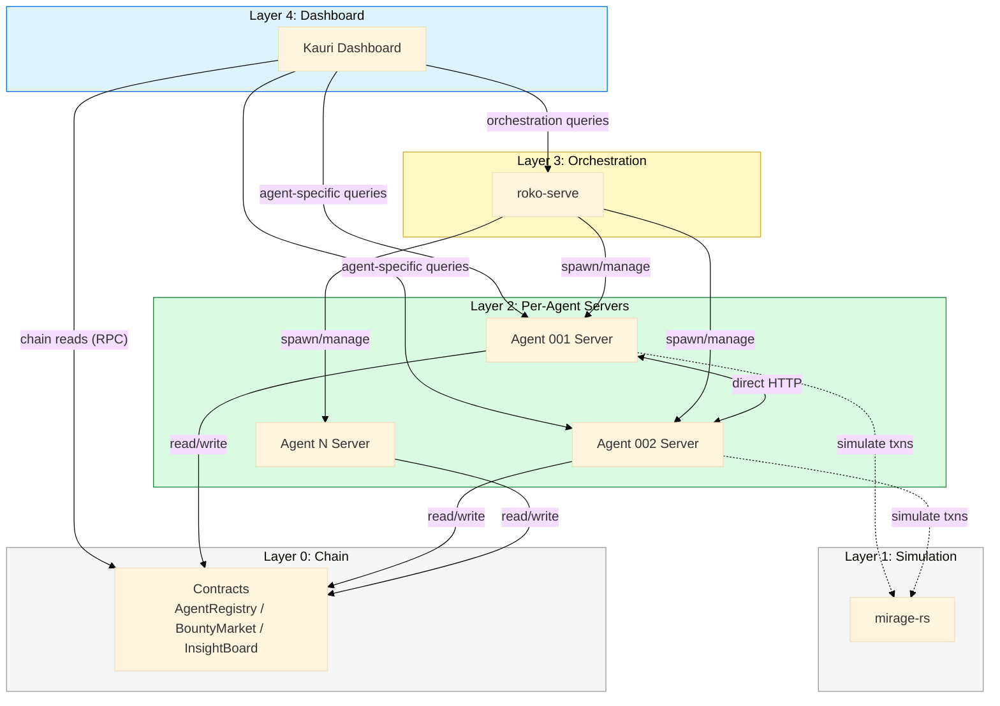

# Agent-Native Architecture Overview

The Nunchi system has 5 distinct layers. The current codebase conflates several of them — mirage-rs accumulates application state that belongs in per-agent servers or on-chain, roko-serve is the only HTTP surface for orchestration, and the dashboard routes everything through a single mirage-rs tunnel. This document defines the separation.

---

## The 5-Layer Model

### Layer 0: Chain

Solana/EVM smart contracts. Source of truth for agent identity, staking, reputation, and settlements.

| Contract | Responsibility | Key Details |
|----------|---------------|-------------|
| **ERC-8004 IdentityRegistry** | Agent identity + discovery | Soulbound ERC-721 passports, `agentCardUri` → JSON with `endpoints` field, capability bitmask (14 bits), `systemPromptHash`, `teeAttestation` |
| **ERC-8004 ReputationRegistry** | Feedback authorization | Who can rate whom, raw feedback events (scores computed off-chain) |
| **ERC-8004 ValidationRegistry** | Work verification | Work proofs, gate results, clearing certificates |
| `BountyMarket.sol` | Task posting + escrow | Post tasks with reward, escrow funds, release on completion |
| `InsightBoard.sol` | Knowledge posting + verification | On-chain insight entries, verification by consortium |

**Key insight: ERC-8004 Agent Cards already contain endpoint URLs.** The `agentCardUri` field on each passport points to a JSON document with an `endpoints` object:

```json
{
  "endpoints": {
    "mcp": "https://agent.fly.dev/mcp",
    "a2a": "https://agent.fly.dev/a2a",
    "websocket": "wss://agent.fly.dev/ws"
  }
}
```

This means agent server discovery is already solved by 8004 — no new registration mechanism needed. Agents publish their HTTP endpoints in their Agent Card, discoverers read the card URI from the Identity Registry.

**Since mirage-rs forks EVM state, the 8004 contracts are already deployed in the fork.** No contract deployment needed for dev/testing — agents register passports on the forked chain and their endpoints are immediately discoverable.

### Layer 1: Simulation & Substrate — mirage-rs

In-process EVM fork simulator. Lazy upstream reads, copy-on-write branching, JSON-RPC server.

**Core job:** EVM simulation — fork state, replay transactions, provide JSON-RPC.

**Opt-in features (feature flags):**

| Feature Flag | What It Adds |
|-------------|-------------|
| `chain` | HDC-indexed knowledge layer, InsightEntry state machine, stigmergy/pheromones |
| `roko` | Gate + Substrate trait implementations |

**Current problem:** mirage-rs has accumulated ~30 REST endpoints and application state that does not belong here:
- Agent registry shadow
- Knowledge store
- Pheromone field
- Task tracking
- Network topology

All of these should migrate to per-agent servers (Layer 2) or on-chain (Layer 0).

### Layer 2: Per-Agent Servers (NEW)

Each agent runs its own HTTP server exposing its capabilities. No single monolith — every agent is independently addressable.

**Crate:** `roko-agent-server` (to be built)

**Key properties:**
- Builder pattern — each agent configures which endpoints it exposes
- OS-assigned ports by default
- Agents publish their endpoint URLs in their ERC-8004 Agent Card (via `agentCardUri`)
- Direct agent-to-agent communication via HTTP (no central relay)
- Discovery via 8004 Identity Registry — no separate registration mechanism

**Routes per agent:** health, capabilities, messaging, predictions, research, task execution. See [01-agent-server-design.md](01-agent-server-design.md) for full spec.

### Layer 2.5: Aggregator Service (NEW — intermediate)

A thin backend service that presents the **same `/api/*` shape mirage-rs has today**, but sources data from the correct places (agent servers, chain, roko-serve). The dashboard changes one URL — from mirage-rs to the aggregator — and gets the correct architecture underneath without a rewrite.

| What it does | How |
|-------------|-----|
| `/api/agents` | Queries ERC-8004 registry + fans out to per-agent `/capabilities` |
| `/api/agents/{id}/stats` | Queries specific agent server |
| `/api/predictions/*` | Fans out to per-agent `/predictions` endpoints, merges results |
| `/api/knowledge/*` | Reads InsightBoard contract (chain) |
| `/api/pheromones/*` | Reads pheromone state from chain or local cache |
| `/api/tasks/*` | Reads BountyMarket contract + roko-serve for orchestration state |
| `/api/ws` | Multiplexes WS streams from N agent servers into one connection |

**Where it lives:** Likely an extension of roko-serve (it already has AppState, ProcessSupervisor, and knows which agents are running). A `routes/aggregator.rs` module that re-exports the mirage-rs API shape. Alternatively a standalone thin service, but roko-serve is the natural home since it already manages agents.

**Lifecycle:** This is an intermediate layer. In Phase 2 it's the primary dashboard backend. In Phase 3, the dashboard may talk to agent servers directly for some things, but the aggregator can stay as a convenience layer for unified views (topology, cross-agent predictions, etc).

### Layer 3: Agent Management / Orchestration — roko-serve

Orchestration and operator tooling. Currently ~70 endpoints.

| Category | Endpoints | Notes |
|----------|-----------|-------|
| Orchestration | Plans, PRDs, runs, research | Core job — stays here |
| Config management | Hot-reload via ArcSwap | Operator concern — stays |
| Learning pipeline | Efficiency, cascade router, experiments, gate thresholds | Stays |
| Deployments | Railway/Fly.io backends | Stays |
| Webhooks / streaming | SSE, WebSocket | Stays |
| Templates | Plan/agent templates | Stays |
| Subscriptions | Event subscriptions | Stays |

**AppState holds:** workdir, signal_store, cancel token, metrics, process supervisor, daimon state, event bus, state hub, subscriptions, runtime, config, provider health, latency, active runs/plans/operations, templates, deploy backend, deployments, scrubber.

### Layer 4: Dashboard — Kauri

Next.js at `kauri-dashboard-v2.vercel.app`. Maintained by Sam.

**Current:** talks to mirage-rs `/api/*` via Cloudflare tunnel.

**Target:** talks to the aggregator service (same `/api/*` shape as mirage-rs, different backend). For orchestration-specific views, also queries roko-serve directly.

| Source | What It Provides |
|--------|-----------------|
| Aggregator (on roko-serve) | Same `/api/*` endpoints as mirage-rs today, but sourced from agent servers + chain. Dashboard changes one URL. |
| roko-serve (direct) | Orchestration data: plans, runs, deployments, system config |
| Per-agent servers (optional, later) | For advanced views that need direct agent streams |

---

## Data Flow



**Key flows:**
1. **Dashboard reads:** Chain RPC for registry/staking, per-agent servers for capabilities/predictions, roko-serve for plans/runs
2. **Agent-to-agent:** Direct HTTP between agent servers, no relay through roko-serve
3. **Agent-to-chain:** Each agent reads/writes contracts directly via `roko-chain`
4. **Orchestration:** roko-serve spawns agent processes, agent processes start their own HTTP servers
5. **Simulation:** Agents use mirage-rs for EVM fork simulation when needed (not for state storage)

---

## What Goes Where

| Concern | Current Home | Correct Home | Rationale |
|---------|-------------|--------------|-----------|
| Agent identity / registration | mirage-rs `ChainContext` + contracts | ERC-8004 Identity Registry (source of truth) + agent-server (runtime) | 8004 passports already exist; Agent Card JSON carries endpoints |
| Agent capabilities / skills | None (planned for mirage-rs) | ERC-8004 Agent Card `capabilities` + `endpoints` field + per-agent server `/capabilities` | Agent Card is on-chain, server provides live detail |
| Knowledge / insights | mirage-rs `ChainContext` | `InsightBoard` contract + per-agent cache | Chain provides verifiability |
| Pheromones / stigmergy | mirage-rs `ChainContext` | Pheromone contract + local agent caches | Decentralized coordination, no central store |
| Task management | mirage-rs `ChainContext` | `BountyMarket` contract + roko-serve orchestration | Contract for escrow, serve for execution tracking |
| Agent messaging | Planned for roko-serve | Per-agent server (direct HTTP) | Agent-to-agent, no central relay needed |
| EVM simulation | mirage-rs | mirage-rs (stays) | This is its core job |
| Plan execution | roko-serve | roko-serve (stays) | Orchestration layer responsibility |
| Config management | roko-serve | roko-serve (stays) | Operator concern |
| Dashboard data aggregation | mirage-rs REST endpoints | Agent servers + chain reads + roko-serve | Eliminate single aggregation bottleneck |
| Network topology | mirage-rs | Chain registry + agent discovery | On-chain source of truth for who's alive |
| Reputation / staking | Contracts + mirage-rs shadow | Contracts only (read via RPC) | No shadow copies of chain state |

---

## Incremental Build Path

### Phase 1: Demo (Additive)

**Goal:** Build `roko-agent-server` crate. Agents expose endpoints. Dashboard queries both old and new. Nothing breaks.

| Task | Details |
|------|---------|
| Build `roko-agent-server` crate | Builder API, standard routes, bearer auth |
| Wire into agent startup | Agents start HTTP server alongside LLM loop |
| Dashboard: add agent-direct queries | New data source, falls back to mirage-rs |
| Feature flags everywhere | `agent-server` flag on agent side, `direct-query` flag on dashboard |

**Invariant:** All existing mirage-rs endpoints remain functional. Dashboard works with or without agent servers.

### Phase 2: Extract & Migrate

**Goal:** Move agent state out of mirage-rs into per-agent servers. Dashboard switches to direct agent queries.

| Task | Details |
|------|---------|
| Agent registry reads from chain | Remove mirage-rs shadow registry |
| Knowledge store per-agent | Each agent caches its own insights, chain is source of truth |
| Pheromone field decentralized | Local caches + chain writes, remove mirage-rs pheromone store |
| Dashboard switches data sources | Agent-specific data from agent servers, not mirage-rs |
| Deprecate mirage-rs REST endpoints | Mark as deprecated, log usage, set removal timeline |

### Phase 3: Production Cleanup

**Goal:** mirage-rs returns to pure EVM substrate. Agent discovery fully on-chain. Dashboard uses only the three canonical sources.

| Task | Details |
|------|---------|
| Remove deprecated mirage-rs endpoints | Only JSON-RPC + simulation routes remain |
| Strip application state from mirage-rs | No agent registry, no knowledge store, no pheromone field, no task tracking |
| Agent discovery fully on-chain | ERC-8004 Agent Cards contain endpoint URLs; filter for Roko agents via capability bitmask or domain tag |
| Dashboard finalized | Chain reads + agent server queries + roko-serve orchestration |

---

## Cross-References

- [01-agent-server-design.md](01-agent-server-design.md) — `roko-agent-server` crate builder API, route surface, auth model
- [02-mirage-extraction.md](02-mirage-extraction.md) — Detailed plan for extracting state from mirage-rs
- [03-auth-and-discovery.md](03-auth-and-discovery.md) — Bearer tokens, on-chain registration, heartbeat protocol
- [04-dashboard-migration.md](04-dashboard-migration.md) — Kauri data source migration plan
- [05-build-phases.md](05-build-phases.md) — Sprint-level breakdown of the three phases
- [06-open-questions.md](06-open-questions.md) — Unresolved decisions and ownership
