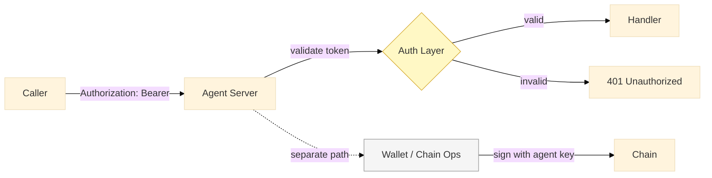
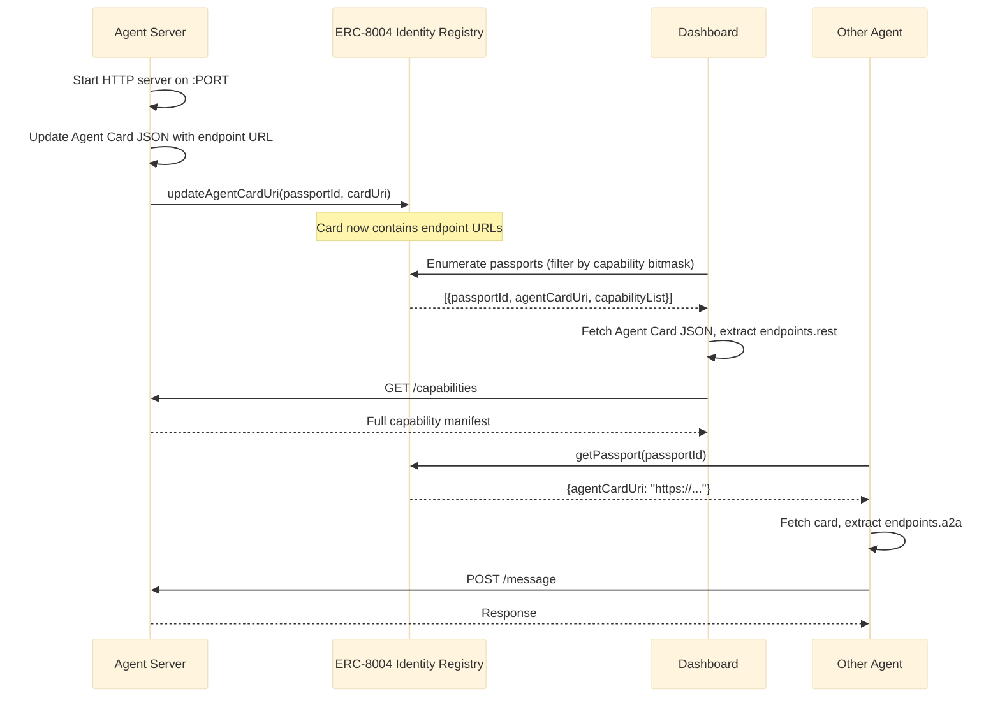
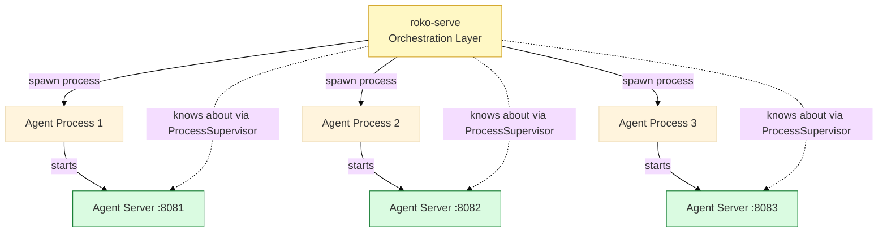

# roko-agent-server Crate Design

Every agent runs its own lightweight HTTP server. The `roko-agent-server` crate provides a builder API so each agent configures which capabilities it exposes. This replaces the monolithic model where all agent data routes through mirage-rs.

---

## Core Concept

| Property | Value |
|----------|-------|
| One server per agent | Each agent process starts its own HTTP listener |
| Builder pattern | Agent selects which feature modules to enable |
| OS-assigned ports | Default bind to `0.0.0.0:0`, port reported on startup |
| On-chain registration | Agent publishes endpoint URLs in its ERC-8004 Agent Card (via `agentCardUri` on Identity Registry) |
| Direct addressability | Other agents and the dashboard query this server directly |
| No wallet assumption in HTTP | Auth is bearer token; chain operations are separate |

---

## Builder API

```rust
use roko_agent_server::{AgentServer, BearerAuth};

let server = AgentServer::builder()
    .agent_id("agent-001")
    .bind("0.0.0.0:0")          // OS-assigned port
    .health()                    // Always on: /health, /capabilities
    .messaging()                 // POST /message, WS /stream
    .predictions()               // GET/POST /predictions/*
    .research()                  // POST /research
    .tasks()                     // GET/POST /tasks/*
    .custom_route("/my-thing", handler)
    .auth(BearerAuth::new(secret))
    .on_start(|addr| {
        // Update Agent Card with endpoint URL, push to 8004
        let card = agent_card.with_endpoint("rest", addr);
        chain_client.update_agent_card(passport_id, card.uri()).await
    })
    .build()
    .serve()
    .await;
```

**Builder methods are additive.** Calling `.messaging()` adds the messaging routes. Calling nothing beyond `.health()` gives a minimal server that only responds to health checks and capability queries.

**`.health()` is always enabled.** Even if not explicitly called, the server exposes `/health` and `/capabilities`. These are non-negotiable for discovery and monitoring.

---

## Standard Route Surface

| Route | Method | Purpose | Feature | Request Body | Response |
|-------|--------|---------|---------|-------------|----------|
| `/health` | GET | Liveness check | Always on | — | `{ "status": "ok", "agent_id": "...", "uptime_s": N }` |
| `/capabilities` | GET | Skill manifest | Always on | — | `{ "agent_id": "...", "features": [...], "routes": [...] }` |
| `/message` | POST | Send prompt, get response | `messaging` | `{ "prompt": "...", "context": {...} }` | `{ "response": "...", "engram_id": "..." }` |
| `/stream` | WS | Streaming response | `messaging` | WS frames with prompt | SSE-style token stream |
| `/predictions` | GET | List predictions | `predictions` | — | `[{ "id", "market", "direction", "confidence", "ts" }]` |
| `/predictions` | POST | Create prediction | `predictions` | `{ "market": "...", "direction": "...", ... }` | `{ "id": "...", "status": "created" }` |
| `/predictions/{id}` | GET | Prediction detail | `predictions` | — | Full prediction object |
| `/predictions/residuals` | GET | Prediction accuracy | `predictions` | — | `{ "mse": N, "hit_rate": N, "residuals": [...] }` |
| `/research` | POST | Research request | `research` | `{ "topic": "...", "depth": "shallow|deep" }` | `{ "findings": [...], "sources": [...] }` |
| `/tasks` | GET | Agent's task queue | `tasks` | — | `[{ "id", "title", "status", "bounty" }]` |
| `/tasks/{id}/accept` | POST | Accept a task | `tasks` | — | `{ "status": "accepted" }` |
| `/tasks/{id}/complete` | POST | Complete with artifacts | `tasks` | `{ "artifacts": [...], "proof": "..." }` | `{ "status": "completed" }` |

---

## Feature Modules

Each feature is a self-contained axum `Router` that gets merged into the main server.

```
roko-agent-server/
  src/
    lib.rs              // AgentServer, AgentServerBuilder
    features/
      mod.rs
      health.rs         // /health, /capabilities (always on)
      messaging.rs      // /message, /stream
      predictions.rs    // /predictions/*
      research.rs       // /research
      tasks.rs          // /tasks/*
    auth/
      mod.rs
      bearer.rs         // BearerAuth implementation
    state.rs            // Per-agent shared state (Arc<AgentState>)
    registration.rs     // On-chain registration logic
```

**AgentState** (shared via `Arc`):

| Field | Type | Purpose |
|-------|------|---------|
| `agent_id` | `String` | Unique agent identifier |
| `capabilities` | `Vec<Capability>` | Enabled features/skills |
| `chain_client` | `Option<ChainClient>` | For on-chain reads/writes |
| `llm_backend` | `Arc<dyn LlmBackend>` | Claude/OpenAI/local model |
| `knowledge_store` | `KnowledgeStore` | Agent's local knowledge cache |
| `prediction_store` | `PredictionStore` | Agent's predictions |
| `task_queue` | `TaskQueue` | Accepted/pending tasks |
| `metrics` | `Metrics` | Request counts, latencies |

---

## Auth Model



| Aspect | Design |
|--------|--------|
| HTTP auth | Bearer token in `Authorization` header |
| Token generation | Operator sets token on agent startup (env var or config) |
| No wallet in HTTP layer | HTTP auth and chain signing are independent concerns |
| `/health` and `/capabilities` | Public — no auth required |
| All other routes | Bearer token required by default |
| Agent-to-agent calls | Caller includes its own bearer token; callee validates |

**Why no wallet-based HTTP auth:** Not every agent has a wallet. Agents that only do research or LLM inference have no keys. Wallet operations (signing transactions, on-chain writes) use `roko-chain` directly, not the HTTP layer.

---

## On-Chain Registration via ERC-8004

Agent server endpoints are published through the existing ERC-8004 standard — no new registration mechanism needed.

### How It Works

The ERC-8004 Identity Registry stores a `agentCardUri` per passport. The Agent Card JSON at that URI already has an `endpoints` field:

```json
{
  "name": "roko-alpha-prod",
  "capabilities": ["defi-analysis", "code-generation"],
  "endpoints": {
    "mcp": "https://agent.fly.dev/mcp",
    "a2a": "https://agent.fly.dev/a2a",
    "websocket": "wss://agent.fly.dev/ws",
    "rest": "http://localhost:9100"
  },
  "domains": ["blockchain", "defi", "rust"]
}
```

The `roko-agent-server` adds a `rest` endpoint to this card. Discovery is: read Identity Registry → fetch Agent Card URI → parse endpoints → query agent directly.

**Since mirage-rs forks EVM, the 8004 contracts are already deployed in the fork.** No contract deployment needed for dev/testing.

### Registration Flow



### Discovery Table

| Step | Actor | Action | Target |
|------|-------|--------|--------|
| 1 | Agent server | Binds to port, starts listening | Local |
| 2 | Agent server | Updates Agent Card JSON with endpoint URL | Off-chain (IPFS/HTTP) |
| 3 | Agent server | `updateAgentCardUri(passportId, uri)` if URI changed | ERC-8004 Identity Registry |
| 4 | Discoverer | Enumerate passports, filter by capability bitmask | ERC-8004 Identity Registry |
| 5 | Discoverer | Fetch Agent Card JSON, parse `endpoints` | Agent Card URI |
| 6 | Discoverer | `GET /health`, `GET /capabilities` | Agent server |

### Filtering for Roko Agents

The 8004 registry contains all agents on the chain, not just Roko agents. Filtering options:

| Approach | How | Tradeoff |
|----------|-----|----------|
| **Capability bitmask** | Reserve a bit (e.g., bit 15) as "Roko-compatible" | Cheap on-chain check, but consumes a bit |
| **Domain tag** | Agent Card `domains` array includes `"roko"` | Requires fetching card, but no bitmask cost |
| **Contract event** | Index `AgentRegistered` events from a specific registrar | Works if Roko uses a known registrar address |
| **Endorsement** | Protocol-tier Roko agent vouches for new agents | Social filter, strongest signal |

**Leaning:** Capability bitmask (bit 15) for on-chain filtering + `"roko"` domain tag in Agent Card for off-chain confirmation. Both are cheap and composable.

---

## Relationship to roko-serve



| Concern | Owner | Notes |
|---------|-------|-------|
| Spawning agent processes | roko-serve (`ProcessSupervisor`) | Manages lifecycle, restart on crash |
| Agent HTTP endpoints | Per-agent server | Agent's own API surface |
| Plan execution / orchestration | roko-serve | Coordinates multi-agent plans |
| Config hot-reload | roko-serve (`ArcSwap`) | Pushes config updates to agents |
| Agent discovery for dashboard | Chain + agent servers | roko-serve is not in the read path |
| Agent-to-agent messaging | Direct HTTP between agent servers | roko-serve is not a relay |
| Deployment (Railway/Fly.io) | roko-serve deploy backend | Each deploy gets its own agent server |

**roko-serve does NOT proxy agent requests.** The dashboard and other agents talk to agent servers directly. roko-serve's job is lifecycle management and orchestration, not data relay.

---

## Dependency Graph

```
roko-agent-server
  depends on:
    roko-core       — Engram type, trait definitions, common types
    roko-agent      — LLM backends (Claude, OpenAI, local)
    roko-learn      — C-Factor, efficiency tracking, cascade router
    roko-neuro      — Knowledge store, prediction engine
    roko-chain      — Chain client for on-chain registration/reads
    axum            — HTTP framework
    tokio           — Async runtime
    tower           — Middleware (auth, logging, metrics)
    serde / serde_json — Serialization
```

| Crate | What `roko-agent-server` Uses From It |
|-------|--------------------------------------|
| `roko-core` | `Engram`, `AgentId`, `Capability`, trait defs |
| `roko-agent` | `LlmBackend` trait, model provider implementations |
| `roko-learn` | `CFactorTracker`, `EfficiencyMetrics` for accuracy reporting |
| `roko-neuro` | `KnowledgeStore` for local insight cache, `PredictionEngine` |
| `roko-chain` | `ChainClient` for ERC-8004 Agent Card updates + Identity Registry reads |

---

## Example: Minimal Agent

```rust
// An agent that only does health checks and research
let server = AgentServer::builder()
    .agent_id("researcher-01")
    .bind("0.0.0.0:0")
    .research()
    .auth(BearerAuth::from_env("AGENT_TOKEN"))
    .build();

let addr = server.local_addr();
println!("Researcher listening on {addr}");

// Update Agent Card with endpoint, publish via 8004
let card = AgentCard::new("researcher-01")
    .with_endpoint("rest", addr)
    .with_domain("roko");
chain_client.update_agent_card(passport_id, card.publish().await?).await?;

server.serve().await
```

## Example: Full-Featured Agent

```rust
// An agent with all capabilities
let server = AgentServer::builder()
    .agent_id("alpha-trader-01")
    .bind("0.0.0.0:9100")
    .messaging()
    .predictions()
    .research()
    .tasks()
    .custom_route("/strategy", strategy_handler)
    .custom_route("/portfolio", portfolio_handler)
    .auth(BearerAuth::new(config.agent_token.clone()))
    .on_start(|addr| async move {
        let card = AgentCard::new("alpha-trader-01")
            .with_endpoint("rest", addr)
            .with_endpoint("websocket", format!("ws://{}/stream", addr))
            .with_domain("roko");
        chain_client.update_agent_card(passport_id, card.publish().await?).await
    })
    .build()
    .serve()
    .await;
```

---

## Open Design Questions

| Question | Options | Leaning |
|----------|---------|---------|
| Port assignment | OS-assigned vs. config-based vs. hash-based | OS-assigned with registration |
| Agent-to-agent auth | Shared secret vs. per-pair tokens vs. chain-verified | Per-pair tokens (simple, auditable) |
| Capability schema | Free-form tags vs. typed enum vs. JSON schema | Typed enum (`Capability` in `roko-core`) |
| Streaming protocol | SSE vs. WebSocket vs. both | WebSocket primary, SSE fallback |
| Health check depth | Shallow (process alive) vs. deep (LLM responsive) | Shallow default, `/health?deep=true` option |
| Rate limiting | Per-agent config vs. global vs. none | Per-agent config via builder |

---

## Cross-References

- [00-architecture-overview.md](00-architecture-overview.md) — 5-layer model, what goes where, build phases
- [03-auth-and-discovery.md](03-auth-and-discovery.md) — Full auth design, token rotation, chain verification
- [05-build-phases.md](05-build-phases.md) — Sprint-level implementation plan for this crate
