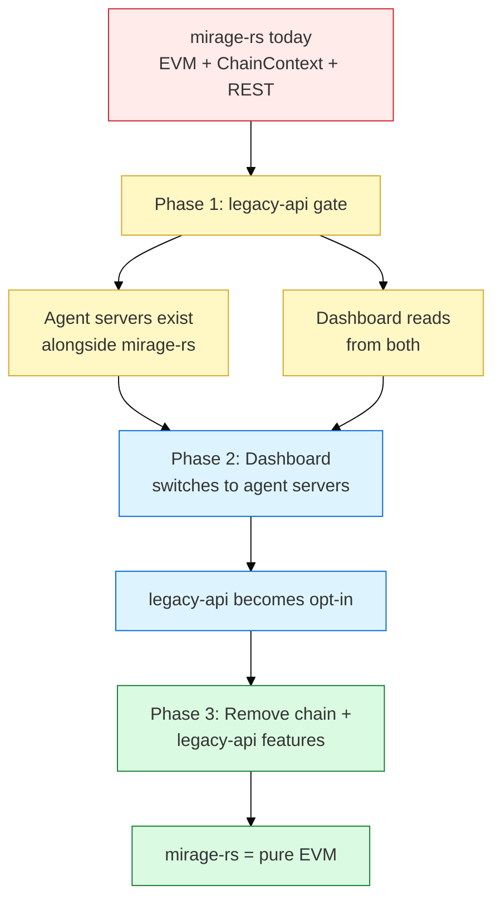

# Mirage-RS Extraction Plan

mirage-rs is an in-process EVM fork simulator. Its core job: fork EVM state from upstream, replay transactions, provide JSON-RPC. It has accumulated application state that does not belong there. This doc maps every piece of bolted-on state and defines where it goes.

## Current State Inventory

### Core mirage-rs (STAYS)

| Module | ~LOC | Responsibility |
|--------|------|----------------|
| `fork.rs` | 102K | ForkState, HybridDB, MirageFork, read cache, CoW state |
| `rpc.rs` | 160K | Full JSON-RPC 2.0 surface + `mirage_*` extensions |
| `replay.rs` | 66K | Transaction replay, speculative execution |
| `scenario.rs` | — | Scenario manifests, assertion checking, scenario runner |
| `integration.rs` | — | MirageClient, event filtering, scenario runner |

Feature flags: `binary`, `library`, `sim-gas`.

### Bolted-On Application State (EXTRACT)

The `chain` feature adds:

- **HDC index** over knowledge entries
- **InsightEntry state machine**: created -> active -> confirmed -> decaying -> challenged -> pruned -> stale
- **Pheromone field**: threat/opportunity/wisdom signals with decay
- **Agent topology** tracking
- **`ChainContext` struct** holding all of the above

The `http_api/` module (9 files) exposes ~30 REST endpoints across 6 concerns that do not belong in an EVM simulator.

### Endpoint Extraction Map

| Current Endpoint | Current Owner | New Home | Reason |
|-----------------|---------------|----------|--------|
| `/api/health` | mirage-rs | mirage-rs (stays) | Core server health |
| `/api/stats` | mirage-rs | Split: EVM stats stay, agent stats -> agent servers | Mixed concern |
| `/api/pheromones` (6 routes) | ChainContext | Pheromone contract + local cache | Decentralized, not single-server |
| `/api/knowledge/entries` (7 routes) | ChainContext | InsightBoard contract + per-agent cache | Verifiable on-chain |
| `/api/agents` (list, register, trace, heartbeat, stats) | ChainContext | Per-agent servers + chain registry | Agent owns its data |
| `/api/agents/topology` | ChainContext | Dashboard computes from agent queries | Derived data |
| `/api/tasks` (8 routes) | ChainContext | BountyMarket contract + roko-serve | Contract for escrow, serve for execution |
| `/api/ws` | mirage-rs | Per-agent WS + roko-serve SSE | Agent-specific streams |

### ApiState Struct (Current)

```rust
pub struct ApiState {
    pub chain: Arc<RwLock<ChainContext>>,     // ALL application state lives here
    pub current_block: BlockNumberFn,
    pub projection_cache: ProjectionCache,    // LRU for HDC projections
    pub started_at: Instant,
    pub subs: Option<SubscriptionManager>,    // WS subscriptions (roko feature)
}
```

After extraction, `ApiState` becomes:

```rust
pub struct ApiState {
    pub current_block: BlockNumberFn,
    pub started_at: Instant,
}
```

No `ChainContext`. No `ProjectionCache`. No `SubscriptionManager`. Pure EVM server state.

## State Extraction Map

| State | Current Location | New Location | Migration Strategy |
|-------|-----------------|--------------|-------------------|
| AgentEntry (id, address, role, stats) | `ChainContext.agents` | AgentRegistry contract + per-agent `/health` | Agent registers on-chain at startup |
| AgentStats (confirmations, challenges, tasks, cost, tokens) | `ChainContext.agents[].stats` | Per-agent server `/stats` | Agent tracks its own metrics |
| AgentTrace (cognitive loop history) | `ChainContext.agents[].traces` | Per-agent server `/traces` | Agent owns its execution history |
| KnowledgeStore (InsightEntry state machine) | `ChainContext.knowledge` | InsightBoard contract + per-agent neuro store | Insights posted on-chain, cached locally |
| PheromoneField (decay, intensity, HDC) | `ChainContext.pheromones` | Pheromone contract + local caches | On-chain for persistence, local for queries |
| TaskStore (task lifecycle) | `ChainContext.tasks` | BountyMarket contract + roko-serve | Contract for escrow, serve for orchestration |
| HDC Index | `ChainContext` via chain feature | Per-agent neuro store (roko-neuro) | Each agent maintains its own knowledge index |
| Topology graph | Computed from agent interactions | Dashboard aggregates from agent queries | No single authority needed |

## Extraction Flow



## Feature Flag Strategy

```toml
[features]
default = ["binary", "chain"]
binary = []              # CLI entry point
library = []             # Library-only mode
sim-gas = []             # revm gas accounting
chain = []               # HDC, InsightEntry, pheromones (DEPRECATING)
roko = ["chain"]         # Gate + Substrate impls (DEPRECATING)
legacy-api = ["chain"]   # NEW: Keep old REST endpoints during migration
```

### Phase 1 — Gate Behind `legacy-api`

- Add `legacy-api` feature flag
- Move all `http_api/` routes (except `/health`, `/stats` EVM-only) behind `#[cfg(feature = "legacy-api")]`
- New agent servers run alongside, serving the same data from their own state
- Dashboard queries both during transition
- Duration: 1-2 sprints

### Phase 2 — Dashboard Switches

- Dashboard points to per-agent servers for agent/knowledge/pheromone data
- Dashboard points to roko-serve for task/plan data
- Dashboard points to mirage-rs only for EVM simulation + JSON-RPC
- `legacy-api` becomes opt-in (not in default features)
- Duration: 1 sprint

### Phase 3 — Remove Chain Features

- Delete `chain` feature and all `ChainContext` code
- Delete `legacy-api` feature and `http_api/` module (except health/stats)
- Delete `roko` feature gate code
- mirage-rs Cargo.toml shrinks to: `binary`, `library`, `sim-gas`
- Duration: 1 sprint

## Target State

After extraction, mirage-rs is:

| Concern | Status |
|---------|--------|
| EVM fork simulation | Stays |
| JSON-RPC (standard + `mirage_*`) | Stays |
| Transaction replay + speculative execution | Stays |
| Scenario runner | Stays |
| `/health` endpoint | Stays |
| `/stats` (EVM-only metrics) | Stays |
| Agent state | Removed |
| Knowledge store | Removed |
| Pheromone field | Removed |
| Task lifecycle | Removed |
| HDC index | Removed |
| WebSocket subscriptions | Removed |
| `ChainContext` | Removed |
| `http_api/` (30 REST routes) | Removed (3 remain) |

## Risks

| Risk | Mitigation |
|------|------------|
| Dashboard breaks during migration | `legacy-api` flag keeps old endpoints alive |
| Data inconsistency between old and new sources | Phase 1 runs both in parallel, dashboard compares |
| Performance regression from distributed queries | Per-agent caching, dashboard aggregation cache |
| Feature flag combinatorial complexity | Only 3 phases, each removes flags — complexity decreases monotonically |

## Cross-Refs

- [00-architecture-overview.md](00-architecture-overview.md) — system-level component map
- [01-agent-server-design.md](01-agent-server-design.md) — where extracted state lands
- [03-auth-and-discovery.md](03-auth-and-discovery.md) — auth model for new agent servers
- [04-dashboard-migration.md](04-dashboard-migration.md) — dashboard-side changes
