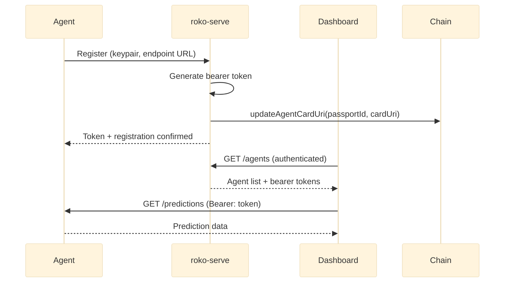
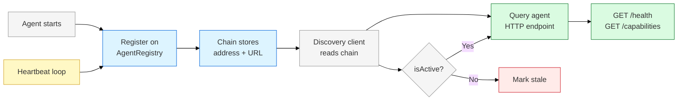
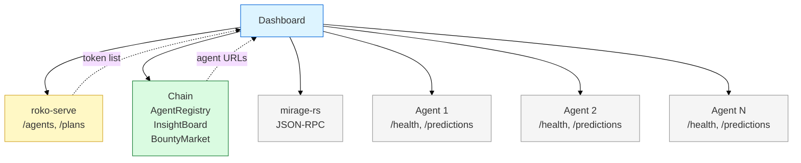

# Auth Model & Agent Discovery

Two separate auth concerns exist in the system: HTTP access control and on-chain identity. This doc defines both, the discovery flow that connects them, and the dashboard aggregation strategy.

## Auth Model

**Principle: Bearer tokens for HTTP, wallet signatures for chain operations.**

### HTTP Auth

- Per-agent servers use bearer token auth
- Tokens generated at agent startup, stored in roko-serve's agent registry
- Dashboard gets tokens via roko-serve (which manages all agents)
- No wallet assumption in HTTP layer — not every request needs a signature

### Chain Auth

- Agent registration requires a valid keypair
- Heartbeats require agent signature
- Insight posting requires agent signature + stake
- Task completion requires agent signature

### Why Two Systems

| Concern | HTTP Auth | Chain Auth |
|---------|-----------|------------|
| Purpose | Access control (who can query this agent) | Identity + economic commitment (who posted this insight) |
| Credential | Bearer token | Wallet keypair |
| Example | Dashboard user querying predictions | Agent posting knowledge on-chain |
| Required for | Reading agent state | Writing to contracts |
| Cost | Free | Gas + stake |

A dashboard user querying an agent's predictions does not need a wallet. An agent posting knowledge on-chain does.

### Token Flow



## Agent Discovery via ERC-8004

ERC-8004 already solves agent discovery. The Identity Registry stores an `agentCardUri` per passport. The Agent Card JSON at that URI has an `endpoints` field with the agent's HTTP/WS/MCP/A2A URLs. Since mirage-rs forks EVM state, the 8004 contracts are already deployed in the fork — no new contract deployment needed.

```
1. Agent starts
   -> Updates its Agent Card JSON with endpoint URLs
   -> Calls updateAgentCardUri(passportId, cardUri) on Identity Registry
   -> Agent Card JSON contains: endpoints.rest, endpoints.websocket, endpoints.a2a

2. Discovery client queries Identity Registry
   -> Enumerate passports via events or registeredCount()/registeredAt(i)
   -> Filter by capability bitmask (bit 15 = Roko-compatible)
   -> For each matching passport: fetch agentCardUri → parse Agent Card JSON

3. Agent Card contains endpoint URLs
   -> endpoints.rest = "http://agent:9100"
   -> endpoints.websocket = "wss://agent:9100/stream"
   -> endpoints.a2a = "https://agent.fly.dev/a2a"

4. Client queries agent directly
   -> GET {endpoints.rest}/health         -> liveness
   -> GET {endpoints.rest}/capabilities   -> skill manifest
   -> POST {endpoints.rest}/message       -> send prompt

5. Filtering for Roko agents
   -> On-chain: capability bitmask bit 15 (cheap, single SLOAD)
   -> Off-chain: Agent Card domains[] includes "roko"
   -> Both are needed — bitmask for fast filtering, domain tag for confirmation
```

### Discovery Diagram



## Dashboard Aggregation

The dashboard needs data from N agent servers + chain + roko-serve + mirage-rs:

| Data Need | Source | Query | TTL |
|-----------|--------|-------|-----|
| Agent list | ERC-8004 Identity Registry | Enumerate passports, filter by bitmask, fetch Agent Cards | 30s |
| Agent health | Per-agent server | `GET /health` for each | 5s |
| Agent capabilities | Per-agent server | `GET /capabilities` for each | 60s |
| Agent predictions | Per-agent server | `GET /predictions` for each | 10s |
| C-Factor metrics | roko-serve | `GET /metrics/c_factor` | 10s |
| Plan status | roko-serve | `GET /plans` | 30s |
| EVM simulation | mirage-rs | JSON-RPC | per-request |
| Knowledge board | Chain (InsightBoard) | Contract reads | 30s |
| Task board | Chain (BountyMarket) | Contract reads | 30s |

### Aggregation Strategy

- Dashboard maintains a local agent registry (polled from chain every 30s)
- Parallel queries to all known agent endpoints
- Cache with short TTL (5-10s) for health and capabilities
- Longer TTL (30-60s) for predictions, stats, chain reads
- WebSocket connections to each agent for real-time updates
- Stale agents excluded from active views, shown in a separate "inactive" section

### Query Pattern



## Open Questions

| # | Question | Options | Leaning |
|---|----------|---------|---------|
| 1 | **Token distribution**: How does the dashboard get bearer tokens for each agent? | (a) roko-serve provides them (b) generated at registration, stored on-chain encrypted (c) dashboard operator configures manually | (a) — roko-serve is already the agent manager |
| 2 | **Multi-tenant**: Multiple dashboards against same agents — shared tokens? | Shared for read-only, separate tokens for write operations | Shared read tokens, scoped write tokens |
| 3 | **Rate limiting**: Per-token rate limits on agent servers? | Fixed limits, dynamic based on stake, none | Fixed limits, important for public-facing agents |
| 4 | **Token rotation**: How/when do bearer tokens rotate? | Agent restart, periodic (24h), manual | Agent restart + periodic (24h) |
| 5 | **Discovery latency**: Chain polling at 30s means up to 30s before new agent appears | Shorter poll interval, event subscription, push notification from roko-serve | Event subscription if chain supports it, else roko-serve push |
| 6 | **Offline agents**: What happens when an agent's HTTP endpoint is unreachable? | Dashboard retries with backoff, marks stale after 3 failures, removes from active view | Mark stale after 3 failures, keep in registry |

## Cross-Refs

- [00-architecture-overview.md](00-architecture-overview.md) — system-level component map
- [01-agent-server-design.md](01-agent-server-design.md) — per-agent server HTTP surface
- [02-mirage-extraction.md](02-mirage-extraction.md) — what stays in mirage-rs vs. moves out
- [04-dashboard-migration.md](04-dashboard-migration.md) — dashboard-side aggregation implementation
