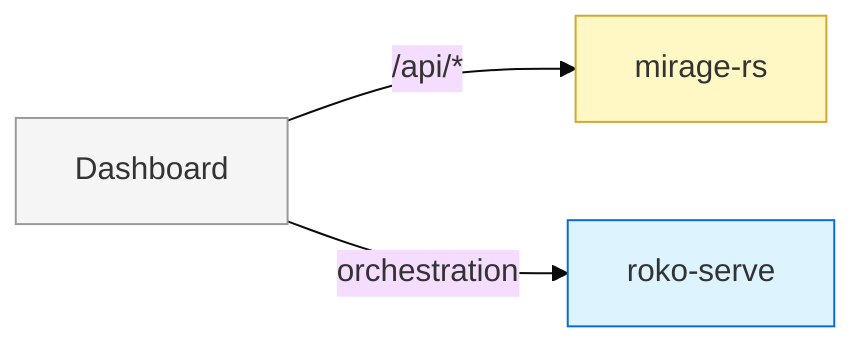
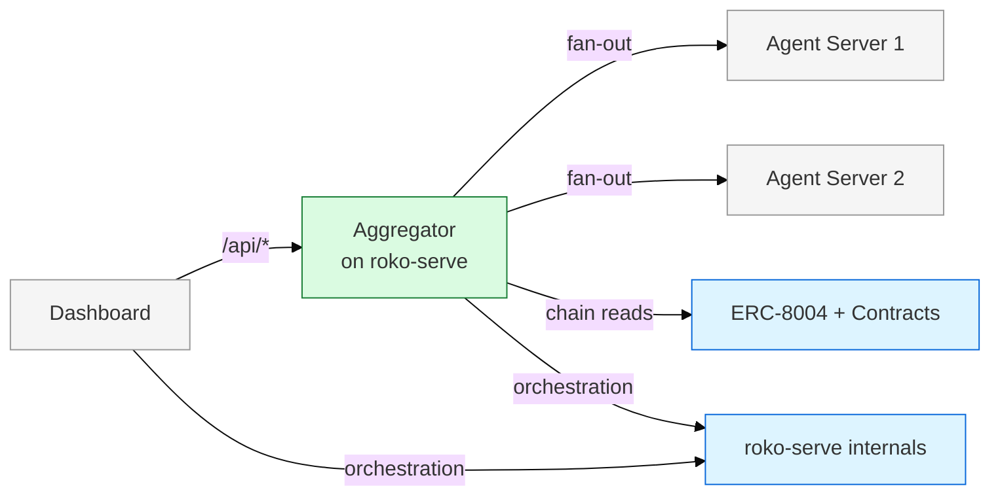
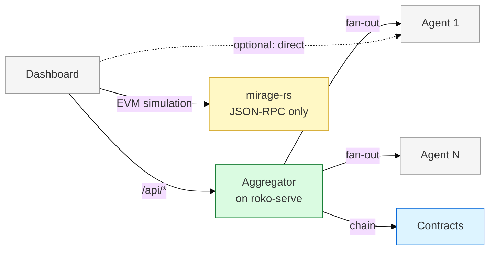

# Dashboard Migration Plan

## Current State

The Kauri dashboard (Next.js, maintained by Sam, at kauri-dashboard-v2.vercel.app) talks to mirage-rs `/api/*` endpoints via Cloudflare tunnel to local mirage-rs. Sam has written 7 backend integration specs and 6 product PRDs (GitHub issue #45).

**Already wired in the dashboard:**

- All 5 mirage-rs endpoint groups (health, pheromones, knowledge, agents, tasks)
- C-Factor card, operating frequency, cognitive cost tiers
- AntiKnowledge treatment
- Agent lifecycle states
- 15 skills across 5 domains
- ISFR popup
- Jobs panel
- Notification center
- Cloudflare tunnel to local mirage-rs

## The Problem (and the solution)

Sam's specs assume mirage-rs is the single backend. The correct architecture has 4 data sources (chain, per-agent servers, roko-serve, mirage-rs). But forcing the dashboard to fan out to N backends with per-feature flags is a heavy rewrite.

**Solution: Aggregator service.** A backend that presents the **same `/api/*` shape as mirage-rs** but sources data from the correct places under the hood. Sam changes one URL — from mirage-rs to the aggregator — and the dashboard works without architectural changes.

| Concern | Before (mirage-rs) | After (aggregator) | Dashboard change |
|---------|--------------------|--------------------|-----------------|
| Agent list | mirage-rs ChainContext | ERC-8004 registry + fan-out to agent servers | Change base URL |
| Agent stats | mirage-rs ChainContext | Per-agent server `/stats` | Change base URL |
| Predictions | Not implemented | Fan-out to per-agent `/predictions`, merge | Change base URL |
| Knowledge | mirage-rs ChainContext | InsightBoard contract reads | Change base URL |
| Pheromones | mirage-rs ChainContext | Chain reads + local cache | Change base URL |
| Tasks | mirage-rs ChainContext | BountyMarket contract + roko-serve | Change base URL |
| WebSocket | mirage-rs `/api/ws` | Multiplexed stream from N agent WS | Change base URL |

**Where it lives:** Most naturally as a `routes/aggregator.rs` module on roko-serve. roko-serve already has `AppState`, `ProcessSupervisor`, and knows which agents are running. Adding mirage-compatible routes that fan out to the real sources is ~200-400 LOC.

## Current Implementation Status

The serve-side compatibility layer is partially landed now:

- `/api/agents`, `/api/agents/topology`, `/api/agents/{id}/stats`, `/api/agents/{id}/skills`, `/api/agents/{id}/heartbeat`, and `/api/agents/{id}/trace` are served from `roko-serve`
- `/api/predictions/sessions`, `/api/predictions/sessions/{id}`, `/api/predictions/claims`, and `/api/predictions/calibration/{agent_id}` fan out to discovered agent servers
- `/api/tasks`, `/api/tasks/stats`, and `/api/tasks/{id}` are aggregated from discovered agent task surfaces
- `/api/ws` multiplexes the `roko-serve` event bus plus discovered agent `/stream` WebSockets, and reconnects on discovery refresh

Still placeholder or deferred in the current code:

- knowledge endpoints return compatibility envelopes but not chain-backed data yet
- pheromone compatibility routes are not yet implemented on `roko-serve`

## Endpoint Mapping: Sam's Specs → Aggregator Backend

The aggregator presents the same routes. Under the hood, each route's data source changes:

| Sam's Endpoint | Phase 1 Source (mirage-rs) | Phase 2 Source (aggregator) | Sam's Change |
|----------------|--------------------------|----------------------------|-------------|
| `/api/agents` | mirage-rs ChainContext | 8004 registry + per-agent `/capabilities` | URL only |
| `/api/agents/{id}/skills` | mirage-rs ChainContext | Per-agent server | URL only |
| `/api/agents/{id}/stats` | mirage-rs ChainContext | Per-agent server `/stats` | URL only |
| `/api/agents/topology` | mirage-rs ChainContext | Computed from agent discovery | URL only |
| `/api/pheromones/*` | mirage-rs ChainContext | Chain reads + cache | URL only |
| `/api/knowledge/*` | mirage-rs ChainContext | InsightBoard contract | URL only |
| `/api/tasks/*` | mirage-rs ChainContext | BountyMarket + roko-serve | URL only |
| `/api/predictions/*` | mirage-rs (new in Phase 1) | Fan-out to per-agent `/predictions` | URL only |
| `/api/ws` | mirage-rs WS | Multiplexed agent WS streams | URL only |
| `/metrics/c_factor` | roko-serve (already correct) | roko-serve (stays) | None |
| `/api/run` | roko-serve (already correct) | Per-agent `/message` | URL only |
| `/api/isfr` | mirage-rs proxy | Direct or proxied | URL only |

## Sam's PRDs — Impact with Aggregator

| PRD | Priority | Sam Builds Against | Aggregator Sources From | Sam's Migration Effort |
|-----|----------|--------------------|------------------------|----------------------|
| **Ask** | P0 | `/api/agents/{id}/message` | Per-agent `/message` + `/stream` | Zero — same route shape |
| **Predictions** | P1 | `/api/predictions/*` | Fan-out to per-agent `/predictions` | Zero — same route shape |
| **Research** | P1 | `/api/research` | Per-agent `/research` | Zero — same route shape |
| **Jobs** | P1 | `/api/tasks/*` | BountyMarket contract + agent `/tasks` | Zero — same route shape |
| **Streams** | P2 | `/api/streams/*` | Post-demo design | Deferred |
| **Data** | P2 | `/api/data/*` | Data provider agents | Deferred |

**Key benefit:** Sam never needs to know about per-agent servers, chain reads, or fan-out. He builds against `/api/*` and we swap the backend.

## Migration Strategy: URL Swap, Not Rewrite

Instead of per-feature flags in the dashboard, the migration is a single URL change:

```typescript
// Dashboard config — the only thing that changes
const API_BASE_URL = process.env.NEXT_PUBLIC_API_URL;

// Phase 1: points to mirage-rs
// NEXT_PUBLIC_API_URL=http://localhost:8545/api

// Phase 2: points to aggregator on roko-serve
// NEXT_PUBLIC_API_URL=http://localhost:3000/api

// Phase 3: still points to aggregator (it stays as a convenience layer)
// NEXT_PUBLIC_API_URL=https://roko-serve.fly.dev/api
```

**No per-feature flags needed.** The aggregator presents the same shape. Sam builds against `/api/*` in Phase 1 (mirage-rs), we stand up the aggregator on roko-serve, Sam changes the URL, done.

Optional: for advanced features (direct agent WS streams, custom agent views), Sam can also query agent servers directly. But the aggregator handles the common case.

## Migration Phases

### Phase 1: Demo

Dashboard → mirage-rs `/api/*`. No architecture changes. Sam wires new endpoints per sdb-spec checklists.



### Phase 2: Aggregator (Post-Demo, +2–4 weeks)

Build aggregator routes on roko-serve. Same `/api/*` shape. Dashboard changes one URL.



Sam's work: change `NEXT_PUBLIC_API_URL` from mirage-rs to roko-serve aggregator. Keep `NEXT_PUBLIC_MIRAGE_URL` as an escape hatch during the overlap window.

Backend work in the current codebase: `routes/aggregator.rs` on roko-serve now:
- Discovers agents via ERC-8004 registry (or ProcessSupervisor for locally-managed agents)
- Fans out to per-agent servers for agent-specific data
- Merges/paginates results in the same shape mirage-rs returns today for the landed compatibility routes
- Multiplexes WS streams from N agents into one `/api/ws` connection
- Leaves knowledge/pheromone backends as explicit follow-up work rather than pretending those sources are complete

### Phase 3: Mature (+ 4–8 weeks)

Aggregator stays as the primary dashboard backend. mirage-rs drops REST endpoints. Dashboard can optionally query agent servers directly for advanced use cases (e.g., dedicated agent detail pages, direct WS streams).



**Key difference from original plan:** The aggregator is a permanent convenience layer, not a temporary bridge. It handles cross-agent views (topology, merged predictions, network-wide stats) that no single agent server can provide. The dashboard may query agents directly for some things, but the aggregator remains the default.

## Key Risks

| Risk | Mitigation |
|------|-----------|
| Agent servers not ready by Phase 2 | Aggregator can fall back to mirage-rs for missing agents |
| Aggregator fan-out latency | Parallel requests + caching. Aggregator caches agent list (30s TTL), health (5s), predictions (10s) |
| WS multiplexing complexity | Initial multiplexer is landed; keep reconnect and source-tagging simple while knowledge/pheromone streaming remains deferred |
| Response shape mismatch | Integration tests comparing mirage-rs output vs aggregator output for same queries |
| Sam builds against mirage-rs APIs that later change shape | Aggregator guarantees same shape — this is its whole purpose |

## Cross-References

- [00-architecture-overview.md](00-architecture-overview.md) -- system-wide architecture
- [02-mirage-extraction.md](02-mirage-extraction.md) -- mirage-rs extraction details
- [05-build-phases.md](05-build-phases.md) -- phased build plan with LOC estimates
