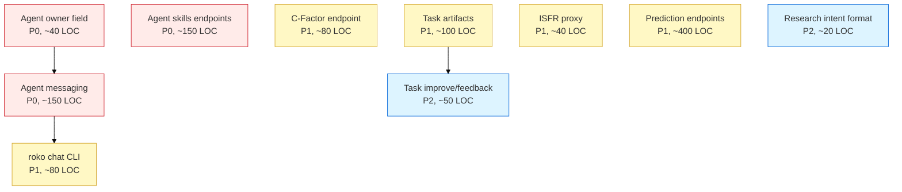
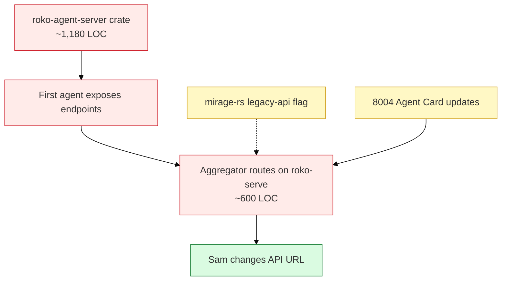
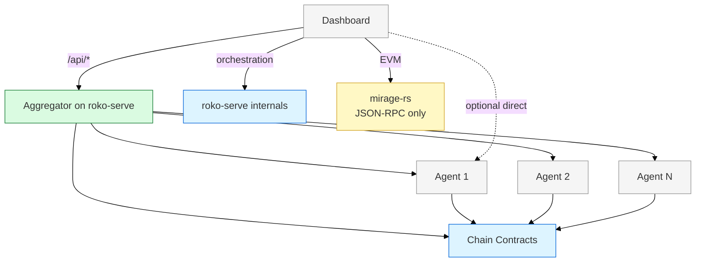
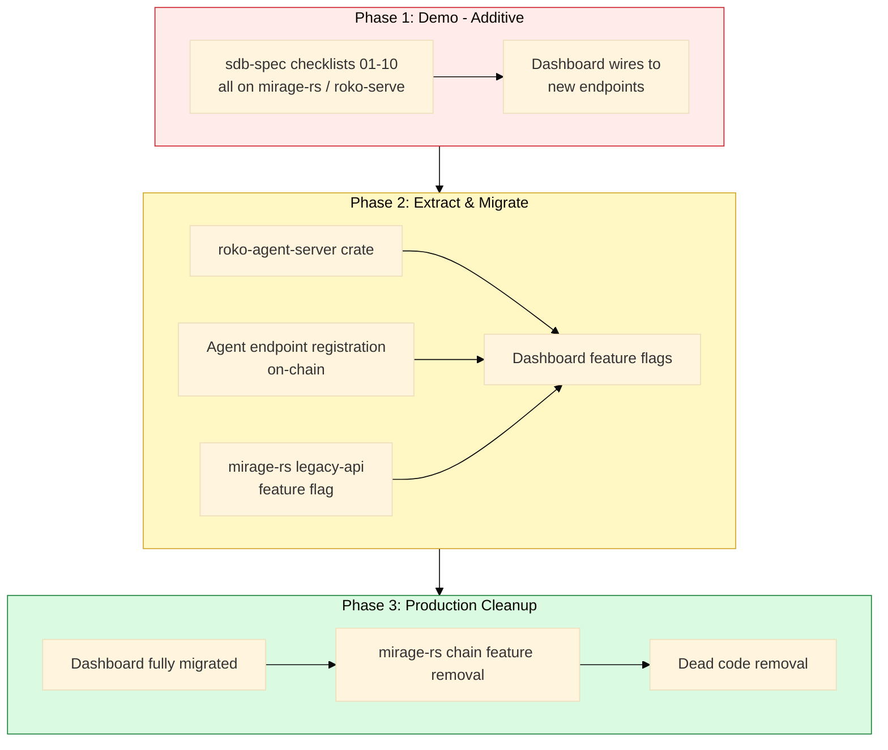

# Build Phases

## Phase 1: Demo (Now to Demo Day)

**Goal**: Ship working demo with current architecture. All changes additive. No extraction.

### Backend Work (roko repo)

| Item | Target Crate | Est. LOC | Priority | Depends On |
|------|-------------|----------|----------|------------|
| Agent owner field | mirage-rs | ~40 | P0 | -- |
| Agent skills endpoints | mirage-rs | ~150 | P0 | -- |
| Agent messaging (extend `/api/run` + WS) | roko-serve + mirage-rs | ~150 | P0 | Agent owner |
| C-Factor endpoint | roko-serve + mirage-rs | ~80 | P1 | -- |
| Task artifacts | mirage-rs | ~100 | P1 | -- |
| ISFR proxy | mirage-rs | ~40 | P1 | -- |
| Prediction endpoints | mirage-rs | ~400 | P1 | -- |
| roko chat CLI | roko-cli | ~80 | P1 | Agent messaging |
| Research intent format | roko-serve | ~20 | P2 | -- |
| Task improve/feedback | mirage-rs | ~50 | P2 | Task artifacts |

**Total Phase 1 Rust**: ~1,110 LOC

**Total Phase 1 dashboard**: Sam wires to new mirage-rs/roko-serve endpoints (existing plan, no architecture changes)

### File Changes

| File | Change |
|------|--------|
| `apps/mirage-rs/src/http_api/agents.rs` | Add owner field, skills CRUD, stats |
| `apps/mirage-rs/src/http_api/tasks.rs` | Add artifacts on completion |
| `apps/mirage-rs/src/http_api/mod.rs` | New routes: predictions, ISFR proxy |
| `apps/mirage-rs/src/http_api/predictions.rs` | **NEW FILE**: Mirofish prediction endpoints |
| `apps/mirage-rs/src/http_api/isfr.rs` | **NEW FILE**: ISFR proxy |
| `crates/roko-serve/src/routes/agents.rs` | Extend messaging, add agent targeting |
| `crates/roko-serve/src/routes/metrics.rs` | C-Factor endpoint |
| `crates/roko-cli/src/commands/chat.rs` | **NEW FILE**: roko chat REPL |
| `crates/roko-serve/src/routes/research.rs` | Add intent parameter |

### Phase 1 Dependency Graph

Red = P0, Yellow = P1, Blue = P2.

---

## Phase 2: Agent Servers + Aggregator (Post-Demo to +4 weeks)

**Goal**: Build per-agent server infrastructure AND aggregator on roko-serve. Dashboard changes one URL.

### New Crate: `roko-agent-server`

| Item | Est. LOC | Priority | Notes |
|------|----------|----------|-------|
| Builder API (bind, auth, route registration) | ~300 | P0 | `AgentServerBuilder::new().skill(...).bind(addr)` |
| Standard routes (`/health`, `/capabilities`) | ~100 | P0 | Every agent exposes these |
| Auth middleware (bearer token) | ~80 | P0 | Token validated against roko-serve |
| Messaging routes (`POST /message`, `WS /stream`) | ~200 | P0 | Core agent interaction |
| Prediction routes | ~150 | P1 | Per-agent prediction endpoints |
| Research routes | ~100 | P1 | Intent-based research requests |
| Task routes (accept, complete) | ~150 | P1 | Agent-side task lifecycle |
| ERC-8004 Agent Card updates | ~100 | P1 | Publish endpoint URL in Agent Card |

**Total new crate**: ~1,180 LOC

### Aggregator on roko-serve

| Item | Est. LOC | Priority | Notes |
|------|----------|----------|-------|
| Agent discovery (8004 registry + ProcessSupervisor) | ~80 | P0 | Know which agents exist and their URLs |
| `/api/agents` (fan-out to per-agent `/capabilities`) | ~60 | P0 | Same shape as mirage-rs response |
| `/api/agents/{id}/stats` (proxy to agent server) | ~40 | P0 | Direct proxy, same shape |
| `/api/predictions/*` (fan-out, merge, paginate) | ~80 | P1 | Merge predictions from N agents |
| `/api/knowledge/*` (InsightBoard contract reads) | ~60 | P1 | Chain reads, cache with TTL |
| `/api/pheromones/*` (chain reads + cache) | ~60 | P1 | Same shape as mirage-rs response |
| `/api/tasks/*` (BountyMarket + roko-serve state) | ~60 | P1 | Merge contract state + orchestration |
| `/api/ws` (WS multiplexer or SSE fallback) | ~100 | P2 | Multiplex N agent streams into one |
| Caching layer (TTL per-route) | ~60 | P0 | 5s health, 10s predictions, 30s agent list |

**Total aggregator**: ~600 LOC in `crates/roko-serve/src/routes/aggregator.rs`

### mirage-rs Extraction

| Item | Action | Est. LOC Change |
|------|--------|----------------|
| Move REST endpoints behind `legacy-api` feature | Wrap in `#[cfg(feature = "legacy-api")]` | ~160 |
| Add `legacy-api` feature flag to `Cargo.toml` | `[features] legacy-api = []`, default on | ~5 |

### Dashboard Changes (Sam)

| Item | Priority | Notes |
|------|----------|-------|
| Change `NEXT_PUBLIC_API_URL` to aggregator | P0 | One env var change. Test that responses match. |
| (Optional) Agent detail page with direct WS | P2 | For real-time per-agent views, can connect directly |

**Sam's Phase 2 effort is minimal** — the aggregator preserves the API shape he already builds against.

### Phase 2 Build Order

Red = critical path, Yellow = parallel track, Green = Sam's work.

---

## Phase 3: Production Cleanup (+4 to +8 weeks)

**Goal**: mirage-rs is pure EVM. All application state on-chain or per-agent.

### Cleanup Items

| Item | Action | Impact |
|------|--------|--------|
| Remove `chain` feature from mirage-rs default | `Cargo.toml` change | Drops chain dependencies |
| Remove `legacy-api` feature | Delete wrapped code | ~2,000 LOC removed |
| Delete `ChainContext` struct | Remove from mirage-rs | ~500 LOC removed |
| Delete `http_api/` module (except `/health`, `/stats` for EVM) | Remove REST API surface | ~2,000 LOC removed |
| Agent discovery fully on-chain | Dashboard reads `AgentRegistry` | No more hardcoded agent URLs |
| Dashboard removes mirage-rs API calls (except EVM) | Frontend cleanup | Simplify API layer |
| roko-serve orchestration only | Remove any agent state shadows | Clean separation |

**Net LOC change in Phase 3**: approximately -4,500 LOC removed from mirage-rs.

### Final Architecture After Phase 3

**mirage-rs endpoints after Phase 3**: 3 total (health, EVM stats, JSON-RPC). Down from ~30.

**Aggregator stays permanently** — it handles cross-agent views (topology, merged predictions, network stats) that no single agent provides.

---

## Cross-Phase Dependency Graph

## LOC Summary Across Phases

| Phase | Added | Removed | Net | Duration |
|-------|-------|---------|-----|----------|
| Phase 1 | ~1,110 | 0 | +1,110 | Now to demo |
| Phase 2 | ~1,945 | 0 | +1,945 | Post-demo +4 weeks |
| Phase 3 | 0 | ~4,500 | -4,500 | +4 to +8 weeks |
| **Total** | **~3,055** | **~4,500** | **-1,445** | ~8 weeks post-demo |

Phase 2 is larger than before (~1,180 agent-server + ~600 aggregator + ~165 extraction) but Sam's migration cost drops to near zero (one URL change). The system still gets smaller overall — Phase 3 removes more than Phases 1+2 add.

## Cross-References

- [00-architecture-overview.md](00-architecture-overview.md) -- system-wide architecture
- [01-agent-server-design.md](01-agent-server-design.md) -- roko-agent-server crate design
- [02-mirage-extraction.md](02-mirage-extraction.md) -- mirage-rs extraction details
- [04-dashboard-migration.md](04-dashboard-migration.md) -- dashboard-specific migration plan
