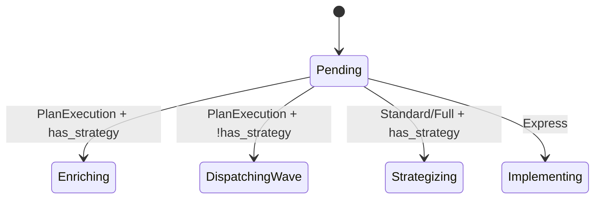

# 05 — PipelineState: Multi-Task Plan Execution + Failure Classifier

> Phase 1.1 + 1.4 of `tmp/workflow/UNIFIED-IMPLEMENTATION-PLAN.md`. Cross-references audit `tmp/workflow/15-orchestration-plan-execution-audit.md`.

---

## Status (2026-05-01)

**PARTIAL.** Single-prompt FSM is solid. Multi-task DAG, plan execution template, failure classifier, replan ladder all missing.

**What's done:**

- `PipelineStateV2` — pure FSM, deterministic `step(input) → output` — `crates/roko-runtime/src/pipeline_state.rs`
- `WorkflowConfig` with Express / Standard / Full presets and TOML loading
- Phases for single-prompt: `Pending`, `Strategizing`, `Implementing`, `AutoFixing`, `Gating`, `Reviewing`, `Committing`, `Complete`, `Halted { reason }`, `Cancelled`
- Inputs: `Start`, `StrategyComplete`, `StrategySkipped`, `AgentCompleted`, `AgentFailed`, `GatesPassed`, `GateFailed`, `ReviewApproved`, `ReviewRejected`, `ReviewUnclear`, `ReviewRevise`, `CommitFinished`, `CommitDone`, `CommitFailed`, `UserCancel`, `ResourceExhausted`
- Outputs: `SpawnStrategist`, `SpawnImplementer`, `SpawnAutoFixer`, `RunGates`, `SpawnReviewer`, `Commit`, `Done`, `Halt`
- Iteration tracking + max_iterations + max_autofix_attempts
- Auto-fix → re-implement loop on gate failures
- Checkpoint/resume support: `PipelineStateV2::checkpoint()` and `from_checkpoint(json)` 

**What's not:**

- `PlanExecution` workflow template (DAG-driven multi-task) — does not exist
- `Enriching`, `Verifying`, `DocRevision`, `Merging` phases — not modeled
- `RunVerifySteps`, `SubmitMerge`, `SpawnScribe` actions — not present
- Failure classifier (orchestrate.rs `gate_failure_next_action` returns one of: NeedsHuman, Blocked, NeedsReplan, AutoFix, Retry) — only in feature-gated orchestrate
- `replan_max_per_plan` cap — exists in `RokoConfig` but not enforced by FSM
- Replan ladder (retry → escalate model → decompose → halt) — only in feature-gated orchestrate
- `step()` returns `PipelineOutput` (single action), not `Vec<PipelineAction>` as in plan
- DAG iteration not modeled at FSM level

---

## Goal

Extend `PipelineStateV2` to:

1. Add a `PlanExecution` template that drives DAG-ordered multi-task execution
2. Add Verifying / DocRevision / Merging phases for full-scope plan runs
3. Implement the failure classifier inside the pure FSM (no I/O)
4. Implement the replan ladder with `replan_max_per_plan` cap
5. Optionally extend `step()` to return `Vec<PipelineOutput>` so a single event can trigger parallel actions (e.g. wave dispatch)

After this, `WorkflowEngine::run_with_cancel` can drive a full multi-task plan to completion using only `PipelineStateV2` + `EffectDriver` + `TaskScheduler` (plan 06) + `PersistenceService` (plan 04). The legacy `runner/event_loop.rs` becomes redundant (deletion handled in plan 12).

---

## Why This Exists (Anti-Patterns Eliminated)

- **#3 Build Another Runtime** — multi-task execution today lives in `runner/event_loop.rs` (3K LOC) and `orchestrate.rs::PlanRunner` (gated). Pulling DAG semantics into the canonical FSM means one engine.
- **#4 Features in Wrong Layer** — failure classification must be in the state machine, not the driver. Today the runner makes those decisions inline.
- **#9 Bolting Multi-Task onto Single-Task** — the audit explicitly warns against this. Solution: a different `WorkflowTemplate` variant with its own (compatible) phase set.

---

## Existing Code — Read These First

```rust
// crates/roko-runtime/src/pipeline_state.rs
impl PipelineStateV2 {
    pub fn new(config: WorkflowConfig, prompt: String) -> Self;
    pub fn step(&mut self, input: PipelineInput) -> PipelineOutput;
    pub fn checkpoint(&self) -> Result<String, ...>;
    pub fn from_checkpoint(json: &str) -> Result<Self, ...>;
    pub fn phase(&self) -> &Phase;
}

pub enum Phase {
    Pending, Strategizing, Implementing, AutoFixing, Gating, Reviewing, Committing,
    Complete, Halted { reason: String }, Cancelled,
}
```

The orchestrate.rs failure classifier (legacy code; do NOT depend on it directly — extract the rules):

```rust
// crates/roko-cli/src/orchestrate.rs:~5200 (legacy)
fn gate_failure_next_action(
    failure: &GateFailure,
    history: &TaskHistory,
    config: &ReplanConfig,
) -> NextAction {
    match classify(failure) {
        FailureClass::RoleToolPermission => NextAction::NeedsHuman(/* explanation */),
        FailureClass::ExternalEnvironment => NextAction::Blocked(/* dep info */),
        FailureClass::ArchitecturalConflict => NextAction::NeedsReplan(/* justification */),
        FailureClass::SimpleCompileError => NextAction::AutoFix,
        FailureClass::TestFailure => NextAction::RetryWithContext,
    }
}
```

---

## Implementation Steps

### Step 1 — Extend `Phase` enum with multi-task phases

```rust
// crates/roko-runtime/src/pipeline_state.rs
#[derive(Debug, Clone, PartialEq, Eq, Serialize, Deserialize)]
pub enum Phase {
    // Existing single-prompt
    Pending,
    Strategizing,
    Implementing { task_id: Option<String> },     // task_id = Some for multi-task
    AutoFixing { task_id: Option<String> },
    Gating { task_id: Option<String>, rung: u8 },
    Reviewing { task_id: Option<String> },
    Committing { task_id: Option<String> },

    // New for plan execution
    Enriching,                                     // strategist phase for whole plan
    DispatchingWave { wave: u32 },                 // multi-task ready set
    Verifying { task_id: String },                 // post-task verify steps
    DocRevision { task_id: String },               // scribe phase
    Merging { plan_id: String },                   // git merge / PR submission
    AwaitingReplan { task_id: String, reason: String },

    Complete,
    Halted { reason: String },
    Cancelled,
}
```

`task_id: Option<String>` keeps existing single-prompt phases backward-compatible (`task_id = None`).

### Step 2 — Extend `PipelineInput` with multi-task events

```rust
pub enum PipelineInput {
    // Existing
    Start, StrategyComplete, StrategySkipped, AgentCompleted, AgentFailed,
    GatesPassed, GateFailed { failure: GateFailureRecord },
    ReviewApproved, ReviewRejected, ReviewUnclear, ReviewRevise,
    CommitFinished { outcome: CommitOutcome }, CommitDone, CommitFailed,
    UserCancel, ResourceExhausted,

    // Multi-task
    EnrichmentDone { brief: String },
    EnrichmentSkipped,
    TaskCompleted { task_id: String, output: TaskOutput },
    TaskFailed { task_id: String, error: TaskError },
    WaveCompleted { wave: u32 },
    VerifyPassed { task_id: String },
    VerifyFailed { task_id: String, failures: Vec<VerifyFailure> },
    DocRevisionDone { task_id: String },
    MergeSucceeded { plan_id: String },
    MergeFailed { plan_id: String, conflict: MergeConflict },

    // Replan flow
    ReplanRequested { task_id: String, reason: String },
    ReplanApproved { task_id: String, new_steps: Vec<TaskStep> },
    ReplanRejected { task_id: String },
}

pub struct GateFailureRecord {
    pub gate_name: String,
    pub rung: u8,
    pub kind: FailureClass,
    pub stderr: String,
    pub stdout: String,
    pub exit_code: Option<i32>,
}
```

### Step 3 — Extend `PipelineOutput` with multi-task actions

Decide: keep `PipelineOutput` as a single action and chain manually, OR make it `Vec<PipelineAction>`.

**Recommendation:** `Vec<PipelineAction>` to support wave dispatch in one step. Prefix the change with a new method to preserve backward compat:

```rust
impl PipelineStateV2 {
    pub fn step(&mut self, input: PipelineInput) -> PipelineOutput;          // legacy single-action
    pub fn step_actions(&mut self, input: PipelineInput) -> Vec<PipelineAction>;  // new
}

pub enum PipelineAction {
    // Legacy single-action variants
    SpawnStrategist, SpawnImplementer, SpawnAutoFixer, SpawnReviewer,
    RunGates, Commit, Done, Halt,

    // Multi-task
    SpawnEnricher { context: PlanContext },
    SpawnImplementerForTask { task_id: String, prompt: PromptSpec },
    SpawnAutoFixerForTask { task_id: String, error_context: GateFailureRecord },
    RunGateForTask { task_id: String, rung: u8 },
    RunVerifyStepsForTask { task_id: String, steps: Vec<VerifyStep> },
    SpawnReviewerForTask { task_id: String, context: ReviewContext },
    SpawnScribeForTask { task_id: String, context: ScribeContext },
    CommitForTask { task_id: String, message: String },
    SubmitMerge { plan_id: String },
    EmitWarning(String),                                       // layer 8 prompt warnings
    NoOp,
}
```

`step()` becomes a thin wrapper: `step_actions(...).into_iter().next().unwrap_or(PipelineOutput::NoOp)`.

### Step 4 — Implement the FailureClassifier inside the FSM

```rust
// crates/roko-runtime/src/failure_classifier.rs
pub struct FailureClassifier {
    history: HashMap<String, TaskFailureHistory>,           // by task_id
    replan_count_per_plan: HashMap<String, u32>,
    config: ReplanConfig,
}

#[derive(Debug, Clone)]
pub struct ReplanConfig {
    pub max_replans_per_plan: u32,         // default 3
    pub max_autofix_per_task: u32,         // default 2
    pub max_iterations_per_task: u32,      // default 3
}

#[derive(Debug, Clone, Serialize, Deserialize)]
pub enum FailureClass {
    RoleToolPermission,        // role tried tool not in allowlist
    ExternalEnvironment,       // network down, missing dep
    ArchitecturalConflict,     // intent ↔ existing code mismatch
    SimpleCompileError,        // syntax / type error
    TestFailure,               // assertion / property test failure
    Unknown,
}

#[derive(Debug, Clone)]
pub enum NextAction {
    AutoFix,
    RetryWithContext { hint: String },
    EscalateModel { from: String, to: Option<String> },     // suggest router pick stronger model
    Decompose { reason: String },                           // break task into smaller subtasks
    NeedsHuman { reason: String },
    Halt { reason: String },
}

impl FailureClassifier {
    pub fn classify(&mut self, failure: &GateFailureRecord, task_id: &str) -> NextAction {
        let hist = self.history.entry(task_id.to_string()).or_default();
        hist.consecutive_failures += 1;
        hist.last_failure = Some(failure.clone());

        // Rule 1: deduplicate identical failures (same hash) → escalate
        let hash = hash_failure(failure);
        if hist.recent_hashes.contains(&hash) {
            hist.recent_hashes.clear();
            return NextAction::EscalateModel { from: hist.last_model.clone(), to: None };
        }
        hist.recent_hashes.push(hash);

        // Rule 2: classify by failure shape
        let class = classify_failure_shape(failure);
        match class {
            FailureClass::RoleToolPermission => NextAction::NeedsHuman {
                reason: "agent attempted denied tool; review role config".into() },
            FailureClass::ExternalEnvironment => NextAction::Halt {
                reason: format!("environment issue: {}", failure.stderr) },
            FailureClass::ArchitecturalConflict => {
                if self.replan_budget_remaining() {
                    self.replan_count_per_plan.entry(plan_id_for(task_id))
                        .and_modify(|c| *c += 1).or_insert(1);
                    NextAction::Decompose { reason: "architectural conflict detected".into() }
                } else {
                    NextAction::Halt { reason: "replan cap reached".into() }
                }
            }
            FailureClass::SimpleCompileError => {
                if hist.consecutive_failures < self.config.max_autofix_per_task {
                    NextAction::AutoFix
                } else {
                    NextAction::EscalateModel { from: hist.last_model.clone(), to: None }
                }
            }
            FailureClass::TestFailure => NextAction::RetryWithContext {
                hint: format!("test failure: {}", failure.stderr) },
            FailureClass::Unknown => NextAction::AutoFix,
        }
    }
}

fn classify_failure_shape(f: &GateFailureRecord) -> FailureClass {
    if f.stderr.contains("permission denied") || f.stderr.contains("not allowed") {
        return FailureClass::RoleToolPermission;
    }
    if f.stderr.contains("Network is unreachable") || f.stderr.contains("connection refused") {
        return FailureClass::ExternalEnvironment;
    }
    if f.stderr.contains("error[E") || f.stderr.contains("expected") {
        return FailureClass::SimpleCompileError;
    }
    if f.stderr.contains("test result: FAILED") || f.stderr.contains("assertion failed") {
        return FailureClass::TestFailure;
    }
    if f.stderr.contains("conflicting") || f.stderr.contains("incompatible") {
        return FailureClass::ArchitecturalConflict;
    }
    FailureClass::Unknown
}
```

The classifier is **pure** (no I/O, no async). It owns history; the state machine queries it on `GateFailed` events.

### Step 5 — Implement `WorkflowTemplate::PlanExecution`

```rust
// crates/roko-runtime/src/pipeline_state.rs
pub enum WorkflowTemplate {
    Express, Standard, Full,
    PlanExecution(PlanExecutionConfig),
}

pub struct PlanExecutionConfig {
    pub max_concurrent_tasks: u32,         // default 1, max 8
    pub task_timeout_secs: u64,
    pub gate_template: GateTemplate,        // which rungs to run per task
    pub merge_strategy: MergeStrategy,      // PullRequest | DirectCommit | Worktree
    pub doc_revision: bool,                 // run scribe after success
    pub replan_max_per_plan: u32,
}
```

The pipeline transitions for `PlanExecution` (from `tmp/workflow/UNIFIED-IMPLEMENTATION-PLAN.md` § 1.1.4):

```
Pending → Enriching → DispatchingWave { wave: 0 }
       ↓                    ↓
       (skip enrich)        for each ready task:
                              SpawnImplementerForTask(task_id)
                            then await all completions
                            on TaskCompleted: RunGateForTask(task_id)
                            on GatePassed: maybe RunVerifyStepsForTask
                            on VerifyPassed: maybe SpawnReviewerForTask
                            on ReviewApproved: maybe SpawnScribeForTask
                            on DocRevisionDone: CommitForTask
                              ↓
                         WaveCompleted → next wave or Merging
                              ↓
                         SubmitMerge → MergeSucceeded → Complete
```

The FSM does not iterate the DAG itself — that's `TaskScheduler`'s job (plan 06). The FSM tracks wave numbers and aggregates per-task completion events.

### Step 6 — Wire `replan_max_per_plan` enforcement

The classifier already tracks per-plan replan count (Step 4). Surface the cap in the `Phase::AwaitingReplan` arm:

```rust
// inside PipelineStateV2::step
PipelineInput::ReplanRequested { task_id, reason } => {
    let next = self.classifier.classify_replan(&task_id, &reason);
    match next {
        NextAction::Decompose { .. } => self.transition_to(Phase::AwaitingReplan { task_id, reason }),
        NextAction::Halt { reason } => self.transition_to(Phase::Halted { reason }),
        _ => unreachable!("classify_replan returns only Decompose or Halt"),
    }
}
```

`AwaitingReplan` is a **passive** phase — the FSM emits no actions; the driver fetches the new sub-tasks (e.g. via a Strategist call) and sends `ReplanApproved { task_id, new_steps }` back.

### Step 7 — Update tests

- Existing single-prompt FSM tests stay green
- Add unit tests for every new `(Phase, PipelineInput)` transition
- Add an `integration_plan_execution` test driving a 5-task DAG (A → B → C, A → D → E) through the FSM with mocked classifier outputs
- Add `failure_classifier_dedups` test: identical `stderr` twice → `EscalateModel` on the 2nd

### Step 8 — Document the FSM diagram

Generate a Mermaid diagram of all phases / transitions and commit it to `crates/roko-runtime/docs/pipeline-state.md`. Without this, the next person reading `pipeline_state.rs` (a ~1200 LOC file after this plan) is lost.



---

## Anti-Patterns To Avoid

| ID | Manifestation | How to avoid |
|---|---|---|
| #4 Features in wrong layer | Putting failure classification in `EffectDriver` | Classifier is pure; FSM owns it |
| #5 Hardcoded role behavior | If/elsing `if config.template == "full" { ... } else { ... }` everywhere | Use `WorkflowTemplate` enum + dispatch table |
| #9 Bolting multi-task onto single-task | Reusing `Phase::Implementing` (no task_id) for plan execution | Use `Phase::Implementing { task_id: Option<String> }` — `None` for single-prompt, `Some(id)` for multi-task |
| #10 God file | `pipeline_state.rs` growing past 2K LOC | Extract `failure_classifier.rs`, `transitions.rs`, `phase.rs` into sibling files |

---

## Things NOT To Do

1. **Don't make `step()` async.** It must remain pure. Async work happens in `EffectDriver::execute(action)`.
2. **Don't put DAG iteration inside `PipelineStateV2`.** It belongs in `TaskScheduler` (plan 06). The FSM only handles per-task and per-wave events.
3. **Don't merge `PlanExecution` and `Full` templates.** They have fundamentally different state. Audit doc 15 § 9 explicitly warns against this.
4. **Don't add 17 features to the failure classifier vector.** Audit recommends 6 features (per `tmp/workflow/UNIFIED-IMPLEMENTATION-PLAN.md` § 2.1.1). Resist scope creep.
5. **Don't classify failures based on `exit_code` alone.** `cargo build` returns 101 for everything. Use `stderr` heuristics.
6. **Don't store the entire `stderr` in `RunStateV2`.** Truncate to first 4KB; full output goes in the per-run JSONL log.
7. **Don't make the replan cap configurable per-task.** Per-plan only — otherwise dependents can replan past the cap by inheriting the budget.
8. **Don't break existing checkpoint files.** Bump `CURRENT_SCHEMA` and write a migration in `roko-runtime/src/pipeline_migrations.rs`. Old checkpoints should either resume cleanly or fail with a clear error.

---

## Tests / Proof Criteria

```bash
# 1. Multi-task phases exist
rg 'Phase::(Enriching|DispatchingWave|Verifying|DocRevision|Merging|AwaitingReplan)' crates/roko-runtime/src/pipeline_state.rs
# expected: 6+ matches

# 2. Failure classifier is pure (no async, no I/O imports)
rg 'use tokio|use std::fs|use std::io|async fn' crates/roko-runtime/src/failure_classifier.rs
# expected: 0 results

# 3. PlanExecution template wired
rg 'WorkflowTemplate::PlanExecution|PlanExecutionConfig' crates/roko-runtime/src/pipeline_state.rs
# expected: enum variant + struct definition

# 4. replan cap enforced
rg 'replan_max_per_plan|replan_count_per_plan' crates/roko-runtime/src/ --type rust
# expected: usage in failure_classifier.rs and pipeline_state.rs
```

Functional proofs:

- [ ] Unit test for every `(Phase, PipelineInput)` transition (~80 cases after this plan)
- [ ] 5-task diamond DAG plan executes via FSM + scheduler in correct order: A → {B, C} → D → E
- [ ] Identical `stderr` twice causes `EscalateModel` on the 2nd
- [ ] Architectural conflict twice in same plan triggers replan; third triggers Halt
- [ ] `replan_max_per_plan = 0` disables replan entirely
- [ ] Old single-prompt checkpoints still resume cleanly after schema bump (migration test)
- [ ] FSM driving a 50-task DAG handles 8-wide concurrency without deadlock

---

## Dependencies

- **Plan 04 (PersistenceService)** — needed to checkpoint mid-plan-execution; without it, a 50-task plan is not crash-safe
- Plan 06 (TaskScheduler integration) is the **consumer** — they need to land together to be useful

---

## Estimated Effort

**XL.** ~2-3 weeks.

- Step 1 (Phase enum extension) — S (1 day)
- Step 2 (PipelineInput extension) — S (1 day)
- Step 3 (PipelineOutput → Vec) — M (2-3 days, lots of callers to update)
- Step 4 (FailureClassifier) — M (3 days, classification rules need tuning)
- Step 5 (PlanExecution template) — L (4-5 days, the biggest chunk)
- Step 6 (replan enforcement) — S (1 day)
- Step 7 (tests) — M (3 days)
- Step 8 (docs/diagram) — S (half day)
