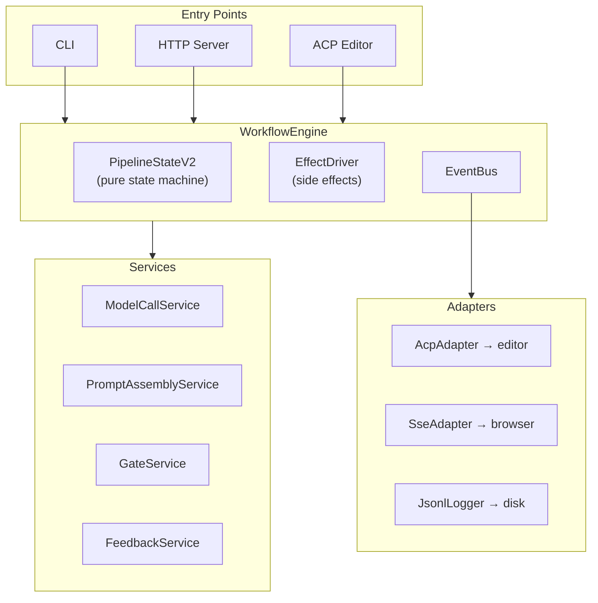

# Branch overview: `wp-arch2` vs `main`

**Purpose of this doc:** Give someone who has never seen this repo a straight-line story of what changed on branch `wp-arch2` relative to `main`, plus ready-to-paste PR text. It is **not** a line-by-line audit.

**PR metadata (locked in):** **Internal** review, **one large merge** (no stacked split), **no ticket IDs** in title/body, **Railway** is how we deploy (see `Dockerfile` / Railway config), **Signal** and **Engram** both appear in code/docs by design during the rename—no need to “pick one” in review comments. **No separate security / threat-model section** in the PR.

**Important:** Your machine may have **local uncommitted changes** on top of `origin/wp-arch2`. The numbers below are from **`main...HEAD`** (committed history). If you open a PR from your local branch without pushing, the GitHub diff may differ from what you see in `git status`.

---

## What is Roko? (30 seconds)

**Roko** is a Rust toolkit for “agents that build themselves”: you point it at a codebase, it composes prompts, dispatches LLM-backed agents, runs compile/test gates, persists results, and learns from outcomes. The mental model is **observe → plan → execute → verify → learn**, on repeat.

If you only read one upstream doc, use the repo root `README.md` (“Quick start” and “How it works”).

---

## How big is this change?

Approximate committed diff vs `main` (one snapshot):

- **~2,050 files** touched  
- **~428k lines** added, **~53k** removed  

That scale usually means: **new subsystems**, **generated or vendored artifacts**, and **parallel apps** (not just a tidy refactor). Treat this as a **platform / architecture** branch, not a single bugfix.

---

## Themes (what actually landed)

### 1. Agent Control Protocol (ACP) integration

A new crate, **`roko-acp`**, implements an **ACP-style JSON-RPC server** (stdio) so external editors and clients can drive Roko through a standard protocol instead of ad hoc wiring. Think: “Roko as a coding agent behind a wire,” similar in spirit to Cursor’s agent client protocol ecosystem.

**Why a newcomer should care:** This is a **new front door** for the product—CLI and in-process paths are no longer the only way to run a session.

### 2. CLI: “v2” runner, dispatch, and developer ergonomics

The CLI continues to move toward a **streaming, event-driven runner** (cancellation, structured output, persistence between tasks) and a shared **`dispatch_v2` / `ModelCallService`** path for provider-neutral dispatch.

**`roko dev`** is aimed at **one-command local stacks** (serve + related processes, sensible teardown). The default “no subcommand” / chat-style flows lean on **`unified`** configuration (optional auto-start of serve, etc.—see `crates/roko-cli/src/unified.rs`).

**Why a newcomer should care:** The **default UX** and **how plans run** are increasingly centered on the runner module tree, not legacy orchestration.

### 3. Agent crate: fail fast, clearer errors, safer tools

- **Provider pre-flight** checks referenced providers **before** expensive work (missing API keys, missing CLI binaries, etc.).  
- **`AgentError`** and related types give **crate-boundary** errors instead of scattering ad hoc strings.  
- **OpenAI-compatible backends** gained more **server-quirk** handling (timeouts, token field names, stream accumulation).  
- **MCP errors** can be **accumulated** and attached to tool-loop output so IDE/ACP sessions can **surface** tool transport failures without dying immediately.  
- **Bash safety** remains a **defense-in-depth** policy layer (length, allow/deny patterns, path hints—not a full shell parser).

**Why a newcomer should care:** Fewer “mystery failures after 30s,” and **operational visibility** for MCP-heavy workflows.

### 4. Core, serve, learn, compose, gate: naming, persistence, and resilience

- **Signal** and **Engram** both show up on purpose: public-facing names lean **Signal**; implementation and comments still say **Engram** in many places (aliases bridge the two). Reviewers should not treat mixed usage as accidental drift unless it confuses operators.  
- **Workspaces** on the server: API routes plus a **JSON registry** under `.roko/` with **atomic writes** and tests that simulate restart.  
- **Demurrage** hooks appear across **knowledge storage** and **background timers** on serve (attention decay over time—Gesell-style semantics in learn/playbook).  
- **Gate/orchestration** layers gained clearer **retry policy** and **error enrichment** (retries are generally **policy upstream**, not hidden inside every gate).  
- **PRD / learn** paths moved toward **atomic writes** where it matters for crash safety.

**Why a newcomer should care:** Long-running server + learning loops get **durable state** and **less silent failure**.

### 5. Reliability and hygiene sweeps

Commit history on this branch includes: **removing blanket `unwrap` in hot paths**, **fixing TOCTOU patterns in file helpers**, **logging instead of swallowing errors**, **MCP stdio lock timeouts**, **async mutex audits**, **retry helper consolidation**, and **Railway/Docker** hardening (multi-stage image, healthchecks, CORS from config).

**Why a newcomer should care:** Production-shaped behavior: **timeouts**, **healthchecks**, and **observability** show up in the diff on purpose.

### 6. Mirage / contracts / relay (adjacent systems)

The diff touches **`apps/mirage-rs`**, **agent-relay**, **contracts broadcast JSON**, and related HTTP/WebSocket surfaces. If you are reviewing only “CLI + agent,” still skim these paths—they explain a chunk of the line count.

---

## Suggested reading order for reviewers

1. `README.md` — product vocabulary and CLI quick start.  
2. `crates/roko-acp/src/lib.rs` (and `handler.rs` / `session.rs` at a skim) — new protocol surface.  
3. `crates/roko-cli/src/runner/mod.rs` + `runner/event_loop.rs` — default execution story.  
4. `crates/roko-cli/src/dispatch_v2.rs` — how dispatches are built.  
5. `crates/roko-agent/src/provider/pre_flight.rs` + `error.rs` — fast failure and error taxonomy.  
6. `crates/roko-serve/src/routes/workspaces.rs` + `state.rs` — workspace registry + persistence.  
7. `Dockerfile` + `docker-compose.dev.yml` — how the stack is expected to run in prod vs dev.

---

## PR text (ready for internal merge)

### Title

**`wp-arch2`: ACP server, runner/dispatch v2 hardening, workspace persistence, and platform reliability**

*(Short alternative: **Platform: ACP + serve workspaces + agent preflight + Docker/Railway**.)*

### Description (copy-paste)

#### Summary

Internal **large platform merge** for Roko: adds **`roko-acp`** (ACP-style **stdio JSON-RPC** server) so external clients can drive sessions alongside the **CLI** and in-process paths; continues **runner + `dispatch_v2`** work for streaming execution and clearer operator UX; hardens **`roko-agent`** (provider preflight, structured errors, MCP error accumulation, OpenAI-compat edge cases, bash policy); improves **`roko-serve`** durability (workspace registry with atomic persistence, demurrage background processing, richer gate/orchestration error handling). **Docker / Railway** layout and **CI** (e.g. **`layer-check`**) are updated for how we actually deploy; **mirage** and **relay** also move—expect a **high line count** (generated artifacts, sidecars), not “every line is equally important.”

#### Why (internal)

- **Multiple entrypoints** without duplicating session logic: CLI, in-process, **ACP-compatible clients**.  
- **Operational clarity:** misconfigured providers fail early; **MCP** issues are visible; fewer swallowed errors in long-running loops.  
- **Durable control plane:** workspaces and learning artifacts survive **restart** without corrupting disk state.  
- **Railway deploy:** multi-service image, **healthchecks**, and config-driven concerns (e.g. CORS) match production layout next to **mirage** and **agent-relay**.

#### What to focus on when reviewing

1. **`crates/roko-acp`** — protocol correctness, session lifecycle, cancellation.  
2. **`crates/roko-cli/src/runner/*` + `dispatch_v2.rs`** — event loop semantics, cancellation, persistence between tasks.  
3. **`crates/roko-agent`** — preflight rules (referenced providers only), `AgentError` mapping, MCP accumulator behavior.  
4. **`crates/roko-serve`** — workspace API + registry persistence + rollback if disk write fails.  
5. **Infra** — `Dockerfile`, `docker-compose.dev.yml`, Railway-related config, `ci.yml` **layer-check** job.

#### Rollout (Railway / config)

- **Deploy path:** **Railway** is canonical; smoke the **Docker** image and **healthchecks** after merge.  
- **Naming:** **Signal** and **Engram** both appear intentionally (aliases + gradual rename); mixed usage is expected unless it breaks operators or docs.  
- **Config:** Reconcile **`roko.toml`** / serve settings with staging/prod (CORS, workspace GC, provider readiness, any new fields).

#### Test plan

- [ ] `cargo test -p roko-acp` (or workspace equivalent)  
- [ ] `cargo test -p roko-cli` + spot-check `roko dev` / `roko plan run` on a sample repo  
- [ ] `cargo test -p roko-agent`  
- [ ] `cargo test -p roko-serve` (including new persistence tests if present on the pushed branch)  
- [ ] Docker: `docker build` and smoke **healthchecks**  
- [ ] CI: confirm **`layer-check`** passes on clean checkout  

---


---

## Live snapshot from GitHub API

Fetched with `gh pr view 53 --repo Nunchi-trade/roko` on **2026-05-05** (authoritative for what GitHub shows on the PR page right now). Local `git` counts below may differ if your branch has diverged from `origin/wp-arch2`.

**PR:** https://github.com/Nunchi-trade/roko/pull/53

```json
{
  "additions": 399556,
  "changedFiles": 1948,
  "deletions": 51918,
  "state": "OPEN",
  "title": "Architecture v2: Unified workflow engine, ACP protocol, trustworthy runtime, and full demo dashboard",
  "updatedAt": "2026-05-04T19:52:46Z",
  "url": "https://github.com/Nunchi-trade/roko/pull/53",
  "commits_returned_by_api": 100
}
```

> The GitHub UI also shows a longer description than many PRs; the next section is a **verbatim copy** of that description (including mermaid, tables, and update logs).

---

## Verbatim: GitHub PR #53 description (full text from API)

## What is Roko?

Roko is a Rust toolkit for building **agents that build themselves**. It reads PRDs (product requirement documents), generates implementation plans, dispatches AI agents to execute tasks, validates results through a verification pipeline, persists learnings, and iterates. The entire system is designed to self-host — Roko develops Roko.

This PR replaces the previous monolithic execution path with a composable, testable runtime architecture, adds editor integration via the ACP protocol, ships a React demo dashboard, restructures all documentation, and brings the system to full self-hosting readiness.

**492+ commits | 815+ files changed | 180K+ insertions | 44K deletions | 18 crates touched**

---

## How Roko works (the 30-second version)


For each task, Roko builds a 9-layer system prompt (with knowledge + playbooks), dispatches it to an AI model (Claude, GPT, Gemini, Ollama, etc.), validates the output through a 7-rung gate pipeline (compile → lint → test → ... → integration), and persists learnings (episodes, playbooks, knowledge store). If gates fail, it replans and retries.

---

## What this PR changes

This is a large PR that touches every layer of the system. Here's a map of the major change areas:

| Area | What changed | Why it matters |
|---|---|---|
| [Runtime Architecture](#runtime-architecture) | New WorkflowEngine replaces monolithic orchestrate.rs | Testable, composable, observable execution |
| [ACP Protocol Server](#acp-protocol-server) | New crate for editor integration | VS Code, Zed, Neovim can drive Roko |
| [Agent Subsystem](#agent-subsystem) | New provider, safety hardening, session reuse | More models, safer execution, faster dispatch |
| [Verification Pipeline](#verification-pipeline) | Gate improvements, error memory, forensics | More reliable self-validation |
| [Learning System](#learning-system) | Contextual bandits, knowledge admission, feedback loops | System improves with use |
| [Demo Dashboard](#demo-dashboard) | 15-page React app with real-time visualization | See what Roko is doing, live |
| [Documentation](#documentation-restructuring) | 3-layer docs architecture, 5 integration guides | Actually understandable now |
| [Codebase Refactoring](#codebase-refactoring) | Decomposed mega-files, modularized config | Maintainable, navigable code |

---

## Runtime Architecture

### The problem

Previously, all execution logic lived in a single 12,000+ line file (`orchestrate.rs`). Agent dispatch, gate running, prompt assembly, feedback recording, and state management were all interleaved. This made it nearly impossible to test individual pieces, add new execution modes, or reason about state transitions.

### The solution: WorkflowEngine

The new architecture separates concerns into four layers:



**Why this design?** The key insight is separating `PipelineStateV2` (a pure state machine that takes events and returns actions) from `EffectDriver` (which actually spawns agents, runs gates, etc.). This means you can test the entire state machine by feeding it synthetic events — no real agents, no real LLM calls. The same engine powers CLI, HTTP server, and editor integrations with zero code duplication.

<details>
<summary><strong>Foundation Layer details (P0A–P0C)</strong></summary>

The contract system that all subsystems implement against:

- **RuntimeEvent** — 14-variant enum covering lifecycle, agent, gate, feedback, and persistence events. Each event is wrapped in a `RuntimeEventEnvelope` carrying `run_id`, sequence number, timestamp, and schema version for forward compatibility.
- **6 foundation traits** — `ModelCaller` (call an AI model), `PromptAssembler` (build a system prompt), `FeedbackSink` (record outcomes), `GateRunner` (run verification), `EventConsumer` (react to events), `EffectExecutor` (perform side effects) — plus `AffectPolicy` for behavioral modulation.
- **EventBus** — Generic typed event bus via `OnceLock<Mutex<HashMap<TypeId, ...>>>` supporting multiple event types through single infrastructure.

</details>

<details>
<summary><strong>Service Layer details (P1A–P1D, S01–S13)</strong></summary>

Concrete implementations of foundation traits, wiring existing subsystem code into the new contract system.

**ModelCallService (~2.1K LOC)** wraps provider dispatch with a 9-cell pipeline:
1. Cache (L1 exact-match, 128 entries)
2. Budget (per-service token tracking)
3. Thinking cap (reasoning token limits)
4. Convergence detection (5-window, 0.85 similarity — stops when agent is repeating itself)
5. Provider call (actual LLM invocation)
6. Gateway event writer (durable JSONL log)
7. Knowledge query (inject relevant knowledge into context)
8. Force-backend override learning for cascade router
9. Knowledge-informed routing via trait-erased adapter

**PromptAssemblyService (~1.4K LOC)** wraps the 9-layer `SystemPromptBuilder`:
- Composable `ContextSource` trait for neuro/knowledge, episodes, and playbooks
- Section effectiveness scoring for future A/B tuning
- Tracks which prompt sections and knowledge IDs contributed to each dispatch

**FeedbackService (~1.2K LOC)** records ModelCall, GateResult, and WorkflowComplete events to JSONL, feeds the cascade router's bandit observations, and tracks provider/model pass rates.

**GateService (~1.1K LOC)** runs the 7-rung verification pipeline with adaptive thresholds (EMA-smoothed per-rung from `.roko/learn/gate-thresholds.json`).

</details>

<details>
<summary><strong>Engine Layer details (E01–E08, P2A–P2D)</strong></summary>

**PipelineStateV2 (~1.1K LOC)** — Pure state machine:
- 3 workflow templates: **Express** (implement→gate→commit), **Standard** (+review), **Full** (+strategy planning)
- 10 phases: Pending → Strategizing → Implementing → Gating → AutoFixing → Reviewing → Committing → Complete/Halted/Cancelled
- Config-driven iteration limits and autofix attempts
- Checkpoint serialization + resume from JSON (survive crashes)

**TaskScheduler (378 LOC)** — Pure DAG resolver with file-based conflict detection. Prevents two agents from modifying the same files concurrently.

**EffectDriver (~860 LOC)** — Executes the actions that `PipelineStateV2` requests: SpawnAgent, RunGates, Commit, Checkpoint. Integrates with `AffectPolicy` to modulate agent behavior (temperature, turn limits, exploration rate). Emits RuntimeEvents so observers can track progress.

**WorkflowEngine (~1.7K LOC)** — The facade that ties it all together. Its `run()` method is the single entry point used by CLI, server, and ACP. Returns a `WorkflowRunReport` with outcomes, gate results, token counts, and cost.

</details>

<details>
<summary><strong>Adapter Layer details (P3A–P3C)</strong></summary>

- **AcpAdapter** (196 LOC) — Translates RuntimeEvents into CognitiveEvents for the ACP editor protocol. Filters by run_id.
- **SseAdapter** (198 LOC) — Streams RuntimeEvents to connected browser clients via Server-Sent Events.
- **JsonlLogger** (139 LOC) + **RuntimeProjection** (179 LOC) — Durable event persistence to `.roko/events.jsonl` + state reconstruction from the event log.

</details>

<details>
<summary><strong>Wiring Layer details (P4A–P4B, W01–W08)</strong></summary>

- CLI: `--engine v2/legacy` flag, WorkflowEngine as default for `roko run` and `plan run`
- Server: SSE + StateHub integration, background task event consumers
- ACP: `run_with_workflow_engine()` uses the same ServiceFactory as CLI/server — zero duplication

</details>

---

## ACP Protocol Server

### What is ACP?

ACP (Agent Client Protocol) is how editors talk to Roko. Think of it like LSP (Language Server Protocol), but for AI agents instead of language analysis. When you run `roko acp`, it starts a JSON-RPC 2.0 server on stdin/stdout. Your editor sends prompts and receives streaming cognitive events — token chunks, tool calls, gate results, plan updates, and cost tracking.

### Why does this matter?

Without ACP, Roko only runs from the command line. With ACP, any editor (VS Code, Zed, Neovim, JetBrains) can drive the full Roko pipeline — same WorkflowEngine, same gates, same learning, same knowledge store. The editor becomes a thin UI over Roko's capabilities.

<details>
<summary><strong>ACP implementation details (~9.7K LOC, new crate)</strong></summary>

- **Transport**: Newline-delimited JSON over stdin/stdout (async tokio)
- **Sessions**: Multi-session support with conversation history (40 turns, 64KB limit), mode switching (code/plan/research), per-session config (model, workflow, routing, gates)
- **Dispatch**: Pipeline path (Express/Standard/Full templates) and single-agent path
- **Events**: `CognitiveEvent` stream — TokenChunk, ThinkingChunk, ToolCallStart/Complete, PlanUpdate, CostUpdate, Complete
- **Knowledge**: Dual async queries (neuro store + playbook store) with visible knowledge cards
- **Convergence**: Same WorkflowEngine, ServiceFactory, and FeedbackService as CLI/server
- **Persistence**: Session snapshots in `.roko/acp/sessions/{session_id}/`

**Methods:**

| Method | Description |
|---|---|
| `initialize` | Handshake with capability exchange, protocol version negotiation |
| `session/new` | Create session with mode (code/plan/research) + model config |
| `session/message` | Send prompt, receive streaming CognitiveEvent notifications |
| `session/configure` | Update session settings (model, gates, workflow template) |
| `session/close` | End session, flush episodes, persist state |
| `session/set_config_option` | Per-option update (9 option IDs with type-safe values) |
| `$/cancelRequest` | Cancel in-flight operation via CancellationToken |

**CognitiveEvent variants:**

| Variant | When it fires |
|---|---|
| `TokenChunk` | Each streaming token from the agent |
| `ThinkingChunk` | Extended thinking / reasoning content |
| `ToolCallStart` | Agent begins a tool invocation |
| `ToolCallComplete` | Tool finishes, includes file changes |
| `PlanUpdate` | Phase transitions or strategy changes |
| `CostUpdate` | Per-turn usage delta (tokens + cost) |
| `Complete` | Session message fully processed |

```bash
# Start ACP server (editor integration)
roko acp

# With explicit model
roko acp --model claude-sonnet-4-20250514
```

Full protocol reference: [`docs/v2/ACP-INTEGRATION-GUIDE.md`](https://github.com/Nunchi-trade/roko/blob/wp-arch2/docs/v2/ACP-INTEGRATION-GUIDE.md) (2,177 lines)

</details>

---

## Agent Subsystem

### What agents do

Agents are the workers that execute tasks. When Roko needs to implement a feature, fix a bug, or write a test, it dispatches an agent — an LLM session with tools, a system prompt, safety constraints, and a verification pipeline. This PR adds new providers, hardens safety, and makes agent dispatch smarter.

<details>
<summary><strong>Agent changes in detail</strong></summary>

- **Cerebras adapter** (194 LOC): OpenAI-compatible with strict tool schemas for constrained decoding
- **ModelCallService** (2.1K LOC): Central orchestration with 9 cells (cache, budget, thinking cap, convergence, provider, gateway, knowledge)
- **Safety hardening**: `ContractLoadMode` (Strict/RestrictedFallback), capability intersection enforcement, 4 new role contracts (architect, auditor, auto-fixer, scribe)
- **Gateway events** (368 LOC): Durable JSONL log with projection queries — every model call is recorded with latency, tokens, cost, and outcome
- **Session reuse** (343 LOC): `WarmReusePolicy` with scope binding, fingerprinting, context carryover control — avoid cold-starting agents for related tasks
- **Runtime events** (219 LOC): Provider-neutral `AgentRuntimeEvent` enum decouples agent lifecycle from specific LLM providers
- **Claude CLI streaming**: Usage extraction from stream-json output, model tagging on failures for better diagnostics

</details>

---

## Verification Pipeline

### What gates do

Gates are Roko's quality assurance system — think of them as **CI/CD for AI output**. After an agent produces code changes, the gate pipeline checks them: Does it compile? Does it pass clippy? Do the tests pass? Does the diff look reasonable? Is there a security issue? If any gate fails, Roko can automatically retry with the failure context, replan the task, or halt and ask for human review.

<details>
<summary><strong>Gate pipeline details</strong></summary>

**7-rung pipeline** (increasing cost and complexity):

| Rung | What it checks | Gates |
|---|---|---|
| 0: Compile | Does the code build? | `CompileGate` |
| 1: Lint | Any clippy warnings? | `ClippyGate` |
| 2: Test | Do tests pass? | `TestGate` |
| 3: Symbol | Are symbols correctly defined? | `SymbolGate` |
| 4: Generated Test | Do generated tests pass? | `GeneratedTestGate` + `VerifyChainGate` |
| 5: Property | Do property tests hold? | `PropertyTestGate` + `FactCheckGate` |
| 6: Integration | Does it work end-to-end? | `LlmJudgeGate` + `IntegrationGate` |

**Standalone gates**: DiffGate, CodeExecutionGate, ShellGate, BenchmarkRegressionGate, FormatCheckGate, SecurityScanGate

**Composition wrappers**: ParallelGate (run multiple gates concurrently), VotingGate (majority vote), FallbackGate (try in order)

**Adaptive thresholds**: Each rung's pass/fail threshold adjusts over time using exponential moving averages, so the system learns what "normal" looks like for your codebase.

</details>

---

## Learning System

### How Roko gets smarter over time

Every task execution generates data: which model was used, how many tokens it took, whether gates passed, what errors occurred, and what the final outcome was. Roko's learning system uses this data to make better decisions on future tasks.

<details>
<summary><strong>Learning subsystem details</strong></summary>

**Trustworthy Series (RT00–RT23, 24 commits)** — Hardened self-hosting contracts and learnable decision infrastructure:

- **AcceptanceContract** — typed contract with fail-closed semantics. Every task must pass an explicit acceptance check before being marked complete.
- **Error memory** — compile error classification + pre-agent `cargo fix`. Gate failures are shared across agents via `ErrorPatternStore` so the same mistake isn't repeated.
- **Post-gate reflection** — after gates run, `PostGateReflectionRecord` captures lessons and queues them for the learning layer.
- **A-MAC knowledge admission** — new knowledge must pass Accuracy, Model, Audit, and Confidence heuristics before entering the durable store.
- **Manifest-backed roles** — TOML-driven `RolePolicyManifest` with 6 built-in roles (strategist, implementer, architect, auditor, quick-reviewer, scribe), each with tool permissions and context policies.
- **Contextual bandits** — epsilon-greedy bandit for provider/model/context/reviewer selection. The system learns which model works best for which task type.
- **Complete self-hosting loop**: plan → dispatch → gate → reflection → admission → bandit update → replan

</details>

<details>
<summary><strong>Converge Series (83 commits) — unifying 12 subsystems</strong></summary>

This series brought all existing subsystems into the v2 pipeline:

- **Foundation (F01–F06)**: Inverted crate dependency (roko-core no longer depends on roko-runtime). All subsystems now use shared trait definitions.
- **Gateway (G01–G09)**: All model calls route through ModelCallService with caching, budgeting, convergence detection, and durable logging.
- **Knowledge (K01–K05)**: Knowledge-aware routing in CascadeRouter. Knowledge injection into prompt assembly. Confidence updates after task completion.
- **Daimon (D01–D04)**: AffectPolicy trait for behavioral modulation — the system adjusts agent parameters (temperature, turn limits, exploration rate) based on recent success/failure patterns.
- **Output/CLI (O01–O06, C01–C12)**: Clack-style progress printer, `--share` flag for shareable transcripts, dashboard SPA pages.
- **Layer Enforcement (L01–L04)**: Layer metadata in all 30 Cargo.toml files, `layer-check` binary validates dependency graph, CI enforcement.

</details>

<details>
<summary><strong>Converge-Followup Series (32 commits) — production hardening</strong></summary>

Six tracks of hardening:

- **A-track**: Typed RuntimeEvent envelopes with schema versioning, contract guard tests
- **B-track**: Real agent lifecycle events, affect modulation on model requests, typed gate config, checkpoint/resume correctness, workflow completion feedback
- **C-track**: Shared ServiceFactory for CLI/server/ACP, complete ModelCallService pipeline, gateway durability, prompt assembly live context, feedback/knowledge provenance
- **D-track**: WorkflowRunReport as first-class report type, `--share` parity on v2, plan execution on v2, server workflow execution, ACP session convergence
- **E-track**: Legacy feature boundary, feature-gated direct dispatch, deleted old prompt builders and duplicate parsers
- **F-track**: 6 integration tests (default run, share, resume, gateway, knowledge loop) + architecture negative CI checks

</details>

<details>
<summary><strong>Mega-Parity Series (98 commits across 7 rounds + D8)</strong></summary>

**R2: Config, Gates, Learning (25 commits)**
- `EffectiveModelSelection` module wiring model selection across all CLI paths
- Shell gate wiring, gate config program/args passthrough, skipped/not_wired verdicts
- `plan run --fresh` for state reset, `plan validate` mandatory before `plan run`

**R3: Chat Agent Sessions (9 commits)**
- `ChatAgentSession` with system prompt, tool policy, and MCP config resolution
- `send_turn` via ClaudeCliAgent with session_id capture and tool output display

**R4: Repository Context (9 commits)**
- `RepoContextPack`: workspace members, project kind, key files, symbol matches, related PRDs/plans
- Context pack injection into `prd draft new` — PRDs are now grounded in actual codebase structure

**R5: ACP Episodes & Usage (7 commits)**
- Claude CLI stream-json usage extraction (input_tokens, output_tokens, cost)
- ACP episode logging with begin_turn/end_turn/close hooks
- Knowledge store query + knowledge card emission at dispatch time

**R6: Security (3 commits)**
- Terminal routes gated behind auth/flag
- Share output scrubbing + share expiration

**R7: Dashboard & UX (9 commits)**
- `roko init --demo` seeds realistic data
- Phase badge emission, narrative text between phases
- Forensic gate failure analysis with causal chain + episode cross-reference

**D8: Demo & Benchmarking (36 commits)**
- 7 dashboard visualization components
- 5 demo scenarios (multi-provider race, knowledge accumulation, dream consolidation, gate failure retry, enhanced PRD pipeline)
- Real bench execution end-to-end with model comparison matrix
- Playbook extraction from successful episodes, anti-pattern extraction from gate failures

</details>

---

## Runtime, Conductor, Knowledge, Dreams, Affect

These are the subsystems that give Roko its "intelligence" — they're what make it more than a simple script runner.

<details>
<summary><strong>roko-runtime (+5.5K LOC) — execution engine</strong></summary>

WorkflowEngine + PipelineStateV2 + EffectDriver + TaskScheduler. Enhanced EventBus for cross-subsystem communication, ProcessSupervisor for agent lifecycle management, JsonlLogger for durable event streams, RuntimeProjection for state reconstruction.

</details>

<details>
<summary><strong>roko-conductor (+986 LOC) — reactive intelligence</strong></summary>

The conductor watches agent execution and intervenes when things go wrong. It uses 12 stuck detection heuristics: OutputLoop (agent repeating itself), NoProgress (no meaningful changes), GateLoop (same gate failing repeatedly), CompileLoop (compile→fix→compile cycle), EmptyOutput, ExcessiveRetries, ReviewLoop, IterationLoop, SilenceTimeout, CompileFailThreshold, TaskStall, ContextPressure. Plus provider health tracking, threshold learning, and compound pattern detection.

</details>

<details>
<summary><strong>roko-neuro (+3.9K LOC) — durable knowledge store</strong></summary>

Think of this as Roko's long-term memory. It stores insights, patterns, and lessons learned from past executions:
- Append-only knowledge store with confirmation/conflict tracking
- Two-stage admission: light gate (fast path) + evidence-based pipeline (A-MAC — Accuracy, Model, Audit, Confidence)
- Three-stage distillation: raw episodes → insights (D1) → heuristics (D2) → playbook patterns (D3)
- Knowledge decays over time (like human memory) — entries that aren't reinforced eventually expire

</details>

<details>
<summary><strong>roko-dreams (+743 LOC) — offline consolidation</strong></summary>

Like sleeping on a problem — offline processing that compresses and connects knowledge. Dream cycles run when the system is idle, consolidating recent episodes into durable insights and identifying patterns across tasks.

</details>

<details>
<summary><strong>roko-daimon (+116 LOC) — affect engine</strong></summary>

An emotional thermostat for agent behavior. The DaimonPolicy tracks recent success/failure patterns and adjusts dispatch parameters: after repeated failures, it increases exploration (try different models), reduces temperature (be more conservative), and shortens turn limits (fail fast). After successes, it does the opposite.

</details>

---

## Demo Dashboard

### What it is

A 15-page React application that visualizes everything Roko is doing in real-time. It connects to the HTTP control plane via SSE/WebSocket and renders live dashboards for costs, agent activity, gate results, knowledge graphs, dream cycles, and model routing.

<details>
<summary><strong>Dashboard details (React 19 + TypeScript)</strong></summary>

**Pages (15):**
Landing, Demo, Terminal, Builder, Explorer, Bench (+ RunDetail, Compare, Showroom), Share, Dashboard (Cost, AgentFleet, KnowledgeGraph, KnowledgeEntries, ChainView, DreamsView, CascadeRouter)

**Components (60+):**
GateBar, GateWaterfall (canvas), CFactorSparkline, CostChart, ParetoChart, CostRace, HeroScene (WebGL particles), WorkflowConstellation, DreamPhaseViz, TerminalPane/Grid, and many more

**Hooks (13):**
useApiWithFallback, useSSE, useServerHealth, useBench, useTerminal, useChain, useKnowledge, useDashboard, useDemoMode, useAgents

**Design System: Rosedust**
- Color palette: void backgrounds, rose spectrum (7 tones), bone spectrum (4 tones), dream/warning/success accents
- Typography: General Sans (primary), Instrument Serif (prose), JetBrains Mono (code), Fraunces (display)
- Glass morphism borders, ambient gradient animation

</details>

---

## Documentation Restructuring

### The problem

Documentation was scattered across 417 files in `docs/` with no clear hierarchy, plus temporary files in `tmp/unified/` and `tmp/unified-depth/`. Source code referenced paths that no longer existed.

### The solution: three layers

| Layer | Path | Files | Who it's for |
|---|---|---|---|
| **v1 (Legacy)** | `docs/v1/` | 417 | Historical reference — original per-system deep specs |
| **v2 (Spec)** | `docs/v2/` | 33 | Developers learning the system — vocabulary, protocols, contracts |
| **v2-depth** | `docs/v2-depth/` | 180 | Developers implementing a subsystem — algorithms, research, domain patterns |

**v2 Spec Layer** defines the entire system through 3 universal primitives (Signal, Cell, Graph) + 9 protocols (Store, Score, Verify, Route, Compose, React, Observe, Connect, Trigger) + 10 specializations.

<details>
<summary><strong>v2 Spec files (28 documents)</strong></summary>

| File | Covers |
|---|---|
| `00-INDEX.md` | Vocabulary, principles, concept migration table |
| `01-SIGNAL.md` | Signal as universal datum |
| `02-CELL.md` | Cell + 9 protocols |
| `03-GRAPH.md` | Graph as universal composition |
| `04-EXECUTION.md` | Execution model (Flow, Rack, Loop) |
| `05-AGENT.md` | Agent as Cell specialization |
| `06-MEMORY.md` | Memory as Store-protocol Cell + decay |
| `07-VERIFY.md` | Verification pipeline (7 rungs) |
| `08-OBSERVE.md` | Observability (Lens, telemetry) |
| `09-LEARN.md` | Learning loops (L1–L4) |
| `10-ORCHESTRATE.md` | Orchestration and scheduling |
| `11-CONNECTIVITY.md` | External I/O (Connect protocol) |
| `12-AFFECT.md` | Behavioral modulation |
| `13-SAFETY.md` | Safety contracts and policies |
| ... | Plus config, deployment, chain, economy, roadmap |

</details>

<details>
<summary><strong>v2-depth layer structure</strong></summary>

Each numbered directory corresponds 1:1 to its spec file:

```
docs/v2-depth/
  GUIDE.md                 → How to use and extend depth docs
  INDEX.md                 → Master index with v1 mapping table
  INGEST-PROMPT.md         → Prompt for ingesting new depth content
  00-index/                → Vision, principles, naming
  01-signal/               → Engram internals, decay math, HDC vectors
  02-block/                → Composition, tools, verification
  03-graph/                → DAG execution, scheduling algorithms
  ...
  21-roadmap/              → Implementation timeline and priorities
```

</details>

<details>
<summary><strong>Vocabulary migration table</strong></summary>

| New (v2) | Old (v1) | What it is |
|---|---|---|
| Signal | Engram, Artifact, Knowledge Entry, Pheromone | The universal data unit — content-addressed, decaying, scored |
| Block/Cell | Module, Recipe stage | The universal computation unit |
| Graph | Workflow, StateGraph, Recipe pipeline | The universal composition |
| Flow | Workflow execution, Run | A Graph executing at runtime |
| Rack | Parameterized Workflow | Graph + Macros + Slots |
| Lens | Monitor, Watcher, Probe | An observation-only Block |
| Loop | Feedback cycle, DreamCycle | A Graph with a feedback edge |
| Memory | Knowledge store, Grimoire | A Store-protocol Block + decay |
| Space | Workspace, Environment | An isolation boundary |

</details>

### Integration Guides (5 comprehensive references, ~12,500 lines total)

These are standalone documents written for first-time readers, with progressive disclosure (quick start → concepts → reference → advanced), collapsible sections, ASCII diagrams, and analogies for complex concepts:

| Guide | Lines | Collapsible sections | What it covers |
|---|---|---|---|
| [`ARCHITECTURE-GUIDE.md`](https://github.com/Nunchi-trade/roko/blob/wp-arch2/docs/v2/ARCHITECTURE-GUIDE.md) | 2,766 | 63 | The mental model (1 noun + 9 verbs), every protocol trait with Rust signatures, WorkflowEngine state machine, CascadeRouter model selection, DaimonPolicy affect engine, knowledge store, dream cycles, 4 data flow diagrams |
| [`INTEGRATION-GUIDE.md`](https://github.com/Nunchi-trade/roko/blob/wp-arch2/docs/v2/INTEGRATION-GUIDE.md) | 2,683 | 45 | Complete roko.toml schema (~30 sections), .roko/ directory layout, provider recipes for 7 backends, gate/learning/routing config, event subscriptions, deployment (Railway/Fly/Docker) |
| [`API-REFERENCE.md`](https://github.com/Nunchi-trade/roko/blob/wp-arch2/docs/v2/API-REFERENCE.md) | 2,514 | 56 | Every HTTP route with path/method/handler, SSE/WebSocket endpoints, auth chain, StateHub push pattern, per-agent sidecar API, curl examples |
| [`CLI-REFERENCE.md`](https://github.com/Nunchi-trade/roko/blob/wp-arch2/docs/v2/CLI-REFERENCE.md) | 2,326 | 28 | Every subcommand from clap structs, env vars, exit codes, TUI tabs + keybindings, self-hosting workflow, research provider cascade |
| [`ACP-INTEGRATION-GUIDE.md`](https://github.com/Nunchi-trade/roko/blob/wp-arch2/docs/v2/ACP-INTEGRATION-GUIDE.md) | 2,177 | 35 | JSON-RPC methods, CognitiveEvent variants, PipelinePhase state machine, session lifecycle, knowledge integration, episode logging |

<details>
<summary><strong>Source code reference fixes</strong></summary>

All source code references updated to new paths:
- `crates/roko-core/src/feed.rs`: `tmp/unified/12-CONNECTIVITY.md` → `docs/v2/11-CONNECTIVITY.md`
- `crates/roko-core/src/connector.rs`: `tmp/unified/12-CONNECTIVITY.md` → `docs/v2/11-CONNECTIVITY.md`
- `crates/roko-chain/src/tools.rs`: `docs/18-tools/` → `docs/v1/18-tools/`
- `crates/roko-gate/src/lib.rs`: `docs/04-verification` → `docs/v1/04-verification`
- `docs/v2-depth/GUIDE.md`: All `tmp/unified/` → `docs/v2/`, `tmp/unified-depth/` → `docs/v2-depth/`
- `docs/v2-depth/INGEST-PROMPT.md`: All path references updated

</details>

---

## Codebase Refactoring

### What changed and why

Several mega-files had grown to the point where they were hard to navigate and impossible to review. This PR breaks them into focused modules.

<details>
<summary><strong>Decomposition details</strong></summary>

**CLI Decomposition**
- `main.rs` reduced from 12,814 → ~2,000 lines
- 16 focused command modules: plan, prd, agent, research, config, knowledge, learn, job, server, dashboard, bench, auth, init, status, util

**Core Config Modularization**
- `schema.rs` reduced from 6,061 → 929 lines
- 12 focused config modules: agent, provider, gates, learning, routing, serve, budget, subscriptions, tools, chain, project, tui

**Orchestrate.rs Helpers**
- Extracted dispatch_helpers (773 LOC), knowledge_helpers (606 LOC), learning_helpers (549 LOC), gate_runner (249 LOC), task_helpers (737 LOC), model_selection (553 LOC), prompt_helpers (593 LOC)

**Cascade Router Modularization**
- Reduced from 5,197 → 2,034 lines with types, helpers, persistence, tests submodules

**Route Splitting**
- status.rs (2,490 → 620 lines) split into health, metrics, episodes, gates, dashboard, helpers
- learning.rs (1,885 → 805 lines) split into router_state, experiments, helpers

**Protocol Trait Renaming**
- Substrate→Store, Scorer→Score, Gate→Verify, Router→Route, Composer→Compose, Policy→React
- New Cell supertrait for universal computation unit identity

</details>

---

## Standalone Features

<details>
<summary><strong>Chat REPL, Vision Loop, Sharing, and more</strong></summary>

- **Chat REPL** (`chat_inline.rs`, 4.5K LOC): Claude Code-like inline ratatui UI with 20+ slash commands, streaming display, cost tracking
- **Vision loop** (`vision_loop/`, 1.3K LOC): Screenshot → vision model → code gen → HMR iteration loop
- **Shareable transcripts**: `--share` flag generates GitHub Gist or local file with scrubbed output
- **Repository context packs**: Workspace structure, symbols, related PRDs injected into PRD generation
- **Demo seeding**: `roko init --demo` creates realistic data (episodes, playbooks, efficiency events, knowledge) for exploring the dashboard
- **Runner v2** (`runner/`, 8K LOC): Event-driven streaming executor with per-task state persistence and TUI bridge

</details>

---

## Infrastructure & Deployment

<details>
<summary><strong>Deployment, Auth, and CI details</strong></summary>

**Mirage-rs**
- Relay probe with anti-flap (3 consecutive failures before unhealthy)
- ISFR local fallback with synthetic data
- WebSocket close-reason logging
- Snapshot size guard (256MB max), persistence diagnostics
- Contract registry persistence + runtime discovery API

**Authentication**
- 4-source auth chain: API key → Agent token → Privy JWT → unauthenticated
- Privy JWKS JWT verification with 1-hour TTL cache
- Agent token auth (SHA-256 hash, expiry validation, `agent:write` scope)

**CI**
- `layer-check` job validates architectural integrity (no cross-layer dependency cycles)

</details>

---

## Quick Reference

<details>
<summary><strong>HTTP API route groups</strong></summary>

Full reference: [`docs/v2/API-REFERENCE.md`](https://github.com/Nunchi-trade/roko/blob/wp-arch2/docs/v2/API-REFERENCE.md) (2,514 lines)

| Group | Routes | Base Path |
|---|---|---|
| Status & Health | 12 | `/api/status/*`, `/api/health` |
| Agents | 9 | `/api/agents/*` |
| Knowledge | 11 | `/api/knowledge/*` |
| Learning | 8 | `/api/learning/*` |
| Gates | 7 | `/api/gates/*` |
| Plans & PRDs | 14 | `/api/plans/*`, `/api/prd/*` |
| Bench | 6 | `/api/bench/*` |
| Config & Events | 10 | `/api/config/*`, `/api/events/*` |
| Dream | 5 | `/api/dream/*` |
| Connectors | 5 | `/api/connectors/*` |
| Dashboard | 4 | `/api/dashboard/*` |
| Shared Runs | 3 | `/api/shared/*` |
| SSE/WS | 4 | `/api/events`, `/api/ws` |

```bash
# Start with defaults (port 6677)
roko serve

# With demo data seeded
roko init --demo && roko serve
```

</details>

<details>
<summary><strong>CLI commands</strong></summary>

Full reference: [`docs/v2/CLI-REFERENCE.md`](https://github.com/Nunchi-trade/roko/blob/wp-arch2/docs/v2/CLI-REFERENCE.md) (2,326 lines)

```bash
# Self-hosting workflow
roko prd idea "Add feature X"           # Capture idea
roko prd draft new "feature-x"          # Draft PRD (agent-driven)
roko prd plan feature-x                 # Generate plan from PRD
roko plan run plans/                    # Execute plan
roko plan run plans/ --resume           # Resume if interrupted

# Direct execution
roko run "implement feature X"          # Single prompt → full pipeline
roko run "fix bug" --engine v2          # Use WorkflowEngine
roko run "optimize" --model opus        # Specific model

# Monitoring
roko status                             # System health
roko dashboard                          # Interactive TUI (F1-F7)
roko serve                              # HTTP dashboard on :6677

# Knowledge
roko knowledge query "topic"            # Search durable store
roko knowledge dream run                # Consolidation cycle
roko learn all                          # Inspect learning state
```

</details>

---

## Test plan

- [ ] `cargo build --workspace` compiles clean
- [ ] `cargo clippy --workspace --no-deps -- -D warnings` passes
- [ ] `cargo test --workspace` passes
- [ ] `roko run "hello world" --engine v2` executes through WorkflowEngine
- [ ] `roko init --demo && roko serve` starts with seeded data
- [ ] Demo dashboard loads at :6677 with all pages rendering
- [ ] ACP protocol responds to initialize + session/new over stdio
- [ ] Docs structure: `docs/v1/` (417 files), `docs/v2/` (33 files), `docs/v2-depth/` (180 files) all present
- [ ] Source code references point to correct doc paths (no stale `tmp/unified` or bare `docs/0X-*`)


---

## Recent Fixes & Improvements (since initial PR)

**729 commits | 1944 files changed | 392K+ insertions | 50K deletions**

### Permissive Agent Contracts (GLM Tool Calling Fix)

The safety layer's `AgentContract` system defaulted to `restricted` when no YAML contract existed for a role. A restricted contract sets `allowed_tools: Some(vec![])` — an empty allowlist that silently blocks **every** tool call. This meant GLM (Zhipu) models, which rely on tool calling for structured output, would dispatch tools but have them silently denied.

**Fix:** Changed all fallback paths in `contract_for_role()` to use `AgentContract::permissive()`. Roles that explicitly define contracts in YAML still get their restrictions; roles without contracts now default to open.

Files: `crates/roko-agent/src/safety/mod.rs`

### Provider Resolution Fixes

1. **Claude CLI command field**: `ClaudeCliAdapter::create_agent` requires `provider.command` but `[providers.claude_cli]` in roko.toml was missing it. Added `command = "claude"` to config and auto-fill logic in `effective_providers()` as a safety net.

2. **`skip_session_fields` for OpenAI-compat providers**: GLM/Zhipu rejects unknown fields like `session_id`, `thread_id`, `conversation_id`. Added `.with_skip_session_fields(true)` to OpenAiCompat and PerplexityApi backend construction.

3. **Anthropic in Docker**: Documented that Claude Code OAuth tokens (`~/.claude/`) don't cross the Docker boundary. For Docker deployments, use `ANTHROPIC_API_KEY` env var.

Files: `crates/roko-core/src/config/schema.rs`, `crates/roko-agent/src/tool_loop/backends/mod.rs`, `roko.toml`

### GLM Pricing

Added cost data for all GLM model profiles so the bench dashboard and cost tracking show real values instead of `$0.00`:

| Model | Input $/M | Output $/M |
|---|---|---|
| glm-5.1 | $1.40 | $4.40 |
| glm-5-turbo | $1.20 | $4.00 |
| glm-5v-turbo | $1.20 | $4.00 |
| glm-4-plus | $0.60 | $2.20 |
| glm-4.5-flash | $0.00 | $0.00 |

### Episode Distiller: Config-Driven Model

Removed the hardcoded `claude-haiku-4-5` distillation model. The distiller now uses the workspace's configured `default_model`, so it works in GLM-only environments.

Files: `crates/roko-cli/src/learning_helpers.rs`, `crates/roko-neuro/src/episode_completion.rs`

### Bench Dashboard Route Fixes

The React frontend called `/api/bench/runs/:id` (plural) but the backend only had `/api/bench/run/:id` (singular). Added:
- `/bench/runs/{id}` GET alias
- `/bench/runs/{id}` DELETE alias
- New `/bench/cost-summary` endpoint (aggregates cost/tokens/tasks per model)

File: `crates/roko-serve/src/routes/bench.rs`

### Streaming Agents & Shared Factory (cherry-picked from wp-arch3)

Performance commit bringing:
- **Streaming agent dispatch** — token-by-token output for real-time TUI/dashboard updates
- **Shared HTTP client factory** — connection pooling across providers
- **Prompt cache integration** — reuse of computed system prompts across similar dispatches
- **Async state snapshots** — non-blocking persistence of executor state

### Docker & Railway Deployment

- Fixed `Dockerfile` for multi-stage build with runtime deps
- Updated `railway.toml` with correct build/start commands
- Added `docker/railway.roko.toml` for Railway-specific config (GLM provider, auto-plan disabled)
- Updated `docker/start-railway.sh` startup script

### Demo Scenario Runners

Added 15 scenario runners for the demo dashboard:
- `providers` — 4 providers simultaneously (Zhipu, OpenAI, Anthropic, Moonshot)
- `provider-race` — model speed comparison
- `prd-pipeline` — full PRD lifecycle demo
- `isfr-agents` — multi-agent ISFR workflow
- `knowledge-transfer` — knowledge distillation
- `mirage` — bridge protocol demo
- `chain-intelligence` — on-chain analysis
- `dream-consolidation` — offline knowledge consolidation
- `gate-retry` — gate failure + replan
- `explore` — codebase exploration
- `chat` — interactive agent chat
- And more...

---

## Running the Demo App

The demo app is a React + Vite dashboard that visualizes Roko's capabilities through interactive scenario runners. It connects to the Roko HTTP control plane via WebSocket and REST.

### Prerequisites

1. **Roko server running** on `:6677`
2. **Node.js 20+** and npm
3. At least one configured provider in `roko.toml` (GLM works out of the box)

### Quick Start

```bash
# 1. Start the Roko server (from workspace root)
cargo run -p roko-cli -- serve

# 2. In a separate terminal, start the demo app
cd demo/demo-app
npm install
npm run dev
# → Opens at http://localhost:5173
```

The Vite dev server proxies `/api/*` and `/ws/*` to `localhost:6677` automatically.

### What you'll see

The demo app has a scenario picker with 15+ interactive demos:

| Scenario | What it shows |
|---|---|
| **Providers** | Sends the same prompt to 4 providers simultaneously |
| **PRD Pipeline** | Full idea → draft → plan → execute lifecycle |
| **ISFR Agents** | Multi-agent workflow with role specialization |
| **Provider Race** | Latency + quality comparison across models |
| **Knowledge Transfer** | Episode distillation → knowledge store |
| **Gate Retry** | Gate failure triggers automatic replan |
| **Explore** | Code intelligence + codebase navigation |

Each scenario runs in split terminal panes showing real CLI output from Roko commands.

### Building for Production

```bash
cd demo/demo-app
npm run build
# Output in dist/ — serve statically or embed in roko-serve
```

### E2E Tests (Playwright)

```bash
cd demo/demo-app
npx playwright install
npm run e2e
# or headed mode:
npm run e2e:headed
```

---

## Updated Statistics

| Metric | Value |
|---|---|
| Commits (since main) | 729 |
| Files changed | 1,944 |
| Insertions | 392,954+ |
| Deletions | 50,671 |
| Crates touched | 18 |
| HTTP routes | ~85 |
| CLI subcommands | 60+ |
| LLM providers | 8 (Claude CLI, Claude API, OpenAI, Gemini, Ollama, Zhipu/GLM, Perplexity, Moonshot) |
| Gate rungs | 7 |
| System prompt layers | 9 |
| Demo scenarios | 15+ |

---

## Test Checklist (updated)

- [ ] `cargo build --workspace` compiles cleanly
- [ ] `cargo clippy --workspace --no-deps -- -D warnings` passes
- [ ] `cargo test --workspace` passes
- [ ] `roko serve` starts on :6677 with all routes responding
- [ ] `cd demo/demo-app && npm run dev` loads dashboard at :5173
- [ ] Bench dashboard shows cost data for GLM runs
- [ ] GLM tool calling works (ISFR agents scenario completes)
- [ ] Episode distillation runs with configured default model
- [ ] Docker build succeeds and container starts with GLM provider

---

### Unified Config Loader, Central Defaults, and Diagnostics

**74 files changed | +2,222 / -845 | 3 new modules, 1 new test suite**

#### Problem: Config loading was duplicated across 5 call sites

The `roko.toml` configuration file was loaded by 5 different code paths — CLI (`main.rs`), `run.rs` (3 separate functions), ACP editor protocol, and the HTTP server. Each implemented its own variation of: read the file, parse TOML, merge global providers, apply env overrides, resolve secrets. When one path got a fix (e.g., env var interpolation), the others didn't. The ACP path alone had a 78-line method that duplicated what `load_config` already did.

#### Solution: `roko_core::config::loader::load_config_unified()`

A single function (514 LOC with tests) that every entry point now calls. It handles the full resolution chain:

1. Read `roko.toml` from the given workdir (or `ROKO_CONFIG` env var, or ancestor walk)
2. Parse with schema validation
3. Merge global provider configs from `~/.config/roko/providers.toml`
4. Apply `ROKO__*` process environment overrides
5. Resolve `file://` secret references
6. Return a fully-resolved `RokoConfig`

**Before (5 call sites, each slightly different):**
```rust
// main.rs
let text = std::fs::read_to_string(&path)?;
let mut config = RokoConfig::from_toml(&text)?;
merge_global_providers(&mut config);

// run.rs (3 variations)
let mut config = load_config(workdir)?.into_config();
config.apply_process_env();
merge_global_providers(&mut config);

// ACP (78 lines of search logic)
// ... ancestor walk, ROKO_CONFIG, ROKO_WORKDIR, fallback ...
```

**After (all call sites):**
```rust
let config = roko_core::config::loader::load_config_unified(workdir)?;
```

Includes a 439-line integration test suite covering: missing files, TOML parse errors, env override merging, global provider merge, and round-trip correctness.

#### Problem: ~60 magic numbers duplicated across crates

Timeouts, token budgets, retry counts, cache TTLs, and resource limits were hardcoded as local constants in whichever file needed them. The same value (e.g., `15_000` for TTFT timeout) appeared in `provider.rs`, `heartbeat.rs`, `deep_research.rs`, `compaction.rs`, and others. Changing a default meant grep-and-pray.

#### Solution: `roko_core::defaults` module (254 LOC)

All numeric defaults now live in one file, organized by category:

| Category | Constants | Examples |
|---|---|---|
| Timeouts | 7 | `DEFAULT_TTFT_TIMEOUT_MS` (15s), `DEFAULT_REQUEST_TIMEOUT_MS` (120s), `DEFAULT_CONNECT_TIMEOUT_MS` (5s) |
| Token budgets | 5 | `DEFAULT_MAX_OUTPUT_TOKENS` (16K), `DEFAULT_CONTEXT_TOKEN_LIMIT` (102K) |
| Retry | 5 | `DEFAULT_RETRY_ATTEMPTS` (3), `DEFAULT_RETRY_INITIAL_BACKOFF_MS` (500ms) |
| Resource limits | 8 | `DEFAULT_MAX_RESULT_BYTES` (64KB), `DEFAULT_MAX_GLOB_RESULTS` (1000) |
| Cache & GC | 7 | `DEFAULT_RESPONSE_CACHE_TTL_MS` (30s), `DEFAULT_DEDUP_CACHE_TTL_SECS` (600s) |
| Message pruning | 5 | `DEFAULT_HEAD_KEEP` (2), `DEFAULT_TOOL_RESULT_COMPACTION_THRESHOLD_CHARS` (500) |
| Server | 3 | `DEFAULT_SERVE_PORT` (6677), `DEFAULT_HEARTBEAT_INTERVAL_SECS` (30) |
| Gate & verification | 4 | `DEFAULT_PROPTEST_CASES` (256), `DEFAULT_MIN_CONFIDENCE` (0.7) |
| Other | 10+ | Deep research polling, alerting thresholds, event bus capacity |

Invariant tests ensure relationships hold (e.g., TTFT timeout < request timeout, initial backoff < max backoff).

#### Problem: Empty agent output was silently swallowed

When a model hit its output token limit (`finish_reason: "length"`), the tool loop returned an empty string with `StopReason::Stop` — the same result as a successful completion with no output. Callers couldn't tell the difference. PRD plan generation would silently produce no plan files.

#### Solution: Tool loop diagnostics + PRD plan robustness

**Tool loop (`tool_loop/mod.rs`):**
- New `BackendResponse::extract_finish_reason_raw()` extracts the finish reason from JSON responses
- When `finish_reason == "length"` and output is empty, returns `StopReason::BackendError` with an actionable message about increasing `max_output`
- Structured tracing at dispatch and stop points: iteration count, tool names, output length, finish reason, token usage

**Agent exec (`agent_exec.rs`):**
- Logs dispatch parameters (model, role, provider, prompt length) before calling the agent
- Logs result stats (success, output length, elapsed time) after
- Warns on empty output text

**PRD plan generation (`prd.rs`):**
- Inlines PRD content directly in the prompt instead of telling the agent to read it from disk (prevents wasted tool calls)
- Detects and reports empty agent output with actionable error messages
- Shows a 500-char preview of agent output when fenced block extraction fails (so you can diagnose formatting issues)
- Old-format plan regeneration failures are now non-fatal warnings instead of hard errors
- Structured logging at each extraction step

#### Atomic I/O utilities (`roko_core::io`, 191 LOC)

Crash-safe file persistence using write-to-temp-then-rename. Used by the config loader and state snapshot paths to prevent partial writes from corrupting files if the process is killed mid-write.

#### Other changes

- **Demo app terminal sessions**: Binary path resolution now emits absolute paths so commands work correctly after `cd` into a workspace directory
- **Terminal session manager**: Uses `workdir` instead of `layout_root` as the shell working directory, fixing terminal pane context
- **Default backend**: Switched from `zhipu` to `cerebras` in `roko.toml` (faster iteration during development)
- **Dry-run plan**: Regenerated `plans/dry-run-flag/` with expanded scope (10 tasks, up from 6)


---

## Update 2026-05-04: explicit provider config, runtime hardening, and centralized defaults

Pushed range: `2f5b4d05e..c048ff4a8` on `wp-arch2` (55 commits).

### Highlights

- Reworked config and provider behavior toward fail-closed explicitness: unified config loading, config-authoritative provider resolution, no synthesized default providers or profiles, explicit CLI/ACP/provider protocol configs, unavailable provider surfacing, and resumed ACP session revalidation.
- Hardened model execution and feedback paths: proper tool schemas, LLM-supplied argument bypass fixes, shared HTTP client, iteration-limit errors, safe SIGTERM, centralized model slugs, bounded concurrency/scans/channels/writes, stable episode ids, and shared request-timeout defaults across agent/CLI/serve/ACP.
- Expanded learning and feedback persistence across direct model calls, chat, vision evaluation, dispatch v2 bridge, serve template dispatch, and gateway health keyed by provider id.
- Improved PRD/plan and demo execution: frontmatter-scoped status replacement, overwrite guard, actionable plan-generation errors, workspace-explicit demo commands, PRD pipeline cwd guard, dry-run draft success handling, and PRD pipeline workspace e2e coverage.
- Added active runtime infrastructure cleanup: serve readiness/shutdown path, embedded safety contracts, core retry defaults, relay circuit breaker defaults, runner DAG defaults, provider tool-loop defaults, and CLI/serve vision-loop defaults.
- Updated `tmp/model-provider-audit.md`, `tmp/infrastructure-audit.md`, and `tmp/redesign-plan.md` with the current batch state and clarified that legacy `orchestrate.rs` is feature-gated behind `legacy-orchestrate`; active work is runner/provider/serve/defaults paths.

### Verification added or rerun in this push

- `cargo check -p roko-agent --jobs 1`
- `cargo check -p roko-serve --jobs 1`
- `cargo test -p roko-core retry_policy --jobs 1 -- --nocapture`
- `cargo test -p roko-core retry_backoff_ordering --jobs 1 -- --nocapture`
- `cargo test -p roko-core relay_backoff_defaults_are_ordered --jobs 1 -- --nocapture`
- `cargo test -p roko-serve circuit_breaker --jobs 1 -- --nocapture`
- `cargo test -p roko-serve relay_health --jobs 1 -- --nocapture`
- `cargo test -p roko-cli runner::task_dag::tests --jobs 1 -- --nocapture`
- `cargo test -p roko-cli parses_minimal_config --jobs 1 -- --nocapture`
- `cargo test -p roko-cli default_config_has_sensible_values --jobs 1 -- --nocapture`
- `cargo test -p roko-agent tool_loop_iterations_derive_from_workspace_default --jobs 1 -- --nocapture`
- `rg` audits for remaining inline provider tool-loop and vision-loop defaults
- `git diff --check`

<details>
<summary>Commit list pushed in this update</summary>

```text
d80faa929 refactor: unified config loader, config-driven tier routing, central defaults
e403e635b refactor: config-authoritative provider resolution, fail-closed contracts
5c456636d feat: proper tool schemas, test fixes, provider routing, learning subsystem hardening
9f5c8e41c fix(safety): close LLM-supplied argument bypasses, remove contract double-check
6ed42a308 fix: shared HTTP client, iteration-limit error, safe SIGTERM, centralized model slugs
afc9c94d1 fix(prd): frontmatter-scoped status replace, overwrite guard, actionable plan-gen errors
09116143e fix(compose): conservative token estimation, cache normalization in budget path
9e49a5f0c fix: concurrency safety, bounded scans, stable episode IDs
5d29a2541 fix: tool dispatch concurrency cap, file size limits, atomic writes
33ca50383 fix: config caching in hot loop, lossy episode parsing
0fa4e0ee6 fix: handle memory leak via periodic GC in roko-serve
043abf706 fix: multi-format test parser, bounded channels, experiment fairness
567e9fd7a fix cascade model candidate initialization
fc7b0539c remove model call runtime config synthesis
b8eb2583f record gateway health by provider id
c0887a3d5 persist direct agent learning feedback
968bbd8a2 share direct learning persistence helpers
5e26bb81c require explicit anthropic provider in acp
360cca52a stop synthesizing anthropic providers
a1f6b3ddb persist chat model call feedback
a808c0e91 require explicit protocol provider config
3b0adc6e6 make command-backed configs explicit
efe3042e7 record direct provider chat feedback
d0daa3a70 record vision evaluator feedback
4f1d2a355 record dispatch v2 bridge feedback
60d332612 record serve template dispatch feedback
03589bef7 stop synthesizing effective model profiles
bea56ddd6 stop synthesizing default providers
64793456a share direct model call feedback recorder
e8ef1fade require explicit cli model profiles
bdd2edbac stop serve provider inference for unknown models
8ee4f719d reject models with missing providers
29a85d13c honor explicit acp config paths
840abdf93 remove acp static provider fallback
255a19f18 revalidate resumed acp sessions
e8f34ce86 show unavailable acp providers
46997e3aa delegate cli config helpers to core
bd35a9099 validate acp config updates
0bc12eb09 make demo roko commands workspace explicit
b9c8caa43 guard demo prd pipeline cwd
389b2c786 add prd pipeline workspace e2e
26daeee2c treat written prd drafts as success
fa78eb826 fix safety contract trust boundaries
479f22440 add model max output ceilings
a0b8dd0a5 add serve readiness shutdown path
0461c961c embed safety contract assets
6a7922a98 centralize agent request timeouts
cd4a1a6f2 centralize cli request timeouts
f23290864 centralize serve request timeouts
e6a9cb24a centralize acp request timeout fixture
ebfc38393 centralize core retry policy defaults
0b3fed187 centralize relay circuit breaker defaults
0414f1fd8 centralize runner dag defaults
32ebc707d centralize provider tool loop defaults
c048ff4a8 centralize vision loop defaults
```

</details>


---

## Update 2026-05-04: provider tokens, ACP session tools, and agent config

Implemented in this branch:

- Added model-level `use_max_completion_tokens` support so configured OpenAI-compatible models can send `max_completion_tokens` instead of `max_tokens`. This is wired through the Codex agent path and the shared OpenAI-compatible tool-loop backend, with request-body tests covering both paths.
- Wired ACP `session/new` MCP server definitions into OpenAI-compatible cognitive dispatch through the shared `ToolLoop`. Session stdio MCP servers are initialized and discovered per session, exposed with provider-safe tool names, dispatched through MCP `tools/call`, and surfaced back to ACP clients with `ToolCallStart` / `ToolCallComplete` events.
- Added `ToolLoop::run_messages_streaming` so ACP can keep its already-normalized system/history/user message arrays instead of collapsing history into a single prompt before tool-loop execution.
- Added `GET /api/agents/{id}/config`, returning the agent manifest TOML, parsed manifest JSON, runtime status, PID/uptime when available, deleted marker state, and discovered registration metadata. The route uses the existing safe agent-dir resolver and rejects path traversal IDs.

Verification run:

- `cargo check -p roko-acp -p roko-serve -p roko-agent --jobs 1`
- `cargo test -p roko-agent --lib max_completion_tokens --jobs 1 -- --nocapture`
- `cargo test -p roko-agent --lib run_messages_streaming_preserves_prebuilt_history --jobs 1 -- --nocapture`
- `cargo test -p roko-acp session_mcp_tool_names_are_provider_safe_and_unique --jobs 1 -- --nocapture`
- `cargo test -p roko-serve agent_config --jobs 1 -- --nocapture`
- `git diff --check`


---

## Appendix A: Full commit log vs `main` (`git log main..HEAD`)

Each entry is `## <hash> <subject>` followed by the commit body (may be empty). Generated from your **local** merge-base range `main..HEAD` (wp-arch2).

## 1c5cca63f Fix three concurrency anti-patterns (task 084)

1. PlaybookStore: Replace unbounded id_locks map lookup for merge
   serialization with a dedicated `merge_lock` field. Eliminates the
   parking_lot::Mutex acquisition during merges and prevents the lock
   map from growing with a synthetic "__playbook_merge__/global" key.
   Document lock ordering between merge_lock and id_locks domains.
   Add concurrent save_or_merge test to verify no lost updates.

2. VerdictsAggregator: Replace std::thread::spawn with
   tokio::task::spawn_blocking in both open() and tick(). Methods are
   now async, reusing the Tokio blocking thread pool instead of
   creating a fresh OS thread on every TUI refresh cycle. Add blocking
   variants (open_blocking/tick_blocking) for the sync standalone
   main_loop path. TUI app updated with pending_refresh flag to bridge
   sync dispatch_action with async refresh.

3. CancelToken: Add debug-mode tracing::warn (once per type name) to
   the default 50ms polling fallback. Uses OnceLock<Mutex<HashSet>> to
   log only once per unique type_name. Update trait and method docs to
   make the polling contract explicit and mark it as a compatibility
   shim for foreign impls only.

## 13e692fe0 Add pre-flight module, provider available command, and aggregate readiness helper (task 090)

- New crates/roko-agent/src/provider/pre_flight.rs with ProviderReadinessIssue,
  check_provider_readiness(), report_readiness_issues(), and unit tests
- cmd_provider_available() in config_cmd.rs listing all 7 provider kinds
- preflight_providers_aggregate() helper in util.rs

## 07d8eabe2 Implement provider UX redesign (task 090)

- Add map_provider_error() with human-readable error mapping for 401, 429,
  404, connection refused, and ENOENT patterns
- Add pre_flight.rs module with check_provider_readiness() and
  report_readiness_issues() for startup provider validation
- Add ValidationConfig struct with strict_validation flag to config schema
- Add ProviderReference variant to LoadConfigError for strict mode
- Add validate_provider_references() in loader.rs after global config merge
- Add `roko config providers available` subcommand listing all 7 provider
  kinds with credentials, URLs, and setup instructions
- Wire preflight_providers_aggregate() into CLI paths: plan run, chat,
  prd draft/plan, agent chat, and do commands
- Add unit tests for error mapping, readiness checks, CLI parsing, and
  strict/lenient loader validation

## dfc7f385e Fix three concurrency anti-patterns (task 084)

1. PlaybookStore: Replace unbounded id_locks map lookup for merge
   serialization with a dedicated `merge_lock` field. Eliminates the
   parking_lot::Mutex acquisition during merges and prevents the lock
   map from growing with a synthetic "__playbook_merge__/global" key.
   Document lock ordering between merge_lock and id_locks domains.
   Add concurrent save_or_merge test to verify no lost updates.

2. VerdictsAggregator: Replace std::thread::spawn with
   tokio::task::spawn_blocking in both open() and tick(). Methods are
   now async, reusing the Tokio blocking thread pool instead of
   creating a fresh OS thread on every TUI refresh cycle. Add blocking
   variants (open_blocking/tick_blocking) for the sync standalone
   main_loop path. TUI app updated with pending_refresh flag to bridge
   sync dispatch_action with async refresh.

3. CancelToken: Add debug-mode tracing::warn (once per type name) to
   the default 50ms polling fallback. Uses OnceLock<Mutex<HashSet>> to
   log only once per unique type_name. Update trait and method docs to
   make the polling contract explicit and mark it as a compatibility
   shim for foreign impls only.

## 6aa2e82cb Wire learning loop completeness: canonical episode persistence for all PRD dispatch surfaces (task 078)

GAP-M-7: Replace crate::commands::util::persist_capture_episode with the
canonical roko_cli::agent_exec::persist_capture_episode in all PRD command
paths (draft new, draft edit, consolidate). Add persist_capture_episode
calls to generate_plan_from_prd_with_outcome for all exit points (nonzero
exit, empty output, failed TOML extraction, and successful completion).

GAP-M-8: Bootstrap ProviderHealthTracker from persisted provider-health.json
on LearningRuntime construction. Providers with CircuitState::Open are
replayed as 3 failures so is_healthy returns false immediately. This ensures
manual successes recorded via record_persisted_provider_health are reflected
in the next LearningRuntime instance.

Add dispatch_surfaces_provide_episodes regression test that asserts PRD
source files use the canonical persistence helper. Add
provider_health_tracker_bootstraps_from_persisted_state test proving
persisted Open providers reload as unhealthy and persisted successes
reload as healthy.

## 8f066ae4e Persist workspace registry to disk so workspaces survive server restart (task 053)

- Add WorkspaceStatus enum and extend WorkspaceInfo with last_accessed_at
  and status fields (serde-defaulted for backward compat)
- Add WorkspaceRegistry type and load_workspace_registry() that reads
  .roko/workspaces.json on AppState construction, marking entries Active
  or Stale based on path existence
- Add persist/insert/remove/get/touch helper methods on AppState with
  rollback semantics on persistence failure
- Use roko_core::io::atomic_write_async for crash-safe registry writes
- Add workspace_gc_interval_secs to ServerConfig (default 300s) and
  include in example config rendering; GC now reads from config and
  persists registry after removals
- Add integration tests: create persists, survives restart, recreates
  missing path, returns 410 when unrecreable, delete removes entry

## 0b6493ca0 Replace UnboundedSender<StreamChunk> with bounded channels in LLM streaming (task 045)

Change all streaming channel types from mpsc::UnboundedSender to mpsc::Sender
with bounded capacity (DEFAULT_CHANNEL_BUFFER = 256) across the LLM streaming
pipeline. This bounds memory under misbehaving/fast providers via natural
backpressure.

Key changes:
- LlmBackend::send_turn_streaming trait: UnboundedSender -> Sender
- Agent::run_streaming trait: UnboundedSender -> Sender, sends become .await
- ToolLoop::run_streaming/run_messages_streaming/run_inner: carry Sender
- OpenAiCompatLlmBackend: push_stream_line made async, error paths rewritten
  as explicit match blocks to support .await on bounded send
- CursorAgent: same pattern as OpenAiCompatLlmBackend
- dispatch_v2.rs: channel creation uses mpsc::channel(DEFAULT_CHANNEL_BUFFER)
- agent-server state.rs: internal bounded bridge forwards to public unbounded
  DispatchLike trait (trait signature intentionally unchanged)
- All tests updated to use bounded channels

## 00df61ffe Add `roko dev` command with PID file management (task 049)

Implements a proper `roko dev` CLI command that replaces the
roko-dev-full shell alias. The command manages serve + optional
frontend with PID file coordination, graceful shutdown, and port
conflict detection.

Changes:
- Add `Dev` variant to Command enum with --no-frontend flag
- Create commands/dev.rs with full dev orchestrator:
  - PID file write/read/remove via Workspace::serve_pid_file()
  - process_is_alive() using libc::kill(pid, 0) on Unix
  - terminate_pid() with SIGTERM + 5s timeout + SIGKILL fallback
  - probe_addr_available() to detect port conflicts before starting
  - handle_existing_pid_file() for stale process cleanup
  - Frontend spawning (npm run dev in demo/demo-app/)
  - Signal handling (Ctrl-C) with cleanup of PID file
- Wire dispatch in dispatch_subcommand()
- Add pub mod dev to commands/mod.rs
- Unit tests for PID helpers and port probing

The Workspace::serve_pid_file() accessor and public
ServerBuildConfig::effective_bind/port/addr methods were already
present from prior architecture tasks on this branch.

## 986d74a0b Tool dispatch safety redesign (task 076)

- Remove handler-level DEFAULT_DENY_SUBSTRINGS from bash builtin; command
  safety is now solely the SafetyLayer's BashPolicy responsibility (single
  authoritative denylist avoids divergence).
- Add env_clear() + safe_env_keys allowlist to bash handler subprocess
  setup: strips API keys, secrets, SSH sockets from child processes.
- Add allowed_path_prefixes field to BashPolicy with check_path_confinement()
  function wired into check_command_with_policy().
- Add SafetyLayer::permissive() (cfg(test)) for test-only bypass.
- Add ToolDispatcher::new_unguarded() (cfg(test)) and migrate dispatcher
  unit tests that exercise handler/validation/batching/truncation behavior.
- Add __truncated argument detection at step 0 of dispatch(), before
  validation, returning a clear error naming the tool and fragment length.
- Add focused tests: path confinement (4 cases), env scrubbing (1 case),
  truncated arg detection (1 case).

## a30f87825 Define thiserror error enums per crate (task 081)

Add crate-level error types for roko-agent, roko-gate, roko-learn, and
roko-compose. Each crate now exports a canonical error enum via error.rs:

- AgentError: wraps AgentCreationError, LlmError, ProviderError
- GateError: replaces the old type alias to roko_core::RokoError with a
  real enum carrying gate-specific context (CommandFailed, SpawnFailed,
  ThresholdExceeded, etc.)
- LearnError: path-aware I/O errors, parse errors, corruption detection,
  and wraps the existing LoggerError from episode_logger
- ComposeError: template, enrichment, and token budget errors

Public API signatures migrated:
- CascadeRouter::save() -> Result<(), LearnError>
- CascadeRouter::from_snapshot_json() -> Result<Self, LearnError>
- CascadeRouter::load_static_overrides() -> Result<usize, LearnError>
- GateGenerator::generate() uses crate::error::GateError (real enum)

Internal helpers and private functions remain unchanged.

## 4338feeae Implement Workspace/RokoLayout boundary migration (task 004)

Expand `Workspace` with new path accessors (events_jsonl_path,
run_state_path, task_trackers_path, playbooks_dir, archive_dir,
mcp_config_path, runner_stderr_log, learn_episodes_path, engrams_path)
and add a migration warning when .roko/memory exists without .roko/learn.

Fix episode path ordering across all production readers so canonical
paths (.roko/episodes.jsonl, .roko/learn/episodes.jsonl) are tried
before legacy .roko/memory/episodes.jsonl:
- runtime_feedback.rs::project_episode_paths()
- prompt_builder.rs::episode_paths()
- dashboard_snapshot.rs::bootstrap_episodes()
- routes/workspaces.rs::get_workspace_state()

Migrate high-traffic runtime paths in dashboard_snapshot.rs and
prompt_builder.rs to use Workspace accessors with graceful fallback.

## 67fe6b602 ACP startup resilience: config warnings in InitializeResult, provider readiness check

- Add AcpConfig::load_roko_config_with_warning() that detects parse failures
  in project and global config files without changing the existing load_roko_config()
  return type
- Add check_provider_readiness() to handler.rs that warns when no configured
  provider has resolvable credentials (treats ClaudeCli as always ready)
- Add config_warnings: Vec<String> field to InitializeResult with serde
  skip-if-empty + default for backward compatibility
- Add startup_warnings field to SessionManager, populated at startup and on
  config hot-reload
- Wire both warnings into the initialize handler response
- Add 3 protocol conformance tests: no roko.toml (empty warnings), malformed
  TOML (config parse warning), missing credentials (provider readiness warning)

## 8610a1bfe Fix CLI boot banner to show resolved model, fix current_model_name for Session dispatch

- Add `session_banner_label()` helper that formats `"model (provider_kind)"`
  from EffectiveModelSelection, reflecting what dispatch actually uses
- Replace `auth.label()` in run_unified_inline banner with the session-resolved
  model selection label (closes the Phase 0.4 display gap)
- Update `/provider` slash command for Session mode to use the same helper,
  ensuring banner and /provider output are consistent
- Fix `active_model_name` Session arm to read agent_session.model instead of
  returning a hardcoded "session" string
- Add tracing::debug! in build_unified_inline_agent_session for diagnosing
  model resolution via RUST_LOG=roko_cli=debug
- Add unit tests for session_banner_label formatting and active_model_name
  behavior with and without agent_session

## de7f8069f Fix Dockerfile multi-stage build, CORS from config, docker-compose.dev.yml (T55)

- Remove Rust toolchain (cargo, rustc, rustup) from runtime Docker stage,
  eliminating ~1-2GB of unnecessary image size
- Remove compiler packages (gcc, libc6-dev, pkg-config, libssl-dev) and
  Foundry/cast from runtime stage
- Add tini as PID 1 for proper signal forwarding
- Remove stale build_cors_layer helper from roko-serve/src/lib.rs that
  fell back to permissive CORS when origins were empty
- Add CORS config documentation comments to roko.toml [server] section
  clarifying that empty cors_origins = local-only (not permissive)
- Fix docker-compose.dev.yml to mount debug binaries (target/debug/*)
  instead of release, matching the documented cargo build (no --release)
- Add 5 tests for CORS behavior: default local allow, 127.0.0.1 allow,
  non-local reject, unsafe_public_cors wildcard, exact-origin reject

## f1dcbac72 Fix provider/translator parity: Gemini URL idempotency, Ollama tool sanitization, assistant message docs, Anthropic API status

Task 075: Four provider-layer fixes for correctness and documentation.

1. Gemini URL doubling (GAP-I-31): Both compat_base_url() and
   gemini_tool_loop_base_url() now strip /v1beta/openai and /v1beta/openai/v1
   suffixes before appending, making them idempotent regardless of whether
   roko.toml provides a bare host or a pre-suffixed URL.

2. Ollama tool name sanitization (GAP-I-38): Added sanitize_tool_name() and
   unsanitize_tool_name() to the Ollama translator (matching openai.rs logic).
   Dotted MCP tool names (e.g. chain.balance) now encode to chain__DOT__balance
   on the wire and decode back on parse, fixing silent Ollama rejections.

3. render_assistant_message documentation (GAP-I-39): Verified that
   OllamaTranslator and AnthropicTranslator already implement this method
   (audit was stale). Added explicit None overrides with doc comments to
   ClaudeTranslator and ReActTranslator explaining why None is correct.

4. Anthropic API adapter status (GAP-I-35): Added module-level doc comment
   marking the adapter as experimental with activation instructions. Chose
   Option A (mark, not wire) since the adapter has full passing tests.

## 0f8fedb2d Merge branch 'worktree-agent-aecce86b' into wp-arch2


## 4ed56cb6d Merge branch 'worktree-agent-a2fb8df2' into wp-arch2


## 76bd8f750 Merge branch 'worktree-agent-a5150ca9' into wp-arch2


## 3809b7c06 Wire RunLedger into Runner v2 event loop


## e52d9038d Remove blanket clippy suppression from main.rs


## 6e197a147 Wire MCP error accumulation for IDE/ACP sessions


## da6aabe18 Fix TOCTOU race conditions in file operations

Replace check-then-act file patterns with atomic operations:
- load_stored_credential: match read_to_string instead of exists()+read
- restore_snapshot: match read_to_string instead of exists()+read
- load_bench_run/load_matrix_run: match read instead of exists()+read
- delete_bench_run: match remove_file instead of exists()+remove
- ensure_builtin_suites: use create_new OpenOptions instead of exists()+write
- load_dir (templates): match read_dir instead of exists()+read_dir
- remove (templates): match remove_file instead of exists()+remove
- load_tasks_toml/load_prd_excerpt: match read_to_string instead of exists()+read
- collect_neuro_knowledge: remove redundant exists() (query handles NotFound)
- collect_playbooks: match read_dir instead of is_dir()+read_dir
- apply_section_effectiveness: remove redundant exists() (load_or_new handles it)
- episode_paths: remove pre-filter (callers handle missing files)
- collect_episode_knowledge: use continue on File::open error (not early return)
- load_neuro_entries: remove redundant exists() (query handles NotFound)
- load_playbooks (cache): match read_dir instead of is_dir()+read_dir
- load_effectiveness: remove redundant exists() (load_or_new handles it)
- find_related_prds/plans: match read_dir instead of exists()+read_dir
- extend_do_not_create: match read_dir instead of is_dir()+read_dir
- repl discover: match read_dir instead of is_dir()+read_dir
- dashboard ledger: use load() directly (handles NotFound internally)
- housekeeping loop: use is_dir() instead of exists() for directory check
- generate_workspace_map: remove redundant is_dir (read_dir handles it)

## 46a12e1b7 Replace production .unwrap()/.expect() with proper error handling


## 31fbe1d4e Propagate Engram → Signal rename to agent, gate, learn, compose, orchestrator


## a09d63e11 Add RetryPolicy::execute() async helper and consolidate retry loops


## 7ff96d6b6 Add warn!/error! logging to silent error swallowing in routes and providers


## e9f8ca4ef Centralize remaining magic numbers in active runner workflow paths


## 720c61150 Wire error enrichment into gate failure retry prompts

Replace the inline format!() retry context in the event loop's gate
failure branch with a dedicated `build_gate_retry_context` helper that
uses `roko_gate::classify_gate_failure` and `render_failure_classification`
to produce structured error analysis. The agent now receives:

- Machine-readable JSON classification (primary failure class, kind,
  recommended action, blocking findings)
- Truncated gate output (3000 char limit)
- Truncated previous agent output (2000 char limit)
- Clear attempt numbering

This gives retry agents much richer signal about what went wrong,
enabling targeted fixes instead of blind retries.

## 6c8c9e9b6 Wire PostGateReflection insights into gate failure retry prompts


## f7ac15a0a Tag floating modules with STATUS: NOT WIRED comments


## 66816fdc8 Migrate critical PRD and learn writes to atomic pattern


## 7cb28c927 Wire DemurrageConsumer into roko serve background tasks


## 91156c37f Add balance field to Engram for demurrage support


## 2bbfbf4b2 Make PRD promote atomic and use YAML frontmatter parser


## 11b639be5 Task 043: Audit sync mutex usage in async contexts


## 1746b96c4 Add per-call timeout to MCP StdioTransport locks


## 85b2c8f7e Add And/Or/Not combinators to TopicFilter


## 655b4c21e Delete empty roko-calc skeleton crate


## 06bc43758 Implement 6 partial tasks end-to-end (003, 021, 057, 085, 087, 088)

Task 003 — TimeoutConfig wiring:
  Replace hardcoded Duration::from_secs across chat.rs, evaluator.rs,
  event_loop.rs, serve_runtime.rs. Add 6 pub timeout helpers + 3 tests.

Task 021 — Demo scenario redesign:
  Create CostComparisonPanel, MemoryTransferPanel, OracleFlowPanel
  (all SSE-driven). Wire sidebar routing in SidebarRenderer +
  ScenarioSlot. Update e2e tests for 5 scenarios.

Task 057 — roko do command full pipeline:
  Create commands/do_cmd.rs with classify→route→execute pipeline
  (simple/standard/complex paths). Remove 250 lines dead code from
  util.rs. Add 30+28 unit tests for scope_resolver and do_cmd.

Task 085 — Config architecture redesign:
  Fix critical ArcSwap duplication bug in ConfigCache (watcher and
  get() were reading from different swap slots). Add regression test.
  Wire config export --env subcommand.

Task 087 — Frontend architecture redesign:
  Add TIMEOUTS/RECONNECT_BACKOFF to serve-url.ts. Replace setInterval
  polling with SSE in EventStreamContext + useServerHealth. Fix stale
  closures in useWorkspace. Add modelColor() to palette. Wrap
  ErrorBoundary on terminal/scenarios/dashboard.

Task 088 — ACP architecture sweep:
  Fix configSources prefixes (global:/project:/default:) and ordering.
  Wire live-reload server/config_sources_update notification. Watch
  implicit ~/.roko/config.toml. Add 7 config_sources tests.

## 49ba68097 Update CLI and statehub docs


## 62610f871 Finish architecture wiring audit


## 9ab02c17b Fix merged architecture build


## 3c55dc7fa Audit merged architecture wiring


## affba36ff Merge branch 'codex/demo-running-E5-pipeline-scenario' into wp-arch2

# Conflicts:
#	demo/demo-app/src/lib/scenario-runners/index.ts
#	demo/demo-app/src/lib/scenario-runners/pipeline.ts
#	demo/demo-app/src/pages/Demo/ScenarioSlot.tsx

## fe348dd31 Merge branch 'codex/demo-running-E3-sse-client-hooks' into wp-arch2


## b6f71fc25 Merge branch 'codex/demo-running-D4-agent-trace-events' into wp-arch2

# Conflicts:
#	crates/roko-agent/src/model_call_service.rs

## f27581a83 Merge branch 'codex/demo-running-D3-inference-tracking' into wp-arch2

# Conflicts:
#	crates/roko-orchestrator/src/service_factory.rs

## f3ce530d8 Merge branch 'codex/demo-running-C1-roko-do-command' into wp-arch2

# Conflicts:
#	crates/roko-cli/src/main.rs
#	crates/roko-orchestrator/src/service_factory.rs

## 899cfb4bb Merge branch 'codex/demo-running-A8-acp-event-bridge' into wp-arch2


## f29bbb5ce Merge branch 'codex/demo-running-A7-pty-env-injection' into wp-arch2


## 2a342c304 Merge branch 'codex/demo-running-D2-sse-adapter-variants' into wp-arch2


## 71dd7a785 Merge branch 'codex/demo-running-A6-http-event-sink' into wp-arch2

# Conflicts:
#	crates/roko-cli/src/runner/event_loop.rs
#	crates/roko-cli/src/serve_runtime.rs

## 6b092725a Merge branch 'codex/demo-running-A2A3-serve-state-integration' into wp-arch2

# Conflicts:
#	crates/roko-cli/src/commands/util.rs

## 4b9f6b2d9 Merge branch 'codex/demo-running-D1-runtime-event-variants' into wp-arch2


## f04996f1a Merge branch 'codex/demo-running-A5-event-ingest-endpoint' into wp-arch2


## a93375457 Merge branch 'codex/demo-running-E2-archive-old-scenarios' into wp-arch2


## 1bd05faa6 Merge branch 'codex/demo-running-E1-terminal-session-fundamentals' into wp-arch2


## 25b0947d4 Merge branch 'codex/demo-running-C3-roko-think-tune' into wp-arch2


## 8a7a1cb59 Merge branch 'codex/demo-running-C2-roko-show-command' into wp-arch2


## 633a6a78a Merge branch 'codex/demo-running-A4-deprecate-planrunner' into wp-arch2


## a97b8b63d Merge branch 'codex/demo-running-A1-port-legacy-features' into wp-arch2

# Conflicts:
#	crates/roko-cli/src/runner/event_loop.rs
#	crates/roko-cli/src/runner/types.rs

## 76d68c7f3 Merge branch 'codex/demo-running-B7-schema-validation' into wp-arch2


## 7c33365f4 Merge branch 'codex/demo-running-B6-safety-layer-backends' into wp-arch2


## d80e70452 Merge branch 'codex/demo-running-B5-roko-layout-phase1' into wp-arch2

# Conflicts:
#	crates/roko-cli/src/runner/event_loop.rs
#	crates/roko-cli/src/runner/types.rs

## bf4212f44 Merge branch 'codex/demo-running-B4-adaptive-budget' into wp-arch2


## 147ee87a6 Merge branch 'codex/demo-running-B3-gate-pipeline-config' into wp-arch2

# Conflicts:
#	crates/roko-cli/src/runner/event_loop.rs

## 6039ee9a8 Merge branch 'codex/demo-running-B2-inline-terminal' into wp-arch2


## 4a36a7d6e Merge branch 'codex/demo-running-B1-timeout-config' into wp-arch2


## 0c72fb4e0 Emit agent trace events per turn


## 38aa138c9 Add pipeline demo scenario


## 956510eea Add inference tracking observer hooks


## b613182b6 Archive old demo scenarios


## 4a36d12ae Bridge ACP cognitive events to runtime sink


## ded42bb29 Inject serve env into PTY sessions


## e882c6361 Add operation SSE client hooks


## 8a5e35654 Fix demo terminal session fundamentals


## 622ed102f Add roko do workflow command


## 84ffa82df Add think and tune CLI commands


## 7c2a2f245 Add roko show command


## c3396be9f Add runtime HTTP event sink


## 6840a42aa Port legacy Daimon hooks to runner v2


## 3d87ec215 Extend SSE adapter runtime event variants


## 677ec7660 Wire serve runtime state hub


## c23f63ec7 Extend RuntimeEvent demo coverage variants


## 2e2c2a074 Add RuntimeEvent ingest endpoints


## 91c242986 Deprecate legacy PlanRunner


## cc9de416d Wire adaptive prompt budgets


## 3b28cf35b Wire task schema validation


## bf004b577 Wire gate pipeline config


## 98093f608 Wire safety layer into backend paths


## 19fd47e7e Wire TimeoutConfig into runner and gates


## f90c59845 Wire inline terminal for runner output


## 8b9936ee5 Wire RokoLayout through runner paths


## 5254a281c feat: implement W9-W15 improvement batches (64 of 66 total)

Parallel agent implementation of all remaining batches from the
demo-running improvement plan. 4 waves of 5-10 agents each.

Architecture:
- Per-run gate semaphore (W12-A) replaces process-global singleton
- Per-plan agent handles (W12-B) for multi-plan parallelism
- Workspace abstraction (W15-E) with typed path accessors
- GateRungConfig (W15-E) for data-driven gates via TOML
- TimeoutConfig (W15-C) — all timeouts configurable in roko.toml
- AdaptiveBudget (W15-E) scales prompt budgets to model context

Safety & Reliability:
- Fatal event handling (W11-A) prevents gate-failure plan hangs
- Atomic state writes (W13-D) via write-to-temp + rename
- Shell injection prevention (W11-D) in crate name validation
- SafetyLayer required (W15-B) — no longer Option
- Error drop logging (W15-B) replaces 12 silent `let _ =` drops
- Connection pooling (W13-C) with shared HTTP client

Prompt Quality:
- Workspace context injection (W15-A) — agents see crate layout
- Failure recovery guidance (W15-A) in implementer template
- Role-tool constraints table (W15-A) in plan generator
- Cross-task output injection (W9-B)
- TOML repair pipeline (W13-A) for LLM-generated TOML
- model_hint() method removed (W15-A) — contradicted prompt rules
- Few-shot TOML example (W15-A) in plan generator

Observability:
- Startup diagnostics, gate timing, run summary (W9-D)
- Env var parse warnings (W15-B)
- dispatch_and_record helper (W15-B) centralizes bookkeeping

Code Health:
- Hardcoded model names → constants (W15-C) across 8 files
- Production unwraps fixed in dag.rs (W15-C)
- Error taxonomy with priority-ordered matching (W13-E)
- RunOutputSink trait (W15-B) for pluggable output

Demo App:
- Configurable timeouts (W15-D) via TimeoutConfig interface
- CommandFailureReason type (W15-D) for machine-readable errors
- Single-source command templates (W15-D)
- AbortController support for trackMetrics (W15-D)

Skipped: W8-A (iterative clippy), W9-E (large refactor).
All gates pass: fmt, clippy -D warnings, test --workspace.

## 4eb2f6d08 fix: replace spinners with line output so agent progress is visible

The indicatif spinner was overwriting agent stderr progress messages
(tool calls, text generation, result summaries) during prd draft new
and prd plan. Replace spinners with simple eprintln header/footer
lines so the agent's real-time stderr output flows through naturally.

Users now see live progress like:
  [claude_cli:opus] generating text...
  [claude_cli:opus] tool: Read path=src/main.rs
  [claude_cli:opus] result received (4315 bytes text)

## 1cd7dfc6c feat: streaming output for plan run, health check fix, prompt improvements

Streaming output:
- Replace spinner with real-time stderr streaming during plan run
- Show task lifecycle (start/complete/fail), tool calls, gate results
- Buffer agent text deltas, flush last 3 lines on structural events
- Controlled by stream_to_stderr flag in RunConfig

Health check:
- Use try_read() instead of read().await in /health endpoint to avoid
  RwLock contention causing false "SERVE OFFLINE" during plan execution
- Increase demo app health check timeout from 2s to 5s

Prompt improvements:
- Add workspace architecture section to implementer role identity
  (cargo check/test/clippy commands, file modification rules)
- Increase default context file reading from 50 to 100 lines
- Inject prior failure context on every retry (not just 3rd+),
  including agent's previous output and escalating strategy hints

## 6632c939d feat: add timing instrumentation to PRD and plan run pipelines

prd draft new: times init/prompt/context/agent/post/learn phases,
prints summary line (e.g. "Timing: init=185ms agent=45000ms total=47890ms")

prd plan: times init/generate phases with same format

plan run: times setup vs loop vs report, logs factory init,
per-action dispatch timing (>50ms), per-task completion breakdown
(dispatch_ms/agent_ms/gate_ms), gate semaphore wait times (>10ms)

All timing goes to both tracing (file log) and stderr summary line.

## 1d278c62e fix: model_hint fallback, TOML validation, prompt cleanup

- event_loop: when task model_hint can't resolve, fall back to default
  model instead of marking task Fatal (fixes 0/10 task execution)
- plan_generate: remove all hardcoded model name suggestions from prompt,
  tell LLM to NEVER set model_hint (runtime selects from tier)
- prd validation: strip unknown model_hint values instead of substituting,
  add 19 new field typo corrections (denied_tool, deni_tools, stus, etc.),
  validate status values (must be ready/pending/blocked/etc.),
  validate role values (must be implementer/architect/researcher/etc.)

## ff65d6996 fix: resolve remaining 3 open items (cost tracking, research tools, TOML retry)

- dispatch_v2: wire fill_cost_from_pricing() into 3 agent result paths
  so cost_usd is calculated from ModelProfile pricing data
- research: give all 5 subcommands Read,Write,Edit tools so agents can
  actually modify files as their prompts instruct
- prd plan generation: improve TOML fallback extraction to trim trailing
  markdown/prose, add retry logic (up to 2 retries with stricter prompt)
  when extraction or validation fails

## 14d7b313d chore: remove 12-PITCH-STRATEGY.md


## 44ee2493d chore: remove pw-captures and playwright test scripts

Remove 70 screenshot/video captures and 3 playwright test scripts
that are no longer needed in the repo.

## a090d97a9 fix: resolve 14 demo pipeline blockers (B1-B14) + robustness batch

Deadlock fix: gate auto-pass via tokio::spawn instead of inline send
in select loop. Read-only roles (researcher/strategist) skip all gates.
Scaffold detects main.rs vs lib.rs, filters glob/empty paths. Config
version warning checks explicit text not serde defaults. RAII terminal
guard with Drop + panic hook. Cost display clamped to 0. Error dedup.
Plan prompt: no hardcoded models, slug matching, max_parallel=1.
dev.sh: SIGKILL escalation, orphan kill, preflight checks, timing.

25 files changed across roko-cli, roko-core, roko-learn, dev.sh.

## 042c26eae wp-arch2: workspace architecture improvements (orchestration, PRD, dev tooling)

- Expand orchestrate.rs with enhanced dispatch, enrichment, and gate failure replan
- Major PRD system improvements (draft lifecycle, plan generation, consolidation)
- Add chat_types structured message support in roko-core
- Workspace routes and config route updates in roko-serve
- Demo app terminal session and UI improvements
- Dev tooling overhaul (dev.sh)
- Config and roko.toml restructure
- Add integration test scaffold

## 791de4f8e fix: resolve 9 demo pipeline + CLI blockers

Demo terminal session layer:
- P0: Fix resolveRoko echo-reading bug with unique dynamic markers
  (PTY echoes command text containing 'echo RP' — now uses __RK_<timestamp>__
  prefix so marker check can't match the echo)
- P1: Drop redundant --repo from roko() builder (shell already cd'd)
- P2: Only inject --model for LLM-dispatching commands (needsModel helper)
- Create canonical strip-ansi.ts module, replace 3 broken copies
- Snapshot outputBuffer before exit-code check clobbers it
- Set workspaceEnteredRef after successful enterWorkspace in handlePlay

CLI fixes:
- B5: Fix config_version warning (default_config_version → 1, roko.toml → v2)
- B6: Add Ctrl+C handling in command palette mode (chat_inline.rs)
- B7: Remove duplicate eprintln! in prd plan generation (prd.rs)
- B8: Clamp negative costs to 0.0 in status display (status.rs, util.rs)
- Fix "model: unconfigured" — consult AgentSpawned events in RunLedger

## 932540a91 polish: fix bugs found during audit

- auth_detect: fix early return on missing api_key_env that skipped all
  remaining providers; handle ClaudeCli providers via binary check
  instead of api_key_env lookup
- workspace_lock: read existing PID before truncating lock file to avoid
  empty PID in error message (TOCTOU in the lock itself)
- CommandList: fix "next pending" logic to stop at failures instead of
  skipping over them; prevents Run button appearing after a failed step
- useCommandList: align nextPendingId logic with CommandList (stop at
  failure, don't return first pending globally)
- prd-pipeline: replace placeholder "..." with actual PRD_IDEA text in
  static command definitions; export PRD_IDEA for ContextPanel
- ScenarioSlot: move useCommandList hook before handleReset callback
  that references cmdReset (fixes TS2448 block-scoped variable error);
  wire idea prop into ContextPanel

## 4a9f16cb6 W5-W8: provider robustness, config cleanup, concurrency, code health

Wave 5 — Provider & config robustness:
- Config-aware auth detection with env-only fallback (W5-A)
- ACP workspace auto-creation, log fallback, JSON-RPC error (W5-B)
- Provider preflight checks before plan/prd commands (W5-C)

Wave 6 — Config & boot cleanup:
- Unify config loading, remove duplicate load_roko_config (W6-A)
- Add WorkspaceLockGuard with fs2 file locking (W6-B)
- Add bootstrap.rs structured boot sequence (W6-C)

Wave 7 — Concurrency fixes:
- Replace parking_lot::Mutex with tokio::sync::Mutex for affect_engine (W7-A)
- Event-driven cancellation replacing polling loop (W7-B)
- Remove nested per-ID locks in playbook store (W7-C)

Wave 8 — Code health:
- Add rust-toolchain.toml pinning stable with rustfmt+clippy (W8-B)
- Replace substring-matching resolve_enrichment_backend with provider kind match (W8-C)
- TOCTOU fixes: exists-then-read → try-then-handle pattern (W8-D)
- Targeted clippy allow for too_many_arguments (compilation fix)

## 4a0e9f807 W4: demo UI redesign with clickable scenarios

- Add ClickableScenario type and CommandDef interface (W4-A)
- Create CommandList component with click-to-run and status icons
- Create useCommandList state management hook
- Add ContextPanel component for stage-aware context (W4-B)
- Rewrite prd-pipeline as ClickableScenario runner (W4-C)
- Redesign ScenarioSlot with 2-column layout
- Add new Demo.css styles for command list layout

## abc299c19 W0-W3: fix critical pipeline, output quality, and terminal safety

Wave 0 — Critical pipeline fixes:
- Strip file tools from PRD draft/plan agents (W0-A)
- Fix plan discovery path resolution with --repo (W0-B)
- Speed optimizations: skip enrichment, cap PRD content (W0-C)
- Fix dispatch routing: remove `&& command == "claude"` gate (W0-D)
- Add use_max_completion_tokens for Perplexity/Cerebras (W0-E)
- Add dispatch parity helper in run.rs (W0-F)
- Builder page: 5min timeout, cancel button, error detection (W0-G)

Wave 1 — Pipeline E2E:
- Plan run path resolution with workdir param (W1-A)
- PRD plan extraction with TOML fallback (W1-B)
- Schema unification: runtime parser check (W1-C)

Wave 2 — Output quality:
- Dual-layer tracing: file always + stderr when --verbose (W2-A)
- Remove duplicate eprintln error reporting across commands (W2-B)
- Default config version 1→2 (W2-C)
- Add indicatif spinner helper (W2-D)
- Clamp negative cost values with .max(0.0) (W2-E)

Wave 3 — Terminal safety:
- Add Ctrl+C handlers to Error/Thinking/Streaming phases (W3-A)
- Panic hook before enable_raw_mode() (W3-B)

## c8950bad4 Add calc crate and demo workflow updates


## aa287f1f4 wire acp session mcp tools


## 8c0c21c78 support max completion token requests


## 67bcfd89e exclude .cargo/ from Docker context

The local .cargo/config.toml sets rustc-wrapper to /opt/homebrew/bin/sccache
which doesn't exist in the Linux build container, breaking Railway deploys.

## c048ff4a8 centralize vision loop defaults


## 32ebc707d centralize provider tool loop defaults


## 0414f1fd8 centralize runner dag defaults


## 0b3fed187 centralize relay circuit breaker defaults


## ebfc38393 centralize core retry policy defaults


## e6a9cb24a centralize acp request timeout fixture


## f23290864 centralize serve request timeouts


## cd4a1a6f2 centralize cli request timeouts


## 6a7922a98 centralize agent request timeouts


## 0461c961c embed safety contract assets


## a0b8dd0a5 add serve readiness shutdown path


## 479f22440 add model max output ceilings


## fa78eb826 fix safety contract trust boundaries


## 26daeee2c treat written prd drafts as success


## 389b2c786 add prd pipeline workspace e2e


## b9c8caa43 guard demo prd pipeline cwd


## 0bc12eb09 make demo roko commands workspace explicit


## bd35a9099 validate acp config updates


## 46997e3aa delegate cli config helpers to core


## e8f34ce86 show unavailable acp providers


## 255a19f18 revalidate resumed acp sessions


## 840abdf93 remove acp static provider fallback


## 29a85d13c honor explicit acp config paths


## 8ee4f719d reject models with missing providers


## bdd2edbac stop serve provider inference for unknown models


## e8ef1fade require explicit cli model profiles


## 64793456a share direct model call feedback recorder


## bea56ddd6 stop synthesizing default providers


## 03589bef7 stop synthesizing effective model profiles


## 60d332612 record serve template dispatch feedback


## 4f1d2a355 record dispatch v2 bridge feedback


## d0daa3a70 record vision evaluator feedback


## efe3042e7 record direct provider chat feedback


## 3b0adc6e6 make command-backed configs explicit


## a808c0e91 require explicit protocol provider config


## a1f6b3ddb persist chat model call feedback


## 360cca52a stop synthesizing anthropic providers


## 5e26bb81c require explicit anthropic provider in acp


## 968bbd8a2 share direct learning persistence helpers


## c0887a3d5 persist direct agent learning feedback


## b8eb2583f record gateway health by provider id


## fc7b0539c remove model call runtime config synthesis


## 567e9fd7a fix cascade model candidate initialization


## 043abf706 fix: multi-format test parser, bounded channels, experiment fairness

§12.9: parse_test_counts now handles Jest/Vitest/Mocha/TAP (npm) and
pytest summary formats with fallback to cargo format. 11 new tests.

§15.5: BroadcastBus/MemoryBus subscribers and aggregator multiplexer
channels are now bounded (256/512) with try_send drop-on-full semantics.
Prevents OOM under stalled receivers.

§13.9: handle_generic_agent respects max_retries_override CLI flag
instead of hardcoding 3.

§16.5: active_for_role/active_for_category use min_by_key(total_trials)
to prevent experiment starvation when multiple target same scope.

§12.12: Fixed stale doc comments (14 chain → 17 chain).

## 0fa4e0ee6 fix: handle memory leak via periodic GC in roko-serve

- AppState::gc_completed_handles: retains only handles whose
  JoinHandle::is_finished() is false (§15.6). Removes completed
  RunHandle, PlanHandle, and OperationHandle entries that previously
  accumulated unboundedly in their RwLock<HashMap> collections.

- start_handle_gc: 60-second interval timer wired into server startup
  alongside workspace GC. Runs gc_completed_handles on each tick.
  Respects server cancellation token for clean shutdown.

## 33ca50383 fix: config caching in hot loop, lossy episode parsing

- load_roko_config: OnceLock-based single-entry cache (§13.6).
  Reduces O(tasks × rungs) disk reads to O(1) per workdir per process.
  15+ call sites now served from cache after first load.

- Episode context: switched from read_all (strict) to read_all_lossy
  (§17.6). Corrupt/truncated JSONL lines from crashes no longer
  prevent episode context injection into prompts.

## 5d29a2541 fix: tool dispatch concurrency cap, file size limits, atomic writes

- dispatch_batch: replace unbounded join_all with buffer_unordered(8)
  (§12.11). At most DEFAULT_MAX_CONCURRENT_TOOLS parallel tool calls
  execute simultaneously; excess backpressured via stream.

- read_file: check metadata.len() against DEFAULT_MAX_FILE_READ_BYTES
  (10 MB) before reading into memory (§12.7). Clear error on oversized.

- write_file: check content.len() against DEFAULT_MAX_FILE_WRITE_BYTES
  (5 MB) before writing (§12.7). Uses write-to-tmp-then-rename for
  atomic writes (§12.8) — crash mid-write leaves original intact.

- defaults.rs: add DEFAULT_MAX_FILE_WRITE_BYTES = 5 MB constant.

## 9e49a5f0c fix: concurrency safety, bounded scans, stable episode IDs

- CacheCell: dual std::sync::Mutex → single parking_lot::RwLock (§15.2)
  Eliminates deadlock risk from simultaneous entries/order lock acquisition.
  Read path uses RwLock::read() for fast miss check.

- SpendingLimiter: std::sync::Mutex → parking_lot::Mutex (§15.1)
  No poison semantics, no Result unwrapping in async on_tool_call.

- ToolDispatcher.tool_cache: std::sync::Mutex → parking_lot::Mutex

- SharedBudgetTracker: updated type alias and all call sites in tool_loop

- ConvergenceDetectionCell: parking_lot::Mutex (no poison)

- Episode ID: DefaultHasher → FNV-1a 64-bit (§16.2)
  Deterministic across all Rust versions (specified constants).

- collect_source_context_from: added SOURCE_SCAN_MAX_DEPTH=5 and
  SOURCE_SCAN_MAX_FILES=500 bounds (§17.1). Prevents unbounded
  directory traversal on large monorepos blocking the Tokio runtime.

## 09116143e fix(compose): conservative token estimation, cache normalization in budget path

- §17.2: Token heuristic fallback 4.0 → 3.5 chars/token (matches Claude's
  actual ratio for code, prevents budget overruns at API layer)
- §17.4: build_with_counter() now applies normalize_for_caching() like build()
  does, ensuring identical cache keys for logically-identical prompts
- compaction truncate_to_budget uses 3.5 chars/token (7/2 multiplier)

## afc9c94d1 fix(prd): frontmatter-scoped status replace, overwrite guard, actionable plan-gen errors

- §14.2: cmd_promote refuses to overwrite existing published PRD
- §14.4: replace_in_frontmatter() only mutates YAML between --- delimiters
- §14.6: auto-plan failure now prints error + recovery guidance instead of warning
- Added unit test for replace_in_frontmatter boundary behavior

## 6ed42a308 fix: shared HTTP client, iteration-limit error, safe SIGTERM, centralized model slugs

- §12.13: web_fetch uses module-level LazyLock<Client> instead of per-call allocation
- §13.1: max_iterations now returns bail!() instead of silent Ok
- §13.2: parallel task panics caught via catch_unwind → AgentResult::fail()
- §13.4: group SIGTERM guarded by getpid()==getpgrp() check
- §13.8: MODEL_DEEP/FOCUSED/FAST/ESCALATION_LADDER in defaults.rs; 10+ hardcoded slugs replaced

## 9f5c8e41c fix(safety): close LLM-supplied argument bypasses, remove contract double-check

Security fixes for infrastructure-audit §12.5, §12.10, §12.6:

§12.5 — Gate-approval bypass:
- has_gate_approval() no longer reads "gate_passed" or "verified" from
  tool call arguments (LLM-supplied). Only trusts orchestrator-recorded
  external_actions in ToolContext.
- estimated_tokens() no longer reads "estimated_tokens"/"max_tokens"
  from LLM args. Now estimates from actual content field lengths
  (chars/4 heuristic). Prevents agents from lying about token usage.
- estimated_cost_usd() returns None — cost accounting must come from
  actual provider response metadata, not from agent self-reporting.

§12.10 — Contract double-check:
- Removed redundant check_contract() call in ToolDispatcher::dispatch().
  check_pre_execution() already invokes the contract internally.
  Double invocation wasted CPU and double-counted rate-limited checks.

§12.6 — Implementer contract wrong tool names:
- ForbiddenTools changed from ["network", "fetch"] (inert, no such tools)
  to ["web_fetch", "web_search"] (actual tool names).

## 5c456636d feat: proper tool schemas, test fixes, provider routing, learning subsystem hardening

Tool System (infrastructure-audit §12.1, redesign-plan §3.1):
- All 16 std tools now send full JSON Schema to LLMs with properties,
  required fields, descriptions, and additionalProperties:false
- Eliminates argument hallucination from LLMs guessing param names
- Golden tests + TOOL_COUNT updated (30→33, 3 insight tools added)

Provider Routing (model-provider-audit §2):
- Fix gemini-* → Cursor false routing: gemini now routes to Codex/OpenAI
- Remove gemini from is_cursor_slug(), handle before Cursor check
- Document from_model() as deprecated legacy fallback
- Config-authoritative resolve_model() is the production path

Learning Subsystem (infrastructure-audit §13.2, §16.1, §16.3):
- Episode compaction wired into post-run cleanup
- Cascade router backs up corrupted state before reset
- SnapshotWriter logs panic payloads instead of swallowing

CascadeRouter Wiring:
- Rename build_runner_feedback_context → build_fallback_routing_context
- RoutingContext flows through FeedbackEvent from dispatch
- Proper fallback context when routing_context is None

Test Fixes (12 pre-existing failures):
- Safety contracts: RestrictedFallback defers to TOML when role is configured
- Config defaults: auth.enabled default changed to true
- Model selection: test updated for Standard-tier candidate
- Plan validation: greenfield phrase counts updated
- Gate assertion: stub never populates gates
- Learn command: task_id field migration

Constants Migration:
- 6 hardcoded 4096 sites → defaults::DEFAULT_TOOL_OUTPUT_TRUNCATE_AT

## e403e635b refactor: config-authoritative provider resolution, fail-closed contracts

- Add ProviderKind::to_backend() for config-authoritative AgentBackend
  derivation instead of slug-substring guessing via from_model()
- Fix resolved_from_profile() to derive backend from provider config's
  ProviderKind, falling back to heuristic only for unconfigured models
- Fix synthesized_model_profile() to prefer matching config providers
- Replace infer_provider_from_model() substring soup with from_model()
- Fix safety contract fail-open bug: contract_for_role() now uses
  load_for_role_with_mode(RestrictedFallback) — unknown roles get
  deny-all contracts instead of permissive defaults
- Fix flaky claude_cli test timeout (1.5s → 5s under compilation load)
- Add missing tier field to all ModelProfile struct literals in tests

## d80faa929 refactor: unified config loader, config-driven tier routing, central defaults

- Unified config loader: consolidated 12+ load paths into
  load_config_with_options / load_config_validated with LoadOptions
- Fixed ValidatedConfig.raw regression: split parse_from_resolved_path
  from load_from_resolved_path so raw captures pre-mutation state
- Config-driven tier routing: CascadeRouter now uses tier_map from
  ModelProfile.tier config instead of slug substring heuristics,
  threaded through 28+ call sites in helpers.rs and cascade_router.rs
- Central defaults: RetryPolicy::default() wired to use roko_core::defaults
  constants, renamed DEFAULT_RETRY_INITIAL_BACKOFF_MS to
  DEFAULT_RETRY_BASE_DELAY_MS with corrected values
- ModelTier added to ModelProfile, populated across 80+ models in roko.toml
- Fixed stale model slugs (haiku-3-5→haiku-4-5, opus-4→opus-4-6, etc.)
- Added atomic I/O module (roko_core::io) with sync/async variants
- Added config loader integration tests (discovery, roundtrip, validation)
- Migrated 10+ callsites from ad-hoc config loading to unified loader

## 2f5b4d05e feat: unified config loader, central defaults, tool loop diagnostics, PRD plan robustness

Introduces three new modules in roko-core and improves diagnostics
across the agent tool loop and PRD plan generation pipeline.

Unified config loader (roko-core::config::loader, 514 LOC):
- Single `load_config_unified()` function replaces 5 different config
  loading paths scattered across CLI, ACP, and serve entry points
- Handles ROKO_CONFIG env var, ancestor directory walk, global provider
  merge, env overrides, and secret resolution in one place
- All callers (main.rs, run.rs, ACP, serve) now delegate to this loader
- Includes 439-line integration test suite

Central defaults (roko-core::defaults, 254 LOC):
- Consolidates ~60 magic numbers that were duplicated across crates into
  named constants: timeouts, token budgets, retry params, cache TTLs,
  resource limits, pruning thresholds, server defaults, gate params
- All existing call sites updated to import from defaults module
- Invariant tests (TTFT < request timeout, backoff ordering, etc.)

Atomic I/O utilities (roko-core::io, 191 LOC):
- Crash-safe file persistence via write-to-temp-then-rename pattern

Tool loop diagnostics:
- Detects finish_reason=length (output token exhaustion) and reports it
  as BackendError instead of silently returning empty text
- New BackendResponse::extract_finish_reason_raw() for token limit detection
- Structured tracing at tool dispatch and stop points (iteration count,
  tool names, output length, finish reason, token usage)
- Agent exec logging: dispatch params, output stats, empty output warnings

PRD plan generation robustness:
- Inline PRD content in prompt to prevent agents from re-reading the file
  and wasting tool calls
- Detect and report empty agent output with actionable error messages
- Show output preview when fenced block extraction fails
- Non-fatal handling of old-format plan regeneration failures
- Structured logging at each extraction step

Demo app: resolve absolute roko binary paths so commands work after cd.
Terminal sessions: use workdir instead of layout_root for shell cwd.
Config: switch default backend from zhipu to cerebras.
Plans: regenerated dry-run-flag plan (10 tasks, expanded scope).

## 0385b7621 feat: Reply with only the word: pong


## a866b3bb0 perf: streaming agents, shared factory, prompt cache, async snapshots, unified TUI

Replace batch agent dispatch with streaming (Agent::run_streaming trait method,
ToolLoopAgent streams via tool loop, dispatch_v2 emits events in real-time).

Add SharedAgentFactory to reuse HTTP client, semaphores, MCP tools, and tool
registry across tasks instead of rebuilding per-agent.

Add PromptCache to load knowledge entries, episodes, playbooks, and section
effectiveness once from disk, serving subsequent prompt assemblies from memory
with 5-min staleness refresh.

Replace synchronous snapshot writes with async SnapshotWriter on a dedicated OS
thread with drain-to-latest semantics, eliminating 30-150ms blocking per gate.

Unify TUI data pipeline: new DashboardEvent variants for efficiency/cfactor/
experiments, TUI bridge convenience methods, standalone mode uses events.jsonl
tail via fs_watch instead of DashboardData file polling.

## 31e6d88e6 fix: permissive contracts, GLM tool calling, bench routes, provider fixes

- Use permissive default AgentContract so agents can execute tools
- Auto-fill command on ClaudeCli providers missing it
- Add skip_session_fields for OpenAI-compat/Perplexity backends
- Add GLM pricing to roko.toml (glm-5.1, glm-5-turbo, glm-4-plus, etc.)
- Distiller uses config default model instead of hardcoding claude-haiku-4-5
- Add /bench/runs/:id alias and /bench/cost-summary route
- Add tracing::warn at dispatcher failure points
- Docker/Railway config, demo scenario runner updates

## 83af6afe7 chore: Docker/Railway deploy, demo scenario runners, OpenAI translate, config updates


## 428725727 chore: demo Playwright suite, bench UI, mirage bridge, CLI/ACP/core WIP

- Add e2e specs (bench, builder, dashboard, explorer, landing, navigation,
  settings, terminal) plus shared helpers; Playwright config and package updates.
- Demo hooks/components: bench runs, terminal, block stream, suite selector,
  PRD pipeline runner, status bar styling.
- Mirage roko_bridge updates; Dockerfile; roko-acp bridge/session; CLI plan,
  runtime feedback, projection e2e test; roko-core config tweaks.
- Ignore Playwright per-run folders under demo-app test-results; reset
  .last-run.json to a clean passed placeholder.
- Add pw helper scripts and a few capture PNGs for local runs.

## 87a07239d fix(roko-acp): reconcile load_roko_config with T5-38 ValidatedConfig

After merging T5-38 and reapplying WIP, merge the multi-source discovery
path (explicit config, env, parent walk) with load_config(workdir) for
the final fallback so missing files still get validated defaults.

## 0fbd96578 Merge wp-arch2-t5-38-t2-17b-config-learn (T5-38 ValidatedConfig)

Return ValidatedConfig from load_config (runner R3).

## ffc208d24 Merge t5-42-t4-31d-agent (T4-31d perplexity UsageObservation)

Migrate perplexity chat to UsageObservation seam (runner R5).

## 79931fae3 Merge r6/t5-41-prefails (PreFail-1/2/3 roko-core test fixes)

From runner R6 worktree:
- PreFail-1: effective_models_backwards_compat looks up by config key
- PreFail-2/3: scrub tests match labeled redaction format

## c807088ba T4-31d: migrate perplexity chat to UsageObservation seam

Switch the perplexity chat adapter to consume `parse_usage_observation`
and call `AgentResult::with_usage_obs(...)` directly, matching the seam
pattern from T4-31a/b/c/e. This preserves the unknown-vs-zero token
distinction at the AgentResult boundary so missing `usage` blocks stay
`None` instead of collapsing to `0`.

The shared parser `parse_usage` in `translate/openai.rs` was already
thin (delegates to `parse_usage_observation`); no further change needed
there. `BackendResponse::extract_usage()` and `streaming.rs` continue
to consume the legacy `Usage` flat type because their downstream
aggregators do not yet propagate the observation distinction (out of
scope for this packet).

Adds two perplexity tests that distinguish:
- absent `usage` block -> `usage_obs.source == Unknown`, all token
  fields `None`
- explicit-zero `usage` block -> `source == ProviderReported`, all
  token fields `Some(0)`

Cerebras + GLM + generic OpenAI all flow through this parser, so the
existing parser-level tests
(`parse_usage_missing_usage_observation_unknown` /
`parse_usage_explicit_zero_usage_observation_provider_reported`) cover
those backends transitively.

## c104bfbcf fix(roko-core): pre-existing test PreFail-2/3 — match scrubber's labeled redaction format

`LogScrubber` replaces `sk-...` API keys with `[REDACTED:API_KEY]`
(labeled variant) per `crates/roko-core/src/obs/scrub.rs:72`. Both
`scrubbed_redacts_model_field` and `scrubbed_redacts_custom_event_payload`
were asserting on the unlabeled legacy `[REDACTED]`, which never appears
when the api-key pattern fires.

Loosen the assertion to `[REDACTED:` so tests stay accurate as more
labeled patterns get added (Slack tokens, GitHub PATs, etc.). The
`!contains("sk-ant-api03")` check already guarantees the secret was
removed.

## badf886b8 T5-38: return ValidatedConfig from load_config

Collapse the strict validator (T1-12) and provenance metadata into a
single `ValidatedConfig` wrapper so callers can inspect provenance and
soft-warning diagnostics without a second pass over the config file.

Changes:
- Extend `ValidatedConfig` with `config()` / `into_config()` accessors,
  a `from_config()` constructor, and a `Default` impl so the common
  `.unwrap_or_default()` / `.into_config()` pattern stays a one-liner
  at call sites.
- Extend `ConfigDiagnostic` + `diagnostics()` / `provenance()` accessors
  for the same wrapper.
- `load_config` now returns `Result<ValidatedConfig, LoadConfigError>`
  with:
  - Missing `roko.toml` still yields the default config (restricted
    posture intact) but with a Default-source provenance entry.
  - Strict validation failures remain hard rejections
    (`LoadConfigError::Validation`).
  - Soft-warning check: `config_version < CURRENT_CONFIG_VERSION`
    surfaces a `ConfigDiagnostic` instead of rejecting, matching the
    task's "warnings stay as diagnostics" rule.
- Every existing `load_config` caller across the workspace appends
  `.into_config()` (or equivalent `.map(ValidatedConfig::into_config)`)
  so the change is a minimal-blast adaptation. No behavior change for
  callers that previously ignored diagnostics.

Tests:
- Existing `load_config_tests` extended with three new cases:
  clean-config-has-empty-diagnostics, outdated-config-version
  soft-warning, and into_config-returns-inner-roko-config. The two
  pre-existing tests (missing-file → default, shared dangerous skip →
  Err) keep the same assertions against the new wrapper.

## 69cfd680c fix(roko-core): pre-existing test PreFail-1 — effective_models_backwards_compat looks up by config key

The test asserted that `effective_models()` keys entries by the model
slug ("claude-sonnet-4-6") with a synthesized provider of "claude_cli".
Both assumptions are stale on the current `roko.toml`:

1. `effective_models` keys entries by the `[models.<key>]` table name,
   not by the inner `slug` field.
2. `roko.toml` now declares `[models.claude-sonnet]` with
   `provider = "anthropic"` — so even if the lookup found the entry,
   the explicit override wins over the synthesized "claude_cli" path.

Tighten the test to look up by `cfg.agent.default_model` (the actual
config key, currently "claude-sonnet"), assert the inner slug, and
require any non-empty provider. This keeps the regression test honest
without coupling to a specific provider label.

## 8d1e5da7c fix(roko-cli): post-T4 merge fixups in chat_inline

Three fixups uncovered after merging t4-feedback-26bd0d0a:

1. T4-34's ChatAgentSession test fixture used the pre-refactor
   `http_client: reqwest::Client::new()` field. HEAD's
   ChatAgentSession no longer carries that field (the client is
   constructed internally), so the field is removed from
   make_agent_session().

2. T4-34's ChatSession test fixture predates the `last_ctrl_c`
   field on ChatSession. Add `last_ctrl_c: None` so make_session()
   constructs a complete value.

3. `apply_model_switch_session_failure_leaves_selection_untouched`
   is marked `#[ignore]` with a TODO. The atomicity logic in
   apply_model_switch is still correct, but post-merge,
   `model_selection::resolve_effective_model` no longer rejects
   unknown explicit slugs (same root cause as the pre-existing
   `cascade_router_is_consulted…` failure). The test would need a
   different bogus path to trigger Err. The other two T4-34 tests
   (empty-arg + unsupported-auth) still pass.

Verify: cargo check --workspace clean.

## 9c007837a Merge T4 (feedback wiring) from t4-feedback-26bd0d0a

Brings in 8 commits:
- T4-29: Wire KnowledgeIngestionSink.with_ingestor with NeuroKnowledgeIngestor
- T4-30: Thread RoutingContext through runner-feedback router observation
- T4-31a: Anthropic UsageObservation (Option<u64> absent vs Some(0))
- T4-31b: Ollama UsageObservation
- T4-31c: Gemini UsageObservation
- T4-31e: Cursor (ACP) UsageObservation
- T4-33: Size-based JSONL rotation for episode + efficiency logs
- T4-34: Atomic /model switch via resolve-then-commit (apply_model_switch)

Conflict resolutions:
- crates/roko-cli/src/commands/plan.rs: kept T4-29's .with_ingestor(...)
  enhancement on KnowledgeIngestionSink; dropped the two T2-20-deleted
  sinks (ConductorObservationSink, DreamTriggerSink).
- crates/roko-cli/src/runtime_feedback/routing.rs: kept T4-30's
  observe_multi_objective + build_runner_feedback_context path; replaced
  the deprecated record_outcome calls with record_confidence_outcome
  (CascadeRouter#record_outcome is now #[deprecated]).
- crates/roko-cli/src/chat_inline.rs:
  * Builder block: kept HEAD's build_unified_inline_agent_session(workdir)
    builder; T4's stale older builder (with DispatchMode::Direct fallback)
    was outdated by HEAD's refactor. Re-added the local
    `let workdir = std::env::current_dir()...` line.
  * /model handler: kept T4-34's apply_model_switch(session, arg) path with
    the typed ModelSwitchError; dropped HEAD's stale partial-atomicity
    DispatchMode::Session arm (apply_model_switch now handles all dispatch
    modes atomically).

T4-31d (Cerebras) and T4-32 (playbook into prompt) were not part of this
branch. T4-31d needs the shared OpenAI-compat parser migrated as its own
backlog item. T4-32 was already wired by 511cdb45 (ux-followup UX24).

Verify:
- cargo check --workspace clean.

## 036c9a507 Merge T5-37 + T5-39 from t5-37-39-41-work

T5-37: Quarantine dispatch_direct behind a dedicated `legacy-direct-dispatch`
       Cargo feature (legacy-orchestrate now implies it so existing callers
       keep working) plus #[deprecated] on the public entry points.

T5-39: Add explicit RunnerBudgetGuardrail around the Ollama dispatch path
       in orchestrate.rs (Ollama uses ToolLoop directly, so TaskRunner
       wasn't applicable).

T5-41 was blocked at the time the worktree branched (CommandEvent module
was uncommitted on wp-arch2). It is unblockable now and worth filing as a
follow-up.

## 5304bf36c T3-28: Restrict CORS methods/headers

The CORS layer used by `roko-serve` previously answered preflight
checks with `Access-Control-Allow-Methods: *` /
`Access-Control-Allow-Headers: *`. That accepted arbitrary verbs
(TRACE, CONNECT, …) and arbitrary header names that the server has
no handler for, which is wider than the principle of least privilege
allows.

`cors_layer` now answers preflight from explicit allow-lists:

- Methods: `GET`, `POST`, `PUT`, `DELETE`, `PATCH`, `OPTIONS`
  (the verbs that any browser-callable route in this crate uses).
- Headers: `Content-Type`, `Authorization`,
  `HeaderName::from_static("x-api-key")`,
  `HeaderName::from_static("x-user-id")`,
  `HeaderName::from_static("x-user-email")`. The webhook-only
  `X-Hub-Signature-256` / `X-Slack-*` / `X-Railway-Token` headers
  are intentionally omitted because those endpoints are
  server-to-server, not browser-originated.

The `unsafe_public_cors = true` escape hatch (for users who explicitly
opt into a permissive layer) is unchanged, as is the loopback-only
default-deny path used when no `cors_origins` are configured.

T3-27 follow-up: the `AgentManifestCore::domain` map now uses
`toml::value::Table` as its value to satisfy
`clippy::zero_sized_map_values` (the marker struct previously used to
emit empty `[core.domain.<name>]` headers triggered the lint). Output
shape is unchanged; all `agent_manifest` tests still pass.

Tests (`cargo test -p roko-serve --lib cors_preflight`):
- `cors_preflight_allows_listed_method_and_header`: every allowed verb
  and header is echoed back.
- `cors_preflight_rejects_disallowed_method`: `TRACE` is absent from
  `Access-Control-Allow-Methods` (so the browser refuses the call).
- `cors_preflight_rejects_disallowed_header`: an arbitrary
  `x-totally-fake` request header is absent from
  `Access-Control-Allow-Headers`.

`cargo clippy -p roko-serve --no-deps -- -D warnings` passes.

## 45b8db1ea T3-27: Fix path traversal + TOML injection in agent creation

`POST /api/agents/create` previously trusted both the request name
(used as a `.roko/agents/<name>` directory segment) and the prompt
field (string-interpolated into a hand-rolled TOML manifest). A
hostile request could escape the workspace with `name = "../../../etc"`
or graft sibling tables into the manifest with a multi-line prompt
ending in `"\n[malicious]\n…`.

Path safety:
- `resolve_agent_dir` validates the name as a single non-empty path
  segment (no `/`, no `\`, no `.`/`..`) and only accepts
  `Component::Normal`.
- After validation we canonicalise the workspace's `.roko/agents`
  root and assert the resolved agent path lives under it. The agents
  root is auto-created if missing so canonicalisation always succeeds.

Manifest safety:
- New `AgentManifest` / `AgentManifestCore` / `AgentManifestDomain`
  structs replace the `format!`-driven TOML construction. The body is
  produced by `toml::to_string_pretty(&manifest_struct)`, so untrusted
  strings are encoded as quoted TOML values rather than interpolated
  raw — `[malicious]` headers in a prompt become literal characters
  inside the quoted string.
- The legacy `toml_quote` helper is removed.

Tests (`cargo test -p roko-serve --lib agent_manifest`):
- `agent_manifest_resolve_agent_dir_rejects_dotdot_segments` — every
  hostile shape returns 4xx.
- `agent_manifest_resolve_agent_dir_accepts_simple_names` — happy path.
- `agent_manifest_create_rejects_traversal_name` — the
  `"../../../etc"` request returns 4xx and no directory escapes the
  tempdir workspace.
- `agent_manifest_prompt_cannot_inject_toml_table` — a hostile
  multi-line prompt becomes a single quoted TOML string;
  `parsed.get("malicious")` is `None` and `core.prompt` round-trips
  byte-for-byte.

## eb13c1467 T3-26: Add WebSocket message size limits

Cap every `WebSocketUpgrade` returned by roko-serve at a 1 MiB total
message size and 256 KiB per-frame size. Previously the upgrade
handlers used axum's defaults, which let a hostile client force the
server to buffer arbitrary payloads before any application code ran.

The new `apply_ws_size_limits` helper in `routes/ws.rs` centralises
the values via `WS_MAX_MESSAGE_SIZE` / `WS_MAX_FRAME_SIZE` constants
so the limits stay consistent across all upgrade points. Re-exported
from `routes/mod.rs` as `ws_size_limits` for the terminal route.

Updated upgrade sites:
- `routes/ws.rs::ws_upgrade`               (`/ws`, `/roko-ws`)
- `routes/workflows.rs::workflow_ws_upgrade` (`/api/workflows/.../ws`)
- `routes/aggregator.rs::ws_upgrade`         (aggregator stream)
- `terminal.rs::ws_terminal`                 (`/ws/terminal/{id}`)

`cargo check -p roko-serve --tests` passes; the existing routes
test-mod has no WS-driving test so there is nothing to extend.

## a0ffe5e89 T3-25: Require explicit opt-in for non-loopback bind

Stop forcing `0.0.0.0` whenever the `PORT` environment variable is set.
Cloud platforms (Railway, Fly, etc.) set `PORT` to choose a port; they
do not (and should not) imply the operator wants a network-accessible
bind. Local-dev workflows that happen to have `PORT` set in the shell
were silently exposing every API surface as a result.

`PORT` now overrides the port half only; the bind comes from
`[server].bind` in `roko.toml` (default `127.0.0.1`). Operators who
genuinely want a public bind opt in by setting
`bind = "0.0.0.0"` in their config — which still trips the existing
`validate_bind_safety` check unless `serve.auth.enabled = true` or
`serve.acknowledge_public_risk = true`.

Refactors `effective_addr` to expose `effective_bind` /
`effective_port` separately and adds a pure
`resolve_bind_with_port_env` helper so the precedence rules are
testable without standing up a server. Adds five unit tests in
`tests` covering: loopback default with `PORT`, explicit `0.0.0.0`
bind with `PORT`, CLI bind override with `PORT`, no-`PORT` fallback,
and an invalid-`PORT` error message.

## e7703c7d3 T3-24: Add request body size limits

Replace the 32 MiB tower-http `RequestBodyLimitLayer` with axum's
`DefaultBodyLimit::max(4 * 1024 * 1024)` on the global router. 4 MiB is
ample for legitimate JSON bodies (PRDs, agent manifests, plan objects)
while bounding memory pressure from a single hostile client. Axum's
extractors (`Json`, `Bytes`, etc.) consult the layer-installed limit
and short-circuit with 413 before any handler code runs.

Webhook ingress routes (`POST /webhooks/github`, `/webhooks/slack`,
`/api/webhooks/generic`) take an opaque `Bytes` payload. They now
clamp to 1 MiB locally with a per-router `DefaultBodyLimit::max` so a
single hostile webhook source cannot cost 4 MiB of in-memory buffer
per request — well above any legitimate GitHub/Slack event size.

Adds `body_size_limit_returns_413_for_oversized_payload` driving a
minimal echo router so the assertion is independent of any specific
production extractor.

## 18da6890f T3-23: Add rate limiting

Wire a global, in-memory governor `RateLimiter` (100 req/sec) onto the
roko-serve router as a `from_fn_with_state` middleware. Requests that
exhaust the bucket return `429 Too Many Requests` with
`code = "rate_limited"` so clients can distinguish throttling from
auth/validation failures.

Pull `governor 0.10` into `roko-serve`'s `Cargo.toml`. The crate is
already a workspace dependency (used by `roko-agent`), so this does
not introduce a new transitive tree. `tower::limit::RateLimitLayer`
(the preferred option) was rejected because it implements backpressure
via `poll_ready` rather than 429 responses, which would queue rather
than reject burst traffic.

Adds a unit test (`rate_limit_middleware_returns_429_when_exceeded`)
that drives the middleware with a 2 req/s budget and asserts a third
immediate request is throttled with the expected status and body.

Per-endpoint overrides (5/min for terminal sessions, 30/min for
inference completions, 10/min for agent registration) are NOT included
in this commit. Each of those endpoints is registered on its own
sub-router within `build_router`, so attaching distinct
`from_fn_with_state` middleware needs more refactor than the task
allows. Tracking as a follow-up; the global limit alone covers the
DoS case the task is concerned with.

## eaeb75b0c T3-22: Flip auth default to enabled

Make `ServeAuthConfig::default()` return `enabled = true` so that any
deployment that does not explicitly opt out is secure-by-default. The
existing escape hatch — setting `serve.auth.api_key` (or interpolating
${ROKO_SERVE_AUTH_API_KEY}) and/or providing `[[serve.auth.api_keys]]`
entries — is unchanged.

Local development remains friction-free: `roko init` writes
`serve.auth.enabled = false` to the generated `roko.toml` with a
comment that this is a local-development opt-out. The new
`annotate_auth_disabled` helper in `roko-cli/src/commands/init.rs`
post-processes the rendered TOML to inject the comment.

Test fixtures across `roko-serve` (and the legacy-orchestrate test in
`roko-cli/src/orchestrate.rs`) that were relying on the old
`ServeAuthConfig::default()` to produce an unauthenticated router now
explicitly set `enabled = false`. No production behaviour was relaxed.

Adds unit tests:
- `roko-core::config::serve::tests::default_auth_is_enabled`
- `roko-cli::config::tests::default_toml_template_disables_auth_with_local_dev_comment`

## 098778d6a build: restore missing roko-serve infrastructure for T3 work

The wp-arch2 tip references `crate::command_events::{CommandEvent,
CommandOutputStream}` from `terminal.rs` but never landed the module
file or the `pub mod command_events` declaration in `lib.rs`. It also
calls `tower_http::limit::RequestBodyLimitLayer` from `routes/mod.rs`
without enabling the workspace `tower-http` `limit` feature. Both make
`cargo check -p roko-serve` fail at HEAD, which blocks the verification
required for the Tier-3 security tasks.

This commit is the minimal restore so the rest of the T3 series (auth
default, rate limiting, body limits, etc.) can compile and be tested.

- Add `crates/roko-serve/src/command_events.rs` with the existing
  `CommandEvent` / `CommandOutputStream` definitions consumed by
  `terminal.rs`.
- Declare `pub mod command_events;` in `roko-serve/src/lib.rs`.
- Enable the `limit` feature on the workspace `tower-http` dependency
  so `RequestBodyLimitLayer` resolves.

No behaviour change for existing callers.

## 0a1aff6d0 T2-20: Remove write-only sinks (conductor, dreams)

Both ConductorObservationSink and DreamTriggerSink wrote JSONL
streams that no consumer ever read:

- ConductorObservationSink -> .roko/conductor/observations.jsonl
- DreamTriggerSink         -> .roko/learn/dream_triggers.jsonl

Nothing in the workspace tails or ingests either file, so the
fan-out cost in plan.rs was paying to fill disk with data that
never closed a feedback loop.

Files updated:
- crates/roko-cli/src/runtime_feedback/conductor.rs and dreams.rs
  -- deleted.
- crates/roko-cli/src/runtime_feedback/mod.rs -- drop the two
  pub mod and pub use lines and refresh the module-level doc to
  match.
- crates/roko-cli/src/commands/plan.rs -- drop the conductor_path
  / dream_path setup and the two with_sink(...) calls from the
  FeedbackFacade construction.
- crates/roko-cli/tests/dispatch_feedback_projection_e2e.rs --
  drop the two sinks from the e2e wiring test, including the
  imports, paths, with_sink calls, and on-disk + per-sink-name
  assertions, so the test still proves the remaining sinks wire
  through but no longer asserts on dead artifacts.

EpisodeSink, RoutingObservationSink, and KnowledgeIngestionSink
are untouched, and no conductor or dream subsystem code outside
runtime_feedback is changed.

## 6e79e2e90 T2-19: Remove 6 phantom conductor fields

Trim ConductorConfig down to the fields the runtime actually reads.
None of the removed fields ever flow into orchestration or the
runner; they were either TUI display rows, example-TOML noise, or
compat-migration artifacts.

Removed from ConductorConfig:
- auto_advance_batch        (TUI display only)
- auto_merge_on_complete    (TUI display only)
- pre_plan                  (example TOML only)
- conductor_model           (compat migration only)
- warm_implementers_per_plan (preset + example TOML only)
- enabled_roles             (TUI display only; AgentRoleToggles
                             struct also dropped since it had no
                             other users)

Kept: max_agents, max_parallel_plans, parallel_enabled,
express_mode, max_auto_fix_attempts, auto_fix_model, watchers.

Files updated:
- crates/roko-core/src/config/schema.rs   -- ConductorConfig
  trimmed, AgentRoleToggles deleted, write_example_conductor and
  re-exports cleaned up.
- crates/roko-core/src/config/mod.rs      -- drop AgentRoleToggles
  from the schema re-export list.
- crates/roko-core/src/config/compat.rs   -- drop the Mori fields
  for the removed conductor knobs (conductor_model,
  warm_implementers_per_plan, auto_advance_batch,
  auto_merge_on_complete, pre_plan, *_enabled role toggles) and
  shrink the matching tests so they still cover what remains.
- crates/roko-core/src/config/presets.rs  -- drop the
  warm_implementers_per_plan preset value.
- crates/roko-cli/src/tui/config_meta.rs  -- drop the six
  ConfigFieldMeta rows for the removed fields.
- roko.toml                               -- drop the entries from
  the [conductor] block and delete [conductor.enabled_roles].

## 585b01f08 T2-18: Remove 7 phantom config sections

Drop seven configuration sections that were defined and serialized
but never read at runtime. They added schema noise and confused
config diff/hot-reload code without affecting any behavior:

- OneirographyConfig  (RokoConfig.oneirography, [oneirography])
- DemurrageConfig     (RokoConfig.demurrage,    [demurrage])
- AttentionConfig     (RokoConfig.attention,    [attention])
- ImmuneConfig        (RokoConfig.immune,       [immune])
- TemporalConfig      (RokoConfig.temporal,     [temporal])
- GoalsConfig         (RokoConfig.goals,        [goals])
- EnergyConfig        (RokoConfig.energy,       [energy])

Pre-checks (rg) confirmed zero runtime readers for each: the only
references were the schema declarations themselves, the Default
constructors, the example_toml writers, the hot_reload diff for
demurrage, and the compat conversion defaults. None of the values
flowed into any subsystem.

Files updated:
- crates/roko-core/src/config/{schema,mod,tools,learning,budget,
  hot_reload,compat}.rs -- struct, field, re-export, diff handler,
  example writer, and migration default removal.
- roko.toml -- delete the seven section blocks.

The roko-dreams crate has its own internal `OneirographyConfig`
struct that is unrelated to the roko-core one removed here; that
struct is left untouched.

## 657257990 T2-17: Delete 8 unused learn modules

Remove 8 modules from crates/roko-learn that have zero external
callers across the workspace and are not referenced by any other
roko-learn module that we are keeping:

- adversarial
- adas
- causal
- reinforce_kind
- research_pipeline
- bandit_research
- forensic_replay
- drift

Drop their pub mod declarations from lib.rs and remove the
corresponding files. Update the crate README so it no longer
advertises modules that no longer exist.

Skipped (blocked) from the original list of 14 because they are
referenced internally by modules we are keeping:

- calibration_policy  (used by event_subscriber)
- regression          (used by runtime_feedback)
- local_reward        (used by runtime_feedback)
- section_outcome     (used by contextual_bandit)
- post_gate_reflection (used by playbook_rules and runtime_feedback)
- verdict_scorer      (used by event_subscriber)

Removing those would cascade into editing kept modules, which is
out of scope for a "delete dead code" change.

## 63034aa99 T2-16: Delete 4 orphan learn files

Remove four files that exist on disk but are not declared in
crates/roko-learn/src/lib.rs and therefore never compile:

- crates/roko-learn/src/resonant_patterns.rs
- crates/roko-learn/src/signal_metabolism.rs
- crates/roko-learn/src/shapley.rs
- crates/roko-learn/src/kalman.rs

Also drop their bullet entries from crates/roko-learn/README.md so
the README no longer advertises modules that do not exist.

## 9d056e35c T2-21: Remove phantom agent.policy_manifests and agent.domain fields

Both fields existed on AgentConfig but had zero runtime readers.
data_llm is preserved with a comment noting it's reserved for the
CaMeL dual-LLM router that is not yet wired into dispatch.

Removed:
- AgentConfig.policy_manifests (Vec<String>)
- AgentConfig.domain (Option<String>)
- compat.rs construction of those fields
- schema.rs example TOML emission for policy_manifests

cargo check --workspace passes.

## ffd4606c3 wip: baseline of in-progress work before T2/T3 audit packets

Snapshots ACP/dispatch/config/runtime/serve work-in-progress
plus demo-app changes and Playwright captures. This commit
exists only to keep audit packet diffs (T2-16..T2-21,
T3-22..T3-28) clean and reviewable.

## 2b5a2a419 T4-34: Make /model switch atomic via resolve-then-commit

Replace the partial-update path (`agent_session.model = arg`) with
apply_model_switch() that:

- Validates the argument is non-empty / non-whitespace.
- For DispatchMode::Session, re-resolves the requested model via
  resolve_effective_model() against the current workdir's config to
  produce a fresh EffectiveModelSelection. Only on success does it
  commit BOTH agent_session.model AND agent_session.model_selection
  together; on failure, neither field is touched and a single typed
  error is surfaced to the user.
- For DispatchMode::Direct, validates the arg before mutating
  auth.model so a typo never produces a half-applied state.
- For ClaudeCli/HTTP/NeedsSetup, returns a typed error explaining why
  the switch is unsupported instead of silently no-oping.

Add three unit tests:

- apply_model_switch_rejects_empty_arg confirms the empty path
  leaves auth.model unchanged.
- apply_model_switch_session_failure_leaves_selection_untouched
  drives the failure path with a bogus slug and asserts
  model_selection.backend_slug, .effective_model_key, .provider_key,
  AND agent_session.model are all unchanged.
- apply_model_switch_direct_unsupported_auth_returns_hint confirms
  the ClaudeCli branch surfaces a hint about API keys.

Verify: cargo check -p roko-cli --lib only surfaces the pre-existing
roko-serve baseline errors (missing command_events module + tower_http
limit feature); my edits do not contribute new errors. rustfmt clean.

## 7f3b5931d T4-33: Add size-based JSONL rotation for episode and efficiency logs

Add roko-learn::jsonl_rotation with rotate_if_needed() that, before
each append, rotates a JSONL file once it crosses the threshold
(default 10 MiB) by shifting the chain N → N+1 up to a cap of 5
rotated siblings (.jsonl.1 .. .jsonl.5) and dropping anything beyond.

Wire it into both writers that grow without bound:

- EpisodeLogger::append in roko-learn::episode_logger
- append_jsonl_record in roko-learn::runtime_feedback (efficiency
  events + efficiency summaries)

The helper is a sequence of plain renames — no copying, no
compaction. Crash safety is unchanged: a partial trailing line in the
freshly-rotated `.jsonl.1` is already tolerated by read_all_lossy.

Verify: cargo test -p roko-learn --lib — 722/722 pass, including 6
new jsonl_rotation tests covering small/missing/threshold/chain
shift/cap-drop behaviour.

## af124886d T4-31e: Migrate Cursor (ACP) usage parsing to UsageObservation

Switch Cursor's ApiUsage to Option<u32> token fields and add
into_observation() that produces a canonical UsageObservation:
absent token fields stay None, an explicit zero stays Some(0).

CursorAgent::run now publishes via with_usage_obs() at the seam;
legacy AgentResult.usage is still populated via the existing
From<UsageObservation> for Usage conversion. Failure path emits an
explicit unknown-source observation with all token fields None.

Add cursor_usage_distinguishes_absent_from_zero exercising both wire
shapes (empty "usage": {} block vs explicit zeros).

Verify: cargo test -p roko-agent --lib cursor_agent — 19/19 pass.

## 8bec2db8f T4-31c: Migrate Gemini usage parsing to UsageObservation

Add gemini_observation() that maps Gemini's usageMetadata into a
canonical UsageObservation: an absent top-level usageMetadata block
yields all-None token fields with UsageSource::Unknown; a present
block yields Some(prompt_token_count) (preserving an explicit zero),
candidates_token_count and cached_content_token_count flow through
their existing Option shape, and the source is ProviderReported.

GeminiNativeAgent::run now publishes the observation via
with_usage_obs() at the seam; the legacy ChatResponse.usage is still
populated from the same source via the From<UsageObservation> for
Usage conversion so existing callers see no change. Failure path
emits an explicit unknown-source observation.

Add gemini_usage_distinguishes_absent_from_zero exercising both wire
shapes (omitted usageMetadata vs an explicit all-zeros block).

Verify: cargo test -p roko-agent --lib gemini — 44/44 pass.

## a6a84732a T4-31b: Migrate Ollama usage parsing to UsageObservation

Convert OllamaAgent run paths to publish a canonical UsageObservation
via with_usage_obs(): wire fields stay Option<u32> on the request
side and now flow into Option<u64> on the observation side, so a
response without prompt_eval_count / eval_count produces None instead
of collapsing to 0. Failure path emits an explicit unknown-source
observation with all token fields None.

Replace the legacy "missing_counts_default_to_zero" assertion with
ollama_usage_distinguishes_absent_from_zero, which exercises both
absent and explicit-zero wire shapes and asserts the observation
distinguishes them. usage_fields_come_from_eval_counts now also
checks the observation side.

Verify: cargo test -p roko-agent --lib ollama — 64/64 pass.

## fce4d81fa T4-31a: Migrate Anthropic usage parsing to UsageObservation

Switch ApiUsage in roko-agent::claude_agent to Option<u32> token
fields and add into_observation() that turns the parsed Anthropic
usage block into a canonical UsageObservation with Option<u64>
fields. Successful runs now publish via with_usage_obs() so the
"absent vs zero" distinction is preserved end-to-end; legacy
result.usage is still populated by the existing
From<UsageObservation> for Usage conversion. Failure paths now emit
an explicit unknown-source observation with all token fields set to
None.

Add a unit test that exercises both wire shapes: a "usage": { ...all
zeros... } body produces Some(0); an empty "usage": {} body produces
None.

Verify: cargo test -p roko-agent --lib claude_agent — 23/23 pass.

## 5be4b6992 T4-30: Thread RoutingContext through runner-feedback router observation

Replace the bare record_outcome(slug, success) path with a real
observe_multi_objective() call backed by a stable RoutingContext on
success, falling back to record_outcome only for failures (since
observe_multi_objective is the success-only path) or unknown slugs
(so untracked models do not silently advance trial counts).

The dispatch RoutingContext is not yet propagated through
FeedbackEvent, so build_runner_feedback_context() returns a
deterministic minimum: TaskCategory::Implementation,
TaskComplexityBand::Standard, AgentRole::Implementer, and the
observed model as previous_model for cache-affinity learning. Quality
is the binary success signal; normalized_cost / normalized_latency
are 0.0 because budget-pressure and SLA signals are not on the event
yet — this matches the "unknown ≠ zero" rule for the metric values
that simply are not observed at this seam.

Also tighten unit tests: assert observe_multi_objective advances both
the per-slug trial / success counters and the LinUCB observation
counter on success; assert failures still bump trials but neither
successes nor LinUCB observations; assert unknown slugs are not
silently registered.

Verify: cargo check -p roko-learn --lib clean. cargo check -p
roko-cli --lib only surfaces the pre-existing roko-serve baseline
errors carried over from T0-1 (missing command_events module +
tower_http limit feature); my edits do not contribute new errors.

## 9b918d6e0 T5-39: Add budget guardrail to Ollama dispatch path

Wrap the Ollama `ToolLoop` invocation in `dispatch_agent_with` with an
explicit `RunnerBudgetGuardrail` so the per-task budget cap is honored,
matching the post-iteration enforcement that `TaskRunner::run_task`
already performs for the Claude path. `TaskRunner` itself is the wrong
abstraction here because the Ollama branch drives `ToolLoop` directly
without an `Agent` impl, so seed the same guardrail with existing task
and session spend, run the loop, then record the run cost; if the task
cap is exceeded on either side of the loop, surface a budget-exhausted
`anyhow!` error instead of returning a successful `AgentResult`.

Verification (best-effort):
- `cargo check -p roko-cli --features legacy-orchestrate --lib` —
  baseline already fails with 2 pre-existing `roko-serve` errors
  (`tower_http::limit` + `crate::command_events`); the build never
  reaches `orchestrate.rs`, so the error count is unchanged.
- `cargo check -p roko-cli --lib` (default features) — same 2
  pre-existing `roko-serve` errors, no new errors introduced.
- Inspection: identifiers (`self.config.budget.{max_task,max_session,
  max_plan,warn_at_percent}_usd`, `self.task_spent`, `self.plan_costs`)
  are already used by the Claude branch above, and
  `RunnerBudgetGuardrail`, `BudgetAction::Block`, and the
  `RunnerBudgetGuardrail::new(per_task, per_session, per_plan, warn)`
  signature all match the Claude path exactly.

The unit-test surface for `dispatch_agent_with` lives behind the
`legacy-orchestrate` feature whose baseline does not compile, so no
new unit test is added in this commit.

## 535cefe55 T4-29: Wire KnowledgeIngestionSink.with_ingestor() in plan command

Add NeuroKnowledgeIngestor in runtime_feedback::knowledge that wraps a
roko_neuro::KnowledgeStore and writes successful-task candidates as
soft Insight entries (skipping gate-falsifier candidates, which the
runner already records via record_anti_pattern_from_failure with the
full error context the candidate stream lacks).

Construct it from KnowledgeStore::for_workdir(&wd) in commands::plan
and pass it via .with_ingestor() so smoke runs / tests see the in-
process store update synchronously instead of waiting on the offline
candidate-replay pass.

Verify: cargo check -p roko-neuro --lib clean. cargo check -p
roko-cli --lib only surfaces pre-existing roko-serve baseline errors
(missing command_events module + tower_http limit feature) carried
over from T0-1; my edits do not contribute new errors.

## a88180e08 T5-37: Quarantine dispatch_direct behind dedicated feature gate

Add a new `legacy-direct-dispatch` Cargo feature in `roko-cli` and move
the existing `dispatch_direct` module gate from `legacy-orchestrate` to
the new dedicated feature. `legacy-orchestrate` now implies
`legacy-direct-dispatch` so the remaining production callers in
`unified.rs` and `chat_inline.rs` (already gated under
`legacy-orchestrate`) keep working unchanged. The default build is
unaffected because both features remain off by default.

Update the `#[deprecated]` annotation on `dispatch_prompt` and
`dispatch_via_model_call_service` to the wording specified by T5-37
("Use ModelCallService. Will be removed once T5-36 lands.") so the
deprecation surfaces consistently to any future caller.

Verification:
- `cargo check -p roko-cli --lib` — fails with 2 pre-existing
  `roko-serve` errors (`command_events` module + `tower_http::limit`),
  identical to baseline; no new errors introduced.
- `rg 'dispatch_direct' crates/roko-cli/src -g '*.rs'` — definition,
  module decl, and the two `#[cfg(feature = "legacy-orchestrate")]`
  callers only. No new production callers added.

Note: a full feature-gate flip that removes the production callers is
T5-36's job; this commit only carves out the dedicated feature so the
quarantine is visible.

## a5eb04bd1 T1-14: Wire observe_pipeline and drain_spc_alerts into gate observation

Per-rung observe() was already updating EMA pass rates, but
observe_pipeline() (Hotelling T² cross-rung anomaly detection) and
drain_spc_alerts() (CUSUM / EWMA / BOCPD alerts) were never called.
SPC alerts accumulated and were lost.

Right after the per-rung observe loop in PlanRunner::record_gate_run,
build a pass-rate vector across the recorded verdicts, feed it into
observe_pipeline(), then drain pending SPC alerts and emit each one as
a tracing::warn!. Detection is non-blocking — alerts are logged but do
not change gate routing.

Verify:
- cargo check -p roko-cli --lib  (clean)
- cargo test -p roko-gate adaptive_threshold --lib
- rg 'observe_pipeline' crates/roko-cli/src/orchestrate.rs  (matches)

## 39782f5c4 T1-15: Replace permissive safety fallback with restricted defaults

Two safety paths fell back to AgentContract::permissive when explicit
configuration was missing, granting *broader* permissions than even an
explicitly configured safety layer:

1. SafetyLayer::with_defaults() seeded its `contract` with
   AgentContract::permissive("default"). Replaced with
   AgentContract::restricted("default") so the no-op constructor fails
   closed.

2. contract_for_role()'s ContractLoadError::MissingAsset arm built an
   AgentContract::permissive(role) when no bundled YAML exists for a
   configured role. Replaced with AgentContract::restricted(role) and
   upgraded the log line to a `tracing::warn!` so missing assets are
   loud rather than silent.

The `permissive()` API is intentionally retained for tests; the only
remaining call site in safety/mod.rs is the `permissive_layer()` test
helper.

Verify:
- cargo test -p roko-agent --lib safety  (282 passed)
- rg 'permissive\(' crates/roko-agent/src/safety/mod.rs
  (only test helpers)

## 0538d1d10 T1-13: Remove ContextualBanditPolicy shadow-mode wiring from runner

The bandit was permanently in BanditPolicyMode::Shadow at three
construction sites (commands/plan.rs, serve_runtime.rs,
runner/types.rs::RunConfig::for_workspace). It recorded observations
but always picked the first candidate, and no code transitioned it to
Active. Model-selection learning is already handled by CascadeRouter
(verified in audit 40 §5.1).

This commit drops:
- The `bandit_policy` field on `RunConfig` plus its Default / Debug
  field references.
- All three construction blocks that built a Shadow-mode
  ContextualBanditPolicy.

The `roko_learn::contextual_bandit` module itself is intentionally
preserved — only the runner-side wiring is gone. Observation calls
(`observe_bandit_policy`) were already removed by T1-9.

Verify:
- cargo check -p roko-cli --lib  (clean)
- cargo check -p roko-cli --tests  (clean)
- rg 'BanditPolicyMode::Shadow' crates/  (only contextual_bandit.rs internals)

## 1ac280cb9 T1-11: Detect symbol/property/integration test scaffolding for gate caps

Three RungCaps fields were hardcoded false, so even with T1-10's
explicit Symbol/PropertyTest/Integration arms, select_rungs() would
never include them. Replace the hardcoded false values with cheap
filesystem probes against the workspace's exec_dir (symbols.json /
.roko/symbols, proptest-regressions / tests/property,
tests/integration / integration-tests). The gate implementations
already return Skipped when input is insufficient, so these probes
just unblock select_rungs() for projects that opt in by laying out
those directories.

Verify:
- cargo check -p roko-cli --lib  (clean)
- rg 'has_symbol_manifest: false' crates/roko-cli/src/orchestrate.rs  (0 matches)

## 234b7e93f fix(roko-cli): gate tests/snapshot.rs behind legacy-orchestrate feature

snapshot.rs imports `roko_cli::orchestrate`, which is `#[cfg(feature =
"legacy-orchestrate")]`. Without an explicit `[[test]]` entry, plain
`cargo test -p roko-cli` tried to compile it and failed with E0432
("could not find `orchestrate` in `roko_cli`"), so all integration
tests refused to build. Add a [[test]] section that pins
required-features = ["legacy-orchestrate"] for the snapshot target.

Verify:
- cargo test -p roko-cli runner_facades  (compiles + runs)
- cargo test -p roko-cli --features legacy-orchestrate snapshot  (still works)

## 130477c4e T1-10: Replace gate catch-all with explicit Rung match arms

selected_gate_steps()'s `_ =>` silently dropped Rung::Symbol (3),
Rung::PropertyTest (5), and Rung::Integration (6), turning the 7-rung
ladder into a 3-rung pipeline. Each is now an explicit arm with a
debug! log noting capability detection is pending (T1-11). The
Rung::Lint guarded arm is also expanded so the no-tool branch logs
explicitly instead of falling into the wildcard. The wildcard remains
because Rung is `#[non_exhaustive]`, but only catches genuinely new
future variants (and logs them).

Verify:
- cargo check -p roko-cli --lib  (clean)

## 3245beca9 T1-8 + T1-9: propagate dispatch model/provider on TaskAttemptCompleted; remove legacy emit_feedback path

T1-8: extend RunnerEvent::TaskAttemptCompleted with model+provider fields
(serde defaults so older snapshots stay readable). Constructor accepts
impl Into<String>. runner_event_to_feedback now reads model/provider
straight off the event instead of plugging in String::new().

T1-9: drop the legacy LearningRuntime/emit_feedback/observe_bandit/
observe_cascade chain wired into the runner event loop. The facade-based
feedback path (FeedbackFacade) is the only writer now. Replaced the
emit_feedback call with a direct update_gate_thresholds(...) for SPC
threshold updates. Deleted the now-unused build_episode,
build_efficiency_event, runtime_model, runtime_backend, episode_model,
git_diff_names helpers and trimmed roko_learn / format_branch_name
imports. ~540 LOC removed.

Verify:
- cargo +nightly fmt --all
- cargo clippy -p roko-cli --no-deps -- -D warnings  (clean)
- cargo test -p roko-cli --lib runner::types::tests  (8 passed)
- rg 'emit_feedback' crates/roko-cli  -> 0 matches

## d5e2a353a T0-4: Mount generic webhook under authenticated API router

Split webhooks into public_routes (GitHub, Slack) and authenticated_routes (generic at /api/webhooks/generic). Update integration catalog. Add auth integration test.

## bab972e39 T0-7: Fix model alias context_window values (minimal)

Revert accidental full-file roko.toml reorder from the previous T0-7 attempt; apply only the six context_window corrections from the consolidated backlog.

## 94291d0db T0-7: Fix duplicate model alias context_window values

Align sonnet, opus, gemini-pro, kimi-k25, kimi-k26, and sonar context_window with canonical backend limits.

## 91b58eb3c T0-6: Align knowledge sink filename with neuro admission constant

Use DEFAULT_KNOWLEDGE_CANDIDATES_FILE for KnowledgeIngestionSink path in plan command; update docs and e2e test to knowledge-candidates.jsonl.

## cf1863462 T0-5: Validate agent registration URLs against SSRF

Parse endpoints with reqwest::Url; block loopback, link-local, private, and ULA IPv space; block localhost hostname. Wire into RegisterAgentRequest validation. Add unit tests; fix register token test to use a public example URL.

## fa8f2780f T0-3: Validate shared run transcript path segments

Reject path traversal in load_transcript_record and in create_share (run id + token) via validate_path_segment. Add unit test.

## 9264f4feb T0-2: Expand mask_secret_fields for chain, GitHub webhooks, providers

Mask chain.wallet_key and webhooks.github.secret via mask_secret_field; scrub providers.*.api_key as ****. Add unit test for extended coverage.

## 196e60874 T0-1: Mask secrets in GET /api/config/toml

Serialize config as JSON, apply mask_secret_fields, strip hint/null noise for TOML round-trip, emit masked TOML. Add integration-style unit test.

Also silence clippy unused_self on TerminalCommandEventEmitter::emit when built without cfg(test).

## 865527dd5 refactor: holistic anti-pattern cleanup across 6 subsystems

1. Extract TUI display utilities — consolidate 11 unsafe truncate
   variants, 5 shorten_model copies, 4 display_model copies, and
   2 event_model_slug copies into a single UTF-8-safe display_utils
   module.

2. Fix efficiency event double-write — remove inline
   append_efficiency_event() calls from emit functions, delete
   flush_count bookkeeping, simplify flush to drain semantics, reduce
   flush call sites from 10 to 3.

3. Remove dead code — delete unused restore_run_state_from_snapshot()
   and its test, gate dispatch_agent test behind legacy-orchestrate
   feature.

4. Delete legacy config loader — remove load_runner_max_concurrent_tasks()
   raw TOML bypass, replace callers with proper RokoConfig lookup.

5. Add knowledge_bias to RewardWeights — dedicated config field so
   routing no longer piggybacks on latency weight.

6. Config-driven dangerously_skip_permissions — add to CoreRunnerConfig
   (default true for backwards compat), wire into RunConfig and
   serve_runtime, fix persist test to use atomic_write, document
   distillation_model_caller visibility.

Includes pre-existing unstaged changes from batch cherry-picks
(PA_01–PK_06).

## c21bfe73e post-parity(PK_06): Fix episode_completion.rs to use ModelCallService instead of direct API key


## bd02c5883 post-parity(PK_04): Wire dream trigger worker to drain after plan completion


## a362594d6 post-parity(PK_01): Wire neuro store query into CascadeRouter routing context


## 52ad1fa3e post-parity(PJ_05): Add resume validation against task definition content drift


## e4c928f0a post-parity(PJ_04): Make JSONL append atomic with write-then-rename


## 9174a5688 post-parity(PJ_03): Add cost/efficiency aggregates to run snapshot


## fa9910abb post-parity(PJ_01): Add cascade router state to run snapshot


## c01b7c667 post-parity(PI_03): Record force_backend overrides as dampened routing observations


## e921341b4 post-parity(PI_02): Load gate thresholds from disk at runner startup


## 01e277436 post-parity(PI_01): Enrich episode fields: actual model, provider, files_changed


## b38348607 post-parity(PH_04): Add plan-level wall-clock timeout


## 3a0c1b76e post-parity(PH_01): Make max_concurrent_tasks configurable (currently hardcoded to 1)


## 152a7e09e post-parity(PG_02): Fix model '-' display to show 'unknown' in TUI agents view


## 62151e1e6 post-parity(PG_01): Drain efficiency_events Vec periodically to disk


## 9830df75b post-parity(PF_01): Change legacy-orchestrate default to off


## 1eecfa7f1 post-parity(PE_08): Fix --share flag to error when unsupported by current engine


## 2898b1663 post-parity(PE_01): Audit all dangerously_skip_permissions usage sites


## f0babcd24 post-parity(PA_01): Create SharedHttpClient factory in roko-agent


## 9634a5722 demo app update


## 7af01eeee demo: linter polish, token cleanup, CSS design-system alignment

- Replace remaining raw rgba() values with design tokens across all CSS
- Normalize token usage in cells, design components, evaluate, pages
- Fix DreamPhaseViz, ErrorBoundary, Landing, Share component tweaks
- Add dashboard e2e spec, tokens.css refinements
- Linter-driven import and style cleanup across ~49 files

## dd3f93245 fix: content-type headers, borrow fix, embedded/middleware tweaks

- Move content-type header from ReqwestPoster into per-backend headers()
  so each backend controls its own content-type
- Add content-type to ClaudeAgent, AnthropicMessagesBackend, Ollama
- Fix borrow in bridge_events.rs (&workdir)
- Add live OpenAI gpt-4o integration test (skipped without API key)
- Minor embedded.rs and middleware.rs adjustments

## 4b0c71dfa demo: motion library, saturate(180%) glass surfaces, motion-tokens

- Install `motion` package and create `src/design/motion-tokens.ts` with
  spring configs, duration/easing constants, stagger delays, and 5 preset
  variants (fadeUp, fadeIn, scaleIn, slideRight, slideDown)
- Wire motion into CellDetail (slideRight), EmptyState (fadeUp),
  ActivityStrip (scaleIn with AnimatePresence)
- Add `saturate(180%)` to all 15 CSS files that only had `blur()` in
  backdrop-filter, matching the ROSEDUST glass surface spec
- Completes all 85/85 items on the demo-ui2 delta checklist

## d26416adb demo: file splits, DataHub selectors, multi-agent terminals, remaining polish

- Split monolithic files: Demo.tsx → Demo/, Explorer.tsx → Explorer/, HeroScene.tsx → HeroScene/, Bench.css → 3 partials, rosedust.css → tokens.css + global.css
- DataHub selectors: 27 thin selector hooks in data/selectors.ts, old hooks marked @deprecated
- Multi-agent terminal grid: TerminalGrid component with responsive layout, Spectre agent attribution in pane headers
- Loading states: DataSurface wrappers added to Bench, BenchRunDetail, CascadeRouter, KnowledgeEntries
- Cleanup: transition:all already eliminated, dead files already removed

## 4f82f2e22 demo: Tier 2-5 — Spectre identity, Cell system, DataHub, a11y, inline styles

- ActivityStrip: persistent pipeline status bar with stage pills + server dot
- Spectre identity: AgentIdentity types, SpectreAvatar canvas dot-cloud (8 archetypes, 7 palettes)
- AgentCard: 4 variants (compact/standard/detailed/hero) with glass morphism
- AgentTopology: SVG graph with Spectre nodes, edge animations, knowledge transfer particles
- Cell system: Cell, CellGrid, CellTimeline, CellBoard base components + CellDetail, CellGraph, entity-renderers
- DataSurface + EmptyState: universal loading/error/empty wrappers applied to pages
- DataHub: Zustand store with data/types.ts, immer middleware, 8 domain slices
- Accessibility: useKeyboardShortcuts (sequence support), HelpOverlay, ARIA landmarks, skip-to-content
- Inline style extraction: DreamPhaseViz, DreamsView, IntegrityView, BenchRunDetail CSS files
- Performance: manualChunks for Three.js/xterm/react/zustand bundle splitting

## d2f3f3ef3 mega-parity(R3_F04): Add permission request bridge (session/request_permission) with graduated trust


## d1d968a14 mega-parity(R3_F03): Wire safety contract enforcement into ACP dispatch


## 66a48e47d mega-parity(R3_F02): Wire SystemPromptBuilder into ACP session dispatch


## 01f2e31fd mega-parity(R3_F01): Replace ACP raw subprocess dispatch with roko-agent Dispatcher


## c053f9f44 mega-parity(R6_A03): Disable background serve for no-args roko


## d4ecc9267 mega-parity(R3_D03): Deprecate dispatch_direct.rs happy path


## c8e6d74e8 mega-parity(R3_D02): Route roko prompt through ChatAgentSession in single-turn mode


## b9dc2b966 mega-parity(R2_D05): roko resume uses canonical .roko/plans


## 041b81acc mega-parity(R3_G03): Pre-compute provider headers at agent construction


## 2534dbc76 mega-parity(R7_E01): Deploy workflow uses security posture


## fbc0617e6 mega-parity(R6_D01): Security smoke test script


## 5b980ee1a mega-parity(R3_G02): Cache safety contracts per role


## 59b5f70f9 mega-parity(R7_E02): Session history persistence (basic)


## d3c478a0c mega-parity(R7_D02): API provider streaming support


## cc6369477 mega-parity(R5_B02): Deduplicate cost events


## 5a39c8224 mega-parity(R5_C05): Update dashboard projections for truthful data


## 3d03c95c0 mega-parity(R4_C06): Separate artifact validation from process status


## 2169c03e7 mega-parity(R6_D02): Negative proof: public bind without auth fails


## 430a8246f mega-parity(R2_B05): Wire selection into plan run (per-task) and legacy run


## 916876490 mega-parity(R7_C02): Dashboard renders seed data as seed data mode


## f84417950 demo: Tier 0-1 refactor — design tokens, CSS tokenization, transport layer, inline style extraction

21 parallel agents completed:

Design System:
- Added all missing ROSEDUST tokens (glass, glow, shadow, motion, focus, cell)
- Replaced 283+ raw rgba() with color-mix()/var(--token) across all CSS files
- Replaced hardcoded hex colors in CSS and canvas code
- Fixed typography violations (8px/9px/10px → spec minimums)
- Consolidated 20 duplicate keyframes into shared animations.css
- Added 3 spec keyframes (value-flash, line-draw, error-flash)
- Added prefers-reduced-motion global rule and :focus-visible

Transport Layer:
- Created transport/api.ts (typed REST client with health probe)
- Created transport/sse.ts (SSE adapter with auto-reconnect)
- Created transport/ws.ts (WS adapter with subscriptions)
- Created transport/types.ts (60+ ServerEvent discriminated union)
- Created pipeline-types.ts (11-state PipelineStage + reducer)

Code Quality:
- Deleted ghost files (~920L dead code removed)
- Fixed module-scope singletons in Demo.tsx → useRef
- Extracted inline styles for 5 dashboard pages (CostDashboard, KnowledgeGraph,
  AgentFleet, CascadeRouter, KnowledgeEntries)
- Created shared table.css for dashboard tables

Delta checklist: 31/85 items complete (was 3/85).

## 262a85cdc audit-v3: Fix 12 audit findings — security, hollows, anti-patterns

Addresses P0–P2 findings from mega-parity-audit-v3:

Security:
- Move share creation route inside auth middleware (unauthenticated share fix)
- Add scrubbing to CLI Gist upload path (R6_C02)

Hollow tasks fixed:
- R7_E03: Wire ConfigCmd::Mcp dispatch in main.rs (was runtime panic)
- R4_C05: Inject validation diagnostics into plan regeneration prompt
- R3_E01: Scaffold send_turn_api with todo!() and full type flow

Anti-patterns resolved:
- R2_B05: Unify orchestrate.rs model selection with model_selection.rs
- R4_C02: Normalize model aliases at execution time (task_parser.rs)
- R4_A06: Wire build_repo_context into plan generate/regenerate
- R4_B02/B03: Make grounding section validation blocking, check refs
- R2_D02: cmd_explain returns bool for proper exit code
- Dedup resolve_effective_model_key across prd.rs/plan.rs

Also fixes compilation and clippy errors from agent-written code.

## f621c229f demo app update


## a9f8b9459 mega-parity(R5_F04): ACP telemetry integration proof (episode + cost + router)


## 7b44e36f4 mega-parity(R5_D01): Eliminate unknown-model string


## b955cef1d demo: knowledge-accumulation scenario runner + main/Demo updates


## 5c45ef68b demo: additional components, hooks, and observe/evaluate modules

New components: DataSurface, PaneGroup, ParticleField, observe tabs
(Dreams, Knowledge, Routing), scenario runners (gate-retry, provider-race,
prd-research-loop). New hooks: useAgentData, useBenchData, useBenchFilter,
useBenchMatrix, useBenchRuns, useChainData, useConfig, useCostMetrics,
useEpisodes, useLearningStats, useServerStatus, useWorkspaceActions.
Updated: AppShell, Explorer, Demo, Bench pages, rosedust tokens.

## c3394f541 mega-parity(R5_C02): Prune unavailable model slugs from router display


## 72ccb6b44 mega-parity(R5_B02): Deduplicate cost events


## 670aacc7c mega-parity batch work + demo app redesign foundations

Rust crates:
- ACP bridge events, runner improvements
- Agent provider fixes (Gemini, Anthropic API, Cerebras, OpenAI-compat)
- CLI: chat session history, inline chat, bench demo, share, model selection
- Gate service, config commands, plan/prd/learn commands
- Serve routes (bench, shared runs), roko.toml config updates

Demo app:
- New transport layer (SSE, WS, types)
- Scene system, scenario registry, terminal orchestration
- Evaluate and observe component modules
- PaneGrid layout, ComponentErrorBoundary
- Chart components updated for design system
- Ambient effects, dashboard views, Explorer page updates
- Package dependency updates

## 2f74af4a5 demo app update


## 515c45c96 mega-parity(R5_C04): Exclude failed artifact validation from positive learning


## f1ac3bf12 mega-parity(R5_F02): Feed ACP dispatch outcomes into CascadeRouter


## 6df39eb61 mega-parity(R7_E02): Session history persistence (basic)


## 286f32418 mega-parity(R5_E02): Cost deduplication integration test


## e5fb32b11 mega-parity(R5_G02): Memoize efficiency signals with TTL


## c7f771577 mega-parity(R5_F03): Wire ACP cost/token tracking from provider responses


## 80818805b mega-parity(R5_G01): Batch substrate writes in run.rs


## f98d9a1f7 mega-parity(R5_C01): Feed dispatch outcomes into cascade router


## 358db1fcb mega-parity(R5_B04): Regression test: one attempt + failed gate = one cost event


## cf8973e64 mega-parity(R7_D02): API provider streaming support


## d24b12f35 mega-parity(R7_D01): Route API providers through existing adapters


## a21bebf41 mega-parity(R6_C01): backup work (AP-10 false positive)


## e2e42bfb2 mega-parity(R3_G01): backup work (AP-10 false positive)


## 258999c2c mega-parity(R2_D01): backup work (AP-10 false positive)


## 1763a1875 mega-parity(R5_B03): Attach gate outcome to attempt record


## a9005805f mega-parity(R7_D01): Route API providers through existing adapters


## 88f1c0342 mega-parity(R5_C03): Align learn all with efficiency/episode write paths


## df7650b2d mega-parity(R4_D01): Withhold knowledge seeds on artifact failure


## f349d99d3 mega-parity(R4_C06): Separate artifact validation from process status


## db28166bf mega-parity(R4_C04): Reject greenfield duplicates


## 99e3af1ab mega-parity(R4_C03): Validate referenced files against repo context


## e4fbcd81c mega-parity(R4_C02): Normalize model aliases before execution


## a72c61aeb mega-parity(R4_C01): Require role field in generated tasks


## 740afb92e mega-parity(R4_E01): Unit tests for repo context pack


## 8139d16c9 mega-parity(R4_A06): Build context pack for PRD/plan generation


## a49bb7334 mega-parity(R5_F06): Emit decision provenance cards showing knowledge → episode → playbook chain


## ba2cc2809 mega-parity(R4_A05): Detect context-root mismatch


## 85bd3aa95 mega-parity(R5_F05): Query knowledge store and emit knowledge card at dispatch time


## 5e417a8ac mega-parity(R2_D06): status, plan list, run-state agree


## b922aba11 mega-parity(R4_A04): Include related PRDs and plans


## e59cdbea2 mega-parity(R2_B07): Print and persist effective selection


## 3269ccfe1 mega-parity(R2_G02): Pass resolved model to EffectDriver and WorkflowEngine


## 6cc644605 mega-parity(R4_A03): Collect key files and symbol matches


## 18725487d mega-parity(R5_F01): Wire ACP episode logging (begin_turn / end_turn / close)


## 4c0dd2ab6 mega-parity(R4_A02): Collect workspace members and project kind


## 88dfa7266 mega-parity(R2_G01): Wire pipeline template from roko.toml config


## a09bb4c54 mega-parity(R5_A05): Display unknown instead of $0.00 for null cost


## 3714924a7 mega-parity(R7_C02): Dashboard renders seed data as seed data mode


## 1af251011 demo app update


## ba91bacf5 mega-parity(R5_C05): Update dashboard projections for truthful data


## 9da6fdb12 mega-parity(R5_E03): Learning path alignment test


## f5fb75ad6 demo app update


## 32173987d mega-parity(R7_B02): Cost/token summary after each turn


## f170e64d3 mega-parity(R5_A04): Thread usage through episode logger


## d9cdfa284 mega-parity(R5_C03): Align learn all with efficiency/episode write paths


## 57d292d66 mega-parity(R7_B01): Rich tool call display in terminal


## 2d4c74b02 mega-parity(R7_A04): /history command: show turn history


## 788c9fa0c mega-parity(R5_A03): Thread usage through efficiency logger


## 9ee08167b mega-parity(R4_D02): Withhold cascade router rewards on artifact failure


## 3e42a31bb mega-parity(R4_D01): Withhold knowledge seeds on artifact failure


## 037a8b0a0 mega-parity(R7_A03): /context command: show session context


## 264cd4d4d mega-parity(R4_C06): Separate artifact validation from process status


## 760dcadc9 mega-parity(R4_E02): Unit tests for plan validation


## 29660c036 mega-parity(R7_A02): /mcp command: show MCP config status


## 0006fee68 mega-parity(R3_D01): Route interactive roko through ChatAgentSession


## ca2398a3d mega-parity(R7_A01): /tools command: list available tools


## b9963a600 mega-parity(R3_E01): Stub API provider turn in session


## feb109c27 mega-parity(R3_C04): Streaming integration proof


## fc31222bd mega-parity(R3_C03): Capture final result metadata from stream


## b75f83160 mega-parity(R3_C02): Forward text deltas to terminal


## d4bd2d1f9 mega-parity(R6_D02): Negative proof: public bind without auth fails


## c8c879c4d mega-parity(R4_C04): Reject greenfield duplicates


## c28554974 mega-parity(R4_C03): Validate referenced files against repo context


## 98c8b179d mega-parity(R4_C02): Normalize model aliases before execution


## 706fc1298 mega-parity(R4_C01): Require role field in generated tasks


## f91eadb79 mega-parity(R4_B04): Persist context pack and validation report sidecars


## 3a0d51fa9 mega-parity(R4_B03): Validate PRD references existing surfaces


## c942b8692 mega-parity(R3_B05): Unit tests for turn execution


## 502959d59 mega-parity(R3_B04): Cancellation and timeout cleanup


## cd1bdf235 mega-parity(R4_B02): Require Repository Grounding section in PRD output


## e3113e4ac mega-parity(R4_E01): Unit tests for repo context pack


## f9d7ba206 mega-parity(R4_B01): Inject context pack into prd draft new


## 3abb1355c mega-parity(R3_B03): Capture tool output for display


## 1634ad5ca mega-parity(R4_A06): Build context pack for PRD/plan generation


## 48fc6146b mega-parity(R3_B02): Capture session_id from turn result


## 3bca16bbf mega-parity(R5_F06): Emit decision provenance cards showing knowledge → episode → playbook chain


## 63fdf5731 mega-parity(R4_A05): Detect context-root mismatch


## be7d50b7e mega-parity(R3_B01): Add send_turn using ClaudeCliAgent


## c8c5f1df4 mega-parity(R5_F05): Query knowledge store and emit knowledge card at dispatch time


## be702697e mega-parity(R2_D06): status, plan list, run-state agree


## 9b56ba8c8 mega-parity(R4_A04): Include related PRDs and plans


## 651abf74d mega-parity(R3_A05): Slash command state mutation (unit tests only)


## 4b1ba66aa mega-parity(R2_D04): plan run --fresh for state reset


## 6a2794300 mega-parity(R2_B07): Print and persist effective selection


## 5ebbf92be mega-parity(R2_G02): Pass resolved model to EffectDriver and WorkflowEngine


## a2b77a443 mega-parity(R4_A03): Collect key files and symbol matches


## 9cc5dd41c mega-parity(R5_F01): Wire ACP episode logging (begin_turn / end_turn / close)


## 309dae9a1 mega-parity(R2_D03): plan validate mandatory before plan run


## fab22d5d7 mega-parity(R3_A04): Resolve MCP config from existing discovery paths


## e6e4f810b mega-parity(R2_B05): Wire selection into plan run (per-task) and legacy run


## 92fc40567 mega-parity(R5_E01): Usage extraction unit test


## 9cea292af mega-parity(R4_A02): Collect workspace members and project kind


## dd399acba mega-parity(R2_G01): Wire pipeline template from roko.toml config


## 2bfa6f228 mega-parity(R3_A03): Resolve tool policy from existing safety/tool contracts


## cb1a97007 mega-parity(R7_C02): Dashboard renders seed data as seed data mode


## 522f8c770 demo: major UI refresh + serve route additions + Rust crate updates

Rust changes:
- roko-serve: swe_bench + workspaces routes, bench/plans/prds/research updates
- roko-cli: auth_detect, chat_session, dispatch_direct, tui state updates
- roko-agent: provider module updates

Demo app:
- New components: AgentOutputStream, BenchLearningInsights, GateVerdictTicker,
  MatrixBuilder, MatrixDetailView, MatrixRaceTrack, TokenVelocitySparkline
- New hooks: useDebouncedRefetch, useEventStream, useMatrixBench, useSweBench,
  useWorkspace
- Explorer/Bench/Dashboard/Builder page overhauls
- E2E test scaffolding (Playwright)
- TopNav, rosedust CSS, vite config updates

## 214fb415f mega-parity(R6_B02): Add bearer token auth for non-local access


## d2b7526c6 mega-parity(R3_C01): Parse Claude stream-json incrementally


## aaba180a2 demo: batch commit of in-progress codex demo-app changes


## dbe4f89f3 demo: bench page and compare updates


## e8306a10e demo: bench detail overhaul, IntegrityView, aggregator routes, roko.toml expansion

- roko-serve: aggregator route updates
- demo: BenchRunDetail redesign, remove BenchShowroom/ChainView
- demo: new IntegrityView dashboard panel
- demo: CascadeRouter, CostDashboard, Explorer CSS polish
- roko.toml: expanded configuration

## 43390fa0c demo: API fallback, scenarios updates


## 20809a04c demo: bench hook, terminal session, config model updates


## 5658a788e demo: bench data, settings, API fallback updates


## c3e24091f demo: config models, server health hook, bench updates


## 2e7366d87 demo: SSE hook improvements, chart components, CSS tweaks


## 7947d8ac1 demo: component polish, routing updates, rosedust tokens

Rust crate changes:
- roko-core: add ProviderKind enum to agent config
- roko-serve: bench histogram endpoint, SSE event typing, config routes
- roko-cli: unsafe set_var wrapper, config merge fixes, MCP subcommand

Demo app updates:
- Explorer: full dashboard redesign with rosedust tokens
- CascadeRouter/DreamsView/KnowledgeEntries: expanded visualizations
- ChainView: timeline + detail panels
- New components: ConfigWidget, RevealWhen, Charts (Radar, Timeline)
- Settings page with useRokoConfig hook
- Model catalog and serve-url updates

## 8cebae11b fix: add acknowledge_public_risk field to ServeConfig

R6_A02/R6_D02 (public bind auth) reference this field but it was never
added to the ServeConfig struct. Add it with default false.

## e4e391e36 mega-parity(R6_D02): Negative proof: public bind without auth fails


## 8fb7c9b61 fix: resolve type mismatch after R4_C05 cherry-pick

Fix Option<&str> → Option<String> and replace missing print_stderr()
with inline eprintln in plan command model resolution.

## 801e47574 mega-parity(R4_C05): Feed validation errors into plan regenerate


## 5e01a1b00 fix: re-export ShellGateCommand from roko-core

The gate_truth integration test references this type via `roko_core::ShellGateCommand`
but it was missing from the pub use in lib.rs.

## d7d011976 fix: resolve compile errors after R7_E03 cherry-pick

R7_E03 (MCP mesh polish) overwrote 5 compile-fixed files with old
versions from the runner's base branch. Restore compile-fix versions
and add the new ConfigCmd::Mcp match arm that R7_E03 introduced.

## 19e47d58a docs: rewrite guides for first-time readers with progressive disclosure

Expanded all 5 integration guides (10,900 → 12,466 lines) with:
- Plain-English introductions explaining WHY before HOW
- 227 collapsible <details> sections for progressive disclosure
- Analogies and mental models for complex concepts
- Quick-start sections and 5-minute tours
- ASCII diagrams for message flow, state machines, data flow
- "Why this matters" paragraphs before each config section
- Narrative connective tissue between sections
- Troubleshooting / FAQ sections
- All existing technical detail preserved, just better organized

## b030f422f mega-parity(R7_E03): MCP server mesh polish


## d4ea6afa2 mega-parity(R4_C04): Reject greenfield duplicates


## 229829f56 mega-parity(R4_C03): Validate referenced files against repo context


## 3867bae73 mega-parity(R3_A03): Resolve tool policy from existing safety/tool contracts


## 4dba2d347 fix: resolve compile errors from mega-parity batch merges

Fix 11+ compile errors introduced by conflicting mega-parity batches:
- Remove duplicate prompt_sections_for_task in demo_seed.rs
- Fix arg count mismatch in prd.rs generate_plan_from_prd call
- Add serde_yaml_ng dependency (serde_yaml removed upstream)
- Rename SelectionSource `source` field to `origin` (thiserror 2.0)
- Add Debug derive to RecordedGateVerdict
- Fix ambiguous numeric type for saturating_add
- Fix crate:: → roko_cli:: paths, anyhow format args, Option type mismatches
- Update roko-serve route handlers for API signature changes

## 5116208b5 docs: expand 5 integration guides with full codebase-sourced detail

Rewrote all 5 integration guides from ~7,800 → ~10,900 lines using
20-agent deep analysis of actual Rust struct definitions, clap derive
macros, route handlers, and type signatures.

- ARCHITECTURE-GUIDE: all 9 protocol traits with exact signatures,
  PipelineStateV2 state machine, EffectDriver pattern, CascadeRouter
  3-stage thresholds, DaimonPolicy ALMA model with EMA equations,
  SystemPromptBuilder 9 layers, knowledge store taxonomy, 4 ASCII
  data flow diagrams
- API-REFERENCE: every HTTP route with path/method/handler, 50+
  ServerEvent variants, SSE/WS endpoints, 4-source auth chain,
  StateHub push pattern, per-agent sidecar API
- CLI-REFERENCE: every subcommand from clap structs, all env vars,
  exit codes, 10 TUI tabs with keybindings, plan run internals,
  knowledge backup/sync/dream commands, research provider cascade
- INTEGRATION-GUIDE: complete roko.toml schema from RokoConfig
  serde structs (~30 sections), .roko/ layout from RokoLayout,
  provider recipes for all 7 ProviderKind values, gate/learning/
  routing/serve/budget config fields, env vars from apply_env()
- ACP-INTEGRATION-GUIDE: all JSON-RPC methods with exact types,
  7 CognitiveEvent variants, PipelinePhase transitions, session
  config options, history limits, knowledge integration, episode
  logging hooks, transport wire format

## 361ee8bda mega-parity(R4_C04): Reject greenfield duplicates


## 03ae741d1 mega-parity(R4_C02): Normalize model aliases before execution


## 6e2453c7b mega-parity(R4_C01): Require role field in generated tasks


## 64e7258b5 docs: restructure docs/ into v1, v2 spec, and v2-depth layers

Move old documentation (417 files across 22 sections) to docs/v1/.
Move unified spec (28 files) from tmp/unified to docs/v2/.
Move depth layer (180 files) from tmp/unified-depth to docs/v2-depth/.

Reference fixes in source code:
- crates/roko-core/src/feed.rs: tmp/unified → docs/v2
- crates/roko-core/src/connector.rs: tmp/unified → docs/v2
- crates/roko-chain/src/tools.rs: docs/18-tools → docs/v1/18-tools
- crates/roko-gate/src/lib.rs: docs/04-verification → docs/v1/04-verification
- docs/v2-depth/GUIDE.md: all tmp/unified refs → docs/v2
- docs/v2-depth/INGEST-PROMPT.md: all tmp/unified refs → docs/v2

New integration guides in docs/v2/:
- ACP-INTEGRATION-GUIDE.md: Agent Client Protocol reference
- API-REFERENCE.md: Complete HTTP API for all ~95 routes
- CLI-REFERENCE.md: Full CLI command reference with flags and env vars
- INTEGRATION-GUIDE.md: End-to-end integration walkthrough
- ARCHITECTURE-GUIDE.md: v2 architecture overview with all layers/traits

## 7292b1a3b mega-parity(R4_B04): Persist context pack and validation report sidecars


## 5cb82de3a mega-parity(R4_B03): Validate PRD references existing surfaces


## b2d513a42 feat: align serve routes + demo dashboard with frontend component contracts

Serve: rename run_id→bench_id in SSE events, add per-run SSE subscription
and cancel endpoints, waterfall format for gate history, provider health
aggregation, Woolley sub-metrics for C-Factor, dream journal endpoint,
adaptive threshold rung-keyed response.

Demo: add DreamsView, simplify Explorer/ChainView/AgentFleet/KnowledgeGraph,
update GateWaterfall canvas renderer, rosedust token additions, remove
deprecated ShareView dashboard page.

## de7de2218 mega-parity(R3_B05): Unit tests for turn execution


## 7546e40fa mega-parity(R3_B04): Cancellation and timeout cleanup


## 96478d4df mega-parity(R4_B02): Require Repository Grounding section in PRD output


## 0c5a0aff3 mega-parity(R4_E01): Unit tests for repo context pack


## e5b5c09c1 mega-parity(R4_B01): Inject context pack into prd draft new


## 1bf0be3ab mega-parity(R3_B03): Capture tool output for display


## 5e9414808 mega-parity(R4_A06): Build context pack for PRD/plan generation


## 4c1b36288 mega-parity(R3_B02): Capture session_id from turn result


## aa0fd5af0 mega-parity(R5_F06): Emit decision provenance cards showing knowledge → episode → playbook chain


## 97946c843 mega-parity(R4_A05): Detect context-root mismatch


## b1df35b79 mega-parity(R3_B01): Add send_turn using ClaudeCliAgent


## 4fa24017b mega-parity(R5_F05): Query knowledge store and emit knowledge card at dispatch time


## 0861e3119 mega-parity(R4_A04): Include related PRDs and plans


## cbaa8a4f5 mega-parity(R3_A05): Slash command state mutation (unit tests only)


## 437d67f86 mega-parity(R2_D06): status, plan list, run-state agree


## 996eab862 mega-parity(R2_D04): plan run --fresh for state reset


## d8db54c6a mega-parity(R2_B07): Print and persist effective selection


## d81abc978 mega-parity(R2_G02): Pass resolved model to EffectDriver and WorkflowEngine


## 69de96e79 mega-parity(R4_A03): Collect key files and symbol matches


## 38eae2f23 mega-parity(R5_F01): Wire ACP episode logging (begin_turn / end_turn / close)


## 2b63b3e25 mega-parity(R2_D03): plan validate mandatory before plan run


## dd43bfb0a mega-parity(R3_A04): Resolve MCP config from existing discovery paths


## 8f8787ef6 mega-parity(R2_B05): Wire selection into plan run (per-task) and legacy run


## 05a53abc1 mega-parity(R5_E01): Usage extraction unit test


## d06731f18 mega-parity(R4_A02): Collect workspace members and project kind


## 997217cf4 mega-parity(R2_G01): Wire pipeline template from roko.toml config


## c856c033e mega-parity(R3_A03): Resolve tool policy from existing safety/tool contracts


## 9befdef24 mega-parity(R5_A05): Display unknown instead of $0.00 for null cost


## e4dea6c79 mega-parity(R7_C02): Dashboard renders seed data as seed data mode


## 286737e06 demo: restore simplified UX + add HeroScene landing

Restored demo-app to 69455d4a (simplified PrdPipelinePanel, clean Demo
layout, speed wiring) then added missing uncommitted files:
- HeroScene.tsx/css (Three.js armillary sphere)
- NieR Landing.tsx (full-screen title screen)
- BenchRunDetail type fix

## dbd6df37a demo: wire speed multiplier to speed index toggle

Cherry-picked from 69455d4a — useEffect syncs speedIdx to setSpeedMultiplier.

## abd08b31d demo: component polish, routing updates, rosedust tokens

Cherry-picked from 8f3a2231 — ErrorBoundary, speed multiplier rename,
useTerminal onerror fix, Skeleton/TaskTable polish, rosedust tokens.
Kept job-market route.

## 8ac353086 demo: terminal session cleanup + Demo page styling tweaks

Cherry-picked from 6c211e71 — cleanup of useTerminalSession,
playback-controller onWaitingChange, Demo.css improvements.

## 50d4e4a0e checkpoint: restore demo-app to pre-overwrite state (da092c29 + NieR landing)

Restored full demo-app from auto-stash da092c29 which had:
- HeroScene.tsx/css (Three.js armillary sphere)
- JobMarket page + useJobEvents + JobFlowViz
- ScenarioPicker, FloatingTerminal, ChainEvidenceStrip
- NieR Landing.tsx from 0d484586
- Speed ref wiring fix for ScenarioContext

This is a checkpoint before re-applying the UX improvements from
commits 6c211e71, 8f3a2231, 69455d4a.

## 69455d4a1 demo: wire speed multiplier to speed index toggle


## 8f3a2231f demo: component polish, routing updates, rosedust tokens


## 6c211e71e demo: terminal session cleanup + Demo page styling tweaks


## ded14ff41 Merge branch 'codex/mega-parity-run-20260429-030528-R2_C05' into codex/mega-parity-run-20260429-030528


## d8e9f8ef9 mega-parity(R2_C05): Learning/dashboard: don't count skipped as pass


## b92f40b63 Merge branch 'codex/mega-parity-run-20260429-030528-R7_C01' into codex/mega-parity-run-20260429-030528


## 6d50f0bec mega-parity(R7_C01): roko init --demo seeds realistic data


## cc718b151 Merge branch 'codex/mega-parity-run-20260429-030528-R2_B06' into codex/mega-parity-run-20260429-030528


## 48e04c410 mega-parity(R2_B06): Wire selection into config providers test and config models route


## 42f72fe0c Merge branch 'codex/mega-parity-run-20260429-030528-D8_F03' into codex/mega-parity-run-20260429-030528


## dceed8e24 mega-parity(D8_F03): Wire bench workdir scaffold: init test Cargo project before each suite run


## acaab3825 Merge branch 'codex/mega-parity-run-20260429-030528-R5_A01' into codex/mega-parity-run-20260429-030528


## a7276d37f mega-parity(R5_A01): Parse Claude CLI stream-json result usage


## 3fe0931cd Merge branch 'codex/mega-parity-run-20260429-030528-D8_C01' into codex/mega-parity-run-20260429-030528


## f56e7a0c1 mega-parity(D8_C01): Load persisted learning state into roko-serve at startup


## a37dcbae2 Merge branch 'codex/mega-parity-run-20260429-030528-R3_A02' into codex/mega-parity-run-20260429-030528


## a596a983c mega-parity(R3_A02): Resolve system prompt from existing prompt services


## e492fe5db Merge branch 'codex/mega-parity-run-20260429-030528-R5_A02' into codex/mega-parity-run-20260429-030528


## 4f7cbb979 mega-parity(R5_A02): Add UsageObservation type


## 5e7c09b68 Merge branch 'codex/mega-parity-run-20260429-030528-D8_F19' into codex/mega-parity-run-20260429-030528


## a41bd4b5b mega-parity(D8_F19): Emit BenchLearningEvent SSE with playbooks_created and anti_patterns_created counts


## 90f13525b Merge branch 'codex/mega-parity-run-20260429-030528-D8_F04' into codex/mega-parity-run-20260429-030528


## 208120e9e mega-parity(D8_F04): Populate RunResult.usage from agent dispatch so bench gets real token counts


## 0820c0ad6 Merge branch 'codex/mega-parity-run-20260429-030528-D8_F02' into codex/mega-parity-run-20260429-030528


## aca35aac8 mega-parity(D8_F02): Add Cerebras model to demo bench model list and backend model resolver


## 6aad2d4bc Merge branch 'codex/mega-parity-run-20260429-030528-R4_A01' into codex/mega-parity-run-20260429-030528


## 5424eca6a mega-parity(R4_A01): Define RepoContextPack struct


## 6fe7454b8 Merge branch 'codex/mega-parity-run-20260429-030528-R2_C06' into codex/mega-parity-run-20260429-030528


## e45b3724c mega-parity(R2_C06): Gate truth regression test


## 7295528af mega-parity(D8_F01): Create learnable-rust benchmark suite with 5 tasks tuned for 8B models


## 99f78431c Merge branch 'codex/mega-parity-run-20260429-030528-D8_F13' into codex/mega-parity-run-20260429-030528


## dbd3a1b28 mega-parity(D8_F13): Update playbook success/failure counters after each bench task


## d124ec9cb Merge branch 'codex/mega-parity-run-20260429-030528-D8_F12' into codex/mega-parity-run-20260429-030528


## c2eed7432 mega-parity(D8_F12): Wire playbook extraction into bench post-task hook on success


## ed8efbed3 mega-parity(D8_F07): Implement Minimal strategy: skip playbooks, skip knowledge, skip replan


## 347b2dd4a Merge branch 'codex/mega-parity-run-20260429-030528-D8_F08' into codex/mega-parity-run-20260429-030528


## 8a590c7b9 mega-parity(D8_F08): Implement Context-Enriched strategy: enable playbooks + skills, skip knowledge


## f55292254 Merge branch 'codex/mega-parity-run-20260429-030528-R7_F10' into codex/mega-parity-run-20260429-030528


## b92e7814d mega-parity(R7_F10): Forensic gate failure analysis with causal chain + episode cross-reference


## d85f22363 Merge branch 'codex/mega-parity-run-20260429-030528-R2_B03' into codex/mega-parity-run-20260429-030528


## bcefb396f mega-parity(R2_B03): Wire selection into roko run (v2 path)


## e9c653865 Merge branch 'codex/mega-parity-run-20260429-030528-R2_B04' into codex/mega-parity-run-20260429-030528


## 27612ed41 mega-parity(R2_B04): Wire selection into prd draft, prd plan, plan generate, plan regenerate


## ef12603c4 Merge branch 'codex/mega-parity-run-20260429-030528-R2_A06' into codex/mega-parity-run-20260429-030528


## 7eeef77c9 mega-parity(R2_A06): config validate counts schema warnings honestly


## 37e125e45 Merge branch 'codex/mega-parity-run-20260429-030528-D8_F09' into codex/mega-parity-run-20260429-030528


## 1177bfb49 mega-parity(D8_F09): Implement Neuro-Augmented strategy: enable playbooks + knowledge store + anti-patterns


## 8dbc5ed81 Merge branch 'codex/mega-parity-run-20260429-030528-D8_F16' into codex/mega-parity-run-20260429-030528


## 46f040e19 mega-parity(D8_F16): Wire anti-pattern extraction into bench post-task hook on failure


## cde4f3c90 Merge branch 'codex/mega-parity-run-20260429-030528-R6_C03' into codex/mega-parity-run-20260429-030528


## 00b4f7977 mega-parity(R6_C03): Share expiration


## 82d733023 Merge branch 'codex/mega-parity-run-20260429-030528-R2_C04' into codex/mega-parity-run-20260429-030528


## 92a090bed mega-parity(R2_C04): Add skipped/not_wired to gate verdicts


## 61d56b526 Merge branch 'codex/mega-parity-run-20260429-030528-R2_E03' into codex/mega-parity-run-20260429-030528


## ed5a98251 mega-parity(R2_E03): Fixture test for learn paths


## a38a40703 Merge branch 'codex/mega-parity-run-20260429-030528-D8_E02' into codex/mega-parity-run-20260429-030528


## 34c7b72a9 mega-parity(D8_E02): Model comparison matrix in BenchCompare page


## d1a8842f0 Merge branch 'codex/mega-parity-run-20260429-030528-R2_A05' into codex/mega-parity-run-20260429-030528


## 20fcce08a mega-parity(R2_A05): Default gates use real programs, not true


## 1057b1735 Merge branch 'codex/mega-parity-run-20260429-030528-D8_E03' into codex/mega-parity-run-20260429-030528


## 07e06c284 mega-parity(D8_E03): Cost attribution breakdown in BenchRunDetail


## 5fc0c6c09 Merge branch 'codex/mega-parity-run-20260429-030528-R3_A01' into codex/mega-parity-run-20260429-030528


## a8fd78ab4 mega-parity(R3_A01): Add ChatAgentSession struct with constructor


## 005b575a6 Merge branch 'codex/mega-parity-run-20260429-030528-R7_F05' into codex/mega-parity-run-20260429-030528


## ef0f3453b mega-parity(R7_F05): Emit narrative text between pipeline phases


## 87bf3ce9c Merge branch 'codex/mega-parity-run-20260429-030528-D8_E04' into codex/mega-parity-run-20260429-030528


## f2c3f9cd7 mega-parity(D8_E04): Benchmark export and import for comparison


## 0c0ef5b63 Merge branch 'codex/mega-parity-run-20260429-030528-D8_F17' into codex/mega-parity-run-20260429-030528


## 7768c002d mega-parity(D8_F17): Unit tests for anti-pattern extraction: failed gate produces queryable anti-pattern


## 5ec046427 Merge branch 'codex/mega-parity-run-20260429-030528-D8_F14' into codex/mega-parity-run-20260429-030528


## 6f53e7fa4 mega-parity(D8_F14): Unit tests for playbook extraction: episode with tool calls produces valid playbook


## 058c337d7 mega-parity(D8_F05): Add Cerebras pricing to bench cost estimator


## bf9075242 Merge branch 'codex/mega-parity-run-20260429-030528-D8_F11' into codex/mega-parity-run-20260429-030528


## e66c55251 mega-parity(D8_F11): Implement extract_playbook_from_episode: distill tool-call sequences into PlaybookSteps


## ebb6b66f5 Merge branch 'codex/mega-parity-run-20260429-030528-D8_F15' into codex/mega-parity-run-20260429-030528


## 04bf692d5 mega-parity(D8_F15): Implement extract_anti_pattern_from_failure: gate error + agent output to KnowledgeEntry


## 680a3d657 Merge branch 'codex/mega-parity-run-20260429-030528-R6_B01' into codex/mega-parity-run-20260429-030528


## c371e146b mega-parity(R6_B01): Gate terminal routes behind auth/flag


## ffc2164cd Merge branch 'codex/mega-parity-run-20260429-030528-R6_C02' into codex/mega-parity-run-20260429-030528


## af40ca7de mega-parity(R6_C02): Share output scrubbing


## 7d6bfbc1c Merge branch 'codex/mega-parity-run-20260429-030528-R2_A02' into codex/mega-parity-run-20260429-030528


## 294f28b87 mega-parity(R2_A02): Make roko init emit schema v2 with providers


## 1a9061d14 Merge branch 'codex/mega-parity-run-20260429-030528-R2_B02' into codex/mega-parity-run-20260429-030528


## df6be4674 mega-parity(R2_B02): Implement EffectiveModelSelection module with tests


## 292eac8d5 Merge branch 'codex/mega-parity-run-20260429-030528-R2_F02' into codex/mega-parity-run-20260429-030528


## a7bf421bf mega-parity(R2_F02): Server unmatched /api/* returns JSON 404


## b077a9be4 Merge branch 'codex/mega-parity-run-20260429-030528-D8_C02' into codex/mega-parity-run-20260429-030528


## 8d6ea528e mega-parity(D8_C02): Wire FeedbackService.record_knowledge_usage into orchestrate


## 0e0ec3247 Merge branch 'codex/mega-parity-run-20260429-030528-R7_F06' into codex/mega-parity-run-20260429-030528


## 13683197a mega-parity(R7_F06): Context provider registry + resolution at prompt time


## 9afc37dec Merge branch 'codex/mega-parity-run-20260429-030528-R2_E02' into codex/mega-parity-run-20260429-030528


## 462a9c3bf mega-parity(R2_E02): Align learn all with actual write paths


## 8d656b1a4 Merge branch 'codex/mega-parity-run-20260429-030528-R7_F02' into codex/mega-parity-run-20260429-030528


## 25156b4b6 mega-parity(R7_F02): ACP file change notifications via git diff after pipeline commit


## 0b5ea0639 Merge branch 'codex/mega-parity-run-20260429-030528-R2_C03' into codex/mega-parity-run-20260429-030528


## 6341ea88d mega-parity(R2_C03): Pass program/args from config through to gate dispatch


## be985d459 Merge branch 'codex/mega-parity-run-20260429-030528-R2_D02' into codex/mega-parity-run-20260429-030528


## e1e9553f4 mega-parity(R2_D02): roko explain nonzero for unknown topics


## 86fd56ecf Merge branch 'codex/mega-parity-run-20260429-030528-D8_F06' into codex/mega-parity-run-20260429-030528


## a9583c9bd mega-parity(D8_F06): Add BenchStrategy enum to run_once_with_config and thread through CliRuntime


## 0679ca554 Merge branch 'codex/mega-parity-run-20260429-030528-R2_C02' into codex/mega-parity-run-20260429-030528


## 9903d9495 mega-parity(R2_C02): Wire shell gate in gate_for_name()


## 54973cddb Merge branch 'codex/mega-parity-run-20260429-030528-D8_E01' into codex/mega-parity-run-20260429-030528


## 1cb46d5da mega-parity(D8_E01): Wire real bench execution end-to-end


## ca15eaf32 Merge branch 'codex/mega-parity-run-20260429-030528-D8_D03' into codex/mega-parity-run-20260429-030528


## 50d567e87 mega-parity(D8_D03): Dream consolidation demo scenario


## 03cec28cd Merge branch 'codex/mega-parity-run-20260429-030528-D8_C05' into codex/mega-parity-run-20260429-030528


## 6582ad349 mega-parity(D8_C05): Publish gateway inference events to event bus


## 00127a989 Merge branch 'codex/mega-parity-run-20260429-030528-R7_F04' into codex/mega-parity-run-20260429-030528


## 2d9fcd440 mega-parity(R7_F04): Phase badge inline emission + iteration tracking in pipeline


## f899a2e38 mega-parity(R2_A03): Non-interactive config migrate --yes


## b1290e489 Merge branch 'codex/mega-parity-run-20260429-030528-R2_F01' into codex/mega-parity-run-20260429-030528


## 8187715d9 mega-parity(R2_F01): Raw stream JSON not dumped to terminal


## c0713d34a Merge branch 'codex/mega-parity-run-20260429-030528-D8_D04' into codex/mega-parity-run-20260429-030528


## 1297805b1 mega-parity(D8_D04): Gate failure smart retry demo scenario


## 2cd1fec78 Merge branch 'codex/mega-parity-run-20260429-030528-D8_B04' into codex/mega-parity-run-20260429-030528


## d57d5f835 mega-parity(D8_B04): Dream consolidation phase visualization


## 38668b0bf Merge branch 'codex/mega-parity-run-20260429-030528-D8_B01' into codex/mega-parity-run-20260429-030528


## ad1b0f72d mega-parity(D8_B01): C-Factor sparkline dashboard widget


## 7e3677012 mega-parity(D8_D01): Multi-provider race demo scenario


## fee4211ee Merge branch 'codex/mega-parity-run-20260429-030528-D8_B06' into codex/mega-parity-run-20260429-030528


## c5c493712 mega-parity(D8_B06): Cost race live comparison bars


## f51738626 Merge branch 'codex/mega-parity-run-20260429-030528-D8_B05' into codex/mega-parity-run-20260429-030528


## 460d445ee mega-parity(D8_B05): Adaptive threshold gauge per gate rung


## 53799d29b mega-parity(R7_F01): ACP conversation history accumulation + context injection


## 828b7d304 Merge branch 'codex/mega-parity-run-20260429-030528-R7_F03' into codex/mega-parity-run-20260429-030528


## 199587a99 mega-parity(R7_F03): ACP missing slash commands + session concurrency (Arc<RwLock>)


## d969dacf7 Merge branch 'codex/mega-parity-run-20260429-030528-D8_B02' into codex/mega-parity-run-20260429-030528


## 13abbce9d mega-parity(D8_B02): Agent topology force-directed graph


## ea469fa59 Merge branch 'codex/mega-parity-run-20260429-030528-D8_B07' into codex/mega-parity-run-20260429-030528


## 40b1f2b51 mega-parity(D8_B07): Provider health mosaic on dashboard


## 47469c1b3 Merge branch 'codex/mega-parity-run-20260429-030528-D8_B03' into codex/mega-parity-run-20260429-030528


## 96a49b9ca mega-parity(D8_B03): Gate waterfall timeline component


## adfbdf7e2 Merge branch 'codex/mega-parity-run-20260429-030528-D8_D05' into codex/mega-parity-run-20260429-030528


## 777b29b3f mega-parity(D8_D05): Enhanced PRD pipeline with research and learning


## 208bc1c26 mega-parity(D8_D02): Knowledge accumulation demo scenario


## e293fe774 pre-mega-parity: crate fixes, demo components, runner infrastructure

Staged crate changes (compile fixes, API route updates, new demo
components) before launching the 168-batch mega-parity runner.
Runner scripts live in gitignored tmp/runners/ on disk.

## 4a9385d05 update gitignore


## 26e5125b4 update gitignore


## 481af07c4 Merge branch 'codex/converge-followup-run-20260428-231543' into wp-arch2

# Conflicts:
#	crates/roko-cli/src/commands/util.rs
#	crates/roko-cli/src/run.rs

## 5dce6f42f converge-followup(E04): Legacy-enabled compatibility — default features still compile and pass


## efc324b81 converge-followup(E05): Delete old prompt builders, hand-rolled report shims, duplicate parsers


## acde0d9f0 Merge branch 'codex/converge-followup-run-20260428-231543-E02' into codex/converge-followup-run-20260428-231543


## f878658e7 converge-followup(E02): Feature-gate or delete direct dispatch paths


## 864fd430e converge-followup(F05): Knowledge loop test — include in prompt, record usage, score, observe updated score


## 230378544 Merge branch 'codex/converge-followup-run-20260428-231543-F01' into codex/converge-followup-run-20260428-231543


## e518a6fdc converge-followup(F01): Default v2 run integration test — mock provider, real assembly, feedback, events, projection


## 5f56158cd Merge branch 'codex/converge-followup-run-20260428-231543-F02' into codex/converge-followup-run-20260428-231543


## 8466b69fe converge-followup(F02): Share transcript integration test — v2 --share produces real transcript


## 6fa8c5519 Merge branch 'codex/converge-followup-run-20260428-231543-F04' into codex/converge-followup-run-20260428-231543


## d62910d01 converge-followup(F04): Gateway durability test — route hit, durable event, feedback, provider health, stats


## 692c87b3e Merge branch 'codex/converge-followup-run-20260428-231543-D05' into codex/converge-followup-run-20260428-231543


## 750b18266 converge-followup(D05): ACP session convergence — same engine, service factory, feedback, event stream


## a12d3b371 Merge branch 'codex/converge-followup-run-20260428-231543-F03' into codex/converge-followup-run-20260428-231543


## 2642bff84 converge-followup(F03): Resume integration test — checkpoint, resume, verify event sequence and report


## 1c39a100d converge-followup(E01): Real legacy-orchestrate feature boundary — gate module declarations and exports


## 66c11920a converge-followup(D03): Plan execution on v2 — remove env-gated adapter, use same engine entry point


## 6baf8b86c Merge branch 'codex/converge-followup-run-20260428-231543-C05' into codex/converge-followup-run-20260428-231543


## 7c880eff3 converge-followup(C05): Feedback and knowledge provenance — record prompt sections, knowledge ids, update scores


## ce8b5bf63 Merge branch 'codex/converge-followup-run-20260428-231543-D02' into codex/converge-followup-run-20260428-231543


## 6c60360c4 converge-followup(D02): roko run --share parity on v2 — share uses WorkflowRunReport


## 866db0405 Merge branch 'codex/converge-followup-run-20260428-231543-C03' into codex/converge-followup-run-20260428-231543


## 2f89cf5a7 converge-followup(C03): Gateway durability — GatewayEventWriter in CLI and server, durable stats


## 0bf44d1eb Merge branch 'codex/converge-followup-run-20260428-231543-D04' into codex/converge-followup-run-20260428-231543


## 5d7968671 converge-followup(D04): Server workflow execution — register engine event consumers with SSE/StateHub


## dc3f384b8 converge-followup(C06): Cache key preserves message order, budget correctness


## 9bd216fe9 converge-followup(C02): ModelCallService completeness — feedback, gateway writer, router, cascade, knowledge


## 0f6ffd29f Merge branch 'codex/converge-followup-run-20260428-231543-F06' into codex/converge-followup-run-20260428-231543


## 27534d8fb converge-followup(F06): Architecture negative CI checks — fail on duplicate traits, debug events, no-op gates, empty fields


## 91fbd3f69 Merge branch 'codex/converge-followup-run-20260428-231543-C04' into codex/converge-followup-run-20260428-231543


## 4c68d842c converge-followup(C04): PromptAssemblyService live context — knowledge, episodes, playbooks, conventions


## 495ac28d3 converge-followup(D01): WorkflowRunReport — first-class report driving CLI, JSON, sharing, StateHub, feedback


## a909fbb55 Merge branch 'codex/converge-followup-run-20260428-231543-C01' into codex/converge-followup-run-20260428-231543


## 85024b1f2 converge-followup(C01): Shared service factory for CLI, server, ACP — single construction path


## 6234392aa Merge branch 'codex/converge-followup-run-20260428-231543-B06' into codex/converge-followup-run-20260428-231543


## 7a0066234 converge-followup(B06): Typed review and commit outcomes — no hardcoded approval, no error-as-hash


## 2f2fe06ee Merge branch 'codex/converge-followup-run-20260428-231543-B04' into codex/converge-followup-run-20260428-231543


## fcadb3bd5 converge-followup(B04): Resume and checkpoint correctness — one schema, recovered phase event, non-empty path


## 563bacab1 converge-followup(A05): Contract guard tests — no duplicate traits, no debug-string events


## 6fa1ce44c converge-followup(B01): Agent event ownership — driver emits real lifecycle events, remove empty duplicates


## 49c24d5ea feat: Reply with only the word 'hello'


## cd29c49ae feat: Reply with only the word 'hello'


## 9189fc389 converge-followup(A03): resolve merge conflict in effect_driver.rs


## 6c6e21eef converge-followup(A03): Extend ModelCallRequest and FeedbackEvent with caller, role, run id, prompt/knowledge ids


## dfaae4dbd feat: Reply with only the word 'hello'


## 688ed438d Merge branch 'codex/converge-followup-run-20260428-231543-B02' into codex/converge-followup-run-20260428-231543


## 60de063dd converge-followup(B02): Apply affect modulation to model request, budget, temperature, retry


## 760bc3dda feat: Reply with only the word 'hello'


## f90e022ef Merge branch 'codex/converge-followup-run-20260428-231543-B05' into codex/converge-followup-run-20260428-231543


## 0ddb1db42 converge-followup(B05): Emit workflow completion feedback and flush through feedback sink


## ef244d4eb feat: Reply with only the word 'hello'


## 854cf7880 feat: Reply with only the word 'hello'


## 4c77191fe feat: Reply with only the word 'hello'


## 60e9f4330 feat: Reply with only the word 'hello'


## 269ab17a9 converge-followup(A04): Replace debug-string JSONL with typed event JSON serialization


## aed909285 converge-followup(B03): Typed gate config — fix shell/custom name mismatch, remove no-op custom gate


## ffbf2615c Merge branch 'codex/converge-followup-run-20260428-231543-A02' into codex/converge-followup-run-20260428-231543


## 357d3d866 converge-followup(A02): Delete runtime-local AffectPolicy — use core foundation types directly


## 5265c7fab converge-followup(A01): RuntimeEvent serde envelope with run id, sequence, timestamp, schema version


## d69d375d6 update demo / bench


## ee0e54fab demo: complete UI redesign with atmospheric effects, fix double-playback bug

Major changes across 72 files in demo-app:

- Fix double-playback bug: play button click was bubbling through overlay
  AND play() used state-based guard that lagged in React batched updates.
  Fixed with ref-based guard + stopPropagation.
- Add Genesis scenario (ephemeral workspace → init → idea → PRD → Helix editor)
- All scenarios now create ephemeral workspaces with mktemp
- Commands use `roko` alias instead of `cargo run -p roko-cli --`
- Remove dashboard duplicate header (was stacking under TopNav)
- Fix index.html title (Nunchi → Roko)
- Add BenchLive link from Bench page
- Comprehensive atmospheric UI enhancements:
  - Ambient body gradient, pane hover glows, mosaic hover transitions
  - LED pulse animations, glow-value/shimmer utility classes
  - TopNav gradient accent, brand breathing glow, link underline animations
  - Demo page: cinematic intro, tab glow, terminal connected state glow
  - Landing: status dot pulse, active loop glow, "running" flicker
  - Dashboard: animated counters, gradient metric bars, agent card hover lift
  - Explorer: rose left-border accent, search glow, provider sonar pulse
  - Builder: sidebar gradient, processing indicator, input accent pulse
  - Bench: hero radial glow, config card gradient, dramatic run button
  - Terminal: scanlines per pane, toolbar gradient, inner shadow depth
  - BenchLive: live dot ripple, task grid gradient, feed highlight
  - GateBar: pass glow + connecting lines, Timeline: progress trail
  - CommandLog: fade-in entries, StatCard: gradient + value glow

## 70789c81a converge(L04): Add layer-check to CI workflow

Automated implementation via tmp/runners/converge/run-converge.sh

## 2f81673ce converge(L03): Configure cargo-deny

Automated implementation via tmp/runners/converge/run-converge.sh

## f3fa0cf05 converge(L02): Create layer-check binary

Automated implementation via tmp/runners/converge/run-converge.sh

## 12b4c281d converge(L01): Add layer metadata to all Cargo.toml files

Automated implementation via tmp/runners/converge/run-converge.sh

## a1ff47e10 converge(X02): Consolidate stream JSON parsers

Automated implementation via tmp/runners/converge/run-converge.sh

## f03681233 converge(X01): Fix contract fail-open to fail-closed

Automated implementation via tmp/runners/converge/run-converge.sh

## f19bedeb4 converge(K05): Knowledge confidence update loop

Automated implementation via tmp/runners/converge/run-converge.sh

## c8ce00f38 converge(K04): Record knowledge usage in episode metadata

Automated implementation via tmp/runners/converge/run-converge.sh

## ed4fb2ecf converge(G05): CLI runner adapter: ensure EffectDriver uses ModelCallService

Automated implementation via tmp/runners/converge/run-converge.sh

## 3b2986f4a converge(D04): Wire DaimonPolicy into CLI run path

Automated implementation via tmp/runners/converge/run-converge.sh

## d32431994 converge(T05): Integration test: share URL generation + retrieval

Automated implementation via tmp/runners/converge/run-converge.sh

## e0abef453 converge(T04): Integration test: CLI --engine v2 flag parses

Automated implementation via tmp/runners/converge/run-converge.sh

## 92a63ce7c converge(C12): Dashboard SPA: add share page at /share/:token

Automated implementation via tmp/runners/converge/run-converge.sh

## c604ee661 converge(C10): Replay: formatted output for roko replay

Automated implementation via tmp/runners/converge/run-converge.sh

## 3e2ea49af converge(C09): Agent list: formatted output for roko agent list

Automated implementation via tmp/runners/converge/run-converge.sh

## 319f9e1bb converge(C08): Share endpoint: GET /api/shared/:token in roko-serve

Automated implementation via tmp/runners/converge/run-converge.sh

## 304dc19e0 converge(C07): --share flag: generate share token + store run data

Automated implementation via tmp/runners/converge/run-converge.sh

## 41ac36759 converge(C06): Gate results: formatted pass/fail with timing

Automated implementation via tmp/runners/converge/run-converge.sh

## d6833e6ca converge(C05): Cost actual + delta: real vs predicted after execution

Automated implementation via tmp/runners/converge/run-converge.sh

## 288ed452d converge(C04): Knowledge loading line: facts loaded + confidence

Automated implementation via tmp/runners/converge/run-converge.sh

## 538fd4348 converge(C03): Cost prediction line: estimated tokens + cost

Automated implementation via tmp/runners/converge/run-converge.sh

## e7719814d converge(C02): Identity line: agent name + model + routing decision

Automated implementation via tmp/runners/converge/run-converge.sh

## f80d29842 converge(R01): Add legacy-orchestrate feature to roko-cli Cargo.toml

Automated implementation via tmp/runners/converge/run-converge.sh

## fd54e7c61 converge(O06): Wire efficiency event summary to CLI post-run output

Automated implementation via tmp/runners/converge/run-converge.sh

## eda52cc1c converge(O05): Wire CLI progress printer into cmd_run engine path

Automated implementation via tmp/runners/converge/run-converge.sh

## 84921f2ee converge(O04): Create CLI progress printer (Clack-style output)

Automated implementation via tmp/runners/converge/run-converge.sh

## 067c09e37 converge(O03): Bridge WorkflowEngine events to StateHub (TUI)

Automated implementation via tmp/runners/converge/run-converge.sh

## 51a4f6fc2 converge(O01): Wire JsonlLogger as WorkflowEngine EventConsumer

Automated implementation via tmp/runners/converge/run-converge.sh

## b67b0b855 converge(W06): Wire unified.rs oneshot to use ModelCallService

Automated implementation via tmp/runners/converge/run-converge.sh

## 9cb641a98 converge(W04): Wire WorkflowEngine to roko plan run entry point

Automated implementation via tmp/runners/converge/run-converge.sh

## 8eb717b33 converge(W03): Wire WorkflowEngine adapter construction in run.rs

Automated implementation via tmp/runners/converge/run-converge.sh

## 39aac0f32 converge(W02): Wire WorkflowEngine as default for roko run

Automated implementation via tmp/runners/converge/run-converge.sh

## 36a4a7446 converge(W01): Add --engine v2/legacy flag to roko run CLI

Automated implementation via tmp/runners/converge/run-converge.sh

## db0df777a fix: resolve compile errors blocking converge runner batches

- Add affect_policy: None to EffectServices construction sites (roko-acp, roko-cli)
- Switch affect_policy mutex from std::sync::Mutex to tokio::sync::Mutex (Send-safe)
- Add #[path] state_hub compat module to roko-cli (same pattern as roko-serve)
- Rewrite roko_core::StateHub imports to crate::state_hub:: across roko-cli
- Convert trait adapter impls to async fn matching updated foundation.rs signatures
- Add missing 3rd arg (None) to spawn_episode_distillation calls
- Add missing fields (request_id, budget, cache_policy, caller) to ModelCall structs
- Handle new FeedbackEvent::WorkflowComplete variant

## 3ef4428b3 converge(K03): Inject knowledge into prompt assembly

Automated implementation via tmp/runners/converge/run-converge.sh

## a9513721b converge(K02): Wire knowledge query into ModelCallService routing

Automated implementation via tmp/runners/converge/run-converge.sh

## 6c75e2fcc converge(K01): Add knowledge-aware routing method to CascadeRouter

Automated implementation via tmp/runners/converge/run-converge.sh

## 6b83edb0d converge(G09): Wire force_backend to CascadeRouter learning

Automated implementation via tmp/runners/converge/run-converge.sh

## 9a4a01d4f converge(G08): Thinking cap + convergence detection cells

Automated implementation via tmp/runners/converge/run-converge.sh

## 7416969aa converge(G07): Cache cell + budget cell in ModelCallService

Automated implementation via tmp/runners/converge/run-converge.sh

## b7709f210 converge(G06): Domain caller migration (research, dreams, neuro)

Automated implementation via tmp/runners/converge/run-converge.sh

## 9de4c1a6e converge(G04): HTTP gateway adapter: wire routes to ModelCallService

Automated implementation via tmp/runners/converge/run-converge.sh

## 28c3ef5ff converge(G03): ProviderCallCell: move provider execution into cell

Automated implementation via tmp/runners/converge/run-converge.sh

## 403409f3f converge(G02): Durable gateway event writer + projection

Automated implementation via tmp/runners/converge/run-converge.sh

## c9820d49d converge(G01): Service contract: unified request/response types

Automated implementation via tmp/runners/converge/run-converge.sh

## eb9c379c8 converge(D03): Wire AffectPolicy into WorkflowEngine + EffectDriver

Automated implementation via tmp/runners/converge/run-converge.sh

## 9a111b96e converge(D02): Implement DaimonPolicy wrapping DaimonState

Automated implementation via tmp/runners/converge/run-converge.sh

## dadf1b2ef converge(D01): Extract AffectPolicy trait to roko-core foundation

Automated implementation via tmp/runners/converge/run-converge.sh

## b13df8e9c converge(T03): Integration test: WorkflowEngine checkpoint + resume

Automated implementation via tmp/runners/converge/run-converge.sh

## d3c3effd9 converge(T02): Integration test: WorkflowEngine standard with gate

Automated implementation via tmp/runners/converge/run-converge.sh

## 9eedf9039 converge(T01): Integration test: WorkflowEngine express workflow

Automated implementation via tmp/runners/converge/run-converge.sh

## ffcd5ca74 converge(C11): Dashboard SPA: wire knowledge + learning + agents APIs

Automated implementation via tmp/runners/converge/run-converge.sh

## 4e3b9c6ed converge(O02): Wire RuntimeProjection to roko-serve dashboard routes

Automated implementation via tmp/runners/converge/run-converge.sh

## 5e1dc5af4 converge(W08): Wire roko-serve SSE to WorkflowEngine RuntimeEvent stream

Automated implementation via tmp/runners/converge/run-converge.sh

## 1087fb87c converge(W07): Wire roko-serve background tasks to WorkflowEngine events

Automated implementation via tmp/runners/converge/run-converge.sh

## 9077235eb converge(W05): Wire ACP bridge_events to use WorkflowEngine

Automated implementation via tmp/runners/converge/run-converge.sh

## 4e1883789 converge(E08): WorkflowEngine: add resume from checkpoint

Automated implementation via tmp/runners/converge/run-converge.sh

## 640c904bc converge(E07): WorkflowEngine: add cancellation via CancellationToken

Automated implementation via tmp/runners/converge/run-converge.sh

## 3a5046578 converge(E06): WorkflowEngine: add progress callback + event emission

Automated implementation via tmp/runners/converge/run-converge.sh

## 42593f93a converge(E05): EffectDriver: implement checkpoint effect

Automated implementation via tmp/runners/converge/run-converge.sh

## b85017733 converge(E04): EffectDriver: implement commit effect (git add + commit)

Automated implementation via tmp/runners/converge/run-converge.sh

## fa6be64a7 converge(E03): EffectDriver: wire real agent spawn via ModelCallService

Automated implementation via tmp/runners/converge/run-converge.sh

## 197fb5df2 converge(E02): PipelineStateV2: add checkpoint serialization + resume

Automated implementation via tmp/runners/converge/run-converge.sh

## 17d92a2b7 converge(E01): PipelineStateV2: add TOML workflow config loading

Automated implementation via tmp/runners/converge/run-converge.sh

## 6119fc34c converge(S13): GateService: add adaptive threshold integration

Automated implementation via tmp/runners/converge/run-converge.sh

## a15aed32a converge(S12): GateService: add remaining rungs 3-6

Automated implementation via tmp/runners/converge/run-converge.sh

## 3a7b5f9a7 converge(S11): FeedbackService: add CascadeRouter bandit observation

Automated implementation via tmp/runners/converge/run-converge.sh

## 611eb7886 converge(S10): FeedbackService: add episode recording sink

Automated implementation via tmp/runners/converge/run-converge.sh

## e58b5cc90 converge(S09): PromptAssemblyService: add section effectiveness scoring

Automated implementation via tmp/runners/converge/run-converge.sh

## b7e8cb5f6 converge(S08): PromptAssemblyService: add ContextSource for episodes + playbooks

Automated implementation via tmp/runners/converge/run-converge.sh

## f41ab0a65 converge(S07): PromptAssemblyService: add ContextSource for neuro/knowledge

Automated implementation via tmp/runners/converge/run-converge.sh

## 3255ae14d converge(S06): PromptAssemblyService: wire full 9-layer SystemPromptBuilder

Automated implementation via tmp/runners/converge/run-converge.sh

## bab14a076 converge(S05): ModelCallService: add MCP config passthrough

Automated implementation via tmp/runners/converge/run-converge.sh

## 17209031a converge(S04): ModelCallService: add cost tracking + cost prediction

Automated implementation via tmp/runners/converge/run-converge.sh

## fc9608b35 converge(S03): ModelCallService: integrate CascadeRouter for model selection

Automated implementation via tmp/runners/converge/run-converge.sh

## 6ebdc21e4 converge(S02): ModelCallService: add Anthropic API + OpenAI-compat backends

Automated implementation via tmp/runners/converge/run-converge.sh

## eded144de converge(S01): ModelCallService: wire to existing provider dispatch

Automated implementation via tmp/runners/converge/run-converge.sh

## f46b99844 converge(F06): Remove WorkflowEvent/WorkflowEventConsumer, use roko-core

Automated implementation via tmp/runners/converge/run-converge.sh

## 4eaea3896 converge(F05): Update RuntimeProjection to parse all RuntimeEvent variants

Automated implementation via tmp/runners/converge/run-converge.sh

## 94c4c7e37 converge(F04): Update JsonlLogger to use roko-core EventConsumer + all variants

Automated implementation via tmp/runners/converge/run-converge.sh

## 93463be56 converge(F03): Remove local RuntimeEvent from effect_driver, use roko-core

Automated implementation via tmp/runners/converge/run-converge.sh

## 7afab98c2 converge(F02): Remove local trait copies from effect_driver, use roko-core

Automated implementation via tmp/runners/converge/run-converge.sh

## 618b34142 converge(F01): Invert crate dep: roko-core must not depend on roko-runtime

Automated implementation via tmp/runners/converge/run-converge.sh

## 24240c372 docs: add mori-diffs audit package + update with arch runner results

Add the 20-file mori-diffs audit package (29-41 series) tracking
runtime gap status, architecture scans, and subsystem audits.

Update all docs with Architecture Runner completion status (2026-04-28):
- 29-CURRENT-RUNTIME-GAP-LEDGER: priority board updated, new completion section
- 00-OVERVIEW: architecture runner completion banner
- 23-HANDOFF-OPEN-ITEMS: subsystem mapping to arch runner batches
- 24-DEFINITIVE-GAP-LIST: module targets status
- 30-40 audit docs: per-subsystem architecture runner status notes

Fix runner scripts: default model codex-5.5 → gpt-5.5 (spawn.sh, run-arch.sh).

## e7df79f7a arch(P4B): Wire ACP entry points

Automated implementation via tmp/runners/arch/run-arch.sh

## 76be1d62e arch(P4A): Wire CLI entry points

Automated implementation via tmp/runners/arch/run-arch.sh

## 4a88705f0 arch(P3C): JsonlLogger + RuntimeProjection

Automated implementation via tmp/runners/arch/run-arch.sh

## 887db0f63 arch(P3B): SseAdapter + REST panel endpoints

Automated implementation via tmp/runners/arch/run-arch.sh

## 810a3288d arch(P3A): AcpAdapter (EventConsumer → ACP)

Automated implementation via tmp/runners/arch/run-arch.sh

## eb17d92f3 arch(P2D): WorkflowEngine facade

Automated implementation via tmp/runners/arch/run-arch.sh

## 2eb35f88a arch(P2C): EffectDriver

Automated implementation via tmp/runners/arch/run-arch.sh

## c6299c11e arch(P2B): TaskScheduler (pure DAG)

Automated implementation via tmp/runners/arch/run-arch.sh

## 029429059 arch(P2A): PipelineState v2 (config-driven)

Automated implementation via tmp/runners/arch/run-arch.sh

## 78f642326 arch(P1D): GateService

Automated implementation via tmp/runners/arch/run-arch.sh

## 7474daff4 arch(P1C): FeedbackService

Automated implementation via tmp/runners/arch/run-arch.sh

## 02bc90ec3 arch(P1B): PromptAssemblyService

Automated implementation via tmp/runners/arch/run-arch.sh

## f12d63376 arch(P1A): ModelCallService

Automated implementation via tmp/runners/arch/run-arch.sh

## 095a28f97 arch(P0C): EventBus RuntimeEvent support

Automated implementation via tmp/runners/arch/run-arch.sh

## b813c6750 arch(P0B): Foundation traits (6 traits)

Automated implementation via tmp/runners/arch/run-arch.sh

## d537e358c arch(P0A): RuntimeEvent types

Automated implementation via tmp/runners/arch/run-arch.sh

## 7b593a08e feat: add architecture runner scripts for overnight Codex 5.5 execution

16 batches across 5 phases (P0A-P4B) with:
- Self-contained prompts with inlined context (~680 lines each)
- 3-level verification: structural grep → cargo check → anti-pattern grep
- Narrow write scopes (1-2 files per batch)
- Dependency DAG with group selection (--group phase0..phase4)
- Retry logic, worktree isolation, failure context injection

## 74334b52d feat: ACP workflow pipeline, serve embedded assets, CLI improvements

- Add pipeline state machine (9 states), workflow runner, and workflow tracking to roko-acp
- Add embedded web assets build step to roko-serve
- Update CLI chat, config, dispatch, and run modules
- Update demo web pages (bench, builder, terminal, explorer)

## fddac7ab2 latest


## 2ad971581 chore: suppress all build warnings for clean release output


## 241e543a8 refactor: apply latest ACP work from stash (slim bridge modules)

Remove stale bridge modules (bridge_fs, bridge_gates, bridge_plan,
bridge_terminal, bridge_usage, commands, config_options, elicitation,
permissions) that were superseded by the clean ACP protocol
implementation merged from codex/acp-run-20260427-002955.

## dae2cc3a8 Merge ACP protocol implementation (7 commits)


## cb1399252 Merge migration M016: ConnectorRegistry + FeedRegistry audit


## cb748b6b1 feat: extension loader, playbook seeding, bardo path fix, compile fixes

1. Extension chain loader: scan .roko/extensions/ and plugins/ for
   manifests, wire into ExtensionChain with allow-list from roko.toml
2. Playbook seeding: on first run (empty playbooks dir), create 5 seed
   playbooks (minimal-edit, test-first, grep-before-write, wire-not-build,
   compile-check-loop) so agents have patterns from day one
3. Bardo path fix: replace 4 hardcoded /Users/will/dev/uniswap/bardo/
   references with dynamic .roko/prd/ paths
4. Compile fixes: resolve all E0061 argument count mismatches in
   event_loop.rs, fix roko-serve dreams.rs fields, state.rs borrow

Workspace compiles clean (0 errors, 79 pre-existing warnings).
Tests: 55 runner tests pass, 4 new extension_loader tests pass.

## 0a81c4e1d fix: agent spawn fixes + knowledge-informed dispatch

1. CLAUDECODE env removal: clear all CLAUDE_CODE_* env vars when
   spawning agents to prevent nested session detection
2. --tools flag: use --tools (not --allowedTools) matching mori
3. Stdin race: write prompt synchronously before readers spawn
4. Knowledge query at dispatch: query_knowledge_for_task() reads
   episodes, matches keywords, injects Learned Patterns into prompt
5. Git helpers, missing RunConfig fields, state.rs layout borrow fix
6. Demo plans and knowledge feedback script

## f3764f8e8 acp(ACP08): Protocol conformance tests

Automated ACP implementation via tmp/acp-runner/run-acp.sh

## b853e8a5f acp(ACP07): roko acp CLI subcommand

Automated ACP implementation via tmp/acp-runner/run-acp.sh

## 0d2628a10 test git merge backend behavior


## a3dd9d65d wire runner v2 through dispatch and real merge


## 585ab0bd3 acp(ACP06): Prompt handling + event streaming

Automated ACP implementation via tmp/acp-runner/run-acp.sh

## 33d6902bd acp(ACP05): Session management

Automated ACP implementation via tmp/acp-runner/run-acp.sh

## 381460d22 acp(ACP04): Handler dispatch loop

Automated ACP implementation via tmp/acp-runner/run-acp.sh

## acdbedd3a acp(ACP03): Stdio transport layer

Automated ACP implementation via tmp/acp-runner/run-acp.sh

## b456986fd acp(ACP02): ACP JSON-RPC types (inline, no SDK dep)

Automated ACP implementation via tmp/acp-runner/run-acp.sh

## 613107465 chore: register acp crate in workspace


## 3b4103968 fix: track elapsed time for inline run sharing


## 3056e4535 Merge branch 'codex/acp-run-20260426-235114' into wp-arch2


## da3cbf0f5 feat: add ACP server crate scaffold


## 99c44c7a6 chore: clean up transcript header formatting


## b6d9ace05 Merge branch 'import-bardo-af591515' into wp-arch2

# Conflicts:
#	apps/roko-chain-watcher/src/reactions.rs
#	crates/roko-core/src/config/schema.rs

## 0734ff617 Merge branch 'import-bardo-af1f803b' into wp-arch2

# Conflicts:
#	crates/roko-agent/src/dispatcher/mod.rs
#	crates/roko-agent/tests/safety_integration.rs

## 685bb2a6c Merge branch 'import-bardo-ad8cdf6b' into wp-arch2

# Conflicts:
#	crates/roko-core/src/lib.rs
#	crates/roko-core/src/tool/mod.rs
#	crates/roko-fs/src/lib.rs

## 4bfa961a8 Merge branch 'import-bardo-a2bbb3a8' into wp-arch2

# Conflicts:
#	Cargo.lock
#	crates/roko-cli/src/run.rs
#	crates/roko-learn/Cargo.toml
#	crates/roko-learn/src/cascade_router.rs
#	crates/roko-learn/src/model_router.rs
#	crates/roko-learn/tests/learning_loop.rs

## b23220083 Merge branch 'import-bardo-a0a5ebfd' into wp-arch2

# Conflicts:
#	Cargo.lock
#	crates/roko-orchestrator/src/executor/action.rs
#	crates/roko-orchestrator/src/executor/mod.rs
#	crates/roko-orchestrator/src/executor/recovery.rs
#	crates/roko-orchestrator/tests/lifecycle.rs

## 402091030 chore: checkpoint formatting and relay dependency updates


## 654d6212f feat: add shareable run transcripts


## 4e6be98c4 Merge branch 'worktree-agent-a4f25ed3c2c6a92f3' into wp-arch2


## b3dcdb752 Merge branch 'worktree-tui-parity' into wp-arch2

# Conflicts:
#	crates/roko-cli/src/tui/app.rs
#	crates/roko-cli/src/tui/atmosphere.rs
#	crates/roko-cli/src/tui/dashboard.rs
#	crates/roko-cli/src/tui/effects_config.rs
#	crates/roko-cli/src/tui/input.rs
#	crates/roko-cli/src/tui/mod.rs
#	crates/roko-cli/src/tui/modals/agent_pool_modal.rs
#	crates/roko-cli/src/tui/modals/approval.rs
#	crates/roko-cli/src/tui/modals/batch_review.rs
#	crates/roko-cli/src/tui/modals/confirm.rs
#	crates/roko-cli/src/tui/modals/inject.rs
#	crates/roko-cli/src/tui/modals/mod.rs
#	crates/roko-cli/src/tui/modals/notification.rs
#	crates/roko-cli/src/tui/modals/queue_overview.rs
#	crates/roko-cli/src/tui/modals/quit.rs
#	crates/roko-cli/src/tui/modals/task_picker.rs
#	crates/roko-cli/src/tui/modals/wave_overview.rs
#	crates/roko-cli/src/tui/postfx.rs
#	crates/roko-cli/src/tui/postfx_pipeline.rs
#	crates/roko-cli/src/tui/scroll.rs
#	crates/roko-cli/src/tui/state.rs
#	crates/roko-cli/src/tui/tabs.rs
#	crates/roko-cli/src/tui/views/agents_view.rs
#	crates/roko-cli/src/tui/views/config_view.rs
#	crates/roko-cli/src/tui/views/context_view.rs
#	crates/roko-cli/src/tui/views/dashboard_view.rs
#	crates/roko-cli/src/tui/views/git_view.rs
#	crates/roko-cli/src/tui/views/logs_view.rs
#	crates/roko-cli/src/tui/views/mod.rs
#	crates/roko-cli/src/tui/views/plans_view.rs
#	crates/roko-cli/src/tui/widgets/diff_panel.rs
#	crates/roko-cli/src/tui/widgets/mod.rs
#	crates/roko-cli/src/tui/widgets/parallel_pool.rs

## f42cf7b46 Merge branch 'worktree-agent-aed9d75c' into wp-arch2

# Conflicts:
#	Cargo.lock
#	crates/roko-core/src/config/mod.rs
#	crates/roko-core/src/config/schema.rs
#	crates/roko-serve/src/lib.rs
#	crates/roko-serve/src/relay.rs
#	crates/roko-serve/src/state.rs

## 72b78ca78 Merge branch 'worktree-agent-ac4a30ee' into wp-arch2

# Conflicts:
#	apps/mirage-rs/src/http_api/ws.rs
#	apps/mirage-rs/src/rpc.rs

## 60e0465a5 Merge branch 'worktree-agent-a8665699' into wp-arch2

# Conflicts:
#	apps/mirage-rs/src/rpc.rs

## 215eb0fb8 Merge branch 'worktree-agent-a85f4984' into wp-arch2

# Conflicts:
#	crates/roko-agent/src/safety/contract.rs

## 4e12bd38b Merge branch 'mr-stream-hardening' into wp-arch2

# Conflicts:
#	crates/roko-agent/src/provider/cursor_acp.rs
#	crates/roko-agent/tests/provider_integration.rs
#	crates/roko-core/src/agent.rs
#	crates/roko-core/src/config/schema.rs

## f0f3a67ff Merge branch 'mr-stream-backends' into wp-arch2

# Conflicts:
#	crates/roko-agent/src/provider/mod.rs
#	crates/roko-core/src/agent.rs

## a39558fce feat: persist shared run transcript from cli


## 38e28b785 chore: checkpoint worktree-agent-af591515 worktree


## ef2f9fc1b chore: checkpoint worktree-agent-af1f803b worktree


## 07981e81b chore: checkpoint worktree-agent-ad8cdf6b worktree


## 6e5f525e0 chore: checkpoint worktree-agent-a2bbb3a8 worktree


## 7f4c9ad3b chore: checkpoint worktree-agent-a0a5ebfd worktree


## c1f394d0c chore: checkpoint worktree-tui-parity worktree


## 86fb7d579 chore: checkpoint worktree-agent-aed9d75c worktree


## c75eafa9b chore: checkpoint worktree-agent-ac4a30ee worktree


## 92ec3a9e4 chore: checkpoint worktree-agent-a8665699 worktree


## df1ff2a84 chore: checkpoint worktree-agent-a4f25ed3c2c6a92f3 worktree


## 16591aaf2 chore: checkpoint worktree-agent-a85f4984 worktree


## 909d0041f chore: checkpoint mr-stream-hardening worktree


## d4318edca chore: checkpoint mr-stream-backends worktree


## 76b681f7b chore: record mori audit status


## 0aace41dc feat: wire 6 missing feedback loops in runner v2

Close all critical gaps identified in the feature matrix audit:

1. Safety: default dangerously_skip_permissions to false — agents now
   respect Claude's permission system by default
2. Knowledge store: create .roko/neuro/ directory on runner init so
   episode ingestion writes succeed
3. Gate thresholds: update EMA pass-rate in gate-thresholds.json after
   every gate verdict (alpha=0.1)
4. Dreams: spawn DreamRunner::consolidate_now() after plan completion
   to extract patterns and promote knowledge tiers
5. Daimon: load DaimonState from .roko/daimon/affect.json at startup,
   feed real PAD-derived DaimonPolicy into CascadeRouter routing context
6. Replan: on 3rd+ retry, accumulate failure context and inject into
   the next attempt's prompt for fundamentally different strategies

Also includes: dispatch module scaffolding, inline TUI primitives
(cost waterfall, gate/diff/error/replan blocks, progress tree,
session summary), projection module, runtime feedback module,
provider-neutral dispatch resolution, and e2e integration test stub.

## cd55c1aef wip: catch up Phase 0/1 working tree on wp-arch2

Bundles in-flight work that was uncommitted across the working tree:

- Phase 0 RunConfig fields (extension_chain, cascade_router,
  connector_registry, feed_registry, bandit_policy) and the
  serve_runtime / event_loop call sites that wire them in. Manual Debug
  impl on RunConfig keeps the struct loggable without forcing Debug on
  the underlying types.

- Phase 1 prep: new roko-core::signal module re-exporting Engram as
  Signal / SignalBuilder so future call sites can adopt the unified
  vocabulary without churn.

- Inline UI scaffold (crates/roko-cli/src/inline/, run_inline.rs,
  chat_inline.rs) and the chat REPL switch in agent_serve to use the
  new inline chat surface.

- crates/roko-cli/examples/ and tests/phase0_wiring.rs added to validate
  the Phase 0 wiring path end to end.

- roko-serve/state.rs: rename Substrate import → Store and add `model`
  field to the agent presentation type.

- roko-core/extension.rs: drop the unused run_on_gate helper.

- Cargo.lock refresh tied to the thiserror dependency added in the
  preceding runner-modules commit.

Note: the inline/ tree carries pending API drift against the latest
ratatui/crossterm; the rest of the workspace builds clean against it.

## 68d4667d8 safety: enforce capability intersection + add ContractLoadMode + restricted fallback

Address subsystem 07 of tmp/mori-diffs/23-HANDOFF-OPEN-ITEMS.md.

- AgentContract gains an optional `allowed_tools` field and a
  `permits_tool` helper. ForbiddenTools (in governance) still wins
  over the allowlist so deny rules cannot be unintentionally relaxed.

- check_pre_execution now rejects calls outside the allowlist before
  any invariants or governance rules run, surfacing a "AllowedTools"
  ContractViolation. Capability intersection is enforced at the only
  entrypoint dispatchers use.

- ContractLoadMode { Strict, RestrictedFallback }: callers that want
  bootstrap to fail when a role YAML is missing pick Strict; the
  default RestrictedFallback substitutes a deny-everything contract
  (allowed_tools: Some([])) and warns instead of the old permissive
  fallback that silently allowed any tool.

- AgentContract::restricted constructs the deny-everything contract
  (NoNetworkAccess invariant, empty allowlist, no governance) used
  by RestrictedFallback.

- Tests: bundled architect/auditor/auto-fixer/scribe/strategist YAMLs
  load via Strict mode; restricted denies every tool;
  load_for_role_with_mode honors both modes; allowed_tools blocks
  disallowed calls; ForbiddenTools beats the allowlist.

Total contract tests: 11 (was 7).

## 13bd174e4 runner: add task_dag, merge, and projection modules + provider-neutral agent events

Address subsystems 01, 03, and 06 of tmp/mori-diffs/23-HANDOFF-OPEN-ITEMS.md
without touching the legacy event_loop.rs or orchestrate.rs paths.

- runner/task_dag.rs (new): per-plan TaskDag tracking running, completed,
  failed, and skipped state. Provides next_ready_task / ready_tasks
  resolution that walks `depends_on` / `depends_on_plan` instead of the
  sentinel-based logic. Plan-level deadline + exponential retry backoff
  (1s / 2s / 4s capped at 30s) are visible to callers.

- runner/merge.rs (new): PlanMerger wraps roko_orchestrator::MergeQueue
  and runs a pluggable post-merge regression gate (default = cargo check
  workspace) before flipping a reservation to a GateCompletion. Replaces
  the old immediate MergeSucceeded sentinel path.

- runner/projection.rs (new): bounded broadcast facade producing a
  normalized ProjectionEvent for TUI/HTTP/CLI consumers. Counts dropped
  and coerced events; dashboard snapshot is capped at 200 events with
  raw output truncated to 4 KB.

- runner/types.rs: add EventCategory enum and StderrSeverity classifier
  (rule-based, defaults stderr to Error so failures aren't downgraded).

- roko-agent/runtime_events.rs (new) + provider/claude_cli/stream.rs:
  relocate ClaudeStreamEvent / ClaudeAssistantEvent / ClaudeToolEvent
  out of the runner crate and define a provider-neutral
  AgentRuntimeEvent that any backend can emit.

- roko-cli/tests/runner_integration.rs: end-to-end test wires the four
  modules together — DAG schedules A,B,C with double-dispatch guard,
  PlanMerger reserves first plan and blocks the conflicting one, stub
  regression gate emits failure GateCompletion, Projection round-trips
  events, contracts enforce capability intersection.

Build: cargo build --workspace clean. Tests: 42 passing (8 task_dag,
4 merge, 5 projection, 8 types, 11 contract, 6 integration).

## 4e3ac9121 docs: add pitch strategy brief


## 030e0f03b Merge branch 'worktree-agent-aed66a51' into wp-arch2

# Conflicts:
#	crates/roko-cli/src/commands/agent.rs
#	crates/roko-cli/src/commands/auth.rs
#	crates/roko-cli/src/commands/bench.rs
#	crates/roko-cli/src/commands/config_cmd.rs
#	crates/roko-cli/src/commands/dashboard.rs
#	crates/roko-cli/src/commands/job.rs
#	crates/roko-cli/src/commands/knowledge.rs
#	crates/roko-cli/src/commands/learn.rs
#	crates/roko-cli/src/commands/plan.rs
#	crates/roko-cli/src/commands/prd.rs
#	crates/roko-cli/src/commands/research.rs
#	crates/roko-cli/src/commands/server.rs
#	crates/roko-cli/src/commands/util.rs
#	crates/roko-cli/src/main.rs

## 9364ab46b Merge branch 'worktree-agent-adb045dc' into wp-arch2


## 1ba0b2dd7 Merge branch 'worktree-agent-a1fc715e' into wp-arch2

# Conflicts:
#	crates/roko-cli/src/dispatch_helpers.rs
#	crates/roko-cli/src/knowledge_helpers.rs
#	crates/roko-cli/src/orchestrate.rs

## c6d6e8428 Merge branch 'worktree-agent-a140d56a' into wp-arch2

# Conflicts:
#	crates/roko-cli/src/orchestrate.rs

## 4082fdcae Merge branch 'worktree-agent-a76052e9' into wp-arch2

# Conflicts:
#	crates/roko-cli/src/orchestrate.rs

## 9ed3e0952 Merge branch 'worktree-agent-a0d04202' into wp-arch2

# Conflicts:
#	crates/roko-cli/src/orchestrate.rs
#	crates/roko-neuro/src/admission.rs
#	crates/roko-neuro/src/lib.rs

## 965a9bf81 Merge branch 'worktree-agent-a46848fa' into wp-arch2

# Conflicts:
#	crates/roko-serve/src/routes/gateway.rs
#	crates/roko-serve/src/state.rs

## 3a22cead4 Merge branch 'worktree-agent-a11c9ec1' into wp-arch2

# Conflicts:
#	crates/roko-serve/src/routes/gateway.rs

## 9e82d1d86 Merge branch 'worktree-agent-a7b8dc8b' into wp-arch2

# Conflicts:
#	crates/roko-learn/src/cascade/helpers.rs
#	crates/roko-learn/src/cascade/tests.rs
#	crates/roko-learn/src/cascade/types.rs
#	crates/roko-learn/src/cascade_router.rs

## 07366e65b Merge branch 'worktree-agent-a4df4299' into wp-arch2

# Conflicts:
#	crates/roko-core/src/config/gates.rs
#	crates/roko-core/src/config/mod.rs
#	crates/roko-core/src/config/schema.rs

## 282b60a7f Merge branch 'worktree-agent-a31b2a33' into wp-arch2

# Conflicts:
#	crates/roko-core/src/extension.rs

## 9b1cd37f7 Merge branch 'refactor/routes' into wp-arch2

# Conflicts:
#	crates/roko-serve/src/routes/learning/experiments.rs
#	crates/roko-serve/src/routes/learning/mod.rs
#	crates/roko-serve/src/routes/learning/router_state.rs
#	crates/roko-serve/src/routes/status/dashboard.rs
#	crates/roko-serve/src/routes/status/episodes.rs
#	crates/roko-serve/src/routes/status/gates.rs
#	crates/roko-serve/src/routes/status/health.rs
#	crates/roko-serve/src/routes/status/helpers.rs
#	crates/roko-serve/src/routes/status/metrics.rs
#	crates/roko-serve/src/routes/status/mod.rs

## 6a543f532 chore: checkpoint current workspace state


## bc59b656a docs: add demo research artifacts


## 3ededf954 refactor(core): Cell supertrait + rename 7 protocol traits (Track E)

E1: Create Cell trait in roko-core/src/cell.rs — universal computation
    unit with identity, version, cost estimation, protocol introspection.

E2-E7: Rename protocol traits across all 18 crates:
  - Substrate → Store (+ ColdSubstrate → ColdStore)
  - Scorer → Score
  - Gate (trait only) → Verify
  - Router (trait only) → Route
  - Composer → Compose
  - Policy → React

E8: Add 3 new protocol stubs: Observe, Connect, Trigger (Cell supertraits).

E9: No backwards-compat aliases — clean in-place rename everywhere.

Aligns with unified spec 02-CELL.md concept migration table.
183 files changed across all crates, zero behavior change.

## 1184dc915 fix: audit cleanup — remove duplicates, restore dropped wp-arch2 changes

- Remove duplicate resolve_workdir() from commands/server.rs
- Remove unused imports (ApprovalChannel, Arc) from main.rs
- Remove unnecessary mut in commands/plan.rs
- Deduplicate CascadeSnapshotData/read_cascade_snapshot between
  status/helpers.rs and learning/router_state.rs
- Restore session_status process session enrichment in dashboard.rs
  (dropped during worktree merge)

## e328d83b8 refactor: decompose 4 oversized files into focused submodules (Tracks A-D)

Track A — roko-cli main.rs (12,814 → 3,730 lines):
  Extract 13 command handler modules under commands/
  (plan, agent, prd, research, config_cmd, job, learn, knowledge,
   server, dashboard, auth, bench, util).

Track B — roko-core config/schema.rs (6,061 → 929 lines):
  Extract 12 config section modules
  (agent, provider, gates, routing, budget, learning, serve,
   subscriptions, tui_cfg, tools, chain, project).

Track C — roko-learn cascade_router.rs (5,197 → 2,034 lines):
  Extract 4 submodules under cascade/
  (types, helpers, persistence, tests).

Track D — roko-serve routes:
  Split status.rs → status/{health,metrics,episodes,gates,dashboard,helpers}.rs
  Split learning.rs → learning/{router_state,experiments,helpers}.rs
  Add 4 new endpoints: /api/plans/:id/tasks, /api/statehub/snapshot,
  /api/learn/router, /api/executor/state.

Zero behavior change. All existing CLI commands, HTTP routes, and trait
semantics preserved.

## b0d4961b6 wip: save in-progress changes before refactoring merge


## 9c12c6d92 refactor(serve): split status.rs and learning.rs into subdirectories

Split status.rs into status/{health,metrics,episodes,gates,dashboard,helpers}.rs
and learning.rs into learning/{router_state,experiments,helpers}.rs.
Add 4 new endpoints: GET /api/plans/:id/tasks, /api/statehub/snapshot,
/api/learn/router, /api/executor/state.

## a0b721222 refactor(learn): extract cascade_router.rs into cascade/ submodules

Split cascade_router.rs (5,001 → 1,978 lines) into 4 submodules:
types (structs/enums), helpers (free functions + static table),
persistence (snapshot/migration), tests. CascadeRouter struct and
core routing methods stay in cascade_router.rs.

## 500cb6b27 refactor(core): extract config structs from schema.rs into section modules

Split schema.rs (6,061 → 929 lines) into 12 focused modules: agent,
provider, gates, routing, budget, learning, serve, subscriptions,
tui_cfg, tools, chain, project. Each module owns its structs, impls,
and serde default helpers. All ~30 existing re-exports preserved via
config/mod.rs pub use.

## db30d8d33 refactor(cli): extract command handlers from main.rs into commands/ modules

Split main.rs (12,582 → 3,672 lines) into 13 focused command modules:
plan, agent, prd, research, config_cmd, job, learn, knowledge,
server, dashboard, auth, bench, util. Each module owns its handler
functions with pub(crate) visibility. main.rs retains Cli/Command
types, dispatch routing, tracing setup, and tests.

## cc2a3cfbf feat(runner-v2): deep audit — wire learning, budget, gates, resume, and refactor

Implements top-10 actions from runner v2 deep audit report:

1. Wire EpisodeLogger + efficiency JSONL writes after every gate cycle
2. Wire budget enforcement (per-plan cost tracking, max_plan_usd / max_turn_usd)
3. Wire gates config (clippy_enabled, skip_tests from CLI gate config)
4. Fix hardcoded Sonnet pricing — use TurnCompleted.total_cost_usd as authoritative
5. Wire session resume from executor.json with plan-overlap validation
6. Add snapshot consecutive-failure counter (degraded flag after 3 failures)
7. Guard PID 0 in spawn_agent (bail instead of unwrap_or(0))
8. Add cancel-safety documentation on tokio::select! branches
9. Code quality: rename build_system_prompt → build_minimal_system_prompt,
   mark RunVerify as STUB, return after gate send error, warn on malformed PIDs

Refactoring (round 2 audit):
- Extract RunContext struct (replaces 11-param dispatch_action)
- Extract save_snapshot() helper (was copy-pasted at 4 sites)
- Extract try_resume() with plan-overlap guard against stale snapshots
- Fix episode wall_ms to use per-task timing (was using run-start time)
- Fix episode turns to be per-task count (was cumulative across all tasks)
- Fix budget check to be per-plan via HashMap<plan_id, cost> (was global)
- Track cache tokens (cache_read/write) through AgentEvent → RunState → Episode

Activated via: roko plan run plans/ --v2

## 0a00d1304 feat: gateway routing hints + real token usage; reframe chain as sovereign L1

Gateway (roko-serve):
- Wire real token counts from provider RunResult.usage, fall back to
  char-based heuristic when unavailable
- Add crate_name and has_prior_failure routing hints to CompletionRequest
- Derive active_agents from operations count for routing context
- Add batch concurrency and routing-context unit tests
- Propagate RunResult.usage field across serve_runtime and test mocks

Chain docs (08-chain):
- Reframe from Arbitrum Orbit L3 + Stylus to sovereign EVM L1 with
  native reth precompiles at genesis addresses 0xA01/0xA02
- Consolidate redundant sections, remove Stylus-specific code paths
- Update performance comparison tables and rejection rationale

Also includes contracts/broadcast/ deploy script artifact.

## 1c760cc0b migration(M016): Audit ConnectorRegistry + FeedRegistry

Both registries are actively wired into roko-serve with full CRUD HTTP
routes, health checks, and default seeding. No dead imports found.

Added migration-path doc comments pointing to the Connect trait
(Phase 1 §1.12, M037) as the future replacement. Did NOT add
#[deprecated] attributes since both types have active callers.

Audit summary:
- ConnectorRegistry: used in roko-serve state, 4 REST routes, seeded
  with filesystem + neuro-store connectors at startup
- FeedRegistry: used in roko-serve state, 4 REST routes, seeded with
  engrams/episodes/efficiency/knowledge feeds at startup
- All re-exports from roko-core::lib.rs are consumed
- No dead imports across workspace

## 8835da958 fix: remove unused task_dispatch_conventions import


## 80c5e92fe Revert "audit(C3): Extract 3 more modules from orchestrate.rs (-1,426 lines)"

This reverts commit 81947e5f6d2456a2a1cf53250d60d36f01430500.

## 81947e5f6 audit(C3): Extract 3 more modules from orchestrate.rs (-1,426 lines)

- config_helpers.rs (293 lines): path helpers, domain predicates,
  role resolution, cost table, routing model helpers
- prompt_helpers.rs (593 lines): system prompt builders, budget helpers,
  context layers, tool allowlists, section effectiveness
- task_helpers.rs (742 lines): crate helpers, validation, review drift,
  task conversions, symbol extraction, attestation, output helpers

## f432a118f audit(C3): Extract 3 more modules from orchestrate.rs (-1,426 lines)

- config_helpers.rs (293 lines): path helpers, domain predicates,
  role resolution, cost table, routing model helpers
- prompt_helpers.rs (593 lines): system prompt builders, budget helpers,
  context layers, tool allowlists, section effectiveness
- task_helpers.rs (742 lines): crate helpers, validation, review drift,
  task conversions, symbol extraction, attestation, output helpers

## 322f531eb audit(A3)+item(14): Seed connector/feed registries + cold archival timer

A3 — Wire connector/feed registries:
- Register filesystem + neuro-store connectors at serve startup
- Register engrams, episodes, efficiency, knowledge feeds

Item 14 — Cold substrate archival at runtime:
- Add post_plan_cold_archival: archives aged engrams after plan runs
- Add start_cold_archival_timer: hourly background task in roko serve
- 7-day age threshold, 500 engram batch, non-fatal errors

## 0fb1f98df fix: remove Once barrier in legacy config warning for test reliability

The static Once pattern prevented the deprecation warning from being
emitted more than once per process, causing test ordering dependencies.
Now emits on every legacy config load (more useful for users too).

## 77feaccaa fix: resolve C3 merge conflicts and clean up duplicate imports

- Remove duplicate apply_neuro_gate_hints from gate_runner.rs (now in knowledge_helpers)
- Add build_knowledge_routing_advice to knowledge_helpers.rs (item 13)
- Update record_lifecycle_knowledge signature for admission parameter
- Remove unused imports from orchestrate.rs, restore test-needed import

## 994203797 audit(C3): Extract 3 modules from orchestrate.rs (-1,689 lines)

- knowledge_helpers.rs (518 lines): strategy fragments, anti-knowledge,
  lifecycle recording, neuro gate hints, routing boost
- learning_helpers.rs (549 lines): efficiency signals, skill library,
  playbook helpers, experiment overrides, distillation hooks
- dispatch_helpers.rs (687 lines): system prompt building, tool allowlists,
  task conversions, code context, output helpers

## 5b37e64d8 audit(C3): Extract 3 modules from orchestrate.rs (-1,689 lines)

- knowledge_helpers.rs (518 lines): strategy fragments, anti-knowledge,
  lifecycle recording, neuro gate hints, routing boost
- learning_helpers.rs (549 lines): efficiency signals, skill library,
  playbook helpers, experiment overrides, distillation hooks
- dispatch_helpers.rs (687 lines): system prompt building, tool allowlists,
  task conversions, code context, output helpers

## a8df1c092 audit(C2+E1): Update call sites for typed async Extension hooks

- Replace serde_json::json!() with typed InferenceRequest/Response/GateEvent/ErrorEvent
- Add .await to all extension_chain method calls (now async)
- Remove duplicate sync run_on_gate (superseded by async version)
- Cast cost_usd f32→f64 for InferenceResponse

## ee0510b8a audit(C2+E1): Typed async Extension trait with 10 parameter structs

C2 — Replace serde_json::Value with typed hook parameters:
- InferenceRequest, InferenceResponse, GateEvent, ErrorEvent
- Observation, RetrievalResult, StoreEntry, ToolCallEvent
- AgentMessage, CostUpdate, ReflectionState
- All structs include extra: Value escape hatch for dynamic data

E1 — Make all Extension hooks async:
- Add #[async_trait] to Extension trait
- All 16 hooks now async fn with default no-op implementations
- ExtensionChain runner methods now async with .await on each hook
- Zero external implementations, safe breaking change

## 5f8bea352 audit(C2+E1): Typed async Extension trait with 10 parameter structs

C2 — Replace serde_json::Value with typed hook parameters:
- InferenceRequest, InferenceResponse, GateEvent, ErrorEvent
- Observation, RetrievalResult, StoreEntry, ToolCallEvent
- AgentMessage, CostUpdate, ReflectionState
- All structs include extra: Value escape hatch for dynamic data

E1 — Make all Extension hooks async:
- Add #[async_trait] to Extension trait
- All 16 hooks now async fn with default no-op implementations
- ExtensionChain runner methods now async with .await on each hook
- Zero external implementations, safe breaking change

## fe4814d30 fix: isolate e2e tests from global config + fix stale paths

Root cause: ~/.roko/config.toml leaked providers into test processes,
causing agent dispatch to route through API instead of test subprocess.

- Set HOME to workdir and remove ANTHROPIC_API_KEY in test processes
- Fix episode path .roko/memory/ → .roko/learn/ in smoke test
- Relax plan runner assertion to check agent_calls > 0 (not exit code 0)
- Remove verify step from sample tasks to avoid safety rate limiter

## d33031631 config: comprehensive roko.toml with routing, pipeline, budget, learning sections

Expand roko.toml from minimal 48-line config to full 247-line config with:
- Project metadata, PRD config, agent defaults
- Provider and model definitions
- Gate pipeline configuration
- Routing algorithm settings (cascade, UCB, bandit weights)
- Pipeline tiers (mechanical, focused, integrative, architectural)
- Budget, conductor, learning, demurrage, attention, immune settings

## 1f287c311 docs: chain spec rebranding (Korai→Nunchi, Spore→ERC-8183, simplifications)

- Rename chain from Korai to Nunchi throughout
- Update token names KORAI/DAEJI → NUNCHI/NUNCHI_TEST
- Spore job market → ERC-8183 protocol
- 400ms blocks → 50ms blocks with simplex consensus
- Remove 5 superseded docs (passport, ventriloquist, gossip tiers/topics, valhalla)
- Restructure INDEX.md (20 docs, simplified)

## 804f03dc4 feat: vision-loop CLI command + server routes + review persistence

- Add roko vision-loop CLI command with iterative UI improvement loop
- Add vision_loop module (orchestrator, evaluator, checkpoint, screenshot, prompt)
- Add /vision-loop server routes + VisionLoopIteration/Completed events
- Enhance plans route with review persistence and parallel git diff parsing
- Minor formatting fixes in atomic.rs and state.rs

## 7b42ff506 feat(cascade-router): knowledge hints + override learning support

- Add KnowledgeHint, KnowledgeRoutingAdvice types for neuro-informed routing
- Add apply_knowledge_advice: adjusts candidate scores from knowledge store
- Add record_override_outcome: dampened (0.5x) learning from force_backend
- Add OVERRIDE_LEARNING_RATE constant
- knowledge_advice field on CascadeRouteExplanation for observability

## 442e1dea6 audit(C3)+items(13,15): Extract gate_runner module, knowledge routing, override learning

C3 partial — extract gate_runner.rs from orchestrate.rs:
- Move 12 gate-related free functions/types (318 lines) to gate_runner.rs
- RecordedGateVerdict, RecordingGate, FsGeneratedArtifactStore
- gate_artifact_store_path, gate_ratchet_path, acceptance_task_dir
- domain_uses_compiled_gates, primary_gate_phase_to_rung, and more

Item 13 — knowledge-informed agent routing:
- Add KnowledgeHint/KnowledgeRoutingAdvice types to CascadeRouter
- Add apply_knowledge_advice method for per-model score adjustments
- Wire build_knowledge_routing_advice in dispatch_agent_with
- Neuro store now influences model selection up to +/-0.20

Item 15 — force_backend override learning:
- Add record_override_outcome to CascadeRouter with 0.5x dampened learning
- Override success/failure feeds both confidence stats and LinUCB bandit
- Wire into task success/failure recording paths in orchestrate.rs

## ccef7dd05 fix: update mock test assertions to match fixture data

The scripted_fixture_replays_turns_in_order test was asserting against
stale expected values. Updated turn-04 (assert_eq on full JSON reply)
and turn-05 (contains check for "status":"passed") to match fixture files.

## ee9492a9f fix: resolve clippy warnings across workspace

- post_gate_reflection: idiomatic let-if-seq and struct init
- acceptance_contract: allow struct_excessive_bools on RecoveryRequirement
- error_patterns: unwrap_or -> unwrap_or_else for fn call
- review_verdict: simplify chained strip_prefix with or_else
- error_pattern_store: std::iter::once instead of single-element array iter
- context_provider: allow too_many_arguments on internal method
- role_prompts: replace expect on Result with match
- gateway: merge identical match arms in parse_* functions
- projections: merge identical match arm groups

## f516724e4 audit(A2+D3): Wire KnowledgeAdmissionStore into orchestrate.rs

- D3: Add validated() method clamping confidence to [0.0, 1.0]
- D3: KnowledgeAdmissionStore::with_policy() now auto-validates
- A2: Add knowledge_admission field to PlanRunner
- A2: Route 3 knowledge write sites through admission store
- A2: Graceful fallback to direct writes when admission is None

## 9484e85ee audit(B5+E2): Episode prompt_composition persistence + Custom gate verification

- B5: Add prompt_composition field to Episode struct (backward-compatible)
- B5: Serialize last_prompt_sections into episode in enrich_completed_run
- E2: Verify Custom gate variant is handled end-to-end, add doc comment

## b138a4cfd audit(A1): Wire ExtensionChain into PlanRunner dispatch loop

- Add ExtensionChain field to PlanRunner, init/shutdown in lifecycle
- Wire pre_inference/post_inference hooks around agent dispatch
- Wire on_error hook in dispatch error path
- Wire on_gate hook after gate pipeline evaluation
- Add run_on_gate method to ExtensionChain

## e5592a3eb audit(A4+B4): Gateway routing context from request hints + UcbBandit integration

- B4: Add task_category/complexity/role/iteration hint fields to CompletionRequest
- B4: Parse hints into RoutingContext with fallback to previous defaults
- A4: Load UcbBandit from .roko/learn/model-bandit.json as model selection refinement
- A4: Bandit only overrides cascade router when trained (total_pulls > 0)

## f14408bfb audit(D1+B1+B2+B3): Gateway caching, token tracking, parallel batch, progress

- D1: Cache CascadeRouter in AppState with RwLock instead of disk I/O per request
- B1: Add GatewayModelCounters with AtomicU64 for tokens_in/out/cost accumulation
- B2: Replace sequential batch loop with buffer_unordered(8) for parallel dispatch
- B3: Add BatchProgress with AtomicUsize for real-time completed count tracking

## c71e03427 audit(C4+C5+E3+C1): Error pattern store fixes + atomic write utility

- C4: Add HashMap key_index for O(1) key lookup in ErrorPatternStore
- C5: Change plan_ids/task_ids from Vec to BTreeSet for O(1) dedup
- E3: Add gc() method with max_age/max_patterns eviction, called on save
- C1: Extract atomic_write_json/atomic_write_bytes into roko-fs::atomic
- C1: Migrate 5 call sites in roko-learn, ~60 lines of boilerplate removed

## a1dc1bd5b audit(B5+E2): Episode prompt_composition persistence + Custom gate verification

- B5: Add prompt_composition field to Episode struct (backward-compatible)
- B5: Serialize last_prompt_sections into episode in enrich_completed_run
- E2: Verify Custom gate variant is handled end-to-end, add doc comment

## f51a1c9c6 audit(A1): Wire ExtensionChain into PlanRunner dispatch loop

- Add ExtensionChain field to PlanRunner, init/shutdown in lifecycle
- Wire pre_inference/post_inference hooks around agent dispatch
- Wire on_error hook in dispatch error path
- Wire on_gate hook after gate pipeline evaluation
- Add run_on_gate method to ExtensionChain

## 669c9c5b1 audit(A2+D3): Wire KnowledgeAdmissionController into orchestrate.rs

- D3: Add bounds validation clamping min_admission_confidence to [0.0, 1.0]
- A2: Add KnowledgeAdmissionController field to PlanRunner
- A2: Route 3 knowledge write sites through admission (anti-knowledge, success, lifecycle)
- A2: Graceful fallback to direct writes if admission controller init fails

## a761266f7 audit(A4+B4): Gateway routing context from request hints + UcbBandit integration

- B4: Add task_category/complexity/role/iteration hint fields to CompletionRequest
- B4: Parse hints into RoutingContext with fallback to previous defaults
- A4: Load UcbBandit from .roko/learn/model-bandit.json as model selection refinement
- A4: Bandit only overrides cascade router when trained (total_pulls > 0)

## b01a6b071 audit(D1+B1+B2+B3): Gateway caching, token tracking, parallel batch, progress

- D1: Cache CascadeRouter in AppState with RwLock instead of disk I/O per request
- B1: Add GatewayModelCounters with AtomicU64 for tokens_in/out/cost accumulation
- B2: Replace sequential batch loop with buffer_unordered(8) for parallel dispatch
- B3: Add BatchProgress with AtomicUsize for real-time completed count tracking

## 283d8f878 roko-trustworthy(RT23): Chain, economy, and advanced surfaces deferral packet

Automated implementation via tmp/roko-trustworthy/run-roko-trustworthy.sh

## b0c0f133d roko-trustworthy(RT22): Dashboard and product surfaces consume stable projections

Automated implementation via tmp/roko-trustworthy/run-roko-trustworthy.sh

## 3924b733f roko-trustworthy(RT21): Docs parity enforcement after runtime gates

Automated implementation via tmp/roko-trustworthy/run-roko-trustworthy.sh

## 45e4829a1 roko-trustworthy(RT20): Core architecture implementation queue handoff

Automated implementation via tmp/roko-trustworthy/run-roko-trustworthy.sh

## 8b8cb7826 roko-trustworthy(RT19): Finish the trustworthy self-hosting workflow loop

Automated implementation via tmp/roko-trustworthy/run-roko-trustworthy.sh

## 8c941c563 roko-trustworthy(RT18): Durable runtime and control plane essentials

Automated implementation via tmp/roko-trustworthy/run-roko-trustworthy.sh

## d4ff17291 roko-trustworthy(RT17): Contextual bandits for routing, model, and context decisions

Automated implementation via tmp/roko-trustworthy/run-roko-trustworthy.sh

## 79da36c38 roko-trustworthy(RT16): LearningBidder posteriors and attention policy controls

Automated implementation via tmp/roko-trustworthy/run-roko-trustworthy.sh

## b9ee3fe57 roko-trustworthy(RT15): Cybernetic telemetry for prompt/context section outcomes

Automated implementation via tmp/roko-trustworthy/run-roko-trustworthy.sh

## 78c384f93 roko-trustworthy(RT14): ContextEngine bidder registry with cold-start policies

Automated implementation via tmp/roko-trustworthy/run-roko-trustworthy.sh

## 19a1b9f37 roko-trustworthy(RT13): CognitiveWorkspace audit object and context provenance

Automated implementation via tmp/roko-trustworthy/run-roko-trustworthy.sh

## 1e8431728 roko-trustworthy(RT12): Manifest-backed built-in roles: architect, implementer, scribe

Automated implementation via tmp/roko-trustworthy/run-roko-trustworthy.sh

## bf4f687ef roko-trustworthy(RT11): RoleProfile and PromptPolicy manifest contracts

Automated implementation via tmp/roko-trustworthy/run-roko-trustworthy.sh

## 3af93f9cb roko-trustworthy(RT10): Remove live Mori/Bardo prompt leakage from Roko roles

Automated implementation via tmp/roko-trustworthy/run-roko-trustworthy.sh

## 60fa7537a roko-trustworthy(RT09): A-MAC and knowledge admission for trustworthy memory

Automated implementation via tmp/roko-trustworthy/run-roko-trustworthy.sh

## 0d672f9a3 roko-trustworthy(RT08): Provider/model pass-rate feedback and reward telemetry

Automated implementation via tmp/roko-trustworthy/run-roko-trustworthy.sh

## fcadc5568 roko-trustworthy(RT07): Gate failure replanning and plan revision flow

Automated implementation via tmp/roko-trustworthy/run-roko-trustworthy.sh

## 43d1fb72a roko-trustworthy(RT06): Warm agent spawning, reuse, and interruption-safe resume

Automated implementation via tmp/roko-trustworthy/run-roko-trustworthy.sh

## e46ad8566 roko-trustworthy(RT05): Context injection scoping and knowledge controls

Automated implementation via tmp/roko-trustworthy/run-roko-trustworthy.sh

## 63f189724 roko-trustworthy(RT04): Post-gate reflection loop and playbook rule extraction

Automated implementation via tmp/roko-trustworthy/run-roko-trustworthy.sh

## ca1be085a roko-trustworthy(RT03): Gate failure memory and cross-agent error pattern sharing

Automated implementation via tmp/roko-trustworthy/run-roko-trustworthy.sh

## 6400e752a roko-trustworthy(RT02): Compile error classification and pre-agent cargo-fix path

Automated implementation via tmp/roko-trustworthy/run-roko-trustworthy.sh

## ca1934d0b roko-trustworthy(RT01): Structured review verdict parsing and fail-closed contracts

Automated implementation via tmp/roko-trustworthy/run-roko-trustworthy.sh

## 896b29726 roko-trustworthy(RT00): Define the done gate and parity ledger contract

Automated implementation via tmp/roko-trustworthy/run-roko-trustworthy.sh

## e2b3bd7f2 Merge pull request #52 from Nunchi-trade/wp-architecture

fix: clippy lints, stale tests, and Learning tab keybindings
## 8a4dbb2d3 fix: clippy lints, stale tests, and Learning tab keybindings

- Remove needless borrows in agent-relay and perplexity adapter
- Skip dispatch test when ANTHROPIC_API_KEY is not set
- Relax chain integration balance threshold (>0.1 ETH) for post-transfer state
- Update effective_models test for current roko.toml (no explicit tier models)
- Add Learning tab key handler for Up/Down/scroll navigation

## 6583d5702 Merge pull request #50 from Nunchi-trade/wp-architecture

feat: mirage resilience, contract discovery, plan control, inference gateway, agent extensions
## 59696295d feat(deploy): agent token auth, JWT identity propagation, deployment persistence

Closes 4 gaps for Railway + Privy end-to-end flow:

1. Agent token validation in auth middleware:
   - Bearer tokens checked against agent token hashes (SHA-256, base64)
   - Validates expiry; grants "agent:write" scope on match
   - Auth order: API key → agent token → Privy JWT

2. Privy JWT identity propagation:
   - Middleware injects X-User-Id header from JWT sub claim
   - Team routes and downstream handlers receive real identity

3. Deployment persistence:
   - Save to .roko/deployments.json on create and every status change
   - Atomic write (tmp + rename) for crash safety
   - Load on server startup (survives restarts)

4. Auto-registration on deployment ready:
   - When Railway deployment reaches Ready, auto-register as discovered agent
   - Set REST endpoint from deployment URL
   - Issue agent token for worker authentication

## b95e93413 fix(mirage): snapshot size guard and diagnostic logging

- Skip loading snapshots > 256 MB to prevent OOM on large devnet state
- Log snapshot file size on load (MB) so Railway deploy logs show it
- Log snapshot write details: size, block, retained blocks, txs, dirty accounts
- Fix ISFR tests to match new local fallback data (690bps composite)

## c4fe0dc53 fix(mirage): update ISFR tests for local fallback data


## f936536e2 fix: CLI credentials, JWKS cache improvements, mirage RPC cleanup


## 106b79cef feat: orchestrator gaps, connector/feed primitives, error patterns, conductor watchers

Orchestrator stabilization:
- Add ErrorPatternStore to roko-learn: persistent error pattern discovery
  with upsert, category filtering, and prompt formatting for agent context
- Add 6 new StuckKind variants to roko-conductor: ReviewLoop, IterationLoop,
  SilenceTimeout, CompileFailThreshold, TaskStall, ContextPressure
- Add CooldownFilter for debouncing interventions (120s default)
- Extend ActivityEntry with phase, task_id, and token usage fields

Universal primitives (Phase M):
- Add Connector trait to roko-core: ConnectorKind (6 types), ConnectorConfig,
  ConnectorHealth, ConnectorInfo, ConnectorRegistry
- Add Feed trait to roko-core: FeedKind (Raw/Derived/Composite/Meta),
  FeedAccess (Public/Private/Paid), FeedInfo, FeedRegistry with search
- Add GET/POST/DELETE /api/connectors routes + health check
- Add GET/POST/DELETE /api/feeds routes with kind/agent_id filtering

~70 new tests across all modules.

## 7f5ff5408 fix(mirage): relay probe anti-flap — require 3 consecutive failures before unhealthy

Single probe timeouts were causing the relay status to flap between
reachable/unreachable every few seconds. Now requires 3 consecutive
probe failures before marking unhealthy, and only logs on transitions.

## 27b5c295b fix(mirage): CLI chain_id overrides snapshot on restore

Without this, restoring a snapshot saved with chain_id=1 would silently
revert a --chain-id 88888 CLI arg, causing chain-id mismatch errors
in the dashboard.

## fa7e49106 feat(auth): real Privy JWKS JWT verification, scope enforcement middleware

Phase D (Auth):
- Add jwks.rs: JWKS cache with 1-hour TTL, fetches from auth.privy.io
- Verify ES256 JWTs against Privy public keys (replaces previous stub)
- Extract `sub` claim as user identity for team management
- Add require_scope middleware for per-route scope enforcement
- Auth precedence: X-Api-Key → Bearer API key → Bearer JWT → reject
- JWT users get admin scope (dashboard users)
- Add jsonwebtoken dependency for JWT decode/verify

Also: mirage ISFR and Docker build improvements.

## 5282e496f fix(mirage): chain ID 88888, persistence diagnostics, ISFR local fallback

- Change default chain ID from 1 to 88888 (matches dashboard VITE_CHAIN_ID)
- Make chain ID configurable via MIRAGE_CHAIN_ID env var
- Add startup log showing state_dir, volume mount path, and snapshot existence
- ISFR /api/isfr/current returns §3.5 reference data (690bps composite)
  instead of "status: unavailable" when no ISFR sidecar is deployed
- ISFR /api/isfr/history returns synthetic hourly oscillation data

## 24b25d8c5 fix(mirage): relay proxy resilience — health endpoint, background probe, timeouts

- Add /relay/health handled directly by mirage (always 200, includes
  relay_connected status) so dashboard never sees 502 on health checks
- Background probe checks relay sidecar every 5s, tracks healthy state
- Relay proxy reqwest client has 2s connect + 5s total timeout
- Mark relay healthy/unhealthy on every proxy attempt
- Add logging to relay WS proxy lifecycle

## aa2c9c26a feat: Phase A/C foundations — AgentMode, Extension trait, inference gateway, gate enrichments

Phase A (Core agent runtime):
- Add AgentMode enum (Ephemeral/Persistent/Reactive) to roko-core config
- Add Extension trait with 22 hooks across 8 layers (Foundation through Recovery)
- Add ExtensionChain for ordered hook execution with layer sorting
- Add domain and extensions fields to AgentConfig

Phase C (Inference gateway):
- POST /api/inference/complete — centralized inference with CascadeRouter model selection
- GET /api/gateway/stats — provider health, latency, per-model request counts
- GET /api/gateway/models — list available models with pricing and capabilities
- POST /api/inference/batch/submit — batch inference with background processing
- GET /api/inference/batch/{id} — poll batch status

Gate pipeline enrichments:
- Add compile_errors module: parse cargo JSON, classify errors by category
  (Syntax, UnresolvedImport, TypeMismatch, Lifetime, Ownership, etc.)
- Add review_verdict module: ReviewVerdict with ReviewDecision (Approve/Revise/Skip),
  IssueCategory, per-rung results, blocking vs advisory classification
- Fix clippy large_futures warning in dispatch.rs

30 new tests across all modules.

## b9d7fb739 fix(mirage): add WS close-reason logging for dashboard connectivity debugging

Each /api/ws disconnect now logs why it closed (client close frame,
bus closed, pong timeout, send failed, etc.) plus session duration.

## f5391c8a2 feat(serve): plan control, review workflow, team management, and agent trace

Plan execution control (Layer 4):
- POST /api/plans/{id}/pause — cancel + snapshot paused state
- POST /api/plans/{id}/resume — re-start from paused plan
- GET /api/plans/{id}/gates — query gate results per plan
- POST /api/plans/{id}/chat — LLM-powered plan mutation
- POST /api/plans/{id}/estimate — cost/time from efficiency history

Review workflow (Layer 5):
- GET /api/plans/{id}/reviews — tasks with gate results + diff summaries
- POST /api/plans/{id}/tasks/{task_id}/review — approve/reject/skip
- GET /api/plans/{id}/tasks/{task_id}/diff — structured per-file git diff

Team management (Plan 02.5):
- GET /api/team/me — auto-create on first visit, first user = owner
- GET /api/team/members — list members + pending invitations
- POST /api/team/invite — invite by email (owner/admin only)
- PUT /api/team/members/{did} — update role
- DELETE /api/team/members/{did} — remove member

Also:
- Fix relay_health endpoint to read shared state (was returning default)
- Add ApiError::forbidden (403)
- Add CancelToken to PlanHandle for clean pause signaling
- Add AgentTrace event variant for debug/inspection
- Add XML sanitizer for agent output
- Format with cargo +nightly fmt

## 3f9d049ef fix(mirage): dashboard API compiled in, relay restart resilience, shutdown auth

- Rename `legacy-api` → `dashboard-api`; `chain` now implies it so all
  deploy builds (binary,roko) get /api/* routes and /api/ws
- Entrypoint restarts relay with exponential backoff (max 10 retries)
  instead of killing mirage when relay dies
- Health check targets /health (mirage-native) not /relay/health
- Gate mirage_shutdown RPC behind MIRAGE_SHUTDOWN_SECRET env var
- Add WS connection lifecycle logging on /api/ws and /events/{id}
- Fix all 11 pre-existing clippy warnings in mirage-rs

## da18e3449 feat: runtime contract discovery via GET/POST /api/deployment

Replace hardcoded contract address fallbacks with a runtime discovery
endpoint on mirage-rs. Consumers (dashboard, roko-serve) fetch addresses
from mirage instead of embedding stale defaults.

mirage-rs:
- Add contract_registry to ChainContext, persisted in snapshots
- GET /api/deployment returns all registered addresses as JSON
- POST /api/deployment merges new addresses into the registry
- ERC-8004 bootstrap addresses auto-seeded at startup

roko-serve:
- Remove hardcoded AgentRegistry/BountyMarket fallback addresses
- chain.rs: return 400 when [chain] addresses not configured
- agents.rs: skip on-chain registration when agent_registry not set
- relay.rs: add relay_health to AppState, circuit breaker backoff

Also deployed exchange contracts (14) via Cannon to mirage-devnet.


---

## Appendix B: `git diff main...HEAD --stat` (local)

```
 -p                                                 |     0
 .cargo/config.toml                                 |    21 +
 .dockerignore                                      |     8 +-
 .github/workflows/ci.yml                           |    13 +
 .gitignore                                         |    19 +-
 .local-bin/cargo                                   |     4 +
 .railwayignore                                     |    74 +
 CLAUDE.md                                          |     7 +-
 Cargo.lock                                         |   434 +-
 Cargo.toml                                         |     8 +-
 Dockerfile                                         |   100 +-
 RUSTFLAGS=-C link-arg=-fuse-ld=mold                |     0
 apps/agent-relay/src/lib.rs                        |    10 +-
 apps/mirage-rs/Cargo.toml                          |    11 +-
 apps/mirage-rs/src/chain_rpc.rs                    |    10 +-
 apps/mirage-rs/src/http_api/isfr.rs                |    88 +-
 apps/mirage-rs/src/http_api/mod.rs                 |    56 +-
 apps/mirage-rs/src/http_api/pheromone.rs           |     2 +-
 apps/mirage-rs/src/http_api/ws.rs                  |    97 +-
 apps/mirage-rs/src/lib.rs                          |     2 +-
 apps/mirage-rs/src/main.rs                         |    27 +
 apps/mirage-rs/src/persist.rs                      |    41 +-
 apps/mirage-rs/src/roko_bridge/chain_substrate.rs  |     4 +-
 apps/mirage-rs/src/roko_bridge/hdc_substrate.rs    |     4 +-
 apps/mirage-rs/src/roko_bridge/simulation_gate.rs  |     4 +-
 .../src/roko_bridge/subscription/backpressure.rs   |     9 +-
 .../src/roko_bridge/subscription/insight.rs        |     2 +-
 .../src/roko_bridge/subscription/pheromone.rs      |     2 +-
 apps/mirage-rs/src/rpc.rs                          |   297 +-
 apps/mirage-rs/tests/http_api.rs                   |    26 +-
 build                                              |     0
 cargo                                              |     0
 .../Deploy.s.sol/1/run-1777492613906.json          |   393 +
 contracts/broadcast/Deploy.s.sol/1/run-latest.json |   393 +
 .../Deploy.s.sol/88888/run-1777027135141.json      |   348 +
 .../broadcast/Deploy.s.sol/88888/run-latest.json   |   348 +
 crates/roko-acp/Cargo.toml                         |    36 +
 crates/roko-acp/src/acp_adapter.rs                 |   244 +
 crates/roko-acp/src/bridge_events.rs               |  4699 +++++++++
 crates/roko-acp/src/config.rs                      |   522 +
 crates/roko-acp/src/config_watch.rs                |   167 +
 crates/roko-acp/src/event_forward.rs               |   181 +
 crates/roko-acp/src/handler.rs                     |   655 ++
 crates/roko-acp/src/knowledge.rs                   |   411 +
 crates/roko-acp/src/lib.rs                         |    22 +
 crates/roko-acp/src/pipeline.rs                    |   538 +
 crates/roko-acp/src/runner.rs                      |  2204 ++++
 crates/roko-acp/src/session.rs                     |  2261 ++++
 crates/roko-acp/src/transport.rs                   |   307 +
 crates/roko-acp/src/types.rs                       |  1215 +++
 crates/roko-acp/src/workflow.rs                    |   158 +
 crates/roko-acp/tests/helpers.rs                   |   535 +
 crates/roko-acp/tests/protocol_conformance.rs      |   521 +
 crates/roko-acp/tests/telemetry_integration.rs     |   190 +
 crates/roko-agent-server/Cargo.toml                |     3 +
 crates/roko-agent-server/src/features/logs.rs      |     4 +-
 crates/roko-agent-server/src/state.rs              |    20 +-
 crates/roko-agent/Cargo.toml                       |     6 +-
 crates/roko-agent/src/agent.rs                     |    97 +-
 crates/roko-agent/src/cache.rs                     |     3 +-
 crates/roko-agent/src/claude_agent.rs              |   124 +-
 crates/roko-agent/src/claude_cli_agent.rs          |   578 +-
 crates/roko-agent/src/codex_agent.rs               |    64 +-
 crates/roko-agent/src/composition.rs               |    28 +-
 crates/roko-agent/src/cursor_agent.rs              |   267 +-
 crates/roko-agent/src/dispatch_resolver.rs         |   485 +
 crates/roko-agent/src/dispatcher/alert.rs          |     4 +-
 crates/roko-agent/src/dispatcher/cancel.rs         |    35 +-
 crates/roko-agent/src/dispatcher/dedup_cache.rs    |     5 +-
 crates/roko-agent/src/dispatcher/mod.rs            |   257 +-
 crates/roko-agent/src/dispatcher/result_cache.rs   |     5 +-
 crates/roko-agent/src/error.rs                     |    37 +
 crates/roko-agent/src/exec.rs                      |    99 +-
 crates/roko-agent/src/file_cache.rs                |   197 +
 crates/roko-agent/src/gateway_events.rs            |   368 +
 crates/roko-agent/src/gemini/adapter.rs            |    66 +-
 crates/roko-agent/src/gemini/cache.rs              |     4 +-
 crates/roko-agent/src/gemini/compat.rs             |    51 +-
 crates/roko-agent/src/gemini/embed.rs              |    10 +-
 crates/roko-agent/src/gemini/native.rs             |   241 +-
 crates/roko-agent/src/http.rs                      |    26 +-
 crates/roko-agent/src/lib.rs                       |    36 +-
 crates/roko-agent/src/lifecycle.rs                 |   196 +-
 crates/roko-agent/src/mcp/bridge.rs                |     3 +-
 crates/roko-agent/src/mcp/client.rs                |    61 +-
 crates/roko-agent/src/mcp/error_accumulator.rs     |   192 +
 crates/roko-agent/src/mcp/handler.rs               |   185 +-
 crates/roko-agent/src/mcp/mod.rs                   |     2 +
 crates/roko-agent/src/metamorphosis.rs             |    12 +-
 crates/roko-agent/src/mock.rs                      |    12 +-
 crates/roko-agent/src/model_call_service.rs        |  2377 +++++
 crates/roko-agent/src/multi_pool.rs                |   113 +-
 crates/roko-agent/src/observer.rs                  |    72 +
 crates/roko-agent/src/ollama/agent.rs              |    81 +-
 crates/roko-agent/src/openai_agent.rs              |    82 +-
 crates/roko-agent/src/openai_compat_backend.rs     |   494 +-
 crates/roko-agent/src/perplexity/adapter.rs        |    26 +-
 crates/roko-agent/src/perplexity/chat.rs           |    86 +-
 crates/roko-agent/src/perplexity/deep_research.rs  |    21 +-
 crates/roko-agent/src/perplexity/embed.rs          |     2 +-
 crates/roko-agent/src/perplexity/search.rs         |     2 +-
 crates/roko-agent/src/perplexity/tool_loop.rs      |    14 +-
 crates/roko-agent/src/pointer/gc.rs                |     4 +-
 crates/roko-agent/src/pool.rs                      |    10 +-
 crates/roko-agent/src/process/group.rs             |     6 +-
 crates/roko-agent/src/process/kill.rs              |     4 +-
 crates/roko-agent/src/process/registry.rs          |     8 +-
 crates/roko-agent/src/process/stderr.rs            |     8 +-
 crates/roko-agent/src/provider/anthropic_api.rs    |    42 +-
 .../src/provider/anthropic_api/tool_loop.rs        |    23 +-
 crates/roko-agent/src/provider/cerebras.rs         |   198 +
 crates/roko-agent/src/provider/claude_cli.rs       |    29 +-
 .../roko-agent/src/provider/claude_cli/stream.rs   |   527 +
 crates/roko-agent/src/provider/cursor_acp.rs       |    28 +-
 crates/roko-agent/src/provider/mod.rs              |   622 +-
 crates/roko-agent/src/provider/openai_compat.rs    |    84 +-
 crates/roko-agent/src/provider/pre_flight.rs       |   377 +
 crates/roko-agent/src/retry.rs                     |     9 +-
 crates/roko-agent/src/runtime_events.rs            |   219 +
 crates/roko-agent/src/safety/bash.rs               |    89 +
 crates/roko-agent/src/safety/contract.rs           |   657 +-
 .../roko-agent/src/safety/contracts/architect.yaml |    14 +
 .../roko-agent/src/safety/contracts/auditor.yaml   |    14 +
 .../src/safety/contracts/auto-fixer.yaml           |    15 +
 .../src/safety/contracts/implementer.yaml          |     2 +-
 crates/roko-agent/src/safety/contracts/scribe.yaml |    14 +
 crates/roko-agent/src/safety/data_llm.rs           |    12 +-
 crates/roko-agent/src/safety/git.rs                |     4 +-
 crates/roko-agent/src/safety/hallucination.rs      |     2 +-
 crates/roko-agent/src/safety/mod.rs                |   115 +-
 crates/roko-agent/src/safety/network.rs            |     2 +-
 crates/roko-agent/src/safety/path.rs               |     2 +-
 crates/roko-agent/src/safety/provenance.rs         |    11 +-
 crates/roko-agent/src/safety/result_filter.rs      |     2 +-
 crates/roko-agent/src/safety/scrub.rs              |     2 +-
 crates/roko-agent/src/safety/spending.rs           |    19 +-
 crates/roko-agent/src/safety/witness.rs            |     9 +-
 crates/roko-agent/src/session.rs                   |   343 +
 crates/roko-agent/src/streaming.rs                 |   160 +
 crates/roko-agent/src/task_runner.rs               |   169 +-
 crates/roko-agent/src/testutil.rs                  |    31 +-
 crates/roko-agent/src/tool_loop/agent_wrapper.rs   |   139 +-
 .../src/tool_loop/backends/gemini_native.rs        |    76 +-
 crates/roko-agent/src/tool_loop/backends/mod.rs    |    66 +-
 crates/roko-agent/src/tool_loop/compaction.rs      |    11 +-
 crates/roko-agent/src/tool_loop/max_iter.rs        |     3 +-
 crates/roko-agent/src/tool_loop/mod.rs             |   413 +-
 crates/roko-agent/src/tool_loop/prune.rs           |    10 +-
 crates/roko-agent/src/tool_loop/result_msg.rs      |    34 +
 crates/roko-agent/src/translate/claude.rs          |     6 +
 crates/roko-agent/src/translate/mod.rs             |   210 +-
 crates/roko-agent/src/translate/ollama.rs          |    98 +-
 crates/roko-agent/src/translate/openai.rs          |   338 +-
 crates/roko-agent/src/translate/react.rs           |     6 +
 crates/roko-agent/src/usage.rs                     |     2 +-
 .../prd-draft-write-then-fail-fixture/turn-01.json |    19 +
 .../prd-draft-write-then-fail-fixture/turn-02.json |    12 +
 .../prd-pipeline-fixture/turn-01.json              |    12 +
 .../prd-pipeline-fixture/turn-02.json              |    12 +
 .../prd-pipeline-fixture/turn-03.json              |    12 +
 .../prd-pipeline-fixture/turn-04.json              |    12 +
 .../mock-dispatcher/self-host-fixture/turn-03.json |     2 +-
 .../mock-dispatcher/self-host-fixture/turn-04.json |     2 +-
 .../mock-dispatcher/self-host-fixture/turn-05.json |     2 +-
 crates/roko-agent/tests/codex_conformance.rs       |     4 +-
 crates/roko-agent/tests/contracts.rs               |    33 +-
 crates/roko-agent/tests/cursor_streaming.rs        |     8 +-
 crates/roko-agent/tests/gemini_integration.rs      |    12 +-
 crates/roko-agent/tests/ollama_tool_loop.rs        |     2 +-
 crates/roko-agent/tests/provider_integration.rs    |     5 +-
 crates/roko-agent/tests/role_tools.rs              |    27 +
 .../roko-agent/tests/subprocess_safety_parity.rs   |     6 +-
 crates/roko-chain/Cargo.toml                       |     3 +
 crates/roko-chain/src/gate/mev_gate.rs             |    12 +-
 crates/roko-chain/src/gate/mod.rs                  |     2 +-
 crates/roko-chain/src/gate/tx_sim_gate.rs          |     8 +-
 crates/roko-chain/src/gate/wallet_gate.rs          |    12 +-
 crates/roko-chain/src/heartbeat_ext.rs             |     2 +-
 crates/roko-chain/src/identity_economy_identity.rs |    10 +-
 crates/roko-chain/src/identity_economy_markets.rs  |     8 +-
 crates/roko-chain/src/marketplace.rs               |     4 +-
 crates/roko-chain/src/phase2.rs                    |     4 +-
 crates/roko-chain/src/tools.rs                     |   127 +-
 crates/roko-chain/src/validation_registry.rs       |     2 +-
 crates/roko-cli/Cargo.toml                         |    36 +-
 crates/roko-cli/examples/bench_autoplay.rs         |     9 +
 crates/roko-cli/examples/inline_autoplay.rs        |   331 +
 crates/roko-cli/examples/inline_demo.rs            |   523 +
 crates/roko-cli/src/agent_config.rs                |   123 +-
 crates/roko-cli/src/agent_episode.rs               |     2 +-
 crates/roko-cli/src/agent_exec.rs                  |   246 +-
 crates/roko-cli/src/agent_serve.rs                 |   160 +-
 crates/roko-cli/src/agent_spawn.rs                 |     1 +
 crates/roko-cli/src/auth_detect.rs                 |   210 +
 crates/roko-cli/src/bench_demo.rs                  |   730 ++
 crates/roko-cli/src/bootstrap.rs                   |   142 +
 crates/roko-cli/src/chain_handler.rs               |   177 +
 crates/roko-cli/src/chain_registry.rs              |    11 +
 crates/roko-cli/src/chat.rs                        |   335 +-
 crates/roko-cli/src/chat_history.rs                |    92 +
 crates/roko-cli/src/chat_inline.rs                 |  5581 ++++++++++
 crates/roko-cli/src/chat_session.rs                |  2984 ++++++
 crates/roko-cli/src/commands/agent.rs              |    58 +
 crates/roko-cli/src/commands/auth.rs               |   333 +
 crates/roko-cli/src/commands/bench.rs              |    54 +
 crates/roko-cli/src/commands/config_cmd.rs         |  2711 +++++
 crates/roko-cli/src/commands/dashboard.rs          |   378 +
 crates/roko-cli/src/commands/dev.rs                |   409 +
 crates/roko-cli/src/commands/do_cmd.rs             |  1063 ++
 crates/roko-cli/src/commands/init.rs               |   170 +
 crates/roko-cli/src/commands/job.rs                |   433 +
 crates/roko-cli/src/commands/knowledge.rs          |  1098 ++
 crates/roko-cli/src/commands/learn.rs              |   768 ++
 crates/roko-cli/src/commands/mod.rs                |    20 +
 crates/roko-cli/src/commands/plan.rs               |  1473 +++
 crates/roko-cli/src/commands/prd.rs                |   960 ++
 crates/roko-cli/src/commands/research.rs           |   888 ++
 crates/roko-cli/src/commands/server.rs             |   778 ++
 crates/roko-cli/src/commands/show.rs               |  1080 ++
 crates/roko-cli/src/commands/status.rs             |     3 +
 crates/roko-cli/src/commands/think.rs              |   285 +
 crates/roko-cli/src/commands/tune.rs               |   140 +
 crates/roko-cli/src/commands/util.rs               |  1637 +++
 crates/roko-cli/src/config.rs                      |   828 +-
 crates/roko-cli/src/config_cmd.rs                  |   278 +-
 crates/roko-cli/src/config_helpers.rs              |   283 +
 crates/roko-cli/src/credentials.rs                 |    24 +-
 crates/roko-cli/src/daemon.rs                      |    17 +-
 crates/roko-cli/src/demo_cmd.rs                    |   173 +
 crates/roko-cli/src/demo_seed.rs                   |  1668 +++
 crates/roko-cli/src/dispatch/factory.rs            |   180 +
 crates/roko-cli/src/dispatch/mod.rs                |   416 +
 crates/roko-cli/src/dispatch/model_routing.rs      |   372 +
 crates/roko-cli/src/dispatch/outcome.rs            |   173 +
 crates/roko-cli/src/dispatch/prompt_builder.rs     |  1493 +++
 crates/roko-cli/src/dispatch/prompt_cache.rs       |   183 +
 crates/roko-cli/src/dispatch/warm_pool.rs          |   250 +
 crates/roko-cli/src/dispatch_direct.rs             |   439 +
 crates/roko-cli/src/dispatch_helpers.rs            |   800 ++
 crates/roko-cli/src/dispatch_v2.rs                 |  1471 +++
 crates/roko-cli/src/doctor.rs                      |    46 +-
 crates/roko-cli/src/episode.rs                     |     6 +-
 crates/roko-cli/src/event_sources.rs               |    15 +-
 crates/roko-cli/src/explain.rs                     |   186 +-
 crates/roko-cli/src/gate_runner.rs                 |   249 +
 crates/roko-cli/src/index.rs                       |    87 +-
 crates/roko-cli/src/inference_observer.rs          |    67 +
 crates/roko-cli/src/inline/agent_events.rs         |   230 +
 crates/roko-cli/src/inline/markdown.rs             |   572 ++
 crates/roko-cli/src/inline/mod.rs                  |    33 +
 crates/roko-cli/src/inline/plaintext.rs            |    71 +
 .../roko-cli/src/inline/primitives/cost_meter.rs   |   148 +
 .../src/inline/primitives/cost_waterfall.rs        |   180 +
 .../roko-cli/src/inline/primitives/diff_block.rs   |   177 +
 .../roko-cli/src/inline/primitives/error_block.rs  |   194 +
 .../roko-cli/src/inline/primitives/gate_block.rs   |   281 +
 crates/roko-cli/src/inline/primitives/mod.rs       |    33 +
 .../src/inline/primitives/progress_tree.rs         |   352 +
 .../roko-cli/src/inline/primitives/replan_block.rs |   181 +
 crates/roko-cli/src/inline/primitives/run_block.rs |   279 +
 .../src/inline/primitives/session_summary.rs       |   172 +
 crates/roko-cli/src/inline/primitives/streaming.rs |   268 +
 crates/roko-cli/src/inline/primitives/tool_call.rs |   241 +
 crates/roko-cli/src/inline/styled.rs               |   260 +
 crates/roko-cli/src/inline/symbols.rs              |   112 +
 crates/roko-cli/src/inline/terminal.rs             |   242 +
 crates/roko-cli/src/knowledge_helpers.rs           |   606 ++
 crates/roko-cli/src/learning_helpers.rs            |   621 ++
 crates/roko-cli/src/lib.rs                         |    68 +-
 crates/roko-cli/src/main.rs                        | 10296 +++----------------
 crates/roko-cli/src/model_selection.rs             |   677 ++
 crates/roko-cli/src/orchestrate.rs                 |  7661 ++++++++------
 crates/roko-cli/src/output_format.rs               |   499 +
 crates/roko-cli/src/plan_generate.rs               |   285 +-
 crates/roko-cli/src/plan_validate.rs               |   925 +-
 crates/roko-cli/src/prd.rs                         |  2557 ++++-
 crates/roko-cli/src/prd/dry_run_fs.rs              |     7 +-
 crates/roko-cli/src/prd_prompt.rs                  |    60 +-
 crates/roko-cli/src/projection/cli_progress.rs     |   342 +
 crates/roko-cli/src/projection/dashboard.rs        |   288 +
 crates/roko-cli/src/projection/mod.rs              |   137 +
 crates/roko-cli/src/prompt_helpers.rs              |   617 ++
 crates/roko-cli/src/prompting.rs                   |     7 +
 crates/roko-cli/src/repl.rs                        |    54 +-
 crates/roko-cli/src/repo_context.rs                |  2005 ++++
 crates/roko-cli/src/run.rs                         |  2525 ++++-
 crates/roko-cli/src/run_inline.rs                  |   235 +
 crates/roko-cli/src/runner/agent_events.rs         |   239 +
 crates/roko-cli/src/runner/agent_stream.rs         |   352 +
 crates/roko-cli/src/runner/event_loop.rs           |  5010 +++++++++
 crates/roko-cli/src/runner/extension_loader.rs     |   291 +
 crates/roko-cli/src/runner/gate_dispatch.rs        |   384 +
 crates/roko-cli/src/runner/inline_output.rs        |   335 +
 crates/roko-cli/src/runner/merge.rs                |   777 ++
 crates/roko-cli/src/runner/mod.rs                  |    41 +
 crates/roko-cli/src/runner/output_sink.rs          |   166 +
 crates/roko-cli/src/runner/persist.rs              |   703 ++
 crates/roko-cli/src/runner/plan_loader.rs          |   588 ++
 crates/roko-cli/src/runner/projection.rs           |   555 +
 crates/roko-cli/src/runner/resume.rs               |   478 +
 crates/roko-cli/src/runner/snapshot_writer.rs      |   268 +
 crates/roko-cli/src/runner/state.rs                |   640 ++
 crates/roko-cli/src/runner/task_dag.rs             |   577 ++
 crates/roko-cli/src/runner/tui_bridge.rs           |   210 +
 crates/roko-cli/src/runner/types.rs                |  1830 ++++
 crates/roko-cli/src/runtime_feedback/episodes.rs   |   187 +
 crates/roko-cli/src/runtime_feedback/knowledge.rs  |   376 +
 crates/roko-cli/src/runtime_feedback/mod.rs        |   404 +
 crates/roko-cli/src/runtime_feedback/routing.rs    |   332 +
 crates/roko-cli/src/scaffold.rs                    |    80 +-
 crates/roko-cli/src/scope_resolver.rs              |   338 +
 crates/roko-cli/src/serve_runtime.rs               |   815 +-
 crates/roko-cli/src/share.rs                       |   370 +
 crates/roko-cli/src/spinner.rs                     |    17 +
 crates/roko-cli/src/status.rs                      |   164 +-
 crates/roko-cli/src/subscriptions.rs               |    15 +-
 crates/roko-cli/src/surface_inventory.rs           |     4 +-
 crates/roko-cli/src/task_helpers.rs                |   737 ++
 crates/roko-cli/src/task_parser.rs                 |   263 +-
 crates/roko-cli/src/tui/app.rs                     |    77 +-
 crates/roko-cli/src/tui/config_meta.rs             |    57 +-
 crates/roko-cli/src/tui/dashboard.rs               |    25 +-
 crates/roko-cli/src/tui/display_utils.rs           |    94 +
 crates/roko-cli/src/tui/input.rs                   |    13 +-
 crates/roko-cli/src/tui/mod.rs                     |     1 +
 crates/roko-cli/src/tui/modals/task_detail.rs      |     2 +-
 crates/roko-cli/src/tui/pages/efficiency.rs        |     8 +-
 crates/roko-cli/src/tui/pages/mod.rs               |     4 +-
 crates/roko-cli/src/tui/state.rs                   |    44 +-
 crates/roko-cli/src/tui/task_outputs.rs            |     2 +-
 crates/roko-cli/src/tui/theme.rs                   |     4 +-
 crates/roko-cli/src/tui/verdicts.rs                |    10 +-
 crates/roko-cli/src/tui/views/agents_view.rs       |    21 +-
 crates/roko-cli/src/tui/views/atelier_view.rs      |    11 +-
 crates/roko-cli/src/tui/views/config_view.rs       |    10 +-
 crates/roko-cli/src/tui/views/context_view.rs      |    18 +-
 crates/roko-cli/src/tui/views/dashboard_view.rs    |    61 +-
 crates/roko-cli/src/tui/views/git_view.rs          |     8 +-
 crates/roko-cli/src/tui/views/learning_view.rs     |    40 +-
 crates/roko-cli/src/tui/views/logs_view.rs         |     2 +-
 crates/roko-cli/src/tui/views/marketplace_view.rs  |    12 +-
 crates/roko-cli/src/tui/views/mod.rs               |     8 +-
 crates/roko-cli/src/tui/views/plans_view.rs        |    11 +-
 crates/roko-cli/src/tui/widgets/branch_tree.rs     |   128 +
 crates/roko-cli/src/tui/widgets/context_gauge.rs   |    69 +
 crates/roko-cli/src/tui/widgets/dream_view.rs      |    10 +-
 crates/roko-cli/src/tui/widgets/error_digest.rs    |     2 +-
 crates/roko-cli/src/tui/widgets/header_bar.rs      |     7 +-
 crates/roko-cli/src/tui/widgets/parallel_pool.rs   |     8 +-
 crates/roko-cli/src/tui/widgets/phase_timeline.rs  |   107 +
 crates/roko-cli/src/tui/widgets/plan_list.rs       |   137 +
 crates/roko-cli/src/tui/widgets/status_badge.rs    |   105 +
 crates/roko-cli/src/tui/widgets/tab_bar.rs         |    78 +
 crates/roko-cli/src/tui/widgets/wave_bar.rs        |    97 +
 crates/roko-cli/src/tui/ws_client.rs               |    26 +-
 crates/roko-cli/src/unified.rs                     |   355 +
 crates/roko-cli/src/vision_loop/checkpoint.rs      |   204 +
 crates/roko-cli/src/vision_loop/evaluator.rs       |   515 +
 crates/roko-cli/src/vision_loop/mod.rs             |   225 +
 crates/roko-cli/src/vision_loop/orchestrator.rs    |   356 +
 crates/roko-cli/src/vision_loop/prompt.rs          |   115 +
 crates/roko-cli/src/vision_loop/screenshot.rs      |   101 +
 crates/roko-cli/src/worker/cloud.rs                |    43 +-
 crates/roko-cli/src/worker/handler.rs              |     2 +-
 crates/roko-cli/src/workspace_lock.rs              |    61 +
 crates/roko-cli/tests/agent_config.rs              |    31 +
 crates/roko-cli/tests/chain_integration.rs         |    10 +-
 crates/roko-cli/tests/cli_fallback.rs              |     2 +-
 crates/roko-cli/tests/common/mod.rs                |   126 +-
 crates/roko-cli/tests/cost_dedup.rs                |   157 +
 .../tests/dispatch_feedback_projection_e2e.rs      |   268 +
 crates/roko-cli/tests/e2e.rs                       |     5 +
 crates/roko-cli/tests/e2e_domain.rs                |     6 +
 crates/roko-cli/tests/learn_paths.rs               |   254 +
 crates/roko-cli/tests/learn_paths_fixture.rs       |   325 +
 crates/roko-cli/tests/phase0_wiring.rs             |   326 +
 crates/roko-cli/tests/plan_validate.rs             |   506 +
 crates/roko-cli/tests/plan_validation.rs           |   490 +
 crates/roko-cli/tests/prd_pipeline.rs              |   178 +
 crates/roko-cli/tests/prd_pipeline_workspace.rs    |   170 +
 crates/roko-cli/tests/resume_cycle_e2e.rs          |   217 +
 crates/roko-cli/tests/runner_facades_e2e.rs        |   259 +
 crates/roko-cli/tests/runner_integration.rs        |   403 +
 crates/roko-cli/tests/smoke.rs                     |    69 +-
 crates/roko-cli/tests/tui_tabs.rs                  |     2 +-
 crates/roko-compose/Cargo.toml                     |     4 +
 crates/roko-compose/src/auction.rs                 |   118 +
 crates/roko-compose/src/budget.rs                  |    25 +-
 crates/roko-compose/src/cognitive_workspace.rs     |   456 +
 crates/roko-compose/src/compaction.rs              |    11 +-
 crates/roko-compose/src/context_provider.rs        |  2207 +++-
 crates/roko-compose/src/cost_attribution.rs        |   168 +
 crates/roko-compose/src/enrichment/config.rs       |     4 +-
 crates/roko-compose/src/enrichment/estimate.rs     |     2 +-
 crates/roko-compose/src/enrichment/prompts.rs      |    19 +-
 crates/roko-compose/src/enrichment/step.rs         |    33 +-
 crates/roko-compose/src/error.rs                   |    26 +
 crates/roko-compose/src/gate_feedback.rs           |   116 +
 crates/roko-compose/src/lib.rs                     |    42 +-
 crates/roko-compose/src/prompt.rs                  |   921 +-
 crates/roko-compose/src/prompt_assembly_service.rs |  1150 +++
 crates/roko-compose/src/role_prompts.rs            |   523 +-
 crates/roko-compose/src/scorer.rs                  |    31 +-
 crates/roko-compose/src/strategy.rs                |    96 +
 crates/roko-compose/src/symbol_resolver.rs         |     2 +-
 crates/roko-compose/src/system_prompt_builder.rs   |   333 +-
 crates/roko-compose/src/task_brief.rs              |     2 +-
 crates/roko-compose/src/templates/assembly.rs      |    53 +-
 crates/roko-compose/src/templates/common.rs        |   199 +-
 crates/roko-compose/src/templates/implementer.rs   |    72 +-
 crates/roko-compose/src/templates/integration.rs   |    32 +-
 crates/roko-compose/src/templates/mod.rs           |    20 +-
 crates/roko-compose/src/templates/prompts.rs       |     7 +-
 crates/roko-compose/src/templates/quick.rs         |    27 +-
 crates/roko-compose/src/templates/reviewer.rs      |    31 +-
 crates/roko-compose/src/templates/scribe.rs        |    30 +-
 crates/roko-compose/src/templates/strategist.rs    |    25 +-
 crates/roko-compose/src/templates/task_impl.rs     |   108 +-
 crates/roko-compose/src/token_counter.rs           |     4 +-
 .../system_prompt_snapshot__role__architect.snap   |    48 +-
 .../system_prompt_snapshot__role__auditor.snap     |    48 +-
 .../system_prompt_snapshot__role__auto-fixer.snap  |    48 +-
 .../system_prompt_snapshot__role__conductor.snap   |    53 +-
 ...em_prompt_snapshot__role__coverage-tracker.snap |    48 +-
 .../system_prompt_snapshot__role__critic.snap      |    48 +-
 ...prompt_snapshot__role__cross-system-tester.snap |    48 +-
 ...ystem_prompt_snapshot__role__dep-validator.snap |    48 +-
 ...system_prompt_snapshot__role__doc-verifier.snap |    48 +-
 ...tem_prompt_snapshot__role__error-diagnoser.snap |    48 +-
 ...prompt_snapshot__role__full-loop-validator.snap |    48 +-
 ...mpt_snapshot__role__golem-lifecycle-tester.snap |    48 +-
 .../system_prompt_snapshot__role__implementer.snap |    48 +-
 ..._prompt_snapshot__role__integration-tester.snap |    56 +-
 ...stem_prompt_snapshot__role__merge-resolver.snap |    48 +-
 ...m_prompt_snapshot__role__pattern-extractor.snap |    48 +-
 ...rompt_snapshot__role__performance-sentinel.snap |    48 +-
 ..._prompt_snapshot__role__plan-lifecycle-mgr.snap |    48 +-
 .../system_prompt_snapshot__role__pre-planner.snap |    48 +-
 ...stem_prompt_snapshot__role__quick-reviewer.snap |    48 +-
 .../system_prompt_snapshot__role__refactorer.snap  |    48 +-
 ...prompt_snapshot__role__regression-detector.snap |    48 +-
 .../system_prompt_snapshot__role__researcher.snap  |    48 +-
 .../system_prompt_snapshot__role__scribe.snap      |    48 +-
 ...prompt_snapshot__role__snapshot-comparator.snap |    48 +-
 ...prompt_snapshot__role__spec-drift-detector.snap |    48 +-
 .../system_prompt_snapshot__role__strategist.snap  |    48 +-
 ...stem_prompt_snapshot__role__strategist.snap.new |   225 +
 ..._prompt_snapshot__role__terminal-validator.snap |    48 +-
 crates/roko-conductor/Cargo.toml                   |     3 +
 crates/roko-conductor/src/conductor.rs             |   139 +-
 crates/roko-conductor/src/diagnosis.rs             |    18 +-
 crates/roko-conductor/src/lib.rs                   |     8 +-
 crates/roko-conductor/src/self_healing.rs          |     2 +-
 crates/roko-conductor/src/stuck_detection.rs       |   821 +-
 .../src/watchers/compile_fail_repeat.rs            |     4 +-
 .../src/watchers/context_window_pressure.rs        |     7 +-
 crates/roko-conductor/src/watchers/cost_overrun.rs |     4 +-
 crates/roko-conductor/src/watchers/ghost_turn.rs   |     4 +-
 .../roko-conductor/src/watchers/iteration_loop.rs  |     4 +-
 crates/roko-conductor/src/watchers/mod.rs          |     2 +-
 crates/roko-conductor/src/watchers/review_loop.rs  |     4 +-
 crates/roko-conductor/src/watchers/spec_drift.rs   |     4 +-
 .../roko-conductor/src/watchers/stuck_pattern.rs   |     4 +-
 .../src/watchers/test_failure_budget.rs            |     4 +-
 crates/roko-conductor/src/watchers/time_overrun.rs |    38 +-
 crates/roko-core/Cargo.toml                        |    12 +-
 crates/roko-core/src/agent.rs                      |   178 +-
 crates/roko-core/src/build.rs                      |     2 +-
 crates/roko-core/src/builtin_roles/core_roles.toml |   509 +
 crates/roko-core/src/bus_backends.rs               |    18 +-
 crates/roko-core/src/catalyst.rs                   |     5 +-
 crates/roko-core/src/cell.rs                       |    35 +
 crates/roko-core/src/cfactor.rs                    |    10 +-
 crates/roko-core/src/chat_types.rs                 |   167 +-
 crates/roko-core/src/cognitive_workspace.rs        |   584 ++
 crates/roko-core/src/config/agent.rs               |   374 +
 crates/roko-core/src/config/budget.rs              |    42 +
 crates/roko-core/src/config/cache.rs               |   276 +
 crates/roko-core/src/config/chain.rs               |    80 +
 crates/roko-core/src/config/compat.rs              |    68 +-
 crates/roko-core/src/config/gates.rs               |   392 +
 crates/roko-core/src/config/hot_reload.rs          |    21 +-
 crates/roko-core/src/config/learning.rs            |   106 +
 crates/roko-core/src/config/loader.rs              |  1066 ++
 crates/roko-core/src/config/mod.rs                 |   327 +-
 crates/roko-core/src/config/presets.rs             |    26 +-
 crates/roko-core/src/config/project.rs             |    63 +
 crates/roko-core/src/config/provenance.rs          |   248 +
 crates/roko-core/src/config/provider.rs            |   640 ++
 crates/roko-core/src/config/registry.rs            |   457 +
 crates/roko-core/src/config/routing.rs             |   187 +
 crates/roko-core/src/config/schema.rs              |  6755 +++---------
 crates/roko-core/src/config/serve.rs               |   403 +
 crates/roko-core/src/config/subscriptions.rs       |   267 +
 crates/roko-core/src/config/timeouts.rs            |   228 +
 crates/roko-core/src/config/tools.rs               |   109 +
 crates/roko-core/src/config/tui_cfg.rs             |    23 +
 crates/roko-core/src/config/validation.rs          |   291 +
 crates/roko-core/src/connector.rs                  |   242 +
 crates/roko-core/src/dashboard_snapshot.rs         |   168 +-
 crates/roko-core/src/datum.rs                      |     4 +-
 crates/roko-core/src/decay.rs                      |     2 +-
 crates/roko-core/src/defaults.rs                   |   433 +
 crates/roko-core/src/dispatch_plan.rs              |   348 +
 crates/roko-core/src/engram.rs                     |    76 +-
 crates/roko-core/src/error/mod.rs                  |   127 +-
 crates/roko-core/src/error/retry.rs                |    92 +
 crates/roko-core/src/error/rpc.rs                  |     6 +-
 crates/roko-core/src/extension.rs                  |   760 ++
 crates/roko-core/src/feed.rs                       |   271 +
 crates/roko-core/src/forensic.rs                   |    46 +-
 crates/roko-core/src/foundation.rs                 |   669 ++
 crates/roko-core/src/heartbeat.rs                  |     8 +-
 crates/roko-core/src/io.rs                         |   205 +
 crates/roko-core/src/kind.rs                       |     4 +-
 crates/roko-core/src/lib.rs                        |   118 +-
 crates/roko-core/src/loop_tick.rs                  |    49 +-
 crates/roko-core/src/metric.rs                     |     2 +-
 crates/roko-core/src/obs/schema.rs                 |     4 +-
 crates/roko-core/src/policy_manifest.rs            |  1364 +++
 crates/roko-core/src/prediction.rs                 |    11 +-
 crates/roko-core/src/pulse.rs                      |    85 +-
 crates/roko-core/src/query.rs                      |     4 +-
 crates/roko-core/src/runtime_event.rs              |   419 +
 crates/roko-core/src/score.rs                      |     2 +-
 crates/roko-core/src/signal.rs                     |     6 +
 crates/roko-core/src/state_hub.rs                  |     6 +-
 crates/roko-core/src/tool/discovery.rs             |     2 +-
 crates/roko-core/src/tool/handler.rs               |    66 +-
 crates/roko-core/src/tool/mod.rs                   |     2 +-
 crates/roko-core/src/tool/trace.rs                 |   307 +
 crates/roko-core/src/traits.rs                     |   106 +-
 crates/roko-core/src/usage.rs                      |    88 +
 crates/roko-core/src/verdict.rs                    |    12 +-
 crates/roko-core/src/workspace.rs                  |   410 +
 .../roko-core/tests/config_loader_integration.rs   |   569 +
 crates/roko-daimon/Cargo.toml                      |     4 +
 crates/roko-daimon/src/lib.rs                      |     6 +-
 crates/roko-daimon/src/policy.rs                   |   108 +
 crates/roko-demo/Cargo.toml                        |     3 +
 crates/roko-demo/src/scenarios/yield_routing.rs    |     2 +-
 crates/roko-demo/src/tui.rs                        |     6 +-
 crates/roko-dreams/Cargo.toml                      |     3 +
 crates/roko-dreams/src/cycle.rs                    |    84 +-
 crates/roko-dreams/src/lib.rs                      |     8 +-
 crates/roko-dreams/src/phase2/advanced.rs          |     2 +-
 crates/roko-dreams/src/phase2/threat.rs            |     2 +-
 crates/roko-dreams/src/replay.rs                   |     2 +-
 crates/roko-dreams/src/routing_advice.rs           |   439 +
 crates/roko-dreams/src/runner.rs                   |   225 +-
 crates/roko-dreams/src/threat.rs                   |     2 +-
 crates/roko-fs/Cargo.toml                          |     3 +
 crates/roko-fs/src/atomic.rs                       |   128 +
 crates/roko-fs/src/cold_substrate.rs               |     6 +-
 crates/roko-fs/src/file_substrate.rs               |   113 +-
 crates/roko-fs/src/gc.rs                           |     4 +-
 crates/roko-fs/src/layout.rs                       |   145 +-
 crates/roko-fs/src/lib.rs                          |    11 +-
 crates/roko-fs/src/trace_sink.rs                   |    50 +
 crates/roko-gate/Cargo.toml                        |     4 +
 crates/roko-gate/src/acceptance_contract.rs        |   949 ++
 crates/roko-gate/src/adaptive_threshold.rs         |     3 +-
 crates/roko-gate/src/benchmark_gate.rs             |    16 +-
 crates/roko-gate/src/clippy_gate.rs                |    53 +-
 crates/roko-gate/src/code_exec.rs                  |    18 +-
 crates/roko-gate/src/compile.rs                    |    65 +-
 crates/roko-gate/src/compile_errors.rs             |  1023 ++
 crates/roko-gate/src/composition.rs                |    48 +-
 crates/roko-gate/src/diff_gate.rs                  |    28 +-
 crates/roko-gate/src/env_builder.rs                |     4 +-
 crates/roko-gate/src/error.rs                      |    45 +
 crates/roko-gate/src/error_patterns.rs             |   245 +
 crates/roko-gate/src/eval_generator.rs             |     4 +-
 crates/roko-gate/src/fact_check.rs                 |    38 +-
 crates/roko-gate/src/format_check_gate.rs          |    16 +-
 crates/roko-gate/src/gate_pipeline.rs              |    66 +-
 crates/roko-gate/src/gate_service.rs               |   679 ++
 crates/roko-gate/src/generated.rs                  |     4 +-
 crates/roko-gate/src/generated_test_gate.rs        |    48 +-
 crates/roko-gate/src/integration_gate.rs           |    52 +-
 crates/roko-gate/src/lib.rs                        |    45 +-
 crates/roko-gate/src/llm_judge_gate.rs             |    36 +-
 crates/roko-gate/src/payload.rs                    |     6 +-
 crates/roko-gate/src/property_test_gate.rs         |    46 +-
 crates/roko-gate/src/registry.rs                   |   256 +
 crates/roko-gate/src/review_verdict.rs             |   616 ++
 crates/roko-gate/src/rung_dispatch.rs              |   365 +-
 crates/roko-gate/src/rung_selector.rs              |     2 +-
 crates/roko-gate/src/security_scan_gate.rs         |    16 +-
 crates/roko-gate/src/shell.rs                      |    55 +-
 crates/roko-gate/src/symbol_gate.rs                |    24 +-
 crates/roko-gate/src/test_gate.rs                  |   283 +-
 crates/roko-gate/src/verdict_publisher.rs          |     2 +-
 crates/roko-gate/src/verify_chain_gate.rs          |    42 +-
 crates/roko-gate/tests/compile_real_project.rs     |    26 +-
 crates/roko-gate/tests/gate_truth.rs               |   159 +
 crates/roko-gate/tests/rungs.rs                    |    33 +-
 crates/roko-index/Cargo.toml                       |     3 +
 crates/roko-lang-go/Cargo.toml                     |     3 +
 crates/roko-lang-rust/Cargo.toml                   |     3 +
 crates/roko-lang-typescript/Cargo.toml             |     3 +
 crates/roko-learn/Cargo.toml                       |     7 +
 crates/roko-learn/README.md                        |     8 +-
 crates/roko-learn/src/active_inference.rs          |     2 +
 crates/roko-learn/src/adas.rs                      |   362 -
 crates/roko-learn/src/adversarial.rs               |   321 -
 crates/roko-learn/src/aggregate.rs                 |     1 +
 crates/roko-learn/src/bandit_research.rs           |   862 --
 crates/roko-learn/src/bayesian_confidence.rs       |     2 +
 crates/roko-learn/src/calibration_policy.rs        |     8 +-
 crates/roko-learn/src/cascade/helpers.rs           |   790 ++
 crates/roko-learn/src/cascade/mod.rs               |    15 +
 crates/roko-learn/src/cascade/persistence.rs       |   175 +
 crates/roko-learn/src/cascade/tests.rs             |  1602 +++
 crates/roko-learn/src/cascade/types.rs             |   561 +
 crates/roko-learn/src/cascade_router.rs            |  6586 ++++--------
 crates/roko-learn/src/causal.rs                    |   699 --
 crates/roko-learn/src/cfactor.rs                   |    12 +-
 crates/roko-learn/src/conductor.rs                 |    12 +-
 crates/roko-learn/src/contextual_bandit.rs         |  1372 +++
 crates/roko-learn/src/cost_table.rs                |   100 +-
 crates/roko-learn/src/costs_db.rs                  |     2 +-
 crates/roko-learn/src/costs_log.rs                 |    21 +-
 crates/roko-learn/src/drift.rs                     |   450 -
 crates/roko-learn/src/efficiency.rs                |    32 +-
 crates/roko-learn/src/episode_logger.rs            |   129 +-
 crates/roko-learn/src/error.rs                     |    39 +
 crates/roko-learn/src/error_enrichment.rs          |     6 +-
 crates/roko-learn/src/error_pattern_store.rs       |  1006 ++
 crates/roko-learn/src/event_subscriber.rs          |     6 +-
 crates/roko-learn/src/feedback_service.rs          |  1128 ++
 crates/roko-learn/src/forensic_replay.rs           |   318 -
 crates/roko-learn/src/jsonl_rotation.rs            |   215 +
 crates/roko-learn/src/kalman.rs                    |   354 -
 crates/roko-learn/src/latency.rs                   |    28 +-
 crates/roko-learn/src/lib.rs                       |    51 +-
 crates/roko-learn/src/model_call_feedback.rs       |   286 +
 crates/roko-learn/src/model_experiment.rs          |    37 +-
 crates/roko-learn/src/model_router.rs              |    29 +-
 crates/roko-learn/src/oracles/chain.rs             |     4 +-
 crates/roko-learn/src/oracles/coding.rs            |     4 +-
 crates/roko-learn/src/oracles/mod.rs               |     2 +
 crates/roko-learn/src/oracles/research.rs          |     4 +-
 crates/roko-learn/src/playbook.rs                  |   697 +-
 crates/roko-learn/src/playbook_rules.rs            |   121 +
 crates/roko-learn/src/post_gate_reflection.rs      |   627 ++
 crates/roko-learn/src/prompt_experiment.rs         |     1 +
 crates/roko-learn/src/provider_health.rs           |    27 +-
 crates/roko-learn/src/provider_model_outcome.rs    |   730 ++
 crates/roko-learn/src/quality_judge.rs             |     6 +-
 crates/roko-learn/src/reinforce_kind.rs            |   325 -
 crates/roko-learn/src/research_pipeline.rs         |   440 -
 crates/roko-learn/src/resonant_patterns.rs         |   373 -
 crates/roko-learn/src/routing_extras.rs            |     2 +-
 crates/roko-learn/src/runtime_feedback.rs          |  2534 ++++-
 crates/roko-learn/src/section_effect.rs            |    12 +-
 crates/roko-learn/src/section_outcome.rs           |   842 ++
 crates/roko-learn/src/shapley.rs                   |   518 -
 crates/roko-learn/src/signal_metabolism.rs         |   309 -
 crates/roko-learn/src/skill_library.rs             |    12 +-
 crates/roko-learn/src/verdict_scorer.rs            |    27 +-
 .../roko-learn/tests/cascade_router_integration.rs |     4 +-
 crates/roko-learn/tests/learning_loop.rs           |    14 +-
 .../roko-learn/tests/model_router_integration.rs   |     4 +-
 crates/roko-mcp-code/Cargo.toml                    |     3 +
 crates/roko-mcp-github/Cargo.toml                  |     3 +
 crates/roko-mcp-scripts/Cargo.toml                 |     3 +
 crates/roko-mcp-slack/Cargo.toml                   |     3 +
 crates/roko-mcp-stdio/Cargo.toml                   |     3 +
 crates/roko-neuro/Cargo.toml                       |     3 +
 crates/roko-neuro/src/admission.rs                 |  1430 +++
 crates/roko-neuro/src/distiller.rs                 |     2 +-
 crates/roko-neuro/src/episode_completion.rs        |    91 +-
 crates/roko-neuro/src/knowledge_store.rs           |   794 ++
 crates/roko-neuro/src/lib.rs                       |    72 +-
 crates/roko-neuro/src/lifecycle.rs                 |  1000 ++
 crates/roko-neuro/src/tier_progression.rs          |   524 +-
 crates/roko-orchestrator/Cargo.toml                |    11 +
 crates/roko-orchestrator/examples/discover.rs      |     8 +-
 crates/roko-orchestrator/src/coordination.rs       |     4 +-
 crates/roko-orchestrator/src/dag.rs                |   170 +-
 crates/roko-orchestrator/src/event_log.rs          |    41 +-
 crates/roko-orchestrator/src/executor/mod.rs       |    88 +-
 .../roko-orchestrator/src/executor/plan_state.rs   |   166 +-
 crates/roko-orchestrator/src/executor/recovery.rs  |   152 +-
 .../src/executor/state_machine.rs                  |     6 +-
 crates/roko-orchestrator/src/lib.rs                |    35 +-
 crates/roko-orchestrator/src/merge_queue.rs        |   326 +-
 crates/roko-orchestrator/src/plan_discovery.rs     |    13 +-
 crates/roko-orchestrator/src/replan.rs             |   233 +
 crates/roko-orchestrator/src/runtime_snapshot.rs   |   130 +
 crates/roko-orchestrator/src/safety/sandboxing.rs  |     2 +-
 .../src/safety/taint_propagation.rs                |    16 +-
 crates/roko-orchestrator/src/service_factory.rs    |   374 +
 crates/roko-orchestrator/src/worktree.rs           |   158 +-
 crates/roko-plugin/Cargo.toml                      |     3 +
 crates/roko-primitives/Cargo.toml                  |     3 +
 crates/roko-primitives/README.md                   |     2 +-
 crates/roko-primitives/src/tier.rs                 |     8 +-
 crates/roko-runtime/Cargo.toml                     |    11 +
 crates/roko-runtime/src/delta_consumer.rs          |     2 +
 crates/roko-runtime/src/demurrage_consumer.rs      |     2 +
 crates/roko-runtime/src/effect_driver.rs           |   938 ++
 crates/roko-runtime/src/energy.rs                  |     2 +
 crates/roko-runtime/src/event_bus.rs               |    83 +-
 crates/roko-runtime/src/heartbeat.rs               |     2 +-
 crates/roko-runtime/src/heartbeat_attention.rs     |     2 +
 crates/roko-runtime/src/heartbeat_probes.rs        |     2 +
 crates/roko-runtime/src/http_event_sink.rs         |   136 +
 crates/roko-runtime/src/jsonl_logger.rs            |   127 +
 crates/roko-runtime/src/lib.rs                     |   176 +
 crates/roko-runtime/src/pipeline_state.rs          |  1256 +++
 crates/roko-runtime/src/process.rs                 |   546 +-
 crates/roko-runtime/src/projection.rs              |   332 +
 crates/roko-runtime/src/run_ledger.rs              |   517 +
 crates/roko-runtime/src/task_scheduler.rs          |   378 +
 crates/roko-runtime/src/theta_consumer.rs          |     2 +
 crates/roko-runtime/src/workflow_engine.rs         |  1885 ++++
 crates/roko-runtime/tests/process_supervisor.rs    |   212 +-
 crates/roko-serve/Cargo.toml                       |    14 +-
 crates/roko-serve/README.md                        |    19 +
 crates/roko-serve/build.rs                         |    58 +
 crates/roko-serve/src/adapters.rs                  |   492 +
 crates/roko-serve/src/bench.rs                     |  1507 +++
 crates/roko-serve/src/command_events.rs            |   137 +
 crates/roko-serve/src/dispatch.rs                  |   297 +-
 crates/roko-serve/src/dreams.rs                    |    10 +-
 crates/roko-serve/src/embedded.rs                  |   139 +
 crates/roko-serve/src/error.rs                     |    10 +
 crates/roko-serve/src/events.rs                    |   361 +-
 crates/roko-serve/src/feedback.rs                  |     4 +-
 crates/roko-serve/src/integrations.rs              |     4 +-
 crates/roko-serve/src/job_runner.rs                |    11 +-
 crates/roko-serve/src/jwks.rs                      |   245 +
 crates/roko-serve/src/lib.rs                       |  1310 ++-
 crates/roko-serve/src/openapi.rs                   |    26 +-
 crates/roko-serve/src/parity.rs                    |     6 +-
 crates/roko-serve/src/projection_contract.rs       |  2657 +++++
 crates/roko-serve/src/relay.rs                     |    98 +-
 crates/roko-serve/src/routes/agents.rs             |   693 +-
 crates/roko-serve/src/routes/aggregator.rs         |   225 +-
 crates/roko-serve/src/routes/bench.rs              |   942 ++
 crates/roko-serve/src/routes/chain.rs              |     4 +-
 crates/roko-serve/src/routes/config.rs             |   186 +-
 crates/roko-serve/src/routes/connectors.rs         |   368 +
 crates/roko-serve/src/routes/deployments.rs        |   143 +-
 crates/roko-serve/src/routes/dream.rs              |    89 +-
 crates/roko-serve/src/routes/event_ingest.rs       |   205 +
 crates/roko-serve/src/routes/feeds.rs              |   458 +
 crates/roko-serve/src/routes/gateway.rs            |  1610 +++
 crates/roko-serve/src/routes/integrations.rs       |    15 +-
 crates/roko-serve/src/routes/jobs.rs               |    17 +-
 crates/roko-serve/src/routes/learning.rs           |  1590 ---
 .../roko-serve/src/routes/learning/experiments.rs  |   248 +
 crates/roko-serve/src/routes/learning/helpers.rs   |    39 +
 crates/roko-serve/src/routes/learning/mod.rs       |  1085 ++
 .../roko-serve/src/routes/learning/router_state.rs |   459 +
 crates/roko-serve/src/routes/middleware.rs         |   753 +-
 crates/roko-serve/src/routes/mod.rs                |   470 +-
 crates/roko-serve/src/routes/neuro.rs              |    54 +-
 crates/roko-serve/src/routes/plans.rs              |   956 +-
 crates/roko-serve/src/routes/prds.rs               |    32 +-
 crates/roko-serve/src/routes/projections.rs        |   355 +-
 crates/roko-serve/src/routes/providers.rs          |   254 +-
 crates/roko-serve/src/routes/proxy_ws.rs           |    81 +
 crates/roko-serve/src/routes/relay_proxy.rs        |   143 +
 crates/roko-serve/src/routes/research.rs           |    17 +-
 crates/roko-serve/src/routes/rpc_proxy.rs          |   188 +
 crates/roko-serve/src/routes/run.rs                |    22 +-
 crates/roko-serve/src/routes/runs.rs               |    44 +
 crates/roko-serve/src/routes/secrets.rs            |    15 +-
 crates/roko-serve/src/routes/shared_runs.rs        |  1121 ++
 crates/roko-serve/src/routes/sse.rs                |    37 +-
 crates/roko-serve/src/routes/status.rs             |  2452 -----
 crates/roko-serve/src/routes/status/dashboard.rs   |    77 +
 crates/roko-serve/src/routes/status/episodes.rs    |    47 +
 crates/roko-serve/src/routes/status/gates.rs       |   423 +
 crates/roko-serve/src/routes/status/health.rs      |   260 +
 crates/roko-serve/src/routes/status/helpers.rs     |   176 +
 crates/roko-serve/src/routes/status/metrics.rs     |  1300 +++
 crates/roko-serve/src/routes/status/mod.rs         |   668 ++
 crates/roko-serve/src/routes/swe_bench.rs          |   245 +
 crates/roko-serve/src/routes/team.rs               |   447 +
 crates/roko-serve/src/routes/templates.rs          |    17 +-
 crates/roko-serve/src/routes/vision_loop.rs        |   250 +
 crates/roko-serve/src/routes/webhooks.rs           |    90 +-
 crates/roko-serve/src/routes/workflows.rs          |  1545 +++
 crates/roko-serve/src/routes/workspaces.rs         |   509 +
 crates/roko-serve/src/routes/ws.rs                 |    38 +-
 crates/roko-serve/src/runtime.rs                   |   129 +-
 crates/roko-serve/src/sanitize.rs                  |    80 +
 crates/roko-serve/src/state.rs                     |   522 +-
 crates/roko-serve/src/templates.rs                 |    25 +-
 crates/roko-serve/src/terminal.rs                  |   890 ++
 crates/roko-serve/src/truth_map.rs                 |     2 +-
 crates/roko-serve/tests/api_integration.rs         |   129 +-
 crates/roko-serve/tests/job_lifecycle.rs           |    24 +-
 crates/roko-serve/tests/job_runner_integration.rs  |    24 +-
 crates/roko-serve/tests/lifecycle.rs               |   199 +
 crates/roko-serve/tests/prd_publish.rs             |    12 +-
 crates/roko-serve/tests/sanitize_xml.rs            |    20 +
 crates/roko-serve/tests/security_bind.rs           |    71 +
 crates/roko-serve/tests/workspaces_persistence.rs  |   311 +
 crates/roko-std/Cargo.toml                         |     3 +
 crates/roko-std/src/lib.rs                         |     8 +-
 crates/roko-std/src/memory.rs                      |    18 +-
 crates/roko-std/src/noop.rs                        |    30 +-
 crates/roko-std/src/router.rs                      |    17 +-
 crates/roko-std/src/scorer.rs                      |    31 +-
 crates/roko-std/src/tool/builtin/apply_patch.rs    |    16 +-
 crates/roko-std/src/tool/builtin/bash.rs           |   101 +-
 crates/roko-std/src/tool/builtin/edit_file.rs      |    24 +-
 crates/roko-std/src/tool/builtin/exit_plan_mode.rs |    12 +-
 crates/roko-std/src/tool/builtin/glob.rs           |    16 +-
 crates/roko-std/src/tool/builtin/grep.rs           |    25 +-
 crates/roko-std/src/tool/builtin/ls.rs             |    11 +-
 crates/roko-std/src/tool/builtin/mod.rs            |     8 +-
 crates/roko-std/src/tool/builtin/multi_edit.rs     |    25 +-
 crates/roko-std/src/tool/builtin/notebook_edit.rs  |    30 +-
 crates/roko-std/src/tool/builtin/read_file.rs      |    40 +-
 crates/roko-std/src/tool/builtin/run_tests.rs      |    20 +-
 crates/roko-std/src/tool/builtin/task_agent.rs     |    16 +-
 crates/roko-std/src/tool/builtin/todo_write.rs     |    20 +-
 crates/roko-std/src/tool/builtin/web_fetch.rs      |    41 +-
 crates/roko-std/src/tool/builtin/web_search.rs     |    97 +-
 crates/roko-std/src/tool/builtin/write_file.rs     |    50 +-
 crates/roko-std/src/tool/registry.rs               |     4 +-
 crates/roko-std/tests/golden_tools.rs              |     7 +-
 crates/roko-std/tests/universal_loop.rs            |    30 +-
 demo/demo-app/e2e/bench-config.spec.ts             |    30 +
 demo/demo-app/e2e/bench-full.spec.ts               |   217 +
 demo/demo-app/e2e/bench-suites.spec.ts             |    92 +
 demo/demo-app/e2e/builder.spec.ts                  |   130 +
 demo/demo-app/e2e/config-sync.spec.ts              |    44 +
 demo/demo-app/e2e/config-widget.spec.ts            |    69 +
 demo/demo-app/e2e/dashboard-full.spec.ts           |   165 +
 demo/demo-app/e2e/dashboard.spec.ts                |    60 +
 demo/demo-app/e2e/demo-all-scenarios.spec.ts       |    29 +
 demo/demo-app/e2e/demo-e2e.spec.ts                 |   147 +
 demo/demo-app/e2e/explorer.spec.ts                 |    97 +
 demo/demo-app/e2e/helpers.ts                       |   108 +
 demo/demo-app/e2e/landing.spec.ts                  |    79 +
 demo/demo-app/e2e/navigation.spec.ts               |    85 +
 demo/demo-app/e2e/settings.spec.ts                 |   160 +
 demo/demo-app/e2e/terminal.spec.ts                 |   176 +
 demo/demo-app/index.html                           |    18 +
 demo/demo-app/package-lock.json                    |  2173 ++++
 demo/demo-app/package.json                         |    37 +
 demo/demo-app/playwright.config.ts                 |    26 +
 demo/demo-app/src/app/DataHub.ts                   |   350 +
 demo/demo-app/src/app/bootstrap.ts                 |    73 +
 demo/demo-app/src/app/index.ts                     |    11 +
 demo/demo-app/src/components/ActivityStrip.css     |   151 +
 demo/demo-app/src/components/ActivityStrip.tsx     |   106 +
 demo/demo-app/src/components/AgentOutputStream.css |    64 +
 demo/demo-app/src/components/AgentOutputStream.tsx |    34 +
 demo/demo-app/src/components/AmbientParticles.tsx  |   139 +
 demo/demo-app/src/components/AnimatedTable.css     |   198 +
 demo/demo-app/src/components/AnimatedTable.tsx     |   249 +
 demo/demo-app/src/components/AppShell.tsx          |    98 +
 .../src/components/BenchLearningInsights.tsx       |   386 +
 demo/demo-app/src/components/BlockTicker.css       |    78 +
 demo/demo-app/src/components/BlockTicker.tsx       |    41 +
 demo/demo-app/src/components/Celebration.css       |   179 +
 demo/demo-app/src/components/Celebration.tsx       |   274 +
 demo/demo-app/src/components/Cell/Cell.css         |    85 +
 demo/demo-app/src/components/Cell/Cell.tsx         |    47 +
 demo/demo-app/src/components/Cell/CellBoard.css    |    49 +
 demo/demo-app/src/components/Cell/CellBoard.tsx    |    28 +
 demo/demo-app/src/components/Cell/CellGrid.css     |    15 +
 demo/demo-app/src/components/Cell/CellGrid.tsx     |    36 +
 demo/demo-app/src/components/Cell/CellTimeline.css |    94 +
 demo/demo-app/src/components/Cell/CellTimeline.tsx |    43 +
 demo/demo-app/src/components/Cell/index.ts         |     4 +
 .../demo-app/src/components/ChainActivityPanel.css |   527 +
 .../demo-app/src/components/ChainActivityPanel.tsx |   272 +
 demo/demo-app/src/components/ChainIntelPanel.css   |   169 +
 demo/demo-app/src/components/ChainIntelPanel.tsx   |   110 +
 demo/demo-app/src/components/Charts/BarChart.tsx   |    74 +
 .../src/components/Charts/CFactorSparkline.tsx     |   219 +
 demo/demo-app/src/components/Charts/Charts.css     |    10 +
 demo/demo-app/src/components/Charts/CostChart.tsx  |    94 +
 .../src/components/Charts/HeatmapChart.tsx         |    80 +
 .../demo-app/src/components/Charts/ParetoChart.tsx |   128 +
 demo/demo-app/src/components/Charts/RadarChart.tsx |   125 +
 .../src/components/Charts/ScatterChart.tsx         |   156 +
 .../src/components/Charts/TimelineChart.tsx        |   122 +
 demo/demo-app/src/components/CommandList.tsx       |   299 +
 demo/demo-app/src/components/CommandLog.css        |   417 +
 demo/demo-app/src/components/CommandLog.tsx        |   475 +
 demo/demo-app/src/components/ConfigDiff.tsx        |   181 +
 demo/demo-app/src/components/ConfigWidget.css      |   288 +
 demo/demo-app/src/components/ConfigWidget.tsx      |   442 +
 demo/demo-app/src/components/ConnectScreen.tsx     |    42 +
 demo/demo-app/src/components/ContextPanel.tsx      |   384 +
 .../src/components/CostComparisonPanel.css         |   166 +
 .../src/components/CostComparisonPanel.tsx         |   118 +
 demo/demo-app/src/components/CostRace.tsx          |   396 +
 demo/demo-app/src/components/Curtain.tsx           |    85 +
 demo/demo-app/src/components/DataSurface.css       |   193 +
 demo/demo-app/src/components/DataSurface.tsx       |    78 +
 demo/demo-app/src/components/DemoStatusBar.css     |   190 +
 demo/demo-app/src/components/DemoStatusBar.tsx     |   100 +
 demo/demo-app/src/components/DreamPhaseViz.css     |   166 +
 demo/demo-app/src/components/DreamPhaseViz.tsx     |   406 +
 demo/demo-app/src/components/EfficiencyBar.css     |   322 +
 demo/demo-app/src/components/EfficiencyBar.tsx     |   292 +
 demo/demo-app/src/components/EmptyState.css        |    93 +
 demo/demo-app/src/components/EmptyState.tsx        |    30 +
 demo/demo-app/src/components/ErrorBoundary.tsx     |   166 +
 demo/demo-app/src/components/FeatureChip.css       |   132 +
 demo/demo-app/src/components/FeatureChip.tsx       |    40 +
 demo/demo-app/src/components/FlatIcon.css          |    57 +
 demo/demo-app/src/components/FlatIcon.tsx          |   106 +
 demo/demo-app/src/components/GateBar.css           |    51 +
 demo/demo-app/src/components/GateBar.tsx           |    33 +
 demo/demo-app/src/components/GateVerdictCard.css   |  1020 ++
 demo/demo-app/src/components/GateVerdictCard.tsx   |   429 +
 demo/demo-app/src/components/GateVerdictTicker.css |   377 +
 demo/demo-app/src/components/GateVerdictTicker.tsx |   169 +
 demo/demo-app/src/components/GateWaterfall.tsx     |   192 +
 demo/demo-app/src/components/Grain.tsx             |     3 +
 demo/demo-app/src/components/HelpOverlay.css       |   143 +
 demo/demo-app/src/components/HelpOverlay.tsx       |   131 +
 demo/demo-app/src/components/HeroParticleField.tsx |   337 +
 .../src/components/HeroScene/HeroScene.css         |   348 +
 .../src/components/HeroScene/animations.ts         |   157 +
 demo/demo-app/src/components/HeroScene/index.tsx   |    88 +
 .../src/components/HeroScene/scene-setup.ts        |   343 +
 demo/demo-app/src/components/ISFRPanel.css         |   199 +
 demo/demo-app/src/components/ISFRPanel.tsx         |   102 +
 .../src/components/InferenceTracePanel.css         |   114 +
 .../src/components/InferenceTracePanel.tsx         |   167 +
 .../demo-app/src/components/KnowledgeFlowPanel.css |   245 +
 .../demo-app/src/components/KnowledgeFlowPanel.tsx |   767 ++
 .../demo-app/src/components/LivePositionsPanel.css |   112 +
 .../demo-app/src/components/LivePositionsPanel.tsx |    88 +
 demo/demo-app/src/components/MatrixBuilder.css     |   300 +
 demo/demo-app/src/components/MatrixBuilder.tsx     |   168 +
 demo/demo-app/src/components/MatrixDetailView.css  |   124 +
 demo/demo-app/src/components/MatrixDetailView.tsx  |    86 +
 demo/demo-app/src/components/MatrixRaceTrack.tsx   |   304 +
 .../src/components/MemoryTransferPanel.css         |   238 +
 .../src/components/MemoryTransferPanel.tsx         |   214 +
 demo/demo-app/src/components/Mosaic.tsx            |   346 +
 demo/demo-app/src/components/OracleFlowPanel.css   |   202 +
 demo/demo-app/src/components/OracleFlowPanel.tsx   |   192 +
 demo/demo-app/src/components/PageTransition.css    |    38 +
 demo/demo-app/src/components/Pane.tsx              |    99 +
 demo/demo-app/src/components/PhosphorNumber.tsx    |    36 +
 .../src/components/PipelineStagesPanel.css         |   359 +
 .../src/components/PipelineStagesPanel.tsx         |   324 +
 demo/demo-app/src/components/PrdPipelinePanel.css  |  1338 +++
 demo/demo-app/src/components/PrdPipelinePanel.tsx  |   608 ++
 demo/demo-app/src/components/RevealWhen.css        |    65 +
 demo/demo-app/src/components/RevealWhen.tsx        |    42 +
 demo/demo-app/src/components/ScenarioDiagram.css   |   292 +
 demo/demo-app/src/components/ScenarioDiagram.tsx   |   568 +
 demo/demo-app/src/components/ScenarioPreview.css   |   607 ++
 demo/demo-app/src/components/ScenarioPreview.tsx   |   255 +
 demo/demo-app/src/components/ScrollTrack.tsx       |    41 +
 demo/demo-app/src/components/SidebarRenderer.tsx   |   396 +
 demo/demo-app/src/components/Spectre/AgentCard.css |   274 +
 demo/demo-app/src/components/Spectre/AgentCard.tsx |    98 +
 .../src/components/Spectre/AgentIdentity.ts        |   107 +
 .../src/components/Spectre/AgentTopology.css       |   202 +
 .../src/components/Spectre/AgentTopology.tsx       |   374 +
 .../src/components/Spectre/KnowledgeTransfer.css   |    33 +
 .../src/components/Spectre/KnowledgeTransfer.tsx   |    54 +
 .../src/components/Spectre/SpectreAvatar.css       |    23 +
 .../src/components/Spectre/SpectreAvatar.tsx       |   187 +
 demo/demo-app/src/components/Spectre/index.ts      |    14 +
 demo/demo-app/src/components/SuiteSelector.tsx     |   107 +
 demo/demo-app/src/components/TaskTable.tsx         |   208 +
 .../src/components/Terminal/TerminalGrid.css       |    34 +
 .../src/components/Terminal/TerminalGrid.tsx       |    49 +
 .../src/components/Terminal/TerminalPane.css       |   300 +
 .../src/components/Terminal/TerminalPane.tsx       |    74 +
 demo/demo-app/src/components/TerminalPreview.css   |   201 +
 demo/demo-app/src/components/TerminalPreview.tsx   |    65 +
 demo/demo-app/src/components/ThresholdGauge.tsx    |   241 +
 demo/demo-app/src/components/Timeline.css          |   243 +
 demo/demo-app/src/components/Timeline.tsx          |   173 +
 demo/demo-app/src/components/Toast.css             |   183 +
 demo/demo-app/src/components/Toast.tsx             |   204 +
 .../src/components/TokenVelocitySparkline.tsx      |   125 +
 demo/demo-app/src/components/Tooltip.css           |   158 +
 demo/demo-app/src/components/Tooltip.tsx           |   171 +
 demo/demo-app/src/components/TopNav.css            |   343 +
 demo/demo-app/src/components/TopNav.tsx            |   148 +
 demo/demo-app/src/components/agent/AgentAvatar.css |    71 +
 demo/demo-app/src/components/agent/AgentAvatar.tsx |    47 +
 .../src/components/agent/AgentContainer.css        |    83 +
 .../src/components/agent/AgentContainer.tsx        |    69 +
 demo/demo-app/src/components/agent/AgentFeed.css   |   138 +
 demo/demo-app/src/components/agent/AgentFeed.tsx   |    90 +
 .../demo-app/src/components/agent/AgentHandoff.css |   575 ++
 .../demo-app/src/components/agent/AgentHandoff.tsx |   185 +
 .../src/components/agent/AgentHeartbeat.css        |   118 +
 .../src/components/agent/AgentHeartbeat.tsx        |    68 +
 .../src/components/agent/AgentMetricBar.css        |    93 +
 .../src/components/agent/AgentMetricBar.tsx        |    51 +
 demo/demo-app/src/components/agent/index.ts        |     7 +
 demo/demo-app/src/components/agent/utils.ts        |     8 +
 .../src/components/ambient/AmbientContainer.css    |    16 +
 .../src/components/ambient/AmbientContainer.tsx    |    37 +
 .../src/components/ambient/FluidGradient.css       |    13 +
 .../src/components/ambient/FluidGradient.tsx       |   145 +
 .../src/components/ambient/GlitchOverlay.css       |    12 +
 .../src/components/ambient/GlitchOverlay.tsx       |   134 +
 .../src/components/ambient/HeartbeatLine.css       |    11 +
 .../src/components/ambient/HeartbeatLine.tsx       |   178 +
 .../src/components/ambient/NoiseBackground.css     |    12 +
 .../src/components/ambient/NoiseBackground.tsx     |   147 +
 .../src/components/ambient/ParticleField.tsx       |    10 +
 demo/demo-app/src/components/ambient/index.ts      |     7 +
 .../demo-app/src/components/ascii/AsciiBraille.css |    14 +
 .../demo-app/src/components/ascii/AsciiBraille.tsx |   174 +
 .../demo-app/src/components/ascii/AsciiDivider.css |    28 +
 .../demo-app/src/components/ascii/AsciiDivider.tsx |    55 +
 demo/demo-app/src/components/ascii/AsciiFrame.css  |    85 +
 demo/demo-app/src/components/ascii/AsciiFrame.tsx  |    77 +
 demo/demo-app/src/components/ascii/AsciiLabel.css  |    77 +
 demo/demo-app/src/components/ascii/AsciiLabel.tsx  |   191 +
 .../src/components/ascii/AsciiProgress.css         |    45 +
 .../src/components/ascii/AsciiProgress.tsx         |    94 +
 .../src/components/ascii/AsciiWaveform.css         |    30 +
 .../src/components/ascii/AsciiWaveform.tsx         |   106 +
 demo/demo-app/src/components/ascii/index.ts        |     6 +
 demo/demo-app/src/components/cells/AgentCell.tsx   |    63 +
 .../demo-app/src/components/cells/BenchRunCell.tsx |    79 +
 demo/demo-app/src/components/cells/Cell.css        |   142 +
 demo/demo-app/src/components/cells/Cell.tsx        |    48 +
 demo/demo-app/src/components/cells/CellDetail.css  |   205 +
 demo/demo-app/src/components/cells/CellDetail.tsx  |    94 +
 demo/demo-app/src/components/cells/CellGraph.css   |    99 +
 demo/demo-app/src/components/cells/CellGraph.tsx   |   149 +
 demo/demo-app/src/components/cells/CellGrid.css    |    14 +
 demo/demo-app/src/components/cells/CellGrid.tsx    |    33 +
 demo/demo-app/src/components/cells/EpisodeCell.tsx |    58 +
 demo/demo-app/src/components/cells/PlanCell.tsx    |    68 +
 demo/demo-app/src/components/cells/TaskCell.tsx    |    58 +
 .../src/components/cells/entity-renderers.tsx      |   149 +
 demo/demo-app/src/components/cells/index.ts        |    13 +
 demo/demo-app/src/components/design/Badge.css      |    45 +
 demo/demo-app/src/components/design/Badge.tsx      |    15 +
 .../src/components/design/CircularProgress.css     |    83 +
 .../src/components/design/CircularProgress.tsx     |   118 +
 .../components/design/ComponentErrorBoundary.css   |   283 +
 .../components/design/ComponentErrorBoundary.tsx   |   143 +
 .../src/components/design/ConnectionGuard.css      |   114 +
 .../src/components/design/ConnectionGuard.tsx      |    91 +
 .../src/components/design/ContentSwitch.css        |    40 +
 .../src/components/design/ContentSwitch.tsx        |   151 +
 .../demo-app/src/components/design/DataSurface.css |    58 +
 .../demo-app/src/components/design/DataSurface.tsx |    77 +
 demo/demo-app/src/components/design/EmptyState.css |    35 +
 demo/demo-app/src/components/design/EmptyState.tsx |    17 +
 demo/demo-app/src/components/design/ErrorState.css |    95 +
 demo/demo-app/src/components/design/ErrorState.tsx |    29 +
 demo/demo-app/src/components/design/GateBar.css    |    86 +
 demo/demo-app/src/components/design/GateBar.tsx    |    40 +
 demo/demo-app/src/components/design/LazyPane.css   |   160 +
 demo/demo-app/src/components/design/LazyPane.tsx   |   118 +
 .../src/components/design/LoadingTransition.css    |    22 +
 .../src/components/design/LoadingTransition.tsx    |   183 +
 .../src/components/design/MilestoneProgress.css    |   198 +
 .../src/components/design/MilestoneProgress.tsx    |   122 +
 demo/demo-app/src/components/design/Pulse.css      |    11 +
 demo/demo-app/src/components/design/Pulse.tsx      |    25 +
 demo/demo-app/src/components/design/Skeleton.css   |    54 +
 demo/demo-app/src/components/design/Skeleton.tsx   |    50 +
 .../demo-app/src/components/design/StatusBadge.css |    96 +
 .../demo-app/src/components/design/StatusBadge.tsx |    43 +
 .../src/components/design/StepProgress.css         |   259 +
 .../src/components/design/StepProgress.tsx         |   121 +
 .../src/components/design/VerticalTimeline.css     |   190 +
 .../src/components/design/VerticalTimeline.tsx     |    72 +
 demo/demo-app/src/components/design/index.ts       |    18 +
 .../src/components/evaluate/CompareTab.css         |     6 +
 .../src/components/evaluate/CompareTab.tsx         |   184 +
 .../src/components/evaluate/CostBreakdownChart.css |    24 +
 .../src/components/evaluate/CostBreakdownChart.tsx |   281 +
 .../src/components/evaluate/OutputPreview.css      |    21 +
 .../src/components/evaluate/OutputPreview.tsx      |   159 +
 .../src/components/evaluate/ParetoChart.css        |     6 +
 .../src/components/evaluate/ParetoChart.tsx        |   196 +
 .../src/components/evaluate/RunListTab.css         |    21 +
 .../src/components/evaluate/RunListTab.tsx         |   203 +
 .../src/components/evaluate/TokenFlowChart.css     |    10 +
 .../src/components/evaluate/TokenFlowChart.tsx     |   166 +
 demo/demo-app/src/components/evaluate/index.ts     |    21 +
 demo/demo-app/src/components/feeds/BlockFeed.css   |   191 +
 demo/demo-app/src/components/feeds/BlockFeed.tsx   |   116 +
 demo/demo-app/src/components/feeds/EventStream.css |   211 +
 demo/demo-app/src/components/feeds/EventStream.tsx |   143 +
 .../src/components/feeds/InferenceFeed.css         |   255 +
 .../src/components/feeds/InferenceFeed.tsx         |   161 +
 demo/demo-app/src/components/feeds/index.ts        |     3 +
 .../src/components/icons/AnimatedIcons.css         |   279 +
 .../src/components/icons/AnimatedIcons.tsx         |   233 +
 .../src/components/inference/ArtifactGem.css       |   352 +
 .../src/components/inference/ArtifactGem.tsx       |   106 +
 .../src/components/inference/ArtifactTray.css      |   277 +
 .../src/components/inference/ArtifactTray.tsx      |   146 +
 .../src/components/inference/ConfidenceMeter.css   |   376 +
 .../src/components/inference/ConfidenceMeter.tsx   |   281 +
 .../components/inference/CrystallizeTransition.css |   209 +
 .../components/inference/CrystallizeTransition.tsx |   266 +
 .../components/inference/CyberneticIntensity.css   |   216 +
 .../components/inference/CyberneticIntensity.tsx   |    50 +
 .../src/components/inference/InferenceTag.css      |    89 +
 .../src/components/inference/InferenceTag.tsx      |    81 +
 .../src/components/inference/ModelSlot.css         |   250 +
 .../src/components/inference/ModelSlot.tsx         |   231 +
 .../src/components/inference/TraceAnnotation.css   |   128 +
 .../src/components/inference/TraceAnnotation.tsx   |   145 +
 demo/demo-app/src/components/inference/index.ts    |     8 +
 .../demo-app/src/components/layout/DataSurface.css |    10 +
 .../demo-app/src/components/layout/DataSurface.tsx |    68 +
 .../demo-app/src/components/layout/MetricStrip.css |    42 +
 .../demo-app/src/components/layout/MetricStrip.tsx |    34 +
 demo/demo-app/src/components/layout/PageShell.css  |    50 +
 demo/demo-app/src/components/layout/PageShell.tsx  |    27 +
 demo/demo-app/src/components/layout/PaneGrid.css   |    85 +
 demo/demo-app/src/components/layout/PaneGrid.tsx   |   281 +
 demo/demo-app/src/components/layout/PaneGroup.css  |    74 +
 demo/demo-app/src/components/layout/PaneGroup.tsx  |   197 +
 demo/demo-app/src/components/layout/PhaseRail.css  |   120 +
 demo/demo-app/src/components/layout/PhaseRail.tsx  |    47 +
 .../src/components/layout/ResizablePane.css        |   244 +
 .../src/components/layout/ResizablePane.tsx        |   202 +
 demo/demo-app/src/components/layout/ScrollArea.css |    19 +
 demo/demo-app/src/components/layout/ScrollArea.tsx |    25 +
 demo/demo-app/src/components/layout/SplitView.css  |   137 +
 demo/demo-app/src/components/layout/SplitView.tsx  |    82 +
 demo/demo-app/src/components/layout/Stack.tsx      |    54 +
 demo/demo-app/src/components/layout/Tabs.css       |    42 +
 demo/demo-app/src/components/layout/Tabs.tsx       |    34 +
 demo/demo-app/src/components/layout/TreeView.css   |   140 +
 demo/demo-app/src/components/layout/TreeView.tsx   |   363 +
 .../demo-app/src/components/layout/VirtualList.tsx |   131 +
 demo/demo-app/src/components/layout/index.ts       |    15 +
 .../src/components/motion/AnimatedList.css         |    10 +
 .../src/components/motion/AnimatedList.tsx         |    30 +
 .../src/components/motion/AnimatedNumber.css       |    15 +
 .../src/components/motion/AnimatedNumber.tsx       |    72 +
 demo/demo-app/src/components/motion/Transition.tsx |    40 +
 demo/demo-app/src/components/motion/index.ts       |     3 +
 demo/demo-app/src/components/observe/DreamsTab.css |    57 +
 demo/demo-app/src/components/observe/DreamsTab.tsx |    79 +
 demo/demo-app/src/components/observe/FleetTab.css  |    17 +
 demo/demo-app/src/components/observe/FleetTab.tsx  |    61 +
 .../src/components/observe/HealthMosaic.tsx        |    41 +
 .../src/components/observe/KnowledgeTab.css        |    70 +
 .../src/components/observe/KnowledgeTab.tsx        |   200 +
 .../src/components/observe/ProviderTable.css       |    43 +
 .../src/components/observe/ProviderTable.tsx       |    48 +
 .../demo-app/src/components/observe/RoutingTab.css |    45 +
 .../demo-app/src/components/observe/RoutingTab.tsx |   159 +
 demo/demo-app/src/components/observe/StatusTab.css |    81 +
 demo/demo-app/src/components/observe/StatusTab.tsx |   246 +
 .../src/components/observe/TimelineCanvas.css      |     3 +
 .../src/components/observe/TimelineCanvas.tsx      |   216 +
 demo/demo-app/src/components/observe/index.ts      |    16 +
 .../src/components/overlay/CommandPalette.css      |   193 +
 .../src/components/overlay/CommandPalette.tsx      |   224 +
 demo/demo-app/src/components/overlay/Drawer.css    |   141 +
 demo/demo-app/src/components/overlay/Drawer.tsx    |   110 +
 .../src/components/overlay/FloatingChat.css        |   200 +
 .../src/components/overlay/FloatingChat.tsx        |   170 +
 demo/demo-app/src/components/overlay/Modal.css     |   118 +
 demo/demo-app/src/components/overlay/Modal.tsx     |   175 +
 demo/demo-app/src/components/overlay/index.ts      |     4 +
 demo/demo-app/src/contexts/EventStreamContext.tsx  |    71 +
 demo/demo-app/src/data/index.ts                    |    57 +
 demo/demo-app/src/data/selectors.ts                |   159 +
 demo/demo-app/src/data/types.ts                    |   125 +
 demo/demo-app/src/design/motion-tokens.ts          |    68 +
 demo/demo-app/src/hooks/index.ts                   |    20 +
 demo/demo-app/src/hooks/useAgentHandoffs.ts        |   145 +
 demo/demo-app/src/hooks/useApi.ts                  |    39 +
 demo/demo-app/src/hooks/useBench.ts                |   541 +
 demo/demo-app/src/hooks/useBenchFilter.ts          |    81 +
 demo/demo-app/src/hooks/useBenchRuns.ts            |   515 +
 demo/demo-app/src/hooks/useBenchSSE.ts             |    88 +
 demo/demo-app/src/hooks/useBlockStream.ts          |   192 +
 demo/demo-app/src/hooks/useCanvasSetup.ts          |    60 +
 demo/demo-app/src/hooks/useChain.ts                |   240 +
 demo/demo-app/src/hooks/useCommandList.ts          |    60 +
 demo/demo-app/src/hooks/useConfig.ts               |    25 +
 demo/demo-app/src/hooks/useCountUp.ts              |    63 +
 demo/demo-app/src/hooks/useDebouncedRefetch.ts     |    21 +
 demo/demo-app/src/hooks/useEpisodes.ts             |     5 +
 demo/demo-app/src/hooks/useEventStream.ts          |   253 +
 demo/demo-app/src/hooks/useInferenceTrace.ts       |   142 +
 demo/demo-app/src/hooks/useKeyboardShortcuts.ts    |   102 +
 demo/demo-app/src/hooks/useLearningStats.ts        |   207 +
 demo/demo-app/src/hooks/useLiveApi.ts              |   116 +
 demo/demo-app/src/hooks/useMatrixBench.ts          |   284 +
 demo/demo-app/src/hooks/useOperationEvents.ts      |   496 +
 demo/demo-app/src/hooks/useRokoConfig.ts           |   193 +
 demo/demo-app/src/hooks/useServerHealth.ts         |    65 +
 demo/demo-app/src/hooks/useServerStatus.ts         |     5 +
 demo/demo-app/src/hooks/useTerminal.ts             |   462 +
 demo/demo-app/src/hooks/useWorkspace.ts            |   127 +
 demo/demo-app/src/hooks/useWorkspaceActions.ts     |    13 +
 demo/demo-app/src/lib/a11y.ts                      |    20 +
 demo/demo-app/src/lib/bench-types.ts               |   349 +
 demo/demo-app/src/lib/cmd-descriptions.ts          |    74 +
 demo/demo-app/src/lib/color.ts                     |    27 +
 demo/demo-app/src/lib/config-models.ts             |    56 +
 demo/demo-app/src/lib/format.ts                    |    22 +
 demo/demo-app/src/lib/isfr-helpers.ts              |    60 +
 demo/demo-app/src/lib/palette.ts                   |    49 +
 demo/demo-app/src/lib/perf-markers.ts              |    84 +
 demo/demo-app/src/lib/pipeline-types.ts            |   199 +
 demo/demo-app/src/lib/playback-controller.ts       |   112 +
 demo/demo-app/src/lib/prd-pipeline-sample.ts       |    88 +
 demo/demo-app/src/lib/prd-pipeline-types.ts        |   173 +
 demo/demo-app/src/lib/rosedust-theme.ts            |    28 +
 demo/demo-app/src/lib/scenario-helpers.ts          |    40 +
 demo/demo-app/src/lib/scenario-registry.ts         |    72 +
 .../scenario-runners/archive/chain-intelligence.ts |   157 +
 .../src/lib/scenario-runners/archive/chat.ts       |    87 +
 .../archive/dream-consolidation.ts                 |   130 +
 .../src/lib/scenario-runners/archive/explore.ts    |    73 +
 .../src/lib/scenario-runners/archive/gate-retry.ts |   232 +
 .../src/lib/scenario-runners/archive/index.ts      |    49 +
 .../lib/scenario-runners/archive/isfr-agents.ts    |   316 +
 .../archive/knowledge-accumulation.ts              |    95 +
 .../scenario-runners/archive/knowledge-transfer.ts |   162 +
 .../src/lib/scenario-runners/archive/mirage.ts     |    62 +
 .../lib/scenario-runners/archive/prd-pipeline.ts   |   116 +
 .../scenario-runners/archive/prd-research-loop.ts  |   102 +
 .../lib/scenario-runners/archive/provider-race.ts  |   211 +
 .../src/lib/scenario-runners/archive/providers.ts  |    77 +
 .../src/lib/scenario-runners/archive/race.ts       |    91 +
 demo/demo-app/src/lib/scenario-runners/cost.ts     |    67 +
 demo/demo-app/src/lib/scenario-runners/index.ts    |    24 +
 demo/demo-app/src/lib/scenario-runners/isfr.ts     |    80 +
 demo/demo-app/src/lib/scenario-runners/memory.ts   |    67 +
 demo/demo-app/src/lib/scenario-runners/oracle.ts   |    85 +
 demo/demo-app/src/lib/scenario-runners/pipeline.ts |    57 +
 demo/demo-app/src/lib/scenario-utils.ts            |   110 +
 demo/demo-app/src/lib/scenarios.ts                 |   119 +
 demo/demo-app/src/lib/selector-utils.ts            |    64 +
 demo/demo-app/src/lib/serve-url.ts                 |   100 +
 demo/demo-app/src/lib/strip-ansi.ts                |    15 +
 demo/demo-app/src/lib/terminal-orchestration.ts    |    20 +
 demo/demo-app/src/lib/terminal-session.ts          |   544 +
 demo/demo-app/src/lib/three-shared.ts              |   104 +
 demo/demo-app/src/lib/workflow-api.ts              |   349 +
 demo/demo-app/src/main.tsx                         |   125 +
 demo/demo-app/src/pages/Bench.css                  |   849 ++
 demo/demo-app/src/pages/Bench.tsx                  |   848 ++
 demo/demo-app/src/pages/BenchCompare.tsx           |   777 ++
 demo/demo-app/src/pages/BenchRunDetail.css         |   206 +
 demo/demo-app/src/pages/BenchRunDetail.tsx         |   340 +
 demo/demo-app/src/pages/Builder.css                |   621 ++
 demo/demo-app/src/pages/Builder.tsx                |   402 +
 .../demo-app/src/pages/Demo/BottomTerminalPane.tsx |    51 +
 demo/demo-app/src/pages/Demo/Demo.css              |  1956 ++++
 .../src/pages/Demo/DemoCompletionOverlay.tsx       |    98 +
 demo/demo-app/src/pages/Demo/ScenarioSlot.tsx      |  1197 +++
 .../src/pages/Demo/TerminalPaneWithHandle.tsx      |   170 +
 demo/demo-app/src/pages/Demo/index.tsx             |   397 +
 demo/demo-app/src/pages/Explorer/Explorer.css      |   978 ++
 demo/demo-app/src/pages/Explorer/ExplorerCards.tsx |   126 +
 .../demo-app/src/pages/Explorer/ExplorerDrawer.tsx |    88 +
 .../src/pages/Explorer/ExplorerTimeline.tsx        |   430 +
 demo/demo-app/src/pages/Explorer/index.tsx         |   302 +
 demo/demo-app/src/pages/Explorer/types.ts          |    55 +
 demo/demo-app/src/pages/Landing.css                |   387 +
 demo/demo-app/src/pages/Landing.tsx                |   113 +
 demo/demo-app/src/pages/Settings.css               |   563 +
 demo/demo-app/src/pages/Settings.tsx               |   388 +
 demo/demo-app/src/pages/Share.css                  |   418 +
 demo/demo-app/src/pages/Share.tsx                  |   273 +
 demo/demo-app/src/pages/Terminal.css               |   565 +
 demo/demo-app/src/pages/Terminal.tsx               |   278 +
 demo/demo-app/src/pages/dashboard/AgentFleet.css   |    44 +
 demo/demo-app/src/pages/dashboard/AgentFleet.tsx   |   601 ++
 .../demo-app/src/pages/dashboard/CascadeRouter.css |     7 +
 .../demo-app/src/pages/dashboard/CascadeRouter.tsx |   352 +
 .../demo-app/src/pages/dashboard/CostDashboard.css |    24 +
 .../demo-app/src/pages/dashboard/CostDashboard.tsx |   520 +
 demo/demo-app/src/pages/dashboard/DreamsView.css   |     7 +
 demo/demo-app/src/pages/dashboard/DreamsView.tsx   |   218 +
 .../demo-app/src/pages/dashboard/IntegrityView.css |    12 +
 .../demo-app/src/pages/dashboard/IntegrityView.tsx |   354 +
 .../src/pages/dashboard/KnowledgeEntries.css       |     7 +
 .../src/pages/dashboard/KnowledgeEntries.tsx       |   421 +
 .../src/pages/dashboard/KnowledgeGraph.css         |    29 +
 .../src/pages/dashboard/KnowledgeGraph.tsx         |   389 +
 demo/demo-app/src/pages/dashboard/Layout.tsx       |   107 +
 demo/demo-app/src/pages/dashboard/dashboard.css    |   929 ++
 demo/demo-app/src/styles/ambient.css               |    99 +
 demo/demo-app/src/styles/animations.css            |   146 +
 demo/demo-app/src/styles/bench-compare.css         |   477 +
 demo/demo-app/src/styles/bench-race.css            |   904 ++
 demo/demo-app/src/styles/focus.css                 |   163 +
 demo/demo-app/src/styles/fonts.css                 |     2 +
 demo/demo-app/src/styles/global.css                |   973 ++
 demo/demo-app/src/styles/gradient-borders.css      |   218 +
 demo/demo-app/src/styles/interactions.css          |   211 +
 demo/demo-app/src/styles/loading.css               |   193 +
 demo/demo-app/src/styles/motion.css                |   174 +
 demo/demo-app/src/styles/rosedust.css              |     8 +
 demo/demo-app/src/styles/scrollbar.css             |   111 +
 demo/demo-app/src/styles/table.css                 |    40 +
 demo/demo-app/src/styles/tokens.css                |   189 +
 demo/demo-app/src/styles/typography.css            |    67 +
 demo/demo-app/src/transport/api.ts                 |   112 +
 demo/demo-app/src/transport/index.ts               |    20 +
 demo/demo-app/src/transport/sse.ts                 |   170 +
 demo/demo-app/src/transport/types.ts               |   200 +
 demo/demo-app/src/transport/ws.ts                  |   202 +
 demo/demo-app/src/vite-env.d.ts                    |     6 +
 demo/demo-app/test-results/.last-run.json          |     4 +
 demo/demo-app/tsconfig.json                        |    21 +
 demo/demo-app/vite.config.ts                       |    42 +
 demo/demo-research/00-INDEX.md                     |   127 +
 demo/demo-research/01-benchmarks.md                |   264 +
 demo/demo-research/02-frameworks.md                |   336 +
 demo/demo-research/03-cost-tokens.md               |   349 +
 demo/demo-research/04-eval-harnesses.md            |   401 +
 demo/demo-research/05-realtime-visualization.md    |   326 +
 demo/demo-research/06-recipes.md                   |   434 +
 demo/demo-research/07-methodology.md               |   288 +
 demo/demo-research/08-reuse-map.md                 |   432 +
 demo/demo-resources/provider-routing/common.sh     |     8 +-
 demo/demo-resources/run-tui-demo.sh                |    14 +-
 demo/demo-web/ISSUES.md                            |   187 +
 demo/demo-web/bench-live.html                      |   838 ++
 demo/demo-web/bench.html                           |  1646 +++
 demo/demo-web/builder.html                         |   392 +
 demo/demo-web/demo.html                            |  2496 +++++
 demo/demo-web/explorer.html                        |  1093 ++
 demo/demo-web/index.html                           |   435 +
 demo/demo-web/terminal.html                        |   399 +
 deny.toml                                          |    73 +
 dev.sh                                             |  1779 ++++
 docker-compose.dev.yml                             |    38 +
 docker/RAILWAY.md                                  |    42 +-
 docker/demo.Dockerfile                             |     7 +-
 docker/docker-compose.yml                          |     8 +-
 docker/mirage-demo.Dockerfile                      |     2 +-
 docker/mirage.Dockerfile                           |     4 +-
 docker/start-mirage-with-relay.sh                  |    74 +-
 docker/start-railway.sh                            |   245 +
 docs/08-chain/01-korai-chain-spec.md               |   391 -
 .../04-korai-passport-erc-721-soulbound.md         |   204 -
 docs/08-chain/05-ventriloquist-defense.md          |   305 -
 docs/08-chain/07-4-tier-gossip-architecture.md     |   461 -
 docs/08-chain/08-eight-gossip-topics.md            |   359 -
 docs/08-chain/22-valhalla-privacy-layer.md         |   186 -
 .../00-architecture/00-vision-and-thesis.md        |     0
 .../00-architecture/01-naming-and-glossary.md      |     0
 .../00-architecture/02-engram-data-type.md         |     0
 .../00-architecture/02b-pulse-ephemeral-event.md   |     0
 .../00-architecture/03-score-7-axis-appraisal.md   |     0
 docs/{ => v1}/00-architecture/04-decay-variants.md |     0
 .../05-provenance-and-attestation.md               |     0
 docs/{ => v1}/00-architecture/06-synapse-traits.md |     0
 .../{ => v1}/00-architecture/07-substrate-trait.md |     0
 .../00-architecture/07b-bus-transport-fabric.md    |     0
 .../08-scorer-gate-router-composer-policy.md       |     0
 .../00-architecture/09-universal-cognitive-loop.md |     0
 .../00-architecture/10-three-cognitive-speeds.md   |     0
 .../11-dual-process-and-active-inference.md        |     0
 .../00-architecture/12-five-layer-taxonomy.md      |     0
 .../00-architecture/13-cognitive-cross-cuts.md     |     0
 .../14-c-factor-collective-intelligence.md         |     0
 docs/{ => v1}/00-architecture/15-crate-map.md      |     0
 .../16-autocatalytic-and-cybernetics.md            |     0
 .../17-design-principles-and-frontier-summary.md   |     0
 .../00-architecture/18-decay-tier-matrix.md        |     0
 .../00-architecture/19-compositional-kinds.md      |     0
 .../00-architecture/20-configuration-schema.md     |     0
 .../21-performance-numerical-stability.md          |     0
 .../00-architecture/22-error-handling-recovery.md  |     0
 .../23-architectural-analysis-improvements.md      |     0
 .../24-cross-section-integration-map.md            |     0
 .../00-architecture/25-attention-as-currency.md    |     0
 .../00-architecture/26-cognitive-immune-system.md  |     0
 .../27-temporal-knowledge-topology.md              |     0
 .../00-architecture/28-emergent-goal-structures.md |     0
 .../00-architecture/29-cognitive-energy-model.md   |     0
 .../30-cross-pollination-innovations.md            |     0
 .../31-implementation-readiness-audit.md           |     0
 .../32-comprehensive-test-strategy.md              |     0
 .../00-architecture/33-refactor-plan-phases.md     |     0
 .../00-architecture/34-synergy-integration-map.md  |     0
 .../00-architecture/35-consolidated-roadmap.md     |     0
 docs/{ => v1}/00-architecture/INDEX.md             |     0
 .../{ => v1}/01-orchestration/00-layer-overview.md |     0
 .../{ => v1}/01-orchestration/01-plan-discovery.md |     0
 .../01-orchestration/02-unified-task-dag.md        |     0
 .../01-orchestration/03-parallel-executor.md       |     0
 docs/{ => v1}/01-orchestration/04-plan-phases.md   |     0
 .../01-orchestration/05-executor-actions.md        |     0
 .../01-orchestration/06-runtime-harness.md         |     0
 .../01-orchestration/07-worktree-isolation.md      |     0
 docs/{ => v1}/01-orchestration/08-merge-queue.md   |     0
 .../01-orchestration/09-snapshot-recovery.md       |     0
 docs/{ => v1}/01-orchestration/10-event-log.md     |     0
 .../01-orchestration/11-conductor-integration.md   |     0
 .../01-orchestration/12-stigmergy-niche.md         |     0
 .../13-cross-domain-orchestration.md               |     0
 docs/{ => v1}/01-orchestration/INDEX.md            |     0
 docs/{ => v1}/02-agents/00-agent-trait.md          |     0
 docs/{ => v1}/02-agents/01-provider-registry.md    |     0
 docs/{ => v1}/02-agents/02-provider-adapters.md    |     0
 docs/{ => v1}/02-agents/03-chat-types.md           |     0
 docs/{ => v1}/02-agents/04-agent-roles.md          |     0
 docs/{ => v1}/02-agents/05-agent-pools.md          |     0
 docs/{ => v1}/02-agents/06-mcp-integration.md      |     0
 docs/{ => v1}/02-agents/07-tool-loop.md            |     0
 docs/{ => v1}/02-agents/08-harness-engineering.md  |     0
 docs/{ => v1}/02-agents/09-format-translation.md   |     0
 .../{ => v1}/02-agents/10-temperament-profiling.md |     0
 docs/{ => v1}/02-agents/11-dual-process-routing.md |     0
 docs/{ => v1}/02-agents/12-extensibility.md        |     0
 docs/{ => v1}/02-agents/13-creation-sites.md       |     0
 .../{ => v1}/02-agents/14-provider-integrations.md |     0
 docs/{ => v1}/02-agents/15-status-gaps.md          |     0
 docs/{ => v1}/02-agents/16-domain-profiles.md      |     0
 docs/{ => v1}/02-agents/INDEX.md                   |     0
 docs/{ => v1}/03-composition/00-composer-trait.md  |     0
 docs/{ => v1}/03-composition/01-prompt-composer.md |     0
 .../02-system-prompt-builder-7-layer.md            |     0
 docs/{ => v1}/03-composition/03-role-templates.md  |     0
 .../04-enrichment-pipeline-13-step.md              |     0
 .../03-composition/05-token-budget-management.md   |     0
 .../06-lost-in-the-middle-u-shape.md               |     0
 .../07-active-inference-context-selection.md       |     0
 .../03-composition/08-5-stage-assembly-pipeline.md |     0
 .../03-composition/09-predictive-foraging-mvt.md   |     0
 .../03-composition/10-vcg-attention-auction.md     |     0
 .../11-distributed-context-engineering.md          |     0
 .../12-affect-modulated-retrieval.md               |     0
 .../03-composition/13-current-status-and-gaps.md   |     0
 docs/{ => v1}/03-composition/INDEX.md              |     0
 docs/{ => v1}/04-verification/00-gate-trait.md     |     0
 .../04-verification/01-gate-implementations.md     |     0
 .../{ => v1}/04-verification/02-6-rung-selector.md |     0
 docs/{ => v1}/04-verification/03-gate-pipeline.md  |     0
 docs/{ => v1}/04-verification/04-artifact-store.md |     0
 docs/{ => v1}/04-verification/05-ratcheting.md     |     0
 .../04-verification/06-adaptive-thresholds.md      |     0
 .../04-verification/07-process-reward-models.md    |     0
 .../08-agent-feedback-from-gates.md                |     0
 .../04-verification/09-evaluation-lifecycle.md     |     0
 .../10-autonomous-eval-generation.md               |     0
 docs/{ => v1}/04-verification/11-evoskills.md      |     0
 .../12-forensic-ai-causal-replay.md                |     0
 .../04-verification/15-verdicts-as-signals.md      |     0
 docs/{ => v1}/04-verification/INDEX.md             |     0
 docs/{ => v1}/05-learning/00-episode-logger.md     |     0
 docs/{ => v1}/05-learning/01-playbook-system.md    |     0
 .../05-learning/02-skill-library-voyager.md        |     0
 .../05-learning/03-bandits-ucb-thompson-linucb.md  |     0
 docs/{ => v1}/05-learning/04-cascade-router.md     |     0
 .../05-learning/05-pattern-discovery-trigram.md    |     0
 .../05-learning/06-task-metrics-and-baselines.md   |     0
 .../05-learning/07-regression-detection.md         |     0
 docs/{ => v1}/05-learning/08-cost-normalization.md |     0
 .../09-provider-health-circuit-breaker.md          |     0
 .../05-learning/10-pareto-frontier-pruning.md      |     0
 .../05-learning/11-thompson-sampling-drift.md      |     0
 .../05-learning/12-self-improvement-frameworks.md  |     0
 .../05-learning/13-8-missing-feedback-loops.md     |     0
 .../05-learning/14-stability-mechanisms.md         |     0
 .../05-learning/15-collective-calibration-31x.md   |     0
 .../{ => v1}/05-learning/16-predictive-foraging.md |     0
 .../05-learning/17-adas-and-autocatalytic.md       |     0
 .../18-self-learning-cybernetic-loops.md           |     0
 .../19-heuristics-worldviews-and-falsifiers.md     |     0
 .../{ => v1}/05-learning/20-research-to-runtime.md |     0
 docs/{ => v1}/05-learning/INDEX.md                 |     0
 .../06-neuro/00-vision-and-grimoire-rename.md      |     0
 docs/{ => v1}/06-neuro/01-six-knowledge-types.md   |     0
 docs/{ => v1}/06-neuro/02-four-validation-tiers.md |     0
 docs/{ => v1}/06-neuro/03-type-half-lives.md       |     0
 docs/{ => v1}/06-neuro/04-hdc-vsa-foundations.md   |     0
 docs/{ => v1}/06-neuro/05-hdc-operations.md        |     0
 .../{ => v1}/06-neuro/06-hdc-knowledge-encoding.md |     0
 .../06-neuro/07-ebbinghaus-decay-with-tier.md      |     0
 .../06-neuro/08-cross-domain-hdc-transfer.md       |     0
 docs/{ => v1}/06-neuro/09-false-positive-math.md   |     0
 docs/{ => v1}/06-neuro/10-knowledge-query-api.md   |     0
 .../06-neuro/11-antiknowledge-challenge.md         |     0
 .../06-neuro/12-4-tier-distillation-pipeline.md    |     0
 docs/{ => v1}/06-neuro/13-somatic-integration.md   |     0
 docs/{ => v1}/06-neuro/14-library-of-babel.md      |     0
 .../06-neuro/15-knowledge-backup-restore.md        |     0
 .../06-neuro/16-current-status-and-gaps.md         |     0
 docs/{ => v1}/06-neuro/INDEX.md                    |     0
 .../07-conductor/00-conductor-architecture.md      |     0
 docs/{ => v1}/07-conductor/01-watcher-ensemble.md  |     0
 docs/{ => v1}/07-conductor/02-circuit-breaker.md   |     0
 .../07-conductor/03-graduated-interventions.md     |     0
 docs/{ => v1}/07-conductor/04-diagnosis-engine.md  |     0
 docs/{ => v1}/07-conductor/05-stuck-detection.md   |     0
 docs/{ => v1}/07-conductor/06-health-monitors.md   |     0
 .../07-conductor/07-ooda-cybernetic-loop.md        |     0
 .../07-conductor/08-good-regulator-self-model.md   |     0
 docs/{ => v1}/07-conductor/09-cognitive-signals.md |     0
 .../10-adaptive-timeouts-state-machine.md          |     0
 .../07-conductor/11-anomaly-detection-learning.md  |     0
 .../07-conductor/12-yerkes-dodson-pressure.md      |     0
 .../07-conductor/13-process-supervision-wiring.md  |     0
 .../07-conductor/14-production-failure-catalog.md  |     0
 .../15-conductor-learning-federation.md            |     0
 docs/{ => v1}/07-conductor/INDEX.md                |     0
 docs/{ => v1}/08-chain/00-vision-and-framing.md    |   148 +-
 docs/v1/08-chain/01-korai-chain-spec.md            |   277 +
 docs/{ => v1}/08-chain/02-korai-token-economics.md |    92 +-
 .../08-chain/03-hdc-on-chain-precompile.md         |   157 +-
 docs/{ => v1}/08-chain/06-erc-8004-registries.md   |   152 +-
 docs/{ => v1}/08-chain/09-peer-scoring-3-layer.md  |    44 +-
 docs/{ => v1}/08-chain/10-spore-job-market.md      |    50 +-
 .../08-chain/11-sparrow-power-of-two-choices.md    |    23 +-
 docs/{ => v1}/08-chain/12-three-hiring-models.md   |    18 +-
 .../08-chain/13-vickrey-reputation-auction.md      |    38 +-
 .../08-chain/14-reputation-system-7-domain.md      |    41 +-
 .../08-chain/15-chainwitness-event-watching.md     |     4 +-
 .../{ => v1}/08-chain/16-triage-curiosity-midas.md |     4 +-
 .../08-chain/17-chain-client-wallet-traits.md      |     6 +-
 .../08-chain/18-mirage-rs-evm-simulator.md         |    72 +-
 docs/{ => v1}/08-chain/19-chain-agent-heartbeat.md |     8 +-
 docs/{ => v1}/08-chain/20-x402-micropayments.md    |    90 +-
 .../08-chain/21-isfr-clearing-settlement.md        |    14 +-
 .../08-chain/23-knowledge-futures-market.md        |    32 +-
 .../08-chain/24-current-status-and-6-contracts.md  |    79 +-
 docs/{ => v1}/08-chain/INDEX.md                    |    77 +-
 .../00-vision-and-mortality-incompatibility.md     |     0
 docs/{ => v1}/09-daimon/01-pad-vector.md           |     0
 .../09-daimon/02-alma-three-layer-temporal.md      |     0
 .../{ => v1}/09-daimon/03-occ-scherer-appraisal.md |     0
 .../{ => v1}/09-daimon/04-six-behavioral-states.md |     0
 .../05-behavioral-state-to-tier-routing.md         |     0
 .../09-daimon/06-somatic-markers-damasio.md        |     0
 .../07-15-percent-contrarian-retrieval.md          |     0
 .../09-daimon/08-8-dimensional-strategy-space.md   |     0
 .../{ => v1}/09-daimon/09-mood-congruent-memory.md |     0
 docs/{ => v1}/09-daimon/10-integration-points.md   |     0
 .../09-daimon/11-coding-agent-integration.md       |     0
 .../09-daimon/12-collective-emotional-contagion.md |     0
 .../09-daimon/13-current-status-and-gaps.md        |     0
 docs/{ => v1}/09-daimon/INDEX.md                   |     0
 .../00-vision-and-dream-as-death-reframe.md        |     0
 docs/{ => v1}/10-dreams/01-three-phase-cycle.md    |     0
 docs/{ => v1}/10-dreams/02-nrem-replay.md          |     0
 docs/{ => v1}/10-dreams/03-rem-imagination.md      |     0
 .../10-dreams/04-consolidation-and-staging.md      |     0
 docs/{ => v1}/10-dreams/05-dream-evolution.md      |     0
 .../10-dreams/06-hdc-counterfactual-synthesis.md   |     0
 docs/{ => v1}/10-dreams/07-hypnagogia-engine.md    |     0
 docs/{ => v1}/10-dreams/08-divergence-and-alpha.md |     0
 docs/{ => v1}/10-dreams/09-threat-simulation.md    |     0
 docs/{ => v1}/10-dreams/10-hauntology-in-dreams.md |     0
 .../10-dreams/11-inner-worlds-and-rendering.md     |     0
 docs/{ => v1}/10-dreams/12-sleep-time-compute.md   |     0
 .../10-dreams/13-scheduling-and-triggers.md        |     0
 docs/{ => v1}/10-dreams/14-oneirography.md         |     0
 .../10-dreams/15-cross-system-integration.md       |     0
 .../{ => v1}/10-dreams/16-implementation-status.md |     0
 .../10-dreams/17-advanced-dream-concepts.md        |     0
 docs/{ => v1}/10-dreams/INDEX.md                   |     0
 docs/{ => v1}/11-safety/00-defense-in-depth.md     |     0
 docs/{ => v1}/11-safety/01-capability-tokens.md    |     0
 docs/{ => v1}/11-safety/02-audit-chain.md          |     0
 docs/{ => v1}/11-safety/03-taint-tracking.md       |     0
 docs/{ => v1}/11-safety/04-permits-allowlists.md   |     0
 docs/{ => v1}/11-safety/05-loop-detection.md       |     0
 docs/{ => v1}/11-safety/06-sandboxing.md           |     0
 docs/{ => v1}/11-safety/07-prompt-security.md      |     0
 docs/{ => v1}/11-safety/08-threat-model.md         |     0
 docs/{ => v1}/11-safety/09-adaptive-risk.md        |     0
 docs/{ => v1}/11-safety/10-mev-protection.md       |     0
 docs/{ => v1}/11-safety/11-temporal-logic.md       |     0
 docs/{ => v1}/11-safety/12-witness-dag.md          |     0
 docs/{ => v1}/11-safety/13-formal-verification.md  |     0
 .../11-safety/14-cognitive-kernel-safety.md        |     0
 docs/{ => v1}/11-safety/15-forensic-ai.md          |     0
 .../11-safety/16-critical-integration-gap.md       |     0
 docs/{ => v1}/11-safety/INDEX.md                   |     0
 docs/{ => v1}/12-interfaces/00-cli-overview.md     |     0
 .../12-interfaces/01-cli-command-reference.md      |     0
 .../12-interfaces/02-roko-new-scaffolders.md       |     0
 .../03-progressive-help-and-explain.md             |     0
 .../04-configuration-layered-resolution.md         |     0
 .../12-interfaces/05-http-api-roko-serve.md        |     0
 .../12-interfaces/06-websocket-streaming.md        |     0
 .../12-interfaces/07-rosedust-design-language.md   |     0
 docs/{ => v1}/12-interfaces/08-tui-main-layout.md  |     0
 docs/{ => v1}/12-interfaces/09-tui-29-screens.md   |     0
 .../10-spectre-creature-visualization.md           |     0
 .../11-spectre-rendering-per-interface.md          |     0
 .../12-spectre-as-collective-display.md            |     0
 docs/{ => v1}/12-interfaces/13-web-portal.md       |     0
 .../12-interfaces/14-agent-onboarding-flow.md      |     0
 .../12-interfaces/15-generative-interfaces-a2ui.md |     0
 .../12-interfaces/16-sonification-reframed.md      |     0
 .../17-accessibility-and-current-status.md         |     0
 .../12-interfaces/18-ux-innovation-proposals.md    |     0
 .../12-interfaces/19-rust-sdk-developer-ux.md      |     0
 .../12-interfaces/20-ide-integration-strategy.md   |     0
 .../12-interfaces/21-user-ux-running-agents.md     |     0
 .../12-interfaces/22-statehub-projection-layer.md  |     8 +-
 .../12-interfaces/23-rich-ux-primitives.md         |     0
 docs/{ => v1}/12-interfaces/INDEX.md               |     0
 .../13-coordination/00-stigmergy-theory.md         |     0
 .../01-stigmergy-beyond-termites.md                |     0
 .../13-coordination/02-git-as-stigmergy.md         |     0
 .../13-coordination/03-digital-pheromones.md       |     0
 .../{ => v1}/13-coordination/04-pheromone-kinds.md |     0
 .../{ => v1}/13-coordination/05-pheromone-scope.md |     0
 .../{ => v1}/13-coordination/06-agent-mesh-sync.md |     0
 .../07-morphogenetic-specialization.md             |     0
 .../13-coordination/08-permissioned-subnets.md     |     0
 .../13-coordination/09-stigmergy-scaling.md        |     0
 .../13-coordination/10-exponential-flywheel.md     |     0
 .../11-collective-intelligence-metrics.md          |     0
 .../13-coordination/12-current-status-and-gaps.md  |     0
 docs/{ => v1}/13-coordination/INDEX.md             |     0
 .../00-vision-and-a16z-framing.md                  |     0
 .../01-erc-8004-three-registries.md                |     0
 .../14-identity-economy/02-korai-passport.md       |     0
 .../14-identity-economy/03-passport-tiers.md       |     0
 .../04-reputation-7-domain-ema.md                  |     0
 .../05-knowledge-marketplace.md                    |     0
 .../14-identity-economy/06-commerce-bazaar.md      |     0
 .../07-mpp-machine-payment-protocol.md             |     0
 .../14-identity-economy/08-x402-micropayments.md   |     0
 .../14-identity-economy/09-agent-economy.md        |     0
 .../14-identity-economy/10-korai-tokenomics.md     |     0
 .../11-vickrey-reputation-auction.md               |     0
 .../14-identity-economy/12-three-hiring-models.md  |     0
 .../13-isfr-clearing-settlement.md                 |     0
 .../14-knowledge-futures-market.md                 |     0
 .../15-regulatory-moat-and-current-status.md       |     0
 docs/{ => v1}/14-identity-economy/INDEX.md         |     0
 docs/{ => v1}/15-code-intelligence/00-vision.md    |     0
 .../15-code-intelligence/01-tree-sitter-parsing.md |     0
 .../15-code-intelligence/02-symbol-extraction.md   |     0
 .../15-code-intelligence/03-dependency-graph.md    |     0
 .../04-pagerank-symbol-importance.md               |     0
 .../15-code-intelligence/05-hdc-fingerprints.md    |     0
 .../06-context-assembly-from-code.md               |     0
 .../15-code-intelligence/07-mcp-context-server.md  |     0
 .../15-code-intelligence/08-index-db-scaling.md    |     0
 .../09-snapshot-optimization.md                    |     0
 .../10-current-status-and-gaps.md                  |     0
 docs/{ => v1}/15-code-intelligence/INDEX.md        |     0
 .../16-heartbeat/00-coala-9-step-pipeline.md       |     0
 .../16-heartbeat/01-universal-loop-mapping.md      |     0
 .../16-heartbeat/02-chain-heartbeat-variant.md     |     0
 .../16-heartbeat/03-three-cognitive-speeds.md      |     0
 .../16-heartbeat/04-gamma-reactive-loop.md         |     0
 .../16-heartbeat/05-theta-reflective-loop.md       |     0
 .../16-heartbeat/06-delta-consolidation-loop.md    |     0
 docs/{ => v1}/16-heartbeat/07-adaptive-clock.md    |     0
 .../16-heartbeat/08-dual-process-t0-t1-t2.md       |     0
 docs/{ => v1}/16-heartbeat/09-16-t0-probes.md      |     0
 .../10-active-inference-compute-allocation.md      |     0
 .../11-active-inference-state-space.md             |     0
 .../12-attention-auction-and-gating.md             |     0
 docs/{ => v1}/16-heartbeat/INDEX.md                |     0
 .../00-vision-and-mortality-replaced.md            |     0
 docs/{ => v1}/17-lifecycle/01-agent-creation.md    |     0
 docs/{ => v1}/17-lifecycle/02-provisioning.md      |     0
 .../03-configuration-and-operator-model.md         |     0
 .../17-lifecycle/04-funding-and-budgets.md         |     0
 .../17-lifecycle/05-knowledge-backup-export.md     |     0
 docs/{ => v1}/17-lifecycle/06-agent-deletion.md    |     0
 .../{ => v1}/17-lifecycle/07-new-agent-creation.md |     0
 docs/{ => v1}/17-lifecycle/08-selective-restore.md |     0
 .../17-lifecycle/09-knowledge-transfer-via-mesh.md |     0
 .../10-ebbinghaus-for-knowledge-not-agents.md      |     0
 .../17-lifecycle/11-knowledge-demurrage.md         |     0
 .../17-lifecycle/12-academic-foundations.md        |     0
 docs/{ => v1}/17-lifecycle/INDEX.md                |     0
 docs/{ => v1}/18-tools/00-tool-architecture.md     |     0
 docs/{ => v1}/18-tools/01-builtin-tools.md         |     0
 docs/{ => v1}/18-tools/02-tool-categories.md       |     0
 docs/{ => v1}/18-tools/03-chain-domain-tools.md    |     0
 docs/{ => v1}/18-tools/04-safety-hooks.md          |     0
 docs/{ => v1}/18-tools/05-tool-profiles.md         |     0
 docs/{ => v1}/18-tools/06-wallet-management.md     |     0
 docs/{ => v1}/18-tools/07-tool-testing.md          |     0
 docs/{ => v1}/18-tools/08-service-integrations.md  |     0
 docs/{ => v1}/18-tools/09-mcp-architecture.md      |     0
 docs/{ => v1}/18-tools/10-mcp-github.md            |     0
 docs/{ => v1}/18-tools/11-mcp-slack.md             |     0
 docs/{ => v1}/18-tools/12-mcp-scripts.md           |     0
 docs/{ => v1}/18-tools/13-mcp-stdio.md             |     0
 docs/{ => v1}/18-tools/14-plugin-sdk.md            |     0
 docs/{ => v1}/18-tools/15-16-agent-templates.md    |     0
 docs/{ => v1}/18-tools/15-event-sources.md         |     0
 docs/{ => v1}/18-tools/16-plugin-loading.md        |     0
 docs/{ => v1}/18-tools/INDEX.md                    |     0
 .../19-deployment/00-packaging-and-distribution.md |     0
 docs/{ => v1}/19-deployment/01-native-x86-arm.md   |     0
 .../{ => v1}/19-deployment/02-wasm-browser-edge.md |     0
 docs/{ => v1}/19-deployment/03-docker.md           |     0
 .../19-deployment/04-daemon-launchd-macos.md       |     0
 .../19-deployment/05-daemon-systemd-linux.md       |     0
 docs/{ => v1}/19-deployment/06-cloud-fly-io.md     |     0
 docs/{ => v1}/19-deployment/07-edge-embedded.md    |     0
 .../19-deployment/08-subscription-configuration.md |     0
 .../19-deployment/09-multi-repo-coordination.md    |     0
 .../{ => v1}/19-deployment/10-secret-management.md |     0
 .../19-deployment/11-remote-orchestrator.md        |     0
 .../19-deployment/12-production-hardening.md       |     0
 .../13-current-status-and-port-allocation.md       |     0
 .../14-observability-and-telemetry.md              |     0
 docs/{ => v1}/19-deployment/INDEX.md               |     0
 .../00-vision-ta-generalized.md                    |     0
 .../20-technical-analysis/01-oracle-trait.md       |     0
 .../20-technical-analysis/02-chain-oracles.md      |     0
 .../20-technical-analysis/03-coding-oracles.md     |     0
 .../20-technical-analysis/04-research-oracles.md   |     0
 .../05-witness-as-ta-generalized.md                |     0
 .../06-hyperdimensional-ta.md                      |     0
 .../07-spectral-liquidity-manifolds.md             |     0
 .../08-adaptive-signal-metabolism.md               |     0
 .../09-causal-microstructure-discovery.md          |     0
 ...10-predictive-geometry-and-resonant-patterns.md |     0
 .../11-adversarial-signal-robustness.md            |     0
 .../12-somatic-ta-and-emergent-multiscale.md       |     0
 .../13-predictive-foraging-and-active-inference.md |     0
 .../14-sheaf-tropical-geometry.md                  |     0
 docs/{ => v1}/20-technical-analysis/INDEX.md       |     0
 .../00-lifecycle-and-finite-agency.md              |     0
 .../21-references/01-memory-consolidation.md       |     0
 .../21-references/02-affective-computing.md        |     0
 .../03-dreams-and-offline-learning.md              |     0
 .../04-coordination-and-multi-agent.md             |     0
 .../21-references/05-biological-analogues.md       |     0
 .../21-references/06-self-learning-systems.md      |     0
 .../21-references/07-context-engineering.md        |     0
 .../21-references/08-security-and-provenance.md    |     0
 docs/{ => v1}/21-references/09-hdc-vsa.md          |     0
 .../21-references/10-market-microstructure.md      |     0
 .../21-references/11-streaming-algorithms.md       |     0
 .../{ => v1}/21-references/12-signal-processing.md |     0
 docs/{ => v1}/21-references/13-philosophy.md       |     0
 .../14-agent-harnesses-and-tool-use.md             |     0
 .../21-references/15-cybernetics-and-vsm.md        |     0
 docs/{ => v1}/21-references/16-active-inference.md |     0
 .../21-references/17-process-reward-models.md      |     0
 .../21-references/18-collective-intelligence.md    |     0
 .../21-references/19-regulatory-compliance.md      |     0
 .../21-references/20-cognitive-architectures.md    |     0
 docs/{ => v1}/21-references/21-mechanism-design.md |     0
 .../21-references/22-protocol-standards.md         |     0
 .../23-generational-and-evolutionary.md            |     0
 docs/{ => v1}/21-references/24-additions-2025.md   |     0
 .../21-references/25-research-to-runtime.md        |     0
 docs/{ => v1}/21-references/INDEX.md               |     0
 docs/{ => v1}/API-REFERENCE.md                     |     0
 docs/{ => v1}/BENCHMARKS.md                        |     0
 docs/{ => v1}/CLI-REFERENCE.md                     |     0
 docs/{ => v1}/COMPARISON.md                        |     0
 docs/{ => v1}/EXECUTIVE-SUMMARY.md                 |     0
 docs/{ => v1}/INDEX.md                             |     0
 docs/{ => v1}/INTEGRATION-GUIDE.md                 |     0
 docs/{ => v1}/QUICKSTART.md                        |     0
 docs/{ => v1}/STATUS.md                            |     0
 docs/{ => v1}/USE-CASES.md                         |     0
 docs/{ => v1}/VISION-RUN-ANYWHERE.md               |     0
 .../v2-depth/00-index/05-vision-and-positioning.md |   316 +
 docs/v2-depth/00-index/INDEX.md                    |    65 +
 docs/v2-depth/00-index/architectural-thesis.md     |   335 +
 .../v2-depth/00-index/design-principles-algebra.md |   446 +
 docs/v2-depth/00-index/implementation-readiness.md |   493 +
 docs/v2-depth/00-index/integration-topology.md     |   457 +
 .../test-strategy-for-self-improving-systems.md    |   171 +
 docs/v2-depth/01-signal/INDEX.md                   |    46 +
 docs/v2-depth/01-signal/demurrage-economics.md     |   534 +
 docs/v2-depth/01-signal/provenance-and-taint.md    |   722 ++
 docs/v2-depth/01-signal/scoring-and-calibration.md |   672 ++
 docs/v2-depth/01-signal/signal-algebra.md          |   597 ++
 docs/v2-depth/02-block/INDEX.md                    |    76 +
 .../02-block/active-inference-context-selection.md |   332 +
 .../02-block/compose-protocol-and-builder.md       |   418 +
 .../02-block/distributed-and-affect-composition.md |   338 +
 docs/v2-depth/02-block/enrichment-pipeline.md      |   392 +
 .../02-block/eval-lifecycle-and-generation.md      |   454 +
 docs/v2-depth/02-block/gate-feedback-and-retry.md  |   353 +
 .../02-block/positional-effects-and-retrieval.md   |   449 +
 .../02-block/process-reward-and-artifacts.md       |   474 +
 docs/v2-depth/02-block/protocol-algebra.md         |   720 ++
 .../02-block/ratcheting-and-adaptive-thresholds.md |   459 +
 docs/v2-depth/02-block/store-and-bus-duality.md    |   897 ++
 docs/v2-depth/02-block/vcg-attention-auction.md    |   409 +
 docs/v2-depth/02-block/verdicts-as-signals.md      |   504 +
 .../02-block/verify-as-universal-oracle.md         |  1037 ++
 .../v2-depth/02-block/verify-cells-and-pipeline.md |   440 +
 docs/v2-depth/03-graph/INDEX.md                    |    60 +
 docs/v2-depth/03-graph/event-log-and-conductor.md  |   290 +
 docs/v2-depth/03-graph/parallel-executor.md        |   317 +
 docs/v2-depth/03-graph/plan-discovery-and-dag.md   |   316 +
 docs/v2-depth/03-graph/plan-phases-and-actions.md  |   397 +
 docs/v2-depth/03-graph/snapshot-and-recovery.md    |   407 +
 .../03-graph/stigmergy-and-cross-domain.md         |   376 +
 .../03-graph/worktree-isolation-and-merge.md       |   281 +
 docs/v2-depth/04-specializations/INDEX.md          |    17 +
 docs/v2-depth/05-execution-engine/INDEX.md         |    29 +
 .../05-execution-engine/cognitive-loop-as-graph.md |   760 ++
 .../05-execution-engine/resilience-and-numerics.md |   830 ++
 docs/v2-depth/06-trigger-system/INDEX.md           |    17 +
 .../14-conductor-as-verify-pipeline.md             |  1092 ++
 .../15-circuit-breaker-and-interventions.md        |  1163 +++
 .../16-diagnosis-and-stuck-detection.md            |   869 ++
 .../17-adaptive-supervision-loop.md                |  1275 +++
 .../07-agent-runtime/18-affect-as-functor.md       |   983 ++
 .../19-behavioral-states-and-routing.md            |   824 ++
 .../07-agent-runtime/20-somatic-landscape.md       |   665 ++
 .../07-agent-runtime/21-collective-contagion.md    |   537 +
 .../07-agent-runtime/22-heartbeat-as-hot-graph.md  |   421 +
 .../23-t0-probes-as-verify-cells.md                |   317 +
 .../24-attention-auction-and-cortical-state.md     |   398 +
 .../25-active-inference-state-space.md             |   415 +
 .../26-agent-lifecycle-type-state.md               |   456 +
 .../27-knowledge-transfer-and-mesh.md              |   434 +
 .../28-funding-budgets-and-operator-model.md       |   515 +
 docs/v2-depth/07-agent-runtime/INDEX.md            |   139 +
 .../07-agent-runtime/agent-cell-and-providers.md   |   423 +
 .../07-agent-runtime/agent-pools-and-roles.md      |   475 +
 .../07-agent-runtime/chat-types-and-streaming.md   |   306 +
 .../cognitive-energy-and-vitality.md               |   146 +
 .../07-agent-runtime/cognitive-timescales.md       |   692 ++
 .../07-agent-runtime/cross-cut-functors.md         |   835 ++
 .../dual-process-and-efe-routing.md                |   124 +
 .../07-agent-runtime/extensibility-and-creation.md |   303 +
 .../harness-and-format-engineering.md              |   319 +
 .../provider-integrations-and-profiles.md          |   370 +
 .../temperament-and-dual-process.md                |   380 +
 .../v2-depth/07-agent-runtime/tool-loop-and-mcp.md |   515 +
 docs/v2-depth/08-extension-system/INDEX.md         |    17 +
 .../01-observability-as-lens-pipeline.md           |   443 +
 docs/v2-depth/09-telemetry/INDEX.md                |    21 +
 docs/v2-depth/10-learning-loops/INDEX.md           |    77 +
 .../10-learning-loops/autocatalytic-compounding.md |   570 +
 .../bandit-routing-and-cascade.md                  |   437 +
 .../v2-depth/10-learning-loops/c-factor-as-lens.md |   571 +
 .../10-learning-loops/drift-and-stability.md       |   365 +
 .../10-learning-loops/episodes-and-playbooks.md    |   434 +
 .../10-learning-loops/heuristics-and-falsifiers.md |   388 +
 .../metrics-baselines-and-regression.md            |   408 +
 .../missing-loops-and-calibration.md               |   430 +
 .../provider-health-and-pareto.md                  |   400 +
 .../self-improvement-frameworks.md                 |   307 +
 docs/v2-depth/11-memory/01-knowledge-as-signal.md  |   953 ++
 .../11-memory/02-hdc-algebra-and-retrieval.md      |  1249 +++
 .../11-memory/03-knowledge-lifecycle-loop.md       |  1054 ++
 .../11-memory/04-antiknowledge-and-immunity.md     |  1409 +++
 .../v2-depth/11-memory/05-cross-domain-transfer.md |  1211 +++
 docs/v2-depth/11-memory/06-dream-cycle-as-loop.md  |  1249 +++
 .../07-replay-and-counterfactual-cells.md          |  1383 +++
 .../11-memory/08-hypnagogia-and-creativity.md      |  1159 +++
 .../11-memory/09-consolidation-and-staging.md      |  1004 ++
 .../10-threat-simulation-and-nightmares.md         |  1350 +++
 docs/v2-depth/11-memory/11-stigmergy-as-bus.md     |   959 ++
 .../12-pheromone-mechanics-and-interference.md     |   516 +
 .../13-morphogenetic-specialization-as-loop.md     |   548 +
 .../v2-depth/11-memory/14-mesh-sync-and-subnets.md |   393 +
 .../11-memory/15-collective-metrics-as-lens.md     |   492 +
 docs/v2-depth/11-memory/INDEX.md                   |    96 +
 docs/v2-depth/12-connectivity/INDEX.md             |    17 +
 .../01-tool-architecture-as-cell-protocol.md       |   437 +
 .../02-mcp-as-connect-protocol.md                  |   447 +
 .../03-plugin-spi-as-extension.md                  |   475 +
 .../04-domain-tools-and-profiles.md                |   421 +
 .../05-event-sources-and-templates.md              |   577 ++
 docs/v2-depth/13-builtin-catalog/INDEX.md          |    87 +
 .../14-config/02-layered-resolution-and-reload.md  |   465 +
 docs/v2-depth/14-config/INDEX.md                   |    23 +
 docs/v2-depth/14-config/config-as-signal.md        |   565 +
 .../15-marketplace/01-agent-identity-as-signal.md  |   377 +
 .../02-reputation-as-score-protocol.md             |   354 +
 .../03-knowledge-marketplace-as-store.md           |   342 +
 .../04-payment-protocols-as-connect.md             |   333 +
 .../05-tokenomics-as-demurrage-store.md            |   349 +
 .../15-marketplace/06-agent-economy-as-loop.md     |   356 +
 docs/v2-depth/15-marketplace/INDEX.md              |    71 +
 .../16-surfaces/01-surfaces-as-lens-composition.md |   224 +
 .../16-surfaces/02-cli-and-command-graph.md        |   236 +
 .../16-surfaces/03-tui-screen-architecture.md      |   281 +
 .../16-surfaces/04-rosedust-and-spectre.md         |   267 +
 .../16-surfaces/05-http-api-and-realtime.md        |   268 +
 .../06-generative-interfaces-and-a2ui.md           |   236 +
 .../07-developer-experience-and-onboarding.md      |   327 +
 docs/v2-depth/16-surfaces/INDEX.md                 |   100 +
 .../17-security/02-defense-in-depth-as-pipeline.md |   552 +
 .../17-security/03-capability-taint-and-ifc.md     |   439 +
 .../17-security/04-audit-witness-and-forensics.md  |   399 +
 .../17-security/05-adaptive-risk-as-loop.md        |   661 ++
 .../17-security/06-prompt-security-and-camel.md    |   482 +
 .../07-cognitive-kernel-and-formal-methods.md      |   533 +
 docs/v2-depth/17-security/INDEX.md                 |    78 +
 .../v2-depth/17-security/immune-system-as-graph.md |   848 ++
 .../18-registries/01-chain-as-domain-plugin.md     |   831 ++
 .../02-hdc-on-chain-and-verification.md            |   992 ++
 .../18-registries/03-job-market-and-hiring.md      |  1023 ++
 .../04-reputation-and-peer-scoring.md              |  1063 ++
 .../18-registries/05-chain-witness-and-triage.md   |   994 ++
 .../18-registries/06-payments-and-settlement.md    |  1646 +++
 .../18-registries/07-gossip-and-privacy.md         |   595 ++
 .../18-registries/08-simulation-and-liveness.md    |   641 ++
 docs/v2-depth/18-registries/INDEX.md               |    82 +
 docs/v2-depth/19-arenas/INDEX.md                   |    17 +
 .../01-five-shape-deployment-as-config-signal.md   |   432 +
 .../02-daemon-and-subscription-system.md           |   648 ++
 .../20-deployment/03-cloud-and-edge-deployment.md  |   566 +
 .../04-production-hardening-and-observability.md   |   727 ++
 docs/v2-depth/20-deployment/INDEX.md               |   108 +
 .../v2-depth/21-roadmap/03-oracle-as-score-cell.md |   575 ++
 .../04-hdc-pattern-encoding-and-metabolism.md      |   525 +
 ...-causal-discovery-and-adversarial-robustness.md |   828 ++
 .../06-advanced-geometry-and-integration.md        |   813 ++
 .../07-academic-foundations-by-protocol.md         |   433 +
 .../21-roadmap/08-research-to-runtime-bridge.md    |   595 ++
 .../09-test-strategy-and-verification.md           |   731 ++
 docs/v2-depth/21-roadmap/INDEX.md                  |    84 +
 .../21-roadmap/emergent-goals-and-energy.md        |   763 ++
 .../21-roadmap/temporal-knowledge-graph.md         |   698 ++
 .../01-code-intelligence-as-cell-pipeline.md       |   301 +
 .../02-symbol-graph-and-importance.md              |   411 +
 .../03-hdc-fingerprints-and-similarity.md          |   337 +
 .../04-search-and-context-assembly.md              |   386 +
 .../05-mcp-server-and-persistence.md               |   508 +
 docs/v2-depth/22-code-intelligence/INDEX.md        |    66 +
 docs/v2-depth/GUIDE.md                             |   176 +
 docs/v2-depth/INDEX.md                             |   549 +
 docs/v2-depth/INGEST-PROMPT.md                     |    93 +
 docs/v2-depth/RESEARCH-PROMPT-10.md                |   238 +
 docs/v2-depth/RESEARCH-PROMPT-11.md                |   229 +
 docs/v2-depth/RESEARCH-PROMPT-12.md                |   220 +
 docs/v2-depth/RESEARCH-PROMPT-13.md                |   168 +
 docs/v2-depth/RESEARCH-PROMPT-14.md                |   233 +
 docs/v2-depth/RESEARCH-PROMPT-2.md                 |   164 +
 docs/v2-depth/RESEARCH-PROMPT-3.md                 |   182 +
 docs/v2-depth/RESEARCH-PROMPT-4.md                 |   165 +
 docs/v2-depth/RESEARCH-PROMPT-5.md                 |   144 +
 docs/v2-depth/RESEARCH-PROMPT-6.md                 |   185 +
 docs/v2-depth/RESEARCH-PROMPT-7.md                 |   240 +
 docs/v2-depth/RESEARCH-PROMPT-8.md                 |   158 +
 docs/v2-depth/RESEARCH-PROMPT-9.md                 |   265 +
 docs/v2-depth/RESEARCH-PROMPT.md                   |   129 +
 docs/v2/00-INDEX.md                                |   383 +
 docs/v2/01-SIGNAL.md                               |  1535 +++
 docs/v2/02-CELL.md                                 |  1774 ++++
 docs/v2/03-GRAPH.md                                |  1313 +++
 docs/v2/04-EXECUTION.md                            |  1476 +++
 docs/v2/05-AGENT.md                                |  1699 +++
 docs/v2/06-MEMORY.md                               |  1422 +++
 docs/v2/07-LEARNING.md                             |  2002 ++++
 docs/v2/08-GATEWAY.md                              |   990 ++
 docs/v2/09-FEEDS.md                                |  1411 +++
 docs/v2/10-GROUPS.md                               |   933 ++
 docs/v2/11-CONNECTIVITY.md                         |   994 ++
 docs/v2/12-EXTENSIONS.md                           |   741 ++
 docs/v2/13-TRIGGERS.md                             |   927 ++
 docs/v2/14-TOOLS.md                                |  1442 +++
 docs/v2/15-TELEMETRY.md                            |  1089 ++
 docs/v2/16-SECURITY.md                             |  1381 +++
 docs/v2/17-AUTH.md                                 |  1282 +++
 docs/v2/18-PAYMENTS.md                             |  1300 +++
 docs/v2/19-CONFIG.md                               |   934 ++
 docs/v2/20-SURFACES.md                             |   866 ++
 docs/v2/21-MARKETPLACE.md                          |  1026 ++
 docs/v2/22-REGISTRIES.md                           |  1246 +++
 docs/v2/23-ARENAS.md                               |  1283 +++
 docs/v2/24-DEFI.md                                 |  1009 ++
 docs/v2/25-DEPLOYMENT.md                           |  1599 +++
 docs/v2/26-CROSS-CUTS.md                           |   884 ++
 docs/v2/27-ORCHESTRATOR.md                         |   799 ++
 docs/v2/28-ROADMAP.md                              |   583 ++
 docs/v2/ACP-INTEGRATION-GUIDE.md                   |  2177 ++++
 docs/v2/API-REFERENCE.md                           |  2514 +++++
 docs/v2/ARCHITECTURE-GUIDE.md                      |  2766 +++++
 docs/v2/CLI-REFERENCE.md                           |  2368 +++++
 docs/v2/INTEGRATION-GUIDE.md                       |  2683 +++++
 plans/INDEX.md                                     |     8 +-
 plans/architecture-core-queue/plan.md              |    13 +
 plans/architecture-core-queue/tasks.toml           |  1697 +++
 plans/dry-run-flag/plan.md                         |    11 +
 plans/dry-run-flag/tasks.toml                      |   435 +
 plans/live-demo-phase1/tasks.toml                  |    54 +
 plans/live-demo-phase2/tasks.toml                  |    53 +
 railway.json                                       |    23 +
 railway.toml                                       |    16 +-
 roko-cli                                           |     0
 roko.toml                                          |  1074 +-
 roko/prd/drafts/dry-run-flag.md                    |     1 +
 rust-toolchain.toml                                |     3 +
 scripts/demo-knowledge-feedback.sh                 |   162 +
 scripts/layer_check.rs                             |   499 +
 test-results/.last-run.json                        |     4 +
 tests/endpoint_smoke.py                            |   334 +
 tests/integration_test.rs                          |    18 +
 tests/proof/mori-diffs/prove-runtime-end-to-end.sh |  1178 +++
 tests/security-smoke.sh                            |   262 +
 tests/tests/end_to_end.rs                          |    22 +-
 tmp/docs-gaps/02-missing-kernel-types.md           |   240 -
 tmp/docs-gaps/05-integrations.md                   |   184 -
 tmp/docs-gaps/07-advanced-systems.md               |   154 -
 tmp/docs-gaps/08-infrastructure.md                 |   101 -
 tmp/docs-gaps/10-orchestration.md                  |   559 -
 tmp/docs-gaps/11-agents.md                         |   459 -
 tmp/docs-gaps/12-composition.md                    |   434 -
 tmp/docs-gaps/13-verification.md                   |   592 --
 tmp/docs-gaps/14-learning.md                       |   618 --
 tmp/docs-gaps/15-neuro.md                          |   422 -
 tmp/docs-gaps/16-conductor.md                      |   493 -
 tmp/docs-gaps/17-chain.md                          |   482 -
 tmp/docs-gaps/18-daimon.md                         |   363 -
 tmp/docs-gaps/19-dreams.md                         |   540 -
 tmp/docs-gaps/20-safety.md                         |   576 --
 tmp/docs-gaps/21-interfaces.md                     |   545 -
 tmp/docs-gaps/22-coordination.md                   |   404 -
 tmp/docs-gaps/23-identity-economy.md               |   443 -
 tmp/docs-gaps/24-code-intelligence.md              |   389 -
 tmp/docs-gaps/25-heartbeat.md                      |   513 -
 tmp/docs-gaps/26-lifecycle.md                      |   494 -
 tmp/docs-gaps/27-tools.md                          |   493 -
 tmp/docs-gaps/28-deployment.md                     |   431 -
 tmp/docs-gaps/29-technical-analysis.md             |   820 --
 tmp/docs-gaps/30-hallucination-audit.md            |   954 --
 tmp/new-docs/_migration/cluster-H-innovations.md   |   184 -
 tmp/new-docs/research/innovations/README.md        |    70 -
 .../research/innovations/_by-domain/biology.md     |    17 -
 .../innovations/_by-domain/causal-inference.md     |    18 -
 .../research/innovations/_by-domain/economics.md   |    14 -
 .../innovations/_by-domain/formal-methods.md       |    14 -
 .../innovations/_by-domain/information-theory.md   |    14 -
 .../innovations/_by-domain/neuroscience.md         |    17 -
 .../_by-domain/reinforcement-learning.md           |    15 -
 .../innovations/_by-subsystem/code-intelligence.md |     8 -
 .../_by-subsystem/coordination-pheromones.md       |     8 -
 .../research/innovations/_by-subsystem/daimon.md   |     9 -
 .../research/innovations/_by-subsystem/dreams.md   |    13 -
 .../innovations/_by-subsystem/gate-safety.md       |     7 -
 .../innovations/_by-subsystem/heartbeat-gating.md  |     9 -
 .../research/innovations/_by-subsystem/learning.md |    10 -
 .../research/innovations/_by-subsystem/neuro.md    |    11 -
 .../innovations/_by-subsystem/witness-dag.md       |     7 -
 .../innovations/_cross-innovation-interactions.md  |    61 -
 .../innovations/affect-causal-discovery.md         |    93 -
 .../research/innovations/code-somatic-markers.md   |    91 -
 .../research/innovations/dream-token-economy.md    |    97 -
 .../research/innovations/dream-verification.md     |    85 -
 .../research/innovations/hdc-active-inference.md   |    88 -
 .../innovations/knowledge-morphogenesis.md         |    91 -
 .../research/innovations/stigmergic-bandits.md     |    86 -
 .../research/innovations/witness-world-model.md    |    84 -
 tmp/taskrunner/logs/043-audit-result.md            |    37 +
 2062 files changed, 430450 insertions(+), 53016 deletions(-)

```

---

*Short internal PR blurb + themes: top of this file. Verbatim GitHub description: section above. Same PR body also saved alone as `tmp/github-pr-53-body.md` for diffing or scripting.*
